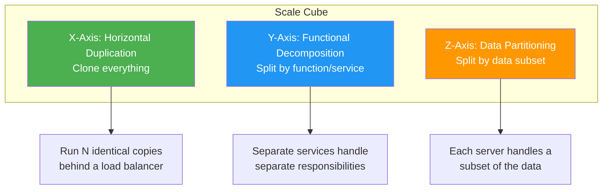
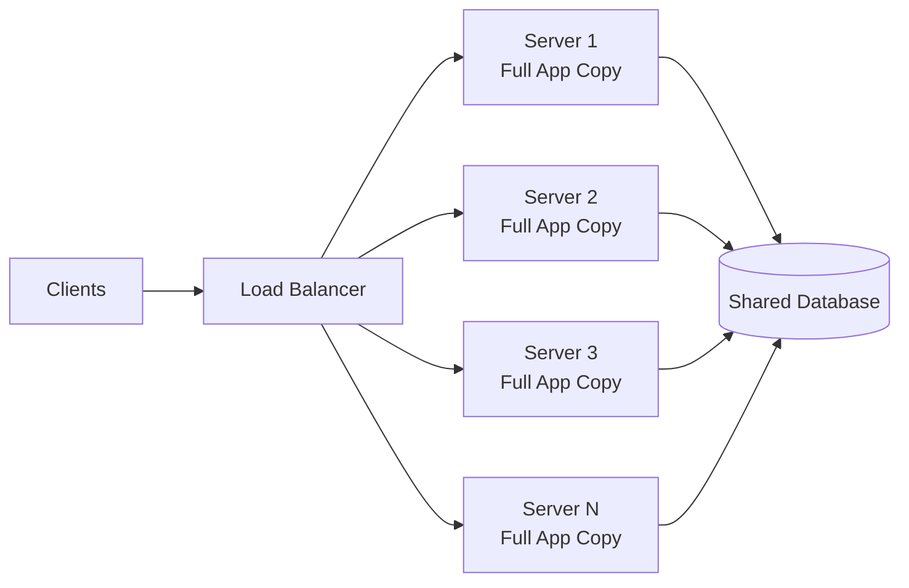
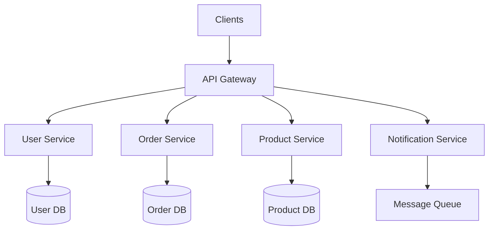
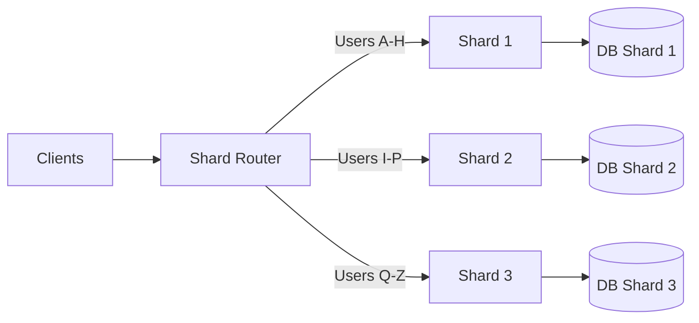
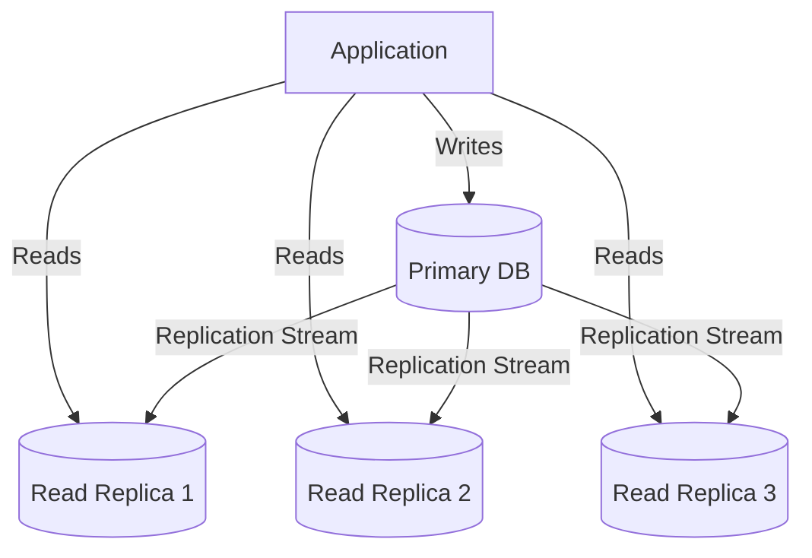
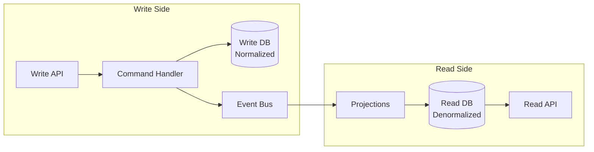
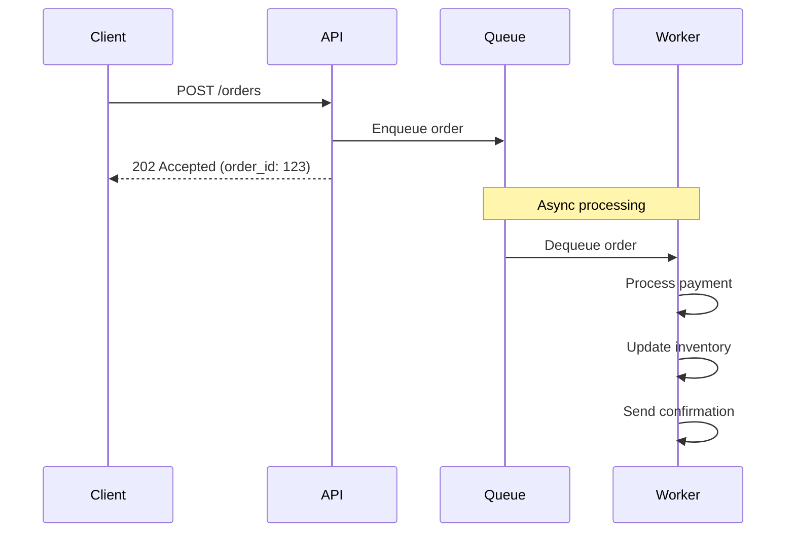
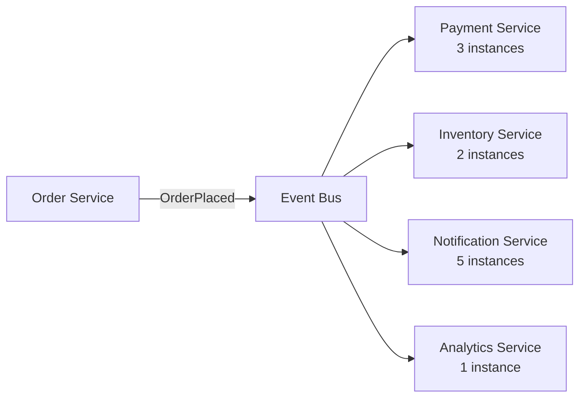
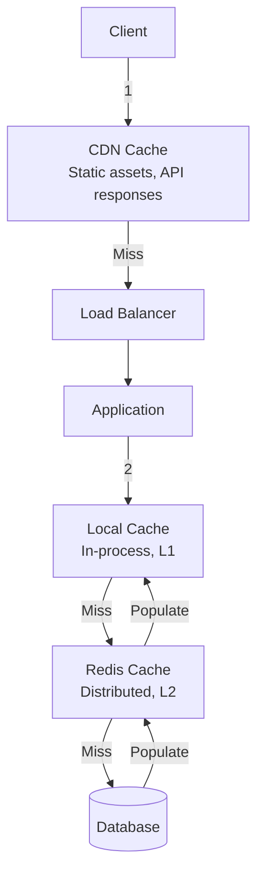
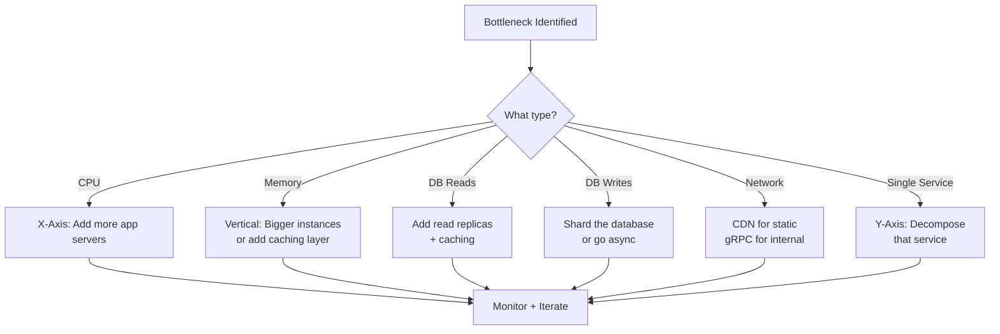

# Scalability Patterns

Scalability is the ability of a system to handle growing amounts of work by adding resources. It sounds simple until you realize that every layer of your architecture — application servers, databases, caches, message queues — has different bottlenecks and different strategies for scaling. A system that handles 100 requests per second will not magically handle 100,000 by doubling your server count. You need patterns.

This page covers the foundational scalability patterns that appear in every large-scale system. These are the building blocks you combine when designing systems that must grow from thousands to millions to billions of users.

## The Scale Cube

The Scale Cube, introduced by Martin Abbott and Michael Fisher in "The Art of Scalability," provides a three-dimensional model for thinking about scaling. Every scaling decision maps to one of these three axes.



### X-Axis Scaling: Horizontal Cloning

X-axis scaling is the simplest approach. Run N identical copies of your application behind a load balancer. Each instance handles a fraction of the total traffic. This is how you scale from 1 server to 10 to 100.



**When it works well:**
- Stateless application servers (store session state externally)
- CPU-bound workloads where more cores help linearly
- Read-heavy workloads with a shared database

**When it breaks down:**
- The database becomes the bottleneck (all clones share it)
- State is stored in-process (sticky sessions create imbalance)
- Write-heavy workloads that saturate a single database

```python
# Stateless application design enables X-axis scaling
# BAD: State stored in-process
class BadServer:
    def __init__(self):
        self.sessions = {}  # Dies with the process

    def handle_request(self, user_id, request):
        session = self.sessions.get(user_id)  # Only on THIS server
        return self.process(session, request)


# GOOD: State stored externally
class GoodServer:
    def __init__(self, redis_client):
        self.redis = redis_client  # Shared external store

    def handle_request(self, user_id, request):
        session = self.redis.get(f"session:{user_id}")  # Any server can read
        result = self.process(session, request)
        self.redis.set(f"session:{user_id}", session)
        return result
```

### Y-Axis Scaling: Functional Decomposition

Y-axis scaling splits your application by function. Instead of running copies of one monolith, you run separate services that each handle a specific responsibility. This is the core idea behind microservices.



**Benefits:**
- Each service can scale independently (order service needs more capacity during sales)
- Teams own their services (Conway's Law alignment)
- Technology diversity (use the right database for each service)
- Fault isolation (product service failure does not take down user service)

**Costs:**
- Network calls replace in-process function calls (latency, failure modes)
- Distributed transactions are hard (see our [distributed transactions](/system-design/distributed-systems/distributed-transactions) page)
- Operational complexity multiplies with service count

### Z-Axis Scaling: Data Partitioning

Z-axis scaling runs identical code but each server is responsible for only a subset of the data. This is sharding. Server 1 handles users A-M, Server 2 handles N-Z. Each server only stores and processes its partition.



**When to use Z-axis scaling:**
- Dataset is too large for a single database
- Write volume exceeds what a single node can handle
- You need data locality (geographic partitioning)
- Tenants need isolation (each tenant gets a shard)

For deep coverage of partitioning strategies, see [Data Partitioning Strategies](/system-design/patterns/data-partitioning).

### Combining the Axes

Real systems combine all three axes. A large e-commerce platform might:
- **Y-axis:** Separate order service, product service, user service
- **X-axis:** Run 20 replicas of the order service behind a load balancer
- **Z-axis:** Shard the order database by customer region

| Axis | What Changes | Scales | Example |
|------|-------------|--------|---------|
| X-Axis | Number of identical copies | Throughput | 10 app servers behind NGINX |
| Y-Axis | Responsibility per service | Complexity management | Order vs Product vs User services |
| Z-Axis | Data subset per node | Data volume + writes | Orders sharded by region |

## Horizontal vs Vertical Scaling

Before diving into specific patterns, this fundamental distinction shapes every decision.

| Aspect | Vertical (Scale Up) | Horizontal (Scale Out) |
|--------|---------------------|----------------------|
| Approach | Bigger machine | More machines |
| Cost curve | Exponential (2x CPU != 2x cost) | Linear (2x machines ~= 2x cost) |
| Ceiling | Hardware limits (~few TB RAM) | Theoretically unlimited |
| Complexity | Simple (one machine) | Complex (distributed systems) |
| Availability | Single point of failure | Built-in redundancy |
| Data consistency | Trivial (local) | Hard (distributed) |
| When to choose | Small-medium load, ACID needed | Large scale, read-heavy, global |

**The practical approach:** Start vertical. A single modern server with 64 cores and 256 GB RAM handles more than most startups need. Move horizontal when you hit limits or need high availability.

## Database Scaling Patterns

The database is almost always the first bottleneck. Application servers are stateless and easy to clone. Databases are stateful and hard to distribute.

### Pattern 1: Read Replicas

The most common first step. Most applications are read-heavy (90%+ reads). Replicate writes to follower databases, route reads to followers.



```python
class DatabaseRouter:
    """Route queries to primary or read replicas."""

    def __init__(self, primary_conn, replica_conns: list):
        self.primary = primary_conn
        self.replicas = replica_conns
        self._replica_index = 0

    def execute(self, query: str, requires_consistency: bool = False):
        if self._is_write(query):
            return self.primary.execute(query)

        if requires_consistency:
            # Read-your-writes: use primary for critical reads
            return self.primary.execute(query)

        # Round-robin across replicas
        replica = self.replicas[self._replica_index % len(self.replicas)]
        self._replica_index += 1
        return replica.execute(query)

    def _is_write(self, query: str) -> bool:
        return query.strip().upper().startswith(
            ("INSERT", "UPDATE", "DELETE", "CREATE", "ALTER", "DROP")
        )
```

**Replication lag caveat:** Replicas are eventually consistent. A user writes a comment and immediately refreshes — the comment might not appear if they hit a replica that has not received the write yet. Solutions:
- Read-your-writes: route the writing user to primary for a short window
- Synchronous replication (slower writes, stronger consistency)
- Track replication position and route to caught-up replicas

For replication deep dives, see [Database Replication](/system-design/databases/replication).

### Pattern 2: Command Query Responsibility Segregation (CQRS)

Separate the write model from the read model entirely. Writes go to a normalized database optimized for consistency. Reads come from a denormalized store optimized for query patterns.



**When CQRS makes sense:**
- Read and write patterns are dramatically different
- Read queries are complex joins that slow down the write database
- You need different scaling for reads vs writes
- Your domain model is complex (event sourcing fits naturally)

### Pattern 3: Database Sharding

When your data does not fit on a single node or write throughput exceeds a single master, you shard. Each shard holds a subset of the data.

| Strategy | How It Works | Best For | Watch Out For |
|----------|-------------|----------|---------------|
| Hash-based | `shard = hash(key) % N` | Even distribution | Resharding when adding nodes |
| Range-based | `shard = range(key)` | Range queries | Hot spots on recent data |
| Directory-based | Lookup table maps key to shard | Flexible routing | Lookup table is a bottleneck |
| Geographic | `shard = region(user)` | Data locality | Cross-region queries |

For complete sharding coverage, see [Sharding](/system-design/databases/sharding) and [Data Partitioning](/system-design/patterns/data-partitioning).

## Async Processing Patterns

Synchronous request-response is a scaling bottleneck. Every slow operation ties up a thread/connection. Async processing decouples producers from consumers and lets you handle load spikes with queues.

### Message Queue Decoupling



```python
import asyncio
from dataclasses import dataclass, field
from datetime import datetime
from enum import Enum
from typing import Any


class TaskPriority(Enum):
    LOW = 0
    NORMAL = 1
    HIGH = 2
    CRITICAL = 3


@dataclass
class AsyncTask:
    task_id: str
    task_type: str
    payload: dict
    priority: TaskPriority = TaskPriority.NORMAL
    created_at: datetime = field(default_factory=datetime.utcnow)
    retry_count: int = 0
    max_retries: int = 3


class AsyncTaskProcessor:
    """Process tasks asynchronously with priority and retry."""

    def __init__(self, queue_client, dead_letter_queue):
        self.queue = queue_client
        self.dlq = dead_letter_queue
        self.handlers: dict[str, Any] = {}

    def register_handler(self, task_type: str, handler):
        self.handlers[task_type] = handler

    async def submit(self, task: AsyncTask):
        """Submit a task for async processing. Returns immediately."""
        await self.queue.enqueue(task, priority=task.priority.value)

    async def process_loop(self):
        """Worker loop: dequeue and process tasks."""
        while True:
            task = await self.queue.dequeue()
            if task is None:
                await asyncio.sleep(0.1)
                continue

            try:
                handler = self.handlers.get(task.task_type)
                if not handler:
                    raise ValueError(f"No handler for {task.task_type}")
                await handler(task.payload)
                await self.queue.ack(task.task_id)

            except Exception as e:
                task.retry_count += 1
                if task.retry_count >= task.max_retries:
                    await self.dlq.enqueue(task)
                    await self.queue.ack(task.task_id)
                else:
                    # Exponential backoff
                    delay = 2 ** task.retry_count
                    await self.queue.nack(task.task_id, delay_seconds=delay)
```

### Event-Driven Scaling

Instead of one service doing everything, emit events and let consumers scale independently.



Each consumer scales based on its own throughput needs. Notification service might need 5 instances during a sale while analytics stays at 1.

For event-driven vs request-driven comparison, see [Event-Driven vs Request-Driven](/system-design/patterns/event-vs-request).

## Caching for Scale

Caching is the most impactful scalability pattern. A well-placed cache reduces database load by 90%+.

### Multi-Layer Caching



| Cache Layer | Latency | Capacity | Use Case |
|-------------|---------|----------|----------|
| CDN | ~10ms | Huge | Static assets, cacheable API responses |
| In-process (L1) | ~1us | Limited (RAM) | Hot data, computed values |
| Distributed (L2) | ~1ms | Large (Redis cluster) | Session data, query results |
| Database query cache | ~5ms | Medium | Repeated identical queries |

For caching strategies, see our [Caching Strategies](/system-design/caching/caching-strategies) page.

## Auto-Scaling Patterns

Static scaling wastes money (over-provisioned) or drops requests (under-provisioned). Auto-scaling adjusts capacity based on demand.

### Reactive Auto-Scaling

Scale based on observed metrics.

```python
@dataclass
class ScalingPolicy:
    metric: str          # "cpu_utilization", "queue_depth", "request_latency_p99"
    target_value: float  # Target value for the metric
    min_instances: int   # Never go below this
    max_instances: int   # Never go above this
    cooldown_seconds: int = 300  # Wait between scaling actions
    scale_up_threshold: float = 0.8    # Scale up when metric > target * 0.8
    scale_down_threshold: float = 0.3  # Scale down when metric < target * 0.3


class AutoScaler:
    def __init__(self, policy: ScalingPolicy):
        self.policy = policy
        self.current_instances = policy.min_instances
        self.last_scale_time = 0

    def evaluate(self, current_metric_value: float, current_time: float) -> int:
        """Return desired instance count."""
        if current_time - self.last_scale_time < self.policy.cooldown_seconds:
            return self.current_instances  # In cooldown

        target = self.policy.target_value

        if current_metric_value > target * self.policy.scale_up_threshold:
            # Scale up: proportional to how far over target
            ratio = current_metric_value / target
            desired = int(self.current_instances * ratio * 1.2)  # 20% headroom
        elif current_metric_value < target * self.policy.scale_down_threshold:
            # Scale down: remove excess capacity gradually
            desired = max(
                self.current_instances - 1,
                int(self.current_instances * 0.7)
            )
        else:
            return self.current_instances  # In range, do nothing

        # Clamp to bounds
        desired = max(self.policy.min_instances, min(self.policy.max_instances, desired))

        if desired != self.current_instances:
            self.last_scale_time = current_time
            self.current_instances = desired

        return self.current_instances
```

### Predictive Auto-Scaling

Scale based on predicted load. If you know traffic spikes at 9 AM every Monday, pre-scale at 8:45 AM instead of reacting at 9:05 AM when latency is already high.

| Strategy | Trigger | Latency | Best For |
|----------|---------|---------|----------|
| Reactive | Metric threshold crossed | 2-5 min to scale | Unpredictable traffic |
| Scheduled | Time-based rules | Pre-scaled | Predictable daily/weekly patterns |
| Predictive | ML model forecast | Pre-scaled | Learned patterns |
| Queue-based | Queue depth | Immediate work | Async workloads |

## Scaling Decision Framework

When you hit a bottleneck, use this decision tree:



## Scalability Anti-Patterns

| Anti-Pattern | Why It Fails | Fix |
|-------------|-------------|-----|
| Premature sharding | Operational nightmare before you need it | Start with read replicas, shard when forced |
| Session affinity | Creates hot spots, breaks during deployments | Externalize state to Redis |
| Synchronous chains | A->B->C->D, each adding latency | Async where possible, parallelize what you can |
| Shared database | All services coupled through one DB | Database-per-service (Y-axis) |
| No backpressure | Overloaded services crash instead of shedding load | Rate limiting + queue-based load leveling |
| Over-caching | Stale data, cache invalidation bugs | Cache what changes rarely, invalidate deliberately |
| Big-bang migration | Risky, long downtime | Strangler fig pattern, incremental migration |

## Real-World Scaling Journeys

### Instagram (2012, pre-Facebook acquisition)

- **3 engineers** supporting 30 million users
- **X-axis:** Amazon EC2 instances behind ELB
- **Database:** PostgreSQL with read replicas, then sharded by user ID
- **Caching:** Memcached for query results and sessions
- **Async:** Celery + RabbitMQ for feed generation, notifications
- **Lesson:** Simple architecture scales further than you think

### Twitter (2013, "Fail Whale" era to stability)

- Moved from Ruby monolith to JVM-based microservices
- **Fan-out-on-write:** Pre-compute timelines into Redis when a user tweets
- **Z-axis:** Sharded timeline cache by user ID
- **Problem:** Celebrity tweets fan out to millions (hot partition)
- **Fix:** Hybrid — fan-out for normal users, fan-out-on-read for celebrities

## Quick Reference: Which Pattern When

| Situation | First Move | Second Move | Third Move |
|-----------|-----------|-------------|------------|
| Traffic growing | X-axis: more servers | CDN + caching | Read replicas |
| Database CPU at 80% | Read replicas | Query optimization + caching | CQRS |
| Database disk full | Vertical (bigger disk) | Archive old data | Shard |
| Write throughput maxed | Async processing | Shard writes | Event sourcing |
| One service is slow | Optimize it | Y-axis: break it apart | Async decouple |
| Global users | CDN | Multi-region replicas | Z-axis: geo-shard |

## Cross-References

- [Data Partitioning Strategies](/system-design/patterns/data-partitioning) — deep dive into sharding approaches
- [Caching Strategies](/system-design/caching/caching-strategies) — cache-aside, write-through, write-behind
- [Load Balancing Algorithms](/system-design/load-balancing/algorithms) — how to distribute across clones
- [Message Queues](/system-design/message-queues/) — async processing infrastructure
- [Microservices vs Monolith](/system-design/patterns/microservices-vs-monolith) — Y-axis scaling trade-offs
- [Database Replication](/system-design/databases/replication) — read replica implementation details
- [Consistent Hashing](/system-design/distributed-systems/consistent-hashing) — hash ring for Z-axis scaling

---

*Scalability is not a binary state — it is a continuous practice of identifying bottlenecks and applying the right pattern at the right time. The best architects resist the urge to over-engineer day one and instead build systems that are easy to evolve as load grows.*
