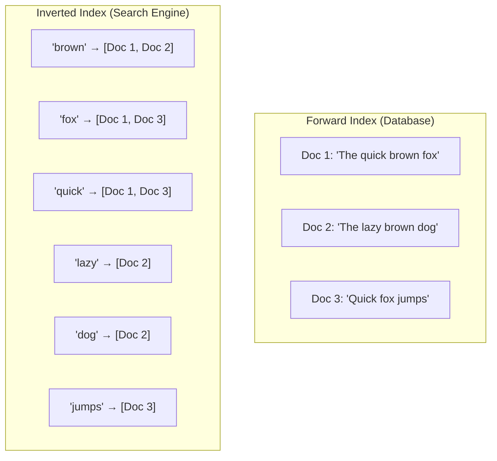
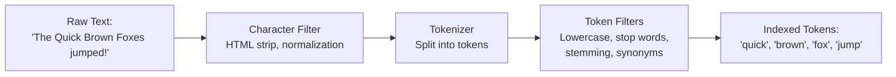
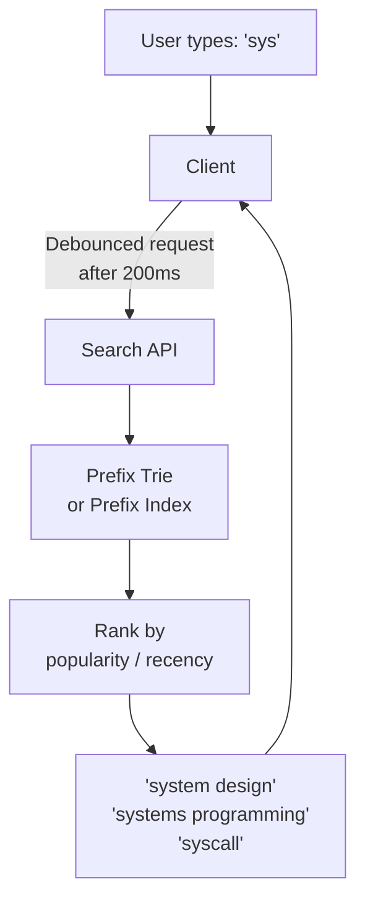
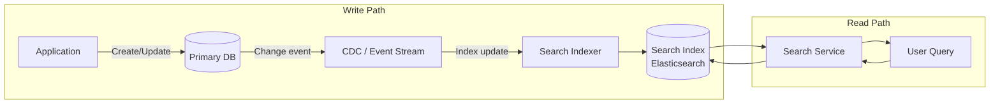
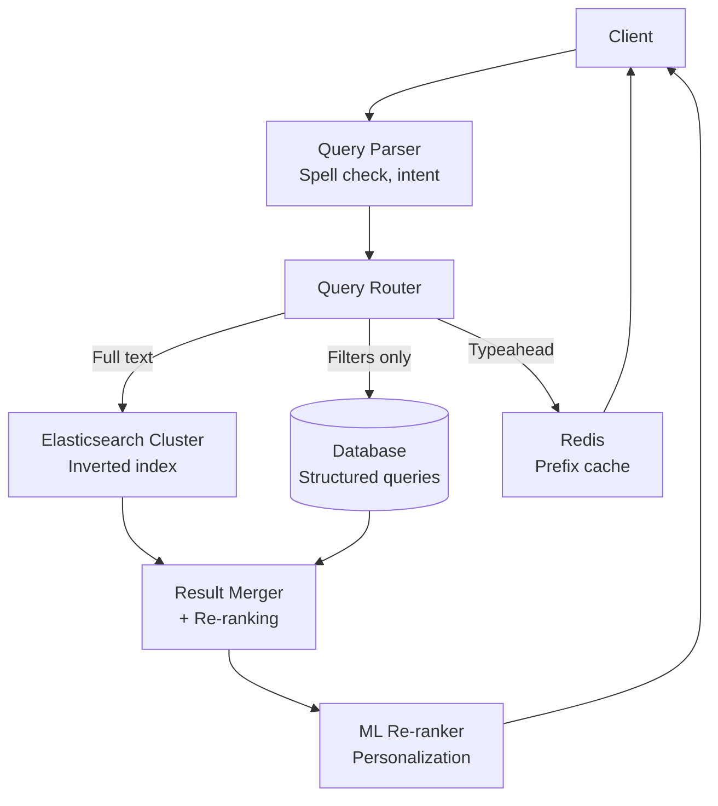

# Search System Patterns

Search is the primary way users interact with data at scale. Google processes 8.5 billion searches per day. Elasticsearch powers search for Wikipedia, GitHub, Netflix, and thousands of other companies. Behind every search box is a set of patterns: inverted indexes for fast lookup, tokenization for text normalization, ranking algorithms for relevance, and real-time indexing for freshness.

This page covers the building blocks of search systems. For a deep dive into Elasticsearch internals, see [Elasticsearch Internals](/system-design/databases/elasticsearch-internals).

## The Inverted Index

The inverted index is the fundamental data structure behind full-text search. Instead of mapping documents to words (forward index), it maps words to documents.



```python
from collections import defaultdict
from dataclasses import dataclass, field
from typing import Optional
import math


@dataclass
class Posting:
    """A single entry in the inverted index."""
    doc_id: str
    term_frequency: int
    positions: list[int] = field(default_factory=list)


class InvertedIndex:
    """Simplified inverted index with positional information."""

    def __init__(self):
        self.index: dict[str, list[Posting]] = defaultdict(list)
        self.doc_lengths: dict[str, int] = {}
        self.doc_count = 0

    def add_document(self, doc_id: str, text: str):
        """Index a document."""
        tokens = self._tokenize(text)
        self.doc_lengths[doc_id] = len(tokens)
        self.doc_count += 1

        # Count term frequencies and positions
        term_positions: dict[str, list[int]] = defaultdict(list)
        for pos, token in enumerate(tokens):
            term_positions[token].append(pos)

        # Add to inverted index
        for term, positions in term_positions.items():
            self.index[term].append(Posting(
                doc_id=doc_id,
                term_frequency=len(positions),
                positions=positions
            ))

    def search(self, query: str) -> list[tuple[str, float]]:
        """Search using BM25 ranking."""
        query_terms = self._tokenize(query)
        scores: dict[str, float] = defaultdict(float)

        avg_doc_length = (
            sum(self.doc_lengths.values()) / len(self.doc_lengths)
            if self.doc_lengths else 1
        )

        for term in query_terms:
            postings = self.index.get(term, [])
            df = len(postings)  # Document frequency

            for posting in postings:
                score = self._bm25_score(
                    tf=posting.term_frequency,
                    df=df,
                    doc_length=self.doc_lengths[posting.doc_id],
                    avg_doc_length=avg_doc_length
                )
                scores[posting.doc_id] += score

        # Sort by score descending
        return sorted(scores.items(), key=lambda x: x[1], reverse=True)

    def _bm25_score(self, tf: int, df: int, doc_length: int,
                     avg_doc_length: float, k1: float = 1.2, b: float = 0.75) -> float:
        """BM25 scoring formula."""
        idf = math.log((self.doc_count - df + 0.5) / (df + 0.5) + 1)
        tf_norm = (tf * (k1 + 1)) / (tf + k1 * (1 - b + b * doc_length / avg_doc_length))
        return idf * tf_norm

    def _tokenize(self, text: str) -> list[str]:
        """Simple tokenization — production systems use analyzers."""
        import re
        tokens = re.findall(r'\w+', text.lower())
        return tokens
```

## Tokenization Pipeline

Raw text must be transformed into searchable tokens through a pipeline of analyzers.



```python
import re
from abc import ABC, abstractmethod


class TokenFilter(ABC):
    @abstractmethod
    def apply(self, tokens: list[str]) -> list[str]:
        pass


class LowercaseFilter(TokenFilter):
    def apply(self, tokens: list[str]) -> list[str]:
        return [t.lower() for t in tokens]


class StopWordFilter(TokenFilter):
    STOP_WORDS = {"the", "a", "an", "is", "are", "was", "were", "in", "on",
                  "at", "to", "for", "of", "and", "or", "but", "not", "with"}

    def apply(self, tokens: list[str]) -> list[str]:
        return [t for t in tokens if t not in self.STOP_WORDS]


class StemmingFilter(TokenFilter):
    """Simplified Porter stemming (production: use nltk or Snowball)."""
    RULES = [
        ("ing", ""), ("tion", "t"), ("sion", "s"),
        ("ies", "y"), ("es", ""), ("s", ""),
        ("ed", ""), ("ly", ""),
    ]

    def apply(self, tokens: list[str]) -> list[str]:
        result = []
        for token in tokens:
            for suffix, replacement in self.RULES:
                if token.endswith(suffix) and len(token) > len(suffix) + 2:
                    token = token[:-len(suffix)] + replacement
                    break
            result.append(token)
        return result


class SynonymFilter(TokenFilter):
    SYNONYMS = {
        "quick": ["fast", "rapid", "speedy"],
        "big": ["large", "huge", "enormous"],
        "buy": ["purchase", "acquire"],
    }

    def apply(self, tokens: list[str]) -> list[str]:
        expanded = []
        for token in tokens:
            expanded.append(token)
            for syn in self.SYNONYMS.get(token, []):
                expanded.append(syn)
        return expanded


class TextAnalyzer:
    """Configurable text analysis pipeline."""

    def __init__(self, filters: list[TokenFilter] = None):
        self.filters = filters or [
            LowercaseFilter(),
            StopWordFilter(),
            StemmingFilter(),
        ]

    def analyze(self, text: str) -> list[str]:
        # Tokenize: split on non-word characters
        tokens = re.findall(r'\w+', text)

        # Apply filters in order
        for f in self.filters:
            tokens = f.apply(tokens)

        return tokens


# Example
analyzer = TextAnalyzer()
tokens = analyzer.analyze("The Quick Brown Foxes were jumping!")
print(tokens)  # ['quick', 'brown', 'fox', 'jump']
```

## BM25 Ranking

BM25 (Best Matching 25) is the standard ranking algorithm for full-text search. It scores documents based on term frequency (TF) and inverse document frequency (IDF), with document length normalization.

**The intuition:**
- **TF:** A document mentioning "database" 10 times is more relevant than one mentioning it once
- **IDF:** A rare term ("CockroachDB") is more discriminating than a common term ("system")
- **Length normalization:** Matching a query in a 100-word document is stronger than matching in a 10,000-word document

| Component | Formula | Effect |
|-----------|---------|--------|
| IDF | log((N - df + 0.5) / (df + 0.5) + 1) | Rare terms score higher |
| TF | (tf * (k1 + 1)) / (tf + k1 * norm) | Diminishing returns for repeated terms |
| Length norm | 1 - b + b * (docLen / avgDocLen) | Longer docs are penalized |

## Typeahead / Autocomplete

Typeahead provides suggestions as the user types, typically after 2-3 characters.



```python
from collections import defaultdict
from dataclasses import dataclass
from typing import Optional


@dataclass
class Suggestion:
    text: str
    score: float  # Popularity / relevance score
    category: Optional[str] = None


class PrefixTrie:
    """Trie-based typeahead with popularity scoring."""

    def __init__(self):
        self.children: dict[str, 'PrefixTrie'] = {}
        self.suggestions: list[Suggestion] = []
        self.is_end = False

    def insert(self, text: str, score: float, category: str = None):
        """Insert a suggestion into the trie."""
        node = self
        prefix = text.lower()

        for char in prefix:
            if char not in node.children:
                node.children[char] = PrefixTrie()
            node = node.children[char]

            # Store top-K suggestions at each prefix node
            suggestion = Suggestion(text=text, score=score, category=category)
            node.suggestions.append(suggestion)
            node.suggestions.sort(key=lambda s: s.score, reverse=True)
            node.suggestions = node.suggestions[:10]  # Keep top 10

        node.is_end = True

    def search(self, prefix: str, limit: int = 5) -> list[Suggestion]:
        """Find top suggestions for a prefix."""
        node = self
        for char in prefix.lower():
            if char not in node.children:
                return []
            node = node.children[char]
        return node.suggestions[:limit]


# Build typeahead index
trie = PrefixTrie()
trie.insert("system design", score=1000, category="topic")
trie.insert("systems programming", score=500, category="topic")
trie.insert("syscall", score=200, category="topic")
trie.insert("synchronization", score=300, category="topic")

results = trie.search("sys")
# Returns: system design (1000), systems programming (500), synchronization (300)
```

## Faceted Search

Faceted search lets users narrow results by categories (brand, price range, color). E-commerce search relies heavily on this.

```python
from collections import Counter, defaultdict
from dataclasses import dataclass


@dataclass
class FacetValue:
    value: str
    count: int


@dataclass
class SearchResult:
    doc_id: str
    score: float
    facets: dict[str, str]  # facet_name -> value


class FacetedSearch:
    """Search with facet aggregation and filtering."""

    def __init__(self, inverted_index):
        self.index = inverted_index
        self.facet_index: dict[str, dict[str, set]] = defaultdict(
            lambda: defaultdict(set)
        )

    def add_document(self, doc_id: str, text: str, facets: dict[str, str]):
        """Index document with facet values."""
        self.index.add_document(doc_id, text)
        for facet_name, facet_value in facets.items():
            self.facet_index[facet_name][facet_value].add(doc_id)

    def search(
        self,
        query: str,
        filters: dict[str, list[str]] = None,
        facet_fields: list[str] = None
    ) -> dict:
        """Search with optional facet filters and return facet counts."""
        # Full-text search
        results = self.index.search(query)
        result_doc_ids = {doc_id for doc_id, _ in results}

        # Apply facet filters
        if filters:
            for facet_name, allowed_values in filters.items():
                matching = set()
                for value in allowed_values:
                    matching |= self.facet_index[facet_name].get(value, set())
                result_doc_ids &= matching

        # Compute facet counts for remaining results
        facet_counts = {}
        for field in (facet_fields or []):
            counts = Counter()
            for value, doc_ids in self.facet_index[field].items():
                overlap = len(doc_ids & result_doc_ids)
                if overlap > 0:
                    counts[value] = overlap
            facet_counts[field] = [
                FacetValue(value=v, count=c)
                for v, c in counts.most_common()
            ]

        return {
            "results": [(did, score) for did, score in results if did in result_doc_ids],
            "facets": facet_counts,
            "total": len(result_doc_ids),
        }


# Usage: e-commerce product search
search = FacetedSearch(InvertedIndex())
search.add_document("prod_1", "Nike Air Max Running Shoes", {"brand": "Nike", "category": "Shoes", "color": "Black"})
search.add_document("prod_2", "Adidas Ultraboost Running Shoes", {"brand": "Adidas", "category": "Shoes", "color": "White"})
search.add_document("prod_3", "Nike Dri-FIT Running Shirt", {"brand": "Nike", "category": "Clothing", "color": "Blue"})

results = search.search(
    query="running",
    filters={"brand": ["Nike"]},
    facet_fields=["category", "color"]
)
# Results: prod_1, prod_3 (Nike running items)
# Facets: category=[Shoes:1, Clothing:1], color=[Black:1, Blue:1]
```

## Fuzzy Matching

Users make typos. Fuzzy matching finds results even when the query does not exactly match.

| Technique | How It Works | Example |
|-----------|-------------|---------|
| Edit distance (Levenshtein) | Min edits to transform one string to another | "aple" → "apple" (1 edit) |
| N-grams | Match overlapping character sequences | "database" → "dat", "ata", "tab", "aba", ... |
| Phonetic (Soundex/Metaphone) | Match by pronunciation | "Smith" matches "Smyth" |
| Prefix matching | Match beginning of terms | "data" matches "database" |

```python
def levenshtein_distance(s1: str, s2: str) -> int:
    """Calculate minimum edit distance between two strings."""
    if len(s1) < len(s2):
        return levenshtein_distance(s2, s1)

    if len(s2) == 0:
        return len(s1)

    prev_row = range(len(s2) + 1)
    for i, c1 in enumerate(s1):
        curr_row = [i + 1]
        for j, c2 in enumerate(s2):
            # Cost is 0 if characters match, 1 otherwise
            insertions = prev_row[j + 1] + 1
            deletions = curr_row[j] + 1
            substitutions = prev_row[j] + (c1 != c2)
            curr_row.append(min(insertions, deletions, substitutions))
        prev_row = curr_row

    return prev_row[-1]


class FuzzyMatcher:
    """Fuzzy matching using edit distance with a threshold."""

    def __init__(self, max_distance: int = 2):
        self.max_distance = max_distance
        self.terms: list[str] = []

    def add_terms(self, terms: list[str]):
        self.terms.extend(terms)

    def match(self, query: str) -> list[tuple[str, int]]:
        """Find terms within edit distance of query."""
        matches = []
        for term in self.terms:
            distance = levenshtein_distance(query.lower(), term.lower())
            if distance <= self.max_distance:
                matches.append((term, distance))
        return sorted(matches, key=lambda x: x[1])
```

## Real-Time Indexing

For search results to be fresh, new content must be indexed quickly after creation.



| Strategy | Indexing Delay | Complexity | Best For |
|----------|-------------|-----------|----------|
| Synchronous (write-through) | 0 (inline) | High (couples write to search) | Small scale, strong freshness |
| Async (queue-based) | Seconds | Medium | Most applications |
| CDC (change data capture) | Seconds-minutes | Medium | Database-centric apps |
| Batch reindex | Hours | Low | Analytics, initial migration |
| Near-real-time (NRT) | 1 second (Elasticsearch default) | Built-in | Elasticsearch users |

## Search Architecture for Scale



## Cross-References

- [Elasticsearch Internals](/system-design/databases/elasticsearch-internals) — detailed ES architecture
- [Communication Patterns](/system-design/patterns/communication-patterns) — real-time search via WebSocket
- [Caching Strategies](/system-design/caching/caching-strategies) — caching search results
- [Data Partitioning](/system-design/patterns/data-partitioning) — sharding search indexes
- [Distributed Logging](/system-design/patterns/distributed-logging) — logging search queries for analytics

---

*Search is a system design problem that touches every layer — data modeling, indexing, ranking, caching, and user experience. Start with a simple inverted index and BM25, add facets and fuzzy matching as needed, and invest in real-time indexing when freshness matters. Most importantly, measure what users actually search for and optimize for those patterns.*
