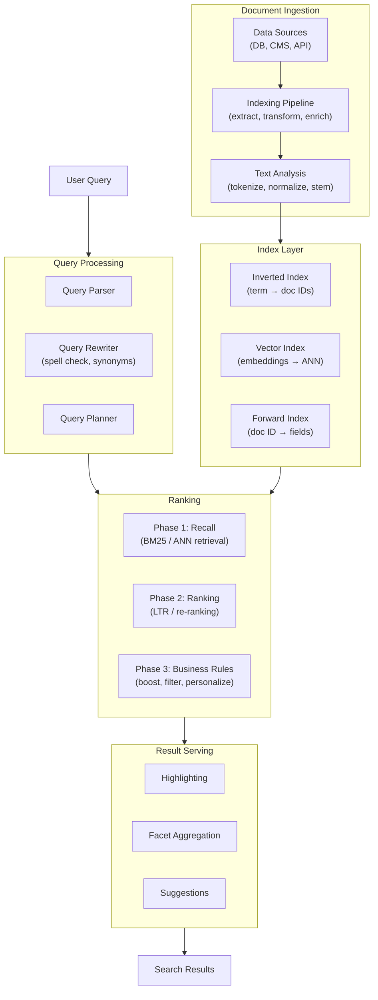
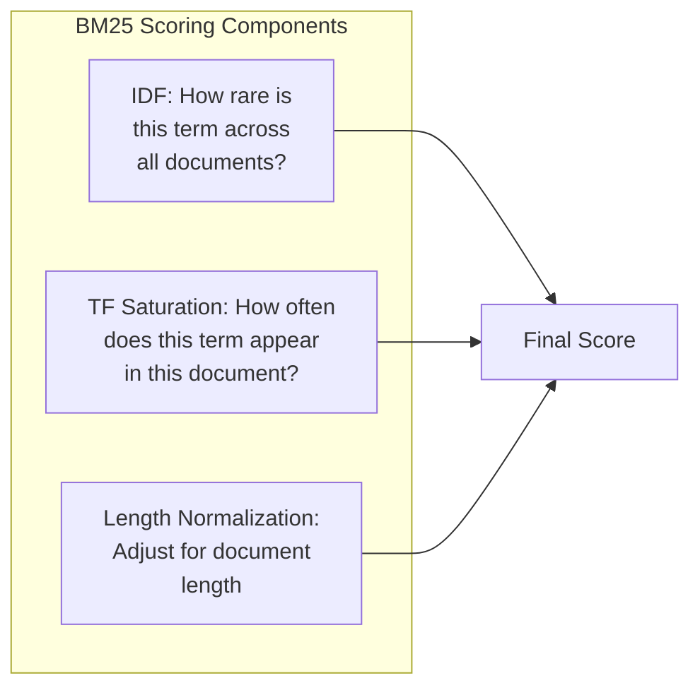
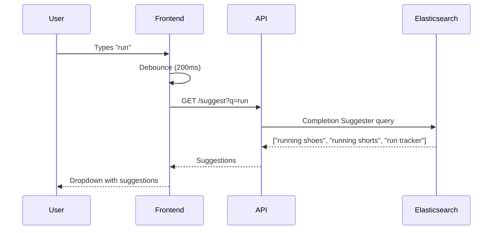
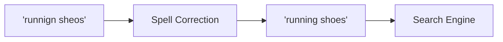
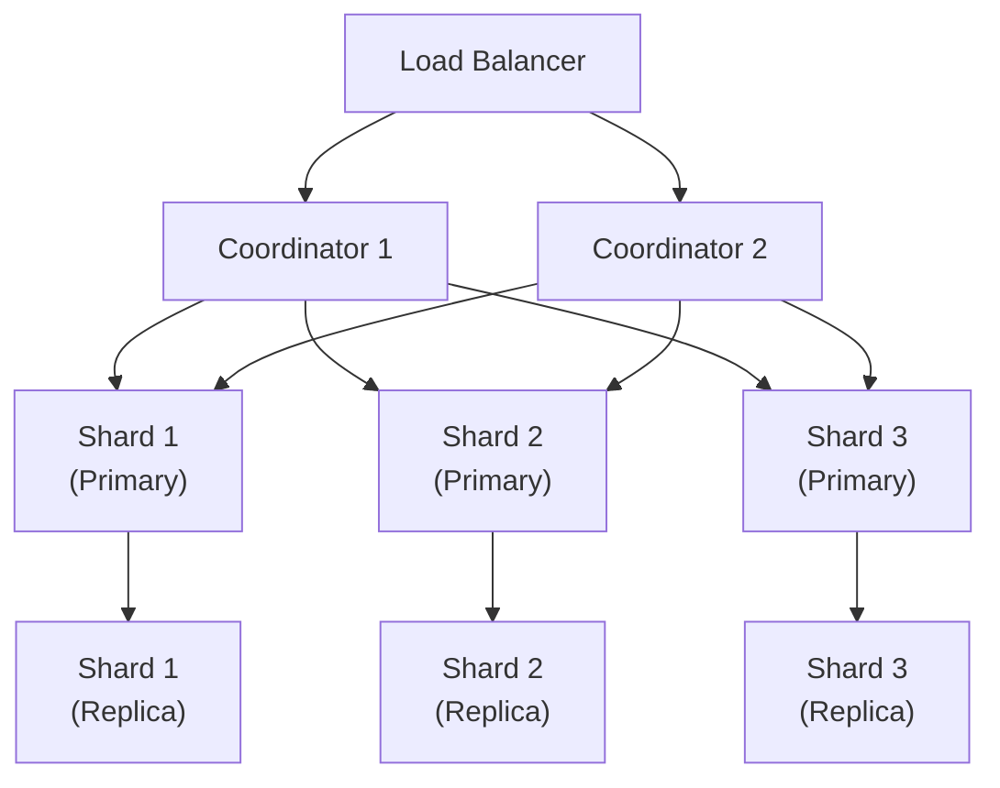

# Search Engineering

## Why Search Is Hard

Search looks simple from the outside: user types a query, results appear. Beneath that surface is one of the hardest problems in software engineering. A search system must simultaneously solve:

1. **Indexing** — organize terabytes of data so any query returns in milliseconds
2. **Relevance** — rank results by how well they match what the user *meant*, not just what they typed
3. **Speed** — return results in under 200ms, even under heavy load
4. **Freshness** — new content must be searchable within seconds
5. **Fault tolerance** — the system must stay available even when nodes fail

Every major tech company has a team (or multiple teams) dedicated entirely to search. This page covers the engineering foundations.

## Search Architecture Overview



## Indexing

### The Inverted Index

The inverted index is the foundational data structure of text search. Instead of mapping documents to terms (like a book's table of contents), it maps terms to documents (like a book's index at the back).

```
Forward index (document → terms):
  doc1: ["the", "quick", "brown", "fox"]
  doc2: ["the", "lazy", "brown", "dog"]
  doc3: ["quick", "fox", "jumps", "high"]

Inverted index (term → documents):
  "the"    → [doc1, doc2]
  "quick"  → [doc1, doc3]
  "brown"  → [doc1, doc2]
  "fox"    → [doc1, doc3]
  "lazy"   → [doc2]
  "dog"    → [doc2]
  "jumps"  → [doc3]
  "high"   → [doc3]
```

When a user searches for `quick fox`, the engine looks up both terms in the inverted index, finds the intersection (doc1, doc3), and returns those documents.

### Posting Lists

Each entry in the inverted index is called a **posting list** — a sorted list of document IDs and associated data (term frequency, field, position).

```
"quick" → [(doc1, tf=1, pos=[1]), (doc3, tf=1, pos=[0])]
"fox"   → [(doc1, tf=1, pos=[3]), (doc3, tf=1, pos=[1])]
```

Posting lists are compressed using techniques like delta encoding (store gaps between doc IDs instead of absolute IDs) and variable-byte encoding. Elasticsearch/Lucene uses the PForDelta (Patched Frame-of-Reference) encoding, achieving 1-2 bits per posting.

### Text Analysis Pipeline

Raw text must be processed before indexing. The analysis pipeline transforms input text into terms:


| Stage | Purpose | Example |
|-------|---------|---------|
| **Character filter** | Normalize raw text (strip HTML, map characters) | `&amp;` becomes `&` |
| **Tokenizer** | Split text into tokens | `"fox-jumps"` becomes `["fox", "jumps"]` |
| **Lowercase** | Case-insensitive matching | `"Quick"` becomes `"quick"` |
| **Stop word removal** | Remove high-frequency, low-value words | Remove `"the"`, `"a"`, `"is"` |
| **Stemming** | Reduce words to root form | `"running"` becomes `"run"` |
| **Synonyms** | Expand terms with equivalents | `"laptop"` also indexes `"notebook"` |

::: warning Analyzer at Index Time vs Query Time
The same analyzer (or a compatible one) must be applied at both index time and query time. If you stem `"running"` to `"run"` at index time but search for the literal `"running"` at query time, you will miss matches. Elasticsearch applies the same analyzer to both by default.
:::

### Elasticsearch Index Configuration

```json
{
  "settings": {
    "analysis": {
      "analyzer": {
        "product_analyzer": {
          "type": "custom",
          "tokenizer": "standard",
          "filter": [
            "lowercase",
            "english_stop",
            "english_stemmer",
            "product_synonyms"
          ]
        }
      },
      "filter": {
        "english_stop": {
          "type": "stop",
          "stopwords": "_english_"
        },
        "english_stemmer": {
          "type": "stemmer",
          "language": "english"
        },
        "product_synonyms": {
          "type": "synonym",
          "synonyms": [
            "laptop, notebook, portable computer",
            "phone, mobile, cell phone, smartphone"
          ]
        }
      }
    }
  },
  "mappings": {
    "properties": {
      "title": {
        "type": "text",
        "analyzer": "product_analyzer",
        "fields": {
          "keyword": { "type": "keyword" },
          "autocomplete": {
            "type": "text",
            "analyzer": "autocomplete_analyzer"
          }
        }
      },
      "description": {
        "type": "text",
        "analyzer": "product_analyzer"
      },
      "category": { "type": "keyword" },
      "price": { "type": "float" },
      "embedding": {
        "type": "dense_vector",
        "dims": 768,
        "index": true,
        "similarity": "cosine"
      }
    }
  }
}
```

## Relevance: Scoring and Ranking

### TF-IDF

Term Frequency-Inverse Document Frequency is the classical relevance scoring formula. The intuition: a term that appears frequently in a document (high TF) but rarely across all documents (high IDF) is highly relevant to that document.

```
TF(t, d)  = frequency of term t in document d
IDF(t)    = log(N / df(t))
            where N = total documents, df(t) = documents containing term t

Score(t, d) = TF(t, d) * IDF(t)
```

For a multi-term query, the scores are summed across terms:

```
Score(query, doc) = SUM over each term t in query: TF(t, doc) * IDF(t)
```

### BM25

BM25 (Best Matching 25) is the modern evolution of TF-IDF, used by default in Elasticsearch and Lucene. It addresses two problems with raw TF-IDF:

1. **Term frequency saturation** — in TF-IDF, a document with term frequency 100 scores much higher than one with frequency 10. BM25 adds a saturation curve so the benefit of additional occurrences diminishes.
2. **Document length normalization** — longer documents naturally have higher term frequencies. BM25 normalizes by document length.

```
BM25(t, d) = IDF(t) * (TF(t,d) * (k1 + 1)) / (TF(t,d) + k1 * (1 - b + b * |d|/avgdl))

Where:
  k1 = 1.2 (controls TF saturation — higher means TF matters more)
  b  = 0.75 (controls length normalization — 0 = no normalization, 1 = full)
  |d| = length of document d
  avgdl = average document length
```



::: tip Tuning BM25
The default `k1=1.2` and `b=0.75` work well for most use cases. If your documents vary wildly in length (e.g., product titles vs full-text articles), increase `b` toward 1.0 to penalize long documents more aggressively. If term frequency is less meaningful in your domain (e.g., each document mentions the key term once), decrease `k1` toward 0.5.
:::

### Vector Search (Semantic Search)

BM25 matches on exact terms. If a user searches for `"comfortable footwear"` and a document contains `"cozy shoes"`, BM25 finds no match because the terms don't overlap. Vector search solves this by comparing **meaning** instead of terms.

The process:

1. **Embed** documents and queries into high-dimensional vectors using a neural model (e.g., sentence-transformers, OpenAI embeddings)
2. **Index** vectors using an Approximate Nearest Neighbor (ANN) algorithm (HNSW, IVF, PQ)
3. **Query** by computing the query vector and finding the closest document vectors

```python
from sentence_transformers import SentenceTransformer

model = SentenceTransformer('all-MiniLM-L6-v2')

# At index time
doc_embedding = model.encode("Lightweight running shoes with extra cushioning")

# At query time
query_embedding = model.encode("comfortable footwear for jogging")

# Cosine similarity between these vectors will be high (~0.82)
# despite zero term overlap
```

### Hybrid Search: BM25 + Vectors

The best production search systems combine BM25 (lexical precision) with vector search (semantic recall). Elasticsearch supports this via the `knn` clause combined with a traditional `query`:

```json
{
  "query": {
    "bool": {
      "should": [
        {
          "multi_match": {
            "query": "comfortable running shoes",
            "fields": ["title^3", "description"],
            "type": "best_fields"
          }
        }
      ]
    }
  },
  "knn": {
    "field": "embedding",
    "query_vector": [0.12, -0.34, 0.56, ...],
    "k": 50,
    "num_candidates": 200,
    "boost": 0.5
  },
  "rank": {
    "rrf": {}
  }
}
```

The `rrf` (Reciprocal Rank Fusion) clause merges BM25 and vector results by combining their rank positions rather than their raw scores, which avoids the problem of incomparable score scales.

```
RRF_score(d) = SUM over each ranker r: 1 / (k + rank_r(d))

Where k = 60 (constant to prevent high-ranked documents from dominating)
```

## Autocomplete

### Architecture

Autocomplete must return suggestions in under 100ms — ideally under 50ms — as the user types each character. This requires specialized data structures and indexing strategies.



### Approach 1: Prefix Trie (In-Memory)

For small to medium vocabularies (< 1M terms), an in-memory prefix trie is the fastest approach:

```typescript
class TrieNode {
  children: Map<string, TrieNode> = new Map();
  suggestions: Array<{ text: string; score: number }> = [];
}

class AutocompleteTrie {
  private root: TrieNode = new TrieNode();
  private maxSuggestions: number;

  constructor(maxSuggestions: number = 10) {
    this.maxSuggestions = maxSuggestions;
  }

  insert(text: string, score: number): void {
    let node = this.root;
    const normalized = text.toLowerCase();

    for (const char of normalized) {
      if (!node.children.has(char)) {
        node.children.set(char, new TrieNode());
      }
      node = node.children.get(char)!;

      // Store top-K suggestions at each node for fast retrieval
      node.suggestions.push({ text, score });
      node.suggestions.sort((a, b) => b.score - a.score);
      if (node.suggestions.length > this.maxSuggestions) {
        node.suggestions.pop();
      }
    }
  }

  suggest(prefix: string): Array<{ text: string; score: number }> {
    let node = this.root;
    const normalized = prefix.toLowerCase();

    for (const char of normalized) {
      if (!node.children.has(char)) {
        return []; // No matches
      }
      node = node.children.get(char)!;
    }

    return node.suggestions;
  }
}

// Usage
const trie = new AutocompleteTrie(5);
trie.insert("running shoes", 1000);
trie.insert("running shorts", 800);
trie.insert("run tracker app", 500);
trie.insert("rubber duck", 200);

console.log(trie.suggest("run"));
// [{ text: "running shoes", score: 1000 },
//  { text: "running shorts", score: 800 },
//  { text: "run tracker app", score: 500 },
//  { text: "rubber duck", score: 200 }]
```

### Approach 2: Elasticsearch Completion Suggester

Elasticsearch provides a built-in completion suggester that uses a finite-state transducer (FST) stored entirely in memory. It is optimized for prefix-based completion:

```json
// Index mapping
{
  "mappings": {
    "properties": {
      "suggest": {
        "type": "completion",
        "contexts": [
          {
            "name": "category",
            "type": "category"
          }
        ]
      }
    }
  }
}

// Index a document
{
  "suggest": {
    "input": ["running shoes", "jogging shoes", "athletic footwear"],
    "weight": 1000,
    "contexts": {
      "category": "footwear"
    }
  }
}
```

```json
// Query: suggest completions for "run"
{
  "suggest": {
    "product-suggest": {
      "prefix": "run",
      "completion": {
        "field": "suggest",
        "size": 5,
        "fuzzy": {
          "fuzziness": 1
        },
        "contexts": {
          "category": "footwear"
        }
      }
    }
  }
}
```

### Approach 3: Edge N-Gram Analyzer

For search-as-you-type that matches against document content (not a predefined suggestion list), use an edge n-gram analyzer:

```json
{
  "settings": {
    "analysis": {
      "filter": {
        "edge_ngram_filter": {
          "type": "edge_ngram",
          "min_gram": 2,
          "max_gram": 15
        }
      },
      "analyzer": {
        "autocomplete_analyzer": {
          "type": "custom",
          "tokenizer": "standard",
          "filter": ["lowercase", "edge_ngram_filter"]
        },
        "autocomplete_search_analyzer": {
          "type": "custom",
          "tokenizer": "standard",
          "filter": ["lowercase"]
        }
      }
    }
  }
}
```

The `edge_ngram_filter` generates prefix tokens at index time:

```
"running" → ["ru", "run", "runn", "runni", "runnin", "running"]
```

At query time, the `autocomplete_search_analyzer` (without the n-gram filter) produces just `"running"`, which matches any of the indexed prefix tokens.

## Faceted Search

Faceted search lets users refine results by selecting values from categorized filters. Amazon, eBay, and every e-commerce site uses facets.

### Implementation

Facets are computed using aggregations that run alongside the search query:

```json
{
  "query": {
    "match": { "title": "running shoes" }
  },
  "aggs": {
    "brand_facet": {
      "terms": {
        "field": "brand.keyword",
        "size": 20
      }
    },
    "price_ranges": {
      "range": {
        "field": "price",
        "ranges": [
          { "to": 50 },
          { "from": 50, "to": 100 },
          { "from": 100, "to": 200 },
          { "from": 200 }
        ]
      }
    },
    "color_facet": {
      "terms": {
        "field": "color.keyword",
        "size": 10
      }
    },
    "avg_rating": {
      "avg": { "field": "rating" }
    }
  }
}
```

### The Post-Filter Problem

When a user selects a facet (e.g., `brand = "Nike"`), you want to filter the results but **not** filter the other facet counts. If you filter by Nike, the brand facet should still show all brands with their counts (so the user can switch brands), while the color facet should show only colors available for Nike products.

Elasticsearch's `post_filter` solves this:

```json
{
  "query": {
    "match": { "title": "running shoes" }
  },
  "post_filter": {
    "term": { "brand.keyword": "Nike" }
  },
  "aggs": {
    "all_brands": {
      "terms": { "field": "brand.keyword", "size": 20 }
    },
    "filtered_colors": {
      "filter": { "term": { "brand.keyword": "Nike" } },
      "aggs": {
        "colors": {
          "terms": { "field": "color.keyword", "size": 10 }
        }
      }
    }
  }
}
```

The `post_filter` is applied to the hits but not to the `all_brands` aggregation, so brand counts remain unfiltered. The `filtered_colors` aggregation applies the Nike filter explicitly.

## Fuzzy Matching

Users make typos. A search for `"runnign shoes"` should still return results for `"running shoes"`. Fuzzy matching handles this.

### Levenshtein Distance

The Levenshtein distance between two strings is the minimum number of single-character edits (insert, delete, substitute) to transform one into the other.

```
"running" → "runnign"  = distance 2 (swap i-g, swap g-n)
"running" → "runing"   = distance 1 (delete one 'n')
"running" → "sprinting" = distance 7 (too far for fuzzy match)
```

Elasticsearch supports fuzzy matching in queries:

```json
{
  "query": {
    "match": {
      "title": {
        "query": "runnign shoes",
        "fuzziness": "AUTO"
      }
    }
  }
}
```

`fuzziness: "AUTO"` applies edit distance based on term length:
- 0-2 characters: exact match
- 3-5 characters: edit distance 1
- 6+ characters: edit distance 2

### Phonetic Matching

For names and words where spelling varies but pronunciation is similar, phonetic algorithms map words to a phonetic code:

| Algorithm | Input | Code | Best For |
|-----------|-------|------|----------|
| **Soundex** | "Robert" | R163 | English names (legacy) |
| **Metaphone** | "Robert" | RBRT | English words |
| **Double Metaphone** | "Schmidt" | XMT, SMT | Multi-language names |
| **Beider-Morse** | "Schwarzenegger" | varies | Eastern European names |

```json
// Elasticsearch phonetic analyzer
{
  "settings": {
    "analysis": {
      "filter": {
        "phonetic_filter": {
          "type": "phonetic",
          "encoder": "double_metaphone",
          "replace": false
        }
      },
      "analyzer": {
        "phonetic_analyzer": {
          "tokenizer": "standard",
          "filter": ["lowercase", "phonetic_filter"]
        }
      }
    }
  }
}
```

## Learning to Rank (LTR)

BM25 is a general-purpose relevance function. It knows nothing about your specific domain, your users, or what "relevant" means for your product. Learning to Rank (LTR) uses machine learning to learn a ranking function from user behavior data.

### The Three Approaches

| Approach | Training | Objective | Example |
|----------|----------|-----------|---------|
| **Pointwise** | Score each document independently | Regression on relevance label | Predict a 1-5 relevance score |
| **Pairwise** | Compare document pairs | Correctly order pairs | RankNet, LambdaRank |
| **Listwise** | Optimize the entire ranked list | Maximize NDCG/MAP directly | LambdaMART, ListNet |

### Feature Engineering for LTR

LTR models take **features** as input. Features combine query-level, document-level, and query-document signals:

| Category | Features |
|----------|----------|
| **Query-document** | BM25 score, TF-IDF score, number of matching terms, term proximity |
| **Document** | Popularity (click count, sales), freshness (age), quality score, category |
| **Query** | Query length, number of terms, is navigational, has brand name |
| **User** | Location, past purchase history, preferred categories |

```python
# LambdaMART with LightGBM (simplified)
import lightgbm as lgb

# Training data: query-document pairs with relevance labels
# Features: [bm25_score, doc_popularity, price, query_match_ratio, ...]
# Labels: 0 (irrelevant), 1 (somewhat relevant), 2 (relevant), 3 (highly relevant)
# Groups: number of documents per query (for listwise training)

train_data = lgb.Dataset(
    features_train,
    label=labels_train,
    group=groups_train
)

params = {
    'objective': 'lambdarank',
    'metric': 'ndcg',
    'ndcg_eval_at': [5, 10],
    'num_leaves': 64,
    'learning_rate': 0.05,
    'min_data_in_leaf': 50,
}

model = lgb.train(params, train_data, num_boost_round=500)

# At query time: compute features for each candidate, predict score, sort
scores = model.predict(features_for_candidates)
ranked_results = sorted(zip(candidates, scores), key=lambda x: -x[1])
```

### Evaluation Metrics

| Metric | Formula | Measures |
|--------|---------|----------|
| **NDCG@K** | Normalized Discounted Cumulative Gain at position K | Quality of the top K results, accounting for position |
| **MRR** | Mean Reciprocal Rank = 1/position of first relevant result | How quickly users find what they need |
| **MAP** | Mean Average Precision | Overall precision across all recall levels |
| **Click-Through Rate** | Clicks / Impressions | User engagement (but biased by position) |

::: danger Position Bias in Click Data
Users click the first result more often regardless of relevance. If you train LTR on raw click data, the model learns to rank documents that happen to be at the top — a self-reinforcing loop. Address position bias by: (a) randomizing result order in a small percentage of queries, (b) using inverse propensity weighting, or (c) using pairwise clicks (user clicked result #3 but not result #2 implies #3 is more relevant).
:::

## Query Understanding

Raw user queries are messy. Users misspell words, use ambiguous terms, and often don't express what they actually want. Query understanding transforms the raw query into a better query before it reaches the search engine.

### Spell Correction



Two approaches:

1. **Isolated word correction** — correct each word independently using a dictionary and edit distance. Fast but misses context (`"bass fishing"` vs `"base fishing"`).

2. **Context-aware correction** — use language models or n-gram probabilities to pick the correction that makes the most sense in context.

```json
// Elasticsearch phrase suggester (context-aware)
{
  "suggest": {
    "text": "runnign sheos",
    "spell_check": {
      "phrase": {
        "field": "title",
        "size": 1,
        "gram_size": 3,
        "direct_generator": [{
          "field": "title",
          "suggest_mode": "always"
        }],
        "highlight": {
          "pre_tag": "<em>",
          "post_tag": "</em>"
        }
      }
    }
  }
}
// Response: "Did you mean: <em>running</em> <em>shoes</em>?"
```

### Synonym Expansion

```json
{
  "query": {
    "match": {
      "title": {
        "query": "laptop",
        "analyzer": "synonym_analyzer"
      }
    }
  }
}
// With synonym mapping: "laptop, notebook, portable computer"
// This query also matches documents containing "notebook" or "portable computer"
```

### Intent Classification

Not all queries are the same. Classifying intent helps route queries to the right search strategy:

| Intent | Example | Strategy |
|--------|---------|----------|
| **Navigational** | `"Nike Air Max 90"` | Exact product match, redirect |
| **Informational** | `"best running shoes 2026"` | Content search, reviews |
| **Transactional** | `"buy running shoes size 10"` | Product search with filters |
| **Local** | `"shoe store near me"` | Geospatial search |

```python
# Simple intent classifier using keyword patterns
def classify_intent(query: str) -> str:
    query_lower = query.lower()

    if any(word in query_lower for word in ['buy', 'order', 'purchase', 'price']):
        return 'transactional'
    if any(word in query_lower for word in ['best', 'review', 'comparison', 'how to']):
        return 'informational'
    if any(word in query_lower for word in ['near me', 'nearby', 'closest']):
        return 'local'
    # Check if query matches a known product/brand name
    if is_known_entity(query):
        return 'navigational'

    return 'transactional'  # Default for e-commerce
```

## Search System Architecture: Production Considerations

### Cluster Topology



| Concept | Purpose |
|---------|---------|
| **Shards** | Horizontally partition the index for parallelism. Each shard is an independent Lucene index. |
| **Replicas** | Copies of each shard for fault tolerance and read throughput. |
| **Coordinators** | Nodes that receive queries, scatter to shards, gather and merge results. |

### Shard Sizing Rules of Thumb

| Rule | Guidance |
|------|----------|
| Shard size | 10-50 GB per shard (Elasticsearch recommendation) |
| Shard count | Number of shards = data size / 30 GB |
| Replicas | At least 1 replica per shard for fault tolerance |
| Shards per node | Max 20 shards per GB of heap memory |

::: warning Over-Sharding Is the Most Common Mistake
Each shard consumes memory, file handles, and coordination overhead. An index with 100 shards containing 100 MB each performs far worse than an index with 5 shards containing 2 GB each. Start with fewer shards and add more only when query latency increases due to shard size.
:::

## Further Reading

- *"Introduction to Information Retrieval"* — Manning, Raghavan, Schutze (the canonical textbook)
- *"Relevant Search"* — Doug Turnbull, John Berryman (practical search relevance)
- Elasticsearch documentation: [elastic.co/guide](https://www.elastic.co/guide/en/elasticsearch/reference/current/index.html)
- Related Archon pages:
  - [Elasticsearch Internals](/system-design/databases/elasticsearch-internals) — Lucene segments, near real-time search, cluster mechanics
  - [Caching Strategies](/system-design/caching/caching-strategies) — caching search results for performance
  - [Load Balancing](/system-design/load-balancing/) — distributing search traffic across nodes
  - [API Design](/system-design/api-design/) — designing search API endpoints
  - [Event-Driven Architecture](/architecture-patterns/event-driven/) — event-driven indexing pipelines
  - [Stream Processing](/data-engineering/stream-processing/) — real-time document ingestion into search indexes
