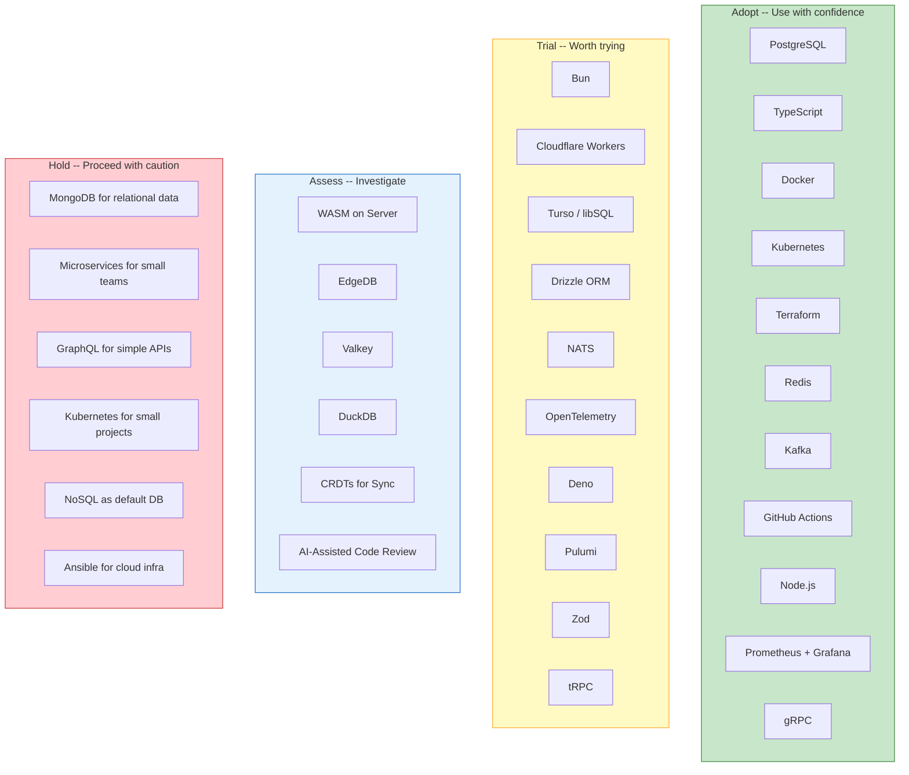

# Technology Radar

An opinionated assessment of technologies relevant to the Knowledge Vault, inspired by the [ThoughtWorks Technology Radar](https://www.thoughtworks.com/radar). This radar reflects recommendations for engineering teams building production systems in 2026.

## How to Read This Radar

Technologies are placed in four rings:

| Ring | Meaning | Action |
|------|---------|--------|
| **Adopt** | Proven in production, broadly recommended | Use with confidence for new projects |
| **Trial** | Worth trying on real projects with manageable risk | Use on a non-critical project first |
| **Assess** | Investigate and understand, not yet production-ready for most teams | Build a prototype, watch the ecosystem |
| **Hold** | Proceed with caution; may be overused, outdated, or risky | Do not start new projects with this; migrate away if possible |

Technologies are further categorized into four quadrants: **Languages & Frameworks**, **Infrastructure & Platforms**, **Data & Storage**, and **Techniques & Patterns**.

## Radar Visualization

---

## Adopt

These technologies have proven themselves in production at scale. We recommend them with confidence for new projects.

### PostgreSQL

**Quadrant**: Data & Storage

PostgreSQL is the default choice for relational data. Its combination of ACID compliance, extensibility (JSONB, full-text search, PostGIS), and performance under production workloads is unmatched in the open-source world.

- Battle-tested at every scale from startups to Fortune 500
- Rich ecosystem: logical replication, partitioning, pg_cron, pgvector
- Excellent observability with pg_stat_statements
- Managed offerings: AWS RDS/Aurora, GCP Cloud SQL, Supabase, Neon

**Vault references**: [PostgreSQL Internals](/system-design/databases/postgres-internals) | [Query Optimization](/performance/database-tuning/query-optimization) | [Indexing Deep Dive](/system-design/databases/indexing-deep-dive)

---

### TypeScript

**Quadrant**: Languages & Frameworks

TypeScript is the standard for any JavaScript project beyond trivial scripts. The type system catches entire categories of bugs at compile time, and the tooling (IDE support, refactoring, documentation) is superb.

- Use `strict: true` -- there is no reason not to
- Prefer union types over enums
- The ecosystem has fully embraced TypeScript (all major libraries ship types)

**Vault references**: [TypeScript Cheat Sheet](/cheat-sheets/typescript)

---

### Docker

**Quadrant**: Infrastructure & Platforms

Containers are the standard unit of deployment. Docker provides reproducible builds, consistent environments, and a clear contract between development and operations.

- Always use multi-stage builds for production images
- Pin base image digests in production
- Run as non-root user
- Use Alpine or distroless base images

**Vault references**: [Docker Section](/infrastructure/docker/) | [Docker Cheat Sheet](/cheat-sheets/docker)

---

### Kubernetes

**Quadrant**: Infrastructure & Platforms

Kubernetes is the standard for container orchestration at scale. The ecosystem (Helm, operators, service mesh, KEDA) is mature, and every cloud provider offers a managed version.

- Use managed K8s (EKS, GKE, AKS) unless you have specific requirements
- Always set resource requests and limits
- Use namespaces, RBAC, and network policies from day one
- See **Hold** for caveats about using K8s for small projects

**Vault references**: [Kubernetes Section](/infrastructure/kubernetes/) | [Kubernetes Cheat Sheet](/cheat-sheets/kubernetes) | [Production Checklist](/infrastructure/kubernetes/production-checklist)

---

### Terraform

**Quadrant**: Infrastructure & Platforms

Terraform remains the most widely adopted infrastructure-as-code tool. The provider ecosystem covers every major cloud and SaaS platform.

- Use remote state with locking from the start
- Structure code into modules for reusability
- Use `terraform plan` as a PR gate in CI
- Consider Pulumi (see Trial) if you want a general-purpose programming language instead of HCL

**Vault references**: [Terraform Section](/infrastructure/terraform/) | [Terraform Cheat Sheet](/cheat-sheets/terraform)

---

### Redis

**Quadrant**: Data & Storage

Redis is the go-to for caching, session storage, rate limiting, leaderboards, and pub/sub. Sub-millisecond latency and rich data structures make it indispensable.

- Use Redis for caching, not as a primary database
- Set an eviction policy (`allkeys-lru` for caches)
- Use Redis Streams instead of Pub/Sub when you need delivery guarantees
- Watch the Valkey fork (see Assess) following the Redis license change

**Vault references**: [Redis Internals](/system-design/databases/redis-internals) | [Redis Caching Patterns](/system-design/caching/redis-caching-patterns) | [Redis Cheat Sheet](/cheat-sheets/redis)

---

### Kafka

**Quadrant**: Data & Storage

Apache Kafka is the standard for event streaming at scale. Its durability, ordering guarantees, and throughput make it the backbone of event-driven architectures.

- Use Kafka when you need durable, ordered event streams
- Use consumer groups for horizontal scaling
- Consider managed Kafka (Confluent, AWS MSK) to avoid operational burden
- For simpler use cases, consider NATS (see Trial)

**Vault references**: [Kafka Internals](/system-design/message-queues/kafka-internals) | [Message Queues Overview](/system-design/message-queues/)

---

### GitHub Actions

**Quadrant**: Infrastructure & Platforms

GitHub Actions has become the default CI/CD platform for teams using GitHub. The marketplace, matrix builds, and reusable workflows cover most CI/CD needs.

- Use reusable workflows for DRY pipelines
- Pin action versions to commit SHAs, not tags
- Use OIDC for cloud authentication instead of long-lived secrets
- Implement environment protection rules for production deploys

**Vault references**: [GitHub Actions Deep Dive](/infrastructure/ci-cd/github-actions-deep-dive) | [CI/CD Section](/infrastructure/ci-cd/)

---

### Node.js

**Quadrant**: Languages & Frameworks

Node.js remains the dominant server-side JavaScript runtime. The ecosystem is massive, performance is strong for I/O-heavy workloads, and LTS releases provide stability.

- Use the current LTS version
- Understand the event loop to avoid blocking
- Use worker threads for CPU-intensive tasks
- Watch Bun and Deno (see Trial) as alternative runtimes

**Vault references**: [Node.js Event Loop](/performance/optimization/nodejs-event-loop) | [Node.js Profiling](/performance/profiling/nodejs-profiling) | [Worker Threads](/performance/optimization/worker-threads)

---

### Prometheus + Grafana

**Quadrant**: Infrastructure & Platforms

Prometheus for metrics collection and Grafana for visualization is the standard open-source observability stack. Pull-based architecture, PromQL, and the exporters ecosystem make it highly flexible.

- Use the RED method for services (Rate, Errors, Duration)
- Use the USE method for resources (Utilization, Saturation, Errors)
- Pair with OpenTelemetry (see Trial) for traces

**Vault references**: [Prometheus Deep Dive](/devops/monitoring/prometheus-deep-dive) | [Grafana Dashboards](/devops/monitoring/grafana-dashboards) | [Metrics Design](/devops/monitoring/metrics-design)

---

### gRPC

**Quadrant**: Languages & Frameworks

gRPC is the standard for high-performance service-to-service communication. Protocol Buffers provide strong typing, code generation, and efficient serialization.

- Use for internal service communication where performance matters
- REST is still better for public APIs (wider tooling, easier debugging)
- HTTP/2 multiplexing reduces connection overhead
- Bi-directional streaming is ideal for real-time data

**Vault references**: [gRPC Internals](/system-design/networking/grpc-internals) | [Communication Patterns](/architecture-patterns/microservices/communication-patterns)

---

## Trial

Worth trying on real projects. These technologies show strong promise and are gaining production adoption.

### Bun

**Quadrant**: Languages & Frameworks

Bun is a fast JavaScript runtime that bundles a package manager, bundler, and test runner. Significantly faster startup times than Node.js, native TypeScript execution, and Node.js API compatibility make it appealing.

**Why Trial**: Performance gains are real. Package installation is dramatically faster. However, ecosystem compatibility is not 100%, and some Node.js APIs behave differently. Production adoption is growing but still behind Node.js.

**Recommendation**: Try for new internal tools, scripts, and non-critical services. Monitor compatibility with your dependency graph.

---

### Cloudflare Workers

**Quadrant**: Infrastructure & Platforms

Edge computing with V8 isolates. Sub-millisecond cold starts, global deployment, and a growing platform (KV, D1, R2, Queues, Durable Objects).

**Why Trial**: The platform has matured significantly. D1 (SQLite at the edge) and Durable Objects enable stateful edge applications. The programming model is different from traditional servers but powerful.

**Recommendation**: Try for API gateways, auth middleware, A/B testing, and geographically-sensitive workloads.

**Vault references**: [Cloudflare Workers](/performance/edge-computing/cloudflare-workers) | [Edge Computing](/performance/edge-computing/)

---

### Turso / libSQL

**Quadrant**: Data & Storage

Turso brings SQLite to the edge with embedded replicas. Built on libSQL (a fork of SQLite), it offers per-tenant databases, millisecond-latency reads at the edge, and a serverless pricing model.

**Why Trial**: The embedded replica model is compelling -- your application reads from a local SQLite copy, and writes propagate through the network. Ideal for read-heavy, globally distributed applications.

**Recommendation**: Try for edge applications, multi-tenant SaaS, and mobile/offline-first architectures.

---

### Drizzle ORM

**Quadrant**: Languages & Frameworks

A TypeScript-first ORM that generates SQL you can see and understand. Zero overhead at runtime, excellent type inference, and a SQL-like query builder.

**Why Trial**: Compared to Prisma, Drizzle is lighter, faster, and more transparent. The SQL-like API means less mental translation between ORM calls and actual queries. Migrations are SQL-based.

**Recommendation**: Try for new TypeScript backend projects. Strong alternative to Prisma for teams that prefer SQL-centric development.

---

### NATS

**Quadrant**: Data & Storage

NATS is a lightweight, high-performance messaging system. Simpler than Kafka, with built-in JetStream for persistence, and native support for request-reply, pub-sub, and queue groups.

**Why Trial**: Much simpler to operate than Kafka. NATS JetStream provides persistence and exactly-once delivery. Ideal for teams that need messaging but do not need Kafka's scale or complexity.

**Recommendation**: Try for service-to-service communication, command dispatching, and event streaming at moderate scale.

**Vault references**: [NATS](/system-design/message-queues/nats)

---

### OpenTelemetry

**Quadrant**: Techniques & Patterns

A vendor-neutral observability framework for traces, metrics, and logs. OpenTelemetry is becoming the standard for instrumentation, replacing vendor-specific SDKs.

**Why Trial**: The specification is stable, and auto-instrumentation libraries cover most frameworks. Vendor lock-in is eliminated. The collector architecture is flexible.

**Recommendation**: Adopt for new projects. Migrate existing projects from vendor SDKs when practical.

---

### Deno

**Quadrant**: Languages & Frameworks

Deno is a secure-by-default runtime with native TypeScript support, web-standard APIs, and built-in tooling (formatter, linter, test runner, task runner).

**Why Trial**: Deno 2.0+ has excellent Node.js compatibility (npm packages work directly). The security model (explicit permissions) is genuinely better. Built-in tooling reduces dependency on external tools.

**Recommendation**: Try for new CLI tools, scripts, and services where Node.js compatibility is not critical. Deno Deploy is compelling for edge functions.

**Vault references**: [Deno Deploy](/performance/edge-computing/deno-deploy)

---

### Pulumi

**Quadrant**: Infrastructure & Platforms

Infrastructure as code using general-purpose programming languages (TypeScript, Python, Go, C#) instead of HCL. Full IDE support, testing with real test frameworks, and reusable components.

**Why Trial**: If your team is stronger in TypeScript than HCL, Pulumi removes the language barrier. Real programming constructs (loops, conditions, classes) are more expressive than HCL for complex infrastructure.

**Recommendation**: Try if your team struggles with HCL or needs advanced abstractions. Terraform is still the safer default due to ecosystem size.

---

### Zod

**Quadrant**: Languages & Frameworks

TypeScript-first schema validation with static type inference. Define a schema once, get runtime validation and compile-time types.

**Why Trial**: Zod has become the standard for runtime validation in TypeScript. Integrates with tRPC, React Hook Form, and most TypeScript frameworks. Eliminates the need for separate type definitions and validation schemas.

**Recommendation**: Adopt for any TypeScript project that validates external input (APIs, forms, configuration).

---

### tRPC

**Quadrant**: Languages & Frameworks

End-to-end type-safe APIs without code generation. The client infers types directly from the server router definition.

**Why Trial**: Eliminates the need for API documentation, code generation, or manual type synchronization. Changes to the API are immediately reflected in the client with compile-time errors. Works best in monorepo setups.

**Recommendation**: Try for TypeScript full-stack monorepos. Not suitable for public APIs or multi-language clients.

---

## Assess

Investigate these technologies. They show potential but are not yet mature enough for most production use cases.

### WebAssembly on the Server

**Quadrant**: Languages & Frameworks

WASM as a server-side execution environment (WASI). Component model promises language-agnostic, sandboxed, near-native-speed execution.

**Why Assess**: The WASI preview 2 and component model are still evolving. Production use cases exist (Cloudflare Workers, Fermyon Spin) but the ecosystem is nascent. The security sandbox model is compelling for multi-tenant platforms.

**Watch for**: WASI standard stabilization, broader language support, and toolchain maturity.

---

### EdgeDB

**Quadrant**: Data & Storage

A next-generation database built on PostgreSQL with a new query language (EdgeQL), built-in schema migrations, and a graph-relational data model.

**Why Assess**: EdgeQL is more expressive than SQL for complex queries involving relationships. The schema-first approach with built-in migrations is developer-friendly. However, it is a new database -- adoption and operational knowledge are limited.

**Watch for**: Production adoption stories, managed hosting options, and ecosystem growth.

---

### Valkey

**Quadrant**: Data & Storage

A community-driven fork of Redis, created after the Redis license change to the SSPL. Fully compatible with Redis protocol and commands.

**Why Assess**: Valkey has backing from AWS, Google, Oracle, and the Linux Foundation. If you are concerned about Redis licensing, Valkey is the direct replacement. Most Redis clients work without changes.

**Watch for**: Divergence from Redis features, cloud provider adoption as default, and community growth.

---

### DuckDB

**Quadrant**: Data & Storage

An in-process analytical database (OLAP). Embedded like SQLite but optimized for analytical queries on large datasets.

**Why Assess**: DuckDB can query Parquet, CSV, and JSON files directly. Excellent for data analysis, ETL pipelines, and local analytics. Not a replacement for PostgreSQL (OLTP) but a powerful complement.

**Watch for**: Production use cases beyond analytics, serverless/edge deployments, and ecosystem integrations.

---

### CRDTs for Real-Time Sync

**Quadrant**: Techniques & Patterns

Conflict-free Replicated Data Types for building collaborative, offline-capable applications without a central server for conflict resolution.

**Why Assess**: Libraries like Yjs and Automerge have matured. Real-time collaboration (like Google Docs) can be built without OT (Operational Transform) complexity. However, CRDT data structures have memory overhead, and not all data models map cleanly to CRDTs.

**Watch for**: Memory optimization, broader framework integration, and standardization.

**Vault references**: [CRDT Fundamentals](/system-design/distributed-systems/crdt-fundamentals)

---

### AI-Assisted Code Review

**Quadrant**: Techniques & Patterns

Using LLMs to augment human code review by identifying bugs, suggesting improvements, and checking for security vulnerabilities.

**Why Assess**: Tools have improved significantly but still produce false positives and miss context that human reviewers catch. Best used as a complement, not a replacement, for human review.

**Watch for**: Accuracy improvements, codebase-aware models, and integration with existing PR workflows.

---

## Hold

Proceed with caution. These are not inherently bad technologies, but they are frequently misused, overused, or there are better alternatives.

### MongoDB for Relational Data

**Quadrant**: Data & Storage

MongoDB is excellent for document-oriented workloads with denormalized data. However, using it for data that is fundamentally relational leads to pain: manual joins in application code, inconsistent denormalization, and lack of referential integrity.

**Recommendation**: If your data has relationships (users, orders, products), start with PostgreSQL. Use MongoDB only when your data is truly document-oriented (CMS content, product catalogs with varied schemas, event logs).

**Vault references**: [Database Selection Guide](/system-design/databases/database-selection-guide) | [MongoDB Internals](/system-design/databases/mongodb-internals)

---

### Microservices for Small Teams

**Quadrant**: Techniques & Patterns

Microservices introduce distributed systems complexity: network latency, partial failures, distributed transactions, data consistency, deployment coordination, and debugging across services. For teams smaller than 20-30 engineers, this complexity rarely pays off.

**Recommendation**: Start with a well-structured monolith. Decompose into services only when you have clear organizational or scaling boundaries. A modular monolith with clean domain boundaries gives you most benefits without the operational overhead.

**Vault references**: [Microservices Anti-Patterns](/architecture-patterns/microservices/anti-patterns) | [Decomposition Strategies](/architecture-patterns/microservices/decomposition-strategies)

---

### GraphQL for Simple APIs

**Quadrant**: Languages & Frameworks

GraphQL solves real problems: over-fetching, under-fetching, and the need for flexible client-driven queries. However, for simple CRUD APIs with a small number of clients, GraphQL adds significant complexity: schema design, resolver implementation, N+1 query prevention, authorization at field level, caching complexity, and file uploads.

**Recommendation**: Use REST for simple APIs with a few clients. Use GraphQL when you have multiple clients with different data needs, or when your frontend team needs to iterate independently from the backend. Consider tRPC (see Trial) for TypeScript monorepos.

---

### Kubernetes for Small Projects

**Quadrant**: Infrastructure & Platforms

Kubernetes is powerful but operationally heavy. For small projects (single service, a few hundred requests per second, small team), the operational overhead of K8s -- even managed -- exceeds the benefits.

**Recommendation**: For small projects, use a PaaS (Railway, Fly.io, Render), serverless (Lambda, Cloud Run), or simple VMs with Docker Compose. Graduate to Kubernetes when you have 5+ services, need advanced networking/scaling, or have a platform team to manage it.

**Vault references**: [ECS vs EKS](/infrastructure/aws/ecs-vs-eks) | [Cloud Run](/infrastructure/gcp/cloud-run)

---

### NoSQL as Default Database

**Quadrant**: Data & Storage

Defaulting to NoSQL because "it scales better" or "it is more flexible" leads to problems when your data has relationships, needs transactions, or requires complex queries. NoSQL databases have their strengths, but they are not a universal default.

**Recommendation**: Default to PostgreSQL. Choose NoSQL when you have a specific need: Redis for caching, Elasticsearch for search, DynamoDB for single-digit-millisecond key-value at extreme scale, or MongoDB for genuinely schema-flexible documents.

**Vault references**: [Database Selection Guide](/system-design/databases/database-selection-guide)

---

### Ansible for Cloud Infrastructure

**Quadrant**: Infrastructure & Platforms

Ansible is excellent for configuration management (installing packages, managing files, configuring services on existing servers). However, using Ansible to provision cloud infrastructure (VPCs, load balancers, databases) is inferior to Terraform: no state management, no plan/apply workflow, and limited drift detection.

**Recommendation**: Use Terraform for cloud infrastructure provisioning. Use Ansible (if needed) for OS-level configuration management, or better yet, bake everything into Docker images and use immutable infrastructure.

---

## Radar Summary Table

| Technology | Ring | Quadrant | Key Takeaway |
|-----------|------|----------|-------------|
| PostgreSQL | Adopt | Data & Storage | Default for relational data |
| TypeScript | Adopt | Languages & Frameworks | Standard for JavaScript projects |
| Docker | Adopt | Infrastructure & Platforms | Standard deployment unit |
| Kubernetes | Adopt | Infrastructure & Platforms | Standard orchestration at scale |
| Terraform | Adopt | Infrastructure & Platforms | Standard IaC tool |
| Redis | Adopt | Data & Storage | Standard for caching and ephemeral data |
| Kafka | Adopt | Data & Storage | Standard for event streaming at scale |
| GitHub Actions | Adopt | Infrastructure & Platforms | Default CI/CD for GitHub teams |
| Node.js | Adopt | Languages & Frameworks | Dominant server-side JS runtime |
| Prometheus + Grafana | Adopt | Infrastructure & Platforms | Standard open-source observability |
| gRPC | Adopt | Languages & Frameworks | Standard for internal service communication |
| Bun | Trial | Languages & Frameworks | Fast JS runtime, growing ecosystem |
| Cloudflare Workers | Trial | Infrastructure & Platforms | Edge computing with V8 isolates |
| Turso / libSQL | Trial | Data & Storage | SQLite at the edge |
| Drizzle ORM | Trial | Languages & Frameworks | Lightweight TypeScript ORM |
| NATS | Trial | Data & Storage | Simple, fast messaging |
| OpenTelemetry | Trial | Techniques & Patterns | Vendor-neutral observability |
| Deno | Trial | Languages & Frameworks | Secure runtime with built-in tools |
| Pulumi | Trial | Infrastructure & Platforms | IaC with real programming languages |
| Zod | Trial | Languages & Frameworks | TypeScript schema validation |
| tRPC | Trial | Languages & Frameworks | End-to-end type-safe APIs |
| WASM on Server | Assess | Languages & Frameworks | Sandboxed, polyglot execution |
| EdgeDB | Assess | Data & Storage | Graph-relational database on PostgreSQL |
| Valkey | Assess | Data & Storage | Community Redis fork |
| DuckDB | Assess | Data & Storage | Embedded analytical database |
| CRDTs | Assess | Techniques & Patterns | Conflict-free collaborative data |
| AI Code Review | Assess | Techniques & Patterns | LLM-augmented reviews |
| MongoDB for relational data | Hold | Data & Storage | Use PostgreSQL instead |
| Microservices for small teams | Hold | Techniques & Patterns | Start with modular monolith |
| GraphQL for simple APIs | Hold | Languages & Frameworks | REST or tRPC for simple cases |
| K8s for small projects | Hold | Infrastructure & Platforms | Use PaaS or Docker Compose |
| NoSQL as default | Hold | Data & Storage | Default to PostgreSQL |
| Ansible for cloud infra | Hold | Infrastructure & Platforms | Use Terraform instead |

---

## How This Radar Was Built

This radar reflects the collective experience documented across the 424 pages of the Knowledge Vault. Placement is based on:

1. **Production evidence**: Is the technology proven in real-world production systems at scale?
2. **Ecosystem maturity**: Are there sufficient libraries, documentation, and community support?
3. **Operational overhead**: What is the cost of running and maintaining this technology?
4. **Team adoption**: How easy is it for a typical engineering team to adopt and become productive?
5. **Strategic direction**: Is the technology gaining or losing momentum in the industry?

The radar is reviewed quarterly. Technologies move between rings as the ecosystem evolves.

---

::: info Disclaimer
This radar represents opinionated recommendations based on the patterns and practices documented in this Knowledge Vault. Your specific context -- team expertise, existing infrastructure, regulatory requirements, and business constraints -- should always factor into technology decisions. There is no universally correct choice.
:::
