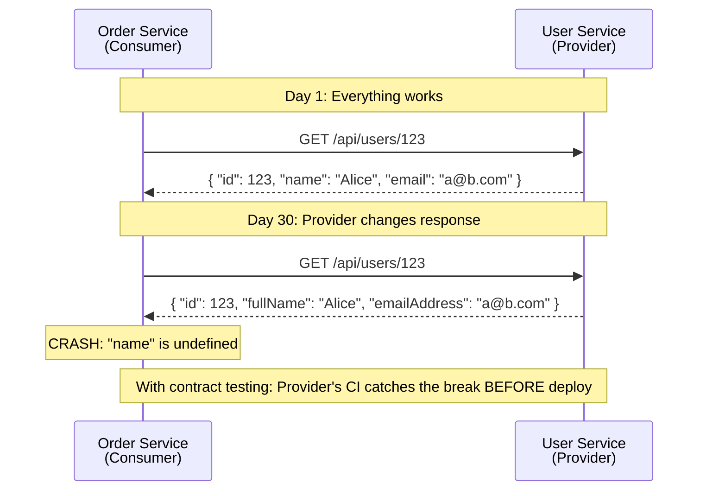
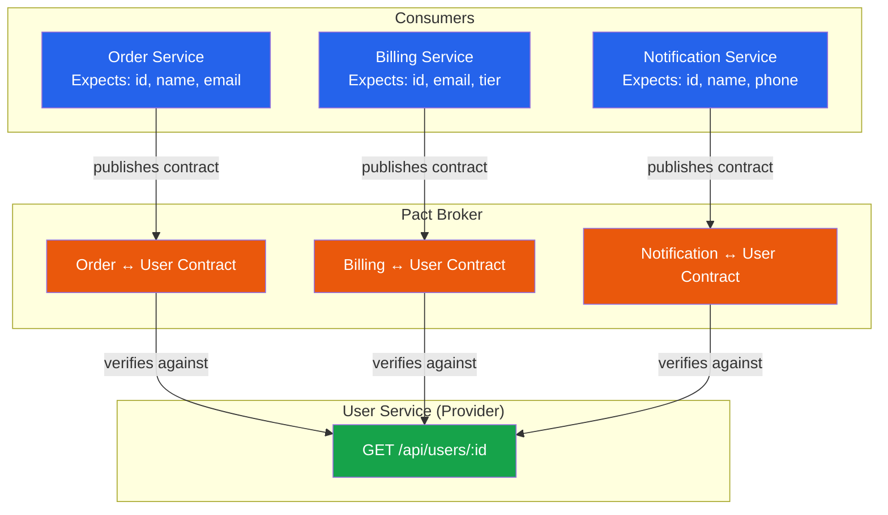
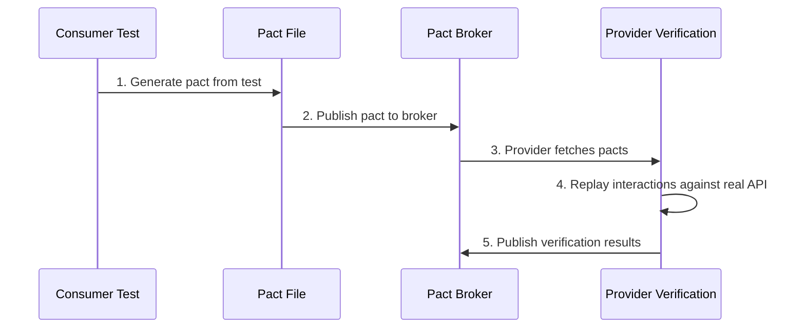
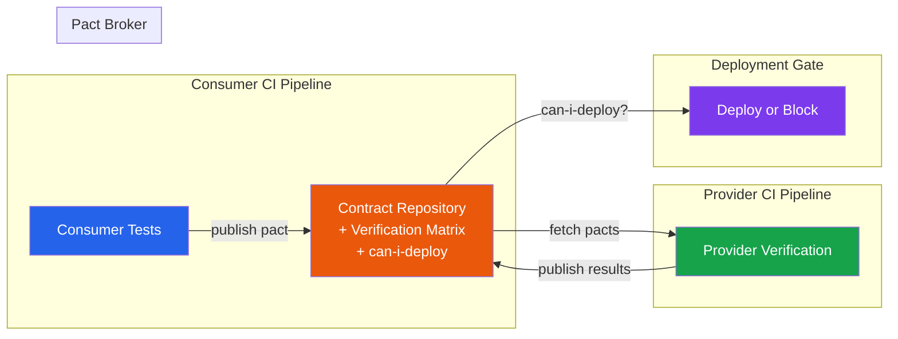
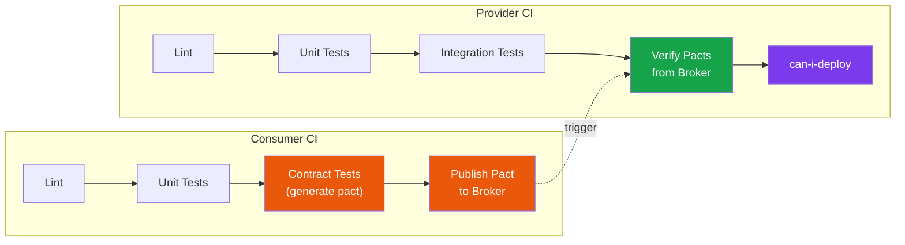

# Contract Testing

In a [microservices architecture](/architecture-patterns/microservices/), every service depends on the APIs of other services. When Service A calls Service B's `/api/users/{id}` endpoint, both services need to agree on the shape of the request and response. That agreement is the *contract*.

The problem is that contracts break silently. Service B adds a required field, renames a property, or changes a date format, and Service A starts failing — often in production, often at 2 AM. Integration tests catch some of these problems, but they require all services to be running simultaneously, making them slow, expensive, and hard to maintain.

Contract testing solves this by verifying the agreement between consumer and provider independently, without requiring them to run together.

## The Problem Contract Testing Solves



### Contract Testing vs Integration Testing

| Aspect | Integration Testing | Contract Testing |
|--------|-------------------|-----------------|
| **Requires running services** | Yes — both consumer and provider must be up | No — tested independently |
| **Speed** | Slow (network calls, containers) | Fast (runs locally) |
| **Failure isolation** | Hard — which service caused the failure? | Clear — consumer or provider |
| **Environment** | Needs shared test environment | Runs in CI without shared infra |
| **Confidence** | High for happy path | High for API shape, not business logic |
| **Maintenance** | High — environment drift, data management | Low — contracts are versioned artifacts |
| **When to use** | Critical cross-service flows | Every service-to-service boundary |

::: tip Contract Tests Complement Integration Tests
Contract tests do not replace integration tests. They verify the *shape* of communication (fields, types, status codes) but not the *behavior* (does the query return the right user?). Use contract tests to catch structural breakages early, and targeted integration tests for critical behavioral flows.
:::

## Consumer-Driven Contracts

The most effective form of contract testing is **consumer-driven contracts (CDC)**. The consumer defines what it expects from the provider, and the provider verifies that it can satisfy those expectations.

### Why Consumer-Driven?

The consumer knows what it needs. The provider does not know what every consumer uses. If the provider defines the contract, it has no way of knowing that renaming `name` to `fullName` will break three downstream services. But if each consumer defines its expectations, the provider can verify all of them before deploying.



## Pact Framework Deep Dive

Pact is the de facto standard for consumer-driven contract testing. It supports JavaScript, TypeScript, Python, Go, Java, Ruby, and .NET.

### How Pact Works

The Pact workflow has four steps:

1. **Consumer writes a test** that defines the expected interaction (request + response)
2. **Pact generates a contract file** (a JSON "pact") from the consumer test
3. **Contract is published** to a Pact Broker (shared artifact repository)
4. **Provider verifies** the contract by replaying the interactions against its real API



### Consumer Side (TypeScript)

The consumer writes a test that describes what it expects from the provider:

```typescript
import { PactV4, MatchersV3 } from '@pact-foundation/pact';
import { describe, it, expect } from 'vitest';
import { UserApiClient } from './user-api-client';

const { like, eachLike, uuid, email } = MatchersV3;

const provider = new PactV4({
  consumer: 'OrderService',
  provider: 'UserService',
  dir: './pacts',
});

describe('UserApiClient', () => {
  it('fetches a user by ID', async () => {
    // Define the expected interaction
    await provider
      .addInteraction()
      .given('a user with ID usr-1 exists')
      .uponReceiving('a request to get user usr-1')
      .withRequest('GET', '/api/users/usr-1', (builder) => {
        builder.headers({
          Accept: 'application/json',
          Authorization: like('Bearer token-123'),
        });
      })
      .willRespondWith(200, (builder) => {
        builder
          .headers({ 'Content-Type': 'application/json' })
          .jsonBody({
            id: like('usr-1'),
            name: like('Alice'),
            email: email('alice@example.com'),
            tier: like('premium'),
          });
      })
      .executeTest(async (mockServer) => {
        // Use the mock server as the provider
        const client = new UserApiClient(mockServer.url);
        const user = await client.getUserById('usr-1');

        expect(user.id).toBe('usr-1');
        expect(user.name).toBe('Alice');
        expect(user.email).toBe('alice@example.com');
      });
  });

  it('returns 404 for unknown user', async () => {
    await provider
      .addInteraction()
      .given('no user with ID usr-999 exists')
      .uponReceiving('a request to get nonexistent user')
      .withRequest('GET', '/api/users/usr-999')
      .willRespondWith(404, (builder) => {
        builder.jsonBody({
          error: like('not_found'),
          message: like('User not found'),
        });
      })
      .executeTest(async (mockServer) => {
        const client = new UserApiClient(mockServer.url);

        await expect(client.getUserById('usr-999')).rejects.toThrow(
          'User not found'
        );
      });
  });
});
```

### Pact Matchers

Pact matchers are crucial. They allow you to verify the *shape* of data without hardcoding exact values:

| Matcher | What It Verifies | Example |
|---------|-----------------|---------|
| `like(value)` | Same type as example | `like("Alice")` matches any string |
| `eachLike(value)` | Array where each element matches | `eachLike({ id: like("1") })` |
| `regex(value, pattern)` | Matches regex | `regex("2026-01-01", "\\d{4}-\\d{2}-\\d{2}")` |
| `email()` | Valid email format | `email("a@b.com")` |
| `uuid()` | Valid UUID format | `uuid("550e8400...")` |
| `integer()` | Any integer | `integer(42)` |
| `decimal()` | Any decimal | `decimal(3.14)` |
| `boolean()` | Any boolean | `boolean(true)` |
| `datetime()` | ISO 8601 datetime | `datetime("2026-01-01T00:00:00Z")` |

::: warning Be Specific with Matchers
Using `like()` for everything defeats the purpose. If a field must be a UUID, use `uuid()`. If it must be an email, use `email()`. The more specific your matchers, the more breakages you catch.
:::

### Provider Side (TypeScript)

The provider verifies that it can satisfy all consumer contracts:

```typescript
import { Verifier } from '@pact-foundation/pact';
import { describe, it, beforeAll, afterAll } from 'vitest';
import { createApp } from './app';
import { seedDatabase, cleanDatabase } from './test-helpers';

describe('UserService Provider Verification', () => {
  let server: Server;

  beforeAll(async () => {
    const app = createApp();
    server = app.listen(0);
  });

  afterAll(() => {
    server.close();
  });

  it('satisfies all consumer contracts', async () => {
    const port = (server.address() as AddressInfo).port;

    await new Verifier({
      providerBaseUrl: `http://localhost:${port}`,
      pactBrokerUrl: process.env.PACT_BROKER_URL,
      provider: 'UserService',
      providerVersion: process.env.GIT_SHA,
      publishVerificationResult: !!process.env.CI,

      // State handlers set up preconditions
      stateHandlers: {
        'a user with ID usr-1 exists': async () => {
          await seedDatabase({
            users: [
              { id: 'usr-1', name: 'Alice', email: 'alice@example.com', tier: 'premium' },
            ],
          });
        },
        'no user with ID usr-999 exists': async () => {
          await cleanDatabase();
        },
      },
    }).verifyProvider();
  });
});
```

### Provider States

Provider states (the `given()` clause) are the mechanism for setting up test preconditions. They solve the problem of the provider needing specific data to satisfy consumer expectations.

```typescript
// Provider state handlers — run before each interaction
stateHandlers: {
  'a user with ID usr-1 exists': async () => {
    // Seed the database with the expected user
    await db.users.create({
      id: 'usr-1',
      name: 'Alice',
      email: 'alice@example.com',
      tier: 'premium',
    });
  },
  'user usr-1 has 3 orders': async () => {
    // Seed user and their orders
    await db.users.create({ id: 'usr-1', name: 'Alice' });
    await db.orders.createMany([
      { userId: 'usr-1', total: 5000 },
      { userId: 'usr-1', total: 3000 },
      { userId: 'usr-1', total: 7500 },
    ]);
  },
  'the system has no users': async () => {
    await db.users.deleteAll();
  },
},
```

### Python Consumer Example

```python
import atexit
import unittest
from pact import Consumer, Provider

pact = Consumer('OrderService').has_pact_with(
    Provider('UserService'),
    pact_dir='./pacts',
)
pact.start_service()
atexit.register(pact.stop_service)

class TestUserApiClient(unittest.TestCase):
    def test_get_user_by_id(self):
        expected = {
            "id": "usr-1",
            "name": "Alice",
            "email": "alice@example.com",
        }

        (pact
         .given("a user with ID usr-1 exists")
         .upon_receiving("a request to get user usr-1")
         .with_request("GET", "/api/users/usr-1")
         .will_respond_with(200, body=Like(expected)))

        with pact:
            client = UserApiClient(pact.uri)
            user = client.get_user_by_id("usr-1")

            self.assertEqual(user["name"], "Alice")
```

### Go Consumer Example

```go
func TestUserAPIClient(t *testing.T) {
    mockProvider, err := consumer.NewV4Pact(consumer.MockHTTPProviderConfig{
        Consumer: "OrderService",
        Provider: "UserService",
        PactDir:  "./pacts",
    })
    if err != nil {
        t.Fatal(err)
    }

    err = mockProvider.
        AddInteraction().
        Given("a user with ID usr-1 exists").
        UponReceiving("a request to get user usr-1").
        WithCompleteRequest(consumer.Request{
            Method: "GET",
            Path:   matchers.String("/api/users/usr-1"),
        }).
        WithCompleteResponse(consumer.Response{
            Status: 200,
            Body: matchers.MapMatcher{
                "id":    matchers.Like("usr-1"),
                "name":  matchers.Like("Alice"),
                "email": matchers.Like("alice@example.com"),
            },
        }).
        ExecuteTest(t, func(config consumer.MockServerConfig) error {
            client := NewUserAPIClient(config.URL)
            user, err := client.GetUserByID("usr-1")
            if err != nil {
                return err
            }
            if user.Name != "Alice" {
                return fmt.Errorf("expected Alice, got %s", user.Name)
            }
            return nil
        })

    if err != nil {
        t.Fatal(err)
    }
}
```

## The Pact Broker

The Pact Broker is the central repository where contracts are published and verification results are stored. It acts as the single source of truth for API compatibility.



### The can-i-deploy Check

The most powerful feature of the Pact Broker is `can-i-deploy`. Before deploying any service, you ask the broker: "Is this version of my service compatible with all its consumers and providers in production?"

```bash
# Before deploying UserService, check compatibility
pact-broker can-i-deploy \
  --pacticipant UserService \
  --version $(git rev-parse HEAD) \
  --to-environment production

# Output:
# COMPUTER SAYS YES
# All contracts verified successfully.
# UserService (abc123) -> OrderService (def456): VERIFIED
# UserService (abc123) -> BillingService (ghi789): VERIFIED
```

This becomes a mandatory CI gate — no service deploys unless `can-i-deploy` passes.

## Contract Testing for Events

Contract testing is not limited to HTTP APIs. Pact supports message-based contracts for event-driven systems using [message queues](/system-design/message-queues/) and [event-driven architectures](/architecture-patterns/event-driven/).

```typescript
// Consumer — expects to receive an OrderCreated event
await provider
  .addInteraction()
  .given('an order is placed')
  .expectsToReceive('an OrderCreated event')
  .withContent({
    type: like('order.created'),
    payload: {
      orderId: uuid(),
      userId: uuid(),
      total: integer(5000),
      currency: like('USD'),
      items: eachLike({
        productId: uuid(),
        quantity: integer(1),
        price: integer(2500),
      }),
    },
  })
  .executeTest(async (message) => {
    // Verify your consumer can process this message
    const handler = new OrderCreatedHandler();
    await handler.handle(JSON.parse(message.contents.toString()));
  });
```

## When Not to Use Contract Testing

Contract testing is powerful but not universal. Skip it when:

- **Single-team monolith** — You own both sides of the API. [Integration tests](/testing/integration-testing) are sufficient.
- **Third-party APIs** — You do not control the provider, so you cannot run provider verification. Use integration tests with recorded responses instead.
- **GraphQL** — Pact's HTTP-interaction model does not fit GraphQL's query-based approach well. Use schema validation tools instead.
- **Rapidly changing prototypes** — Contract tests add friction. Wait until API boundaries stabilize.

## CI Pipeline Integration



## Common Pitfalls

### 1. Over-specifying Contracts

```typescript
// BAD — hardcodes exact values, breaks on any change
.willRespondWith(200, (builder) => {
  builder.jsonBody({
    id: 'usr-1',                    // Exact value
    name: 'Alice Johnson',          // Exact value
    createdAt: '2026-01-15T10:00Z', // Exact timestamp
  });
})

// GOOD — specifies shape, not values
.willRespondWith(200, (builder) => {
  builder.jsonBody({
    id: like('usr-1'),
    name: like('Alice'),
    createdAt: datetime('2026-01-15T10:00:00Z', "yyyy-MM-dd'T'HH:mm:ss'Z'"),
  });
})
```

### 2. Testing Business Logic in Contracts

Contract tests verify *shape*, not *behavior*. Do not assert that the discount calculation is correct — that belongs in a unit test.

### 3. Ignoring Provider States

If your consumer test uses `given('a user exists')` but the provider does not implement a matching state handler, verification fails for the wrong reason. Keep state handler names explicit and consistent.

## Further Reading

- [Integration Testing](/testing/integration-testing) — when you need to test real behavior, not just API shape
- [Microservices Communication](/architecture-patterns/microservices/communication-patterns) — the architectural patterns that create the need for contract testing
- [Event Schema Evolution](/architecture-patterns/event-driven/event-schema-evolution) — managing breaking changes in event-driven contracts
- [API Gateway Pattern](/architecture-patterns/microservices/api-gateway-pattern) — where contract testing meets API gateways
- [Test Architecture](/testing/test-architecture) — organizing contract tests within your broader test strategy
