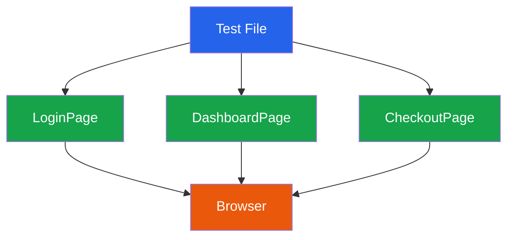

# End-to-End Testing

End-to-end tests verify that your entire system works from the user's perspective. They click buttons, fill forms, navigate pages, and assert that the right things appear on the screen — using a real browser, a real backend, and a real database. E2E tests sit at the top of the [testing pyramid](/testing/) because they provide the highest confidence that a user flow works, but they are also the slowest, most expensive, and most fragile tests you will write.

The discipline of E2E testing is knowing which flows deserve this level of verification and which do not.

## When to Write E2E Tests

E2E tests are expensive. Every E2E test you write is a test you must maintain, debug when flaky, and wait for in CI. Write them for:

- **Critical user journeys** — signup, login, checkout, payment, password reset
- **Flows that cross multiple services** — user creates an order, payment service processes it, notification service sends confirmation
- **Regression protection** — a bug that escaped to production and must never recur

Do *not* write E2E tests for:

- Validation logic (unit test it)
- API contract verification (use [contract tests](/testing/contract-testing))
- Edge cases (use [property-based tests](/testing/property-based-testing))
- Styling and layout details (use visual regression testing, covered below)

::: warning The E2E Trap
Teams that write too many E2E tests end up with suites that take 45+ minutes, flake constantly, and slow down every deploy. Aim for 10-30 E2E tests covering your critical paths, not hundreds covering every feature.
:::

## Playwright vs Cypress

These are the two dominant E2E testing frameworks. Here is how they compare:

| Feature | Playwright | Cypress |
|---------|-----------|---------|
| **Browser support** | Chromium, Firefox, WebKit | Chromium, Firefox, WebKit (limited) |
| **Multi-tab/window** | Full support | Not supported |
| **iframes** | Full support | Supported with workarounds |
| **Network interception** | Built-in route handler | Built-in `cy.intercept()` |
| **Parallel execution** | Built-in sharding | Requires Cypress Cloud (paid) |
| **Language** | TypeScript, JavaScript, Python, Java, C# | JavaScript, TypeScript only |
| **Auto-wait** | Built-in, configurable | Built-in |
| **Test isolation** | Browser context per test (fast) | Full page reload per test (slower) |
| **Debugging** | Trace viewer, VS Code extension | Time-travel debugger (excellent) |
| **Mobile emulation** | Device descriptors built-in | Viewport only |
| **Component testing** | Experimental | Mature |
| **Speed** | Very fast | Moderate |
| **Community** | Growing rapidly | Large, established |

### Recommendation

**Use Playwright** for new projects. It is faster, supports more browsers, handles complex scenarios (multi-tab, iframes), and has native parallelization. **Use Cypress** if your team already has significant Cypress investment, or if you value the time-travel debugger for complex debugging sessions.

## Playwright Fundamentals

### Basic Test Structure

```typescript
import { test, expect } from '@playwright/test';

test.describe('User Authentication', () => {
  test('user can sign up with valid credentials', async ({ page }) => {
    await page.goto('/signup');

    await page.getByLabel('Email').fill('newuser@example.com');
    await page.getByLabel('Password').fill('SecureP@ss123');
    await page.getByLabel('Confirm Password').fill('SecureP@ss123');
    await page.getByRole('button', { name: 'Create Account' }).click();

    // Assert redirect to dashboard
    await expect(page).toHaveURL('/dashboard');
    await expect(
      page.getByRole('heading', { name: 'Welcome' })
    ).toBeVisible();
  });

  test('shows error for invalid email', async ({ page }) => {
    await page.goto('/signup');

    await page.getByLabel('Email').fill('not-an-email');
    await page.getByLabel('Password').fill('SecureP@ss123');
    await page.getByRole('button', { name: 'Create Account' }).click();

    await expect(
      page.getByText('Please enter a valid email address')
    ).toBeVisible();
  });
});
```

### Locator Best Practices

Playwright's locator system determines how robust your tests are. Use locators that are resilient to implementation changes:

```typescript
// BEST — semantic, accessible, resilient
page.getByRole('button', { name: 'Submit Order' });
page.getByLabel('Email Address');
page.getByText('Order confirmed');
page.getByTestId('checkout-summary');

// ACCEPTABLE — data-testid when no semantic alternative exists
page.locator('[data-testid="price-breakdown"]');

// AVOID — fragile, breaks on refactoring
page.locator('.btn-primary.submit-btn');
page.locator('#form > div:nth-child(3) > button');
page.locator('xpath=//div[@class="header"]/button[2]');
```

| Locator Strategy | Resilience | Accessibility | Use When |
|-----------------|------------|---------------|----------|
| `getByRole()` | High | Tests accessibility | Always prefer |
| `getByLabel()` | High | Tests accessibility | Form inputs |
| `getByText()` | Medium | Readable | Visible text content |
| `getByTestId()` | High | None | No semantic alternative |
| CSS selector | Low | None | Last resort |
| XPath | Very low | None | Never in new tests |

## The Page Object Model

The Page Object Model (POM) is the most important architectural pattern for E2E tests. It encapsulates page interactions behind a clean API, so tests read like user stories rather than DOM manipulation scripts.



### Page Object Implementation

```typescript
// pages/login.page.ts
import { Page, Locator, expect } from '@playwright/test';

export class LoginPage {
  private readonly emailInput: Locator;
  private readonly passwordInput: Locator;
  private readonly submitButton: Locator;
  private readonly errorMessage: Locator;

  constructor(private readonly page: Page) {
    this.emailInput = page.getByLabel('Email');
    this.passwordInput = page.getByLabel('Password');
    this.submitButton = page.getByRole('button', { name: 'Sign In' });
    this.errorMessage = page.getByRole('alert');
  }

  async goto() {
    await this.page.goto('/login');
  }

  async login(email: string, password: string) {
    await this.emailInput.fill(email);
    await this.passwordInput.fill(password);
    await this.submitButton.click();
  }

  async expectError(message: string) {
    await expect(this.errorMessage).toContainText(message);
  }

  async expectRedirectToDashboard() {
    await expect(this.page).toHaveURL('/dashboard');
  }
}
```

```typescript
// pages/checkout.page.ts
import { Page, Locator, expect } from '@playwright/test';

export class CheckoutPage {
  private readonly cardNumber: Locator;
  private readonly expiry: Locator;
  private readonly cvc: Locator;
  private readonly payButton: Locator;
  private readonly confirmationMessage: Locator;

  constructor(private readonly page: Page) {
    this.cardNumber = page.getByLabel('Card number');
    this.expiry = page.getByLabel('Expiry');
    this.cvc = page.getByLabel('CVC');
    this.payButton = page.getByRole('button', { name: 'Pay Now' });
    this.confirmationMessage = page.getByTestId('order-confirmation');
  }

  async fillPaymentDetails(card: string, expiry: string, cvc: string) {
    await this.cardNumber.fill(card);
    await this.expiry.fill(expiry);
    await this.cvc.fill(cvc);
  }

  async submitPayment() {
    await this.payButton.click();
  }

  async expectConfirmation() {
    await expect(this.confirmationMessage).toBeVisible();
    await expect(this.confirmationMessage).toContainText('Order confirmed');
  }
}
```

### Tests Using Page Objects

```typescript
import { test } from '@playwright/test';
import { LoginPage } from './pages/login.page';
import { CheckoutPage } from './pages/checkout.page';

test.describe('Checkout Flow', () => {
  test('authenticated user completes purchase', async ({ page }) => {
    const loginPage = new LoginPage(page);
    const checkoutPage = new CheckoutPage(page);

    // Login
    await loginPage.goto();
    await loginPage.login('buyer@example.com', 'password123');
    await loginPage.expectRedirectToDashboard();

    // Navigate to checkout (assume item already in cart)
    await page.goto('/checkout');

    // Complete payment
    await checkoutPage.fillPaymentDetails(
      '4242424242424242', '12/28', '123'
    );
    await checkoutPage.submitPayment();
    await checkoutPage.expectConfirmation();
  });
});
```

::: tip Page Objects Should Not Assert
A common debate is whether page objects should contain assertions. The pragmatic answer: page objects can contain *wait* logic (`await expect(element).toBeVisible()` as part of navigation) but *test-specific* assertions belong in the test file. This keeps page objects reusable across tests with different expectations.
:::

## Test Data Management

E2E tests need data. How you manage that data determines whether your tests are reliable or flaky.

### Strategies Compared

| Strategy | Pros | Cons | Best For |
|----------|------|------|----------|
| **API seeding** | Fast, programmatic, type-safe | Bypasses UI, may miss UI bugs | Most E2E tests |
| **UI seeding** | Tests the full flow | Slow, brittle | Critical signup/onboarding flows |
| **Database seeding** | Fastest setup | Tightly coupled to schema | Read-heavy tests |
| **Shared fixtures** | Simple | Tests interfere, data drifts | Never in E2E |

### API Seeding Pattern

```typescript
// helpers/api-seed.ts
import { APIRequestContext } from '@playwright/test';

export class TestDataApi {
  constructor(private readonly request: APIRequestContext) {}

  async createUser(overrides: Partial<UserInput> = {}): Promise<User> {
    const response = await this.request.post('/api/test/users', {
      data: {
        email: `test-${Date.now()}@example.com`,
        name: 'Test User',
        password: 'TestPassword123!',
        ...overrides,
      },
    });
    return response.json();
  }

  async createOrder(userId: string, items: OrderItem[]): Promise<Order> {
    const response = await this.request.post('/api/test/orders', {
      data: { userId, items },
    });
    return response.json();
  }

  async cleanup(userId: string): Promise<void> {
    await this.request.delete(`/api/test/users/${userId}`);
  }
}

// In your test
test('user views order history', async ({ page, request }) => {
  const api = new TestDataApi(request);

  // Seed data via API (fast, reliable)
  const user = await api.createUser();
  await api.createOrder(user.id, [
    { productId: 'prod-1', quantity: 2 },
  ]);

  // Now test the UI
  const loginPage = new LoginPage(page);
  await loginPage.goto();
  await loginPage.login(user.email, 'TestPassword123!');

  await page.goto('/orders');
  await expect(page.getByTestId('order-row')).toHaveCount(1);

  // Cleanup
  await api.cleanup(user.id);
});
```

::: danger Never Share Test Data Between Tests
Each E2E test must create its own data and clean it up afterward. Shared data causes ordering dependencies, race conditions in parallel execution, and the classic "works locally, flakes in CI" problem.
:::

## CI Integration

### Playwright Configuration for CI

```typescript
// playwright.config.ts
import { defineConfig, devices } from '@playwright/test';

export default defineConfig({
  testDir: './e2e',
  fullyParallel: true,
  forbidOnly: !!process.env.CI,
  retries: process.env.CI ? 2 : 0,
  workers: process.env.CI ? 4 : undefined,
  reporter: process.env.CI
    ? [['html'], ['junit', { outputFile: 'results/e2e.xml' }]]
    : 'html',

  use: {
    baseURL: process.env.BASE_URL || 'http://localhost:3000',
    trace: 'on-first-retry',
    screenshot: 'only-on-failure',
    video: 'retain-on-failure',
  },

  projects: [
    { name: 'chromium', use: { ...devices['Desktop Chrome'] } },
    { name: 'firefox', use: { ...devices['Desktop Firefox'] } },
    { name: 'webkit', use: { ...devices['Desktop Safari'] } },
    { name: 'mobile-chrome', use: { ...devices['Pixel 5'] } },
  ],

  webServer: {
    command: 'npm run start',
    url: 'http://localhost:3000',
    reuseExistingServer: !process.env.CI,
    timeout: 120_000,
  },
});
```

### Parallel Execution

Playwright supports sharding — splitting tests across multiple CI machines:

```yaml
# GitHub Actions — 4 parallel shards
jobs:
  e2e:
    strategy:
      matrix:
        shard: [1/4, 2/4, 3/4, 4/4]
    steps:
      - uses: actions/checkout@v4
      - uses: actions/setup-node@v4
      - run: npm ci
      - run: npx playwright install --with-deps
      - run: npx playwright test --shard=${​{ matrix.shard }}
      - uses: actions/upload-artifact@v4
        if: failure()
        with:
          name: playwright-report-${​{ matrix.shard }}
          path: playwright-report/
```

## Visual Regression Testing

Visual regression testing captures screenshots of your UI and compares them against baseline images to detect unintended visual changes.

### Playwright Visual Comparisons

```typescript
test('dashboard matches visual baseline', async ({ page }) => {
  await page.goto('/dashboard');

  // Wait for dynamic content to settle
  await page.waitForLoadState('networkidle');

  // Full page screenshot comparison
  await expect(page).toHaveScreenshot('dashboard.png', {
    maxDiffPixelRatio: 0.01,  // Allow 1% pixel difference
  });
});

test('pricing table renders correctly', async ({ page }) => {
  await page.goto('/pricing');

  // Component-level screenshot
  const pricingTable = page.getByTestId('pricing-table');
  await expect(pricingTable).toHaveScreenshot('pricing-table.png', {
    maxDiffPixels: 50,
  });
});
```

### Handling Dynamic Content

Dynamic content — timestamps, avatars, animations — causes false positives in visual tests. Mask or freeze them:

```typescript
test('user profile visual test', async ({ page }) => {
  await page.goto('/profile');

  // Mask dynamic elements
  await expect(page).toHaveScreenshot('profile.png', {
    mask: [
      page.getByTestId('user-avatar'),
      page.getByTestId('last-login-timestamp'),
    ],
  });
});
```

```typescript
// Freeze animations for consistent screenshots
test.beforeEach(async ({ page }) => {
  await page.addStyleTag({
    content: `
      *, *::before, *::after {
        animation-duration: 0s !important;
        animation-delay: 0s !important;
        transition-duration: 0s !important;
      }
    `,
  });
});
```

## Flaky Test Prevention

Flaky E2E tests are the number one reason teams lose trust in their test suites. Here is how to prevent them:

### The Flakiness Checklist

| Cause | Prevention |
|-------|-----------|
| **Timing issues** | Use auto-wait (`expect().toBeVisible()`) instead of `sleep()` |
| **Test data collisions** | Generate unique data per test, never share state |
| **Animation interference** | Disable animations in test config |
| **Network instability** | Use `waitForResponse()` or intercept network calls |
| **Unreliable selectors** | Use `getByRole()`, `getByLabel()`, `getByTestId()` |
| **Order dependency** | Each test must be independently runnable |
| **Environment differences** | Use containers for consistent environments |

```typescript
// BAD — arbitrary sleep, will flake
await page.click('#submit');
await page.waitForTimeout(3000);  // DO NOT DO THIS
expect(await page.textContent('.result')).toBe('Success');

// GOOD — wait for specific condition
await page.getByRole('button', { name: 'Submit' }).click();
await expect(page.getByText('Success')).toBeVisible({
  timeout: 10_000,
});
```

::: danger Never Use waitForTimeout in E2E Tests
`waitForTimeout()` (Playwright) and `cy.wait(ms)` (Cypress) are the primary cause of flaky tests. They either wait too long (slowing your suite) or not long enough (causing flakes). Always wait for a specific condition instead.
:::

## Cypress Equivalent Patterns

For teams using Cypress, here are equivalent patterns:

```typescript
// Cypress — Page Object equivalent (custom commands)
Cypress.Commands.add('login', (email: string, password: string) => {
  cy.visit('/login');
  cy.findByLabelText('Email').type(email);
  cy.findByLabelText('Password').type(password);
  cy.findByRole('button', { name: 'Sign In' }).click();
  cy.url().should('include', '/dashboard');
});

// Cypress — API seeding
Cypress.Commands.add('seedUser', (overrides = {}) => {
  return cy.request('POST', '/api/test/users', {
    email: `test-${Date.now()}@example.com`,
    password: 'TestPassword123!',
    ...overrides,
  }).then((response) => response.body);
});

// Cypress — test
describe('Order History', () => {
  it('displays past orders', () => {
    cy.seedUser().then((user) => {
      cy.login(user.email, 'TestPassword123!');
      cy.visit('/orders');
      cy.findByTestId('order-row').should('have.length.gte', 1);
    });
  });
});
```

## Further Reading

- [Unit Testing](/testing/unit-testing) — the foundation that makes E2E tests possible by catching most bugs earlier
- [Integration Testing](/testing/integration-testing) — test boundaries without the overhead of full E2E
- [Contract Testing](/testing/contract-testing) — verify service agreements without E2E tests
- [Test Architecture](/testing/test-architecture) — organizing tests, managing flakiness, and CI pipeline design
- [Deployment Strategies](/devops/deployment-strategies/) — how E2E tests fit into blue-green and canary deploys

---

## Key Takeaway

::: tip
- E2E tests verify critical user journeys (signup, checkout, payment) through a real browser and backend -- write 10-30 of them, not hundreds.
- Use the Page Object Model to encapsulate page interactions behind a clean API so tests read like user stories, and use semantic locators (getByRole, getByLabel) for resilient selectors.
- Never use `waitForTimeout` or `cy.wait(ms)` -- always wait for specific conditions, generate unique test data per test, and disable animations to prevent flaky failures.
:::

## Common Misconceptions

::: warning Misconception: More E2E tests mean better coverage
More E2E tests mean slower CI, more flakiness, and higher maintenance cost. The testing pyramid exists for a reason: most bugs should be caught by unit and integration tests. E2E tests should cover only the critical paths that cross multiple services.
:::

::: warning Misconception: E2E tests should test edge cases and validation logic
Validation logic belongs in unit tests. API contract verification belongs in contract tests. Edge cases belong in property-based tests. E2E tests are for verifying that the full user flow works end-to-end. Using E2E for edge cases is like driving across town to check if your front door is locked.
:::

::: warning Misconception: Flaky tests are normal and acceptable
A flaky test is worse than no test because it teaches engineers to ignore failures. Flaky tests should be quarantined immediately and fixed within 48 hours. The root causes are almost always timing issues, shared test data, or unreliable selectors.
:::

::: warning Misconception: CSS selectors are fine for E2E test locators
CSS selectors like `.btn-primary.submit-btn` break when designers rename classes or restructure components. Semantic locators like `getByRole('button', { name: 'Submit' })` are resilient to implementation changes and also test accessibility.
:::

## In Production

::: tip Airbnb
Airbnb maintains fewer than 50 E2E tests covering their critical booking flow. Each test creates its own listing, user, and reservation via API seeding before testing the UI. They run tests across 4 parallel Playwright shards in CI, keeping the total E2E stage under 8 minutes.
:::

::: tip Netflix
Netflix uses visual regression testing alongside their E2E suite. Every UI change is screenshot-compared against baselines across 6 device configurations. They mask dynamic content (user avatars, timestamps) and freeze animations to prevent false positives, catching unintended layout regressions before they reach production.
:::

::: tip Stripe
Stripe's checkout flow E2E tests run in a sandboxed payment environment with test API keys. They test the full flow from product selection through payment confirmation using Playwright, with retries on first failure and trace capture for debugging. Each test creates its own Stripe customer and cleans up afterward.
:::

## Try It Yourself

**Exercise 1: Build a Page Object**

Create a `SignupPage` Page Object for a registration form with email, password, and confirm password fields. Include methods for `goto()`, `signup(email, password)`, `expectError(message)`, and `expectRedirectToDashboard()`.

::: details Solution
```typescript
import { Page, Locator, expect } from '@playwright/test';

export class SignupPage {
  private readonly emailInput: Locator;
  private readonly passwordInput: Locator;
  private readonly confirmPasswordInput: Locator;
  private readonly submitButton: Locator;
  private readonly errorMessage: Locator;

  constructor(private readonly page: Page) {
    this.emailInput = page.getByLabel('Email');
    this.passwordInput = page.getByLabel('Password', { exact: true });
    this.confirmPasswordInput = page.getByLabel('Confirm Password');
    this.submitButton = page.getByRole('button', { name: 'Create Account' });
    this.errorMessage = page.getByRole('alert');
  }

  async goto() {
    await this.page.goto('/signup');
  }

  async signup(email: string, password: string) {
    await this.emailInput.fill(email);
    await this.passwordInput.fill(password);
    await this.confirmPasswordInput.fill(password);
    await this.submitButton.click();
  }

  async expectError(message: string) {
    await expect(this.errorMessage).toContainText(message);
  }

  async expectRedirectToDashboard() {
    await expect(this.page).toHaveURL('/dashboard');
  }
}
```
:::

**Exercise 2: Fix a flaky test**

The following test is flaky. Identify the problems and fix them.

```typescript
test('user submits order', async ({ page }) => {
  await page.goto('/checkout');
  await page.click('#submit-btn');
  await page.waitForTimeout(3000);
  expect(await page.textContent('.success')).toBe('Order placed');
});
```

::: details Solution
```typescript
test('user submits order', async ({ page }) => {
  await page.goto('/checkout');

  // Use semantic locator instead of CSS selector
  await page.getByRole('button', { name: 'Submit Order' }).click();

  // Wait for specific condition instead of arbitrary timeout
  await expect(page.getByText('Order placed')).toBeVisible({
    timeout: 10_000,
  });
});
```
Problems fixed: (1) replaced CSS selector with semantic locator, (2) replaced `waitForTimeout` with `expect().toBeVisible()`, (3) used Playwright's built-in auto-waiting assertion.
:::

## Quick Quiz

**1. Where do E2E tests sit in the testing pyramid?**
- A) At the bottom -- you should write the most of them
- B) In the middle -- a moderate number
- C) At the top -- few, slow, expensive, highest confidence
- D) Outside the pyramid -- they are optional

::: details Answer
**C) At the top.** E2E tests provide the highest confidence that a user flow works but are the slowest, most expensive, and most fragile. Aim for 5-10% of your test suite.
:::

**2. What is the primary cause of flaky E2E tests?**
- A) Using TypeScript instead of JavaScript
- B) Timing issues, shared test data, and unreliable selectors
- C) Running too few tests
- D) Using the wrong browser

::: details Answer
**B) Timing issues, shared test data, and unreliable selectors.** Arbitrary sleeps, shared test data causing collisions, and CSS selectors that break on refactoring are the top three causes.
:::

**3. Which locator strategy is most resilient to implementation changes?**
- A) `page.locator('.btn-primary.submit')`
- B) `page.locator('#form > div:nth-child(3) > button')`
- C) `page.getByRole('button', { name: 'Submit' })`
- D) `page.locator('xpath=//button[@class="submit"]')`

::: details Answer
**C) `page.getByRole('button', { name: 'Submit' })`.** Semantic locators are resilient to CSS class changes, DOM restructuring, and component refactoring. They also verify accessibility.
:::

**4. What is the recommended approach for test data in E2E tests?**
- A) Use a shared test database with pre-loaded fixtures
- B) Create unique test data per test via API seeding and clean up afterward
- C) Use the same user account for all tests
- D) Manually set up data before running the suite

::: details Answer
**B) Create unique test data per test via API seeding and clean up afterward.** Each test must own its data to prevent ordering dependencies, race conditions, and the classic "works locally, flakes in CI" problem.
:::

---

> **One-Liner Summary:** E2E tests guard your critical user journeys through real browsers -- write few, make them resilient with Page Objects and semantic locators, and never sleep.
