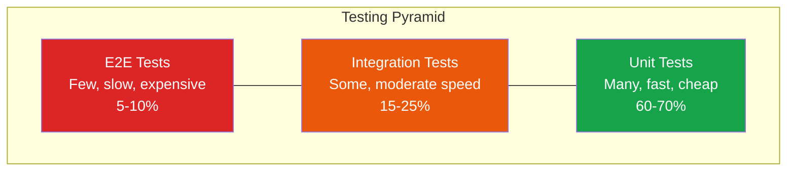
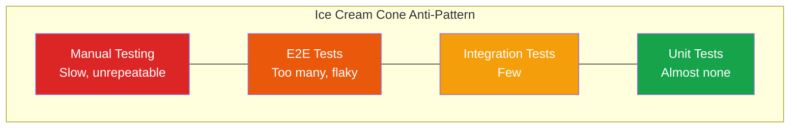
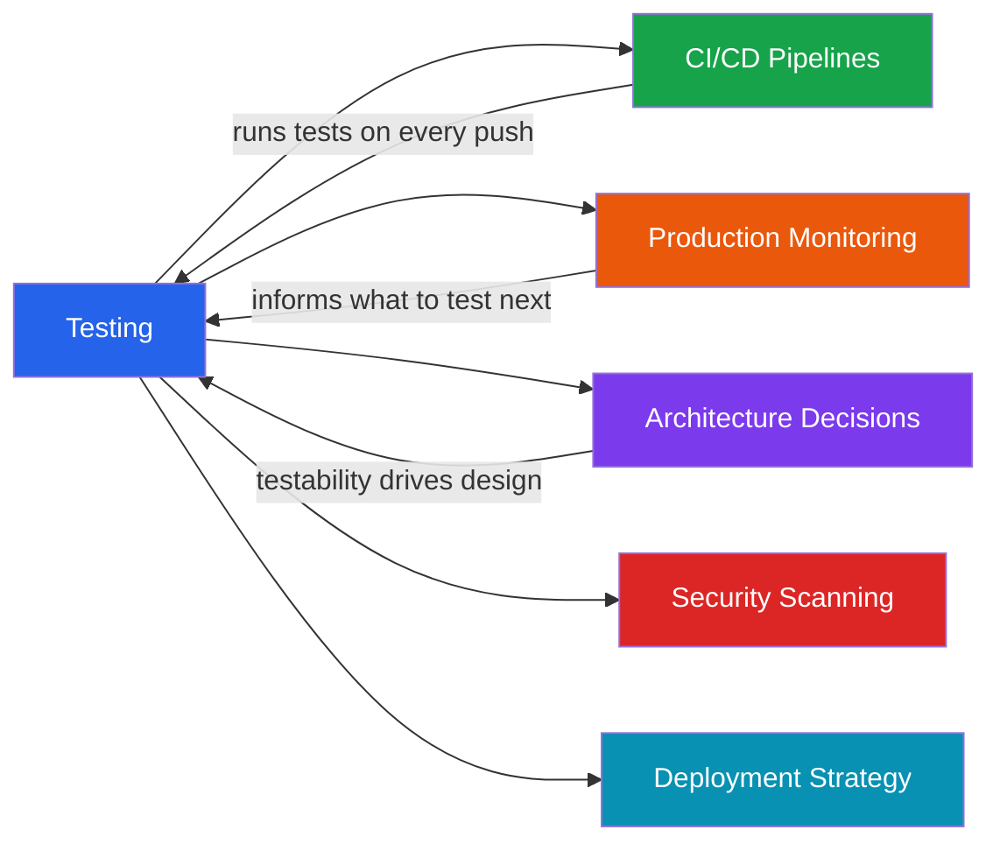

# Testing Overview

Software that is not tested is software that does not work. It might appear to work today, on your machine, with your data — but the moment it meets production traffic, edge cases, or a new developer who does not share your mental model, it will break. Testing is not a tax you pay for the privilege of shipping code. It is the engineering discipline that makes shipping possible at all.

The goal of this section is not to convince you that testing matters — you already know that. The goal is to give you a rigorous framework for *what* to test, *how* to test it, and *how much* testing is enough. These are the questions that separate teams that ship with confidence from teams that deploy on Friday and spend the weekend in a war room.

## Why Testing Matters

Testing provides three things that no other engineering practice can replicate:

1. **Confidence to change code.** Without tests, every refactoring is a gamble. With tests, you refactor knowing that if you break something, you will find out in seconds rather than from a customer support ticket.

2. **Living documentation.** Tests describe what your system actually does, not what someone intended it to do six months ago. When tests and documentation disagree, the tests are right.

3. **Design pressure.** Code that is hard to test is almost always poorly designed. The act of writing tests forces you to think about interfaces, dependencies, and responsibilities — the same things that make code maintainable.

::: tip The Real Cost of Not Testing
The cost of a bug increases by roughly 10x at each stage: catching it during development costs $1, during testing costs $10, in staging costs $100, and in production costs $1,000+. The math always favors shifting left.
:::

## The Testing Pyramid

The testing pyramid is the most important mental model in software testing. It answers the question: *how many of each type of test should I write?*



The pyramid has three layers, and the key insight is about the ratio between them:

| Layer | Speed | Isolation | Confidence | Cost | Quantity |
|-------|-------|-----------|------------|------|----------|
| **Unit Tests** | Milliseconds | High — tests one function or class | Verifies logic correctness | Very low | Many (hundreds to thousands) |
| **Integration Tests** | Seconds | Medium — tests component boundaries | Verifies components work together | Moderate | Some (dozens to hundreds) |
| **E2E Tests** | Minutes | Low — tests entire user flows | Verifies the system works as a whole | High | Few (tens) |

### Why a Pyramid and Not a Rectangle

If all test types provided equal value at equal cost, you would write them in equal proportion. But they do not:

- **Unit tests** are cheap to write, fast to run, and easy to debug when they fail. A failing unit test tells you exactly which function broke and why.
- **Integration tests** catch problems that unit tests cannot — like a misconfigured database connection or an incorrect API contract — but they are slower and harder to diagnose.
- **E2E tests** provide the highest confidence that a user flow works, but they are slow, flaky, and expensive to maintain. A failing E2E test tells you *something* is wrong but rarely tells you *what*.

The pyramid shape ensures you get maximum coverage with minimum cost.

### The Anti-Pattern: The Ice Cream Cone

Many teams invert the pyramid — lots of manual testing and E2E tests, a handful of integration tests, and almost no unit tests. This is called the ice cream cone, and it produces slow CI pipelines, flaky test suites, and engineers who stop trusting their tests.



::: danger The Ice Cream Cone Kills Velocity
Teams with inverted pyramids spend 40-60% of their CI time waiting for flaky E2E tests to pass. Engineers learn to ignore failures ("oh, that test is always flaky"), and real bugs slip through. If your CI pipeline takes more than 15 minutes, you probably have a pyramid problem.
:::

## Testing Types at a Glance

This section covers eight distinct testing disciplines. Here is how they relate to each other and when to use each one.

### Core Testing Types

| Type | What It Tests | When to Use | Page |
|------|--------------|-------------|------|
| **Unit Testing** | Individual functions, classes, modules | Always — every project needs unit tests | [Unit Testing](/testing/unit-testing) |
| **Integration Testing** | Boundaries between components (DB, APIs, services) | When you have external dependencies | [Integration Testing](/testing/integration-testing) |
| **E2E Testing** | Full user flows through the real system | Critical user journeys (signup, checkout, etc.) | [E2E Testing](/testing/e2e-testing) |
| **Contract Testing** | API agreements between services | Microservices architectures | [Contract Testing](/testing/contract-testing) |

### Advanced Testing Types

| Type | What It Tests | When to Use | Page |
|------|--------------|-------------|------|
| **Property-Based Testing** | Invariants across random inputs | Algorithmic code, parsers, serializers | [Property-Based Testing](/testing/property-based-testing) |
| **TDD & BDD** | Development methodology, not a test type | Teams that want design-driven development | [TDD & BDD](/testing/tdd-bdd) |

### Cross-Cutting Concerns

| Topic | What It Covers | Page |
|-------|---------------|------|
| **Test Architecture** | Fixtures, factories, mocking strategies, CI pipelines, flaky test prevention | [Test Architecture](/testing/test-architecture) |

## How Testing Fits Into the Broader System

Testing does not exist in isolation. It connects to nearly every other engineering discipline:



- **CI/CD**: Tests gate your [deployment pipeline](/infrastructure/ci-cd/pipeline-patterns). No green tests, no deploy.
- **Monitoring**: Production [metrics](/devops/monitoring/metrics-design) tell you what broke after deploy — tests prevent breakage before deploy. They are complementary, not substitutes.
- **Architecture**: [Hexagonal architecture](/architecture-patterns/hexagonal/) and [clean architecture](/architecture-patterns/clean-architecture/) exist largely because they make testing easier. If your architecture fights your tests, your architecture is wrong.
- **Security**: [Security scanning](/infrastructure/ci-cd/security-scanning) in CI is a form of automated testing. SAST, DAST, and dependency scanning all belong in your test pipeline.
- **Deployment**: [Canary deploys](/devops/deployment-strategies/canary) and [blue-green deployments](/devops/deployment-strategies/blue-green) are production testing strategies.

## Testing Philosophy

### Write Tests That Fail for the Right Reasons

A test should fail when the behavior it describes changes. It should *not* fail when implementation details change. This is the single most important principle in testing.

```typescript
// BAD: Tests implementation details
test('uses HashMap internally', () => {
  const cache = new Cache();
  expect(cache._store).toBeInstanceOf(Map);
});

// GOOD: Tests behavior
test('returns cached value after set', () => {
  const cache = new Cache();
  cache.set('key', 'value');
  expect(cache.get('key')).toBe('value');
});
```

### Test Behavior, Not Implementation

If you refactor a function's internals without changing its contract, zero tests should break. If they do, your tests are coupled to implementation rather than behavior. This coupling is the number one reason teams abandon test suites — the tests become more expensive to maintain than the code they protect.

### The Right Amount of Testing

There is no universal "right" amount of testing. But there are guidelines:

- **Coverage is a trailing indicator, not a goal.** Aiming for 100% code coverage produces meaningless tests that verify nothing. Aim for 100% of *critical path* coverage instead.
- **Test the things that scare you.** If a piece of code makes you nervous when you change it, it needs tests.
- **Every bug gets a test.** When you fix a bug, write a test that would have caught it. This ensures the same bug never returns.
- **Delete tests that do not earn their keep.** If a test has never caught a bug and never will, it is dead weight. Remove it.

::: warning Coverage Targets Are a Code Smell
If your organization mandates 80% code coverage, engineers will write tests that exercise code paths without asserting anything meaningful. A test suite with 60% coverage and strong assertions is better than 95% coverage with weak assertions. Measure the quality of your tests, not the quantity.
:::

## Setting Up a Testing Culture

Technical solutions alone do not produce well-tested software. Culture does. Here is what high-performing teams do differently:

1. **Tests are required for merge.** PRs without tests do not get approved. Period.
2. **CI is fast.** If your test suite takes more than 10 minutes, engineers will stop running it locally and start pushing to CI as a substitute. Keep unit tests under 60 seconds, integration tests under 5 minutes.
3. **Flaky tests are bugs.** A flaky test is worse than no test because it teaches engineers to ignore failures. Quarantine flaky tests immediately and fix them within 48 hours.
4. **Test failures block the pipeline.** Never allow "known failures" to persist. They accumulate and erode trust.
5. **Celebrate test-driven bug fixes.** When someone writes a regression test that catches a bug, that is a win worth recognizing.

## Recommended Reading Order

If you are new to testing, read the pages in this order:

1. [Unit Testing](/testing/unit-testing) — the foundation everything else builds on
2. [TDD & BDD](/testing/tdd-bdd) — methodology for writing tests first
3. [Integration Testing](/testing/integration-testing) — testing real boundaries
4. [Test Architecture](/testing/test-architecture) — organizing tests at scale
5. [E2E Testing](/testing/e2e-testing) — full-system validation
6. [Contract Testing](/testing/contract-testing) — for microservices teams
7. [Property-Based Testing](/testing/property-based-testing) — advanced verification

## Key Takeaway

::: tip
- Testing provides confidence to change code, living documentation, and design pressure — it is not a tax but the discipline that makes shipping possible.
- The testing pyramid (many unit tests, some integration tests, few E2E tests) maximizes coverage while minimizing cost — inverting it into an ice cream cone kills velocity.
- Test behavior rather than implementation, delete tests that never catch bugs, and treat flaky tests as production-severity bugs that erode trust in the entire suite.
:::

## Common Misconceptions

::: warning Misconception: More E2E tests mean higher confidence
E2E tests are slow, flaky, and expensive. Teams that write mostly E2E tests end up with 30-minute CI pipelines where engineers learn to ignore failures. The pyramid shape exists because unit and integration tests give you 90% of the confidence at 10% of the cost.
:::

::: warning Misconception: 100% code coverage means the software is well-tested
Coverage measures which lines were executed, not whether assertions are meaningful. A test suite with 60% coverage and strong assertions catches more real bugs than one with 95% coverage full of tests that call functions without asserting anything.
:::

::: warning Misconception: Testing is a QA team responsibility
In high-performing organizations, engineers write and own their tests. QA adds value through exploratory testing and test strategy, but the people who write the code are the people best equipped to test it. Throwing code over the wall to QA creates a bottleneck and delays feedback.
:::

::: warning Misconception: Tests slow down development
Tests slow down the first commit. They speed up every commit after that. Without tests, every refactoring is a gamble, every deploy is a prayer, and every bug takes hours to diagnose instead of seconds.
:::

## Quick Quiz

**1. In the testing pyramid, which layer should have the MOST tests?**
- A) E2E tests
- B) Integration tests
- C) Unit tests
- D) Manual tests

::: details Answer
**C) Unit tests.** Unit tests are fast, cheap, and easy to debug. They should comprise 60-70% of your test suite. E2E tests should be the fewest because they are slow, expensive, and harder to diagnose.
:::

**2. What is the "ice cream cone" anti-pattern?**
- A) A testing strategy focused on performance
- B) An inverted pyramid with mostly E2E and manual tests
- C) A CI pipeline that runs tests in parallel
- D) A technique for testing UI components

::: details Answer
**B) An inverted pyramid with mostly E2E and manual tests.** The ice cream cone has many manual and E2E tests, few integration tests, and almost no unit tests. This produces slow CI pipelines, flaky suites, and engineers who stop trusting their tests.
:::

**3. What is the PRIMARY purpose of testing according to this page?**
- A) Meeting code coverage requirements
- B) Finding all bugs before production
- C) Giving confidence to change code
- D) Satisfying compliance audits

::: details Answer
**C) Giving confidence to change code.** Tests exist so you can refactor knowing that if something breaks, you will find out in seconds rather than from a customer support ticket. Coverage metrics and compliance are secondary benefits.
:::

**4. Which statement about test failure is correct?**
- A) A test should fail when implementation details change
- B) A test should fail when the behavior it describes changes
- C) Tests should never fail after initial development
- D) Failing tests should be deleted to keep CI green

::: details Answer
**B) A test should fail when the behavior it describes changes.** Tests should be coupled to behavior, not implementation. If you refactor internals without changing the contract, zero tests should break.
:::

**5. What is the recommended approach when a bug is found in production?**
- A) Fix the bug and move on
- B) Write a test that would have caught it, then fix the bug
- C) Add more E2E tests to cover the scenario
- D) Increase the code coverage target

::: details Answer
**B) Write a test that would have caught it, then fix the bug.** The "every bug gets a test" rule ensures the same bug never returns. This regression test is one of the highest-value tests you can write.
:::

## Try It Yourself

**Exercise: Audit your project's testing pyramid**

Take a real project you work on. Count the number of unit tests, integration tests, and E2E tests. Draw the pyramid shape. Then answer: Is it a pyramid or an ice cream cone? Identify the single highest-value test you could add right now.

::: details Solution Approach
1. **Count tests by type:** Use your test runner's configuration to categorize tests. For example, in a Node.js project: `find tests/unit -name "*.test.ts" | wc -l` for unit, similar for integration and e2e directories.

2. **Calculate ratios:** A healthy pyramid has roughly 70% unit, 20% integration, 10% E2E. If your ratios are inverted, you have an ice cream cone.

3. **Identify the gap:** If you have 200 E2E tests and 50 unit tests, the highest-value action is converting E2E tests that test single-function logic into unit tests. If you have 500 unit tests and zero integration tests, the highest-value addition is an integration test for your most critical database query or API endpoint.

4. **Measure CI time:** If your pipeline takes more than 15 minutes, the pyramid shape is likely the root cause. Aim for unit tests under 60 seconds, integration under 5 minutes, and E2E under 15 minutes.
:::

---

> **One-Liner Summary:** The testing pyramid is the single most important mental model in software quality — many fast unit tests at the base, fewer integration tests in the middle, and a handful of slow E2E tests at the top.

## What's Next

Start with [Unit Testing](/testing/unit-testing) to learn the foundational patterns — AAA, test doubles, and what makes a test trustworthy. If you are already comfortable with unit tests, jump to [Test Architecture](/testing/test-architecture) to learn how to organize tests at scale, or to [Integration Testing](/testing/integration-testing) to learn how to test real system boundaries with tools like Testcontainers.
