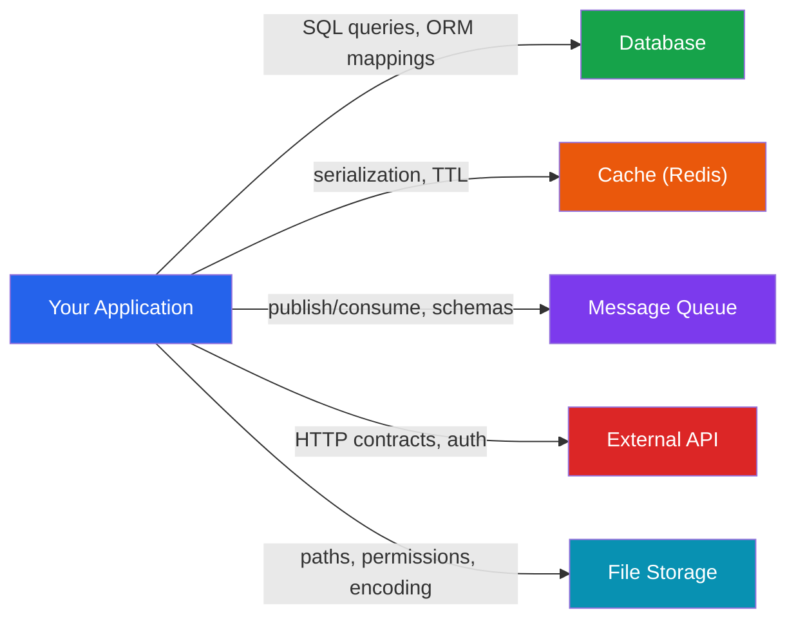
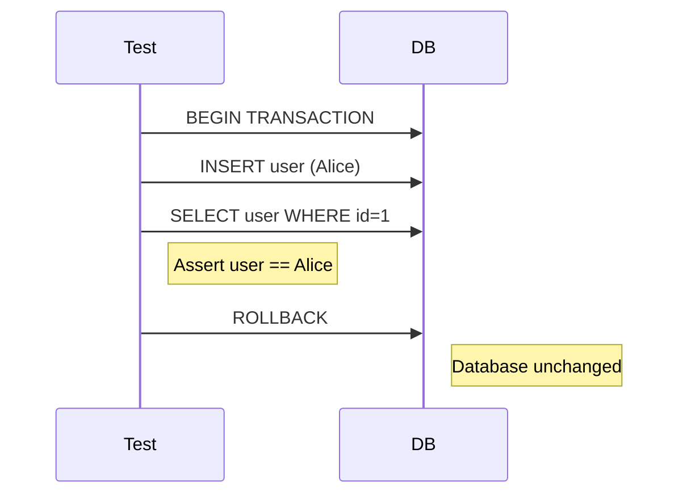
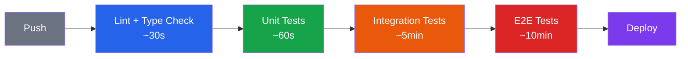

# Integration Testing

Unit tests verify that individual components work correctly in isolation. But software does not run in isolation. It reads from databases, calls APIs, publishes messages to queues, and writes to caches. Integration tests verify that your code works correctly *at these boundaries* — the places where your code meets the outside world.

The key question an integration test answers is: **does my code talk to the real dependency correctly?** Not a mock, not a stub — the actual PostgreSQL database, the actual Redis instance, the actual S3 bucket.

## What to Integration Test

Not every boundary needs an integration test. Focus on the boundaries where bugs are most likely and most expensive:



| Boundary | What Can Go Wrong | Integration Test Focus |
|----------|------------------|----------------------|
| **Database** | Wrong SQL, missing migrations, ORM mapping errors, constraint violations | CRUD operations, complex queries, migrations |
| **Cache** | Serialization bugs, wrong TTL, key collisions | Set/get round-trip, expiration behavior |
| **Message Queue** | Schema mismatches, deserialization failures, ordering issues | Publish/consume round-trip, dead letter handling |
| **External API** | Contract changes, auth failures, timeout handling | Happy path + error responses (use [contract tests](/testing/contract-testing) for full coverage) |
| **File Storage** | Path construction, encoding, permissions | Upload/download round-trip, large files |

::: tip Integration vs Unit: The Decision Rule
If you can test it with a stub, it is a unit test. If you *need* the real dependency to gain confidence, it is an integration test. The question is not "does it cross a boundary?" but "do I trust the boundary enough to fake it?"
:::

## The Testcontainers Pattern

Testcontainers is the modern standard for integration testing. It spins up real dependencies — databases, caches, message brokers — as Docker containers that live only for the duration of your test run.

### Why Testcontainers Wins

| Approach | Pros | Cons |
|----------|------|------|
| Shared test database | Easy to set up | Tests interfere with each other, data leaks between runs |
| In-memory fakes (H2, SQLite) | Fast | Different SQL dialect, different behavior, false confidence |
| **Testcontainers** | Real database, isolated per test suite, CI-compatible | Requires Docker, slightly slower startup |
| Cloud test environment | Fully realistic | Expensive, hard to isolate, network-dependent |

### TypeScript with Testcontainers

```typescript
import { PostgreSqlContainer, StartedPostgreSqlContainer } from '@testcontainers/postgresql';
import { Pool } from 'pg';
import { describe, it, expect, beforeAll, afterAll } from 'vitest';
import { UserRepository } from './user-repository';
import { runMigrations } from './migrations';

describe('UserRepository (integration)', () => {
  let container: StartedPostgreSqlContainer;
  let pool: Pool;
  let repo: UserRepository;

  beforeAll(async () => {
    // Start a real PostgreSQL container
    container = await new PostgreSqlContainer('postgres:16-alpine')
      .withDatabase('testdb')
      .start();

    pool = new Pool({
      connectionString: container.getConnectionUri(),
    });

    await runMigrations(pool);
    repo = new UserRepository(pool);
  }, 60_000); // Container startup can take time

  afterAll(async () => {
    await pool.end();
    await container.stop();
  });

  it('persists and retrieves a user', async () => {
    const user = await repo.create({
      email: 'alice@example.com',
      name: 'Alice',
    });

    const found = await repo.findById(user.id);

    expect(found).toEqual(expect.objectContaining({
      email: 'alice@example.com',
      name: 'Alice',
    }));
  });

  it('enforces unique email constraint', async () => {
    await repo.create({ email: 'bob@example.com', name: 'Bob' });

    await expect(
      repo.create({ email: 'bob@example.com', name: 'Bob2' })
    ).rejects.toThrow(/unique/i);
  });

  it('returns null for nonexistent user', async () => {
    const found = await repo.findById('nonexistent-id');
    expect(found).toBeNull();
  });
});
```

### Python with Testcontainers

```python
import pytest
from testcontainers.postgres import PostgresContainer
from sqlalchemy import create_engine
from sqlalchemy.orm import Session
from app.models import Base, User
from app.repositories import UserRepository

@pytest.fixture(scope="module")
def postgres():
    with PostgresContainer("postgres:16-alpine") as pg:
        yield pg

@pytest.fixture(scope="module")
def engine(postgres):
    engine = create_engine(postgres.get_connection_url())
    Base.metadata.create_all(engine)
    return engine

@pytest.fixture
def session(engine):
    """Each test gets a fresh transaction that rolls back."""
    connection = engine.connect()
    transaction = connection.begin()
    session = Session(bind=connection)

    yield session

    session.close()
    transaction.rollback()
    connection.close()

@pytest.fixture
def repo(session):
    return UserRepository(session)

def test_create_and_find_user(repo, session):
    user = repo.create(email="alice@example.com", name="Alice")
    session.flush()

    found = repo.find_by_id(user.id)

    assert found is not None
    assert found.email == "alice@example.com"

def test_unique_email_constraint(repo, session):
    repo.create(email="bob@example.com", name="Bob")
    session.flush()

    with pytest.raises(Exception, match="unique"):
        repo.create(email="bob@example.com", name="Bob2")
        session.flush()
```

### Go with Testcontainers

```go
package repository_test

import (
    "context"
    "testing"

    "github.com/jackc/pgx/v5/pgxpool"
    "github.com/testcontainers/testcontainers-go"
    "github.com/testcontainers/testcontainers-go/modules/postgres"
    "github.com/testcontainers/testcontainers-go/wait"
)

func setupPostgres(t *testing.T) *pgxpool.Pool {
    t.Helper()
    ctx := context.Background()

    container, err := postgres.Run(ctx,
        "postgres:16-alpine",
        postgres.WithDatabase("testdb"),
        testcontainers.WithWaitStrategy(
            wait.ForLog("database system is ready to accept connections").
                WithOccurrence(2)),
    )
    if err != nil {
        t.Fatalf("failed to start container: %v", err)
    }

    t.Cleanup(func() { container.Terminate(ctx) })

    connStr, _ := container.ConnectionString(ctx, "sslmode=disable")
    pool, err := pgxpool.New(ctx, connStr)
    if err != nil {
        t.Fatalf("failed to connect: %v", err)
    }

    // Run migrations
    runMigrations(pool)

    return pool
}

func TestUserRepository_Create(t *testing.T) {
    pool := setupPostgres(t)
    repo := NewUserRepository(pool)

    user, err := repo.Create(context.Background(), "alice@example.com", "Alice")
    if err != nil {
        t.Fatalf("unexpected error: %v", err)
    }

    found, err := repo.FindByID(context.Background(), user.ID)
    if err != nil {
        t.Fatalf("unexpected error: %v", err)
    }

    if found.Email != "alice@example.com" {
        t.Errorf("expected alice@example.com, got %s", found.Email)
    }
}
```

## Database Testing Patterns

### Transaction Rollback Pattern

The most common pattern for database test isolation is to wrap each test in a transaction and roll it back after the test completes. This ensures tests never interfere with each other and the database stays clean.



::: warning Rollback Limitations
Transaction rollback works perfectly for most tests, but it cannot test behavior that depends on committed data — like triggers that fire on commit, materialized view refreshes, or advisory locks. For those cases, use database truncation instead.
:::

### Database Truncation Pattern

For tests that need committed data, truncate all tables between tests:

```typescript
async function cleanDatabase(pool: Pool): Promise<void> {
  const tables = await pool.query(`
    SELECT tablename FROM pg_tables
    WHERE schemaname = 'public'
    AND tablename != 'schema_migrations'
  `);

  for (const { tablename } of tables.rows) {
    await pool.query(`TRUNCATE TABLE "${tablename}" CASCADE`);
  }
}
```

### Fixtures and Seeds

For complex integration tests, you need realistic data. There are two approaches:

**Static fixtures** — SQL files loaded before tests:

```sql
-- fixtures/users.sql
INSERT INTO users (id, email, name, tier) VALUES
  ('usr-1', 'alice@test.com', 'Alice', 'premium'),
  ('usr-2', 'bob@test.com', 'Bob', 'standard');

-- fixtures/orders.sql
INSERT INTO orders (id, user_id, total, status) VALUES
  ('ord-1', 'usr-1', 15000, 'completed'),
  ('ord-2', 'usr-1', 8500, 'pending');
```

**Dynamic factories** — code that builds test data programmatically (see [Test Architecture](/testing/test-architecture) for factory patterns):

```typescript
// Preferred — factories are flexible and type-safe
const alice = await createUser({ tier: 'premium' });
const order = await createOrder({ userId: alice.id, total: 15000 });
```

## API Integration Testing

API integration tests verify that your HTTP endpoints work correctly end-to-end — routing, middleware, serialization, validation, and response formatting.

### TypeScript with Supertest

```typescript
import { describe, it, expect, beforeAll, afterAll } from 'vitest';
import request from 'supertest';
import { createApp } from './app';
import { PostgreSqlContainer } from '@testcontainers/postgresql';

describe('POST /api/users', () => {
  let app: Express;
  let container: StartedPostgreSqlContainer;

  beforeAll(async () => {
    container = await new PostgreSqlContainer().start();
    app = createApp({ databaseUrl: container.getConnectionUri() });
  }, 60_000);

  afterAll(async () => {
    await container.stop();
  });

  it('creates a user and returns 201', async () => {
    const response = await request(app)
      .post('/api/users')
      .send({ email: 'test@example.com', name: 'Test User' })
      .expect(201);

    expect(response.body).toEqual(expect.objectContaining({
      id: expect.any(String),
      email: 'test@example.com',
      name: 'Test User',
    }));
  });

  it('returns 400 for invalid email', async () => {
    const response = await request(app)
      .post('/api/users')
      .send({ email: 'not-an-email', name: 'Test' })
      .expect(400);

    expect(response.body.errors).toContainEqual(
      expect.objectContaining({ field: 'email' })
    );
  });

  it('returns 409 for duplicate email', async () => {
    await request(app)
      .post('/api/users')
      .send({ email: 'dup@example.com', name: 'First' });

    await request(app)
      .post('/api/users')
      .send({ email: 'dup@example.com', name: 'Second' })
      .expect(409);
  });
});
```

### Go with httptest

```go
func TestCreateUserHandler(t *testing.T) {
    pool := setupPostgres(t)
    handler := NewUserHandler(pool)

    body := `{"email": "test@example.com", "name": "Test User"}`
    req := httptest.NewRequest(http.MethodPost, "/api/users", strings.NewReader(body))
    req.Header.Set("Content-Type", "application/json")
    rec := httptest.NewRecorder()

    handler.ServeHTTP(rec, req)

    if rec.Code != http.StatusCreated {
        t.Errorf("expected 201, got %d", rec.Code)
    }

    var resp map[string]interface{}
    json.NewDecoder(rec.Body).Decode(&resp)

    if resp["email"] != "test@example.com" {
        t.Errorf("expected test@example.com, got %v", resp["email"])
    }
}
```

## Message Queue Integration Testing

When your system publishes or consumes messages, integration tests verify the full round-trip.

```typescript
import { KafkaContainer, StartedKafkaContainer } from '@testcontainers/kafka';
import { Kafka, Consumer, Producer } from 'kafkajs';

describe('OrderEventPublisher (integration)', () => {
  let container: StartedKafkaContainer;
  let producer: Producer;
  let consumer: Consumer;

  beforeAll(async () => {
    container = await new KafkaContainer().withExposedPorts(9093).start();
    const kafka = new Kafka({
      brokers: [container.getBootstrapServers()],
    });

    producer = kafka.producer();
    consumer = kafka.consumer({ groupId: 'test-group' });

    await producer.connect();
    await consumer.connect();
    await consumer.subscribe({ topic: 'order-events', fromBeginning: true });
  }, 90_000);

  afterAll(async () => {
    await producer.disconnect();
    await consumer.disconnect();
    await container.stop();
  });

  it('publishes order created event', async () => {
    const received: any[] = [];

    await consumer.run({
      eachMessage: async ({ message }) => {
        received.push(JSON.parse(message.value!.toString()));
      },
    });

    const publisher = new OrderEventPublisher(producer);
    await publisher.orderCreated({ id: 'ord-1', total: 5000 });

    // Wait for consumer to process
    await new Promise((resolve) => setTimeout(resolve, 2000));

    expect(received).toContainEqual(
      expect.objectContaining({
        type: 'order.created',
        payload: { id: 'ord-1', total: 5000 },
      })
    );
  });
});
```

## Integration Test Organization

### Separate from Unit Tests

Integration tests should live in a clearly separated directory or use a naming convention that lets you run them independently.

```
tests/
  unit/                    # Fast, no external dependencies
    user-service.test.ts
    pricing.test.ts
  integration/             # Slower, requires Docker
    user-repository.test.ts
    order-api.test.ts
    kafka-publisher.test.ts
```

### CI Pipeline Separation

Run unit tests and integration tests in separate CI stages so fast feedback is not blocked by slow integration tests:



::: tip CI Performance Tip
Run integration tests in parallel by service boundary. Database tests, cache tests, and queue tests can run simultaneously if they use separate Testcontainer instances. Most CI platforms support parallelized test stages. See [Pipeline Patterns](/infrastructure/ci-cd/pipeline-patterns) for details.
:::

## Common Pitfalls

### 1. Testing Against a Shared Database

Shared test databases cause flaky tests because tests interfere with each other's data. Always use per-suite isolation via Testcontainers or per-test isolation via transaction rollback.

### 2. Ignoring Cleanup

If a test fails mid-execution, cleanup code may not run. Use `afterEach`/`t.Cleanup`/`pytest.fixture` with proper teardown to ensure resources are always released.

### 3. Slow Startup Addiction

If your integration test suite takes 10 minutes to start containers, you are starting too many. Share containers across test suites using module-scoped fixtures, and only start the containers you actually need.

### 4. Testing the ORM Instead of Your Code

```typescript
// BAD — tests that Prisma can insert and select a row
test('creates user', async () => {
  const user = await prisma.user.create({ data: { email: 'a@b.com' } });
  const found = await prisma.user.findUnique({ where: { id: user.id } });
  expect(found!.email).toBe('a@b.com');
});

// GOOD — tests YOUR repository logic
test('findActiveUsers returns only non-deactivated users', async () => {
  await createUser({ email: 'active@test.com', deactivatedAt: null });
  await createUser({ email: 'gone@test.com', deactivatedAt: new Date() });

  const active = await repo.findActiveUsers();

  expect(active).toHaveLength(1);
  expect(active[0].email).toBe('active@test.com');
});
```

## Further Reading

- [Unit Testing](/testing/unit-testing) — the foundation integration tests build on
- [Contract Testing](/testing/contract-testing) — for verifying API agreements between services without full integration tests
- [E2E Testing](/testing/e2e-testing) — full system testing through the UI or API
- [Test Architecture](/testing/test-architecture) — factories, fixtures, and CI pipeline design for integration tests
- [Pipeline Patterns](/infrastructure/ci-cd/pipeline-patterns) — structuring CI pipelines with test stages

---

## Key Takeaway

::: tip
- Integration tests verify your code works correctly at real boundaries (databases, APIs, caches, queues) -- if you need the real dependency to gain confidence, it is an integration test.
- Testcontainers is the modern standard: spin up real databases and services as Docker containers per test suite, giving you production-realistic testing with per-suite isolation.
- Use transaction rollback for per-test database isolation (fast and clean) and keep integration tests separated from unit tests in both directory structure and CI pipeline stages.
:::

## Common Misconceptions

::: warning Misconception: In-memory databases (H2, SQLite) are good substitutes for real databases
In-memory fakes use different SQL dialects, have different constraint behavior, and produce false confidence. Your H2 tests may pass while your PostgreSQL production queries fail on syntax, type coercion, or locking behavior. Use Testcontainers with the real database engine.
:::

::: warning Misconception: Integration tests should test the ORM or framework
Testing that Prisma can insert and select a row is testing the ORM, not your code. Integration tests should verify your repository logic, complex queries, constraints, and edge cases -- the things your code adds on top of the ORM.
:::

::: warning Misconception: Sharing a test database between test suites is fine
Shared test databases cause flaky tests because suites interfere with each other's data. One suite inserts a user with a specific email, another suite's unique constraint test fails. Always use per-suite isolation via Testcontainers or per-test isolation via transaction rollback.
:::

::: warning Misconception: Integration tests are just slow unit tests
Integration tests serve a fundamentally different purpose. Unit tests verify logic correctness in isolation. Integration tests verify that your code communicates correctly with real external systems. They catch different classes of bugs: wrong SQL, missing migrations, serialization mismatches, and constraint violations.
:::

## In Production

::: tip Uber
Uber uses Testcontainers extensively across their Go microservices. Every service's CI pipeline starts real PostgreSQL and Redis containers for integration tests. They share containers across test suites within the same CI job using module-scoped fixtures, reducing container startup overhead by 80%.
:::

::: tip Netflix
Netflix's integration testing strategy uses a "test harness" pattern where each microservice has a companion test harness that boots all its dependencies (databases, caches, downstream service mocks) in containers. The harness is versioned alongside the service code so infrastructure changes are tested automatically.
:::

::: tip Stripe
Stripe uses transaction rollback isolation for their payment processing integration tests. Each test runs inside a database transaction that rolls back after completion, ensuring tests never leak state. For tests that require committed data (triggers, materialized views), they use truncation with carefully ordered table cleanup.
:::

## Try It Yourself

**Exercise 1: Write a Testcontainers integration test**

Create an integration test for a `UserRepository` that verifies: (a) creating a user persists it, (b) duplicate emails are rejected, and (c) finding a nonexistent user returns null. Use Testcontainers to spin up a real PostgreSQL instance.

::: details Solution
```typescript
import { PostgreSqlContainer } from '@testcontainers/postgresql';
import { Pool } from 'pg';

describe('UserRepository (integration)', () => {
  let container, pool, repo;

  beforeAll(async () => {
    container = await new PostgreSqlContainer('postgres:16-alpine').start();
    pool = new Pool({ connectionString: container.getConnectionUri() });
    await pool.query(`
      CREATE TABLE users (
        id UUID PRIMARY KEY DEFAULT gen_random_uuid(),
        email TEXT UNIQUE NOT NULL,
        name TEXT NOT NULL
      )
    `);
    repo = new UserRepository(pool);
  }, 60_000);

  afterAll(async () => {
    await pool.end();
    await container.stop();
  });

  it('persists and retrieves a user', async () => {
    const user = await repo.create({ email: 'alice@test.com', name: 'Alice' });
    const found = await repo.findById(user.id);
    expect(found.email).toBe('alice@test.com');
  });

  it('rejects duplicate emails', async () => {
    await repo.create({ email: 'dup@test.com', name: 'First' });
    await expect(repo.create({ email: 'dup@test.com', name: 'Second' }))
      .rejects.toThrow(/unique/i);
  });

  it('returns null for nonexistent user', async () => {
    const found = await repo.findById('00000000-0000-0000-0000-000000000000');
    expect(found).toBeNull();
  });
});
```
:::

**Exercise 2: Transaction rollback isolation**

Write a pytest fixture that wraps each test in a transaction and rolls it back after the test completes, ensuring tests never interfere with each other.

::: details Solution
```python
import pytest
from sqlalchemy import create_engine
from sqlalchemy.orm import Session

@pytest.fixture(scope="module")
def engine(postgres_container):
    return create_engine(postgres_container.get_connection_url())

@pytest.fixture
def session(engine):
    """Each test gets a transaction that rolls back."""
    connection = engine.connect()
    transaction = connection.begin()
    session = Session(bind=connection)

    yield session

    session.close()
    transaction.rollback()
    connection.close()

def test_create_user(session):
    session.execute(text("INSERT INTO users (email) VALUES ('a@b.com')"))
    session.flush()
    result = session.execute(text("SELECT email FROM users")).fetchone()
    assert result[0] == 'a@b.com'

def test_user_table_is_empty(session):
    """This passes because the previous test's transaction was rolled back."""
    result = session.execute(text("SELECT COUNT(*) FROM users")).fetchone()
    assert result[0] == 0
```
:::

## Quick Quiz

**1. When should you use an integration test instead of a unit test?**
- A) When the function has more than 10 lines of code
- B) When you need the real dependency to gain confidence in the boundary
- C) When unit tests are too fast
- D) Always -- integration tests are strictly better

::: details Answer
**B) When you need the real dependency to gain confidence in the boundary.** If you can test it with a stub and trust the result, use a unit test. Integration tests are for verifying real SQL, real serialization, real constraint behavior.
:::

**2. What is the main advantage of Testcontainers over a shared test database?**
- A) Testcontainers are faster
- B) Testcontainers provide isolated, reproducible environments per test suite
- C) Testcontainers do not require Docker
- D) Testcontainers use in-memory databases

::: details Answer
**B) Testcontainers provide isolated, reproducible environments per test suite.** Each suite gets its own container with its own database, eliminating cross-suite interference and data leaks.
:::

**3. What limitation does the transaction rollback pattern have?**
- A) It is too slow for CI
- B) It cannot test behavior that depends on committed data (triggers, materialized views)
- C) It only works with PostgreSQL
- D) It requires manual cleanup code

::: details Answer
**B) It cannot test behavior that depends on committed data.** Triggers that fire on commit, materialized view refreshes, and advisory locks require committed data. For those cases, use database truncation.
:::

---

> **One-Liner Summary:** Integration tests verify your code talks correctly to real databases, APIs, and queues -- use Testcontainers for isolation and transaction rollback for speed.
