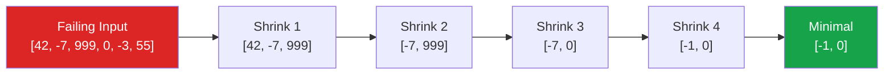

# Property-Based Testing

Traditional [unit tests](/testing/unit-testing) are *example-based* — you pick specific inputs and assert specific outputs. Property-based testing inverts this: you describe *properties* that must hold for *all possible inputs*, and the framework generates hundreds or thousands of random inputs to try to break your code.

The insight behind property-based testing is that humans are bad at thinking of edge cases. We test the happy path, the obvious error path, and maybe a boundary value. A property-based testing framework generates empty strings, negative numbers, extremely long arrays, Unicode characters, NaN, Infinity, and combinations you would never think of — and it does this automatically on every test run.

## Properties vs Examples

### Example-Based Testing

```typescript
// Example-based: you pick inputs
test('sorts numbers ascending', () => {
  expect(sort([3, 1, 2])).toEqual([1, 2, 3]);
  expect(sort([1])).toEqual([1]);
  expect(sort([])).toEqual([]);
  expect(sort([5, 5, 5])).toEqual([5, 5, 5]);
});
```

This tests four examples. What about negative numbers? Infinity? Arrays with millions of elements? Floats that are very close together?

### Property-Based Testing

```typescript
import { fc } from '@fast-check/vitest';

// Property-based: framework picks inputs
test.prop([fc.array(fc.integer())])(
  'sort output is always ascending',
  (arr) => {
    const sorted = sort(arr);
    for (let i = 1; i < sorted.length; i++) {
      expect(sorted[i]).toBeGreaterThanOrEqual(sorted[i - 1]);
    }
  }
);

test.prop([fc.array(fc.integer())])(
  'sort preserves all elements',
  (arr) => {
    const sorted = sort(arr);
    expect(sorted).toHaveLength(arr.length);
    for (const item of arr) {
      expect(sorted).toContain(item);
    }
  }
);

test.prop([fc.array(fc.integer())])(
  'sort is idempotent',
  (arr) => {
    const once = sort(arr);
    const twice = sort(once);
    expect(twice).toEqual(once);
  }
);
```

These three properties together describe a correct sorting function more thoroughly than any number of example tests could. And they are tested against hundreds of randomly generated arrays on every run.

## Finding Properties

The hardest part of property-based testing is knowing what property to assert. Here are five recurring patterns:

### 1. Round-Trip (Encode/Decode)

If you serialize and deserialize, you should get back the original value.

```typescript
test.prop([fc.jsonValue()])(
  'JSON round-trip preserves data',
  (value) => {
    const serialized = JSON.stringify(value);
    const deserialized = JSON.parse(serialized);
    expect(deserialized).toEqual(value);
  }
);
```

```python
from hypothesis import given
from hypothesis import strategies as st
import json

@given(st.from_type(dict))
def test_json_roundtrip(data):
    """Serializing then deserializing returns the original value."""
    try:
        serialized = json.dumps(data, default=str)
        deserialized = json.loads(serialized)
        # At minimum, it should not crash
    except (TypeError, ValueError):
        pass  # Some types are not JSON-serializable — that is fine
```

### 2. Invariants

A property that must always be true, regardless of input.

```typescript
test.prop([fc.integer(), fc.integer({ min: 1 })])(
  'division result times divisor approximates dividend',
  (dividend, divisor) => {
    const result = dividend / divisor;
    // Floating point: use approximate equality
    expect(result * divisor).toBeCloseTo(dividend, 5);
  }
);

test.prop([fc.array(fc.integer())])(
  'filter never increases array length',
  (arr) => {
    const filtered = arr.filter((x) => x > 0);
    expect(filtered.length).toBeLessThanOrEqual(arr.length);
  }
);
```

### 3. Idempotency

Applying an operation twice gives the same result as applying it once.

```typescript
test.prop([fc.string()])(
  'trimming is idempotent',
  (s) => {
    expect(s.trim().trim()).toBe(s.trim());
  }
);

test.prop([fc.emailAddress()])(
  'normalizeEmail is idempotent',
  (email) => {
    const once = normalizeEmail(email);
    const twice = normalizeEmail(once);
    expect(twice).toBe(once);
  }
);
```

### 4. Commutativity / Associativity

Order or grouping should not matter for certain operations.

```typescript
test.prop([fc.integer(), fc.integer()])(
  'addition is commutative',
  (a, b) => {
    expect(add(a, b)).toBe(add(b, a));
  }
);

test.prop([
  fc.array(fc.record({ id: fc.uuid(), name: fc.string() })),
  fc.constantFrom('name', 'id'),
  fc.constantFrom('name', 'id'),
])(
  'sorting by X then Y gives same result regardless of initial order',
  (items, sortKey1, sortKey2) => {
    const shuffled = [...items].reverse();
    const result1 = sortBy(sortBy(items, sortKey1), sortKey2);
    const result2 = sortBy(sortBy(shuffled, sortKey1), sortKey2);
    expect(result1).toEqual(result2);
  }
);
```

### 5. Oracle / Reference Implementation

Compare a complex implementation against a simple (but slow) reference.

```typescript
test.prop([fc.array(fc.integer(), { maxLength: 100 })])(
  'optimized median matches brute-force median',
  (arr) => {
    fc.pre(arr.length > 0); // Precondition: non-empty
    const optimized = medianOptimized(arr);
    const reference = medianBruteForce(arr);
    expect(optimized).toBeCloseTo(reference);
  }
);
```

## Generators and Shrinking

### Generators

Generators are the engine of property-based testing. They produce random values of a specific type.

#### fast-check Generators (TypeScript)

```typescript
import fc from 'fast-check';

// Primitives
fc.integer()                         // any integer
fc.integer({ min: 0, max: 100 })    // bounded integer
fc.float()                           // any float
fc.string()                          // any string
fc.boolean()                         // true or false

// Constrained strings
fc.emailAddress()                    // valid email format
fc.uuid()                            // valid UUID
fc.ipV4()                            // valid IPv4 address
fc.hexaString()                      // hexadecimal characters
fc.stringOf(fc.char())               // string of specific chars

// Collections
fc.array(fc.integer())               // array of integers
fc.array(fc.integer(), { minLength: 1, maxLength: 50 })
fc.set(fc.integer())                 // array with unique elements
fc.dictionary(fc.string(), fc.integer()) // Record<string, number>

// Composite types
fc.record({
  id: fc.uuid(),
  name: fc.string({ minLength: 1 }),
  age: fc.integer({ min: 0, max: 150 }),
  email: fc.emailAddress(),
})

// Union types
fc.oneof(fc.constant('admin'), fc.constant('user'), fc.constant('guest'))

// Custom generators
const moneyGenerator = fc.record({
  amount: fc.integer({ min: 0, max: 1_000_000 }),
  currency: fc.constantFrom('USD', 'EUR', 'GBP', 'JPY'),
});
```

#### Hypothesis Strategies (Python)

```python
from hypothesis import strategies as st

# Primitives
st.integers()
st.integers(min_value=0, max_value=100)
st.floats(allow_nan=False, allow_infinity=False)
st.text()
st.booleans()

# Constrained
st.emails()
st.uuids()
st.ip_addresses()
st.text(alphabet=st.characters(whitelist_categories=("L", "N")))

# Collections
st.lists(st.integers())
st.lists(st.integers(), min_size=1, max_size=50)
st.dictionaries(st.text(), st.integers())

# Composite types
st.fixed_dictionaries({
    "id": st.uuids(),
    "name": st.text(min_size=1),
    "age": st.integers(min_value=0, max_value=150),
    "email": st.emails(),
})

# Custom composite
@st.composite
def money(draw):
    return {
        "amount": draw(st.integers(min_value=0, max_value=1_000_000)),
        "currency": draw(st.sampled_from(["USD", "EUR", "GBP", "JPY"])),
    }
```

#### gopter Generators (Go)

```go
import (
    "github.com/leanovate/gopter"
    "github.com/leanovate/gopter/gen"
    "github.com/leanovate/gopter/prop"
)

func TestSortProperties(t *testing.T) {
    properties := gopter.NewProperties(nil)

    properties.Property("sorted output is ascending", prop.ForAll(
        func(arr []int) bool {
            sorted := Sort(arr)
            for i := 1; i < len(sorted); i++ {
                if sorted[i] < sorted[i-1] {
                    return false
                }
            }
            return true
        },
        gen.SliceOf(gen.Int()),
    ))

    properties.Property("sort preserves length", prop.ForAll(
        func(arr []int) bool {
            return len(Sort(arr)) == len(arr)
        },
        gen.SliceOf(gen.Int()),
    ))

    properties.TestingRun(t)
}
```

### Shrinking

When a property-based test finds a failing input, it does not stop. It *shrinks* the input — systematically simplifying it to find the smallest, simplest input that still triggers the failure. This makes debugging dramatically easier.



For example, if your sorting function fails on `[42, -7, 999, 0, -3, 55]`, the framework shrinks it to `[-1, 0]` — the smallest input that still triggers the bug. Now you can see immediately that the bug is related to negative numbers.

::: tip Shrinking Is Automatic
With fast-check and Hypothesis, shrinking is built into every generator. You do not need to implement it yourself. Custom generators built with combinators (`fc.record`, `st.composite`) inherit shrinking automatically.
:::

## When Property-Based Testing Shines

Property-based testing is not a replacement for example-based testing. It excels in specific situations:

### Serialization / Parsing

Any code that converts between representations is a prime candidate. The round-trip property (`decode(encode(x)) === x`) catches an enormous class of bugs.

```typescript
test.prop([fc.record({
  name: fc.string(),
  age: fc.integer({ min: 0, max: 150 }),
  tags: fc.array(fc.string()),
})])(
  'protobuf round-trip preserves user data',
  (user) => {
    const encoded = UserProto.encode(user);
    const decoded = UserProto.decode(encoded);
    expect(decoded).toEqual(user);
  }
);
```

### Algorithmic Code

Sorting, searching, graph algorithms, math operations — anything with well-defined mathematical properties.

### Data Validation

Validators should accept valid input and reject invalid input. Property-based tests can generate both.

```python
from hypothesis import given, assume
from hypothesis import strategies as st
from validators import validate_email

@given(st.emails())
def test_accepts_valid_emails(email):
    """Valid emails must always pass validation."""
    assert validate_email(email) is True

@given(st.text())
def test_rejects_strings_without_at_sign(s):
    """Strings without @ are never valid emails."""
    assume("@" not in s)
    assert validate_email(s) is False
```

### State Machines

For complex stateful systems, property-based testing can generate random sequences of operations and verify invariants hold after each step.

```typescript
// Stateful property test for a bank account
const accountCommands = fc.commands([
  fc.record({ type: fc.constant('deposit'), amount: fc.integer({ min: 1, max: 10000 }) })
    .map(({ amount }) => ({
      check: () => true,
      run: (model: AccountModel, real: BankAccount) => {
        model.balance += amount;
        real.deposit(amount);
        expect(real.getBalance()).toBe(model.balance);
      },
      toString: () => `deposit(${amount})`,
    })),
  fc.record({ type: fc.constant('withdraw'), amount: fc.integer({ min: 1, max: 10000 }) })
    .map(({ amount }) => ({
      check: (model: AccountModel) => model.balance >= amount,
      run: (model: AccountModel, real: BankAccount) => {
        model.balance -= amount;
        real.withdraw(amount);
        expect(real.getBalance()).toBe(model.balance);
      },
      toString: () => `withdraw(${amount})`,
    })),
]);

test.prop([accountCommands])(
  'bank account balance is always consistent',
  (cmds) => {
    const model = { balance: 0 };
    const real = new BankAccount();
    fc.modelRun(() => ({ model, real }), cmds);
  }
);
```

## When Property-Based Testing Does Not Help

| Situation | Why PBT Does Not Fit | Better Alternative |
|-----------|---------------------|-------------------|
| UI rendering | No clear property to assert | Visual regression testing |
| Business rules with many special cases | Properties become as complex as the code | Example-based tests |
| External API interactions | Cannot generate valid API payloads easily | [Contract tests](/testing/contract-testing) |
| Performance testing | Random input does not test realistic load | Dedicated load tests |

## Integrating with Your Test Suite

Property-based tests should complement, not replace, example-based tests. A practical ratio:

```
unit tests
  ├── example-based (80%)   — specific cases, edge cases, error paths
  └── property-based (20%)  — invariants, round-trips, algorithmic properties
```

### Running in CI

Property-based tests are non-deterministic by default — they generate different inputs on each run. This is a feature, not a bug. But it means a test might pass locally and fail in CI (or vice versa). To handle this:

```typescript
// fast-check — set a seed for reproducibility
fc.assert(
  fc.property(fc.integer(), (n) => {
    // property...
  }),
  {
    seed: 42,           // Fixed seed for CI reproducibility
    numRuns: 1000,      // More runs in CI than local
    endOnFailure: true, // Stop on first failure
  }
);
```

```python
# Hypothesis — configure via settings
from hypothesis import settings, Phase

@settings(
    max_examples=1000,          # More examples in CI
    database=None,              # No database in CI
    deriving_strategies_allowed=True,
)
@given(st.integers())
def test_property(n):
    ...
```

::: tip Reproducing Failures
Both fast-check and Hypothesis print the failing seed when a test fails. Save this seed to reproduce the exact failure:

```
Property failed after 47 runs. Seed: 1234567890
Counterexample: [-3, 0, 2]
```

Use this seed to replay the exact same input during debugging.
:::

## Framework Comparison

| Feature | fast-check (TS) | Hypothesis (Python) | gopter (Go) | QuickCheck (Haskell) |
|---------|----------------|--------------------|--------------|--------------------|
| **Shrinking** | Integrated | Integrated | Integrated | Integrated |
| **Stateful testing** | Commands API | Stateful testing | Commands | Monadic API |
| **Custom generators** | `fc.chain`, `fc.map` | `@composite` | `gen.Map`, `gen.FlatMap` | `Gen` monad |
| **Database** | Optional seed file | Built-in failure database | None | None |
| **CI integration** | Seed-based reproduction | Profile-based settings | Seed-based | Seed-based |
| **Maturity** | High | Very high | Moderate | Gold standard |
| **Documentation** | Good | Excellent | Limited | Excellent |

## Practical Example: Testing a URL Parser

This example brings together generators, properties, and shrinking in a realistic scenario.

```typescript
import { fc, test } from '@fast-check/vitest';
import { parseUrl, buildUrl, ParsedUrl } from './url-utils';

// Custom generator for URL components
const urlComponents = fc.record({
  protocol: fc.constantFrom('http', 'https'),
  host: fc.domain(),
  port: fc.option(fc.integer({ min: 1, max: 65535 }), { nil: undefined }),
  path: fc.webPath(),
  query: fc.dictionary(
    fc.stringOf(fc.alphanumeric(), { minLength: 1 }),
    fc.string(),
    { maxKeys: 5 }
  ),
});

test.prop([urlComponents])(
  'parseUrl(buildUrl(components)) round-trips',
  (components) => {
    const url = buildUrl(components);
    const parsed = parseUrl(url);

    expect(parsed.protocol).toBe(components.protocol);
    expect(parsed.host).toBe(components.host);
    expect(parsed.port).toBe(components.port);
  }
);

test.prop([urlComponents])(
  'parseUrl always returns a valid protocol',
  (components) => {
    const url = buildUrl(components);
    const parsed = parseUrl(url);

    expect(['http', 'https']).toContain(parsed.protocol);
  }
);

test.prop([fc.string()])(
  'parseUrl does not crash on arbitrary strings',
  (input) => {
    // Should either return a parsed URL or throw a clear error
    // — it must never crash with an unhandled exception
    try {
      const result = parseUrl(input);
      expect(result).toBeDefined();
    } catch (e) {
      expect(e).toBeInstanceOf(InvalidUrlError);
    }
  }
);
```

## Further Reading

- [Unit Testing](/testing/unit-testing) — the example-based foundation that property-based testing extends
- [Test Architecture](/testing/test-architecture) — organizing property-based tests alongside example-based tests
- [TDD & BDD](/testing/tdd-bdd) — how property discovery fits into test-driven development workflows
- [Data Quality Checks](/data-engineering/pipeline-patterns/data-quality-checks) — property-based thinking applied to data pipelines
