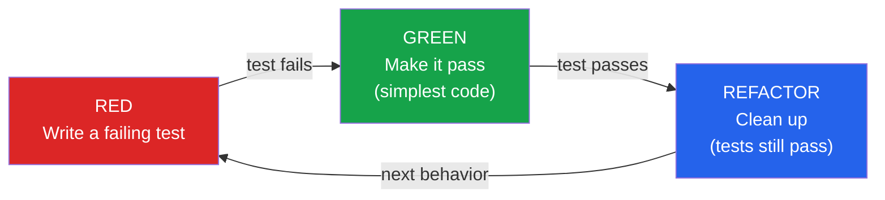
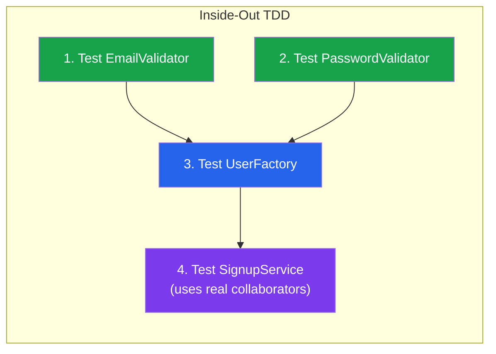
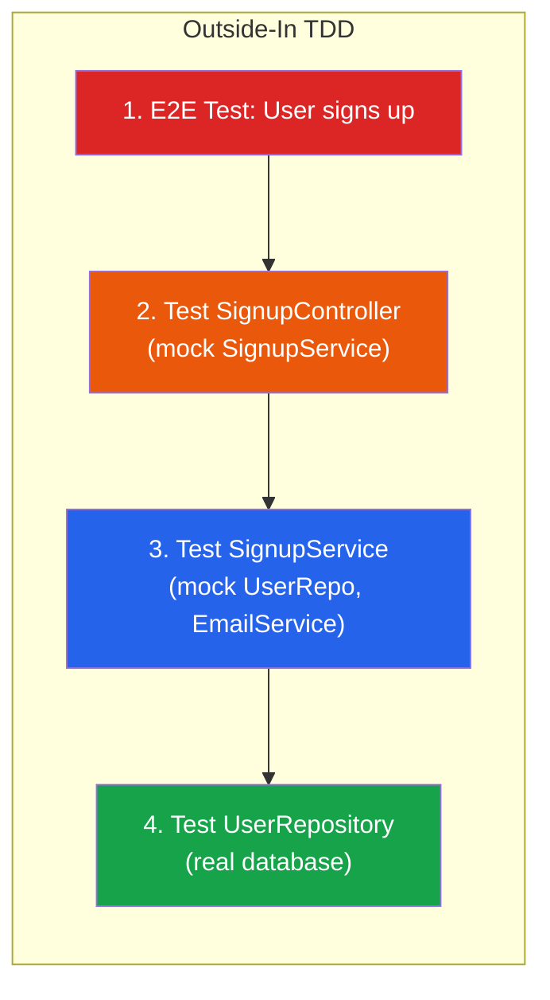
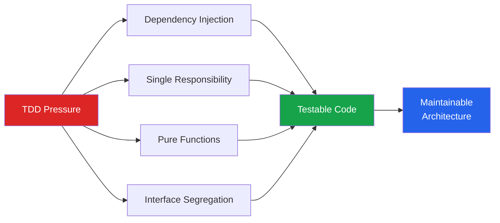

# TDD & BDD

Test-Driven Development (TDD) and Behavior-Driven Development (BDD) are not testing techniques. They are *design* techniques that use tests as the primary feedback mechanism. The difference matters: if you think TDD is about writing tests, you will write tests after the fact and wonder what the fuss is about. If you understand TDD as a design discipline, it fundamentally changes how you approach code.

## Test-Driven Development

TDD follows a simple, repeatable cycle: **Red, Green, Refactor**. You write a failing test, make it pass with the simplest possible code, then clean up. Every line of production code is written in response to a failing test.

### The Red-Green-Refactor Cycle



**Red**: Write a test that describes the next behavior you want. Run it. Watch it fail. The failure message confirms the test is checking the right thing.

**Green**: Write the minimum code to make the test pass. Do not write clever code. Do not optimize. Do not handle edge cases you have not written tests for. Just make the red test turn green.

**Refactor**: Now that the test passes, improve the code. Extract functions, rename variables, remove duplication. The tests protect you — if you break something, the tests catch it immediately.

### TDD Walkthrough: Building a Password Validator

Let us build a password validator step by step using TDD.

**Step 1 — RED: First behavior**

```typescript
import { describe, it, expect } from 'vitest';
import { validatePassword } from './password-validator';

describe('validatePassword', () => {
  it('rejects passwords shorter than 8 characters', () => {
    const result = validatePassword('short');
    expect(result.valid).toBe(false);
    expect(result.errors).toContain('Password must be at least 8 characters');
  });
});
```

This test fails because `validatePassword` does not exist yet. Good.

**Step 2 — GREEN: Simplest passing code**

```typescript
interface ValidationResult {
  valid: boolean;
  errors: string[];
}

export function validatePassword(password: string): ValidationResult {
  const errors: string[] = [];
  if (password.length < 8) {
    errors.push('Password must be at least 8 characters');
  }
  return { valid: errors.length === 0, errors };
}
```

Test passes. No refactoring needed yet.

**Step 3 — RED: Next behavior**

```typescript
it('rejects passwords without uppercase letters', () => {
  const result = validatePassword('alllowercase');
  expect(result.valid).toBe(false);
  expect(result.errors).toContain('Password must contain an uppercase letter');
});
```

Fails. The function does not check for uppercase.

**Step 4 — GREEN: Add the check**

```typescript
export function validatePassword(password: string): ValidationResult {
  const errors: string[] = [];
  if (password.length < 8) {
    errors.push('Password must be at least 8 characters');
  }
  if (!/[A-Z]/.test(password)) {
    errors.push('Password must contain an uppercase letter');
  }
  return { valid: errors.length === 0, errors };
}
```

**Step 5 — RED: Next behavior**

```typescript
it('rejects passwords without a digit', () => {
  const result = validatePassword('NoDigitsHere');
  expect(result.valid).toBe(false);
  expect(result.errors).toContain('Password must contain a digit');
});
```

**Step 6 — GREEN, then REFACTOR**

```typescript
// After green, refactor to extract rules
interface PasswordRule {
  test: (password: string) => boolean;
  message: string;
}

const rules: PasswordRule[] = [
  {
    test: (p) => p.length >= 8,
    message: 'Password must be at least 8 characters',
  },
  {
    test: (p) => /[A-Z]/.test(p),
    message: 'Password must contain an uppercase letter',
  },
  {
    test: (p) => /\d/.test(p),
    message: 'Password must contain a digit',
  },
];

export function validatePassword(password: string): ValidationResult {
  const errors = rules
    .filter((rule) => !rule.test(password))
    .map((rule) => rule.message);
  return { valid: errors.length === 0, errors };
}
```

Notice: the refactoring emerged naturally from the tests. We did not design the rule system upfront — it emerged when the duplication became clear. This is TDD's secret power.

**Step 7 — Happy path**

```typescript
it('accepts valid passwords', () => {
  const result = validatePassword('SecureP4ss');
  expect(result.valid).toBe(true);
  expect(result.errors).toEqual([]);
});
```

This test passes immediately with no code change — it confirms the existing logic handles the happy path correctly.

### The Three Rules of TDD

Kent Beck's original formulation:

1. **Do not write production code except to make a failing test pass.** Every line of code is justified by a test.
2. **Do not write more of a test than is sufficient to fail.** A compilation error counts as a failure.
3. **Do not write more production code than is sufficient to pass.** Resist the urge to "code ahead" of your tests.

::: warning TDD Is Not "Write All Tests First"
A common misconception is that TDD means writing all your tests before writing any code. It does not. You write *one* test, make it pass, then write the *next* test. The cycle is measured in minutes, not hours.
:::

## Outside-In vs Inside-Out TDD

There are two schools of TDD, and they lead to different designs.

### Inside-Out (Classic / Detroit School)

Start with the innermost, simplest components and build outward. You write [unit tests](/testing/unit-testing) for low-level functions first, then compose them into higher-level modules.



**Characteristics:**
- Tests use real objects, minimal mocking
- Design emerges from small, composable units
- Risk: you may build components that do not fit together
- Strength: low coupling to implementation details

### Outside-In (London School / Mockist)

Start with the outermost behavior — the acceptance test or user story — and drive inward. You [mock](/testing/unit-testing#test-doubles) collaborators that do not exist yet and implement them in the next cycle.



**Characteristics:**
- Starts with a failing [E2E](/testing/e2e-testing) or acceptance test
- Each layer mocks the layer below it
- Design is driven by consumer needs (top-down)
- Risk: heavy mocking couples tests to implementation
- Strength: ensures everything connects from the start

### Which to Choose?

| Factor | Inside-Out | Outside-In |
|--------|-----------|------------|
| **Team experience** | Good for beginners | Requires mocking fluency |
| **Domain clarity** | When you know the building blocks | When the user behavior is clear but internals are not |
| **Mocking comfort** | Low mocking preference | Comfortable with mocks |
| **Integration risk** | Higher — parts may not fit | Lower — connected from the start |
| **Architecture style** | Works with any | Pairs well with [hexagonal](/architecture-patterns/hexagonal/) |

::: tip In Practice, Use Both
Most experienced practitioners blend both styles. Start outside-in for a new feature (from the API or UI test down), switch to inside-out when building algorithmic or utility code, and use outside-in again to wire everything together.
:::

## Behavior-Driven Development

BDD extends TDD by focusing on *behavior specifications* written in natural language. Instead of technical test names, BDD uses a structured format that product managers, QA, and engineers can all read and discuss.

### The Gherkin Language

Gherkin is the specification language used by BDD frameworks like Cucumber, SpecFlow, and Behave.

```gherkin
Feature: User Registration
  As a new user
  I want to create an account
  So that I can access the platform

  Scenario: Successful registration with valid data
    Given I am on the registration page
    When I enter "alice@example.com" as my email
    And I enter "SecureP4ss!" as my password
    And I click "Create Account"
    Then I should be redirected to the dashboard
    And I should see a welcome message

  Scenario: Registration with existing email
    Given a user with email "alice@example.com" already exists
    And I am on the registration page
    When I enter "alice@example.com" as my email
    And I enter "SecureP4ss!" as my password
    And I click "Create Account"
    Then I should see an error "Email already registered"
    And I should remain on the registration page

  Scenario Outline: Password validation
    Given I am on the registration page
    When I enter "alice@example.com" as my email
    And I enter "<password>" as my password
    And I click "Create Account"
    Then I should see an error "<error>"

    Examples:
      | password    | error                                     |
      | short       | Password must be at least 8 characters    |
      | alllower1   | Password must contain an uppercase letter  |
      | ALLUPPER1   | Password must contain a lowercase letter   |
      | NoDigits!   | Password must contain a digit             |
```

### Step Definitions (TypeScript with Playwright)

Step definitions are the glue between Gherkin specifications and executable code.

```typescript
import { Given, When, Then } from '@cucumber/cucumber';
import { expect } from '@playwright/test';

Given('I am on the registration page', async function () {
  await this.page.goto('/register');
});

Given(
  'a user with email {string} already exists',
  async function (email: string) {
    await this.api.createUser({ email, password: 'TestPass123!' });
  }
);

When(
  'I enter {string} as my email',
  async function (email: string) {
    await this.page.getByLabel('Email').fill(email);
  }
);

When(
  'I enter {string} as my password',
  async function (password: string) {
    await this.page.getByLabel('Password').fill(password);
  }
);

When('I click {string}', async function (buttonText: string) {
  await this.page.getByRole('button', { name: buttonText }).click();
});

Then('I should be redirected to the dashboard', async function () {
  await expect(this.page).toHaveURL('/dashboard');
});

Then('I should see a welcome message', async function () {
  await expect(
    this.page.getByRole('heading', { name: /welcome/i })
  ).toBeVisible();
});

Then(
  'I should see an error {string}',
  async function (errorMessage: string) {
    await expect(this.page.getByRole('alert')).toContainText(errorMessage);
  }
);
```

### Step Definitions (Python with Behave)

```python
from behave import given, when, then

@given('I am on the registration page')
def step_visit_registration(context):
    context.page.goto("/register")

@when('I enter "{value}" as my email')
def step_enter_email(context, value):
    context.page.get_by_label("Email").fill(value)

@when('I enter "{value}" as my password')
def step_enter_password(context, value):
    context.page.get_by_label("Password").fill(value)

@when('I click "{button_text}"')
def step_click_button(context, button_text):
    context.page.get_by_role("button", name=button_text).click()

@then('I should see an error "{message}"')
def step_see_error(context, message):
    alert = context.page.get_by_role("alert")
    expect(alert).to_contain_text(message)
```

## BDD Without Cucumber

Many teams adopt BDD's *thinking* without using Gherkin and Cucumber. You can write BDD-style tests in any testing framework:

```typescript
describe('User Registration', () => {
  describe('given valid registration data', () => {
    describe('when the user submits the form', () => {
      it('then it creates an account and redirects to dashboard', async () => {
        // Arrange (Given)
        const page = await browser.newPage();
        await page.goto('/register');

        // Act (When)
        await page.getByLabel('Email').fill('alice@example.com');
        await page.getByLabel('Password').fill('SecureP4ss!');
        await page.getByRole('button', { name: 'Create Account' }).click();

        // Assert (Then)
        await expect(page).toHaveURL('/dashboard');
      });
    });
  });

  describe('given an email that already exists', () => {
    describe('when the user submits the form', () => {
      it('then it shows a duplicate email error', async () => {
        // ...
      });
    });
  });
});
```

This approach gives you the readability benefits of BDD without the overhead of maintaining Gherkin files and step definitions.

## When TDD Helps vs Hurts

### TDD Helps When

| Situation | Why TDD Works |
|-----------|--------------|
| **Clear requirements** | You know what the behavior should be — tests are easy to write |
| **Complex business logic** | Tests catch regressions immediately as you add rules |
| **Greenfield development** | No legacy code to fight — TDD shapes the design from the start |
| **Refactoring** | Tests give you a safety net for aggressive refactoring |
| **API design** | Writing tests first forces you to think about the interface before the implementation |
| **Bug reproduction** | Write a failing test, then fix — the bug can never return |

### TDD Hurts When

| Situation | Why TDD Struggles |
|-----------|------------------|
| **Exploratory / prototype code** | You do not know what you are building yet — tests add friction |
| **Heavy UI work** | Visual behavior is hard to express in tests; prefer [visual regression](/testing/e2e-testing#visual-regression-testing) |
| **Legacy code with no tests** | You cannot TDD when you cannot run tests; start with characterization tests |
| **Framework glue code** | Wiring up Express routes or React components has little logic to test |
| **Infrastructure code** | Terraform, Docker configs — integration/smoke tests are more useful |
| **Extreme time pressure** | If you genuinely have 2 hours to ship, skip TDD — but write tests afterward |

::: tip The Pragmatic Approach
Strict TDD purists say you should never write production code without a failing test. Pragmatists say: use TDD when it helps, skip it when it adds friction, but always have tests before merging. The important thing is that code is tested — not whether the test was written first or second.
:::

## TDD and Architecture

TDD has a powerful but often overlooked relationship with architecture. Code that is hard to test is almost always poorly designed:

- **Too many dependencies?** The constructor takes 10 parameters. [Hexagonal architecture](/architecture-patterns/hexagonal/) solves this.
- **Side effects everywhere?** Business logic is mixed with I/O. [Clean architecture](/architecture-patterns/clean-architecture/) separates them.
- **Global state?** Singletons and module-level variables make tests non-deterministic. Dependency injection fixes this.



The "design pressure" of TDD naturally pushes code toward better architecture. This is perhaps TDD's greatest value — not the tests themselves, but the design they produce.

## Measuring TDD Effectiveness

Do not measure TDD by code coverage. Measure it by:

| Metric | What It Tells You |
|--------|------------------|
| **Time to fix bugs** | TDD should reduce debugging time significantly |
| **Regression rate** | Bugs that come back after being fixed — should be near zero with TDD |
| **Refactoring confidence** | Can engineers refactor without fear? |
| **Test suite run time** | TDD produces fast, focused tests — suite should stay fast |
| **Defect escape rate** | How many bugs reach production? |

## Further Reading

- [Unit Testing](/testing/unit-testing) — the tactical foundation TDD builds on
- [Test Architecture](/testing/test-architecture) — organizing the tests TDD produces at scale
- [E2E Testing](/testing/e2e-testing) — outside-in TDD often starts with an E2E test
- [Hexagonal Architecture](/architecture-patterns/hexagonal/) — the architecture that TDD naturally produces
- [Clean Architecture](/architecture-patterns/clean-architecture/) — separating business logic from side effects, as TDD demands
