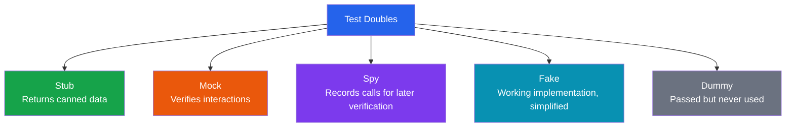

# Unit Testing Patterns

A unit test verifies that a single unit of code — typically a function, method, or class — behaves correctly in isolation. "In isolation" is the critical phrase. If your test requires a running database, a network connection, or another service to be up, it is not a unit test. It is an [integration test](/testing/integration-testing), and it belongs in a different layer of your [testing pyramid](/testing/).

Good unit tests share five properties, sometimes called the F.I.R.S.T. principles:

| Property | Meaning |
|----------|---------|
| **Fast** | Runs in milliseconds, not seconds |
| **Independent** | Does not depend on the outcome of other tests |
| **Repeatable** | Produces the same result every time, in every environment |
| **Self-validating** | Passes or fails without human interpretation |
| **Timely** | Written close in time to the code it tests (ideally before, via [TDD](/testing/tdd-bdd)) |

## The AAA Pattern

Every well-structured unit test follows three phases: **Arrange**, **Act**, **Assert**. This pattern is universal across languages and frameworks.

```typescript
// TypeScript — Vitest / Jest
import { describe, it, expect } from 'vitest';
import { calculateDiscount } from './pricing';

describe('calculateDiscount', () => {
  it('applies 10% discount for orders over $100', () => {
    // Arrange
    const orderTotal = 150;
    const customerTier = 'standard';

    // Act
    const discount = calculateDiscount(orderTotal, customerTier);

    // Assert
    expect(discount).toBe(15);
  });
});
```

```python
# Python — pytest
from pricing import calculate_discount

def test_applies_10_percent_discount_for_orders_over_100():
    # Arrange
    order_total = 150
    customer_tier = "standard"

    # Act
    discount = calculate_discount(order_total, customer_tier)

    # Assert
    assert discount == 15
```

```go
// Go — testing
func TestCalculateDiscount_StandardTierOver100(t *testing.T) {
    // Arrange
    orderTotal := 150.0
    customerTier := "standard"

    // Act
    discount := CalculateDiscount(orderTotal, customerTier)

    // Assert
    if discount != 15.0 {
        t.Errorf("expected 15.0, got %f", discount)
    }
}
```

### Why AAA Works

The pattern creates a predictable structure that any engineer can read and understand in seconds. When a test fails, you immediately know:

- **Arrange** — what was the starting state?
- **Act** — what operation was performed?
- **Assert** — what expectation was violated?

::: tip Keep Each Phase Short
If your Arrange section is more than 5-10 lines, consider extracting a factory or builder (see [Test Architecture](/testing/test-architecture)). If you have multiple Act steps, you are probably testing more than one behavior — split it into separate tests.
:::

## Test Doubles

Test doubles are objects that stand in for real dependencies during testing. The term comes from "stunt double" in film — they look like the real thing from the outside but behave differently on the inside.

### Taxonomy of Test Doubles



| Double | Purpose | Example |
|--------|---------|---------|
| **Stub** | Provides predetermined responses to calls | A payment gateway stub that always returns "approved" |
| **Mock** | Verifies that specific methods were called with specific arguments | Assert that `emailService.send()` was called exactly once |
| **Spy** | Wraps a real object and records calls without changing behavior | Wrap the real logger and check what was logged |
| **Fake** | A working but simplified implementation | An in-memory database instead of PostgreSQL |
| **Dummy** | Satisfies a parameter but is never actually used | An empty config object passed to satisfy a constructor |

### Stubs in Practice

Stubs control the indirect inputs to your system under test.

```typescript
// TypeScript — stubbing an external service
import { vi, describe, it, expect } from 'vitest';
import { OrderService } from './order-service';
import { InventoryClient } from './inventory-client';

describe('OrderService.placeOrder', () => {
  it('places order when inventory is available', async () => {
    // Arrange — stub the inventory client
    const inventoryClient: InventoryClient = {
      checkStock: vi.fn().mockResolvedValue({ available: true, quantity: 50 }),
    };
    const orderService = new OrderService(inventoryClient);

    // Act
    const result = await orderService.placeOrder('SKU-123', 2);

    // Assert
    expect(result.status).toBe('confirmed');
  });

  it('rejects order when inventory is unavailable', async () => {
    const inventoryClient: InventoryClient = {
      checkStock: vi.fn().mockResolvedValue({ available: false, quantity: 0 }),
    };
    const orderService = new OrderService(inventoryClient);

    const result = await orderService.placeOrder('SKU-123', 2);

    expect(result.status).toBe('rejected');
    expect(result.reason).toBe('out_of_stock');
  });
});
```

### Mocks in Practice

Mocks verify indirect outputs — things your code does to the outside world.

```python
# Python — mocking with unittest.mock
from unittest.mock import Mock, call
from notification_service import NotificationService
from order_processor import OrderProcessor

def test_sends_confirmation_email_after_order():
    # Arrange
    notification_service = Mock(spec=NotificationService)
    processor = OrderProcessor(notification_service)

    # Act
    processor.complete_order(order_id="ORD-42", email="user@example.com")

    # Assert — verify the interaction
    notification_service.send_email.assert_called_once_with(
        to="user@example.com",
        template="order_confirmation",
        context={"order_id": "ORD-42"},
    )
```

### Spies in Practice

Spies let you observe without changing behavior — useful when you want real logic but need to verify calls.

```typescript
import { vi, describe, it, expect } from 'vitest';
import { Logger } from './logger';
import { UserService } from './user-service';

describe('UserService', () => {
  it('logs a warning when user not found', () => {
    const logger = new Logger();
    const logSpy = vi.spyOn(logger, 'warn');
    const userService = new UserService(logger);

    userService.findById('nonexistent-id');

    expect(logSpy).toHaveBeenCalledWith(
      expect.stringContaining('not found')
    );
    logSpy.mockRestore();
  });
});
```

### Fakes in Practice

Fakes are working implementations with shortcuts — an in-memory repository instead of a real database.

```go
// Go — fake repository
type FakeUserRepository struct {
    users map[string]*User
}

func NewFakeUserRepository() *FakeUserRepository {
    return &FakeUserRepository{users: make(map[string]*User)}
}

func (r *FakeUserRepository) Save(user *User) error {
    r.users[user.ID] = user
    return nil
}

func (r *FakeUserRepository) FindByID(id string) (*User, error) {
    user, exists := r.users[id]
    if !exists {
        return nil, ErrUserNotFound
    }
    return user, nil
}

func TestUserService_CreateUser(t *testing.T) {
    repo := NewFakeUserRepository()
    service := NewUserService(repo)

    user, err := service.CreateUser("alice@example.com")

    if err != nil {
        t.Fatalf("unexpected error: %v", err)
    }
    if user.Email != "alice@example.com" {
        t.Errorf("expected alice@example.com, got %s", user.Email)
    }

    // Verify it was persisted
    found, _ := repo.FindByID(user.ID)
    if found == nil {
        t.Error("user was not saved to repository")
    }
}
```

::: warning Mock vs Stub: The Critical Difference
Stubs provide data to your code. Mocks verify what your code did. If you use mocks everywhere, your tests become coupled to implementation details and break when you refactor. **Default to stubs; use mocks only when verifying an important side effect** (sending an email, publishing an event, charging a credit card).
:::

## Testing Pure Functions vs Side Effects

### Pure Functions

Pure functions are the easiest code to test. Given the same inputs, they always produce the same output and have no side effects.

```typescript
// Pure function — trivial to test
function calculateTax(amount: number, rate: number): number {
  return Math.round(amount * rate * 100) / 100;
}

describe('calculateTax', () => {
  it.each([
    [100, 0.1, 10],
    [99.99, 0.0825, 8.25],
    [0, 0.1, 0],
    [1000, 0, 0],
  ])('calculateTax(%d, %d) = %d', (amount, rate, expected) => {
    expect(calculateTax(amount, rate)).toBe(expected);
  });
});
```

### Side Effects

Side effects — database writes, API calls, file I/O, timestamps — require test doubles to isolate.

```typescript
// Function with side effects — needs dependency injection
interface Clock {
  now(): Date;
}

interface AuditLog {
  record(entry: AuditEntry): Promise<void>;
}

class TransferService {
  constructor(
    private clock: Clock,
    private auditLog: AuditLog,
  ) {}

  async transfer(from: string, to: string, amount: number): Promise<void> {
    // Business logic here...
    await this.auditLog.record({
      action: 'transfer',
      from,
      to,
      amount,
      timestamp: this.clock.now(),
    });
  }
}

// Test with stubs for side effects
describe('TransferService', () => {
  it('records an audit entry with the current timestamp', async () => {
    const fixedDate = new Date('2026-01-15T10:00:00Z');
    const clock: Clock = { now: () => fixedDate };
    const auditLog: AuditLog = { record: vi.fn().mockResolvedValue(undefined) };
    const service = new TransferService(clock, auditLog);

    await service.transfer('ACC-1', 'ACC-2', 500);

    expect(auditLog.record).toHaveBeenCalledWith(
      expect.objectContaining({
        action: 'transfer',
        amount: 500,
        timestamp: fixedDate,
      })
    );
  });
});
```

::: tip Design for Testability
If a function is hard to test, the problem is usually the function, not the test. Extract side effects into injectable dependencies. Push I/O to the edges of your system. The core business logic should be pure functions that are trivial to test. This is the fundamental idea behind [hexagonal architecture](/architecture-patterns/hexagonal/) and [clean architecture](/architecture-patterns/clean-architecture/).
:::

## What Makes a Good Unit Test

### The Seven Properties

1. **Tests one behavior.** A test named `test_order_processing` that checks validation, pricing, inventory, and email is testing four behaviors. Split it.

2. **Has a descriptive name.** The name should describe the scenario and expected outcome: `rejects_order_when_inventory_is_zero` is better than `test_order_3`.

3. **Is deterministic.** No randomness, no time dependencies, no reliance on test execution order. If a test passes 99% of the time, it is broken.

4. **Is fast.** A unit test that takes more than 100ms is suspect. A unit test that takes more than 1 second is broken.

5. **Does not test the framework.** Do not test that `Array.push()` works. Do not test that your ORM can save a record. Test *your* code.

6. **Fails clearly.** When a test fails, the error message should tell you exactly what went wrong without reading the test source code.

7. **Is independent.** Tests must pass in any order. If test B depends on state from test A, both tests are broken.

### Naming Conventions

Use a consistent naming convention across your codebase. Here are three popular approaches:

```
// Pattern 1: describe/it (BDD-style)
describe('ShoppingCart')
  it('applies coupon discount to total')
  it('rejects expired coupons')
  it('limits one coupon per order')

// Pattern 2: methodName_scenario_expectedResult
calculateShipping_internationalOrder_addsCustomsFee
calculateShipping_freeShippingThreshold_returnsZero

// Pattern 3: should-style
should_reject_order_when_payment_fails
should_send_confirmation_when_order_succeeds
```

Pick one and enforce it. Consistency matters more than which convention you choose.

## Framework Comparison

| Feature | Jest | Vitest | pytest | Go testing |
|---------|------|--------|--------|------------|
| **Language** | JavaScript/TypeScript | JavaScript/TypeScript | Python | Go |
| **Speed** | Moderate | Fast (native ESM) | Fast | Very fast |
| **Mocking** | Built-in (`jest.fn()`) | Built-in (`vi.fn()`) | `unittest.mock` / `pytest-mock` | Manual or `gomock` |
| **Assertions** | `expect()` matchers | `expect()` matchers | `assert` keyword | `if/t.Errorf` or `testify` |
| **Parameterized** | `it.each()` | `it.each()` | `@pytest.mark.parametrize` | Table-driven tests |
| **Watch Mode** | `--watch` | `--watch` (HMR-based) | `pytest-watch` | Manual |
| **Coverage** | `--coverage` | `--coverage` (v8/istanbul) | `pytest-cov` | `-cover` flag |
| **Snapshot** | Built-in | Built-in | `snapshottest` | None (use golden files) |

### Go Table-Driven Tests

Go's idiomatic testing pattern is table-driven tests — a slice of test cases iterated in a loop.

```go
func TestParseAmount(t *testing.T) {
    tests := []struct {
        name    string
        input   string
        want    int64
        wantErr bool
    }{
        {"whole dollars", "42", 4200, false},
        {"with cents", "42.50", 4250, false},
        {"zero", "0", 0, false},
        {"negative", "-10", -1000, false},
        {"invalid", "abc", 0, true},
        {"empty string", "", 0, true},
        {"overflow", "99999999999999", 0, true},
    }

    for _, tt := range tests {
        t.Run(tt.name, func(t *testing.T) {
            got, err := ParseAmount(tt.input)
            if (err != nil) != tt.wantErr {
                t.Errorf("ParseAmount(%q) error = %v, wantErr %v",
                    tt.input, err, tt.wantErr)
                return
            }
            if got != tt.want {
                t.Errorf("ParseAmount(%q) = %d, want %d",
                    tt.input, got, tt.want)
            }
        })
    }
}
```

### pytest Parameterized Tests

```python
import pytest
from parser import parse_amount

@pytest.mark.parametrize("input_str, expected", [
    ("42", 4200),
    ("42.50", 4250),
    ("0", 0),
    ("-10", -1000),
])
def test_parse_amount_valid(input_str, expected):
    assert parse_amount(input_str) == expected

@pytest.mark.parametrize("input_str", ["abc", "", "99999999999999"])
def test_parse_amount_invalid(input_str):
    with pytest.raises(ValueError):
        parse_amount(input_str)
```

## Common Anti-Patterns

### 1. Testing Implementation Details

```typescript
// BAD — coupled to internal structure
test('stores users in _cache map', () => {
  const service = new UserService();
  service.loadUser('123');
  expect(service['_cache'].has('123')).toBe(true);
});

// GOOD — tests observable behavior
test('returns cached user on second call without re-fetching', () => {
  const api = { fetchUser: vi.fn().mockResolvedValue({ id: '123' }) };
  const service = new UserService(api);

  await service.loadUser('123');
  await service.loadUser('123');

  expect(api.fetchUser).toHaveBeenCalledTimes(1);
});
```

### 2. Multiple Assertions on Unrelated Behaviors

```python
# BAD — tests too many things
def test_user():
    user = create_user("alice", "alice@test.com")
    assert user.name == "alice"            # creation
    assert user.email == "alice@test.com"  # creation
    user.deactivate()
    assert user.is_active is False         # deactivation
    assert user.deactivated_at is not None # deactivation

# GOOD — focused tests
def test_create_user_sets_name_and_email():
    user = create_user("alice", "alice@test.com")
    assert user.name == "alice"
    assert user.email == "alice@test.com"

def test_deactivate_sets_inactive_with_timestamp():
    user = create_user("alice", "alice@test.com")
    user.deactivate()
    assert user.is_active is False
    assert user.deactivated_at is not None
```

### 3. Excessive Mocking

If you have to mock five dependencies to test one function, the function has too many responsibilities. Refactor the code, not the test.

### 4. Tests Without Assertions

A test that never asserts anything always passes — and is worse than no test at all because it creates false confidence.

```typescript
// BAD — no assertion, just "doesn't throw"
test('processes order', async () => {
  const service = new OrderService();
  await service.process(mockOrder);
  // ... nothing asserted
});
```

## Edge Cases to Always Test

Regardless of what your function does, consider testing these categories:

| Category | Examples |
|----------|---------|
| **Boundary values** | 0, 1, -1, MAX_INT, empty string, single character |
| **Empty collections** | Empty array, empty object, null, undefined |
| **Error conditions** | Invalid input, network failure, timeout |
| **Concurrency** | Duplicate calls, race conditions (where applicable) |
| **Type coercion** | "0" vs 0, null vs undefined (JavaScript-specific) |

## Further Reading

- [Integration Testing](/testing/integration-testing) — when unit tests are not enough and you need to test real boundaries
- [TDD & BDD](/testing/tdd-bdd) — writing tests before code to drive design
- [Test Architecture](/testing/test-architecture) — organizing test suites, factories, and fixtures at scale
- [Property-Based Testing](/testing/property-based-testing) — generating thousands of edge cases automatically
- [Hexagonal Architecture](/architecture-patterns/hexagonal/) — an architecture pattern designed around testability
