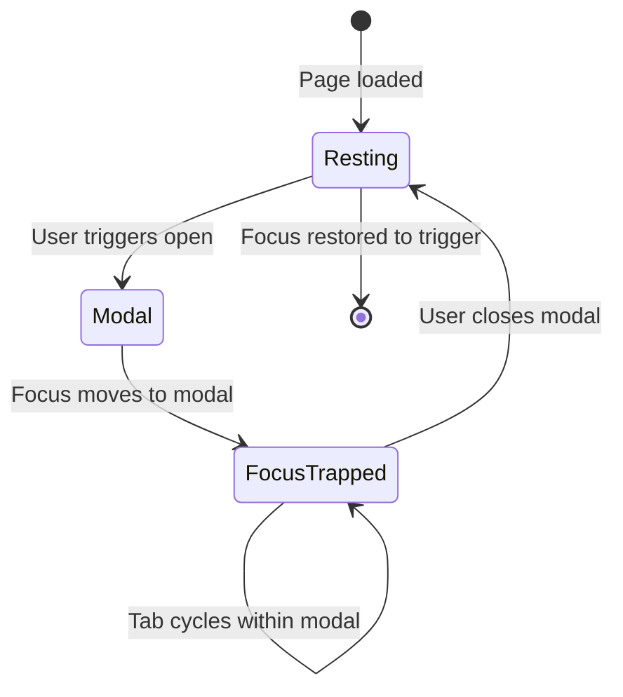

# Focus Management

Focus management is the most complex aspect of keyboard accessibility. When UI changes dramatically — a modal opens, a page navigates, a panel expands — keyboard users need their focus guided to the right place. Without intentional focus management, focus is lost or trapped in invisible content.

## The Focus Lifecycle

Every dynamic UI change requires answering:
1. **Where does focus go when this opens/appears?**
2. **What happens to focus within this element?**
3. **Where does focus go when this closes/disappears?**



## Focus Trapping

When a modal dialog is open, focus must be confined to it. If focus escapes the modal:
- Screen reader users hear content outside the modal
- Keyboard users interact with background content

The pattern: intercept Tab and Shift+Tab to cycle within the modal.

```typescript
// focus-trap.ts

export class FocusTrap {
  private container: HTMLElement;
  private firstFocusable: HTMLElement | null = null;
  private lastFocusable: HTMLElement | null = null;
  private previouslyFocused: HTMLElement | null = null;
  private active = false;

  // All elements that are keyboard-focusable
  private static FOCUSABLE_SELECTORS = [
    'a[href]',
    'button:not([disabled])',
    'input:not([disabled]):not([type="hidden"])',
    'select:not([disabled])',
    'textarea:not([disabled])',
    '[tabindex]:not([tabindex="-1"])',
    'details > summary',
    'audio[controls]',
    'video[controls]',
    '[contenteditable]:not([contenteditable="false"])',
  ].join(', ');

  constructor(container: HTMLElement) {
    this.container = container;
  }

  private getFocusableElements(): HTMLElement[] {
    return Array.from(
      this.container.querySelectorAll<HTMLElement>(FocusTrap.FOCUSABLE_SELECTORS)
    ).filter(el => {
      // Exclude elements with aria-hidden ancestors
      let node: Element | null = el;
      while (node) {
        if (node.getAttribute('aria-hidden') === 'true') return false;
        node = node.parentElement;
      }
      return true;
    });
  }

  activate(initialFocus?: HTMLElement): void {
    if (this.active) return;

    this.previouslyFocused = document.activeElement as HTMLElement;
    this.active = true;

    // Find focusable elements
    const focusable = this.getFocusableElements();
    this.firstFocusable = focusable[0] ?? null;
    this.lastFocusable = focusable[focusable.length - 1] ?? null;

    // Move focus into the trap
    const focusTarget = initialFocus ?? this.firstFocusable ?? this.container;
    focusTarget.focus();

    // Trap keyboard events
    this.container.addEventListener('keydown', this.handleKeyDown);

    // Block focus from escaping via outside click
    document.addEventListener('focusin', this.handleFocusIn);
  }

  deactivate(restoreFocus = true): void {
    if (!this.active) return;

    this.active = false;
    this.container.removeEventListener('keydown', this.handleKeyDown);
    document.removeEventListener('focusin', this.handleFocusIn);

    if (restoreFocus && this.previouslyFocused) {
      // Restore focus to the element that was focused before trap activated
      this.previouslyFocused.focus({ preventScroll: true });
    }
  }

  private handleKeyDown = (e: KeyboardEvent): void => {
    if (e.key !== 'Tab') return;

    // Refresh focusable list on each Tab (DOM may have changed)
    const focusable = this.getFocusableElements();
    const first = focusable[0];
    const last = focusable[focusable.length - 1];

    if (!first || !last) return;

    const isShiftTab = e.shiftKey;
    const isFirstFocused = document.activeElement === first;
    const isLastFocused = document.activeElement === last;

    if (isShiftTab && isFirstFocused) {
      // Wrap: Shift+Tab from first → go to last
      e.preventDefault();
      last.focus();
    } else if (!isShiftTab && isLastFocused) {
      // Wrap: Tab from last → go to first
      e.preventDefault();
      first.focus();
    }
    // Otherwise: natural tab order within the trap
  };

  private handleFocusIn = (e: FocusEvent): void => {
    if (!this.container.contains(e.target as Node)) {
      // Focus escaped the container (e.g., via programmatic focus elsewhere)
      e.stopPropagation();
      const focusable = this.getFocusableElements();
      if (focusable.length > 0) {
        focusable[0].focus();
      } else {
        this.container.focus();
      }
    }
  };
}
```

## Modal Dialog — Complete Implementation

```tsx
// components/Modal/Modal.tsx
import React, { useEffect, useRef, useCallback } from 'react';
import { FocusTrap } from '../../utils/focus-trap';
import { createPortal } from 'react-dom';
import styles from './Modal.module.css';

interface ModalProps {
  isOpen: boolean;
  onClose: () => void;
  title: string;
  children: React.ReactNode;
  initialFocusRef?: React.RefObject<HTMLElement>;
  closeOnOverlayClick?: boolean;
  closeOnEscape?: boolean;
}

export function Modal({
  isOpen,
  onClose,
  title,
  children,
  initialFocusRef,
  closeOnOverlayClick = true,
  closeOnEscape = true,
}: ModalProps) {
  const dialogRef = useRef<HTMLDivElement>(null);
  const titleId = useRef(`modal-title-${Math.random().toString(36).slice(2)}`).current;
  const focusTrapRef = useRef<FocusTrap | null>(null);

  // Activate/deactivate focus trap
  useEffect(() => {
    if (!dialogRef.current) return;

    if (isOpen) {
      const trap = new FocusTrap(dialogRef.current);
      focusTrapRef.current = trap;

      // Focus initial element or first focusable
      trap.activate(initialFocusRef?.current ?? undefined);

      // Prevent body scroll while modal is open
      document.body.style.overflow = 'hidden';

      return () => {
        trap.deactivate(true); // Restore focus to trigger
        focusTrapRef.current = null;
        document.body.style.overflow = '';
      };
    }
  }, [isOpen, initialFocusRef]);

  // Escape key handler
  useEffect(() => {
    if (!isOpen || !closeOnEscape) return;

    const handleEscape = (e: KeyboardEvent) => {
      if (e.key === 'Escape') {
        e.stopPropagation();
        onClose();
      }
    };

    document.addEventListener('keydown', handleEscape, { capture: true });
    return () => document.removeEventListener('keydown', handleEscape, { capture: true });
  }, [isOpen, closeOnEscape, onClose]);

  const handleOverlayClick = useCallback((e: React.MouseEvent) => {
    if (closeOnOverlayClick && e.target === e.currentTarget) {
      onClose();
    }
  }, [closeOnOverlayClick, onClose]);

  if (!isOpen) return null;

  return createPortal(
    <div
      className={styles.overlay}
      onClick={handleOverlayClick}
      aria-hidden={!isOpen}
    >
      <div
        ref={dialogRef}
        role="dialog"
        aria-modal="true"
        aria-labelledby={titleId}
        className={styles.dialog}
      >
        <div className={styles.header}>
          <h2 id={titleId} className={styles.title}>{title}</h2>
          <button
            type="button"
            className={styles.closeButton}
            onClick={onClose}
            aria-label="Close dialog"
          >
            <span aria-hidden="true">×</span>
          </button>
        </div>
        <div className={styles.body}>
          {children}
        </div>
      </div>
    </div>,
    document.body
  );
}
```

## Focus Restoration

When a component closes, focus must return to the element that triggered it:

```typescript
// hooks/useFocusReturn.ts
import { useRef, useEffect } from 'react';

/**
 * Returns focus to the previously focused element when the component unmounts
 * or when `shouldReturn` changes from true to false.
 */
export function useFocusReturn(shouldReturn: boolean): void {
  const savedFocusRef = useRef<HTMLElement | null>(null);

  useEffect(() => {
    if (shouldReturn) {
      // Save current focus when component becomes active
      savedFocusRef.current = document.activeElement as HTMLElement;
    } else {
      // Restore focus when component becomes inactive
      if (savedFocusRef.current) {
        // Check if element is still in DOM and focusable
        if (document.contains(savedFocusRef.current)) {
          savedFocusRef.current.focus({ preventScroll: true });
        }
        savedFocusRef.current = null;
      }
    }
  }, [shouldReturn]);
}

// Usage with useEffect for cleanup
export function useFocusReturnOnUnmount(): void {
  const savedFocusRef = useRef<HTMLElement | null>(null);

  useEffect(() => {
    savedFocusRef.current = document.activeElement as HTMLElement;

    return () => {
      if (savedFocusRef.current && document.contains(savedFocusRef.current)) {
        savedFocusRef.current.focus({ preventScroll: true });
      }
    };
  }, []);
}
```

## The :focus-visible Pseudo-class

`:focus-visible` applies only when the browser determines the user is navigating by keyboard (not mouse):

```css
/* Remove default focus ring */
:focus {
  outline: none;
}

/* Add custom ring only for keyboard navigation */
:focus-visible {
  outline: 2px solid var(--color-border-focus);
  outline-offset: 2px;
}

/* Enhanced double-ring pattern */
:focus-visible {
  outline: 2px solid var(--color-border-focus);
  outline-offset: 2px;
  box-shadow: 0 0 0 4px color-mix(in oklch, var(--color-border-focus) 25%, transparent);
}

/* Button-specific focus */
.button:focus-visible {
  outline: 2px solid var(--color-action-primary);
  outline-offset: 3px;
}

/* Input-specific focus */
.input:focus-visible {
  outline: 2px solid var(--color-border-focus);
  border-color: var(--color-border-focus);
  box-shadow: 0 0 0 3px color-mix(in oklch, var(--color-border-focus) 20%, transparent);
}
```

## Focus Within Dark Backgrounds

The double-ring pattern ensures focus is visible on any background:

```css
/* Method 1: Hard white offset */
:focus-visible {
  outline: 2px solid var(--color-brand);
  outline-offset: 2px;
  /* Inner white ring contrasts against dark, outer blue ring contrasts against white */
  box-shadow:
    0 0 0 2px white,
    0 0 0 4px var(--color-brand);
}

/* Method 2: Use HSL transparency */
:focus-visible {
  outline: 2px solid var(--color-brand);
  outline-offset: 4px;
}

/* Invert for dark backgrounds using data attribute */
[data-theme="dark"] :focus-visible {
  outline-color: oklch(80% 0.15 264); /* Lighter blue for dark bg */
}
```

## Managing Focus in React Route Transitions

```tsx
// components/RouteAnnouncer.tsx
// Focus the new page title after navigation

import { useEffect, useRef } from 'react';
import { useLocation } from 'react-router-dom';

export function RouteAnnouncer() {
  const location = useLocation();
  const headingRef = useRef<HTMLHeadingElement | null>(null);

  useEffect(() => {
    // After route change, focus the main heading
    const h1 = document.querySelector<HTMLHeadingElement>('main h1');
    if (h1) {
      h1.tabIndex = -1;
      h1.focus({ preventScroll: false }); // Allow scroll to top

      // Remove tabindex after focus (don't pollute tab order)
      h1.addEventListener('blur', () => {
        h1.removeAttribute('tabindex');
      }, { once: true });
    }
  }, [location.pathname]);

  return null;
}
```

## Combobox / Autocomplete Focus Pattern

The combobox pattern is one of the most complex focus management scenarios:

```typescript
// Combobox focus states:
// 1. Input focused, dropdown closed (normal state)
// 2. Input focused, dropdown open (typing/browsing)
// 3. Option hovered (focus stays on input, aria-activedescendant changes)
// 4. Option selected (dropdown closes, focus stays on input)

class ComboboxFocusManager {
  private input: HTMLInputElement;
  private listbox: HTMLElement;
  private activeId: string | null = null;

  constructor(input: HTMLInputElement, listbox: HTMLElement) {
    this.input = input;
    this.listbox = listbox;
    this.setup();
  }

  private setup(): void {
    this.input.setAttribute('role', 'combobox');
    this.input.setAttribute('aria-expanded', 'false');
    this.input.setAttribute('aria-haspopup', 'listbox');
    this.input.setAttribute('aria-autocomplete', 'list');
    this.input.setAttribute('aria-controls', this.listbox.id);

    this.input.addEventListener('keydown', this.handleKeyDown);
  }

  private handleKeyDown = (e: KeyboardEvent): void => {
    const isExpanded = this.input.getAttribute('aria-expanded') === 'true';

    switch (e.key) {
      case 'ArrowDown':
        e.preventDefault();
        if (!isExpanded) this.openListbox();
        this.moveSelection(1);
        break;

      case 'ArrowUp':
        e.preventDefault();
        if (!isExpanded) this.openListbox();
        this.moveSelection(-1);
        break;

      case 'Enter':
        if (isExpanded && this.activeId) {
          e.preventDefault();
          this.selectOption(this.activeId);
        }
        break;

      case 'Escape':
        if (isExpanded) {
          e.preventDefault();
          this.closeListbox();
          // Focus stays on input — don't move it
        }
        break;

      case 'Tab':
        if (isExpanded) this.closeListbox();
        // Don't prevent default — allow Tab to move focus naturally
        break;
    }
  };

  private moveSelection(direction: 1 | -1): void {
    const options = Array.from(
      this.listbox.querySelectorAll<HTMLElement>('[role="option"]:not([aria-disabled="true"])')
    );

    if (options.length === 0) return;

    const currentIndex = this.activeId
      ? options.findIndex(o => o.id === this.activeId)
      : -1;

    const newIndex = Math.max(0, Math.min(
      options.length - 1,
      currentIndex + direction
    ));

    const newOption = options[newIndex];
    this.setActiveOption(newOption);
  }

  setActiveOption(option: HTMLElement): void {
    // Remove previous active indicator
    if (this.activeId) {
      document.getElementById(this.activeId)?.removeAttribute('aria-selected');
    }

    this.activeId = option.id;
    option.setAttribute('aria-selected', 'true');

    // aria-activedescendant: focus visually stays on input
    // but screen reader announces the option
    this.input.setAttribute('aria-activedescendant', option.id);

    // Scroll option into view
    option.scrollIntoView({ block: 'nearest' });
  }

  openListbox(): void {
    this.listbox.removeAttribute('hidden');
    this.input.setAttribute('aria-expanded', 'true');
  }

  closeListbox(): void {
    this.listbox.setAttribute('hidden', '');
    this.input.setAttribute('aria-expanded', 'false');
    this.input.removeAttribute('aria-activedescendant');
    this.activeId = null;
  }

  private selectOption(optionId: string): void {
    const option = document.getElementById(optionId);
    if (!option) return;

    const value = option.textContent?.trim() ?? '';
    this.input.value = value;
    this.closeListbox();

    // Dispatch change event for React controlled components
    const event = new Event('input', { bubbles: true });
    this.input.dispatchEvent(event);
  }
}
```

::: info War Story
A design system team shipped a popover menu component where closing the popover sent focus to `document.body` (the default when the trigger was removed from DOM). Screen reader users who opened a menu in the middle of a long list found themselves at the top of the page after closing it — they had to re-navigate the entire page to continue. The fix was a 3-line `useEffect` that saved the triggering element's ref and restored focus to it on close. This is the most common focus management bug in SPAs.
:::
