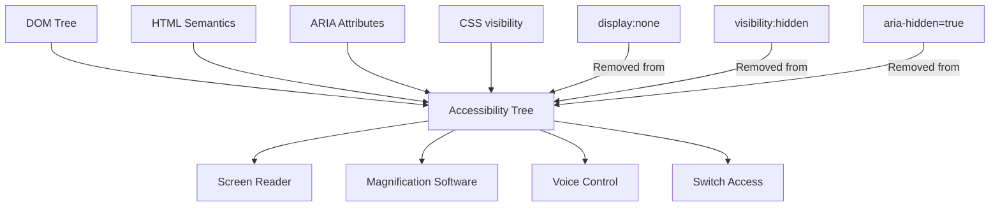

# Accessibility Overview

Accessibility is the practice of building interfaces that work for all users, including those with disabilities. It is not a feature you add at the end — it is a quality dimension woven into every architectural decision, every component, and every interaction pattern.

## The Scale of the Problem

Disability affects approximately 15% of the global population (WHO, 2023). This is not a niche audience:

| Disability Category | Global Prevalence | Relevant Technologies |
|--------------------|------------------|----------------------|
| Visual (low vision, blindness) | 2.2 billion | Screen readers, magnification, high contrast |
| Motor (limited dexterity, paralysis) | 75 million | Keyboard navigation, switch access, voice control |
| Hearing (deaf, hard of hearing) | 430 million | Captions, transcripts, visual alerts |
| Cognitive (ADHD, dyslexia, autism) | 1 billion | Clear language, consistent navigation, reduced motion |
| Temporary disability | Billions at any time | Broken arm, holding baby, bright sunlight |
| Situational disability | Everyone | Noisy environment, phone screen outside |

The last two rows are critical: accessibility features benefit everyone situationally. Keyboard navigation helps power users. High contrast helps users in bright sunlight. Clear language helps non-native speakers.

## WCAG — The Standard

Web Content Accessibility Guidelines (WCAG) is the authoritative standard, published by the W3C. The current version is WCAG 2.1 (2018), with 2.2 (2023) adding several criteria. WCAG 3.0 is in development.

### Four Principles (POUR)

Every WCAG criterion falls under one of four principles:

**Perceivable**: Information must be presentable to users in ways they can perceive.
- Text alternatives for images
- Captions for video
- Sufficient color contrast
- Content doesn't rely on sensory characteristics alone

**Operable**: UI components must be operable.
- Keyboard accessible
- Sufficient time to complete tasks
- No content that causes seizures
- Navigable

**Understandable**: Information and UI operation must be understandable.
- Text is readable
- Content appears and operates predictably
- Users are helped to avoid and correct mistakes

**Robust**: Content must be robust enough that it can be interpreted by assistive technologies.
- Valid HTML
- Correct ARIA usage
- Compatibility with current and future user agents

### Conformance Levels

| Level | Criteria | Requirement |
|-------|---------|-------------|
| A | 25 criteria | Minimum — must fix |
| AA | 13 additional criteria | Standard — required by most regulations |
| AAA | 23 additional criteria | Enhanced — aspirational |

Most organizations target AA compliance. AA includes all A criteria.

**Legal context**: WCAG 2.1 AA is referenced by:
- ADA (Americans with Disabilities Act) — US
- EN 301 549 — EU
- Equality Act 2010 — UK
- AODA — Canada (Ontario)
- DDA — Australia

## Common Violations by Category

### 1. Images Without Alt Text

```html
<!-- FAIL: decorative image with no alt -->


<!-- FAIL: alt describes file, not content -->


<!-- PASS: informative image -->


<!-- PASS: decorative image (empty alt, not missing) -->

```

### 2. Low Color Contrast

```css
/* FAIL: gray on white, ~3.5:1 — below 4.5:1 AA */
.body-text { color: #888; background: #fff; }

/* PASS: dark gray on white, 7:1+ */
.body-text { color: #374151; background: #fff; }
```

### 3. Interactive Elements Not Keyboard-Accessible

```html
<!-- FAIL: click handler on div, no keyboard access -->
<div onclick="handleClick()">Click me</div>

<!-- PASS: use native button or add keyboard handlers + role -->
<button onclick="handleClick()">Click me</button>

<!-- If div must be used: -->
<div
  role="button"
  tabindex="0"
  onclick="handleClick()"
  onkeydown="if(event.key==='Enter'||event.key===' ')handleClick()"
>
  Click me
</div>
```

### 4. Form Labels

```html
<!-- FAIL: no label association -->
<input type="email" placeholder="Email address" />

<!-- PASS: explicit label -->
<label for="email">Email address</label>
<input type="email" id="email" />

<!-- PASS: aria-label for icon-only inputs -->
<input type="search" aria-label="Search products" />

<!-- PASS: aria-labelledby -->
<h2 id="billing-title">Billing Address</h2>
<form aria-labelledby="billing-title">...</form>
```

### 5. Focus Management

```html
<!-- FAIL: focus trap in modal not implemented -->
<!-- User presses Tab and focus escapes the modal -->

<!-- PASS: see focus-management.md for full implementation -->
<div role="dialog" aria-modal="true" aria-labelledby="modal-title">
  <!-- Focus trapped here -->
</div>
```

## Assistive Technology Ecosystem

Understanding how assistive technologies work is essential for writing correct accessibility code:

### Screen Readers

Screen readers convert on-screen content to speech or braille. The browser's **accessibility tree** (derived from the DOM and ARIA attributes) is what screen readers read — not the visual rendering.

Major screen readers:
| Screen Reader | OS | Notes |
|--------------|-----|-------|
| NVDA | Windows | Free, open source, most common |
| JAWS | Windows | Enterprise standard |
| VoiceOver | macOS/iOS | Built-in to Apple devices |
| TalkBack | Android | Built-in |
| Orca | Linux | GNOME, rarely tested |
| Narrator | Windows | Built-in |

Screen reader usage patterns (WebAIM 2024 survey):
- 80% navigate by headings to scan page
- 68% navigate by links to scan page
- 48% navigate by form controls
- Users expect consistent, predictable patterns

### Voice Control

Voice control (Dragon, Windows Speech Recognition, iOS Voice Control) lets users click, type, and navigate by speaking. Critical considerations:
- Every clickable element needs a visible or accessible label
- The visible label must match the accessible name

### Switch Access

Users with limited motor control may use switch access — one or two buttons to cycle through interactive elements and select. This relies entirely on logical focus order and minimal required interaction count.

## The Accessibility Tree



Elements are excluded from the accessibility tree when:
- `display: none`
- `visibility: hidden`
- `hidden` attribute
- `aria-hidden="true"`

Elements within hidden containers are also hidden.

## What's in This Section

| Page | Focus |
|------|-------|
| [ARIA Deep Dive](./aria-deep-dive.md) | Roles, states, properties, live regions |
| [Keyboard Navigation](./keyboard-navigation.md) | Focus management, tab order, roving tabindex |
| [Screen Reader Patterns](./screen-reader-patterns.md) | Live regions, visually hidden, alt text strategy |
| [Focus Management](./focus-management.md) | Focus trapping, restoration, :focus-visible |
| [Testing Accessibility](./testing-accessibility.md) | axe-core, jest-axe, manual testing |

## Accessibility Checklist for Every Component

Before shipping any interactive component:

```
□ Can you use it with keyboard only (Tab, Arrow, Enter, Escape)?
□ Does every interactive element have a visible focus indicator?
□ Does every interactive element have an accessible name?
□ Are all images meaningful to the context (or marked decorative)?
□ Do all form inputs have visible labels?
□ Are error messages associated with their inputs?
□ Is color not the only way information is conveyed?
□ Does the component work with screen reader (test with NVDA/VoiceOver)?
□ Is the DOM order logical for keyboard users?
□ Does the component respect prefers-reduced-motion?
□ Does the component work at 200% browser zoom?
□ Is the minimum touch target 44×44px?
```

::: info War Story
An HR software company received a complaint from an employee at a client firm — the employee was blind and could not use the software's core workflow. The client threatened to terminate their $800K/yr contract unless accessibility was fixed within 30 days. The engineering team had 4 weeks to fix a codebase with thousands of accessibility violations accumulated over 5 years of ignoring the issue. They triaged to fix only the critical path — login, main workflow form, submit. It took 3 senior engineers working weekends. The contract was saved, but the company then spent 6 months systematically fixing the remaining issues. The lesson: one enterprise customer complaint can create more accessibility velocity than years of good intentions.
:::
