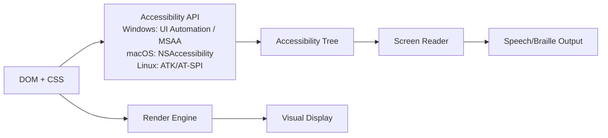
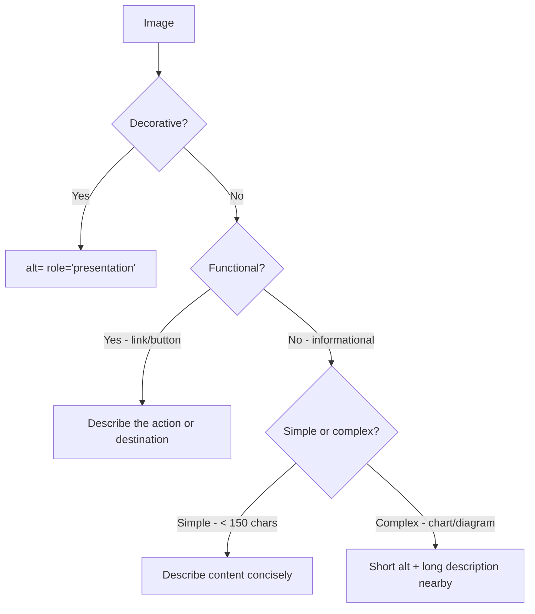

# Screen Reader Patterns

Screen readers transform visual interfaces into audio or braille output. Writing correct screen reader markup requires understanding how screen readers traverse the accessibility tree, announce dynamic changes, and interpret semantic structure.

## How Screen Readers Work

Screen readers do not read the visual page — they read the **accessibility tree**, a simplified representation of the DOM that includes:
- Element roles (button, link, heading, etc.)
- Accessible names (labels)
- States (selected, expanded, invalid)
- Values (progress, slider position)
- Relationships (describedby, controls, owns)



## The Visually Hidden Pattern

Content that should be heard but not seen — inverse of `aria-hidden`:

```css
/* The canonical visually-hidden class */
.sr-only {
  position: absolute;
  width: 1px;
  height: 1px;
  padding: 0;
  margin: -1px;
  overflow: hidden;
  clip: rect(0, 0, 0, 0);
  white-space: nowrap;
  border: 0;
}

/* Reveal on focus (for skip links) */
.sr-only-focusable:focus,
.sr-only-focusable:focus-within {
  position: static;
  width: auto;
  height: auto;
  padding: inherit;
  margin: inherit;
  overflow: visible;
  clip: auto;
  white-space: normal;
}
```

Use cases:
```html
<!-- Icon-only button: label is sr-only -->
<button aria-label="Close" type="button">
  <svg aria-hidden="true"><!-- icon --></svg>
</button>

<!-- Better: visible text is always best -->
<button type="button">
  <svg aria-hidden="true"><!-- icon --></svg>
  <span>Close</span>
</button>

<!-- Additional context for screen readers -->
<ul>
  <li>
    <span>John Doe</span>
    <button>
      Delete
      <span class="sr-only">John Doe</span>
      <!-- "Delete" alone is ambiguous in a list context -->
      <!-- Screen reader announces: "Delete John Doe" -->
    </button>
  </li>
</ul>
```

## Alt Text Strategy

Alt text is not just a description — it's a replacement for the image in context:

### Decision Framework



### Alt Text Examples

```html
<!-- Decorative: ornamental separator, background pattern -->


<!-- Functional: image inside a link -->
<a href="/dashboard">
  
  <!-- Alt = link destination, not image content -->
</a>

<!-- Functional: submit button -->
<input type="image" src="submit.png" alt="Submit form" />

<!-- Informational: product photo -->


<!-- Informational: screenshot -->


<!-- Complex: chart with data -->
<figure>
  
  <figcaption id="chart-description">
    Q1: $1.2M, Q2: $1.8M, Q3: $2.1M, Q4: $2.8M. Revenue grew 133% year-over-year.
  </figcaption>
</figure>

<!-- Text in image: must be present in alt -->

```

### Common Alt Text Anti-patterns

```html
<!-- FAIL: filename as alt text -->


<!-- FAIL: "image of" / "picture of" prefix (redundant) -->

<!-- Screen reader announces: "Image, image of a cat" — says image twice -->

<!-- PASS -->


<!-- FAIL: generic alt for logo -->


<!-- PASS: brand + element type -->

<!-- Or if it's a link to home: -->
<a href="/">
  
</a>
```

## Semantic HTML Patterns

Semantics give screen reader users navigational structure:

### Headings as Navigation

Screen reader users navigate by heading. The heading structure IS the table of contents:

```html
<!-- FAIL: headings chosen for visual size, not structure -->
<h1>We Value Your Privacy</h1>
<h3>What We Collect</h3>  <!-- Skips h2 — confusing -->
<h5>Analytics</h5>        <!-- Non-sequential -->

<!-- PASS: logical heading hierarchy -->
<h1>We Value Your Privacy</h1>   <!-- One per page -->
<h2>What We Collect</h2>         <!-- Major sections -->
  <h3>Analytics Data</h3>        <!-- Subsections -->
  <h3>Account Data</h3>
<h2>How We Use Data</h2>
  <h3>Service Improvement</h3>
```

### Landmark Navigation

Screen reader users press a key to jump between landmarks:

```html
<body>
  <header>
    <!-- Role: banner — recognized as page header -->
    <a href="/" aria-label="Acme Corp - Home">
      
    </a>
    <nav aria-label="Primary">
      <!-- Role: navigation -->
      <ul>
        <li><a href="/products">Products</a></li>
        <li><a href="/pricing">Pricing</a></li>
        <li><a href="/about">About</a></li>
      </ul>
    </nav>
  </header>

  <main>
    <!-- Role: main — only one per page -->
    <h1>Products</h1>

    <nav aria-label="Products categories">
      <!-- Distinct nav from primary nav — has its own label -->
    </nav>

    <section aria-labelledby="featured-title">
      <!-- role: region (because it has aria-labelledby) -->
      <h2 id="featured-title">Featured Products</h2>
    </section>
  </main>

  <aside aria-label="Promotional offers">
    <!-- Role: complementary -->
  </aside>

  <footer>
    <!-- Role: contentinfo -->
    <nav aria-label="Footer links">…</nav>
  </footer>
</body>
```

## Announcing Dynamic Changes

When content changes dynamically (SPA navigation, form submission, search results), screen readers must be informed:

### SPA Page Navigation

```typescript
// hooks/usePageTitle.ts
import { useEffect } from 'react';
import { useLocation } from 'react-router-dom';

export function usePageTitle(title: string) {
  const location = useLocation();

  useEffect(() => {
    // Update document title
    document.title = `${title} — Acme App`;

    // Announce navigation to screen readers
    const announcer = document.getElementById('route-announcer');
    if (announcer) {
      announcer.textContent = '';
      setTimeout(() => {
        announcer.textContent = `Navigated to ${title}`;
      }, 100);
    }

    // Move focus to main content
    const mainContent = document.getElementById('main-content');
    if (mainContent) {
      mainContent.tabIndex = -1;
      mainContent.focus();
    }
  }, [location.pathname, title]);
}
```

```html
<!-- Route announcer: visually hidden live region -->
<div
  id="route-announcer"
  role="status"
  aria-live="polite"
  aria-atomic="true"
  class="sr-only"
></div>
```

### Form Submission Feedback

```tsx
// FormFeedback.tsx
import { useRef, useEffect } from 'react';

interface FormState {
  status: 'idle' | 'loading' | 'success' | 'error';
  message?: string;
}

export function FormWithFeedback() {
  const [state, setState] = useState<FormState>({ status: 'idle' });
  const feedbackRef = useRef<HTMLDivElement>(null);
  const formRef = useRef<HTMLFormElement>(null);

  useEffect(() => {
    if (state.status === 'success' || state.status === 'error') {
      // Focus the feedback message so screen readers announce it
      feedbackRef.current?.focus();
    }
  }, [state.status]);

  const handleSubmit = async (e: React.FormEvent) => {
    e.preventDefault();
    setState({ status: 'loading' });

    try {
      await submitForm();
      setState({ status: 'success', message: 'Form submitted successfully. You will receive a confirmation email.' });
    } catch {
      setState({ status: 'error', message: 'Submission failed. Please check your connection and try again.' });
    }
  };

  return (
    <form ref={formRef} onSubmit={handleSubmit} noValidate>
      {/* Status region — announces automatically on content change */}
      {(state.status === 'success' || state.status === 'error') && (
        <div
          ref={feedbackRef}
          role={state.status === 'error' ? 'alert' : 'status'}
          aria-live={state.status === 'error' ? 'assertive' : 'polite'}
          tabIndex={-1}
          style={​{ outline: 'none' }} /* Hide outline on programmatic focus */
        >
          {state.message}
        </div>
      )}

      {/* Loading state */}
      {state.status === 'loading' && (
        <div role="status" aria-live="polite">
          Submitting form…
        </div>
      )}

      {/* Form fields */}
      <button
        type="submit"
        disabled={state.status === 'loading'}
        aria-disabled={state.status === 'loading'}
      >
        {state.status === 'loading' ? 'Submitting…' : 'Submit'}
      </button>
    </form>
  );
}
```

## Tables

Tables communicate data relationships that are invisible to screen readers without proper markup:

```html
<!-- Simple table -->
<table>
  <caption>Q4 2025 Revenue by Region</caption>
  <thead>
    <tr>
      <th scope="col">Region</th>
      <th scope="col">Revenue</th>
      <th scope="col">Growth</th>
    </tr>
  </thead>
  <tbody>
    <tr>
      <th scope="row">North America</th>
      <td>$2.1M</td>
      <td>+15%</td>
    </tr>
    <tr>
      <th scope="row">Europe</th>
      <td>$1.4M</td>
      <td>+8%</td>
    </tr>
  </tbody>
  <tfoot>
    <tr>
      <th scope="row">Total</th>
      <td>$4.2M</td>
      <td>+12%</td>
    </tr>
  </tfoot>
</table>

<!-- Complex table with column groups -->
<table>
  <caption>Product Comparison</caption>
  <colgroup span="1"></colgroup>
  <colgroup span="3">
    <col /> <col /> <col />
  </colgroup>
  <thead>
    <tr>
      <td></td>
      <th scope="col" colspan="3">Plans</th>
    </tr>
    <tr>
      <th scope="col">Feature</th>
      <th scope="col">Starter</th>
      <th scope="col">Pro</th>
      <th scope="col">Enterprise</th>
    </tr>
  </thead>
  <tbody>
    <tr>
      <th scope="row">Users</th>
      <td>5</td>
      <td>Unlimited</td>
      <td>Unlimited</td>
    </tr>
  </tbody>
</table>
```

## Lists

Lists communicate grouping and count to screen readers:

```html
<!-- Screen reader announces: "list, 3 items" -->
<ul>
  <li>First item</li>
  <li>Second item</li>
  <li>Third item</li>
</ul>

<!-- Ordered: for sequences where order matters -->
<ol>
  <li>Create account</li>
  <li>Verify email</li>
  <li>Complete profile</li>
</ol>

<!-- Definition list: for term-value pairs -->
<dl>
  <dt>Author</dt>
  <dd>Jane Smith</dd>
  <dt>Published</dt>
  <dd>March 18, 2026</dd>
</dl>

<!-- Navigation should always use a list -->
<nav>
  <ul>
    <li><a href="/">Home</a></li>
    <li><a href="/about">About</a></li>
    <!-- Screen reader: "navigation, list, 2 items, Home link, About link" -->
  </ul>
</nav>
```

::: warning CSS list-style: none
Safari VoiceOver removes list semantics when `list-style: none` is applied (a known, intentional quirk). If you need unstyled lists to remain lists semantically, add `role="list"`:

```html
<ul style="list-style: none" role="list">
  <li role="listitem">…</li>
</ul>
```

Or use a non-list element if it's truly not a list.
:::

::: info War Story
A news site redesign removed all `<ul>/<li>` navigation structures in favor of styled `<div>/<a>` combos because "the designer didn't want bullet points." The navigation was visually identical. But screen reader users lost the "Navigation, 8 items" count that told them how many nav items to expect. Users with cognitive impairments found the navigation harder to use without the implicit count. The fix was trivial — add `<ul>` wrapper and `<li>` items, remove bullets with CSS. The PR was 15 lines. But it took 6 months to be noticed.
:::
