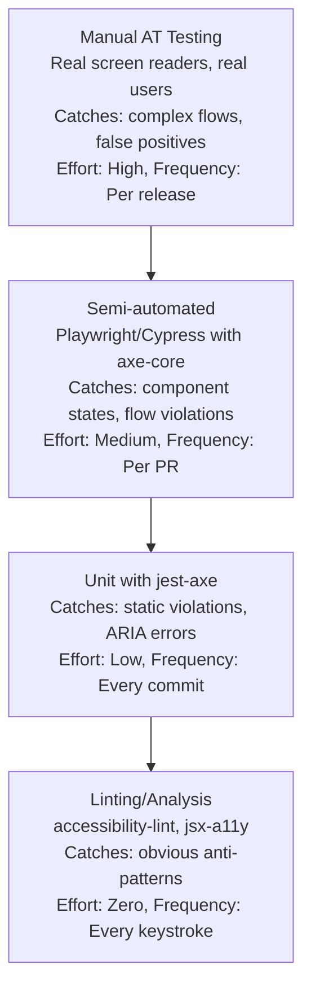

# Testing Accessibility

Accessibility testing is not a single activity — it's a layered approach combining automated tools, manual checks, and assistive technology testing. Automated tools catch 30-40% of issues. The rest requires human judgment.

## The Testing Pyramid



## eslint-plugin-jsx-a11y

The lowest-effort accessibility improvement: lint rules that catch issues as you write:

```bash
npm install --save-dev eslint-plugin-jsx-a11y
```

```json
// .eslintrc.json
{
  "plugins": ["jsx-a11y"],
  "extends": ["plugin:jsx-a11y/recommended"],
  "rules": {
    // Recommended catches most issues
    // Add stricter rules for critical apps:
    "jsx-a11y/anchor-has-content": "error",
    "jsx-a11y/aria-role": "error",
    "jsx-a11y/click-events-have-key-events": "error",
    "jsx-a11y/interactive-supports-focus": "error",
    "jsx-a11y/label-has-associated-control": "error",
    "jsx-a11y/media-has-caption": "warn",
    "jsx-a11y/no-autofocus": "warn",
    "jsx-a11y/no-noninteractive-element-interactions": "error"
  }
}
```

## jest-axe — Unit Level Testing

```bash
npm install --save-dev jest-axe @testing-library/react
```

```typescript
// __tests__/Button.a11y.test.tsx
import { render } from '@testing-library/react';
import { axe, toHaveNoViolations } from 'jest-axe';
import { Button } from '../components/Button';

expect.extend(toHaveNoViolations);

describe('Button Accessibility', () => {
  it('primary button has no accessibility violations', async () => {
    const { container } = render(
      <Button variant="primary" onClick={jest.fn()}>
        Save Changes
      </Button>
    );
    const results = await axe(container);
    expect(results).toHaveNoViolations();
  });

  it('icon-only button has accessible label', async () => {
    const { container } = render(
      <Button variant="icon" aria-label="Close" onClick={jest.fn()}>
        <span aria-hidden="true">×</span>
      </Button>
    );
    const results = await axe(container);
    expect(results).toHaveNoViolations();
  });

  it('disabled button is accessible', async () => {
    const { container } = render(
      <Button variant="primary" disabled onClick={jest.fn()}>
        Submit
      </Button>
    );
    const results = await axe(container);
    expect(results).toHaveNoViolations();
  });
});
```

### Testing Complex Components

```typescript
// __tests__/Modal.a11y.test.tsx
import { render, screen } from '@testing-library/react';
import userEvent from '@testing-library/user-event';
import { axe, toHaveNoViolations } from 'jest-axe';
import { Modal } from '../components/Modal';

expect.extend(toHaveNoViolations);

describe('Modal Accessibility', () => {
  it('has no violations when open', async () => {
    const { container } = render(
      <Modal isOpen title="Confirm deletion" onClose={jest.fn()}>
        <p>Are you sure you want to delete this item?</p>
        <button>Cancel</button>
        <button>Delete</button>
      </Modal>
    );
    const results = await axe(container);
    expect(results).toHaveNoViolations();
  });

  it('has role="dialog" with aria-labelledby', () => {
    render(
      <Modal isOpen title="Test Modal" onClose={jest.fn()}>
        <p>Content</p>
      </Modal>
    );
    const dialog = screen.getByRole('dialog');
    expect(dialog).toHaveAttribute('aria-labelledby');

    const labelId = dialog.getAttribute('aria-labelledby');
    const label = document.getElementById(labelId!);
    expect(label).toHaveTextContent('Test Modal');
  });

  it('closes on Escape key', async () => {
    const onClose = jest.fn();
    render(
      <Modal isOpen title="Test" onClose={onClose}>
        <button>Focus target</button>
      </Modal>
    );

    await userEvent.keyboard('{Escape}');
    expect(onClose).toHaveBeenCalledTimes(1);
  });

  it('traps focus within modal', async () => {
    render(
      <>
        <button id="outside">Outside button</button>
        <Modal isOpen title="Test" onClose={jest.fn()}>
          <button id="first">First</button>
          <button id="second">Second</button>
        </Modal>
      </>
    );

    const firstButton = screen.getByText('First');
    const secondButton = screen.getByText('Second');

    // Focus the first button
    firstButton.focus();
    expect(document.activeElement).toBe(firstButton);

    // Tab should cycle to second
    await userEvent.tab();
    // ... (close button would be here, continue tabbing)

    // Shift+Tab from first should wrap to last focusable
    firstButton.focus();
    await userEvent.tab({ shift: true });

    // Focus should not escape modal
    const outsideButton = document.getElementById('outside');
    expect(document.activeElement).not.toBe(outsideButton);
  });
});
```

## axe-core — Browser Integration

For E2E and Storybook testing:

```typescript
// playwright.config.ts
import { PlaywrightTestConfig } from '@playwright/test';

const config: PlaywrightTestConfig = {
  use: {
    baseURL: 'http://localhost:3000',
  },
};

export default config;
```

```typescript
// tests/accessibility.spec.ts
import { test, expect } from '@playwright/test';
import AxeBuilder from '@axe-core/playwright';

test.describe('Homepage Accessibility', () => {
  test('has no automatically detectable WCAG 2.1 AA violations', async ({ page }) => {
    await page.goto('/');

    const accessibilityScanResults = await new AxeBuilder({ page })
      .withTags(['wcag2a', 'wcag2aa', 'wcag21a', 'wcag21aa'])
      .analyze();

    expect(accessibilityScanResults.violations).toEqual([]);
  });

  test('navigation is accessible', async ({ page }) => {
    await page.goto('/');

    // Scope scan to specific component
    const navResults = await new AxeBuilder({ page })
      .include('nav')
      .analyze();

    expect(navResults.violations).toEqual([]);
  });

  test('forms are accessible', async ({ page }) => {
    await page.goto('/contact');

    const formResults = await new AxeBuilder({ page })
      .include('form')
      .withTags(['wcag2aa'])
      .analyze();

    if (formResults.violations.length > 0) {
      // Log detailed violations for debugging
      console.log(JSON.stringify(formResults.violations, null, 2));
    }

    expect(formResults.violations).toEqual([]);
  });
});

// Scan all routes
const routes = ['/', '/about', '/pricing', '/contact', '/dashboard'];

for (const route of routes) {
  test(`${route} has no critical accessibility violations`, async ({ page }) => {
    await page.goto(route);

    const results = await new AxeBuilder({ page })
      .withTags(['wcag2aa'])
      .disableRules(['color-contrast']) // Tested separately with more precision
      .analyze();

    const criticalViolations = results.violations.filter(
      v => v.impact === 'critical' || v.impact === 'serious'
    );

    expect(criticalViolations).toEqual([]);
  });
}
```

## Storybook Accessibility Addon

```bash
npm install --save-dev @storybook/addon-a11y
```

```typescript
// .storybook/main.ts
export default {
  addons: [
    '@storybook/addon-a11y',
    // other addons...
  ],
};

// .storybook/preview.ts
import { Preview } from '@storybook/react';

const preview: Preview = {
  parameters: {
    a11y: {
      config: {
        rules: [
          {
            id: 'color-contrast',
            enabled: true,
          },
        ],
      },
    },
  },
};

export default preview;
```

The Storybook a11y addon runs axe on every story in the "Accessibility" panel — giving immediate feedback to component developers.

## Manual Screen Reader Testing Protocol

Automated tools miss ~60-70% of accessibility issues. Manual testing with real screen readers is essential.

### Test Matrix

| Screen Reader | Browser | Priority |
|--------------|---------|---------|
| NVDA + Chrome | Windows | P1 — highest usage |
| NVDA + Firefox | Windows | P2 |
| JAWS + Chrome | Windows | P2 (enterprise) |
| VoiceOver + Safari | macOS | P1 |
| VoiceOver + Safari | iOS | P1 (mobile) |
| TalkBack + Chrome | Android | P2 |

### Testing Protocol for Each Component

```markdown
## Screen Reader Test Protocol

For each component, test:

### Identification
- [ ] Element is announced with correct role
- [ ] Accessible name is meaningful (not "button" alone)
- [ ] State is announced (expanded/collapsed, selected/unselected)

### Interaction
- [ ] Can activate with Enter key
- [ ] Can activate with Space key (if button/checkbox)
- [ ] Can navigate children with Arrow keys (if composite widget)
- [ ] Escape closes popups/modals and returns focus

### Dynamic updates
- [ ] Success messages are announced
- [ ] Error messages are announced immediately (assertive)
- [ ] Page navigation is announced

### Context
- [ ] Content makes sense when read without visual context
- [ ] Reading order matches visual order
- [ ] Groupings are communicated
```

### NVDA Testing Quick Start

```
1. Download NVDA (free): nvaccess.org/download
2. Install and launch
3. Open Chrome/Firefox
4. Toggle NVDA: NVDA+Q to stop, start with shortcut
5. Browse mode: arrow keys read, Enter activates
6. Forms mode: activated on form fields (type normally)
7. Key shortcuts:
   - H: jump to next heading
   - B: next button
   - F: next form field
   - T: next table
   - L: next list
   - NVDA+F7: elements list dialog
```

## CI/CD Integration

```yaml
# .github/workflows/accessibility.yml
name: Accessibility Tests

on:
  pull_request:
    branches: [main, develop]

jobs:
  unit-a11y:
    name: Unit Accessibility Tests
    runs-on: ubuntu-latest
    steps:
      - uses: actions/checkout@v4
      - uses: actions/setup-node@v4
        with: { node-version: '20' }
      - run: npm ci
      - run: npm test -- --grep="accessibility"

  e2e-a11y:
    name: E2E Accessibility Tests
    runs-on: ubuntu-latest
    steps:
      - uses: actions/checkout@v4
      - uses: actions/setup-node@v4
        with: { node-version: '20' }
      - run: npm ci
      - run: npx playwright install chromium
      - run: npm run build
      - run: npm run start &
      - run: npx playwright test tests/accessibility.spec.ts
      - uses: actions/upload-artifact@v4
        if: failure()
        with:
          name: playwright-report
          path: playwright-report/
```

## Interpreting axe Results

```typescript
// Structured violation reporting
interface AxeViolation {
  id: string;
  impact: 'critical' | 'serious' | 'moderate' | 'minor';
  description: string;
  help: string;
  helpUrl: string;
  nodes: Array<{
    html: string;
    target: string[];
    failureSummary: string;
  }>;
}

// Priority matrix for violation triage
function prioritizeViolations(violations: AxeViolation[]) {
  return violations
    .sort((a, b) => {
      const priority = { critical: 0, serious: 1, moderate: 2, minor: 3 };
      return priority[a.impact] - priority[b.impact];
    })
    .map(v => ({
      ...v,
      mustFix: v.impact === 'critical' || v.impact === 'serious',
      shouldFix: v.impact === 'moderate',
      couldFix: v.impact === 'minor',
    }));
}

// axe rules by WCAG criterion mapping
const WCAG_CRITICAL_RULES = [
  'color-contrast',           // 1.4.3 — text contrast
  'image-alt',                // 1.1.1 — images
  'label',                    // 1.3.1, 4.1.2 — form labels
  'link-name',                // 4.1.2 — links
  'button-name',              // 4.1.2 — buttons
  'keyboard',                 // 2.1.1 — keyboard accessible
  'bypass',                   // 2.4.1 — skip navigation
  'document-title',           // 2.4.2 — page title
  'landmark-one-main',        // 1.3.6 — landmark
  'region',                   // 1.3.6 — regions
];
```

::: info War Story
A startup ran axe-core in their CI pipeline. It caught 0 violations for 6 months. Then a screen reader user filed a bug report: none of the dropdown menus were usable with a keyboard. They investigated: axe doesn't check keyboard interaction patterns, only static ARIA violations. The dropdowns had correct ARIA markup (`aria-expanded`, `aria-haspopup`) but no keyboard handlers. axe saw syntactically correct ARIA and passed. Manual keyboard testing — which took 20 minutes — would have caught this immediately. The lesson: automated tools catch structure violations. Human testing catches behavioral violations. Both are required.
:::
