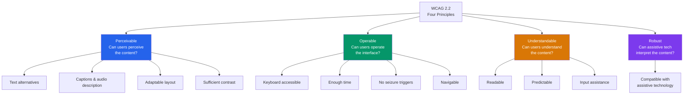
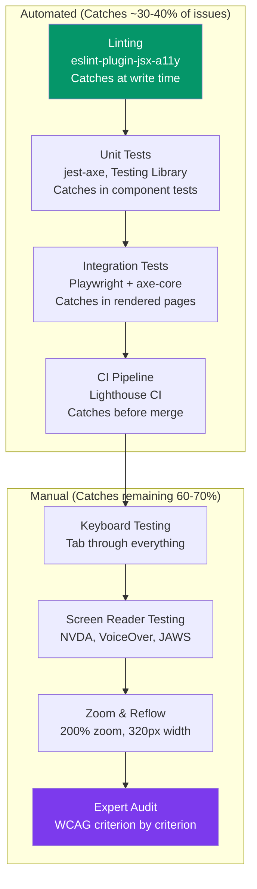

# WCAG 2.2 Compliance Engineering

The Web Content Accessibility Guidelines (WCAG) 2.2 define how to make web content accessible to people with disabilities — including blindness, low vision, deafness, motor impairments, cognitive disabilities, and seizure disorders. WCAG is not optional: it is a **legal requirement** in most jurisdictions (ADA in the US, EAA in the EU, AODA in Canada, Equality Act in the UK). Beyond compliance, accessible products reach a larger market — 15% of the global population has some form of disability — and accessible code is almost always better-structured, more semantic, and easier to maintain.

## The Four Principles (POUR)

Every WCAG success criterion falls under one of four principles:



## Conformance Levels

| Level | Meaning | Legal Requirement | Coverage |
|-------|---------|-------------------|----------|
| **A** | Minimum accessibility — site is basically usable | Rarely sufficient alone | ~30 success criteria |
| **AA** | Standard accessibility — the target for most organizations | Required by ADA, EAA, most laws | ~20 additional criteria |
| **AAA** | Enhanced accessibility — highest level | Not typically required by law | ~28 additional criteria |

::: tip
Target **Level AA** for all new development. This is what the law requires in most jurisdictions, what enterprise customers expect, and what most accessibility standards reference. Level AAA is a stretch goal for specific content types (e.g., educational content, government services).
:::

## Principle 1: Perceivable

Content must be presentable in ways users can perceive — through sight, hearing, or touch.

### 1.1 Text Alternatives (Level A)

Every non-text element needs a text alternative:

```html
<!-- Images: descriptive alt text -->


<!-- Decorative images: empty alt -->


<!-- Icon buttons: aria-label -->
<button aria-label="Close dialog">
  <svg><!-- X icon --></svg>
</button>

<!-- Complex images: longer description -->
<figure>
  
  <figcaption id="arch-desc">
    The system consists of three layers: a React frontend
    communicating with a Node.js API gateway, which routes
    requests to five microservices backed by PostgreSQL and Redis.
  </figcaption>
</figure>

<!-- Form inputs: associated labels -->
<label for="email">Email address</label>
<input type="email" id="email" name="email"
       aria-describedby="email-help" />
<span id="email-help">We'll never share your email.</span>
```

::: warning
Never write alt text like `alt="image"` or `alt="photo.jpg"` or `alt="click here"`. Describe what the image conveys, not what it is. A photo of a team should say `alt="Engineering team celebrating the v3.0 launch"`, not `alt="photo of people"`.
:::

### 1.3 Adaptable (Level A)

Content structure must be programmatically determinable:

```html
<!-- Use semantic HTML — screen readers depend on it -->

<!-- BAD: div soup -->
<div class="header">
  <div class="nav">
    <div class="nav-item">Home</div>
  </div>
</div>
<div class="main">
  <div class="title">Page Title</div>
  <div class="content">...</div>
</div>

<!-- GOOD: semantic HTML -->
<header>
  <nav aria-label="Main navigation">
    <a href="/">Home</a>
  </nav>
</header>
<main>
  <h1>Page Title</h1>
  <article>...</article>
</main>
<footer>...</footer>
```

### 1.4 Distinguishable (Level AA)

| Criterion | Requirement | Tools to Check |
|-----------|-------------|----------------|
| **1.4.3 Contrast (Minimum)** | Text: 4.5:1 ratio. Large text (18px+ or 14px+ bold): 3:1 | Chrome DevTools, WebAIM Contrast Checker |
| **1.4.4 Resize Text** | Text must be resizable to 200% without loss of content | Zoom browser to 200% |
| **1.4.5 Images of Text** | Don't use images for text; use actual text | Visual inspection |
| **1.4.10 Reflow** | Content reflows at 320px width (no horizontal scroll) | Resize to 320px |
| **1.4.11 Non-Text Contrast** | UI components and graphical objects: 3:1 ratio | Colour Contrast Analyser |
| **1.4.12 Text Spacing** | Content must work with increased text spacing | Bookmarklet test |
| **1.4.13 Content on Hover/Focus** | Hoverable content must be dismissible, hoverable, persistent | Manual testing |

```css
/* Contrast examples */

/* BAD: 2.5:1 ratio — fails AA */
.low-contrast {
  color: #999999;          /* Light gray */
  background: #ffffff;      /* White */
}

/* GOOD: 7.4:1 ratio — passes AAA */
.high-contrast {
  color: #1a1a1a;          /* Near-black */
  background: #ffffff;      /* White */
}

/* GOOD: Respects user text spacing preferences (1.4.12) */
.readable-text {
  line-height: 1.5;          /* At least 1.5x font size */
  letter-spacing: 0.12em;    /* At least 0.12x font size */
  word-spacing: 0.16em;      /* At least 0.16x font size */
  /* Avoid fixed heights that clip when text spacing increases */
  min-height: auto;
}
```

## Principle 2: Operable

Users must be able to operate the interface using keyboard, voice, switches, or other input devices.

### 2.1 Keyboard Accessible (Level A)

Every interactive element must be reachable and operable via keyboard:

```typescript
// Custom interactive component — MUST handle keyboard
function Dropdown({ options, onSelect }: DropdownProps) {
  const [isOpen, setIsOpen] = useState(false);
  const [activeIndex, setActiveIndex] = useState(-1);

  const handleKeyDown = (e: React.KeyboardEvent) => {
    switch (e.key) {
      case 'Enter':
      case ' ':
        e.preventDefault();
        if (isOpen && activeIndex >= 0) {
          onSelect(options[activeIndex]);
          setIsOpen(false);
        } else {
          setIsOpen(true);
        }
        break;
      case 'ArrowDown':
        e.preventDefault();
        if (!isOpen) setIsOpen(true);
        setActiveIndex(prev => Math.min(prev + 1, options.length - 1));
        break;
      case 'ArrowUp':
        e.preventDefault();
        setActiveIndex(prev => Math.max(prev - 1, 0));
        break;
      case 'Escape':
        setIsOpen(false);
        setActiveIndex(-1);
        break;
      case 'Home':
        e.preventDefault();
        setActiveIndex(0);
        break;
      case 'End':
        e.preventDefault();
        setActiveIndex(options.length - 1);
        break;
    }
  };

  return (
    <div role="combobox" aria-expanded={isOpen} aria-haspopup="listbox">
      <button
        onClick={() => setIsOpen(!isOpen)}
        onKeyDown={handleKeyDown}
        aria-label="Select option"
      >
        {options[activeIndex]?.label ?? 'Choose...'}
      </button>
      {isOpen && (
        <ul role="listbox" aria-label="Options">
          {options.map((opt, i) => (
            <li
              key={opt.value}
              role="option"
              aria-selected={i === activeIndex}
              onClick={() => { onSelect(opt); setIsOpen(false); }}
            >
              {opt.label}
            </li>
          ))}
        </ul>
      )}
    </div>
  );
}
```

### 2.4 Navigable (Level AA)

| Criterion | Requirement | Implementation |
|-----------|-------------|----------------|
| **2.4.1 Bypass Blocks** | Skip navigation link | `<a href="#main" class="skip-link">Skip to content</a>` |
| **2.4.2 Page Titled** | Descriptive page title | `<title>Dashboard - MyApp</title>` (not just "MyApp") |
| **2.4.3 Focus Order** | Logical tab order | Use natural DOM order; avoid positive `tabindex` values |
| **2.4.6 Headings & Labels** | Descriptive headings | `<h2>Monthly Revenue</h2>` not `<h2>Section 3</h2>` |
| **2.4.7 Focus Visible** | Visible focus indicator | Never remove `outline` without replacement |
| **2.4.11 Focus Not Obscured** | Focus indicator not hidden by sticky headers/modals | Ensure focused element scrolls into view |

```css
/* Focus indicators — NEVER do this */
*:focus { outline: none; }  /* ACCESSIBILITY VIOLATION */

/* GOOD: Custom focus indicator that is visible and meets contrast */
:focus-visible {
  outline: 3px solid #2563eb;
  outline-offset: 2px;
  border-radius: 2px;
}

/* Skip link */
.skip-link {
  position: absolute;
  top: -40px;
  left: 0;
  background: #2563eb;
  color: white;
  padding: 8px 16px;
  z-index: 100;
  transition: top 0.2s;
}

.skip-link:focus {
  top: 0;
}
```

::: danger
Removing `:focus` outlines without providing an alternative is the most common accessibility violation on the web. CSS resets that include `*:focus { outline: none; }` break keyboard navigation for every user. Use `:focus-visible` to show focus only for keyboard users, not mouse clicks.
:::

### 2.5 Input Modalities (WCAG 2.2 New)

WCAG 2.2 added criteria for diverse input methods:

| Criterion | Requirement |
|-----------|-------------|
| **2.5.7 Dragging Movements** | Any action achievable by dragging must have a non-dragging alternative |
| **2.5.8 Target Size (Minimum)** | Interactive targets must be at least 24x24 CSS pixels |

```css
/* Minimum target size */
button, a, input[type="checkbox"], input[type="radio"] {
  min-width: 24px;
  min-height: 24px;
}

/* Better: Apple's 44px guideline */
.touch-target {
  min-width: 44px;
  min-height: 44px;
  padding: 10px;
}
```

## Principle 3: Understandable

Content and interface behavior must be understandable.

### 3.1 Readable (Level A/AA)

```html
<!-- Set page language (screen readers use this for pronunciation) -->
<html lang="en">

<!-- Mark language changes inline -->
<p>The French term <span lang="fr">mise en place</span> means everything
in its place.</p>
```

### 3.2 Predictable (Level A/AA)

| Rule | Example Violation | Fix |
|------|------------------|-----|
| **No change on focus** | Selecting a dropdown option immediately navigates to a new page | Require explicit "Go" button |
| **No change on input** | Typing in a search field auto-submits after 3 characters | Add a "Search" button |
| **Consistent navigation** | Navigation bar moves to different positions on different pages | Keep navigation in the same location |
| **Consistent identification** | "Submit" button is called "Send" on one page and "Go" on another | Use consistent labels everywhere |

### 3.3 Input Assistance (Level A/AA)

```html
<!-- Error identification: be specific -->

<!-- BAD -->
<span class="error">Invalid input</span>

<!-- GOOD -->
<div role="alert" aria-live="assertive">
  <span class="error" id="email-error">
    Please enter a valid email address (e.g., user@example.com)
  </span>
</div>
<input type="email"
       aria-invalid="true"
       aria-describedby="email-error"
       aria-errormessage="email-error" />
```

## Principle 4: Robust

Content must be robust enough to work with current and future assistive technologies.

### 4.1 Compatible

```html
<!-- Use valid HTML — broken HTML confuses screen readers -->

<!-- BAD: duplicate IDs -->
<div id="header">...</div>
<div id="header">...</div>  <!-- Screen reader cannot distinguish -->

<!-- BAD: missing required ARIA properties -->
<div role="slider">...</div>  <!-- Missing aria-valuenow, aria-valuemin, aria-valuemax -->

<!-- GOOD -->
<div role="slider"
     aria-valuenow="50"
     aria-valuemin="0"
     aria-valuemax="100"
     aria-label="Volume"
     tabindex="0">
</div>
```

## Automated Testing Pipeline

### Testing Pyramid for Accessibility



::: warning
Automated tools catch only 30-40% of accessibility issues. They detect missing alt text, low contrast, missing labels, and invalid ARIA. They CANNOT detect: wrong alt text content, illogical tab order, confusing user experience, or screen reader announcement quality. Manual testing is required for full compliance.
:::

### ESLint: Catch Issues at Write Time

```json
// .eslintrc.json
{
  "extends": [
    "plugin:jsx-a11y/recommended"
  ],
  "plugins": ["jsx-a11y"],
  "rules": {
    "jsx-a11y/alt-text": "error",
    "jsx-a11y/anchor-has-content": "error",
    "jsx-a11y/aria-props": "error",
    "jsx-a11y/aria-role": "error",
    "jsx-a11y/click-events-have-key-events": "error",
    "jsx-a11y/heading-has-content": "error",
    "jsx-a11y/label-has-associated-control": "error",
    "jsx-a11y/no-autofocus": "warn",
    "jsx-a11y/no-noninteractive-element-interactions": "error"
  }
}
```

### jest-axe: Unit Test Accessibility

```typescript
import { render } from '@testing-library/react';
import { axe, toHaveNoViolations } from 'jest-axe';

expect.extend(toHaveNoViolations);

describe('LoginForm', () => {
  it('should have no accessibility violations', async () => {
    const { container } = render(<LoginForm />);
    const results = await axe(container);
    expect(results).toHaveNoViolations();
  });

  it('should have no violations when showing errors', async () => {
    const { container, getByRole } = render(<LoginForm />);

    // Trigger validation errors
    fireEvent.click(getByRole('button', { name: /submit/i }));

    const results = await axe(container);
    expect(results).toHaveNoViolations();
  });
});
```

### Playwright + axe-core: Integration Testing

```typescript
import { test, expect } from '@playwright/test';
import AxeBuilder from '@axe-core/playwright';

test.describe('Accessibility', () => {
  test('homepage should have no violations', async ({ page }) => {
    await page.goto('/');

    const results = await new AxeBuilder({ page })
      .withTags(['wcag2a', 'wcag2aa', 'wcag22aa'])
      .analyze();

    expect(results.violations).toEqual([]);
  });

  test('dashboard should have no violations after data loads', async ({ page }) => {
    await page.goto('/dashboard');
    await page.waitForSelector('[data-testid="chart-loaded"]');

    const results = await new AxeBuilder({ page })
      .withTags(['wcag2a', 'wcag2aa'])
      .exclude('.third-party-widget')  // Exclude elements you cannot control
      .analyze();

    expect(results.violations).toEqual([]);
  });

  test('modal should trap focus correctly', async ({ page }) => {
    await page.goto('/settings');
    await page.click('[data-testid="open-modal"]');

    // Tab through all focusable elements in modal
    const focusableElements: string[] = [];
    for (let i = 0; i < 10; i++) {
      await page.keyboard.press('Tab');
      const focused = await page.evaluate(() =>
        document.activeElement?.getAttribute('data-testid') ?? 'unknown'
      );
      focusableElements.push(focused);
    }

    // Focus should cycle within modal, not escape to background
    expect(focusableElements).not.toContain('nav-link');
    expect(focusableElements).not.toContain('unknown');
  });
});
```

### CI/CD Integration with Lighthouse

```yaml
# .github/workflows/accessibility.yml
name: Accessibility Checks

on:
  pull_request:
    branches: [main]

jobs:
  accessibility:
    runs-on: ubuntu-latest
    steps:
      - uses: actions/checkout@v4

      - name: Install dependencies
        run: npm ci

      - name: Build
        run: npm run build

      - name: Start server
        run: npm run preview &
        env:
          PORT: 3000

      - name: Wait for server
        run: npx wait-on http://localhost:3000

      - name: Run Lighthouse CI
        uses: treosh/lighthouse-ci-action@v12
        with:
          urls: |
            http://localhost:3000/
            http://localhost:3000/dashboard
            http://localhost:3000/settings
          configPath: ./lighthouserc.json

      - name: Run axe-core on all pages
        run: npx @axe-core/cli http://localhost:3000 --tags wcag2a,wcag2aa
```

```json
// lighthouserc.json
{
  "ci": {
    "assert": {
      "assertions": {
        "categories:accessibility": ["error", { "minScore": 0.95 }],
        "color-contrast": "error",
        "image-alt": "error",
        "label": "error",
        "link-name": "error",
        "button-name": "error",
        "document-title": "error",
        "html-has-lang": "error"
      }
    }
  }
}
```

## Manual Testing Methodology

### Screen Reader Testing Matrix

| Screen Reader | OS | Browser | Market Share |
|--------------|------|---------|-------------|
| **NVDA** | Windows | Chrome, Firefox | ~30% (free, most common) |
| **JAWS** | Windows | Chrome, Edge | ~25% (paid, enterprise) |
| **VoiceOver** | macOS/iOS | Safari | ~25% (built-in on Apple) |
| **TalkBack** | Android | Chrome | ~10% (built-in on Android) |
| **Narrator** | Windows | Edge | ~5% (built-in on Windows) |

### Screen Reader Testing Checklist

| Test | What to Check | Pass Criteria |
|------|--------------|---------------|
| **Page load** | What is announced when page loads? | Page title and main landmark announced |
| **Headings** | Navigate by headings (H key in NVDA) | Logical heading hierarchy, all sections reachable |
| **Links** | List all links (NVDA: Insert+F7) | Every link has a descriptive name (not "click here") |
| **Forms** | Tab through form fields | Every field's label and description announced |
| **Errors** | Trigger validation errors | Error message announced immediately via `aria-live` |
| **Images** | Navigate past images | Meaningful images have descriptions; decorative images are skipped |
| **Tables** | Navigate table cells (Ctrl+Alt+arrows in NVDA) | Row/column headers announced with each cell |
| **Dynamic content** | Trigger AJAX updates, modals, notifications | Changes announced via live regions; focus managed correctly |

### Keyboard Testing Checklist

| Test | Keys | Pass Criteria |
|------|------|---------------|
| **Tab order** | Tab / Shift+Tab | Logical order; never gets stuck; skip link works |
| **Interactive elements** | Enter, Space | All buttons, links, toggles activate |
| **Dropdowns/menus** | Arrow keys, Escape | Navigate options; Escape closes |
| **Modals** | Tab, Escape | Focus trapped inside; Escape closes; focus returns |
| **Custom widgets** | Arrow keys | Tabs, sliders, date pickers operable |
| **Focus visible** | Tab through page | Focus indicator visible on EVERY focused element |

## Common WCAG Violations and Fixes

| Violation | Prevalence | Fix |
|-----------|-----------|-----|
| **Missing alt text** | 55% of pages (WebAIM Million) | Add descriptive `alt` to all `` elements |
| **Low contrast text** | 83% of pages | Use tools to check; minimum 4.5:1 for normal text |
| **Missing form labels** | 45% of pages | Associate `<label>` with every `<input>` |
| **Empty links** | 47% of pages | Add text content or `aria-label` to every `<a>` |
| **Missing document language** | 17% of pages | Add `lang="en"` to `<html>` element |
| **Empty buttons** | 26% of pages | Add text content or `aria-label` to every `<button>` |

::: tip
The [WebAIM Million](https://webaim.org/projects/million/) study analyzes accessibility across the top 1 million websites annually. In 2025, 95.9% of home pages had detectable WCAG failures. The six issues listed above account for the vast majority. Fixing just these six would dramatically improve web accessibility.
:::

## ARIA: When and How

### The First Rule of ARIA

**Don't use ARIA if native HTML can do the job.** ARIA does not add functionality — it only adds semantics. A `<button>` is always better than `<div role="button" tabindex="0">`.

```html
<!-- Don't do this -->
<div role="button" tabindex="0"
     onclick="handleClick()"
     onkeydown="if(event.key==='Enter') handleClick()">
  Submit
</div>

<!-- Do this -->
<button onclick="handleClick()">Submit</button>
```

### ARIA Quick Reference

| Scenario | ARIA Pattern |
|----------|-------------|
| **Live updates** | `aria-live="polite"` (non-urgent) or `aria-live="assertive"` (urgent) |
| **Expanded/collapsed** | `aria-expanded="true/false"` on the trigger |
| **Current page in nav** | `aria-current="page"` on the active link |
| **Loading state** | `aria-busy="true"` on the container |
| **Error state** | `aria-invalid="true"` + `aria-errormessage="error-id"` |
| **Required field** | `aria-required="true"` (or use HTML `required`) |
| **Described by help text** | `aria-describedby="help-text-id"` |
| **Modal dialog** | `role="dialog"` + `aria-modal="true"` + `aria-labelledby="title-id"` |

## Related Pages

- [ARIA Deep Dive](/ui-design-systems/accessibility/aria-deep-dive) — comprehensive guide to ARIA roles, states, and properties
- [Keyboard Navigation](/ui-design-systems/accessibility/keyboard-navigation) — implementing keyboard support for custom widgets
- [Focus Management](/ui-design-systems/accessibility/focus-management) — managing focus in SPAs, modals, and dynamic content
- [Screen Reader Patterns](/ui-design-systems/accessibility/screen-reader-patterns) — patterns for building screen reader-friendly interfaces
- [Testing Accessibility](/ui-design-systems/accessibility/testing-accessibility) — detailed testing strategies and tool configuration
- [Data Visualization Engineering](/frontend-engineering/data-visualization) — making charts and dashboards accessible
