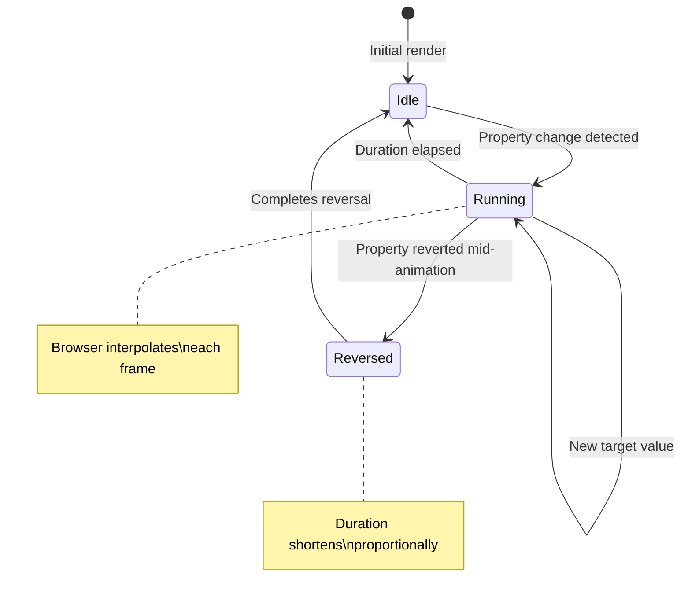
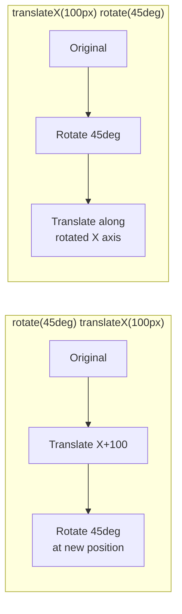
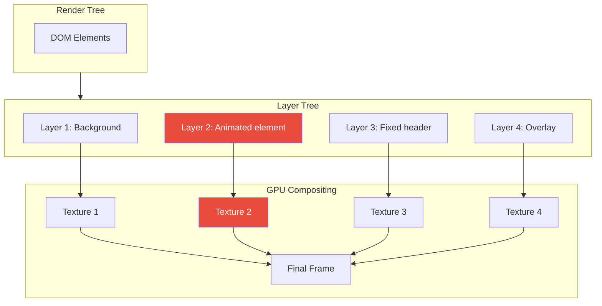
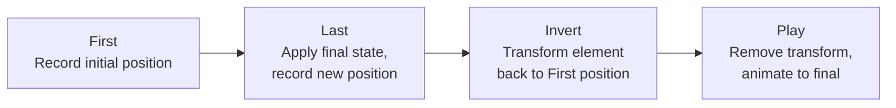

# CSS Animations Deep Dive

## Why CSS Animations Matter

CSS animations are the foundation of web animation for a simple reason: they are free. Zero JavaScript, zero bundle size, zero main-thread cost (for compositor properties). The browser's rendering engine has decades of optimization for CSS — it can predict transitions, pre-promote elements to GPU layers, and run animations on the compositor thread while JavaScript is busy parsing, fetching, or executing.

Before CSS transitions existed (pre-2009), all animation required JavaScript — typically jQuery's `.animate()` method, which set inline styles on every frame via `setInterval`. This blocked the main thread, could not be hardware-accelerated, and produced janky results on underpowered devices. CSS transitions moved animation into the browser engine itself, where it could be optimized at a level JavaScript can never reach.

Today, CSS handles the vast majority of UI animation: hover states, focus rings, menu reveals, loading spinners, skeleton screens, and page transitions. JavaScript animation is reserved for what CSS cannot do — physics, dynamic targets, and complex orchestration.

## First Principles: The Transition Model

### What is a CSS Transition?

A CSS transition interpolates between two states of a CSS property over a specified duration. The browser computes intermediate values automatically.

The four components of a transition:

```css
.element {
  transition-property: transform;           /* What to animate */
  transition-duration: 300ms;               /* How long */
  transition-timing-function: ease-out;     /* Velocity curve */
  transition-delay: 0ms;                    /* When to start */

  /* Shorthand: */
  transition: transform 300ms ease-out 0ms;
}
```

### The Transition State Machine



### Transition Shorthand Syntax

```css
/* Single property */
transition: opacity 200ms ease;

/* Multiple properties with different timings */
transition:
  transform 300ms cubic-bezier(0.2, 0, 0, 1),
  opacity 200ms ease,
  background-color 150ms ease;

/* All properties (use with caution) */
transition: all 200ms ease;
```

::: danger
`transition: all` is a performance trap. It transitions every property that changes, including ones you did not intend to animate (like `height`, `margin`, or `box-shadow`), potentially triggering expensive layout and paint operations. Always list specific properties.
:::

### Which Properties Can Transition?

Not all CSS properties are animatable. A property must have meaningful intermediate values.

**Can transition**: `opacity`, `transform`, `color`, `background-color`, `width`, `height`, `margin`, `padding`, `border-width`, `font-size`, `box-shadow`, `border-radius`, `left`, `top`

**Cannot transition**: `display`, `visibility` (sort of — snaps), `position`, `float`, `overflow`, `z-index` (integer steps), `content`, `grid-template-columns` (limited support)

```css
/* display: none cannot transition, but here's the workaround pattern */
.element {
  opacity: 1;
  transform: scale(1);
  transition: opacity 200ms ease, transform 200ms ease;
}

.element.hidden {
  opacity: 0;
  transform: scale(0.95);
  pointer-events: none;   /* Prevent interaction while visually hidden */
}

/* After transition ends, set display: none via JS: */
```

```typescript
function hideElement(el: HTMLElement): void {
  el.classList.add('hidden');
  el.addEventListener('transitionend', function handler(e) {
    if (e.propertyName === 'opacity') {
      el.style.display = 'none';
      el.removeEventListener('transitionend', handler);
    }
  });
}

function showElement(el: HTMLElement): void {
  el.style.display = '';          // Remove display: none
  el.offsetHeight;                // Force reflow (read layout)
  el.classList.remove('hidden');  // Trigger transition
}
```

::: tip
The `el.offsetHeight` line is a forced reflow — it tells the browser "compute the current layout right now." Without it, removing `display: none` and removing `.hidden` happen in the same frame, and the browser batches them into a single state change with no transition.
:::

## @keyframes: Multi-Step Animations

### Anatomy of a Keyframe Animation

```css
@keyframes animation-name {
  0% {
    /* Starting state */
    transform: translateX(0);
    opacity: 1;
  }
  50% {
    /* Midpoint state */
    transform: translateX(50px);
    opacity: 0.5;
  }
  100% {
    /* Ending state */
    transform: translateX(100px);
    opacity: 1;
  }
}

.element {
  animation-name: animation-name;
  animation-duration: 1s;
  animation-timing-function: ease;
  animation-delay: 0s;
  animation-iteration-count: 1;
  animation-direction: normal;
  animation-fill-mode: none;
  animation-play-state: running;

  /* Shorthand: */
  animation: animation-name 1s ease 0s 1 normal none running;
}
```

### animation-fill-mode Explained

`fill-mode` controls what styles apply before and after the animation:

| Value | Before animation | After animation |
|-------|-----------------|-----------------|
| `none` | Element's own styles | Element's own styles |
| `forwards` | Element's own styles | Last keyframe styles |
| `backwards` | First keyframe styles | Element's own styles |
| `both` | First keyframe styles | Last keyframe styles |

```css
/* Common pattern: fade in and stay visible */
.fade-in {
  opacity: 0; /* Start invisible */
  animation: appear 300ms ease forwards; /* End visible, stay there */
}

@keyframes appear {
  to {
    opacity: 1;
  }
}

/* With delay and backwards fill: apply 0% styles during delay */
.staggered-item {
  animation: slide-up 300ms ease both;
  animation-delay: var(--stagger-delay, 0ms);
}

@keyframes slide-up {
  from {
    opacity: 0;
    transform: translateY(20px);
  }
  to {
    opacity: 1;
    transform: translateY(0);
  }
}
```

### animation-direction

```css
/* normal: 0% → 100% */
animation-direction: normal;

/* reverse: 100% → 0% */
animation-direction: reverse;

/* alternate: 0% → 100% → 0% → 100%... */
animation-direction: alternate;

/* alternate-reverse: 100% → 0% → 100%... */
animation-direction: alternate-reverse;
```

### Practical Keyframe Patterns

#### Loading Spinner

```css
@keyframes spinner {
  to {
    transform: rotate(360deg);
  }
}

.spinner {
  width: 24px;
  height: 24px;
  border: 3px solid #e0e0e0;
  border-top-color: #3498db;
  border-radius: 50%;
  animation: spinner 0.8s linear infinite;
}
```

#### Pulse/Breathe

```css
@keyframes pulse {
  0%, 100% {
    opacity: 1;
  }
  50% {
    opacity: 0.5;
  }
}

.live-indicator {
  width: 8px;
  height: 8px;
  background: #e74c3c;
  border-radius: 50%;
  animation: pulse 2s ease-in-out infinite;
}
```

#### Skeleton Screen Shimmer

```css
@keyframes shimmer {
  0% {
    transform: translateX(-100%);
  }
  100% {
    transform: translateX(100%);
  }
}

.skeleton-line {
  background: #e0e0e0;
  border-radius: 4px;
  position: relative;
  overflow: hidden;
}

.skeleton-line::after {
  content: '';
  position: absolute;
  inset: 0;
  background: linear-gradient(
    90deg,
    transparent 0%,
    rgba(255, 255, 255, 0.5) 50%,
    transparent 100%
  );
  animation: shimmer 1.5s ease-in-out infinite;
}
```

#### Typewriter Effect

```css
@keyframes typing {
  from { width: 0; }
  to { width: 100%; }
}

@keyframes blink-caret {
  50% { border-color: transparent; }
}

.typewriter {
  overflow: hidden;
  white-space: nowrap;
  border-right: 2px solid #333;
  animation:
    typing 3.5s steps(40) 1s forwards,
    blink-caret 0.75s step-end infinite;
}
```

## Transform Functions: The Complete Reference

### translate

Moves an element without affecting layout (does not trigger reflow):

```css
/* 2D translations */
transform: translateX(100px);
transform: translateY(-50px);
transform: translate(100px, -50px);     /* X, Y */

/* 3D translations */
transform: translateZ(50px);            /* Requires perspective */
transform: translate3d(100px, -50px, 30px);  /* X, Y, Z */

/* Percentage-based (relative to element's own size) */
transform: translateX(50%);             /* Move right by half its width */
transform: translateY(-100%);           /* Move up by its full height */
```

### scale

Resizes an element visually without affecting layout:

```css
/* Uniform scaling */
transform: scale(1.5);                  /* 150% in both axes */
transform: scale(0);                    /* Invisible */

/* Non-uniform scaling */
transform: scaleX(2);                   /* Double width */
transform: scaleY(0.5);                /* Half height */
transform: scale(2, 0.5);              /* X, Y */

/* 3D scaling */
transform: scaleZ(2);                  /* Requires perspective */
transform: scale3d(1, 1, 2);           /* X, Y, Z */
```

### rotate

```css
/* 2D rotation (around Z axis) */
transform: rotate(45deg);
transform: rotate(0.5turn);
transform: rotate(3.14rad);

/* 3D rotation */
transform: rotateX(45deg);             /* Tilt forward/back */
transform: rotateY(45deg);             /* Turn left/right */
transform: rotateZ(45deg);             /* Same as rotate() */
transform: rotate3d(1, 1, 0, 45deg);  /* Custom axis */
```

### skew

```css
transform: skewX(15deg);
transform: skewY(-10deg);
transform: skew(15deg, -10deg);
```

### Combining Transforms

Order matters! Transforms are applied right-to-left (last listed is applied first):

```css
/* First translates, then rotates around the translated position */
transform: rotate(45deg) translateX(100px);

/* First rotates, then translates along the rotated axis */
transform: translateX(100px) rotate(45deg);
```



### transform-origin

Sets the point around which transforms are applied:

```css
/* Default: center */
transform-origin: center center;     /* 50% 50% */

/* Top-left corner */
transform-origin: top left;          /* 0% 0% */

/* Custom point */
transform-origin: 20px 30px;

/* For 3D */
transform-origin: center center 50px; /* X, Y, Z */
```

```css
/* Practical example: scale from button location */
.dropdown {
  transform-origin: top right;  /* Expands from top-right corner */
  transform: scale(0);
  opacity: 0;
  transition: transform 200ms ease-out, opacity 200ms ease;
}

.dropdown.open {
  transform: scale(1);
  opacity: 1;
}
```

### 3D Transforms and Perspective

```css
/* Parent needs perspective for children's 3D transforms to be visible */
.container {
  perspective: 1000px;           /* Viewing distance */
  perspective-origin: center;    /* Vanishing point */
}

/* Child with 3D transform */
.card {
  transform: rotateY(30deg);
  transform-style: preserve-3d;  /* Children participate in 3D space */
  backface-visibility: hidden;   /* Hide when rotated past 90deg */
}
```

#### Card Flip

```css
.card-flip {
  perspective: 1000px;
  width: 200px;
  height: 300px;
}

.card-flip-inner {
  position: relative;
  width: 100%;
  height: 100%;
  transition: transform 600ms cubic-bezier(0.4, 0, 0.2, 1);
  transform-style: preserve-3d;
}

.card-flip:hover .card-flip-inner {
  transform: rotateY(180deg);
}

.card-flip-front,
.card-flip-back {
  position: absolute;
  inset: 0;
  backface-visibility: hidden;
}

.card-flip-back {
  transform: rotateY(180deg);
}
```

## Compositor Layers and GPU Acceleration

### How the Browser Composites



When the browser decides an element should be on its own compositor layer, it:

1. **Rasterizes** the element into a bitmap texture
2. **Uploads** the texture to GPU memory
3. **Composites** by positioning, scaling, rotating, or changing opacity of the texture

This is fast because the GPU is designed for exactly these operations. No re-layout, no re-paint — just moving textures around.

### What Creates a New Compositor Layer?

An element gets promoted to its own layer when:

1. It has `will-change: transform` or `will-change: opacity`
2. It has a CSS animation or transition on `transform` or `opacity`
3. It has `transform: translateZ(0)` or `translate3d(0,0,0)` (the "null transform hack")
4. It has `position: fixed`
5. It overlaps a composited element (implicit promotion)
6. It has `<video>`, `<canvas>`, or CSS `filter`

### will-change: The Explicit Layer Promotion

```css
/* Tell the browser: this element will change its transform */
.animated-element {
  will-change: transform;
}

/* Multiple properties */
.complex-animation {
  will-change: transform, opacity;
}
```

::: warning will-change Caveats
- **Do not apply globally**: `* { will-change: transform }` creates a layer for every element, consuming enormous GPU memory
- **Remove when not needed**: `will-change` consumes resources even when not animating
- **Apply just before animation starts**, remove after completion
- **Do not apply to more than ~10-20 elements** simultaneously
- Memory cost per layer: ~width * height * 4 bytes (RGBA)
:::

```typescript
// Proper will-change lifecycle management
function animateWithWillChange(
  element: HTMLElement,
  keyframes: Keyframe[],
  options: KeyframeAnimationOptions
): Animation {
  // Promote to compositor layer
  element.style.willChange = 'transform, opacity';

  // Wait one frame for promotion to take effect
  requestAnimationFrame(() => {
    const animation = element.animate(keyframes, options);

    animation.onfinish = () => {
      // Clean up: demote from compositor layer
      element.style.willChange = 'auto';
    };

    animation.oncancel = () => {
      element.style.willChange = 'auto';
    };
  });

  // Return a placeholder — actual animation starts next frame
  return element.getAnimations()[0];
}
```

### The Layer Memory Budget

Each compositor layer consumes GPU memory proportional to its pixel dimensions:

$$
\text{Memory} = \text{width} \times \text{height} \times 4 \text{ bytes} \times \text{DPR}^2
$$

For a 375x812 element on a 3x DPR iPhone:

$$
375 \times 812 \times 4 \times 9 = 10{,}962{,}000 \text{ bytes} \approx 10.5\text{MB}
$$

A single full-screen layer costs 10.5MB of GPU memory. Ten animated overlapping elements could consume 100MB+.

```typescript
// Estimate compositor layer memory usage
function estimateLayerMemory(elements: HTMLElement[]): {
  totalBytes: number;
  perElement: Map<HTMLElement, number>;
} {
  const dpr = window.devicePixelRatio;
  const perElement = new Map<HTMLElement, number>();
  let totalBytes = 0;

  for (const el of elements) {
    const rect = el.getBoundingClientRect();
    const bytes = Math.ceil(rect.width * dpr) * Math.ceil(rect.height * dpr) * 4;
    perElement.set(el, bytes);
    totalBytes += bytes;
  }

  return { totalBytes, perElement };
}
```

## GPU Acceleration: What It Means and Costs

### What Gets GPU-Accelerated?

| Operation | GPU-Accelerated | Notes |
|-----------|----------------|-------|
| `transform: translate()` | Yes | Moves texture without repaint |
| `transform: scale()` | Yes | Scales texture, may blur if extreme |
| `transform: rotate()` | Yes | Rotates texture |
| `opacity` | Yes | Blends texture alpha |
| `filter: blur()` | Partial | Composited but expensive |
| `background-color` | No | Requires repaint |
| `width` / `height` | No | Requires layout + paint |
| `box-shadow` | No | Requires repaint |
| `border-radius` | No | Requires repaint |

### The GPU Acceleration Myth

"GPU acceleration" does not mean "free." Moving work to the GPU has costs:

1. **Texture upload**: Rasterized bitmaps must be uploaded to GPU memory over the bus. Large or frequently-updated textures can saturate bandwidth.
2. **Memory**: Each layer is a texture stored in GPU VRAM.
3. **Overdraw**: When composited layers overlap, the GPU draws pixels multiple times.
4. **Implicit promotion**: Elements overlapping a composited element get promoted too, cascading memory usage.

```css
/* This can cause implicit layer promotion of siblings */
.animated {
  position: relative;
  z-index: 1;                    /* Creates stacking context */
  will-change: transform;
}

/* Siblings that overlap .animated get promoted too */
.sibling {
  /* Browser promotes this to avoid incorrect rendering order */
  /* Use isolation: isolate to prevent unwanted promotion */
}

/* Fix: isolate the animated element */
.animation-container {
  isolation: isolate;             /* Contains layer promotion */
}
```

## Debugging Animation Performance

### Paint Flashing

Chrome DevTools > Rendering > Paint flashing

Green overlay appears on any area being repainted. During a compositor-only animation (transform, opacity), you should see NO green flashing on the animated element. If you see green, something is triggering paint.

Common causes of unexpected paint:
- Animating `border-radius`, `box-shadow`, `background`
- Fixed-position elements overlapping animated elements
- `overflow: hidden` clipping changes
- Text rendering changes from subpixel positioning

### Layer Borders

Chrome DevTools > Rendering > Layer borders

Orange borders show compositor layers. Each animated element should be its own layer. Too many layers = memory problem. Too few = the wrong things might be painting.

### Performance Monitor

Chrome DevTools > Performance Monitor (real-time)

Watch these metrics during animation:
- **CPU usage**: Should be low during compositor animations
- **GPU memory**: Should be stable, not climbing
- **DOM Nodes**: Should not change during animation
- **Layout / sec**: Should be 0 during compositor animations
- **Style recalcs / sec**: Should be 0 or very low

### Performance Panel Recording

```typescript
// Instrument your animations for Performance panel traces
function instrumentedAnimation(element: HTMLElement): void {
  performance.mark('animation-start');

  const animation = element.animate(
    [
      { transform: 'translateX(0)', opacity: 1 },
      { transform: 'translateX(200px)', opacity: 0.5 },
    ],
    { duration: 500, easing: 'ease-out' }
  );

  animation.onfinish = () => {
    performance.mark('animation-end');
    performance.measure('slide-animation', 'animation-start', 'animation-end');

    const entries = performance.getEntriesByName('slide-animation');
    console.log(`Animation took ${entries[0].duration.toFixed(1)}ms`);
  };
}
```

## Advanced CSS Animation Techniques

### Staggered Animations with CSS Custom Properties

```css
.list-item {
  opacity: 0;
  transform: translateY(20px);
  animation: stagger-in 400ms ease forwards;
  animation-delay: calc(var(--index) * 50ms);
}

@keyframes stagger-in {
  to {
    opacity: 1;
    transform: translateY(0);
  }
}
```

```typescript
// Set --index on each item
document.querySelectorAll('.list-item').forEach((item, i) => {
  (item as HTMLElement).style.setProperty('--index', String(i));
});
```

### Scroll-Driven Animations (Modern CSS)

```css
/* Animate based on scroll position */
@keyframes scroll-progress {
  from {
    transform: scaleX(0);
  }
  to {
    transform: scaleX(1);
  }
}

.progress-bar {
  position: fixed;
  top: 0;
  left: 0;
  right: 0;
  height: 3px;
  background: #3498db;
  transform-origin: left;
  animation: scroll-progress linear;
  animation-timeline: scroll(root);
}

/* Animate element when it enters viewport */
@keyframes reveal {
  from {
    opacity: 0;
    transform: translateY(30px);
  }
  to {
    opacity: 1;
    transform: translateY(0);
  }
}

.reveal-on-scroll {
  animation: reveal linear both;
  animation-timeline: view();
  animation-range: entry 0% entry 100%;
}
```

### Container-Query-Based Animation

```css
/* Different animations based on container size */
@container (min-width: 600px) {
  .card {
    transition: transform 300ms ease, box-shadow 300ms ease;
  }

  .card:hover {
    transform: translateY(-4px);
    box-shadow: 0 12px 24px rgba(0, 0, 0, 0.1);
  }
}

@container (max-width: 599px) {
  .card {
    transition: transform 150ms ease;
  }

  .card:active {
    transform: scale(0.98);
  }
}
```

### Transition on Auto Height

The classic problem: transitioning from `height: 0` to `height: auto` does not work because `auto` is not a numeric value.

**Modern solution with `calc-size()` (Chrome 130+)**:

```css
.collapsible {
  height: 0;
  overflow: hidden;
  transition: height 300ms ease;
}

.collapsible.open {
  height: calc-size(auto);
}
```

**Cross-browser solution with `grid`**:

```css
.collapsible-wrapper {
  display: grid;
  grid-template-rows: 0fr;
  transition: grid-template-rows 300ms ease;
}

.collapsible-wrapper.open {
  grid-template-rows: 1fr;
}

.collapsible-content {
  overflow: hidden;
}
```

**JavaScript FLIP approach**:

```typescript
function animateHeight(
  element: HTMLElement,
  open: boolean,
  duration: number = 300
): void {
  if (open) {
    // Measure natural height
    element.style.height = 'auto';
    const targetHeight = element.offsetHeight;
    element.style.height = '0px';

    // Force reflow
    element.offsetHeight;

    // Animate to target
    element.style.transition = `height ${duration}ms ease`;
    element.style.height = `${targetHeight}px`;

    element.addEventListener('transitionend', function handler() {
      element.style.height = 'auto';
      element.style.transition = '';
      element.removeEventListener('transitionend', handler);
    });
  } else {
    // Capture current height
    const currentHeight = element.offsetHeight;
    element.style.height = `${currentHeight}px`;

    // Force reflow
    element.offsetHeight;

    // Animate to 0
    element.style.transition = `height ${duration}ms ease`;
    element.style.height = '0px';

    element.addEventListener('transitionend', function handler() {
      element.style.transition = '';
      element.removeEventListener('transitionend', handler);
    });
  }
}
```

::: info War Story
An e-commerce team had a product filter sidebar that expanded/collapsed sections. They animated `max-height` from 0 to `9999px`, which is a common hack for animating to auto height. The problem: with `max-height: 9999px` and a `300ms` transition, a section with 50px of content would visually snap open instantly (50px/9999px * 300ms = 1.5ms of visible animation) while a section with 2000px of content would animate smoothly. Users complained that short sections felt "broken" while long sections felt "slow." The fix was measuring actual content height with `scrollHeight` and animating to the exact pixel value, then setting `height: auto` on `transitionend`. The lesson: `max-height` hack is a hack — it gives inconsistent timing proportional to the mismatch between estimated and actual height.
:::

## The FLIP Technique

FLIP (First, Last, Invert, Play) enables layout animations using only compositor properties:



```typescript
interface FLIPConfig {
  duration?: number;
  easing?: string;
}

function flipAnimate(
  element: HTMLElement,
  applyChange: () => void,
  config: FLIPConfig = {}
): Animation | null {
  const { duration = 300, easing = 'cubic-bezier(0.2, 0, 0, 1)' } = config;

  // FIRST: Record the initial position
  const first = element.getBoundingClientRect();

  // LAST: Apply the DOM change, record new position
  applyChange();
  const last = element.getBoundingClientRect();

  // INVERT: Calculate the delta
  const deltaX = first.left - last.left;
  const deltaY = first.top - last.top;
  const deltaW = first.width / last.width;
  const deltaH = first.height / last.height;

  // Skip if nothing moved
  if (deltaX === 0 && deltaY === 0 && deltaW === 1 && deltaH === 1) {
    return null;
  }

  // PLAY: Animate from inverted position to final position
  return element.animate(
    [
      {
        transformOrigin: 'top left',
        transform: `
          translate(${deltaX}px, ${deltaY}px)
          scale(${deltaW}, ${deltaH})
        `,
      },
      {
        transformOrigin: 'top left',
        transform: 'none',
      },
    ],
    {
      duration,
      easing,
      fill: 'both',
    }
  );
}

// Usage: Animate a grid item moving to a new position
const item = document.querySelector('.grid-item') as HTMLElement;
const animation = flipAnimate(
  item,
  () => {
    // Move item to a new position in the DOM
    const container = document.querySelector('.grid') as HTMLElement;
    container.prepend(item);
  }
);
```

### Batch FLIP for Multiple Elements

```typescript
function batchFlip(
  elements: HTMLElement[],
  applyChange: () => void,
  config: FLIPConfig = {}
): Animation[] {
  const { duration = 300, easing = 'cubic-bezier(0.2, 0, 0, 1)' } = config;

  // FIRST: Record all initial positions
  const firsts = new Map<HTMLElement, DOMRect>();
  for (const el of elements) {
    firsts.set(el, el.getBoundingClientRect());
  }

  // LAST: Apply the change
  applyChange();

  // INVERT + PLAY: Animate each element
  const animations: Animation[] = [];

  for (const el of elements) {
    const first = firsts.get(el)!;
    const last = el.getBoundingClientRect();

    const deltaX = first.left - last.left;
    const deltaY = first.top - last.top;

    if (deltaX === 0 && deltaY === 0) continue;

    animations.push(
      el.animate(
        [
          { transform: `translate(${deltaX}px, ${deltaY}px)` },
          { transform: 'translate(0, 0)' },
        ],
        { duration, easing }
      )
    );
  }

  return animations;
}
```

## Performance Characteristics: Real Numbers

### Transition Cost by Property (Chrome, M1 Mac, 100 elements)

| Property | Layout | Paint | Composite | Frame Time |
|----------|--------|-------|-----------|------------|
| `transform: translate` | No | No | Yes | 0.5ms |
| `opacity` | No | No | Yes | 0.4ms |
| `background-color` | No | Yes | Yes | 1.2ms |
| `box-shadow` | No | Yes | Yes | 3.8ms |
| `width` | Yes | Yes | Yes | 4.5ms |
| `height` | Yes | Yes | Yes | 4.7ms |
| `top` / `left` | Yes | Yes | Yes | 3.2ms |
| `margin` | Yes | Yes | Yes | 5.1ms |
| `font-size` | Yes | Yes | Yes | 8.3ms |
| `border-radius` (animated) | No | Yes | Yes | 1.8ms |

### Impact of Element Count on Frame Time

For `transform: translateX` animation:

| Elements | Chrome (ms/frame) | Safari (ms/frame) | Firefox (ms/frame) |
|----------|-------------------|--------------------|--------------------|
| 10 | 0.3 | 0.4 | 0.5 |
| 50 | 0.5 | 0.7 | 1.1 |
| 100 | 0.8 | 1.2 | 2.0 |
| 500 | 2.5 | 4.1 | 6.8 |
| 1000 | 5.2 | 8.7 | 13.5 |

::: warning
Firefox does not compositor-promote as aggressively as Chrome and Safari. Test animation performance on Firefox with real content, especially for pages with many animated elements.
:::

## Edge Cases and Gotchas

### Transition on Element Insertion

Transitions do not fire when an element is first inserted into the DOM. The browser batches the insertion and initial styles into one frame.

```typescript
// WRONG: No transition on initial render
const el = document.createElement('div');
el.className = 'fade-in';
el.style.opacity = '1'; // No transition — applied in same frame as insertion
container.appendChild(el);

// RIGHT: Force a reflow between insertion and style change
const el2 = document.createElement('div');
el2.className = 'fade-in';
el2.style.opacity = '0';
container.appendChild(el2);
el2.offsetHeight;           // Force reflow
el2.style.opacity = '1';    // Now the transition fires
```

### Transitioning display: none

```css
/* Modern approach: @starting-style (Chrome 117+) */
.dialog {
  opacity: 0;
  transform: scale(0.95);
  transition: opacity 200ms ease, transform 200ms ease,
              display 200ms ease allow-discrete;
  display: none;
}

.dialog.open {
  display: block;
  opacity: 1;
  transform: scale(1);
}

@starting-style {
  .dialog.open {
    opacity: 0;
    transform: scale(0.95);
  }
}
```

### Subpixel Rendering Issues

Transform animations can cause text to appear blurry due to subpixel positioning:

```css
/* Force pixel-snapping after animation completes */
.element {
  /* During animation: allow subpixel */
  transition: transform 300ms ease;
}

/* After settling: snap to pixels */
.element:not(.animating) {
  transform: translateZ(0); /* Promotes layer, prevents jitter */
}
```

### Transform and Fixed Positioning

An element with `transform` creates a new containing block for fixed-position descendants. This means `position: fixed` children are fixed relative to the transformed parent, not the viewport.

```css
/* BUG: This dialog's fixed overlay won't cover the viewport */
.transformed-parent {
  transform: translateX(0); /* Even identity transform breaks fixed children */
}

.transformed-parent .modal-overlay {
  position: fixed;
  inset: 0;
  /* This is fixed to .transformed-parent, not the viewport! */
}

/* FIX: Move the overlay outside the transformed parent */
```

::: danger
This is one of the most commonly encountered CSS bugs in animated interfaces. Any ancestor with a `transform`, `filter`, `backdrop-filter`, `perspective`, `contain: paint`, or `will-change: transform` property creates a new containing block for fixed-position descendants. Always test fixed-position elements (modals, tooltips, dropdowns) inside animated containers.
:::
