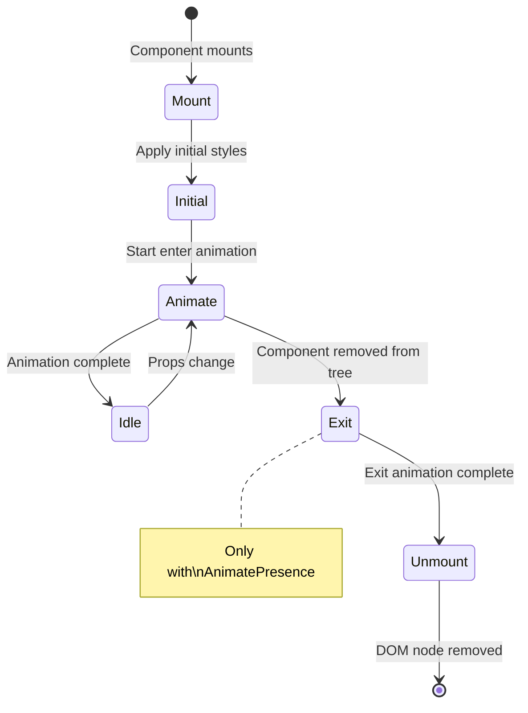

# Framer Motion Patterns

## Why Framer Motion Exists

React's declarative model creates a fundamental tension with animation. React says: "describe the UI for the current state, and I will figure out how to update the DOM." Animation says: "I need to interpolate between states over time." These two philosophies collide in three specific places:

1. **Exit animations**: React removes DOM nodes immediately when components unmount. There is no built-in way to say "animate out, then remove."
2. **Layout animations**: When a component's size or position changes due to state updates, React applies the change instantly. There is no way to interpolate between the old layout and the new layout.
3. **Gesture-driven animation**: Drag, swipe, and pinch require imperative state management that fights React's declarative model.

Framer Motion solves all three by wrapping React components in a `motion` wrapper that intercepts renders, captures layout information, manages exit animations, and provides a declarative API for physics-based animation.

The library weighs ~33KB gzipped. This is the cost of solving problems that are genuinely hard at the framework level. Before Framer Motion, achieving the same results required 500+ lines of custom code per interaction pattern, with bugs in edge cases that took months to discover.

## First Principles: The motion Component

### How motion Components Work

A `motion.div` is a regular `<div>` enhanced with animation capabilities. Internally, it:

1. Creates a `MotionValue` for each animated property
2. Subscribes to those values and updates the DOM directly (bypassing React's reconciler)
3. Captures layout information before and after React renders (for FLIP animations)
4. Manages its own animation lifecycle (including exit animations via AnimatePresence)

```typescript
import { motion } from 'framer-motion';

// motion.div is a drop-in replacement for <div>
function BasicExample() {
  return (
    <motion.div
      initial={​{ opacity: 0, y: 20 }}
      animate={​{ opacity: 1, y: 0 }}
      transition={​{ duration: 0.3, ease: 'easeOut' }}
    >
      Content appears with a fade-up
    </motion.div>
  );
}
```

### The Animation Lifecycle



### Core Props

```typescript
interface MotionProps {
  /** Starting state (on mount) */
  initial?: TargetAndTransition | false;

  /** Target state to animate toward */
  animate?: TargetAndTransition;

  /** Exit state (requires AnimatePresence parent) */
  exit?: TargetAndTransition;

  /** Hover state */
  whileHover?: TargetAndTransition;

  /** Press state */
  whileTap?: TargetAndTransition;

  /** Drag state */
  whileDrag?: TargetAndTransition;

  /** Focus state */
  whileFocus?: TargetAndTransition;

  /** Animation configuration */
  transition?: Transition;

  /** Named animation states */
  variants?: Variants;

  /** Enable layout animations */
  layout?: boolean | 'position' | 'size';

  /** Shared layout ID for cross-component animation */
  layoutId?: string;
}
```

## Variants: Declarative Animation States

Variants are named animation states that can propagate through component trees.

### Basic Variant Pattern

```typescript
const containerVariants = {
  hidden: {
    opacity: 0,
  },
  visible: {
    opacity: 1,
    transition: {
      staggerChildren: 0.05,
      delayChildren: 0.1,
    },
  },
};

const itemVariants = {
  hidden: {
    opacity: 0,
    y: 20,
  },
  visible: {
    opacity: 1,
    y: 0,
    transition: {
      type: 'spring',
      stiffness: 300,
      damping: 24,
    },
  },
};

function StaggeredList({ items }: { items: string[] }) {
  return (
    <motion.ul
      variants={containerVariants}
      initial="hidden"
      animate="visible"
    >
      {items.map((item) => (
        <motion.li key={item} variants={itemVariants}>
          {item}
        </motion.li>
      ))}
    </motion.ul>
  );
}
```

### Variant Propagation

When a parent `motion` component has `animate="visible"`, all children with `variants` automatically animate to their `visible` variant — without explicit `animate` props.

```typescript
// Parent drives the animation state for the entire tree
const sidebar = {
  open: {
    x: 0,
    transition: {
      type: 'spring',
      stiffness: 300,
      damping: 30,
      staggerChildren: 0.05,
    },
  },
  closed: {
    x: '-100%',
    transition: {
      type: 'spring',
      stiffness: 400,
      damping: 40,
      staggerChildren: 0.03,
      staggerDirection: -1,    // Reverse stagger on close
    },
  },
};

const menuItem = {
  open: {
    opacity: 1,
    x: 0,
    transition: { type: 'spring', stiffness: 300, damping: 24 },
  },
  closed: {
    opacity: 0,
    x: -20,
  },
};

function Sidebar({ isOpen, items }: { isOpen: boolean; items: string[] }) {
  return (
    <motion.nav
      variants={sidebar}
      initial="closed"
      animate={isOpen ? 'open' : 'closed'}
    >
      {items.map((item) => (
        <motion.a key={item} variants={menuItem} href="#">
          {item}
        </motion.a>
      ))}
    </motion.nav>
  );
}
```

### Dynamic Variants

Variants can be functions that receive custom data:

```typescript
const itemVariants = {
  hidden: { opacity: 0, y: 20 },
  visible: (index: number) => ({
    opacity: 1,
    y: 0,
    transition: {
      delay: index * 0.05,
      type: 'spring',
      stiffness: 300,
      damping: 24,
    },
  }),
};

function DynamicList({ items }: { items: string[] }) {
  return (
    <motion.ul initial="hidden" animate="visible">
      {items.map((item, i) => (
        <motion.li key={item} custom={i} variants={itemVariants}>
          {item}
        </motion.li>
      ))}
    </motion.ul>
  );
}
```

## AnimatePresence: Exit Animations

`AnimatePresence` is Framer Motion's solution to React's "instant unmount" problem. It intercepts component removal and keeps the DOM node alive until the exit animation completes.

### Basic Pattern

```typescript
import { AnimatePresence, motion } from 'framer-motion';

function Notification({ message, id, onDismiss }: {
  message: string;
  id: string;
  onDismiss: () => void;
}) {
  return (
    <motion.div
      key={id}
      initial={​{ opacity: 0, x: 300, scale: 0.9 }}
      animate={​{ opacity: 1, x: 0, scale: 1 }}
      exit={​{ opacity: 0, x: 300, scale: 0.9 }}
      transition={​{ type: 'spring', stiffness: 300, damping: 25 }}
      onClick={onDismiss}
    >
      {message}
    </motion.div>
  );
}

function NotificationStack() {
  const [notifications, setNotifications] = React.useState<
    Array<{ id: string; message: string }>
  >([]);

  const dismiss = (id: string) => {
    setNotifications(prev => prev.filter(n => n.id !== id));
  };

  return (
    <div className="notification-stack">
      <AnimatePresence>
        {notifications.map(notification => (
          <Notification
            key={notification.id}
            id={notification.id}
            message={notification.message}
            onDismiss={() => dismiss(notification.id)}
          />
        ))}
      </AnimatePresence>
    </div>
  );
}
```

### mode: "wait" vs "sync" vs "popLayout"

```typescript
// mode="sync" (default): Enter and exit animations play simultaneously
<AnimatePresence mode="sync">
  <motion.div key={currentPage} ... />
</AnimatePresence>

// mode="wait": Exit completes before enter starts
<AnimatePresence mode="wait">
  <motion.div key={currentPage} ... />
</AnimatePresence>

// mode="popLayout": Exiting elements are removed from layout flow immediately
// Remaining elements animate to fill the gap via layout animation
<AnimatePresence mode="popLayout">
  <motion.div key={currentPage} layout ... />
</AnimatePresence>
```

### Page Transitions with AnimatePresence

```typescript
const pageTransitionVariants = {
  initial: {
    opacity: 0,
    x: 20,
  },
  animate: {
    opacity: 1,
    x: 0,
    transition: {
      duration: 0.3,
      ease: [0.2, 0, 0, 1],
    },
  },
  exit: {
    opacity: 0,
    x: -20,
    transition: {
      duration: 0.2,
      ease: [0.4, 0, 1, 1],
    },
  },
};

function PageTransition({ children, pageKey }: {
  children: React.ReactNode;
  pageKey: string;
}) {
  return (
    <AnimatePresence mode="wait">
      <motion.main
        key={pageKey}
        variants={pageTransitionVariants}
        initial="initial"
        animate="animate"
        exit="exit"
      >
        {children}
      </motion.main>
    </AnimatePresence>
  );
}
```

### Conditional Rendering with Exit Animations

```typescript
function ExpandableCard({ isExpanded, summary, detail }: {
  isExpanded: boolean;
  summary: React.ReactNode;
  detail: React.ReactNode;
}) {
  return (
    <motion.div layout className="card">
      {summary}
      <AnimatePresence>
        {isExpanded && (
          <motion.div
            initial={​{ opacity: 0, height: 0 }}
            animate={​{ opacity: 1, height: 'auto' }}
            exit={​{ opacity: 0, height: 0 }}
            transition={​{ duration: 0.3, ease: [0.2, 0, 0, 1] }}
            style={​{ overflow: 'hidden' }}
          >
            {detail}
          </motion.div>
        )}
      </AnimatePresence>
    </motion.div>
  );
}
```

## Layout Animations

Layout animations are Framer Motion's most powerful and most complex feature. They automatically animate elements between layout states using the FLIP technique internally.

### Basic Layout Animation

```typescript
function ToggleSwitch({ isOn, onToggle }: {
  isOn: boolean;
  onToggle: () => void;
}) {
  return (
    <div
      className="switch-track"
      onClick={onToggle}
      style={​{
        display: 'flex',
        justifyContent: isOn ? 'flex-end' : 'flex-start',
        padding: 4,
        borderRadius: 50,
        background: isOn ? '#3498db' : '#ccc',
        width: 56,
        cursor: 'pointer',
      }}
    >
      <motion.div
        layout                           // Enable layout animation
        transition={​{
          type: 'spring',
          stiffness: 500,
          damping: 30,
        }}
        style={​{
          width: 24,
          height: 24,
          borderRadius: '50%',
          background: 'white',
        }}
      />
    </div>
  );
}
```

### layout="position" vs layout="size" vs layout={true}

```typescript
// layout={true}: Animate both position AND size changes
<motion.div layout>
  {/* Position and dimensions animate smoothly */}
</motion.div>

// layout="position": Only animate position changes
<motion.div layout="position">
  {/* Size changes instantly, position animates */}
</motion.div>

// layout="size": Only animate size changes
<motion.div layout="size">
  {/* Position changes instantly, size animates */}
</motion.div>
```

### Shared Layout Animation (layoutId)

`layoutId` connects two different motion components so they animate between each other when one mounts and the other unmounts:

```typescript
function TabBar({ tabs, activeTab, onSelect }: {
  tabs: string[];
  activeTab: string;
  onSelect: (tab: string) => void;
}) {
  return (
    <div className="tab-bar" style={​{ display: 'flex', gap: 4 }}>
      {tabs.map(tab => (
        <button
          key={tab}
          onClick={() => onSelect(tab)}
          style={​{ position: 'relative', padding: '8px 16px' }}
        >
          {tab}
          {activeTab === tab && (
            <motion.div
              layoutId="active-tab-indicator"
              className="tab-indicator"
              style={​{
                position: 'absolute',
                bottom: 0,
                left: 0,
                right: 0,
                height: 2,
                background: '#3498db',
              }}
              transition={​{
                type: 'spring',
                stiffness: 400,
                damping: 30,
              }}
            />
          )}
        </button>
      ))}
    </div>
  );
}
```

### Card Expand with Shared Layout

```typescript
function CardGrid({ items }: { items: CardItem[] }) {
  const [selectedId, setSelectedId] = React.useState<string | null>(null);
  const selectedItem = items.find(item => item.id === selectedId);

  return (
    <>
      <div className="grid">
        {items.map(item => (
          <motion.div
            key={item.id}
            layoutId={`card-${item.id}`}
            onClick={() => setSelectedId(item.id)}
            className="card-thumbnail"
            style={​{ cursor: 'pointer' }}
          >
            <motion.img
              layoutId={`image-${item.id}`}
              src={item.image}
              alt={item.title}
            />
            <motion.h3 layoutId={`title-${item.id}`}>
              {item.title}
            </motion.h3>
          </motion.div>
        ))}
      </div>

      <AnimatePresence>
        {selectedItem && (
          <>
            {/* Backdrop */}
            <motion.div
              initial={​{ opacity: 0 }}
              animate={​{ opacity: 1 }}
              exit={​{ opacity: 0 }}
              className="backdrop"
              onClick={() => setSelectedId(null)}
            />

            {/* Expanded card */}
            <motion.div
              layoutId={`card-${selectedItem.id}`}
              className="card-expanded"
            >
              <motion.img
                layoutId={`image-${selectedItem.id}`}
                src={selectedItem.image}
                alt={selectedItem.title}
              />
              <motion.h3 layoutId={`title-${selectedItem.id}`}>
                {selectedItem.title}
              </motion.h3>
              <motion.p
                initial={​{ opacity: 0 }}
                animate={​{ opacity: 1, transition: { delay: 0.2 } }}
                exit={​{ opacity: 0 }}
              >
                {selectedItem.description}
              </motion.p>
            </motion.div>
          </>
        )}
      </AnimatePresence>
    </>
  );
}
```

::: info War Story
A team used `layoutId` to animate cards between a grid view and a list view. Everything worked until they added virtual scrolling. When a card scrolled out of the virtual window, React unmounted it — and Framer Motion interpreted this as an exit animation, flying the card to wherever the `layoutId` was last seen. The fix was wrapping the virtualized area in `<LayoutGroup id="grid">` and ensuring `layoutId` values were scoped. They also had to disable layout animations during rapid scrolling using a `layoutDependency` check tied to scroll velocity. The lesson: layout animations and virtualization are fundamentally at odds — one wants to keep DOM nodes alive, the other wants to remove them.
:::

## useMotionValue and useTransform

### useMotionValue

`MotionValue` is Framer Motion's core primitive for storing animated values outside React state. Updates to MotionValues do not trigger React re-renders.

```typescript
import { motion, useMotionValue, useTransform } from 'framer-motion';

function DragCard() {
  // Create a motion value — does NOT trigger re-renders when it changes
  const x = useMotionValue(0);

  // Derive values from the motion value
  const rotateZ = useTransform(x, [-200, 0, 200], [-15, 0, 15]);
  const opacity = useTransform(x, [-200, 0, 200], [0.5, 1, 0.5]);
  const background = useTransform(
    x,
    [-200, 0, 200],
    ['#ff6b6b', '#ffffff', '#51cf66']
  );

  return (
    <motion.div
      drag="x"
      dragConstraints={​{ left: -200, right: 200 }}
      style={​{
        x,                     // Bind motion value to transform
        rotateZ,               // Derived rotation
        opacity,               // Derived opacity
        backgroundColor: background,  // Derived color
        cursor: 'grab',
      }}
      whileDrag={​{ cursor: 'grabbing', scale: 1.05 }}
    >
      Drag me left or right
    </motion.div>
  );
}
```

### useTransform: Mapping Value Ranges

```typescript
// Linear mapping: input range → output range
const y = useMotionValue(0);
const scale = useTransform(y, [0, -100], [1, 1.5]);
// When y=0, scale=1. When y=-100, scale=1.5.

// With custom easing
const opacity = useTransform(y, [0, -100], [1, 0], {
  ease: cubicBezier(0.4, 0, 0.2, 1),
});

// Transform function (arbitrary computation)
const display = useTransform(y, (latest) => {
  return latest < -50 ? 'block' : 'none';
});

// Combining multiple motion values
const x = useMotionValue(0);
const y2 = useMotionValue(0);
const distance = useTransform([x, y2], ([latestX, latestY]: number[]) => {
  return Math.sqrt(latestX * latestX + latestY * latestY);
});
```

### useSpring

```typescript
import { useSpring, useMotionValue } from 'framer-motion';

function SpringFollower() {
  const mouseX = useMotionValue(0);
  const mouseY = useMotionValue(0);

  // Springs follow the mouse with physics
  const springX = useSpring(mouseX, {
    stiffness: 200,
    damping: 20,
    mass: 0.5,
  });
  const springY = useSpring(mouseY, {
    stiffness: 200,
    damping: 20,
    mass: 0.5,
  });

  const handleMouseMove = (e: React.MouseEvent) => {
    mouseX.set(e.clientX - window.innerWidth / 2);
    mouseY.set(e.clientY - window.innerHeight / 2);
  };

  return (
    <div onMouseMove={handleMouseMove} style={​{ height: '100vh' }}>
      <motion.div
        style={​{
          x: springX,
          y: springY,
          width: 40,
          height: 40,
          borderRadius: '50%',
          background: '#3498db',
          position: 'fixed',
          top: '50%',
          left: '50%',
          marginLeft: -20,
          marginTop: -20,
          pointerEvents: 'none',
        }}
      />
    </div>
  );
}
```

### useVelocity

```typescript
import { useMotionValue, useVelocity, useTransform } from 'framer-motion';

function VelocitySkew() {
  const x = useMotionValue(0);
  const xVelocity = useVelocity(x);

  // Skew based on velocity — faster movement = more skew
  const skewX = useTransform(xVelocity, [-1000, 0, 1000], [-15, 0, 15]);

  // Scale X based on velocity — stretches in direction of movement
  const scaleX = useTransform(xVelocity, [-1000, 0, 1000], [0.9, 1, 0.9]);

  return (
    <motion.div
      drag="x"
      dragConstraints={​{ left: -200, right: 200 }}
      style={​{ x, skewX, scaleX }}
    >
      Drag to see velocity-based distortion
    </motion.div>
  );
}
```

## Gesture Props

### Hover, Tap, Focus, Drag

```typescript
function InteractiveCard({ children }: { children: React.ReactNode }) {
  return (
    <motion.div
      // Hover state
      whileHover={​{
        scale: 1.02,
        boxShadow: '0 8px 30px rgba(0,0,0,0.12)',
        transition: { type: 'spring', stiffness: 400, damping: 25 },
      }}

      // Press/tap state
      whileTap={​{
        scale: 0.98,
        boxShadow: '0 2px 8px rgba(0,0,0,0.1)',
      }}

      // Focus state (keyboard navigation)
      whileFocus={​{
        outline: '2px solid #3498db',
        outlineOffset: '2px',
      }}

      // Drag configuration
      drag                        // Enable drag on both axes
      dragConstraints={​{           // Limit drag area
        top: -100,
        bottom: 100,
        left: -100,
        right: 100,
      }}
      dragElastic={0.2}           // Rubber-band effect at constraints
      dragMomentum={true}         // Enable momentum after release
      dragTransition={​{            // Configure post-drag physics
        bounceStiffness: 300,
        bounceDamping: 20,
      }}

      // Drag state
      whileDrag={​{
        scale: 1.05,
        cursor: 'grabbing',
        boxShadow: '0 20px 40px rgba(0,0,0,0.2)',
      }}

      // Event handlers
      onHoverStart={() => console.log('hover start')}
      onHoverEnd={() => console.log('hover end')}
      onTapStart={() => console.log('tap start')}
      onTap={() => console.log('tap')}
      onTapCancel={() => console.log('tap cancelled')}
      onDragStart={(e, info) => console.log('drag start', info.point)}
      onDrag={(e, info) => console.log('dragging', info.velocity)}
      onDragEnd={(e, info) => console.log('drag end', info.velocity)}

      style={​{ cursor: 'grab' }}
    >
      {children}
    </motion.div>
  );
}
```

### Swipe-to-Dismiss

```typescript
function SwipeToDismiss({
  children,
  onDismiss,
}: {
  children: React.ReactNode;
  onDismiss: () => void;
}) {
  const x = useMotionValue(0);
  const opacity = useTransform(x, [-200, 0, 200], [0, 1, 0]);
  const background = useTransform(
    x,
    [-200, -100, 0, 100, 200],
    [
      'rgba(231, 76, 60, 0.3)',
      'rgba(231, 76, 60, 0.1)',
      'transparent',
      'rgba(46, 204, 113, 0.1)',
      'rgba(46, 204, 113, 0.3)',
    ]
  );

  return (
    <motion.div style={​{ backgroundColor: background }}>
      <motion.div
        drag="x"
        dragConstraints={​{ left: 0, right: 0 }}
        style={​{ x, opacity }}
        onDragEnd={(_, info) => {
          const threshold = 100;
          const velocity = Math.abs(info.velocity.x);
          const offset = Math.abs(info.offset.x);

          if (offset > threshold || velocity > 500) {
            onDismiss();
          }
        }}
      >
        {children}
      </motion.div>
    </motion.div>
  );
}
```

## Orchestration Patterns

### staggerChildren and delayChildren

```typescript
const container = {
  hidden: { opacity: 0 },
  show: {
    opacity: 1,
    transition: {
      delayChildren: 0.3,      // Wait 300ms before starting children
      staggerChildren: 0.1,    // 100ms between each child
    },
  },
  exit: {
    opacity: 0,
    transition: {
      staggerChildren: 0.05,
      staggerDirection: -1,     // Reverse order on exit
    },
  },
};

const item = {
  hidden: { opacity: 0, y: 20 },
  show: { opacity: 1, y: 0 },
  exit: { opacity: 0, y: -10 },
};
```

### when: "beforeChildren" / "afterChildren"

```typescript
const parentVariants = {
  visible: {
    opacity: 1,
    transition: {
      when: 'beforeChildren',   // Parent animates first
      staggerChildren: 0.1,
    },
  },
  hidden: {
    opacity: 0,
    transition: {
      when: 'afterChildren',    // Children animate first, then parent
      staggerChildren: 0.05,
      staggerDirection: -1,
    },
  },
};
```

### Complex Choreography with useAnimationControls

```typescript
import { motion, useAnimationControls } from 'framer-motion';

function ChoreographedSequence() {
  const headerControls = useAnimationControls();
  const contentControls = useAnimationControls();
  const footerControls = useAnimationControls();

  async function playEntrance() {
    // Step 1: Header slides in
    await headerControls.start({
      y: 0,
      opacity: 1,
      transition: { type: 'spring', stiffness: 300, damping: 25 },
    });

    // Step 2: Content fades in (after header settles)
    await contentControls.start({
      opacity: 1,
      y: 0,
      transition: { duration: 0.4, ease: [0.2, 0, 0, 1] },
    });

    // Step 3: Footer slides up
    await footerControls.start({
      y: 0,
      opacity: 1,
      transition: { type: 'spring', stiffness: 200, damping: 20 },
    });
  }

  React.useEffect(() => {
    playEntrance();
  }, []);

  return (
    <div>
      <motion.header
        initial={​{ y: -50, opacity: 0 }}
        animate={headerControls}
      >
        Header
      </motion.header>

      <motion.main
        initial={​{ opacity: 0, y: 20 }}
        animate={contentControls}
      >
        Content
      </motion.main>

      <motion.footer
        initial={​{ y: 50, opacity: 0 }}
        animate={footerControls}
      >
        Footer
      </motion.footer>
    </div>
  );
}
```

## Production Patterns

### Accessible Motion Component

```typescript
import { motion, type HTMLMotionProps } from 'framer-motion';

function useReducedMotion(): boolean {
  const [reduced, setReduced] = React.useState(false);

  React.useEffect(() => {
    const mq = window.matchMedia('(prefers-reduced-motion: reduce)');
    setReduced(mq.matches);
    const handler = (e: MediaQueryListEvent) => setReduced(e.matches);
    mq.addEventListener('change', handler);
    return () => mq.removeEventListener('change', handler);
  }, []);

  return reduced;
}

interface AccessibleMotionDivProps extends HTMLMotionProps<'div'> {
  reducedMotionAlternative?: HTMLMotionProps<'div'>['animate'];
}

function AccessibleMotionDiv({
  initial,
  animate,
  exit,
  transition,
  reducedMotionAlternative,
  ...props
}: AccessibleMotionDivProps) {
  const reducedMotion = useReducedMotion();

  if (reducedMotion) {
    return (
      <motion.div
        {...props}
        initial={​{ opacity: 0 }}
        animate={reducedMotionAlternative ?? { opacity: 1 }}
        exit={​{ opacity: 0 }}
        transition={​{ duration: 0.15 }}
      />
    );
  }

  return (
    <motion.div
      {...props}
      initial={initial}
      animate={animate}
      exit={exit}
      transition={transition}
    />
  );
}
```

### Reusable Transition Presets

```typescript
// transition-presets.ts
export const transitions = {
  spring: {
    snappy: { type: 'spring' as const, stiffness: 400, damping: 28 },
    bouncy: { type: 'spring' as const, stiffness: 200, damping: 12 },
    gentle: { type: 'spring' as const, stiffness: 120, damping: 20 },
    stiff:  { type: 'spring' as const, stiffness: 600, damping: 35 },
  },
  tween: {
    fast:    { type: 'tween' as const, duration: 0.15, ease: [0.2, 0, 0, 1] },
    normal:  { type: 'tween' as const, duration: 0.25, ease: [0.2, 0, 0, 1] },
    slow:    { type: 'tween' as const, duration: 0.4,  ease: [0.2, 0, 0, 1] },
    enter:   { type: 'tween' as const, duration: 0.25, ease: [0, 0, 0.2, 1] },
    exit:    { type: 'tween' as const, duration: 0.2,  ease: [0.4, 0, 1, 1] },
  },
} as const;

// Usage
<motion.div
  animate={​{ opacity: 1, y: 0 }}
  transition={transitions.spring.snappy}
/>
```

### List with Add/Remove Animations

```typescript
function AnimatedList<T extends { id: string }>({
  items,
  renderItem,
  onRemove,
}: {
  items: T[];
  renderItem: (item: T) => React.ReactNode;
  onRemove: (id: string) => void;
}) {
  return (
    <motion.ul layout>
      <AnimatePresence mode="popLayout">
        {items.map((item) => (
          <motion.li
            key={item.id}
            layout
            initial={​{ opacity: 0, scale: 0.8, y: -20 }}
            animate={​{ opacity: 1, scale: 1, y: 0 }}
            exit={​{ opacity: 0, scale: 0.8, x: -300 }}
            transition={​{
              layout: { type: 'spring', stiffness: 300, damping: 25 },
              opacity: { duration: 0.2 },
              scale: { type: 'spring', stiffness: 400, damping: 25 },
            }}
          >
            {renderItem(item)}
            <button onClick={() => onRemove(item.id)}>Remove</button>
          </motion.li>
        ))}
      </AnimatePresence>
    </motion.ul>
  );
}
```

## Performance Optimization

### Avoiding Re-renders

MotionValues update the DOM directly without triggering React re-renders. Use them for high-frequency updates:

```typescript
// BAD: React state causes re-render on every mouse move
function BadMouseFollower() {
  const [pos, setPos] = React.useState({ x: 0, y: 0 });

  return (
    <div onMouseMove={(e) => setPos({ x: e.clientX, y: e.clientY })}>
      <div style={​{ transform: `translate(${pos.x}px, ${pos.y}px)` }} />
    </div>
  );
}

// GOOD: MotionValues bypass React reconciler
function GoodMouseFollower() {
  const x = useMotionValue(0);
  const y = useMotionValue(0);

  return (
    <div onMouseMove={(e) => { x.set(e.clientX); y.set(e.clientY); }}>
      <motion.div style={​{ x, y }} />
    </div>
  );
}
```

### Layout Animation Performance

```typescript
// Use layoutScroll for scrollable containers
function ScrollableWithLayout() {
  return (
    <motion.div
      layoutScroll                // Track scroll position during layout animations
      style={​{ overflow: 'auto', maxHeight: 400 }}
    >
      <AnimatePresence>
        {items.map(item => (
          <motion.div
            key={item.id}
            layout
            layoutId={item.id}
            // Restrict layout animation to position only — cheaper than both
            // layout="position" is cheaper than layout={true}
          >
            {item.content}
          </motion.div>
        ))}
      </AnimatePresence>
    </motion.div>
  );
}
```

### Bundle Size Optimization

```typescript
// Import only what you need
import { motion, AnimatePresence } from 'framer-motion';

// For smaller bundles, use LazyMotion + domAnimation
import { LazyMotion, domAnimation, m } from 'framer-motion';

function App() {
  return (
    // domAnimation: ~17KB (basic features)
    // domMax: ~33KB (all features including layout)
    <LazyMotion features={domAnimation}>
      <m.div
        initial={​{ opacity: 0 }}
        animate={​{ opacity: 1 }}
      >
        Uses `m` instead of `motion` for tree-shakeable components
      </m.div>
    </LazyMotion>
  );
}
```

| Import Strategy | Gzipped Size | Features |
|----------------|-------------|----------|
| `motion` (full) | ~33KB | Everything |
| `LazyMotion` + `domAnimation` | ~17KB | Animations, transitions, gestures |
| `LazyMotion` + `domMax` | ~33KB | Everything (lazy loaded) |
| `m` components only | ~5KB | Just the component wrapper |

## Edge Cases and Failure Modes

### Layout Animation Flash

When `layout` elements have `border-radius` or `box-shadow`, FLIP-based layout animations can cause a flash where the element appears distorted mid-animation. This happens because `scale` transforms distort these properties.

```typescript
// Fix: use layoutId with identical styling on both instances
// Or use CSS custom properties with inverse transforms
<motion.div
  layout
  style={​{
    borderRadius: 12,
    // Framer Motion auto-corrects border-radius during layout
    // but custom shadows may still distort
  }}
  transition={​{
    layout: {
      type: 'spring',
      stiffness: 300,
      damping: 30,
    },
  }}
/>
```

### AnimatePresence Key Gotcha

`AnimatePresence` relies on `key` to detect component identity. If keys are reused or change unexpectedly, exit animations will not fire:

```typescript
// BUG: Using array index as key — items don't get exit animations on reorder
{items.map((item, i) => (
  <motion.div key={i} exit={​{ opacity: 0 }}>  {/* Wrong! */}
    {item.name}
  </motion.div>
))}

// FIX: Use stable unique IDs
{items.map((item) => (
  <motion.div key={item.id} exit={​{ opacity: 0 }}>  {/* Correct */}
    {item.name}
  </motion.div>
))}
```

::: warning
Framer Motion's layout animations use `requestAnimationFrame` internally and can conflict with other libraries that also intercept RAF (React Fiber's concurrent mode, GSAP, Three.js). If you see flickering or torn frames, check for RAF conflicts.
:::
