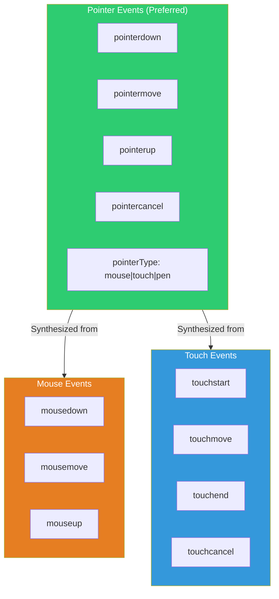
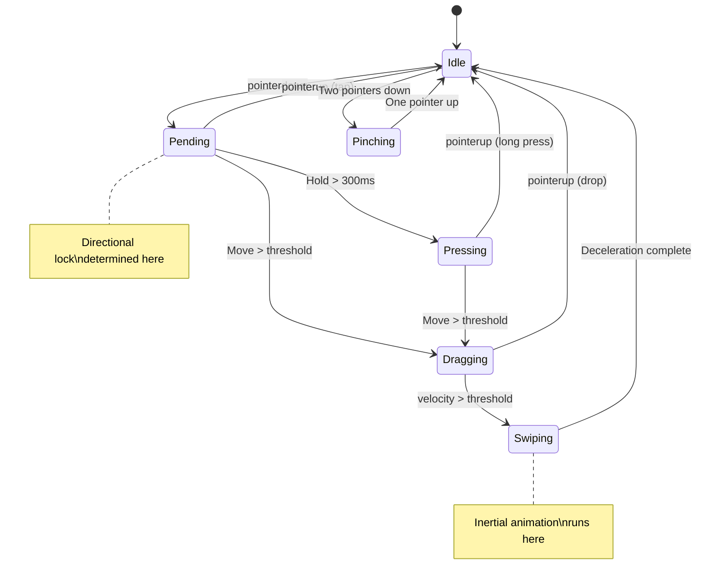
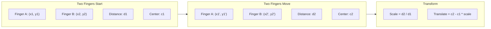

# Gesture Animations

## Why Gesture Animation is Hard

Gesture-driven animation is the most challenging category of web animation because it exists at the intersection of three problems:

1. **Input handling**: Touch events, pointer events, and mouse events have different APIs, coordinate systems, and behavior across platforms. A two-finger pinch on iOS fires different events than on Android. A trackpad pinch on macOS fires wheel events with `ctrlKey: true`, not touch events.

2. **Physics simulation**: After a user lifts their finger from a swipe, the element must continue moving with deceleration. The deceleration must feel natural — matching iOS and Android's native scroll physics that users have internalized over 15+ years of smartphone use.

3. **State management**: A gesture progresses through states (idle, pressing, dragging, swiping, pinching) with transitions that depend on velocity, distance, direction, and number of contact points. Managing these states correctly — especially when gestures interrupt each other — requires a state machine.

Early mobile web frameworks (jQuery Mobile, Sencha Touch) attempted gesture recognition with simple distance thresholds. The result felt wrong — taps were mistaken for swipes, scrolling conflicted with dragging, and inertia felt mechanical. Modern gesture systems use velocity thresholds, directional locks, and physics-based deceleration to match native platform feel.

## First Principles: The Event Model

### Event Types Hierarchy



### Why Pointer Events Over Touch Events

Pointer Events unify mouse, touch, and pen input into a single API. They should be your default choice:

| Feature | Mouse Events | Touch Events | Pointer Events |
|---------|-------------|-------------|----------------|
| Multi-touch | No | Yes | Yes |
| Pressure | No | Yes (Force Touch) | Yes |
| Tilt/twist | No | No | Yes (pen) |
| Pointer capture | No | No | Yes |
| Input type detection | Implicit | Implicit | `pointerType` |
| Browser support | Universal | Mobile only | Universal (modern) |

```typescript
// Pointer event properties you will use
interface GesturePointerEvent {
  pointerId: number;        // Unique ID per contact point
  pointerType: 'mouse' | 'touch' | 'pen';
  clientX: number;          // Viewport coordinates
  clientY: number;
  pressure: number;         // 0-1 (0 = hover, 1 = max press)
  width: number;            // Contact area width (touch)
  height: number;           // Contact area height (touch)
  isPrimary: boolean;       // First pointer in multi-touch
}
```

### Touch Action CSS

The `touch-action` CSS property tells the browser which gestures to handle natively and which to pass to JavaScript:

```css
/* Let browser handle all gestures (default) */
.element { touch-action: auto; }

/* Disable ALL browser gestures — JS handles everything */
.element { touch-action: none; }

/* Allow vertical scroll only — JS handles horizontal */
.horizontal-slider { touch-action: pan-y; }

/* Allow horizontal scroll only — JS handles vertical */
.vertical-list { touch-action: pan-x; }

/* Allow scroll but disable pinch zoom */
.scrollable-no-zoom { touch-action: pan-x pan-y; }

/* Allow pinch zoom only */
.pinch-only { touch-action: pinch-zoom; }
```

::: danger
Setting `touch-action: none` disables ALL native touch behavior including scrolling. Only use it on specific gesture target elements, never on `body` or large containers. If you accidentally apply it to a scrollable container, users cannot scroll — a critical accessibility failure.
:::

## Core Mechanics: Gesture State Machine

### The Universal Gesture State Machine

Every gesture follows a state machine pattern:



### Implementation: GestureRecognizer

```typescript
type GestureState =
  | 'idle'
  | 'pending'
  | 'pressing'
  | 'dragging'
  | 'swiping'
  | 'pinching';

interface Point {
  x: number;
  y: number;
}

interface GestureEvent {
  state: GestureState;
  position: Point;
  delta: Point;
  offset: Point;          // Total offset from start
  velocity: Point;        // Current velocity (px/ms)
  direction: 'up' | 'down' | 'left' | 'right' | null;
  distance: number;
  timestamp: number;
}

interface GestureConfig {
  /** Distance threshold to start dragging (px) */
  dragThreshold: number;
  /** Time threshold for long press (ms) */
  longPressThreshold: number;
  /** Velocity threshold for swipe detection (px/ms) */
  swipeVelocityThreshold: number;
  /** Lock to single axis after initial direction */
  directionalLock: boolean;
  /** Which axis to allow ('x' | 'y' | 'both') */
  axis: 'x' | 'y' | 'both';
}

const DEFAULT_CONFIG: GestureConfig = {
  dragThreshold: 3,
  longPressThreshold: 300,
  swipeVelocityThreshold: 0.5,
  directionalLock: false,
  axis: 'both',
};

class GestureRecognizer {
  private state: GestureState = 'idle';
  private startPoint: Point = { x: 0, y: 0 };
  private lastPoint: Point = { x: 0, y: 0 };
  private startTime: number = 0;
  private lastTime: number = 0;
  private velocityTracker: VelocityTracker;
  private longPressTimer: ReturnType<typeof setTimeout> | null = null;
  private lockedAxis: 'x' | 'y' | null = null;
  private config: GestureConfig;
  private activePointers = new Map<number, Point>();

  // Callbacks
  onGestureStart?: (e: GestureEvent) => void;
  onGestureMove?: (e: GestureEvent) => void;
  onGestureEnd?: (e: GestureEvent) => void;
  onTap?: (point: Point) => void;
  onLongPress?: (point: Point) => void;
  onSwipe?: (direction: string, velocity: Point) => void;
  onPinch?: (scale: number, center: Point) => void;

  constructor(
    private element: HTMLElement,
    config: Partial<GestureConfig> = {}
  ) {
    this.config = { ...DEFAULT_CONFIG, ...config };
    this.velocityTracker = new VelocityTracker();
    this.bind();
  }

  private bind(): void {
    this.element.addEventListener('pointerdown', this.handlePointerDown);
    this.element.addEventListener('pointermove', this.handlePointerMove);
    this.element.addEventListener('pointerup', this.handlePointerUp);
    this.element.addEventListener('pointercancel', this.handlePointerUp);

    // Prevent context menu on long press
    this.element.addEventListener('contextmenu', (e) => {
      if (this.state !== 'idle') e.preventDefault();
    });
  }

  private handlePointerDown = (e: PointerEvent): void => {
    this.activePointers.set(e.pointerId, { x: e.clientX, y: e.clientY });

    // Multi-touch: two pointers = pinch
    if (this.activePointers.size === 2) {
      this.state = 'pinching';
      this.clearLongPressTimer();
      return;
    }

    // Capture pointer for reliable tracking outside element
    this.element.setPointerCapture(e.pointerId);

    this.state = 'pending';
    this.startPoint = { x: e.clientX, y: e.clientY };
    this.lastPoint = { x: e.clientX, y: e.clientY };
    this.startTime = performance.now();
    this.lastTime = this.startTime;
    this.lockedAxis = null;

    this.velocityTracker.reset();
    this.velocityTracker.addPoint(e.clientX, e.clientY, this.startTime);

    // Start long press timer
    this.longPressTimer = setTimeout(() => {
      if (this.state === 'pending') {
        this.state = 'pressing';
        this.onLongPress?.(this.startPoint);
      }
    }, this.config.longPressThreshold);
  };

  private handlePointerMove = (e: PointerEvent): void => {
    if (this.state === 'idle') return;

    const now = performance.now();
    const point: Point = { x: e.clientX, y: e.clientY };
    this.activePointers.set(e.pointerId, point);

    // Handle pinch
    if (this.state === 'pinching' && this.activePointers.size === 2) {
      this.handlePinchMove();
      return;
    }

    this.velocityTracker.addPoint(point.x, point.y, now);

    const dx = point.x - this.startPoint.x;
    const dy = point.y - this.startPoint.y;
    const distance = Math.sqrt(dx * dx + dy * dy);

    if (this.state === 'pending' || this.state === 'pressing') {
      if (distance > this.config.dragThreshold) {
        this.clearLongPressTimer();
        this.state = 'dragging';

        // Determine directional lock
        if (this.config.directionalLock) {
          this.lockedAxis = Math.abs(dx) > Math.abs(dy) ? 'x' : 'y';
        }

        this.onGestureStart?.(this.createEvent(point, now));
      }
    }

    if (this.state === 'dragging') {
      this.onGestureMove?.(this.createEvent(point, now));
    }

    this.lastPoint = point;
    this.lastTime = now;
  };

  private handlePointerUp = (e: PointerEvent): void => {
    this.activePointers.delete(e.pointerId);
    this.clearLongPressTimer();

    if (this.state === 'pinching' && this.activePointers.size < 2) {
      this.state = 'idle';
      return;
    }

    const now = performance.now();
    const point: Point = { x: e.clientX, y: e.clientY };
    const velocity = this.velocityTracker.getVelocity();
    const speed = Math.sqrt(
      velocity.x * velocity.x + velocity.y * velocity.y
    );

    switch (this.state) {
      case 'pending':
        // Short tap
        this.onTap?.(point);
        break;

      case 'dragging':
        if (speed > this.config.swipeVelocityThreshold) {
          // Swipe detected
          this.state = 'swiping';
          const direction = this.getDirection(velocity);
          this.onSwipe?.(direction, velocity);
        }
        this.onGestureEnd?.(this.createEvent(point, now));
        break;

      case 'pressing':
        // Long press release — already handled in timer
        break;
    }

    this.state = 'idle';
    this.element.releasePointerCapture(e.pointerId);
  };

  private handlePinchMove(): void {
    const points = Array.from(this.activePointers.values());
    if (points.length < 2) return;

    const [p1, p2] = points;
    const currentDistance = Math.sqrt(
      Math.pow(p2.x - p1.x, 2) + Math.pow(p2.y - p1.y, 2)
    );

    const center: Point = {
      x: (p1.x + p2.x) / 2,
      y: (p1.y + p2.y) / 2,
    };

    // Scale relative to initial distance
    if (!this._initialPinchDistance) {
      this._initialPinchDistance = currentDistance;
    }

    const scale = currentDistance / this._initialPinchDistance;
    this.onPinch?.(scale, center);
  }

  private _initialPinchDistance: number = 0;

  private createEvent(point: Point, timestamp: number): GestureEvent {
    const velocity = this.velocityTracker.getVelocity();
    let adjustedDelta: Point = {
      x: point.x - this.lastPoint.x,
      y: point.y - this.lastPoint.y,
    };
    let adjustedOffset: Point = {
      x: point.x - this.startPoint.x,
      y: point.y - this.startPoint.y,
    };

    // Apply axis lock
    if (this.lockedAxis === 'x') {
      adjustedDelta.y = 0;
      adjustedOffset.y = 0;
    } else if (this.lockedAxis === 'y') {
      adjustedDelta.x = 0;
      adjustedOffset.x = 0;
    }

    if (this.config.axis === 'x') {
      adjustedDelta.y = 0;
      adjustedOffset.y = 0;
    } else if (this.config.axis === 'y') {
      adjustedDelta.x = 0;
      adjustedOffset.x = 0;
    }

    return {
      state: this.state,
      position: point,
      delta: adjustedDelta,
      offset: adjustedOffset,
      velocity,
      direction: this.getDirection(velocity),
      distance: Math.sqrt(
        adjustedOffset.x * adjustedOffset.x +
        adjustedOffset.y * adjustedOffset.y
      ),
      timestamp,
    };
  }

  private getDirection(velocity: Point): 'up' | 'down' | 'left' | 'right' | null {
    if (Math.abs(velocity.x) > Math.abs(velocity.y)) {
      return velocity.x > 0 ? 'right' : 'left';
    } else if (Math.abs(velocity.y) > 0) {
      return velocity.y > 0 ? 'down' : 'up';
    }
    return null;
  }

  private clearLongPressTimer(): void {
    if (this.longPressTimer !== null) {
      clearTimeout(this.longPressTimer);
      this.longPressTimer = null;
    }
  }

  destroy(): void {
    this.element.removeEventListener('pointerdown', this.handlePointerDown);
    this.element.removeEventListener('pointermove', this.handlePointerMove);
    this.element.removeEventListener('pointerup', this.handlePointerUp);
    this.element.removeEventListener('pointercancel', this.handlePointerUp);
    this.clearLongPressTimer();
  }
}
```

## Velocity Tracking

### Why Naive Velocity Fails

Calculating velocity as `(currentPosition - lastPosition) / deltaTime` produces noisy, unreliable values. If a pointer event fires after a 4ms gap versus a 16ms gap, the velocity jumps wildly. Touch events on mobile can arrive in bursts (multiple events in one frame) or with irregular timing.

The solution: track a windowed history of positions and times, then compute velocity using linear regression or a weighted average over the last N samples.

```typescript
interface VelocitySample {
  x: number;
  y: number;
  time: number;
}

class VelocityTracker {
  private samples: VelocitySample[] = [];
  private readonly maxSamples = 10;
  private readonly maxAge = 100; // ms — ignore samples older than this

  reset(): void {
    this.samples = [];
  }

  addPoint(x: number, y: number, time: number): void {
    this.samples.push({ x, y, time });

    // Keep only recent samples
    if (this.samples.length > this.maxSamples) {
      this.samples.shift();
    }
  }

  /**
   * Get velocity using weighted linear regression.
   * More recent samples have higher weight.
   */
  getVelocity(): Point {
    const now = this.samples[this.samples.length - 1]?.time ?? 0;
    const recent = this.samples.filter(s => now - s.time < this.maxAge);

    if (recent.length < 2) {
      return { x: 0, y: 0 };
    }

    // Weighted least-squares regression
    let sumW = 0;
    let sumWt = 0;
    let sumWx = 0;
    let sumWy = 0;
    let sumWtt = 0;
    let sumWtx = 0;
    let sumWty = 0;

    const baseTime = recent[0].time;

    for (const sample of recent) {
      const age = now - sample.time;
      // Exponential weighting — recent samples matter more
      const weight = Math.exp(-age / 40);
      const t = sample.time - baseTime;

      sumW += weight;
      sumWt += weight * t;
      sumWx += weight * sample.x;
      sumWy += weight * sample.y;
      sumWtt += weight * t * t;
      sumWtx += weight * t * sample.x;
      sumWty += weight * t * sample.y;
    }

    const denominator = sumW * sumWtt - sumWt * sumWt;
    if (Math.abs(denominator) < 1e-10) {
      return { x: 0, y: 0 };
    }

    // Slope = velocity (pixels per ms)
    const vx = (sumW * sumWtx - sumWt * sumWx) / denominator;
    const vy = (sumW * sumWty - sumWt * sumWy) / denominator;

    return { x: vx, y: vy };
  }
}
```

::: info War Story
A carousel component used naive `(current - previous) / dt` velocity calculation. On low-end Android devices, touch events sometimes arrived in batches of 3-4 events with the same timestamp (the browser coalesced them). When `dt === 0`, the velocity computed to `Infinity`, which propagated into the inertial scroll calculation, flinging the carousel off-screen with `transform: translateX(Infinity px)`. The fix had two parts: (1) guard against zero `dt`, and (2) switch to windowed velocity estimation that degrades gracefully with irregular event timing.
:::

## Drag Implementation

### Full-Featured Drag Hook

```typescript
interface DragConfig {
  /** Axis constraint */
  axis?: 'x' | 'y' | 'both';
  /** Bounds (in pixels from initial position) */
  bounds?: {
    top?: number;
    bottom?: number;
    left?: number;
    right?: number;
  };
  /** Elastic resistance at bounds (0 = hard stop, 1 = no resistance) */
  elasticity?: number;
  /** Enable momentum after release */
  momentum?: boolean;
  /** Friction coefficient for momentum (0-1) */
  friction?: number;
  /** Snap points */
  snapPoints?: Point[];
  /** Snap threshold (max distance to snap) */
  snapThreshold?: number;
}

interface DragState {
  isDragging: boolean;
  position: Point;
  velocity: Point;
  offset: Point;
}

function useDrag(
  config: DragConfig = {}
): {
  ref: React.RefObject<HTMLDivElement>;
  state: DragState;
  style: React.CSSProperties;
} {
  const {
    axis = 'both',
    bounds,
    elasticity = 0.5,
    momentum = true,
    friction = 0.95,
    snapPoints,
    snapThreshold = 50,
  } = config;

  const ref = React.useRef<HTMLDivElement>(null);
  const positionRef = React.useRef<Point>({ x: 0, y: 0 });
  const velocityRef = React.useRef<Point>({ x: 0, y: 0 });
  const isDraggingRef = React.useRef(false);
  const startPosRef = React.useRef<Point>({ x: 0, y: 0 });
  const dragStartRef = React.useRef<Point>({ x: 0, y: 0 });
  const trackerRef = React.useRef(new VelocityTracker());
  const rafRef = React.useRef<number | null>(null);

  const [state, setState] = React.useState<DragState>({
    isDragging: false,
    position: { x: 0, y: 0 },
    velocity: { x: 0, y: 0 },
    offset: { x: 0, y: 0 },
  });

  const applyBounds = React.useCallback(
    (pos: Point, elastic: boolean): Point => {
      if (!bounds) return pos;

      let { x, y } = pos;

      const applyElastic = (value: number, min: number, max: number): number => {
        if (value < min) {
          return elastic
            ? min + (value - min) * elasticity
            : min;
        }
        if (value > max) {
          return elastic
            ? max + (value - max) * elasticity
            : max;
        }
        return value;
      };

      if (bounds.left !== undefined || bounds.right !== undefined) {
        x = applyElastic(
          x,
          bounds.left ?? -Infinity,
          bounds.right ?? Infinity
        );
      }

      if (bounds.top !== undefined || bounds.bottom !== undefined) {
        y = applyElastic(
          y,
          bounds.top ?? -Infinity,
          bounds.bottom ?? Infinity
        );
      }

      return { x, y };
    },
    [bounds, elasticity]
  );

  const findNearestSnapPoint = React.useCallback(
    (pos: Point): Point | null => {
      if (!snapPoints || snapPoints.length === 0) return null;

      let nearest: Point | null = null;
      let nearestDist = Infinity;

      for (const snap of snapPoints) {
        const dx = pos.x - snap.x;
        const dy = pos.y - snap.y;
        const dist = Math.sqrt(dx * dx + dy * dy);

        if (dist < nearestDist && dist < snapThreshold) {
          nearest = snap;
          nearestDist = dist;
        }
      }

      return nearest;
    },
    [snapPoints, snapThreshold]
  );

  const applyPosition = React.useCallback(
    (pos: Point) => {
      if (!ref.current) return;

      let x = axis === 'y' ? 0 : pos.x;
      let y = axis === 'x' ? 0 : pos.y;

      ref.current.style.transform = `translate3d(${x}px, ${y}px, 0)`;
      positionRef.current = { x, y };
    },
    [axis]
  );

  const animateMomentum = React.useCallback(() => {
    const vel = velocityRef.current;
    const pos = positionRef.current;

    // Apply friction
    vel.x *= friction;
    vel.y *= friction;

    // Update position (velocity is in px/ms, we assume ~16ms frames)
    const newPos: Point = {
      x: pos.x + vel.x * 16,
      y: pos.y + vel.y * 16,
    };

    // Apply bounds (hard stop during momentum, no elasticity)
    const bounded = applyBounds(newPos, false);
    applyPosition(bounded);

    // Check if we should stop
    const speed = Math.sqrt(vel.x * vel.x + vel.y * vel.y);
    if (speed < 0.01) {
      // Check for snap point
      const snap = findNearestSnapPoint(bounded);
      if (snap) {
        animateToPoint(snap);
      } else {
        setState(prev => ({
          ...prev,
          isDragging: false,
          position: bounded,
          velocity: { x: 0, y: 0 },
        }));
      }
      return;
    }

    velocityRef.current = vel;
    rafRef.current = requestAnimationFrame(animateMomentum);
  }, [friction, applyBounds, applyPosition, findNearestSnapPoint]);

  const animateToPoint = React.useCallback(
    (target: Point) => {
      const start = positionRef.current;
      const startTime = performance.now();
      const duration = 300;

      const tick = (now: number) => {
        const elapsed = now - startTime;
        const progress = Math.min(elapsed / duration, 1);
        // Ease out cubic
        const eased = 1 - Math.pow(1 - progress, 3);

        const current: Point = {
          x: start.x + (target.x - start.x) * eased,
          y: start.y + (target.y - start.y) * eased,
        };

        applyPosition(current);

        if (progress < 1) {
          rafRef.current = requestAnimationFrame(tick);
        } else {
          setState(prev => ({
            ...prev,
            isDragging: false,
            position: target,
            velocity: { x: 0, y: 0 },
          }));
        }
      };

      rafRef.current = requestAnimationFrame(tick);
    },
    [applyPosition]
  );

  React.useEffect(() => {
    const el = ref.current;
    if (!el) return;

    el.style.touchAction =
      axis === 'x' ? 'pan-y' :
      axis === 'y' ? 'pan-x' : 'none';

    const onPointerDown = (e: PointerEvent) => {
      // Cancel any ongoing momentum
      if (rafRef.current) {
        cancelAnimationFrame(rafRef.current);
        rafRef.current = null;
      }

      el.setPointerCapture(e.pointerId);
      isDraggingRef.current = true;
      startPosRef.current = { x: e.clientX, y: e.clientY };
      dragStartRef.current = { ...positionRef.current };
      trackerRef.current.reset();
      trackerRef.current.addPoint(e.clientX, e.clientY, performance.now());

      setState(prev => ({ ...prev, isDragging: true }));
    };

    const onPointerMove = (e: PointerEvent) => {
      if (!isDraggingRef.current) return;

      const now = performance.now();
      trackerRef.current.addPoint(e.clientX, e.clientY, now);

      const rawPos: Point = {
        x: dragStartRef.current.x + (e.clientX - startPosRef.current.x),
        y: dragStartRef.current.y + (e.clientY - startPosRef.current.y),
      };

      const bounded = applyBounds(rawPos, true);
      applyPosition(bounded);

      const velocity = trackerRef.current.getVelocity();
      velocityRef.current = velocity;

      setState(prev => ({
        ...prev,
        position: bounded,
        velocity,
        offset: {
          x: bounded.x - dragStartRef.current.x,
          y: bounded.y - dragStartRef.current.y,
        },
      }));
    };

    const onPointerUp = (e: PointerEvent) => {
      if (!isDraggingRef.current) return;
      isDraggingRef.current = false;
      el.releasePointerCapture(e.pointerId);

      const velocity = trackerRef.current.getVelocity();

      if (momentum) {
        velocityRef.current = velocity;
        rafRef.current = requestAnimationFrame(animateMomentum);
      } else {
        const snap = findNearestSnapPoint(positionRef.current);
        if (snap) {
          animateToPoint(snap);
        } else {
          // Snap back to bounds if beyond
          const bounded = applyBounds(positionRef.current, false);
          if (
            bounded.x !== positionRef.current.x ||
            bounded.y !== positionRef.current.y
          ) {
            animateToPoint(bounded);
          } else {
            setState(prev => ({ ...prev, isDragging: false }));
          }
        }
      }
    };

    el.addEventListener('pointerdown', onPointerDown);
    el.addEventListener('pointermove', onPointerMove);
    el.addEventListener('pointerup', onPointerUp);
    el.addEventListener('pointercancel', onPointerUp);

    return () => {
      el.removeEventListener('pointerdown', onPointerDown);
      el.removeEventListener('pointermove', onPointerMove);
      el.removeEventListener('pointerup', onPointerUp);
      el.removeEventListener('pointercancel', onPointerUp);
      if (rafRef.current) cancelAnimationFrame(rafRef.current);
    };
  }, [axis, applyBounds, applyPosition, momentum, animateMomentum,
      findNearestSnapPoint, animateToPoint]);

  return {
    ref: ref as React.RefObject<HTMLDivElement>,
    state,
    style: { cursor: state.isDragging ? 'grabbing' : 'grab' },
  };
}
```

## Swipe Detection with Velocity

### Swipe Recognizer

A swipe is a fast, directional drag that ends with significant velocity. The challenge is distinguishing swipes from slow drags and scrolls.

```typescript
interface SwipeConfig {
  /** Minimum velocity to count as swipe (px/ms) */
  velocityThreshold: number;
  /** Minimum distance to count as swipe (px) */
  distanceThreshold: number;
  /** Maximum time for swipe gesture (ms) */
  maxDuration: number;
  /** Maximum perpendicular movement (px) — prevents diagonal swipes */
  maxCrossAxisMovement: number;
}

const DEFAULT_SWIPE_CONFIG: SwipeConfig = {
  velocityThreshold: 0.3,
  distanceThreshold: 30,
  maxDuration: 300,
  maxCrossAxisMovement: 75,
};

interface SwipeResult {
  direction: 'left' | 'right' | 'up' | 'down';
  velocity: number;         // Speed in primary direction (px/ms)
  distance: number;         // Distance in primary direction (px)
  duration: number;         // Total swipe duration (ms)
}

function useSwipe(
  onSwipe: (result: SwipeResult) => void,
  config: Partial<SwipeConfig> = {}
): React.RefObject<HTMLDivElement> {
  const ref = React.useRef<HTMLDivElement>(null);
  const fullConfig = { ...DEFAULT_SWIPE_CONFIG, ...config };

  React.useEffect(() => {
    const el = ref.current;
    if (!el) return;

    let startX = 0;
    let startY = 0;
    let startTime = 0;
    let pointerId: number | null = null;
    const tracker = new VelocityTracker();

    const onPointerDown = (e: PointerEvent) => {
      pointerId = e.pointerId;
      startX = e.clientX;
      startY = e.clientY;
      startTime = performance.now();
      tracker.reset();
      tracker.addPoint(e.clientX, e.clientY, startTime);
      el.setPointerCapture(e.pointerId);
    };

    const onPointerMove = (e: PointerEvent) => {
      if (e.pointerId !== pointerId) return;
      tracker.addPoint(e.clientX, e.clientY, performance.now());
    };

    const onPointerUp = (e: PointerEvent) => {
      if (e.pointerId !== pointerId) return;
      pointerId = null;

      const endTime = performance.now();
      const duration = endTime - startTime;

      if (duration > fullConfig.maxDuration) return;

      const dx = e.clientX - startX;
      const dy = e.clientY - startY;
      const absDx = Math.abs(dx);
      const absDy = Math.abs(dy);

      const velocity = tracker.getVelocity();

      // Determine primary axis
      const isHorizontal = absDx > absDy;
      const primaryDistance = isHorizontal ? absDx : absDy;
      const crossDistance = isHorizontal ? absDy : absDx;
      const primaryVelocity = isHorizontal
        ? Math.abs(velocity.x)
        : Math.abs(velocity.y);

      // Check thresholds
      if (primaryDistance < fullConfig.distanceThreshold) return;
      if (primaryVelocity < fullConfig.velocityThreshold) return;
      if (crossDistance > fullConfig.maxCrossAxisMovement) return;

      let direction: SwipeResult['direction'];
      if (isHorizontal) {
        direction = dx > 0 ? 'right' : 'left';
      } else {
        direction = dy > 0 ? 'down' : 'up';
      }

      onSwipe({
        direction,
        velocity: primaryVelocity,
        distance: primaryDistance,
        duration,
      });
    };

    el.addEventListener('pointerdown', onPointerDown);
    el.addEventListener('pointermove', onPointerMove);
    el.addEventListener('pointerup', onPointerUp);
    el.addEventListener('pointercancel', onPointerUp);

    return () => {
      el.removeEventListener('pointerdown', onPointerDown);
      el.removeEventListener('pointermove', onPointerMove);
      el.removeEventListener('pointerup', onPointerUp);
      el.removeEventListener('pointercancel', onPointerUp);
    };
  }, [onSwipe, fullConfig]);

  return ref as React.RefObject<HTMLDivElement>;
}
```

## Pinch-to-Zoom Mathematics

### The Math Behind Pinch Zoom

Pinch zoom requires tracking two contact points and computing both scale and translation:



The scale factor:

$$
s = \frac{d_{\text{current}}}{d_{\text{initial}}}
$$

where $d = \sqrt{(x_2 - x_1)^2 + (y_2 - y_1)^2}$

The translation to keep the zoom centered on the midpoint of the two fingers:

$$
t_x = c_{x,\text{current}} - s \cdot c_{x,\text{initial}}
$$
$$
t_y = c_{y,\text{current}} - s \cdot c_{y,\text{initial}}
$$

where $c = \left(\frac{x_1 + x_2}{2}, \frac{y_1 + y_2}{2}\right)$

### Implementation

```typescript
interface PinchState {
  scale: number;
  translateX: number;
  translateY: number;
  rotation: number;       // Optional: rotation from two-finger twist
}

interface PinchConfig {
  minScale: number;
  maxScale: number;
  /** Rubber-band resistance when exceeding min/max scale */
  elasticity: number;
}

function usePinchZoom(config: PinchConfig = {
  minScale: 0.5,
  maxScale: 5,
  elasticity: 0.4,
}): {
  ref: React.RefObject<HTMLDivElement>;
  state: PinchState;
  resetZoom: () => void;
} {
  const ref = React.useRef<HTMLDivElement>(null);
  const [state, setState] = React.useState<PinchState>({
    scale: 1,
    translateX: 0,
    translateY: 0,
    rotation: 0,
  });

  const transformRef = React.useRef({ ...state });
  const initialPinchRef = React.useRef<{
    distance: number;
    center: Point;
    angle: number;
    scale: number;
    translateX: number;
    translateY: number;
  } | null>(null);

  const pointers = React.useRef(new Map<number, Point>());

  React.useEffect(() => {
    const el = ref.current;
    if (!el) return;

    el.style.touchAction = 'none';

    const getDistance = (p1: Point, p2: Point): number =>
      Math.sqrt(Math.pow(p2.x - p1.x, 2) + Math.pow(p2.y - p1.y, 2));

    const getCenter = (p1: Point, p2: Point): Point => ({
      x: (p1.x + p2.x) / 2,
      y: (p1.y + p2.y) / 2,
    });

    const getAngle = (p1: Point, p2: Point): number =>
      Math.atan2(p2.y - p1.y, p2.x - p1.x);

    const applyElasticScale = (scale: number): number => {
      if (scale < config.minScale) {
        const overscale = config.minScale - scale;
        return config.minScale - overscale * config.elasticity;
      }
      if (scale > config.maxScale) {
        const overscale = scale - config.maxScale;
        return config.maxScale + overscale * config.elasticity;
      }
      return scale;
    };

    const updateTransform = () => {
      const { scale, translateX, translateY, rotation } = transformRef.current;
      el.style.transform = [
        `translate(${translateX}px, ${translateY}px)`,
        `scale(${scale})`,
        `rotate(${rotation}rad)`,
      ].join(' ');
    };

    const onPointerDown = (e: PointerEvent) => {
      pointers.current.set(e.pointerId, { x: e.clientX, y: e.clientY });
      el.setPointerCapture(e.pointerId);

      if (pointers.current.size === 2) {
        const [p1, p2] = Array.from(pointers.current.values());
        initialPinchRef.current = {
          distance: getDistance(p1, p2),
          center: getCenter(p1, p2),
          angle: getAngle(p1, p2),
          scale: transformRef.current.scale,
          translateX: transformRef.current.translateX,
          translateY: transformRef.current.translateY,
        };
      }
    };

    const onPointerMove = (e: PointerEvent) => {
      pointers.current.set(e.pointerId, { x: e.clientX, y: e.clientY });

      if (pointers.current.size === 2 && initialPinchRef.current) {
        const [p1, p2] = Array.from(pointers.current.values());
        const currentDistance = getDistance(p1, p2);
        const currentCenter = getCenter(p1, p2);
        const currentAngle = getAngle(p1, p2);

        const initial = initialPinchRef.current;

        // Scale
        const rawScale = initial.scale * (currentDistance / initial.distance);
        const scale = applyElasticScale(rawScale);

        // Translation: keep zoom centered on pinch midpoint
        const translateX = initial.translateX +
          (currentCenter.x - initial.center.x);
        const translateY = initial.translateY +
          (currentCenter.y - initial.center.y);

        // Rotation
        const rotation = currentAngle - initial.angle;

        transformRef.current = { scale, translateX, translateY, rotation };
        updateTransform();
        setState({ ...transformRef.current });
      }
    };

    const onPointerUp = (e: PointerEvent) => {
      pointers.current.delete(e.pointerId);

      if (pointers.current.size < 2) {
        initialPinchRef.current = null;

        // Spring back if outside scale bounds
        const { scale } = transformRef.current;
        if (scale < config.minScale || scale > config.maxScale) {
          const targetScale = Math.max(
            config.minScale,
            Math.min(config.maxScale, scale)
          );
          animateScale(targetScale);
        }
      }
    };

    const animateScale = (targetScale: number) => {
      const startScale = transformRef.current.scale;
      const startTime = performance.now();
      const duration = 300;

      const tick = (now: number) => {
        const progress = Math.min((now - startTime) / duration, 1);
        const eased = 1 - Math.pow(1 - progress, 3);
        const scale = startScale + (targetScale - startScale) * eased;

        transformRef.current.scale = scale;
        updateTransform();
        setState({ ...transformRef.current });

        if (progress < 1) {
          requestAnimationFrame(tick);
        }
      };

      requestAnimationFrame(tick);
    };

    // Handle wheel zoom (trackpad pinch on desktop)
    const onWheel = (e: WheelEvent) => {
      if (!e.ctrlKey) return; // Trackpad pinch fires as ctrl+wheel
      e.preventDefault();

      const rect = el.getBoundingClientRect();
      const cursorX = e.clientX - rect.left;
      const cursorY = e.clientY - rect.top;

      const scaleDelta = 1 - e.deltaY * 0.01;
      const rawScale = transformRef.current.scale * scaleDelta;
      const newScale = applyElasticScale(rawScale);

      // Zoom toward cursor position
      const scaleRatio = newScale / transformRef.current.scale;
      transformRef.current.translateX =
        cursorX - scaleRatio * (cursorX - transformRef.current.translateX);
      transformRef.current.translateY =
        cursorY - scaleRatio * (cursorY - transformRef.current.translateY);
      transformRef.current.scale = newScale;

      updateTransform();
      setState({ ...transformRef.current });
    };

    el.addEventListener('pointerdown', onPointerDown);
    el.addEventListener('pointermove', onPointerMove);
    el.addEventListener('pointerup', onPointerUp);
    el.addEventListener('pointercancel', onPointerUp);
    el.addEventListener('wheel', onWheel, { passive: false });

    return () => {
      el.removeEventListener('pointerdown', onPointerDown);
      el.removeEventListener('pointermove', onPointerMove);
      el.removeEventListener('pointerup', onPointerUp);
      el.removeEventListener('pointercancel', onPointerUp);
      el.removeEventListener('wheel', onWheel);
    };
  }, [config]);

  const resetZoom = React.useCallback(() => {
    transformRef.current = { scale: 1, translateX: 0, translateY: 0, rotation: 0 };
    if (ref.current) {
      ref.current.style.transform = '';
    }
    setState({ scale: 1, translateX: 0, translateY: 0, rotation: 0 });
  }, []);

  return { ref: ref as React.RefObject<HTMLDivElement>, state, resetZoom };
}
```

## Inertial Scrolling

### iOS-Style Deceleration

iOS uses a specific deceleration algorithm that users have internalized. The deceleration constant is approximately $0.998$ per millisecond:

$$
v(t) = v_0 \cdot d^t
$$

$$
x(t) = x_0 + v_0 \cdot \frac{d^t - 1}{\ln(d)}
$$

where $d \approx 0.998$ is the deceleration factor per millisecond.

The final position (when velocity reaches zero):

$$
x_{\text{final}} = x_0 + \frac{v_0}{\ln(1/d)}
$$

```typescript
interface InertialScrollConfig {
  /** Deceleration rate per millisecond (0.998 matches iOS) */
  deceleration: number;
  /** Minimum velocity to continue scrolling (px/ms) */
  minVelocity: number;
  /** Boundary positions */
  bounds?: { min: number; max: number };
  /** Bounce elasticity at bounds */
  bounceElasticity: number;
  /** Bounce deceleration (stronger than normal) */
  bounceDeceleration: number;
}

const IOS_INERTIAL_CONFIG: InertialScrollConfig = {
  deceleration: 0.998,
  minVelocity: 0.05,
  bounds: undefined,
  bounceElasticity: 0.4,
  bounceDeceleration: 0.98,
};

class InertialScroller {
  private position: number;
  private velocity: number;
  private config: InertialScrollConfig;
  private rafId: number | null = null;
  private lastTime: number = 0;
  private isBouncing: boolean = false;
  private bounceTarget: number = 0;

  onUpdate?: (position: number, velocity: number) => void;
  onComplete?: (finalPosition: number) => void;

  constructor(config: Partial<InertialScrollConfig> = {}) {
    this.config = { ...IOS_INERTIAL_CONFIG, ...config };
    this.position = 0;
    this.velocity = 0;
  }

  start(position: number, velocity: number): void {
    this.position = position;
    this.velocity = velocity;
    this.isBouncing = false;
    this.lastTime = performance.now();

    if (this.rafId !== null) {
      cancelAnimationFrame(this.rafId);
    }

    this.rafId = requestAnimationFrame(this.tick);
  }

  stop(): void {
    if (this.rafId !== null) {
      cancelAnimationFrame(this.rafId);
      this.rafId = null;
    }
  }

  private tick = (timestamp: number): void => {
    const dt = timestamp - this.lastTime;
    this.lastTime = timestamp;

    if (this.isBouncing) {
      this.tickBounce(dt);
    } else {
      this.tickInertia(dt);
    }
  };

  private tickInertia(dt: number): void {
    // Apply deceleration
    this.velocity *= Math.pow(this.config.deceleration, dt);
    this.position += this.velocity * dt;

    // Check bounds
    if (this.config.bounds) {
      const { min, max } = this.config.bounds;

      if (this.position < min) {
        this.startBounce(min);
        return;
      }
      if (this.position > max) {
        this.startBounce(max);
        return;
      }
    }

    this.onUpdate?.(this.position, this.velocity);

    // Check if we should stop
    if (Math.abs(this.velocity) < this.config.minVelocity) {
      this.onComplete?.(this.position);
      this.rafId = null;
      return;
    }

    this.rafId = requestAnimationFrame(this.tick);
  }

  private startBounce(target: number): void {
    this.isBouncing = true;
    this.bounceTarget = target;
    this.rafId = requestAnimationFrame(this.tick);
  }

  private tickBounce(dt: number): void {
    // Spring dynamics for bounce
    const stiffness = 0.03;
    const damping = 0.15;

    const displacement = this.position - this.bounceTarget;
    const springForce = -stiffness * displacement;
    const dampingForce = -damping * this.velocity;

    this.velocity += (springForce + dampingForce) * dt;
    this.position += this.velocity * dt;

    this.onUpdate?.(this.position, this.velocity);

    if (
      Math.abs(displacement) < 0.5 &&
      Math.abs(this.velocity) < this.config.minVelocity
    ) {
      this.position = this.bounceTarget;
      this.velocity = 0;
      this.isBouncing = false;
      this.onUpdate?.(this.position, 0);
      this.onComplete?.(this.position);
      this.rafId = null;
      return;
    }

    this.rafId = requestAnimationFrame(this.tick);
  }

  /** Predict where the scroll will end given current velocity */
  predictFinalPosition(): number {
    if (Math.abs(this.velocity) < this.config.minVelocity) {
      return this.position;
    }

    const lnD = Math.log(this.config.deceleration);
    return this.position + this.velocity / (-lnD);
  }
}
```

## Performance Characteristics

### Event Frequency by Platform

| Platform | Touch Events/sec | Pointer Events/sec | Notes |
|----------|-----------------|--------------------| ------|
| iOS Safari | ~60 | ~60 | Matches display refresh |
| Android Chrome | ~60-120 | ~60-120 | Varies by device |
| Desktop Chrome | ~60 (mouse) | ~60 | Higher with coalesced |
| Desktop Firefox | ~60 (mouse) | ~60 | |

### Coalesced Events

Modern browsers may coalesce multiple pointer events into one for performance. You can access the intermediate points:

```typescript
element.addEventListener('pointermove', (e: PointerEvent) => {
  // Get all coalesced events (intermediate points that were batched)
  const coalesced = e.getCoalescedEvents();

  // Process all points for smooth drawing / velocity tracking
  for (const coalescedEvent of coalesced) {
    tracker.addPoint(
      coalescedEvent.clientX,
      coalescedEvent.clientY,
      coalescedEvent.timeStamp
    );
  }
});
```

### Gesture Processing Budget

At 60fps, each frame has 16.67ms. Gesture handling should consume no more than 2-3ms:

| Operation | Typical Cost | Notes |
|-----------|-------------|-------|
| Pointer event handling | ~0.1ms | Event listener overhead |
| Velocity computation | ~0.05ms | Windowed regression |
| Bounds checking | ~0.02ms | Simple comparison |
| Transform application | ~0.1ms | Setting style.transform |
| State update (React) | ~0.5-2ms | Only if using setState |
| Total (imperative) | ~0.3ms | Well within budget |
| Total (React state) | ~1-3ms | setState can cause re-render |

::: tip
For high-frequency gesture updates (drag, pinch), apply transforms imperatively via `style.transform` and avoid React `setState`. Use MotionValues (Framer Motion) or refs to bypass React's reconciler. Only update React state on gesture end for final position.
:::

## Edge Cases and Failure Modes

### Pointer Capture Loss

The browser can cancel pointer capture unexpectedly (system dialog, alert, context menu, touch interruption). Always handle `pointercancel`:

```typescript
element.addEventListener('pointercancel', (e) => {
  // Clean up as if the user lifted their finger
  // Reset state, stop animation, apply final position
  activePointers.delete(e.pointerId);
  isDragging = false;
});
```

### Phantom Touch Events on Mobile

On some Android devices, a `touchmove` event fires immediately after `touchstart` with the same coordinates. This can falsely trigger drag detection:

```typescript
// Guard against zero-distance move events
const dx = e.clientX - startX;
const dy = e.clientY - startY;
if (dx === 0 && dy === 0) return; // Ignore phantom move
```

### 300ms Tap Delay

Older mobile browsers have a 300ms delay between `touchend` and `click` (waiting to detect double-tap zoom). Modern browsers remove this delay when:

```html
<!-- Add viewport meta tag -->
<meta name="viewport" content="width=device-width, initial-scale=1">
```

```css
/* Or disable double-tap zoom on specific elements */
.tap-target {
  touch-action: manipulation;
}
```

### Scroll vs. Drag Conflict

When a draggable element is inside a scrollable container, the browser does not know whether the user intends to scroll or drag. Use directional detection:

```typescript
const onPointerMove = (e: PointerEvent) => {
  if (!isPending) return;

  const dx = e.clientX - startX;
  const dy = e.clientY - startY;
  const distance = Math.sqrt(dx * dx + dy * dy);

  if (distance < DRAG_THRESHOLD) return;

  // Determine intent
  const angle = Math.atan2(Math.abs(dy), Math.abs(dx));
  const isHorizontal = angle < Math.PI / 4;

  if (isHorizontal && dragAxis === 'x') {
    // User is dragging horizontally — prevent scroll
    e.preventDefault();
    startDrag();
  } else {
    // User is scrolling vertically — let browser handle
    cancelGesture();
  }
};
```

::: info War Story
A kanban board application had draggable cards inside scrollable columns. On mobile, any vertical swipe on a card would start a drag operation instead of scrolling the column. Users had to scroll by touching the narrow gaps between cards. The fix was a 10px directional lock: the first 10px of movement determined intent. If the user moved more vertically than horizontally in those 10px, the gesture was released to the browser for native scrolling. If horizontal, drag mode engaged and `touch-action` was dynamically set to `none`. This required careful state management — the directional lock decision had to be made quickly (within 2-3 pointer events) and could not be changed mid-gesture.
:::

## Decision Framework

| Gesture Need | Approach | Library |
|-------------|----------|---------|
| Simple drag | CSS `draggable` or Framer Motion `drag` | Framer Motion |
| Drag with physics | Custom hook + velocity tracker | Custom |
| Swipe detection | Velocity + direction thresholds | Custom or use-gesture |
| Pinch zoom | Pointer events + math | Custom |
| Complex multi-gesture | State machine + pointer events | @use-gesture/react |
| Drawing/inking | Coalesced pointer events | Custom |
| Game input | Pointer lock API | Custom |
