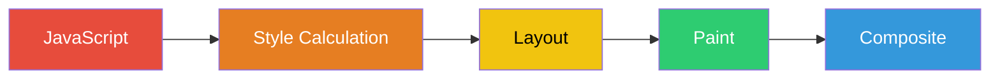
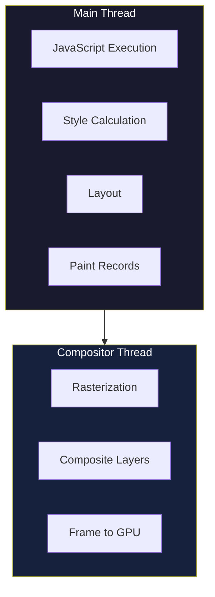
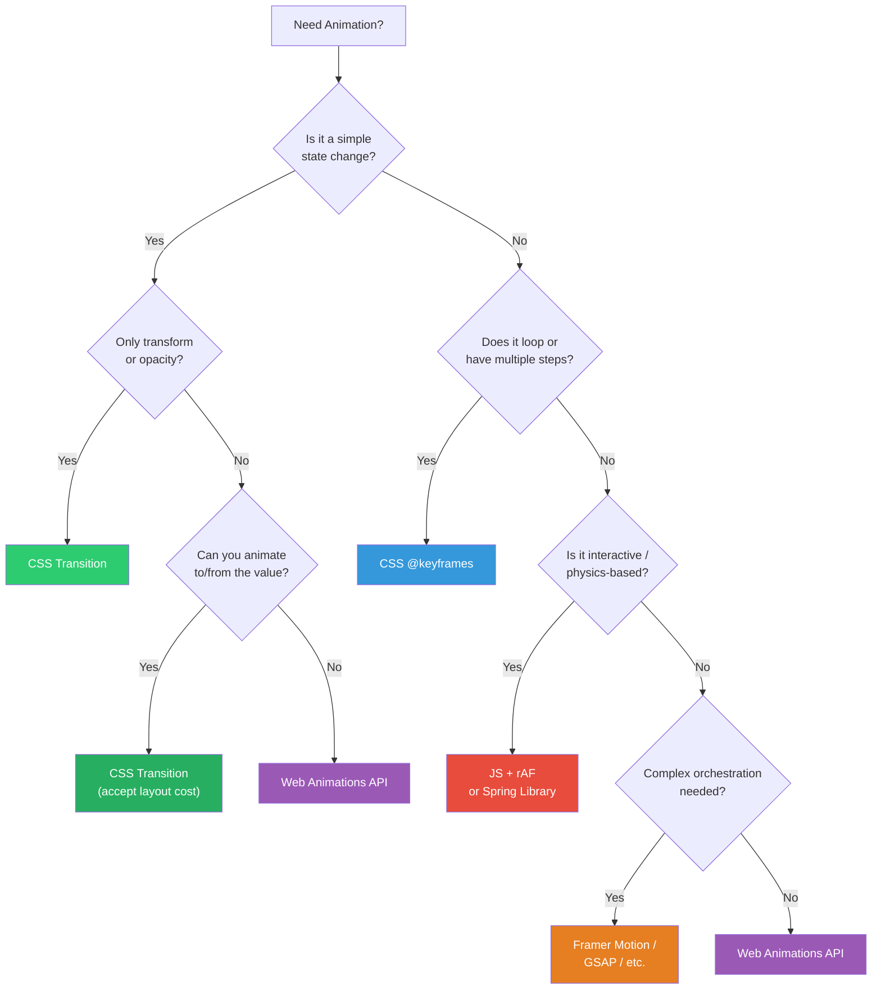
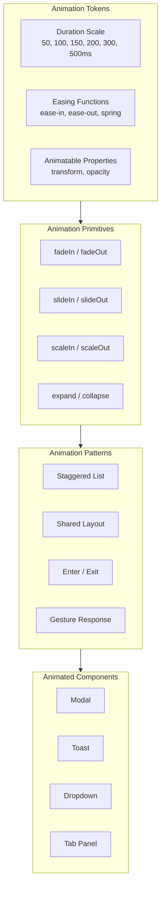

# Web Animations Overview

## Why Animation Exists in UI

Animation is not decoration. It is a communication channel between the interface and the user. When a modal appears instantly, the user must reconstruct what happened — where did this come from? When it slides in from a button, the user understands spatial relationships without thinking. Animation answers questions the user did not consciously ask: where am I, what just changed, what should I look at, is the system responding?

The history of web animation is a story of constraint. Early web pages had no animation at all — transitions were full page reloads. Flash brought rich animation but at the cost of accessibility, SEO, and mobile performance. jQuery's `.animate()` moved things on the main thread, causing jank. CSS transitions (2009) and the Web Animations API (2014) shifted animation toward the browser's compositor, enabling smooth 60fps motion without blocking JavaScript execution.

Today we have four primary animation systems on the web: CSS transitions, CSS keyframe animations, the Web Animations API, and JavaScript-driven animation (requestAnimationFrame). Each has different performance characteristics, capabilities, and appropriate use cases. Understanding when to reach for each is the core skill of web animation engineering.

## First Principles: The Rendering Pipeline

Every animation frame must pass through the browser's rendering pipeline. Understanding this pipeline is non-negotiable for performant animation.



### The Five Pipeline Stages

1. **JavaScript**: Execute callbacks, rAF handlers, event listeners
2. **Style Calculation**: Match selectors, compute final styles
3. **Layout**: Calculate geometry — position, size, and relationship to other elements
4. **Paint**: Fill pixels — colors, images, text, borders, shadows
5. **Composite**: Combine painted layers in the correct order

The key insight: **you can skip stages**. If you only change `opacity` or `transform`, the browser skips Layout and Paint entirely, going straight from Style to Composite. This is why `transform` and `opacity` are the only truly cheap properties to animate.

### The 60fps Budget

Displays typically refresh at 60Hz (some at 90Hz, 120Hz, or 144Hz). At 60fps, each frame has exactly:

$$
t_{\text{frame}} = \frac{1000\text{ms}}{60} \approx 16.67\text{ms}
$$

But the browser has housekeeping to do. In practice, you have roughly **10ms** to do your work per frame. Exceed that, and the browser drops a frame — the user perceives this as "jank."

At 120Hz displays (increasingly common on mobile and high-end monitors):

$$
t_{\text{frame}} = \frac{1000\text{ms}}{120} \approx 8.33\text{ms}
$$

The budget gets even tighter.

### Main Thread vs Compositor Thread



The compositor thread runs independently of the main thread. This means:
- Compositor animations (transform, opacity) run at 60fps even if JavaScript is busy
- Main-thread animations (width, height, top, left) will jank if JS blocks
- CSS transitions on compositor properties are "free" from a jank perspective

## Core Animation Types

### 1. CSS Transitions

The simplest animation primitive. You define a start state and end state; the browser interpolates between them.

```css
.button {
  background-color: #3498db;
  transform: scale(1);
  transition: transform 200ms ease-out, background-color 150ms ease;
}

.button:hover {
  background-color: #2980b9;
  transform: scale(1.05);
}
```

**When to use**: State changes triggered by user interaction — hover, focus, active states, toggling visibility.

**Limitations**: Only two keyframes (start and end), cannot loop, cannot reverse mid-animation without JS.

### 2. CSS Keyframe Animations

Multi-step animations defined with `@keyframes`. Can loop, alternate direction, and have arbitrary intermediate states.

```css
@keyframes pulse {
  0% {
    transform: scale(1);
    opacity: 1;
  }
  50% {
    transform: scale(1.1);
    opacity: 0.8;
  }
  100% {
    transform: scale(1);
    opacity: 1;
  }
}

.notification-dot {
  animation: pulse 2s ease-in-out infinite;
}
```

**When to use**: Looping animations, loading indicators, attention-drawing effects, animations that run without user interaction.

### 3. Spring Animations

Physics-based animations that feel natural because they model real-world motion. Instead of a fixed duration, springs have stiffness, damping, and mass.

```typescript
interface SpringConfig {
  stiffness: number;   // Force pulling toward target (N/m)
  damping: number;     // Resistance force (Ns/m)
  mass: number;        // Mass of object (kg)
  initialVelocity?: number;
}

function springAnimation(config: SpringConfig): (t: number) => number {
  const { stiffness: k, damping: c, mass: m } = config;
  const omega0 = Math.sqrt(k / m);           // Natural frequency
  const zeta = c / (2 * Math.sqrt(k * m));   // Damping ratio

  if (zeta < 1) {
    // Underdamped — oscillates
    const omegaD = omega0 * Math.sqrt(1 - zeta * zeta);
    return (t: number) => {
      return 1 - Math.exp(-zeta * omega0 * t) * (
        Math.cos(omegaD * t) + (zeta * omega0 / omegaD) * Math.sin(omegaD * t)
      );
    };
  } else if (zeta === 1) {
    // Critically damped — fastest without oscillation
    return (t: number) => {
      return 1 - (1 + omega0 * t) * Math.exp(-omega0 * t);
    };
  } else {
    // Overdamped — slow return
    const s1 = -omega0 * (zeta + Math.sqrt(zeta * zeta - 1));
    const s2 = -omega0 * (zeta - Math.sqrt(zeta * zeta - 1));
    return (t: number) => {
      return 1 - (s2 * Math.exp(s1 * t) - s1 * Math.exp(s2 * t)) / (s2 - s1);
    };
  }
}
```

**When to use**: Interactive animations (drag-and-drop, pull-to-refresh), any animation that needs to feel physical and responsive.

### 4. Physics Simulations

Full physics engines for complex interactions — inertial scrolling, particle effects, collision detection.

```typescript
interface PhysicsState {
  position: number;
  velocity: number;
}

function simulateInertia(
  state: PhysicsState,
  friction: number = 0.95,
  threshold: number = 0.1
): Generator<PhysicsState> {
  function* generate(): Generator<PhysicsState> {
    let { position, velocity } = state;
    while (Math.abs(velocity) > threshold) {
      velocity *= friction;
      position += velocity;
      yield { position, velocity };
    }
  }
  return generate();
}
```

**When to use**: Custom scrolling, drag interactions with momentum, games, data visualizations.

## The Animation Decision Framework



## CSS vs JavaScript Animation Comparison

| Aspect | CSS Transitions/Keyframes | JavaScript (rAF) | Web Animations API |
|--------|--------------------------|-------------------|-------------------|
| Compositor offload | Yes (transform/opacity) | No | Yes (transform/opacity) |
| Dynamic values | No | Yes | Yes |
| Interruptible | Partially | Yes | Yes |
| Physics-based | No | Yes | No (needs polyfill) |
| Orchestration | Limited | Full control | Good |
| Bundle size | 0 KB | Varies | 0 KB (native) |
| Debugging | DevTools animation panel | Console/breakpoints | DevTools |
| Accessibility | `prefers-reduced-motion` | Manual | Manual |

## Performance Characteristics by Property

### Compositor-Only (Cheapest)

These properties are handled entirely on the compositor thread:

| Property | Cost | Notes |
|----------|------|-------|
| `transform: translate()` | ~0.1ms | Position changes without layout |
| `transform: scale()` | ~0.1ms | Size changes without layout |
| `transform: rotate()` | ~0.1ms | Rotation without layout |
| `opacity` | ~0.1ms | Transparency changes |

### Paint-Only (Moderate)

These skip layout but require repainting:

| Property | Cost | Notes |
|----------|------|-------|
| `color` | ~0.5-1ms | Text color changes |
| `background-color` | ~0.5-1ms | Background repaints |
| `box-shadow` | ~1-3ms | Expensive to repaint, especially blur |
| `border-radius` | ~0.5-1ms | Requires repaint of element |

### Layout-Triggering (Expensive)

These trigger full layout recalculation:

| Property | Cost | Notes |
|----------|------|-------|
| `width` / `height` | ~2-10ms | Affects siblings and children |
| `top` / `left` / `right` / `bottom` | ~2-5ms | With position: absolute/relative |
| `margin` / `padding` | ~2-10ms | Affects document flow |
| `font-size` | ~5-15ms | Text reflow is expensive |
| `border-width` | ~2-5ms | Changes element dimensions |

::: danger Performance Trap
Never animate `width`, `height`, `margin`, `padding`, `top`, or `left` on elements in the document flow. Each frame triggers layout recalculation for the entire subtree, and potentially the entire page. Use `transform: translate()` and `transform: scale()` instead.
:::

## The Performance Budget

A well-designed animation system has a performance budget. Here is a practical framework:

```typescript
interface AnimationBudget {
  maxConcurrentAnimations: number;
  maxLayoutAnimations: number;
  targetFPS: number;
  frameBudgetMs: number;
  jsExecutionBudgetMs: number;
}

const PRODUCTION_BUDGET: AnimationBudget = {
  maxConcurrentAnimations: 8,     // Total simultaneous animations
  maxLayoutAnimations: 1,          // Layout-triggering animations
  targetFPS: 60,
  frameBudgetMs: 16.67,
  jsExecutionBudgetMs: 4,         // Leave time for style/layout/paint
};

class AnimationBudgetMonitor {
  private activeAnimations = new Set<string>();
  private layoutAnimations = new Set<string>();
  private frameTimings: number[] = [];

  canStart(id: string, triggersLayout: boolean): boolean {
    if (this.activeAnimations.size >= PRODUCTION_BUDGET.maxConcurrentAnimations) {
      console.warn(
        `Animation budget exceeded: ${this.activeAnimations.size} active animations`
      );
      return false;
    }

    if (triggersLayout &&
        this.layoutAnimations.size >= PRODUCTION_BUDGET.maxLayoutAnimations) {
      console.warn('Layout animation budget exceeded');
      return false;
    }

    return true;
  }

  register(id: string, triggersLayout: boolean): void {
    this.activeAnimations.add(id);
    if (triggersLayout) {
      this.layoutAnimations.add(id);
    }
  }

  unregister(id: string): void {
    this.activeAnimations.delete(id);
    this.layoutAnimations.delete(id);
  }

  measureFrame(callback: () => void): void {
    const start = performance.now();
    callback();
    const duration = performance.now() - start;

    this.frameTimings.push(duration);
    if (this.frameTimings.length > 60) {
      this.frameTimings.shift();
    }

    if (duration > PRODUCTION_BUDGET.jsExecutionBudgetMs) {
      console.warn(
        `Frame JS execution took ${duration.toFixed(2)}ms ` +
        `(budget: ${PRODUCTION_BUDGET.jsExecutionBudgetMs}ms)`
      );
    }
  }

  getAverageFPS(): number {
    if (this.frameTimings.length < 2) return 60;
    const avgFrameTime = this.frameTimings.reduce((a, b) => a + b, 0)
      / this.frameTimings.length;
    return Math.min(60, 1000 / avgFrameTime);
  }
}
```

## When to Animate: The Purposeful Animation Framework

Not every change needs animation. Gratuitous animation slows users down, increases cognitive load, and can cause motion sickness. Use animation when it serves one of these purposes:

### 1. Spatial Orientation

Help users understand where things are in the interface.

```typescript
// Good: Slide a panel in from the side it logically lives on
const slideIn = {
  from: { transform: 'translateX(-100%)' },
  to: { transform: 'translateX(0)' },
  duration: 250,
  easing: 'ease-out'
};

// Bad: Fade in a panel — gives no spatial information
const fadeIn = {
  from: { opacity: 0 },
  to: { opacity: 1 },
  duration: 250
};
```

### 2. State Feedback

Confirm that user input was received.

```typescript
// Button press feedback
function createPressAnimation(element: HTMLElement): Animation {
  return element.animate(
    [
      { transform: 'scale(1)' },
      { transform: 'scale(0.95)' },
      { transform: 'scale(1)' }
    ],
    { duration: 150, easing: 'ease-in-out' }
  );
}
```

### 3. Continuity

Show that an element is the same element, just in a new state.

```typescript
// Card expanding to detail view — FLIP animation
function flipAnimation(
  first: DOMRect,
  last: DOMRect,
  element: HTMLElement
): Animation {
  const deltaX = first.left - last.left;
  const deltaY = first.top - last.top;
  const deltaW = first.width / last.width;
  const deltaH = first.height / last.height;

  return element.animate(
    [
      {
        transform: `translate(${deltaX}px, ${deltaY}px) scale(${deltaW}, ${deltaH})`,
        transformOrigin: 'top left'
      },
      {
        transform: 'translate(0, 0) scale(1, 1)',
        transformOrigin: 'top left'
      }
    ],
    { duration: 300, easing: 'cubic-bezier(0.2, 0, 0, 1)' }
  );
}
```

### 4. Attention Direction

Guide the user's eye to something important.

```css
@keyframes attention-pulse {
  0%, 100% {
    box-shadow: 0 0 0 0 rgba(52, 152, 219, 0.4);
  }
  50% {
    box-shadow: 0 0 0 8px rgba(52, 152, 219, 0);
  }
}

.new-notification {
  animation: attention-pulse 2s ease-in-out 3; /* Only pulse 3 times */
}
```

### 5. Loading / Progress

Communicate that work is happening.

```css
@keyframes skeleton-shimmer {
  0% {
    transform: translateX(-100%);
  }
  100% {
    transform: translateX(100%);
  }
}

.skeleton {
  position: relative;
  overflow: hidden;
  background: #e0e0e0;
}

.skeleton::after {
  content: '';
  position: absolute;
  inset: 0;
  background: linear-gradient(
    90deg,
    transparent,
    rgba(255, 255, 255, 0.4),
    transparent
  );
  animation: skeleton-shimmer 1.5s ease-in-out infinite;
}
```

::: info War Story
At a fintech startup, the team added smooth 300ms transitions to every table row update in a real-time trading dashboard. The animations looked beautiful in demos with 10 rows updating every few seconds. In production, with 200 rows updating 5 times per second, the page became completely unresponsive. The animation queue grew faster than it could drain. The fix was to disable animations entirely when update frequency exceeded 2Hz per element and batch visual updates into 500ms windows. The lesson: animation performance is not about single-element cost — it is about aggregate cost across all concurrent animations.
:::

## The Web Animations API

The Web Animations API (WAAPI) bridges CSS and JavaScript animation. It provides programmatic control with compositor-thread performance for transform and opacity.

```typescript
// Basic WAAPI usage
function animateElement(element: HTMLElement): Animation {
  const animation = element.animate(
    [
      { transform: 'translateY(0)', opacity: 1 },
      { transform: 'translateY(-20px)', opacity: 0 }
    ],
    {
      duration: 300,
      easing: 'ease-out',
      fill: 'forwards'
    }
  );

  return animation; // Returns an Animation object with full control
}

// Advanced: controlling animations
async function orchestratedAnimation(elements: HTMLElement[]): Promise<void> {
  const animations = elements.map((el, i) => {
    const anim = el.animate(
      [
        { transform: 'translateY(20px)', opacity: 0 },
        { transform: 'translateY(0)', opacity: 1 }
      ],
      {
        duration: 400,
        delay: i * 50,        // Stagger by 50ms
        easing: 'cubic-bezier(0.2, 0, 0, 1)',
        fill: 'backwards'     // Apply first keyframe during delay
      }
    );
    return anim.finished;     // Returns a Promise
  });

  await Promise.all(animations);
}

// Pausing, reversing, and seeking
class AnimationController {
  private animation: Animation | null = null;

  start(element: HTMLElement): void {
    this.animation = element.animate(
      [
        { transform: 'rotate(0deg)' },
        { transform: 'rotate(360deg)' }
      ],
      { duration: 2000, iterations: Infinity }
    );
  }

  pause(): void {
    this.animation?.pause();
  }

  resume(): void {
    this.animation?.play();
  }

  reverse(): void {
    this.animation?.reverse();
  }

  seekTo(progress: number): void {
    if (this.animation) {
      const duration = this.animation.effect?.getTiming().duration;
      if (typeof duration === 'number') {
        this.animation.currentTime = duration * progress;
      }
    }
  }

  getProgress(): number {
    if (!this.animation?.effect) return 0;
    const timing = this.animation.effect.getComputedTiming();
    return (timing.progress ?? 0) as number;
  }
}
```

## Accessibility: prefers-reduced-motion

Some users experience motion sickness, vestibular disorders, or seizure conditions. The `prefers-reduced-motion` media query is not optional — it is a requirement.

```css
/* Default: full animations */
.element {
  transition: transform 300ms ease-out, opacity 200ms ease;
}

/* Reduced motion: instant or very short transitions */
@media (prefers-reduced-motion: reduce) {
  .element {
    transition: opacity 100ms ease;
    /* Remove transform animation entirely */
  }

  /* Disable all keyframe animations */
  *, *::before, *::after {
    animation-duration: 0.01ms !important;
    animation-iteration-count: 1 !important;
  }
}
```

```typescript
// TypeScript utility for checking motion preference
function prefersReducedMotion(): boolean {
  return window.matchMedia('(prefers-reduced-motion: reduce)').matches;
}

function getAnimationDuration(fullDuration: number): number {
  return prefersReducedMotion() ? 0 : fullDuration;
}

// React hook
function useReducedMotion(): boolean {
  const [reduced, setReduced] = React.useState(() =>
    window.matchMedia('(prefers-reduced-motion: reduce)').matches
  );

  React.useEffect(() => {
    const mq = window.matchMedia('(prefers-reduced-motion: reduce)');
    const handler = (e: MediaQueryListEvent) => setReduced(e.matches);
    mq.addEventListener('change', handler);
    return () => mq.removeEventListener('change', handler);
  }, []);

  return reduced;
}
```

::: warning
Never assume `prefers-reduced-motion` means "no animation." It means reduced motion. Opacity fades are usually fine. Subtle color transitions are fine. Large movements, parallax, and scaling are what cause problems. Provide alternatives, not absence.
:::

## Debugging Animation Performance

### Chrome DevTools Performance Panel

1. Open DevTools > Performance tab
2. Click Record, interact with the page, stop recording
3. Look for:
   - **Long frames** (red bars above the frame timeline)
   - **Layout thrashing** (purple blocks in the main thread)
   - **Paint events** (green blocks — should be rare during animation)
   - **Compositor work** (should be the dominant activity during smooth animation)

### Rendering Tab Overlays

Enable via DevTools > More Tools > Rendering:

- **Paint flashing**: Green overlay on areas being repainted — animated elements should NOT flash green if they are compositor-only
- **Layout shift regions**: Blue overlay when layout shifts occur
- **Layer borders**: Orange borders show compositor layers — each animated element should ideally be its own layer
- **FPS meter**: Real-time FPS counter

### Performance Marks in Code

```typescript
function measureAnimationPerformance(name: string): {
  start: () => void;
  frame: () => void;
  end: () => void;
} {
  let frameCount = 0;
  let startTime = 0;

  return {
    start() {
      frameCount = 0;
      startTime = performance.now();
      performance.mark(`${name}-start`);
    },
    frame() {
      frameCount++;
      performance.mark(`${name}-frame-${frameCount}`);
    },
    end() {
      performance.mark(`${name}-end`);
      performance.measure(name, `${name}-start`, `${name}-end`);

      const totalTime = performance.now() - startTime;
      const avgFPS = (frameCount / totalTime) * 1000;

      console.log(`Animation "${name}":`);
      console.log(`  Frames: ${frameCount}`);
      console.log(`  Duration: ${totalTime.toFixed(1)}ms`);
      console.log(`  Avg FPS: ${avgFPS.toFixed(1)}`);
      console.log(`  Dropped frames: ~${Math.max(0, Math.round(totalTime / 16.67) - frameCount)}`);
    }
  };
}
```

## Production Animation Architecture

A production animation system needs structure beyond individual animations. Here is an architecture for a design system animation layer:



```typescript
// Animation token system
const DURATION = {
  instant: 0,
  fast: 100,
  normal: 200,
  slow: 300,
  deliberate: 500,
} as const;

const EASING = {
  standard: 'cubic-bezier(0.2, 0, 0, 1)',
  decelerate: 'cubic-bezier(0, 0, 0, 1)',
  accelerate: 'cubic-bezier(0.3, 0, 1, 1)',
  sharp: 'cubic-bezier(0.4, 0, 0.6, 1)',
  spring: 'cubic-bezier(0.175, 0.885, 0.32, 1.275)',
} as const;

type DurationKey = keyof typeof DURATION;
type EasingKey = keyof typeof EASING;

interface AnimationConfig {
  duration: DurationKey;
  easing: EasingKey;
  properties: string[];
}

// Compose transitions from tokens
function createTransition(config: AnimationConfig): string {
  const dur = DURATION[config.duration];
  const ease = EASING[config.easing];

  if (prefersReducedMotion()) {
    return config.properties
      .filter(p => p === 'opacity')
      .map(p => `${p} ${Math.min(dur, 100)}ms ${ease}`)
      .join(', ') || 'none';
  }

  return config.properties
    .map(p => `${p} ${dur}ms ${ease}`)
    .join(', ');
}

// Usage
const modalTransition = createTransition({
  duration: 'normal',
  easing: 'decelerate',
  properties: ['transform', 'opacity']
});
// Result: "transform 200ms cubic-bezier(0, 0, 0, 1), opacity 200ms cubic-bezier(0, 0, 0, 1)"
```

## Advanced: requestAnimationFrame Loop Architecture

For JavaScript-driven animations, the rAF loop is your foundation:

```typescript
type AnimationCallback = (
  progress: number,
  elapsed: number,
  deltaTime: number
) => boolean | void; // Return false to stop

class AnimationLoop {
  private animations = new Map<string, {
    callback: AnimationCallback;
    startTime: number;
    duration: number;
    lastFrameTime: number;
  }>();
  private rafId: number | null = null;
  private isRunning = false;

  add(
    id: string,
    callback: AnimationCallback,
    duration: number = Infinity
  ): void {
    const now = performance.now();
    this.animations.set(id, {
      callback,
      startTime: now,
      duration,
      lastFrameTime: now,
    });

    if (!this.isRunning) {
      this.start();
    }
  }

  remove(id: string): void {
    this.animations.delete(id);
    if (this.animations.size === 0) {
      this.stop();
    }
  }

  private start(): void {
    this.isRunning = true;
    this.tick(performance.now());
  }

  private stop(): void {
    if (this.rafId !== null) {
      cancelAnimationFrame(this.rafId);
      this.rafId = null;
    }
    this.isRunning = false;
  }

  private tick = (timestamp: number): void => {
    const toRemove: string[] = [];

    for (const [id, anim] of this.animations) {
      const elapsed = timestamp - anim.startTime;
      const deltaTime = timestamp - anim.lastFrameTime;
      const progress = Math.min(elapsed / anim.duration, 1);

      anim.lastFrameTime = timestamp;

      const shouldContinue = anim.callback(progress, elapsed, deltaTime);

      if (shouldContinue === false || progress >= 1) {
        toRemove.push(id);
      }
    }

    for (const id of toRemove) {
      this.animations.delete(id);
    }

    if (this.animations.size > 0) {
      this.rafId = requestAnimationFrame(this.tick);
    } else {
      this.isRunning = false;
    }
  };
}

// Usage
const loop = new AnimationLoop();

loop.add('moveBox', (progress) => {
  const eased = easeOutCubic(progress);
  box.style.transform = `translateX(${eased * 300}px)`;
}, 400);

function easeOutCubic(t: number): number {
  return 1 - Math.pow(1 - t, 3);
}
```

## Summary Comparison Table

| Animation System | Compositor? | Interruptible? | Physics? | Bundle Size | Best For |
|-----------------|-------------|----------------|----------|-------------|----------|
| CSS Transitions | Yes | Partial | No | 0 KB | Simple state changes |
| CSS @keyframes | Yes | No | No | 0 KB | Looping, loading states |
| Web Animations API | Yes | Yes | No | 0 KB | Programmatic control |
| requestAnimationFrame | No | Yes | Yes | ~0 KB | Custom physics, games |
| Framer Motion | Yes | Yes | Yes | ~30 KB | React component animation |
| GSAP | Partial | Yes | No | ~25 KB | Complex timelines |
| React Spring | Partial | Yes | Yes | ~18 KB | Physics-based React |

::: tip Key Takeaway
Start with CSS transitions. They are free (0 KB), compositor-accelerated, and handle 80% of UI animation needs. Reach for JavaScript only when you need physics, complex orchestration, or dynamic values. Every animation library you add is a cost — make sure it earns its keep.
:::
