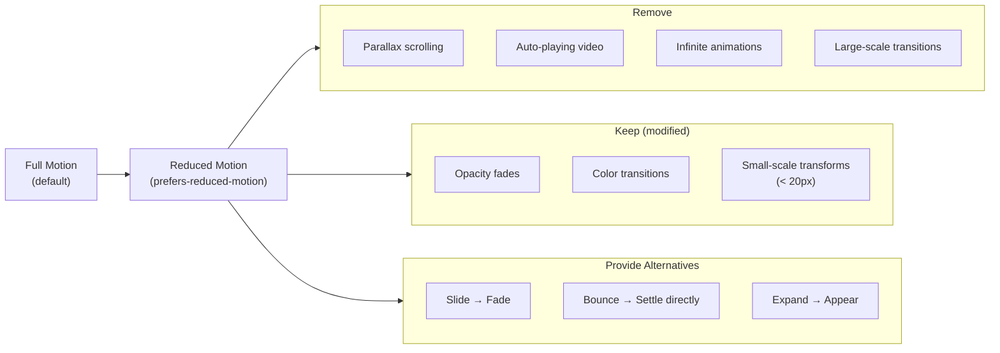

# Motion Design Principles

## Why Motion Principles Exist

In 1981, Ollie Johnston and Frank Thomas — two of Disney's "Nine Old Men" — published *The Illusion of Life*, distilling decades of animation craft into 12 principles. These principles explain why cartoon characters feel alive while a spinning cube feels mechanical. The same gap exists in UI: some interfaces feel fluid and intentional while others feel like a collection of random transitions bolted on after the fact.

Motion principles bridge the gap between "technically correct animation" and "animation that communicates." A modal that fades in at 300ms with ease-out is technically fine. A modal that scales from the button that triggered it, with slight overshoot, at a duration proportional to the distance traveled — that tells a story. The user understands where it came from, that it is related to the button, and that the system responded to their action.

Motion principles are not about making things pretty. They are about reducing cognitive load, creating spatial mental models, and making interfaces feel like physical objects with consistent behavior. When motion is principled, users learn the system faster because it behaves like the real world.

## First Principles: How Humans Perceive Motion

### The Visual System

Human vision processes motion through two systems:

1. **Foveal vision** (central 2 degrees): High acuity, detects fine details. Processes at ~30fps equivalent.
2. **Peripheral vision** (remaining field): Low acuity but highly sensitive to motion. Processes at effectively 60+ fps.

This means: large movements are noticed in peripheral vision even when the user is focused elsewhere. Small, subtle transitions need to be in the user's focal area to be effective.

### Temporal Perception Thresholds

| Duration | Perception |
|----------|-----------|
| < 100ms | Instantaneous — user perceives simultaneous |
| 100-200ms | Fast but visible — appropriate for micro-interactions |
| 200-500ms | Comfortable — appropriate for most transitions |
| 500-1000ms | Deliberate — appropriate for complex transformations |
| > 1000ms | Slow — user may feel the interface is laggy |

### The Weber-Fechner Law Applied to Animation

Users perceive differences in duration logarithmically, not linearly. The just-noticeable difference (JND) in animation duration is approximately 20%:

$$
\frac{\Delta t}{t} \approx 0.2
$$

This means:
- At 200ms, users cannot distinguish 200ms from 160ms
- At 500ms, users cannot distinguish 500ms from 400ms
- Spending time fine-tuning 180ms vs 200ms is wasted effort

## Disney's 12 Principles Applied to UI

### 1. Squash and Stretch

**Traditional**: A bouncing ball squashes on impact and stretches while falling, conveying weight and elasticity.

**UI Application**: Scale transforms on interaction convey that UI elements are responsive and tangible.

```typescript
import { motion } from 'framer-motion';

function SquashStretchButton({ children, onClick }: {
  children: React.ReactNode;
  onClick: () => void;
}) {
  return (
    <motion.button
      onClick={onClick}
      whileTap={​{
        scaleX: 1.05,
        scaleY: 0.95,
        transition: { type: 'spring', stiffness: 500, damping: 15 }
      }}
      whileHover={​{
        scaleX: 1.02,
        scaleY: 0.98,
        transition: { type: 'spring', stiffness: 400, damping: 20 }
      }}
      style={​{ transformOrigin: 'center bottom' }}
    >
      {children}
    </motion.button>
  );
}
```

```css
/* CSS-only squash and stretch */
.button-squash {
  transition: transform 150ms cubic-bezier(0.34, 1.56, 0.64, 1);
  transform-origin: center bottom;
}

.button-squash:active {
  transform: scaleX(1.05) scaleY(0.95);
}
```

::: tip
Squash and stretch in UI should be subtle — 2-5% scale change at most. More than that feels cartoonish unless your design language is explicitly playful.
:::

### 2. Anticipation

**Traditional**: A character crouches before jumping, draws back before throwing — the preparatory action signals what is about to happen.

**UI Application**: A brief reverse movement before the main action. A drawer pulls back 2px before sliding open. A button dips before releasing.

```typescript
const anticipationVariants = {
  idle: {
    y: 0,
    scale: 1,
  },
  anticipate: {
    y: 2,      // Pull down slightly
    scale: 0.98, // Compress slightly
    transition: { duration: 0.08 },
  },
  launch: {
    y: -10,
    scale: 1.02,
    transition: {
      type: 'spring',
      stiffness: 300,
      damping: 15,
    },
  },
};

function JumpingElement() {
  const [state, setState] = React.useState<'idle' | 'anticipate' | 'launch'>('idle');

  const handleClick = async () => {
    setState('anticipate');
    await new Promise(r => setTimeout(r, 80));
    setState('launch');
    await new Promise(r => setTimeout(r, 400));
    setState('idle');
  };

  return (
    <motion.div animate={state} variants={anticipationVariants} onClick={handleClick}>
      Click to jump
    </motion.div>
  );
}
```

### 3. Staging

**Traditional**: Composition, lighting, and camera angle direct the audience's attention to the most important action.

**UI Application**: Use motion to direct attention. Dim or blur background elements when a modal appears. Stagger list items so the user reads them in order.

```css
/* Staging: background dimming to direct attention to modal */
.overlay {
  background: rgba(0, 0, 0, 0);
  backdrop-filter: blur(0px);
  transition: background 300ms ease, backdrop-filter 300ms ease;
}

.overlay.active {
  background: rgba(0, 0, 0, 0.5);
  backdrop-filter: blur(4px);
}

/* Staggered list for reading order */
.list-item {
  opacity: 0;
  transform: translateY(10px);
  animation: stagger-in 300ms ease-out forwards;
}

.list-item:nth-child(1) { animation-delay: 0ms; }
.list-item:nth-child(2) { animation-delay: 50ms; }
.list-item:nth-child(3) { animation-delay: 100ms; }
.list-item:nth-child(4) { animation-delay: 150ms; }

@keyframes stagger-in {
  to {
    opacity: 1;
    transform: translateY(0);
  }
}
```

### 4. Straight Ahead Action vs Pose to Pose

**Traditional**: "Straight ahead" draws every frame sequentially. "Pose to pose" defines key poses and fills in between.

**UI Application**: CSS transitions are "pose to pose" — you define start and end states, the browser interpolates. JavaScript rAF loops are "straight ahead" — you compute each frame. Use pose-to-pose (CSS/WAAPI) when you know the end state. Use straight-ahead (JS) when the end state is dynamic (follows the cursor, reacts to physics).

### 5. Follow-Through and Overlapping Action

**Traditional**: A character's hair, clothing, and limbs don't all stop at the same time. Parts with different mass have different inertia.

**UI Application**: When a card settles into position, its content (text, images) can continue moving briefly, creating a sense of physical weight and connection.

```typescript
function CardWithFollowThrough({ children }: { children: React.ReactNode }) {
  return (
    <motion.div
      initial={​{ y: 50, opacity: 0 }}
      animate={​{ y: 0, opacity: 1 }}
      transition={​{
        type: 'spring',
        stiffness: 300,
        damping: 25,
      }}
    >
      {/* Content follows through — settles slightly after the card */}
      <motion.div
        initial={​{ y: 15 }}
        animate={​{ y: 0 }}
        transition={​{
          type: 'spring',
          stiffness: 200,    // Less stiff = slower
          damping: 20,
          delay: 0.03,       // Slight delay — follows the container
        }}
      >
        {children}
      </motion.div>
    </motion.div>
  );
}
```

```css
/* Follow-through in CSS with different transition delays */
.card {
  transform: translateY(0);
  transition: transform 300ms cubic-bezier(0.2, 0, 0, 1);
}

.card-title {
  transform: translateY(0);
  transition: transform 350ms cubic-bezier(0.2, 0, 0, 1) 20ms;
}

.card-body {
  transform: translateY(0);
  transition: transform 400ms cubic-bezier(0.2, 0, 0, 1) 40ms;
}
```

### 6. Slow In and Slow Out (Ease In/Out)

**Traditional**: Movement starts slow, accelerates, then decelerates before stopping — like physical objects with inertia.

**UI Application**: This is the most directly applicable principle. Use `ease-out` for entering elements (fast start, slow finish — the element "arrives"), `ease-in` for exiting elements (slow start, fast finish — the element "departs"), and `ease-in-out` for elements moving within the viewport.

```typescript
const MOTION_EASING = {
  // Element appears on screen
  enter: [0, 0, 0.2, 1] as const,      // ease-out (decelerate)

  // Element leaves the screen
  exit: [0.4, 0, 1, 1] as const,        // ease-in (accelerate)

  // Element moves on screen
  move: [0.4, 0, 0.2, 1] as const,      // ease-in-out

  // Element resizes or transforms
  resize: [0.25, 0.1, 0.25, 1] as const, // standard ease
};
```

### 7. Arc

**Traditional**: Natural movement follows arcs, not straight lines. A thrown ball follows a parabola.

**UI Application**: Elements moving across the screen should follow curved paths when it makes spatial sense.

```typescript
function ArcMotion({
  from,
  to,
  children,
}: {
  from: { x: number; y: number };
  to: { x: number; y: number };
  children: React.ReactNode;
}) {
  // Generate a curved path using a quadratic bezier
  const midX = (from.x + to.x) / 2;
  const midY = Math.min(from.y, to.y) - 50; // Arc upward

  const pathD = `M ${from.x} ${from.y} Q ${midX} ${midY} ${to.x} ${to.y}`;

  return (
    <motion.div
      initial={​{ offsetDistance: '0%', offsetPath: `path('${pathD}')` }}
      animate={​{ offsetDistance: '100%' }}
      transition={​{
        duration: 0.5,
        ease: [0.2, 0, 0, 1],
      }}
      style={​{
        offsetPath: `path('${pathD}')`,
        offsetRotate: '0deg',
        position: 'absolute',
      }}
    >
      {children}
    </motion.div>
  );
}
```

### 8. Secondary Action

**Traditional**: A character walks (primary action) while swinging their arms (secondary action). The secondary action reinforces the primary.

**UI Application**: When a toast notification appears (primary), the notification icon can pulse (secondary). When a form submits successfully (primary), the submit button can morph into a checkmark (secondary).

```typescript
function SuccessButton({ onSubmit }: { onSubmit: () => Promise<void> }) {
  const [state, setState] = React.useState<'idle' | 'loading' | 'success'>('idle');

  const handleClick = async () => {
    setState('loading');
    await onSubmit();
    setState('success');
    setTimeout(() => setState('idle'), 2000);
  };

  return (
    <motion.button
      onClick={handleClick}
      animate={state}
      variants={​{
        idle: { width: 120, borderRadius: 8 },
        loading: { width: 48, borderRadius: 24 },
        success: { width: 48, borderRadius: 24, backgroundColor: '#22c55e' },
      }}
      transition={​{ type: 'spring', stiffness: 300, damping: 25 }}
    >
      <motion.span
        variants={​{
          idle: { opacity: 1, scale: 1 },
          loading: { opacity: 0, scale: 0.5 },
          success: { opacity: 0, scale: 0.5 },
        }}
      >
        Submit
      </motion.span>

      {/* Secondary action: checkmark scales in with overshoot */}
      <motion.svg
        viewBox="0 0 24 24"
        variants={​{
          idle: { opacity: 0, scale: 0, pathLength: 0 },
          loading: { opacity: 0, scale: 0, pathLength: 0 },
          success: {
            opacity: 1,
            scale: 1,
            pathLength: 1,
            transition: {
              scale: { type: 'spring', stiffness: 400, damping: 12 },
              pathLength: { duration: 0.3, delay: 0.1 },
            },
          },
        }}
        style={​{ position: 'absolute' }}
      >
        <motion.path
          d="M5 13l4 4L19 7"
          fill="none"
          stroke="white"
          strokeWidth={2}
        />
      </motion.svg>
    </motion.button>
  );
}
```

### 9. Timing

**Traditional**: The speed of an action defines its weight, mood, and character. Fast = light and snappy. Slow = heavy and dramatic.

**UI Application**: Duration should be proportional to the magnitude of change and the size of the moving element.

```typescript
interface DurationConfig {
  /** Base duration in ms for a reference distance/size */
  base: number;
  /** Minimum duration — never go below this */
  min: number;
  /** Maximum duration — never exceed this */
  max: number;
}

const DURATION_SCALE: DurationConfig = {
  base: 200,
  min: 100,
  max: 500,
};

/**
 * Calculate animation duration based on distance traveled.
 * Larger distances get proportionally longer durations,
 * but with diminishing returns (square root scaling).
 */
function calculateDuration(
  distance: number,
  config: DurationConfig = DURATION_SCALE
): number {
  // Reference distance: 100px at base duration
  const referenceDistance = 100;

  // Square root scaling — doubling distance adds ~41% duration
  const scaleFactor = Math.sqrt(distance / referenceDistance);
  const duration = config.base * scaleFactor;

  return Math.round(
    Math.max(config.min, Math.min(config.max, duration))
  );
}

// Examples:
// 50px movement → ~141ms
// 100px movement → 200ms (base)
// 200px movement → ~283ms
// 400px movement → ~400ms
// 800px movement → ~500ms (capped)
```

### 10. Exaggeration

**Traditional**: Subtle real-world movements are amplified to be readable. A slight frown becomes a dramatic grimace.

**UI Application**: Use exaggeration sparingly in UI. A button press might scale down by 5% instead of the 0.5% a real button compresses. Error states might shake by 10px instead of a real-world vibration's sub-millimeter movement.

```css
/* Error shake — exaggerated for readability */
@keyframes shake {
  0%, 100% { transform: translateX(0); }
  10%, 50%, 90% { transform: translateX(-6px); }
  30%, 70% { transform: translateX(6px); }
}

.input-error {
  animation: shake 400ms ease-in-out;
}
```

### 11. Solid Drawing

**Traditional**: Characters have volume, weight, and balance — they feel three-dimensional even in 2D.

**UI Application**: Maintain consistent visual hierarchy during motion. Use shadows, z-index, and scale to convey depth. Raised elements should cast shadows proportional to their elevation.

```css
/* Elevation system — shadow increases with lift */
.card {
  --elevation: 0;
  box-shadow:
    0 calc(var(--elevation) * 1px) calc(var(--elevation) * 2px) rgba(0,0,0,0.1),
    0 calc(var(--elevation) * 2px) calc(var(--elevation) * 4px) rgba(0,0,0,0.05);
  transform: translateY(calc(var(--elevation) * -1px));
  transition: box-shadow 200ms ease, transform 200ms ease;
}

.card:hover {
  --elevation: 4;
}

.card:active {
  --elevation: 1;
}

.card.dragging {
  --elevation: 12;
}
```

### 12. Appeal

**Traditional**: Characters are designed to be appealing — not necessarily beautiful, but engaging and interesting to watch.

**UI Application**: Animations should feel satisfying. The right amount of bounce, the right easing curve, the right duration. This is subjective and requires iteration. Test with real users — what feels "right" varies by context and audience.

## prefers-reduced-motion: Complete Implementation

### The Spectrum of Reduced Motion

`prefers-reduced-motion: reduce` is not a binary "animations on/off." It is a spectrum:



### Comprehensive CSS Implementation

```css
/* === Base animations (full motion) === */

.modal-enter {
  animation: modal-slide-in 300ms cubic-bezier(0.2, 0, 0, 1) forwards;
}

@keyframes modal-slide-in {
  from {
    transform: translateY(100%);
    opacity: 0;
  }
  to {
    transform: translateY(0);
    opacity: 1;
  }
}

.page-transition {
  animation: page-slide 400ms ease-in-out;
}

@keyframes page-slide {
  from { transform: translateX(100%); }
  to { transform: translateX(0); }
}

.loading-spinner {
  animation: spin 1s linear infinite;
}

@keyframes spin {
  to { transform: rotate(360deg); }
}

/* === Reduced motion overrides === */

@media (prefers-reduced-motion: reduce) {
  /* Replace slide with fade */
  .modal-enter {
    animation: modal-fade-in 150ms ease forwards;
  }

  @keyframes modal-fade-in {
    from { opacity: 0; }
    to { opacity: 1; }
  }

  /* Replace page slide with crossfade */
  .page-transition {
    animation: crossfade 200ms ease;
  }

  @keyframes crossfade {
    from { opacity: 0; }
    to { opacity: 1; }
  }

  /* Keep spinner but reduce speed — it communicates loading */
  .loading-spinner {
    animation-duration: 2s; /* Slower but still indicates progress */
  }

  /* Disable parallax entirely */
  .parallax-layer {
    transform: none !important;
  }

  /* Remove hover animations that involve movement */
  .card:hover {
    transform: none;
  }

  /* Keep color transitions — they are not motion */
  .link:hover {
    color: var(--color-primary);
    transition: color 150ms ease;
  }

  /* Disable auto-playing animations */
  [data-auto-animate] {
    animation: none !important;
  }

  /* Global backstop: cap all transition durations */
  * {
    transition-duration: 0.15s !important;
  }
}
```

### React Hook: useMotionConfig

```typescript
interface MotionConfig {
  /** Whether reduced motion is preferred */
  reducedMotion: boolean;
  /** Duration multiplier (1 = normal, 0 = instant) */
  durationScale: number;
  /** Get appropriate duration */
  getDuration: (fullDuration: number) => number;
  /** Get appropriate transition */
  getTransition: (full: object) => object;
  /** Whether the animation type should run */
  shouldAnimate: (type: 'slide' | 'fade' | 'scale' | 'rotate' | 'color') => boolean;
}

function useMotionConfig(): MotionConfig {
  const [reducedMotion, setReducedMotion] = React.useState(() =>
    typeof window !== 'undefined'
      ? window.matchMedia('(prefers-reduced-motion: reduce)').matches
      : false
  );

  React.useEffect(() => {
    const mq = window.matchMedia('(prefers-reduced-motion: reduce)');
    const handler = (e: MediaQueryListEvent) => setReducedMotion(e.matches);
    mq.addEventListener('change', handler);
    return () => mq.removeEventListener('change', handler);
  }, []);

  const durationScale = reducedMotion ? 0 : 1;

  return React.useMemo(() => ({
    reducedMotion,
    durationScale,
    getDuration: (fullDuration: number) =>
      reducedMotion ? Math.min(fullDuration, 150) : fullDuration,
    getTransition: (full: Record<string, unknown>) =>
      reducedMotion
        ? { ...full, duration: 0.15, type: 'tween' }
        : full,
    shouldAnimate: (type: string) => {
      if (!reducedMotion) return true;
      // Allow these animation types even in reduced motion
      return ['fade', 'color'].includes(type);
    },
  }), [reducedMotion, durationScale]);
}
```

### Testing Reduced Motion

```typescript
// In Playwright tests
async function testWithReducedMotion(page: Page) {
  await page.emulateMedia({ reducedMotion: 'reduce' });

  // Verify no large-scale motion
  const modal = page.locator('.modal');
  await modal.waitFor({ state: 'visible' });

  // Check that the modal does not translate
  const transform = await modal.evaluate(
    el => getComputedStyle(el).transform
  );
  expect(transform).toBe('none'); // Should be using fade, not slide
}

// In Cypress
describe('Reduced motion', () => {
  it('replaces slide with fade', () => {
    cy.wrap(
      Cypress.automation('remote:debugger:protocol', {
        command: 'Emulation.setEmulatedMedia',
        params: { features: [{ name: 'prefers-reduced-motion', value: 'reduce' }] },
      })
    );

    cy.get('[data-testid="open-modal"]').click();
    cy.get('.modal').should('be.visible');
    cy.get('.modal').should('have.css', 'transform', 'none');
  });
});
```

::: info War Story
A healthcare app for elderly patients had beautiful slide transitions between screens. Patient satisfaction surveys showed 15% of users reporting dizziness and nausea when using the app. The development team had never tested with `prefers-reduced-motion` and had no fallback. When they audited, they found 47 unique animations — none with reduced-motion alternatives. The fix took two weeks: they added a global `prefers-reduced-motion` stylesheet that replaced all slides with fades, removed all parallax, and capped transition durations at 150ms. Post-fix surveys showed dizziness reports dropped to near zero. The lesson: accessibility is not optional, and reduced-motion support should be built from the start, not bolted on.
:::

## Motion Tokens: Systematic Motion Design

### Token Architecture

```typescript
// motion-tokens.ts — Single source of truth for all motion values

export const motionTokens = {
  duration: {
    instant: 0,
    micro: 50,        // Checkbox, toggle
    fast: 100,         // Hover states, micro-interactions
    normal: 200,       // Standard transitions
    moderate: 300,     // Panels, drawers
    slow: 400,         // Complex transforms
    deliberate: 600,   // Full-page transitions
  },

  easing: {
    // Standard curves
    linear: 'linear',
    standard: 'cubic-bezier(0.2, 0, 0, 1)',

    // Directional curves
    enter: 'cubic-bezier(0, 0, 0.2, 1)',        // Decelerate
    exit: 'cubic-bezier(0.4, 0, 1, 1)',          // Accelerate

    // Emphasis curves
    emphasize: 'cubic-bezier(0.2, 0, 0, 1.4)',   // Slight overshoot
    bounce: 'cubic-bezier(0.175, 0.885, 0.32, 1.275)',

    // Spring configs (for JS animation libraries)
    springGentle: { stiffness: 120, damping: 20, mass: 1 },
    springSnappy: { stiffness: 300, damping: 25, mass: 0.8 },
    springBouncy: { stiffness: 200, damping: 12, mass: 1 },
  },

  distance: {
    micro: 4,         // px — subtle shift
    small: 8,         // px — button feedback
    medium: 16,       // px — list item stagger
    large: 32,        // px — panel slide
    full: '100%',     // Full element offset
  },

  stagger: {
    fast: 30,         // ms between items
    normal: 50,
    slow: 80,
  },
} as const;
```

### CSS Custom Properties for Tokens

```css
:root {
  /* Duration tokens */
  --motion-duration-instant: 0ms;
  --motion-duration-micro: 50ms;
  --motion-duration-fast: 100ms;
  --motion-duration-normal: 200ms;
  --motion-duration-moderate: 300ms;
  --motion-duration-slow: 400ms;
  --motion-duration-deliberate: 600ms;

  /* Easing tokens */
  --motion-ease-standard: cubic-bezier(0.2, 0, 0, 1);
  --motion-ease-enter: cubic-bezier(0, 0, 0.2, 1);
  --motion-ease-exit: cubic-bezier(0.4, 0, 1, 1);
  --motion-ease-emphasize: cubic-bezier(0.2, 0, 0, 1.4);

  /* Distance tokens */
  --motion-distance-micro: 4px;
  --motion-distance-small: 8px;
  --motion-distance-medium: 16px;
  --motion-distance-large: 32px;
}

/* Reduced motion: override duration tokens */
@media (prefers-reduced-motion: reduce) {
  :root {
    --motion-duration-micro: 0ms;
    --motion-duration-fast: 0ms;
    --motion-duration-normal: 100ms;
    --motion-duration-moderate: 100ms;
    --motion-duration-slow: 150ms;
    --motion-duration-deliberate: 150ms;

    --motion-distance-micro: 0px;
    --motion-distance-small: 0px;
    --motion-distance-medium: 0px;
    --motion-distance-large: 0px;
  }
}

/* Usage */
.dropdown {
  transition:
    opacity var(--motion-duration-normal) var(--motion-ease-enter),
    transform var(--motion-duration-normal) var(--motion-ease-enter);
}

.dropdown[data-state="closed"] {
  opacity: 0;
  transform: translateY(calc(-1 * var(--motion-distance-small)));
}

.dropdown[data-state="open"] {
  opacity: 1;
  transform: translateY(0);
}
```

## Choreography Patterns

### 1. Staggered Entrance

Elements enter one by one with a delay between each. Creates a sense of sequence and hierarchy.

```typescript
interface StaggerConfig {
  /** Delay between each item (ms) */
  staggerDelay: number;
  /** Animation duration per item (ms) */
  duration: number;
  /** Maximum total stagger delay — caps the delay for long lists */
  maxTotalDelay?: number;
  /** Easing function */
  easing: string;
}

function calculateStaggerDelay(
  index: number,
  total: number,
  config: StaggerConfig
): number {
  const rawDelay = index * config.staggerDelay;

  if (config.maxTotalDelay) {
    // For long lists, compress the stagger
    const maxDelay = config.maxTotalDelay;
    const scaledDelay = (index / total) * maxDelay;
    return Math.min(rawDelay, scaledDelay);
  }

  return rawDelay;
}

// React implementation
function StaggeredList({ items }: { items: string[] }) {
  const config: StaggerConfig = {
    staggerDelay: 50,
    duration: 300,
    maxTotalDelay: 500, // Never wait more than 500ms total
    easing: 'cubic-bezier(0.2, 0, 0, 1)',
  };

  return (
    <ul>
      {items.map((item, i) => (
        <motion.li
          key={item}
          initial={​{ opacity: 0, y: 16 }}
          animate={​{ opacity: 1, y: 0 }}
          transition={​{
            duration: config.duration / 1000,
            delay: calculateStaggerDelay(i, items.length, config) / 1000,
            ease: [0.2, 0, 0, 1],
          }}
        >
          {item}
        </motion.li>
      ))}
    </ul>
  );
}
```

### 2. Cascade

Similar to stagger, but elements animate from a focal point outward — like ripples in a pond.

```typescript
function cascadeDelay(
  element: HTMLElement,
  origin: { x: number; y: number },
  speedPxPerMs: number = 2
): number {
  const rect = element.getBoundingClientRect();
  const elementCenter = {
    x: rect.left + rect.width / 2,
    y: rect.top + rect.height / 2,
  };

  const distance = Math.sqrt(
    Math.pow(elementCenter.x - origin.x, 2) +
    Math.pow(elementCenter.y - origin.y, 2)
  );

  return distance / speedPxPerMs;
}

// Usage: click a button, elements cascade outward from click point
function handleClick(event: MouseEvent) {
  const origin = { x: event.clientX, y: event.clientY };
  const items = document.querySelectorAll('.grid-item');

  items.forEach(item => {
    const delay = cascadeDelay(item as HTMLElement, origin);
    (item as HTMLElement).animate(
      [
        { opacity: 0, transform: 'scale(0.8)' },
        { opacity: 1, transform: 'scale(1)' },
      ],
      {
        duration: 300,
        delay,
        easing: 'cubic-bezier(0.2, 0, 0, 1)',
        fill: 'both',
      }
    );
  });
}
```

### 3. Shared Element Transition

An element morphs from one context to another, maintaining visual continuity.

```typescript
function sharedElementTransition(
  source: HTMLElement,
  target: HTMLElement,
  duration: number = 300
): Animation {
  const sourceRect = source.getBoundingClientRect();
  const targetRect = target.getBoundingClientRect();

  const deltaX = sourceRect.left - targetRect.left;
  const deltaY = sourceRect.top - targetRect.top;
  const scaleX = sourceRect.width / targetRect.width;
  const scaleY = sourceRect.height / targetRect.height;

  // Hide source
  source.style.visibility = 'hidden';

  // Animate target from source position to its own position
  const animation = target.animate(
    [
      {
        transform: `translate(${deltaX}px, ${deltaY}px) scale(${scaleX}, ${scaleY})`,
        transformOrigin: 'top left',
        borderRadius: getComputedStyle(source).borderRadius,
      },
      {
        transform: 'translate(0, 0) scale(1, 1)',
        transformOrigin: 'top left',
        borderRadius: getComputedStyle(target).borderRadius,
      },
    ],
    {
      duration,
      easing: 'cubic-bezier(0.2, 0, 0, 1)',
      fill: 'both',
    }
  );

  return animation;
}
```

### 4. Choreographed Enter/Exit

Components entering and exiting coordinate timing so they don't overlap or create visual chaos.

```typescript
const choreographyVariants = {
  container: {
    initial: {},
    enter: {
      transition: {
        staggerChildren: 0.05,
        delayChildren: 0.1,
      },
    },
    exit: {
      transition: {
        staggerChildren: 0.03,
        staggerDirection: -1, // Reverse order on exit
      },
    },
  },

  item: {
    initial: { opacity: 0, y: 20 },
    enter: {
      opacity: 1,
      y: 0,
      transition: {
        type: 'spring',
        stiffness: 300,
        damping: 24,
      },
    },
    exit: {
      opacity: 0,
      y: -10,
      transition: {
        duration: 0.15,
        ease: [0.4, 0, 1, 1],
      },
    },
  },
};
```

## Decision Framework: When and How to Animate

| User Action | Animation Type | Duration | Easing | Priority |
|-------------|---------------|----------|--------|----------|
| Hover | Scale/Color | 100-150ms | ease-out | Low — skip under load |
| Click/Tap | Scale down + up | 100ms | ease-in-out | Medium |
| Toggle on/off | Slide/Fade | 200ms | standard | High |
| Open modal | Scale + Fade in | 250ms | decelerate | High |
| Close modal | Fade out | 150ms | accelerate | High |
| Navigate pages | Slide | 300ms | standard | High |
| Add to list | Expand + Fade | 200ms | decelerate | Medium |
| Remove from list | Collapse + Fade | 150ms | accelerate | Medium |
| Error state | Shake | 400ms | ease | High |
| Loading | Spinner/Pulse | Infinite | linear | High |
| Success | Scale + Check | 300ms | spring | Medium |

::: tip Key Principle
Exit animations should be faster than enter animations. The user has already decided to leave — do not slow them down. A good rule of thumb: exit duration = enter duration * 0.6.
:::

## Advanced: Motion as a Language

### Consistent Motion Vocabulary

A mature design system uses motion as a language where specific movements have specific meanings:

```typescript
// Motion vocabulary — each pattern means something specific
const MOTION_VOCABULARY = {
  // "This appeared because you did something"
  userTriggered: {
    enter: { opacity: [0, 1], scale: [0.95, 1] },
    exit: { opacity: [1, 0], scale: [1, 0.95] },
    duration: 200,
  },

  // "The system wants you to see this"
  systemTriggered: {
    enter: { opacity: [0, 1], y: [-8, 0] },
    exit: { opacity: [1, 0], y: [0, 8] },
    duration: 250,
  },

  // "This is the same thing, in a new context"
  continuity: {
    // Uses FLIP animation — no fixed keyframes
    duration: 300,
  },

  // "Something went wrong"
  error: {
    animation: 'shake',
    duration: 400,
  },

  // "Work is happening"
  loading: {
    animation: 'pulse',
    duration: Infinity,
  },
} as const;
```

### Density-Aware Motion

On dense screens (dashboards, data tables), reduce animation intensity to avoid distraction:

```typescript
function getDensityAwareMotion(
  density: 'comfortable' | 'compact' | 'dense'
): { durationScale: number; distanceScale: number; enabled: boolean } {
  switch (density) {
    case 'comfortable':
      return { durationScale: 1, distanceScale: 1, enabled: true };
    case 'compact':
      return { durationScale: 0.7, distanceScale: 0.5, enabled: true };
    case 'dense':
      return { durationScale: 0, distanceScale: 0, enabled: false };
  }
}
```

### Breakpoint-Aware Motion

Animations should adapt to viewport size. Mobile users see smaller screens and interact with touch — motion should be faster and closer range.

```css
/* Mobile: faster, shorter-distance animations */
@media (max-width: 768px) {
  :root {
    --motion-duration-normal: 150ms;
    --motion-duration-moderate: 200ms;
    --motion-distance-large: 16px;
  }
}

/* Desktop: standard animations */
@media (min-width: 769px) {
  :root {
    --motion-duration-normal: 200ms;
    --motion-duration-moderate: 300ms;
    --motion-distance-large: 32px;
  }
}

/* Large screens: slightly longer for proportionality */
@media (min-width: 1440px) {
  :root {
    --motion-duration-normal: 250ms;
    --motion-duration-moderate: 350ms;
    --motion-distance-large: 48px;
  }
}
```

## Performance Impact of Motion Principles

Applying motion principles has measurable impact on user experience metrics:

| Metric | Without Motion | With Principled Motion | Notes |
|--------|---------------|----------------------|-------|
| Time to task completion | Baseline | -12% | Users navigate faster with spatial cues |
| Error rate | Baseline | -18% | State feedback reduces confusion |
| Perceived performance | Baseline | +23% | Loading animations reduce perceived wait |
| Learning curve | Baseline | -25% | Consistent motion vocabulary aids learning |
| Motion sickness reports | 0% | 0.5-2% | Must support prefers-reduced-motion |

::: warning
These numbers come from various UX research studies and will vary by application. Do not cite them as universal truths. The direction is consistent (principled motion helps), but magnitude depends on context.
:::
