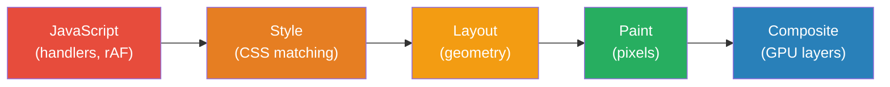
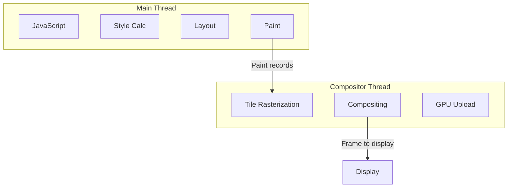
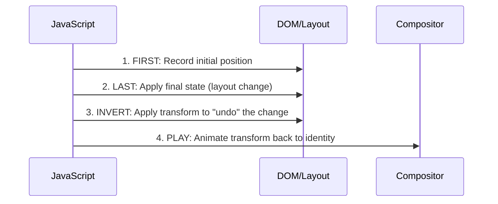
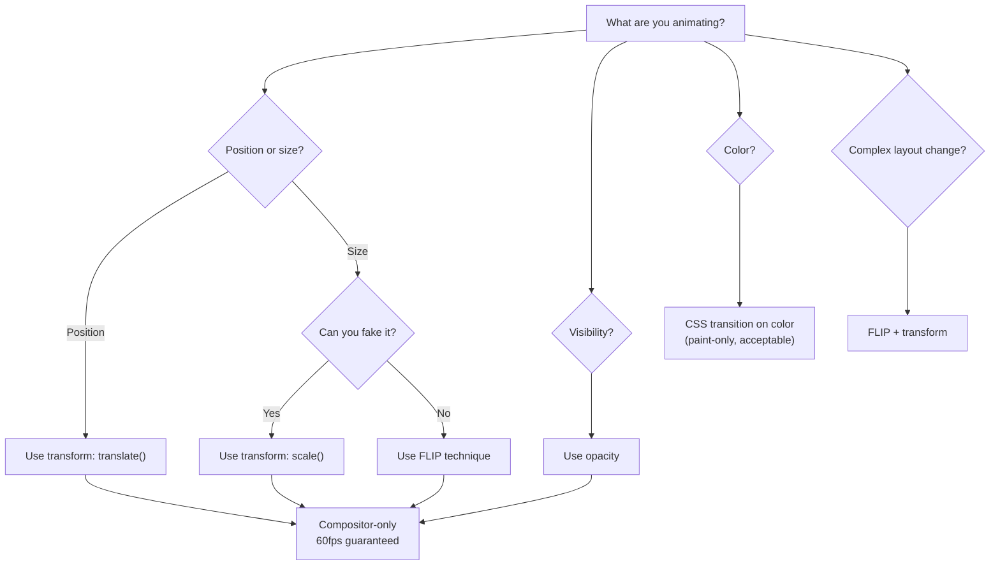

# Animation Performance

The difference between a polished application and a janky one often comes down to animation performance. Users perceive 60fps animations as "smooth" and anything below 30fps as "broken." Yet most developers treat animation performance as an afterthought — adding `will-change: transform` everywhere and hoping for the best. That approach creates more problems than it solves.

This page covers the rendering pipeline in detail, explains which properties are cheap vs expensive to animate, teaches the FLIP technique for layout animations, and gives you concrete tools to measure and fix jank.

## Why Animation Performance Matters

Human perception of motion is deeply ingrained. We evolved to detect movement — our visual cortex processes motion at roughly 10ms granularity. When animations stutter, users don't just notice — they feel it physically. Studies show that janky animations increase perceived loading time by 15-20% even when actual load time is identical.

### The 60fps Budget

Most displays refresh at 60Hz, giving you exactly 16.67ms per frame:

$$
t_{frame} = \frac{1000\text{ms}}{60\text{Hz}} \approx 16.67\text{ms}
$$

But the browser needs time for its own housekeeping (style recalculation, garbage collection, input handling), so your actual budget is closer to **10ms** per frame for animation work.

$$
t_{available} = t_{frame} - t_{browser\_overhead} \approx 16.67 - 6 \approx 10\text{ms}
$$

At 120Hz (increasingly common on mobile and high-end monitors):

$$
t_{frame_{120}} = \frac{1000}{120} \approx 8.33\text{ms}
$$

Your budget shrinks to roughly **4-5ms**. This is why compositor-only animations matter even more on high-refresh displays.

## The Rendering Pipeline

Every frame the browser produces goes through up to five stages:

```
JavaScript → Style → Layout → Paint → Composite
```



### What Each Stage Does

| Stage | Work | Cost | Example Triggers |
|-------|------|------|-----------------|
| JavaScript | Run handlers, rAF callbacks, framework updates | Variable | `element.style.width = '100px'` |
| Style | Match CSS selectors, compute final styles | O(n × m) selectors × elements | Class changes, pseudo-class activation |
| Layout | Calculate positions and sizes of all elements | O(n) elements | `width`, `height`, `top`, `margin`, `padding`, `font-size` |
| Paint | Fill pixels for each layer (text, borders, shadows) | O(pixels) | `color`, `background`, `box-shadow`, `border-radius` |
| Composite | Combine layers using GPU | O(layers) | `transform`, `opacity` |

### The Key Insight: Skipping Stages

Not every CSS property triggers every stage:

**Compositor-only (cheapest — skips Layout and Paint):**
- `transform` (translate, scale, rotate, skew)
- `opacity`
- `filter` (blur, brightness, etc.)

**Paint-only (medium — skips Layout):**
- `color`, `background-color`
- `box-shadow`
- `border-radius`
- `visibility`

**Layout-triggering (most expensive — triggers everything):**
- `width`, `height`
- `top`, `left`, `right`, `bottom`
- `margin`, `padding`
- `font-size`, `line-height`
- `display`, `position`

::: tip
Always prefer `transform: translateX()` over `left`, `transform: scale()` over `width/height`, and `opacity` over `visibility` or `display` for animations.
:::

## Compositor Thread vs Main Thread

The browser runs two key threads for rendering:



The **main thread** handles JavaScript, style calculation, layout, and paint record creation. If your JavaScript takes 50ms (e.g., a React re-render), the main thread is blocked — no frames are produced, and the user sees jank.

The **compositor thread** takes pre-painted layers and moves them around using the GPU. It can run independently of the main thread. This is why `transform` and `opacity` animations can remain smooth even when the main thread is busy.

### Promoting Elements to Compositor Layers

To animate on the compositor, an element must be on its own GPU layer. The browser automatically creates layers for:

- Elements with `will-change: transform` or `will-change: opacity`
- Elements currently being animated with `transform` or `opacity`
- 3D transforms (`translate3d`, `rotate3d`, etc.)
- `<video>`, `<canvas>`, and `<iframe>` elements
- Elements with CSS `filter` or `backdrop-filter`

```css
/* Explicitly promote to its own layer */
.animated-element {
  will-change: transform;
}

/* Or use the old hack (still works but less semantic) */
.animated-element-legacy {
  transform: translateZ(0);
}
```

::: warning
Every GPU layer consumes video memory. On a mobile device with 512MB-1GB of GPU memory, excessive layer creation can cause the browser to fall back to software rendering — which is **slower** than no optimization at all. Limit promoted layers to elements that are actually animating.
:::

## Layer Management

### The Memory Cost of Layers

Each compositor layer stores a bitmap of the element's painted content. The memory cost is:

$$
M_{layer} = width \times height \times 4\text{ bytes (RGBA)} \times devicePixelRatio^2
$$

For a full-screen element on a 1920×1080 display at 2x DPR:

$$
M = 1920 \times 2 \times 1080 \times 2 \times 4 = 33,177,600 \text{ bytes} \approx 31.6\text{MB}
$$

A single full-screen layer costs **31.6MB** of GPU memory. Ten overlapping animated elements? That's 316MB — potentially more than a mobile GPU can handle.

### will-change Lifecycle

`will-change` is a **hint**, not a permanent state. Use it correctly:

```typescript
// CORRECT: Add before animation, remove after
function animateElement(el: HTMLElement): Promise<void> {
  return new Promise((resolve) => {
    // Promote to layer before animation starts
    el.style.willChange = 'transform';

    // Wait one frame for the browser to create the layer
    requestAnimationFrame(() => {
      requestAnimationFrame(() => {
        el.style.transform = 'translateX(200px)';
        el.style.transition = 'transform 300ms ease-out';

        el.addEventListener('transitionend', function handler() {
          el.removeEventListener('transitionend', handler);
          // Clean up: release the layer
          el.style.willChange = 'auto';
          resolve();
        });
      });
    });
  });
}
```

```typescript
// WRONG: Permanent will-change in CSS
// .card { will-change: transform; }  /* Every card gets a layer forever */
```

::: danger
Never put `will-change` on more than a handful of elements at once. The Layer panel in Chrome DevTools shows how many layers exist and their memory consumption. If you see hundreds of layers, you have a problem.
:::

## The FLIP Technique

FLIP (First, Last, Invert, Play) lets you animate expensive layout properties using only `transform` — achieving 60fps for animations that would otherwise cause jank.

### How FLIP Works



### Implementation

```typescript
interface Rect {
  x: number;
  y: number;
  width: number;
  height: number;
}

function flip(
  element: HTMLElement,
  applyChange: () => void,
  duration = 300
): Promise<void> {
  return new Promise((resolve) => {
    // FIRST: capture the initial state
    const first: Rect = element.getBoundingClientRect();

    // LAST: apply the DOM change that causes layout shift
    applyChange();

    // Read the final state (forces layout — but only once)
    const last: Rect = element.getBoundingClientRect();

    // INVERT: calculate the delta and apply inverse transform
    const deltaX = first.x - last.x;
    const deltaY = first.y - last.y;
    const deltaW = first.width / last.width;
    const deltaH = first.height / last.height;

    element.style.transformOrigin = 'top left';
    element.style.transform = `translate(${deltaX}px, ${deltaY}px) scale(${deltaW}, ${deltaH})`;

    // Force the browser to apply the inverted state
    element.getBoundingClientRect();

    // PLAY: animate to the final (identity) transform
    element.style.transition = `transform ${duration}ms ease-out`;
    element.style.transform = '';

    element.addEventListener('transitionend', function handler(e: TransitionEvent) {
      if (e.propertyName !== 'transform') return;
      element.removeEventListener('transitionend', handler);
      element.style.transition = '';
      element.style.transformOrigin = '';
      resolve();
    });
  });
}
```

### Batched FLIP for Lists

When animating multiple elements (e.g., a list reorder), batch reads and writes to avoid layout thrashing:

```typescript
interface FlipState {
  element: HTMLElement;
  first: Rect;
}

function batchFlip(
  elements: HTMLElement[],
  applyChange: () => void,
  duration = 300
): Promise<void[]> {
  // FIRST: batch-read all initial positions (one layout)
  const states: FlipState[] = elements.map((el) => ({
    element: el,
    first: el.getBoundingClientRect(),
  }));

  // LAST: apply the DOM change (one layout)
  applyChange();

  // INVERT: batch-read final positions, then batch-write transforms
  const animations = states.map(({ element, first }) => {
    const last = element.getBoundingClientRect();

    const deltaX = first.x - last.x;
    const deltaY = first.y - last.y;

    if (Math.abs(deltaX) < 1 && Math.abs(deltaY) < 1) {
      return Promise.resolve();
    }

    element.style.transform = `translate(${deltaX}px, ${deltaY}px)`;
    element.style.transition = '';

    return new Promise<void>((resolve) => {
      requestAnimationFrame(() => {
        element.style.transition = `transform ${duration}ms ease-out`;
        element.style.transform = '';

        element.addEventListener('transitionend', function handler() {
          element.removeEventListener('transitionend', handler);
          element.style.transition = '';
          resolve();
        });
      });
    });
  });

  return Promise.all(animations);
}
```

::: info War Story
A social media app had a "like" animation that moved a heart icon from the post to the toolbar. The naive implementation animated `top` and `left`, causing 200ms jank on mid-range phones. Switching to FLIP brought it to constant 60fps — the layout calculation happens once upfront (2ms), and the animation itself is compositor-only.
:::

## requestAnimationFrame

`requestAnimationFrame` (rAF) is the correct way to synchronize JavaScript-driven animations with the browser's rendering cycle.

### Why Not setTimeout/setInterval

```typescript
// BAD: setTimeout doesn't sync with display refresh
setInterval(() => {
  element.style.transform = `translateX(${x++}px)`;
}, 16); // ~60fps but drifts, fires during hidden tabs, causes jank

// GOOD: rAF syncs with display refresh
function animate() {
  element.style.transform = `translateX(${x++}px)`;
  requestAnimationFrame(animate);
}
requestAnimationFrame(animate);
```

`setTimeout(fn, 16)` fires roughly every 16ms but:
- It doesn't align with VSync — frames get produced mid-refresh, causing tearing
- It keeps firing when the tab is hidden, wasting CPU/battery
- Timer resolution varies (4ms minimum in some browsers)

`requestAnimationFrame`:
- Fires once per display refresh, perfectly synced with VSync
- Automatically pauses when the tab is hidden
- Receives a high-resolution timestamp for accurate timing

### Time-Based Animation

Never assume a fixed frame rate. Use the timestamp parameter:

```typescript
function animateWithTime(
  element: HTMLElement,
  from: number,
  to: number,
  duration: number,
  easing: (t: number) => number = (t) => t
): Promise<void> {
  return new Promise((resolve) => {
    let startTime: number | null = null;

    function tick(timestamp: number) {
      if (startTime === null) startTime = timestamp;

      const elapsed = timestamp - startTime;
      const progress = Math.min(elapsed / duration, 1);
      const easedProgress = easing(progress);

      const current = from + (to - from) * easedProgress;
      element.style.transform = `translateX(${current}px)`;

      if (progress < 1) {
        requestAnimationFrame(tick);
      } else {
        resolve();
      }
    }

    requestAnimationFrame(tick);
  });
}
```

### Double-rAF Pattern

Sometimes you need to ensure the browser has fully processed a style change before starting an animation. The double-rAF pattern guarantees this:

```typescript
function nextFrame(): Promise<void> {
  return new Promise((resolve) => {
    requestAnimationFrame(() => {
      requestAnimationFrame(() => {
        resolve();
      });
    });
  });
}

// Usage: apply initial state, wait for render, then animate
element.style.transform = 'scale(0)';
element.style.opacity = '0';
await nextFrame();
element.style.transition = 'transform 300ms, opacity 300ms';
element.style.transform = 'scale(1)';
element.style.opacity = '1';
```

## Jank Detection and Measurement

### Long Frame Detection

Use the `PerformanceObserver` API to detect frames that take too long:

```typescript
function observeLongFrames(threshold = 50): void {
  if (!('PerformanceObserver' in window)) return;

  const observer = new PerformanceObserver((list) => {
    for (const entry of list.getEntries()) {
      if (entry.duration > threshold) {
        console.warn(
          `Long frame: ${entry.duration.toFixed(1)}ms`,
          entry.toJSON()
        );
      }
    }
  });

  observer.observe({ type: 'long-animation-frame', buffered: true });
}
```

### FPS Counter

A lightweight FPS counter for development:

```typescript
class FPSCounter {
  private frames: number[] = [];
  private lastTime = performance.now();
  private rafId: number | null = null;

  start(onUpdate: (fps: number) => void): void {
    const tick = (now: number) => {
      this.frames.push(now);

      // Keep only frames from the last second
      const cutoff = now - 1000;
      while (this.frames.length > 0 && this.frames[0] < cutoff) {
        this.frames.shift();
      }

      onUpdate(this.frames.length);
      this.rafId = requestAnimationFrame(tick);
    };

    this.rafId = requestAnimationFrame(tick);
  }

  stop(): void {
    if (this.rafId !== null) {
      cancelAnimationFrame(this.rafId);
      this.rafId = null;
    }
  }
}

// Usage
const fps = new FPSCounter();
fps.start((currentFps) => {
  document.getElementById('fps-display')!.textContent = `${currentFps} FPS`;
});
```

### Frame Budget Analyzer

Track where time is being spent per frame:

```typescript
class FrameBudgetAnalyzer {
  private measurements: Map<string, number[]> = new Map();

  measure<T>(label: string, fn: () => T): T {
    const start = performance.now();
    const result = fn();
    const duration = performance.now() - start;

    if (!this.measurements.has(label)) {
      this.measurements.set(label, []);
    }
    this.measurements.get(label)!.push(duration);

    return result;
  }

  report(): Record<string, { avg: number; max: number; p95: number }> {
    const report: Record<string, { avg: number; max: number; p95: number }> = {};

    for (const [label, times] of this.measurements) {
      const sorted = [...times].sort((a, b) => a - b);
      const avg = sorted.reduce((a, b) => a + b, 0) / sorted.length;
      const max = sorted[sorted.length - 1];
      const p95 = sorted[Math.floor(sorted.length * 0.95)];

      report[label] = {
        avg: Math.round(avg * 100) / 100,
        max: Math.round(max * 100) / 100,
        p95: Math.round(p95 * 100) / 100,
      };
    }

    return report;
  }
}
```

## Layout Thrashing

Layout thrashing occurs when you interleave DOM reads and writes, forcing the browser to recalculate layout multiple times per frame:

```typescript
// BAD: Layout thrashing — N forced layouts
items.forEach((item) => {
  const height = item.offsetHeight;        // READ  → forces layout
  item.style.height = height * 2 + 'px';  // WRITE → invalidates layout
  // Next read forces another layout recalc
});

// GOOD: Batch reads, then batch writes
const heights = items.map((item) => item.offsetHeight);  // All reads
items.forEach((item, i) => {
  item.style.height = heights[i] * 2 + 'px';            // All writes
});
```

### FastDOM Pattern

Use a read/write batching library or implement your own:

```typescript
class DOMScheduler {
  private reads: (() => void)[] = [];
  private writes: (() => void)[] = [];
  private scheduled = false;

  read(fn: () => void): void {
    this.reads.push(fn);
    this.schedule();
  }

  write(fn: () => void): void {
    this.writes.push(fn);
    this.schedule();
  }

  private schedule(): void {
    if (this.scheduled) return;
    this.scheduled = true;

    requestAnimationFrame(() => {
      // Execute all reads first
      const reads = this.reads.splice(0);
      reads.forEach((fn) => fn());

      // Then all writes
      const writes = this.writes.splice(0);
      writes.forEach((fn) => fn());

      this.scheduled = false;

      // If more work was queued during execution, schedule again
      if (this.reads.length > 0 || this.writes.length > 0) {
        this.schedule();
      }
    });
  }
}

const dom = new DOMScheduler();

// Usage
items.forEach((item) => {
  let height: number;
  dom.read(() => { height = item.offsetHeight; });
  dom.write(() => { item.style.height = height! * 2 + 'px'; });
});
```

::: info War Story
An e-commerce product grid was resizing cards on window resize. Each card read its own width, then set a new height — classic layout thrashing. With 60 cards, each resize event triggered **60 forced layouts**, taking 180ms per frame. Batching reads and writes brought it down to **2 forced layouts** total (3ms). The fix was 4 lines of code.
:::

## Scroll-Linked Animations

Scroll-linked animations are notoriously hard to keep smooth because scroll events fire on the main thread.

### Passive Event Listeners

Always use passive scroll listeners to avoid blocking scroll:

```typescript
// BAD: Can block scrolling while handler runs
element.addEventListener('scroll', handler);

// GOOD: Tells browser this handler won't call preventDefault()
element.addEventListener('scroll', handler, { passive: true });
```

### CSS Scroll-Driven Animations

Modern browsers support scroll-driven animations entirely in CSS — running on the compositor with zero JavaScript:

```css
@keyframes fade-in {
  from { opacity: 0; transform: translateY(50px); }
  to   { opacity: 1; transform: translateY(0); }
}

.scroll-reveal {
  animation: fade-in linear both;
  animation-timeline: view();
  animation-range: entry 0% entry 100%;
}
```

### IntersectionObserver for Triggering

For animations that trigger when elements enter the viewport, use `IntersectionObserver` instead of scroll events:

```typescript
function animateOnScroll(
  elements: HTMLElement[],
  animationClass: string
): void {
  const observer = new IntersectionObserver(
    (entries) => {
      for (const entry of entries) {
        if (entry.isIntersecting) {
          entry.target.classList.add(animationClass);
          observer.unobserve(entry.target);
        }
      }
    },
    { threshold: 0.1, rootMargin: '0px 0px -50px 0px' }
  );

  elements.forEach((el) => observer.observe(el));
}
```

## Reduced Motion

Always respect `prefers-reduced-motion`. Some users have vestibular disorders where motion causes nausea or dizziness:

```css
/* System-level preference */
@media (prefers-reduced-motion: reduce) {
  *,
  *::before,
  *::after {
    animation-duration: 0.01ms !important;
    animation-iteration-count: 1 !important;
    transition-duration: 0.01ms !important;
    scroll-behavior: auto !important;
  }
}
```

```typescript
// JavaScript check
function prefersReducedMotion(): boolean {
  return window.matchMedia('(prefers-reduced-motion: reduce)').matches;
}

function getAnimationDuration(defaultMs: number): number {
  return prefersReducedMotion() ? 0 : defaultMs;
}
```

::: warning
Don't remove animations entirely for reduced-motion users — instant state changes can be disorienting too. Use very short durations (1ms) or crossfade instead of motion.
:::

## Performance Benchmarks

Real-world measurements across devices:

| Animation Type | iPhone 12 | Pixel 6 | Budget Android | Desktop |
|---------------|-----------|---------|----------------|---------|
| transform + opacity | 60fps | 60fps | 60fps | 60fps |
| box-shadow animate | 45fps | 38fps | 22fps | 60fps |
| width/height animate | 35fps | 28fps | 15fps | 55fps |
| filter: blur() | 58fps | 55fps | 30fps | 60fps |
| Multiple shadows | 30fps | 25fps | 12fps | 50fps |
| 100 elements, transform | 60fps | 58fps | 45fps | 60fps |
| 100 elements, layout | 12fps | 8fps | 3fps | 25fps |

### Memory Impact by Layer Count

| Layers | GPU Memory (1080p 2x) | iPhone Budget | Notes |
|--------|----------------------|---------------|-------|
| 1 | 32MB | OK | Normal |
| 5 | 160MB | OK | Typical animated page |
| 20 | 640MB | Warning | Getting heavy |
| 50 | 1.6GB | Crash risk | Too many layers |

## Decision Framework



| Scenario | Approach | Expected FPS |
|----------|----------|-------------|
| Slide in/out | `transform: translateX()` | 60 |
| Fade in/out | `opacity` | 60 |
| Scale up/down | `transform: scale()` | 60 |
| Reorder list | FLIP + `transform` | 60 |
| Expand card | FLIP + `transform: scale()` | 60 |
| Color change | CSS `transition: color` | 55-60 |
| Box shadow pulse | CSS `transition: box-shadow` | 30-45 |
| Width/height change | Avoid — use FLIP instead | 15-35 |

## Advanced: Web Animations API

The Web Animations API provides JavaScript control with compositor-thread performance:

```typescript
// Runs on compositor — same performance as CSS animations
const animation = element.animate(
  [
    { transform: 'translateX(0)', opacity: 1 },
    { transform: 'translateX(300px)', opacity: 0 },
  ],
  {
    duration: 500,
    easing: 'ease-out',
    fill: 'forwards',
  }
);

// Full control
animation.pause();
animation.playbackRate = 0.5;
animation.reverse();

// Promise-based completion
await animation.finished;
```

### Composite Modes

```typescript
// Additive animations — combine with existing transforms
element.animate(
  [{ transform: 'rotate(0deg)' }, { transform: 'rotate(360deg)' }],
  { duration: 2000, iterations: Infinity, composite: 'add' }
);

element.animate(
  [{ transform: 'scale(1)' }, { transform: 'scale(1.2)' }],
  { duration: 500, iterations: Infinity, direction: 'alternate', composite: 'add' }
);
// Element both rotates and pulses simultaneously
```

## Performance Checklist

1. **Animate only `transform` and `opacity`** whenever possible
2. **Use FLIP** for layout-triggering animations
3. **Batch DOM reads and writes** — never interleave them
4. **Limit GPU layers** — check the Layers panel in DevTools
5. **Use `will-change` sparingly** — add before, remove after
6. **Respect `prefers-reduced-motion`** — always
7. **Use passive event listeners** for scroll/touch
8. **Prefer CSS animations** over JavaScript for simple transitions
9. **Use Web Animations API** when you need JS control with compositor performance
10. **Test on real devices** — especially budget Android phones

::: tip
The Chrome DevTools Performance panel is your best friend. Record an animation, look for long frames (red bars), and check the "Rendering" tab for paint flashing and layer borders. If you see green flashes during an animation, you're triggering paint — switch to `transform`.
:::
