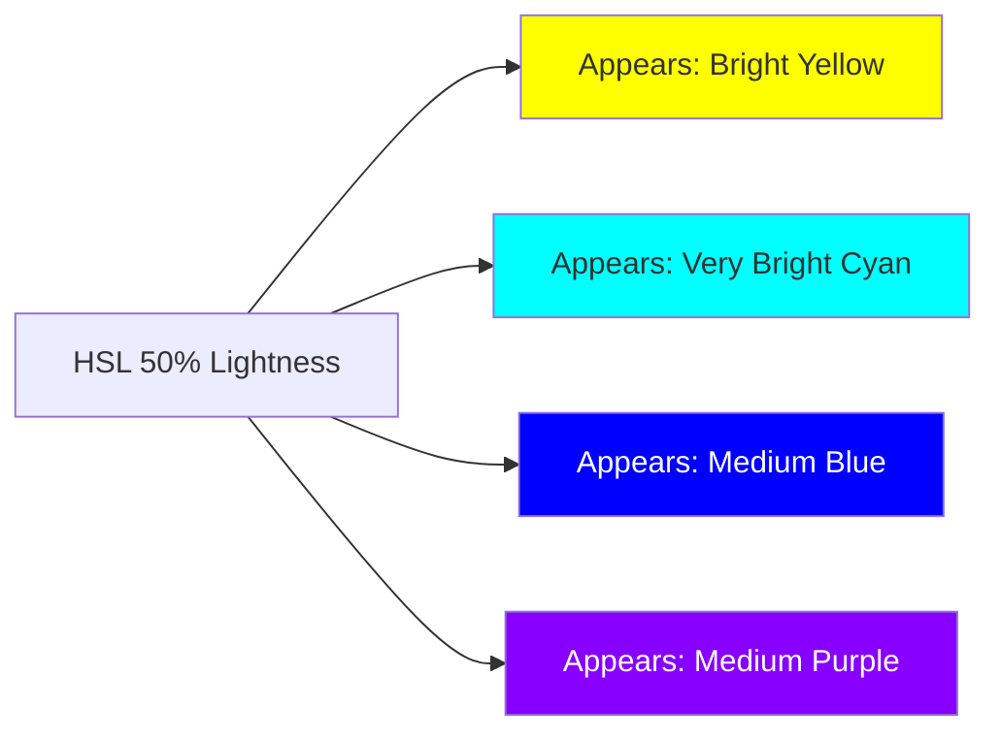

# Color Theory for Engineers

Color is physics, perception, and convention. Engineers working on design systems need more than "use a color picker" — they need to understand why colors look the way they do, why equal numeric values don't look equally different, and how to generate perceptually consistent palettes algorithmically.

## Light and the Human Eye

Color perception starts with physics. Visible light is electromagnetic radiation with wavelengths from ~380nm (violet) to ~700nm (red). The human eye has three types of cone cells:
- **L-cones** (long wavelength, peak ~560nm) — sensitive to red-orange
- **M-cones** (medium, peak ~530nm) — sensitive to green
- **S-cones** (short, peak ~420nm) — sensitive to blue-violet

A "color" is the brain's interpretation of the ratio of activation across these three cone types. This three-dimensional activation space is the foundation of all color models.

$$
\text{Color perception} = f(L_{\text{activation}}, M_{\text{activation}}, S_{\text{activation}})
$$

## RGB — The Display Model

Screens emit red, green, and blue light. Each pixel mixes these three primaries additively:

$$
\text{White} = R_{255} + G_{255} + B_{255}
$$
$$
\text{Yellow} = R_{255} + G_{255} + B_0
$$
$$
\text{Cyan} = R_0 + G_{255} + B_{255}
$$

RGB is **device-dependent** — the same RGB values produce different colors on different screens (due to different primaries). sRGB is a standardized RGB space with defined primaries, solving this.

```css
/* sRGB */
.red   { color: rgb(255 0 0); }
.green { color: rgb(0 255 0); }
.blue  { color: rgb(0 0 255); }

/* Modern space-separated syntax */
.red   { color: rgb(255 0 0 / 1); }    /* with alpha */
.blue  { color: rgb(0 0 255 / 0.5); }  /* 50% transparent */
```

### The Gamma Problem

RGB values are **gamma-encoded** — they don't correspond linearly to light intensity. In sRGB:

$$
C_{\text{linear}} = \begin{cases}
\frac{C_{\text{srgb}}}{12.92} & \text{if } C_{\text{srgb}} \leq 0.04045 \\
\left(\frac{C_{\text{srgb}} + 0.055}{1.055}\right)^{2.4} & \text{otherwise}
\end{cases}
$$

This means: **sRGB value 128 is NOT 50% as bright as sRGB value 255.** It's approximately 21.4% as bright. This non-linearity is why CSS gradients often look dark in the middle — they interpolate in gamma-encoded RGB.

```css
/* CSS gradients default to interpolation in sRGB (gamma-encoded) */
/* The midpoint looks darker than expected */
.dark-gradient {
  background: linear-gradient(to right, black, white);
}

/* Modern CSS allows explicit color space interpolation */
.correct-gradient {
  background: linear-gradient(in oklch to right, black, white);
}
```

## HSL — Human-Friendly RGB

HSL (Hue, Saturation, Lightness) repackages sRGB in terms more intuitive to humans:

- **Hue**: angle on the color wheel (0° = red, 120° = green, 240° = blue)
- **Saturation**: intensity/purity (0% = gray, 100% = vivid)
- **Lightness**: brightness (0% = black, 100% = white, 50% = pure color)

```css
.hsl-examples {
  color: hsl(220 80% 50%);    /* Blue at moderate brightness */
  color: hsl(220 80% 50% / 0.8); /* with 80% opacity */
}
```

### HSL's Fatal Flaw

HSL is not perceptually uniform. Compare:
- `hsl(60 100% 50%)` = yellow (L=50%)
- `hsl(240 100% 50%)` = blue (L=50%)

Both have the same L value, but yellow appears dramatically brighter than blue. The "lightness" in HSL is geometric, not perceptual.

This means: if you generate a color palette by varying HSL lightness, your "50% lightness" values will look inconsistently bright across hues. Yellow and orange at L=50% will appear washed out compared to blue and purple at L=50%.



## OKLCH — Perceptually Uniform Color

OKLCH is the current best-practice for design system color work. It's derived from the CIECAM02 color appearance model with a correction ("OK" stands for the author Björn Ottosson's initials, published 2020).

OKLCH channels:
- **L** (Lightness): 0–1, perceptually uniform
- **C** (Chroma): 0–0.37+, colorfulness
- **H** (Hue): 0–360°, hue angle

$$
\text{OKLCH}(L, C, H)
$$

The key property: equal changes in L produce equal changes in perceived brightness, **regardless of hue**. This is the property that makes algorithmic palette generation work.

```css
/* OKLCH examples */
.brand-500  { color: oklch(0.57 0.20 264); }  /* medium blue */
.brand-400  { color: oklch(0.65 0.18 264); }  /* lighter blue */
.brand-600  { color: oklch(0.50 0.22 264); }  /* darker blue */

/* Note: same hue (264°), same relative chroma, only L changes */
/* Result: a perceptually consistent shade scale */
```

### The OKLCH Gamut Warning

OKLCH can describe colors outside the sRGB gamut (out-of-gamut colors that most screens can't display). CSS handles this with gamut mapping, but you should be aware:

```css
/* This might be out of sRGB gamut on high-chroma values */
.vivid-red { color: oklch(0.57 0.37 29); } /* Very vivid — might gamut-map */

/* Safer — stays within sRGB */
.standard-red { color: oklch(0.57 0.20 29); }

/* Display P3 gamut — available on modern Apple displays, many Android */
@media (color-gamut: p3) {
  .vivid-red { color: oklch(0.57 0.35 29); } /* Higher chroma for P3 */
}
```

## Converting Between Color Spaces

```typescript
// color-conversion.ts

// sRGB to linear RGB (remove gamma encoding)
function srgbToLinear(c: number): number {
  const abs = Math.abs(c);
  if (abs <= 0.04045) return c / 12.92;
  return Math.sign(c) * Math.pow((abs + 0.055) / 1.055, 2.4);
}

// Linear RGB to XYZ D65
function linearRgbToXyz(r: number, g: number, b: number): [number, number, number] {
  const x = r * 0.4124564 + g * 0.3575761 + b * 0.1804375;
  const y = r * 0.2126729 + g * 0.7151522 + b * 0.0721750;
  const z = r * 0.0193339 + g * 0.1191920 + b * 0.9503041;
  return [x, y, z];
}

// XYZ to OKLab (Björn Ottosson's algorithm)
function xyzToOklab(x: number, y: number, z: number): [number, number, number] {
  // LMS transformation
  const l = 0.8189330101 * x + 0.3618667424 * y - 0.1288597137 * z;
  const m = 0.0329845436 * x + 0.9293118715 * y + 0.0361456387 * z;
  const s = 0.0482003018 * x + 0.2643662691 * y + 0.6338517070 * z;

  const l_ = Math.cbrt(l);
  const m_ = Math.cbrt(m);
  const s_ = Math.cbrt(s);

  return [
    0.2104542553 * l_ + 0.7936177850 * m_ - 0.0040720468 * s_,
    1.9779984951 * l_ - 2.4285922050 * m_ + 0.4505937099 * s_,
    0.0259040371 * l_ + 0.7827717662 * m_ - 0.8086757660 * s_,
  ];
}

// OKLab to OKLCH
function oklabToOklch(L: number, a: number, b: number): [number, number, number] {
  const C = Math.sqrt(a * a + b * b);
  const H = ((Math.atan2(b, a) * 180) / Math.PI + 360) % 360;
  return [L, C, H];
}

// Complete: hex to OKLCH
export function hexToOklch(hex: string): { L: number; C: number; H: number } {
  const r = parseInt(hex.slice(1, 3), 16) / 255;
  const g = parseInt(hex.slice(3, 5), 16) / 255;
  const b = parseInt(hex.slice(5, 7), 16) / 255;

  const lr = srgbToLinear(r);
  const lg = srgbToLinear(g);
  const lb = srgbToLinear(b);

  const [x, y, z] = linearRgbToXyz(lr, lg, lb);
  const [okL, okA, okB] = xyzToOklab(x, y, z);
  const [L, C, H] = oklabToOklch(okL, okA, okB);

  return { L, C, H };
}

// Verify: #3b82f6 (Tailwind blue-500)
const result = hexToOklch('#3b82f6');
// { L: 0.5706, C: 0.2022, H: 263.77 }
// OKLCH equivalent: oklch(0.5706 0.2022 263.77)
```

## Color Harmony

Harmony rules define which colors work well together based on their relationships on the color wheel:

```typescript
// color-harmony.ts

function complementary(hue: number): [number, number] {
  return [hue, (hue + 180) % 360];
}

function analogous(hue: number, angle = 30): [number, number, number] {
  return [
    (hue - angle + 360) % 360,
    hue,
    (hue + angle) % 360,
  ];
}

function triadic(hue: number): [number, number, number] {
  return [hue, (hue + 120) % 360, (hue + 240) % 360];
}

function splitComplementary(hue: number, angle = 30): [number, number, number] {
  const comp = (hue + 180) % 360;
  return [hue, (comp - angle + 360) % 360, (comp + angle) % 360];
}

function tetradic(hue: number): [number, number, number, number] {
  return [hue, (hue + 90) % 360, (hue + 180) % 360, (hue + 270) % 360];
}

// Generate a complete brand palette from a single hue
export function generateHarmoniousPalette(primaryHue: number) {
  const [, accentHue] = splitComplementary(primaryHue, 40);
  const [, neutralHue] = analogous(primaryHue, 15);

  return {
    primary: primaryHue,
    accent: accentHue,
    neutral: neutralHue,
    // Neutral is slightly warm/cool to complement primary
  };
}
```

### Color Harmony in Practice

| Harmony | Relationship | Use Case |
|---------|-------------|---------|
| Monochromatic | Same hue, varying L/C | Clean, minimal UIs |
| Analogous | Adjacent hues ±30° | Warm, cohesive palettes |
| Complementary | Opposite hues 180° | High contrast, accent colors |
| Split-complementary | Near-opposite ±30° | More versatile than complementary |
| Triadic | Three equidistant hues | Vibrant, balanced palettes |
| Tetradic | Four equidistant hues | Rich but complex |

## The OKLCH Hue Wheel vs HSL

The OKLCH hue wheel is not uniform in perceived color transitions. Some hue ranges cover perceived color space quickly, others slowly. This matters for gradient interpolation:

| HSL Hue Range | OKLCH Hue Range | Perceived Color |
|---------------|-----------------|-----------------|
| 0°–30° | 20°–40° | Red → Orange |
| 60° | 85°–95° | Yellow |
| 120° | 140°–150° | Green |
| 180° | 195°–220° | Cyan |
| 240° | 260°–270° | Blue |
| 300° | 305°–315° | Magenta/Purple |

::: tip Gradient interpolation
When creating gradients between colors, use `in oklch` for perceptually uniform transitions:

```css
/* Muddy gray in the middle (interpolation in sRGB) */
.bad-gradient {
  background: linear-gradient(to right, oklch(0.5 0.2 0), oklch(0.5 0.2 240));
}

/* Vivid transition through all hues (interpolation in oklch) */
.good-gradient {
  background: linear-gradient(in oklch to right, oklch(0.5 0.2 0), oklch(0.5 0.2 240));
}
```
:::

## Color Temperature and Neutral Palettes

Neutral grays are rarely pure gray (`C=0` in OKLCH). Adding a slight hue (warm or cool) creates neutral palettes that harmonize with the primary brand color:

```css
/* Warm neutrals — slight yellow/orange undertone */
:root {
  --neutral-100: oklch(97% 0.005 80);  /* nearly white, warm hint */
  --neutral-200: oklch(93% 0.008 80);
  --neutral-500: oklch(60% 0.01 80);
  --neutral-900: oklch(18% 0.01 80);  /* nearly black, warm */
}

/* Cool neutrals — slight blue/purple undertone */
:root {
  --neutral-100: oklch(97% 0.005 270);  /* nearly white, cool hint */
  --neutral-200: oklch(93% 0.008 270);
  --neutral-500: oklch(60% 0.01 270);
  --neutral-900: oklch(18% 0.01 270);
}
```

The hue (80 = warm, 270 = cool) is barely perceptible but creates a cohesive palette feel.

## Color Perception Edge Cases

### Simultaneous Contrast

The same color appears different depending on its background. A gray swatch on a white background looks darker than the same gray on black:

```css
/* Optical illusion — same gray, different perception */
.container-light { background: white; }
.container-dark  { background: black; }

.gray-box {
  background: oklch(50% 0 0); /* Same value, different appearance */
}
```

Engineering implication: test your UI components against different background contexts. A subtle border that's visible on white backgrounds may disappear on off-white surfaces.

### Chromatic Adaptation

Eyes adapt to the ambient light color (color temperature). A UI on a warm-tinted screen will adapt — pure white surfaces look slightly blue initially. Design systems targeting multiple device types should test on screens with different color temperatures.

### Color Metamerism

Two colors can look identical under one light source but different under another. Relevant for print and physical product design, but less of a concern for screen-only UIs.

::: info War Story
A design system team built their neutral palette in HSL with L=50% across all hues — creating "standard" grays for different UI contexts. In production, the gray-50 (`hsl(0, 0%, 50%)`) sat next to the teal-50 (`hsl(180, 0%, 50%)`), and users consistently reported one being "brighter" than the other. A colorist explained the problem: HSL is not perceptually uniform. The fix was migrating to OKLCH neutrals, which took 2 hours in automated tooling. The result was a palette where every "50% lightness" value looked equally bright regardless of hue.
:::
