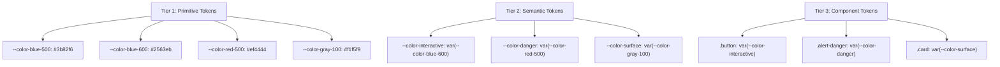

# Color Tokens System Overview

Color is the highest-bandwidth design signal. Users perceive hierarchy, state, brand, and urgency from color before reading a single word. A color token system translates intentional color decisions into an engineering artifact that scales across teams, themes, and products.

## The Problem Without Color Tokens

A codebase without color tokens looks like this:

```css
.button-primary { background: #1d4ed8; color: #ffffff; }
.button-danger  { background: #dc2626; color: #ffffff; }
.alert-warning  { background: #fef3c7; border: 1px solid #f59e0b; }
.link           { color: #2563eb; }
.link:hover     { color: #1d4ed8; }
.nav-bg         { background: #1e293b; }
.card-border    { border-color: #e2e8f0; }
```

Now the designer changes the primary blue from `#1d4ed8` to `#2563eb`. Every file using the old hex must be found and updated. The designer also wants dark mode — 200+ hex values need dark variants.

Without tokens: this is a search-and-replace nightmare. With tokens: change one line.

## Three-Tier Architecture

A mature color token system has three layers:



### Tier 1 — Primitive Tokens

Raw color values with no semantic meaning. Named by color and value, not by usage:

```css
:root {
  --color-blue-50:  #eff6ff;
  --color-blue-100: #dbeafe;
  --color-blue-500: #3b82f6;
  --color-blue-600: #2563eb;
  --color-blue-700: #1d4ed8;
  --color-blue-900: #1e3a8a;
  /* ... */
}
```

Primitives should never be used directly in components. They're the palette from which semantic tokens are drawn.

### Tier 2 — Semantic Tokens

Named by intent/usage, not by color value:

```css
:root {
  /* Actions */
  --color-interactive:       var(--color-blue-600);
  --color-interactive-hover: var(--color-blue-700);
  --color-interactive-text:  var(--color-white);

  /* Feedback */
  --color-success:   var(--color-green-500);
  --color-warning:   var(--color-amber-500);
  --color-danger:    var(--color-red-500);
  --color-info:      var(--color-blue-500);

  /* Surfaces */
  --color-surface:          var(--color-white);
  --color-surface-raised:   var(--color-gray-50);
  --color-surface-overlay:  var(--color-gray-100);
  --color-surface-inset:    var(--color-gray-200);

  /* Text */
  --color-text-primary:   var(--color-gray-900);
  --color-text-secondary: var(--color-gray-600);
  --color-text-tertiary:  var(--color-gray-400);
  --color-text-disabled:  var(--color-gray-300);
  --color-text-inverse:   var(--color-white);
  --color-text-link:      var(--color-blue-600);
}
```

### Tier 3 — Component Tokens

Component-specific tokens that reference semantic tokens:

```css
/* Button component tokens */
:root {
  --button-primary-bg:           var(--color-interactive);
  --button-primary-bg-hover:     var(--color-interactive-hover);
  --button-primary-text:         var(--color-interactive-text);
  --button-primary-border:       transparent;

  --button-secondary-bg:         transparent;
  --button-secondary-bg-hover:   var(--color-surface-raised);
  --button-secondary-text:       var(--color-interactive);
  --button-secondary-border:     var(--color-interactive);

  --button-danger-bg:            var(--color-danger);
  --button-danger-bg-hover:      var(--color-danger-dark);
  --button-danger-text:          var(--color-white);
}
```

## Color Spaces in Modern CSS

The CSS color specification has evolved dramatically. Understanding the available color spaces helps make better decisions:

| Color Space | CSS Function | Gamut | Use Case |
|-------------|-------------|-------|---------|
| sRGB (hex) | `#rrggbb` | sRGB | Universal support, standard |
| sRGB (rgb) | `rgb(r g b)` | sRGB | Programmatic sRGB |
| HSL | `hsl(h s l)` | sRGB | Human-friendly, palette generation |
| HWB | `hwb(h w b)` | sRGB | Hue + whiteness + blackness |
| OKLCH | `oklch(l c h)` | Display P3 + | Perceptually uniform, palette gen |
| OKLab | `oklab(l a b)` | Display P3 + | Perceptually uniform interpolation |
| Display P3 | `color(display-p3 r g b)` | P3 | Wide-gamut displays |
| LCH | `lch(l c h)` | Wide | Older perceptual space |

::: tip Use OKLCH for design systems
OKLCH is the recommended color space for design systems in 2026. It is perceptually uniform — doubling the lightness value actually doubles the perceived brightness. HSL is not perceptually uniform (HSL yellow at L:50% looks much brighter than HSL blue at L:50%).
:::

## What's in This Section

| Page | Focus |
|------|-------|
| [Color Theory](./color-theory.md) | RGB, HSL, OKLCH, perceptual uniformity, harmony |
| [Semantic Tokens](./semantic-tokens.md) | Three-tier architecture, naming conventions |
| [Palette Generation](./palette-generation.md) | Algorithmic shade scales, OKLCH-based tools |
| [Contrast & Accessibility](./contrast-accessibility.md) | WCAG 2.1, APCA, color blindness |

## Quick Start

```css
/* tokens/colors.css */

/* Step 1: Define primitives */
:root {
  --palette-blue-500: oklch(57% 0.2 264);
  --palette-blue-600: oklch(50% 0.22 264);
  --palette-blue-700: oklch(43% 0.2 264);
  --palette-gray-50:  oklch(97% 0 0);
  --palette-gray-900: oklch(15% 0 0);
  /* ...full palette... */
}

/* Step 2: Define semantics (light mode) */
:root {
  --color-brand:       var(--palette-blue-600);
  --color-brand-hover: var(--palette-blue-700);
  --color-bg:          var(--palette-gray-50);
  --color-text:        var(--palette-gray-900);
}

/* Step 3: Dark mode overrides semantic layer only */
[data-theme="dark"] {
  --color-brand:       var(--palette-blue-500); /* lighter for dark bg */
  --color-brand-hover: var(--palette-blue-400);
  --color-bg:          oklch(12% 0 0);
  --color-text:        oklch(92% 0 0);
}
```

::: info War Story
A SaaS company ran their design system on raw hex codes for 4 years. When they added dark mode support, they created a parallel CSS file with 600+ dark-mode overrides, each manually copying hex values from a Figma file. It took 3 engineers 6 weeks. Six months later, a rebrand changed the primary blue — they had to update 1,200+ hex values across two CSS files. After migrating to tokens, the rebrand was a 30-line change to the primitives file.
:::
