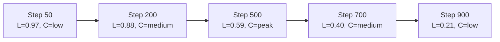

# Palette Generation

Manually picking 10 shades per color is tedious and inconsistent. Algorithmic palette generation produces perceptually uniform shade scales from a single input color — the kind of scales where step 500 truly looks like the midpoint between 400 and 600.

## The Problem with Manual Palette Design

Most "design system" color palettes are created by designers who:
1. Pick a "hero" color (usually the 500/600 step)
2. Manually lighten and darken it in a design tool
3. Pick shades by eye until they "look right"

The result is inconsistent perceptual distances between steps. The gap from gray-700 to gray-800 might look much larger than gray-100 to gray-200, even though both are 100 steps apart numerically.

Algorithmic generation with OKLCH solves this: uniform L steps = uniform perceptual differences.

## OKLCH Shade Scale Generation

The algorithm:
1. Convert the input hex to OKLCH
2. Define target lightness values for each step (e.g., 0.97 for 50, 0.15 for 900)
3. Keep chroma and hue similar but adjust for perceptual consistency
4. Generate each step at the target L value
5. Convert back to sRGB/hex for output

```typescript
// palette-generator.ts
import { converter, formatHex, formatCss } from 'culori';

const toOklch = converter('oklch');
const fromOklch = converter('rgb');

interface OklchColor {
  mode: 'oklch';
  l: number;  // 0-1
  c: number;  // 0-0.4 (roughly)
  h: number;  // 0-360
}

interface PaletteConfig {
  /** Base color as hex */
  baseColor: string;
  /** Scale name (e.g., 'blue', 'brand') */
  name: string;
  /** Lightness steps to generate */
  steps?: number[];
  /** Whether to adjust chroma as lightness changes */
  chromaScale?: 'constant' | 'natural' | 'custom';
  /** Hue shift across the scale in degrees */
  hueShift?: number;
}

interface PaletteStep {
  step: number;
  hex: string;
  oklch: string;
  l: number;
  c: number;
  h: number;
}

// Standard lightness targets per step number
// These produce perceptually even scales
const LIGHTNESS_TARGETS: Record<number, number> = {
  50:  0.975,
  100: 0.940,
  200: 0.880,
  300: 0.800,
  400: 0.700,
  500: 0.590,
  600: 0.490,
  700: 0.400,
  800: 0.310,
  900: 0.215,
  950: 0.155,
};

// How chroma scales with lightness in natural pigments
// Near-white and near-black have lower chroma
function naturalChromaScale(l: number, baseChroma: number): number {
  // Bell curve: peak chroma at L=0.55, tapering at extremes
  const peak = 0.55;
  const falloff = 2.5;
  const normalizedDistance = Math.abs(l - peak) / peak;
  const chromaFactor = Math.exp(-falloff * normalizedDistance * normalizedDistance);
  return baseChroma * Math.max(0.1, chromaFactor);
}

export function generatePalette(config: PaletteConfig): PaletteStep[] {
  const { baseColor, steps = Object.keys(LIGHTNESS_TARGETS).map(Number), hueShift = 0 } = config;

  const baseOklch = toOklch(baseColor);
  if (!baseOklch) throw new Error(`Invalid color: ${baseColor}`);

  const baseL = baseOklch.l ?? 0.5;
  const baseC = baseOklch.c ?? 0.15;
  const baseH = baseOklch.h ?? 0;

  return steps.map(step => {
    const targetL = LIGHTNESS_TARGETS[step] ?? (1 - step / 1000);

    // Hue shift: darker shades rotate slightly (like natural pigments)
    const lDiff = targetL - baseL;
    const h = (baseH + hueShift * lDiff + 360) % 360;

    // Chroma adjustment
    const c = config.chromaScale === 'natural'
      ? naturalChromaScale(targetL, baseC)
      : baseC;

    const oklchColor: OklchColor = { mode: 'oklch', l: targetL, c, h };

    // Gamut map to sRGB (clamp out-of-gamut values)
    const rgb = fromOklch(oklchColor);
    const hex = formatHex({ ...rgb, mode: 'rgb' }) ?? '#000000';
    const oklchStr = formatCss(oklchColor);

    return { step, hex, oklch: oklchStr, l: targetL, c, h };
  });
}

// Generate CSS custom properties
export function paletteToCss(
  palette: PaletteStep[],
  name: string,
  prefix = 'color'
): string {
  const props = palette
    .map(p => `  --${prefix}-${name}-${p.step}: ${p.oklch};`)
    .join('\n');
  return `:root {\n${props}\n}`;
}

// Example usage
const bluePalette = generatePalette({
  baseColor: '#3b82f6',  // Tailwind blue-500
  name: 'blue',
  chromaScale: 'natural',
  hueShift: -5,  // Slight blue→cyan shift at higher lightness
});

console.log(paletteToCss(bluePalette, 'blue'));
```

## Chroma Behavior Across a Scale

In natural pigments and well-designed color palettes, chroma (saturation/colorfulness) follows a specific pattern:



The "natural" chroma curve peaks around the 400-600 range and tapers off toward light tints and dark shades. This mirrors how natural dyes work — pale colors are washed out, dark colors approach black. If you keep chroma constant across all steps, your 50 step will look artificially vivid and your 950 step will look artificially saturated.

## Hue Shift Strategies

Some colors look more accurate with a slight hue shift across the scale:

| Color Family | Natural Hue Shift | Reason |
|-------------|-------------------|--------|
| Blue | Lighter → Cyan (+10° to 260°) | Light blue sky effect |
| Orange | Darker → Red-Orange (-10°) | Deep orange → brown |
| Green | Lighter → Yellow-Green (+15°) | Mint, sage tones |
| Purple | Darker → Blue-Purple (-20°) | Deep indigo/navy |
| Red | Both ways | No consistent pattern |

```typescript
// Hue shift configurations for common color families
export const HUE_SHIFTS = {
  blue:    { shift: -8, direction: 'toward-cyan-when-light' },
  green:   { shift: 12, direction: 'toward-yellow-when-light' },
  orange:  { shift: -8, direction: 'toward-red-when-dark' },
  purple:  { shift: -15, direction: 'toward-blue-when-dark' },
  red:     { shift: 0 },
  yellow:  { shift: 10, direction: 'toward-green-when-dark' },
  teal:    { shift: -5 },
  pink:    { shift: 8, direction: 'toward-red-when-dark' },
};
```

## Full Palette Generation System

```typescript
// full-palette-system.ts
import { generatePalette, paletteToCss } from './palette-generator';

interface DesignSystemPalette {
  // Brand
  brand: typeof generatePalette;
  // UI colors
  gray: typeof generatePalette;
  // Semantic
  red: typeof generatePalette;
  green: typeof generatePalette;
  amber: typeof generatePalette;
  blue: typeof generatePalette;
}

interface SystemColors {
  brand: string;   // Primary brand hex
  neutral?: string; // Optional: neutral gray tint hex
}

export function generateFullPalette(colors: SystemColors) {
  const { brand, neutral = '#64748b' } = colors;

  const palettes = {
    brand:   generatePalette({ baseColor: brand,   name: 'brand',   chromaScale: 'natural', hueShift: -5 }),
    gray:    generatePalette({ baseColor: neutral,  name: 'gray',    chromaScale: 'natural', hueShift: 0 }),
    red:     generatePalette({ baseColor: '#ef4444', name: 'red',    chromaScale: 'natural', hueShift: 5 }),
    orange:  generatePalette({ baseColor: '#f97316', name: 'orange', chromaScale: 'natural', hueShift: -8 }),
    amber:   generatePalette({ baseColor: '#f59e0b', name: 'amber',  chromaScale: 'natural', hueShift: 10 }),
    yellow:  generatePalette({ baseColor: '#eab308', name: 'yellow', chromaScale: 'natural', hueShift: 15 }),
    lime:    generatePalette({ baseColor: '#84cc16', name: 'lime',   chromaScale: 'natural', hueShift: 10 }),
    green:   generatePalette({ baseColor: '#22c55e', name: 'green',  chromaScale: 'natural', hueShift: 12 }),
    teal:    generatePalette({ baseColor: '#14b8a6', name: 'teal',   chromaScale: 'natural', hueShift: -5 }),
    blue:    generatePalette({ baseColor: '#3b82f6', name: 'blue',   chromaScale: 'natural', hueShift: -8 }),
    violet:  generatePalette({ baseColor: '#8b5cf6', name: 'violet', chromaScale: 'natural', hueShift: -12 }),
    purple:  generatePalette({ baseColor: '#a855f7', name: 'purple', chromaScale: 'natural', hueShift: -15 }),
    pink:    generatePalette({ baseColor: '#ec4899', name: 'pink',   chromaScale: 'natural', hueShift: 8 }),
  };

  // Generate all CSS
  const css = Object.entries(palettes)
    .map(([name, palette]) => paletteToCss(palette, name))
    .join('\n\n');

  return { palettes, css };
}
```

## Accessible Palette Design

When generating palettes, check that certain step combinations meet WCAG contrast:

```typescript
// accessibility-checker.ts
import { wcagContrast } from 'culori';

interface ContrastCheck {
  background: string;
  foreground: string;
  ratio: number;
  wcagAA: boolean;
  wcagAAA: boolean;
  wcagAALarge: boolean;
}

export function checkPaletteContrast(
  palette: PaletteStep[],
  lightSurface: string = '#ffffff',
  darkSurface: string = '#0f172a'
): Record<string, ContrastCheck> {
  const results: Record<string, ContrastCheck> = {};

  for (const step of palette) {
    const ratioOnLight = wcagContrast(step.hex, lightSurface);
    const ratioOnDark  = wcagContrast(step.hex, darkSurface);

    results[`step-${step.step}-on-light`] = {
      background: lightSurface,
      foreground: step.hex,
      ratio: ratioOnLight,
      wcagAA: ratioOnLight >= 4.5,
      wcagAAA: ratioOnLight >= 7,
      wcagAALarge: ratioOnLight >= 3,
    };

    results[`step-${step.step}-on-dark`] = {
      background: darkSurface,
      foreground: step.hex,
      ratio: ratioOnDark,
      wcagAA: ratioOnDark >= 4.5,
      wcagAAA: ratioOnDark >= 7,
      wcagAALarge: ratioOnDark >= 3,
    };
  }

  return results;
}

// Find which steps pass AA on white/dark
// Typically:
// - Steps 500-950 pass AA on white (5.5:1 contrast for body text)
// - Steps 50-400 pass AA on dark
```

## Gray Scale with Personality

A pure neutral gray (`C=0`) often looks clinical. Tinted grays add character:

```typescript
// Generate complementary gray — slight hue from brand
function generateComplementaryGray(brandHex: string): PaletteStep[] {
  const brandOklch = toOklch(brandHex);
  const brandH = brandOklch?.h ?? 0;

  // Complementary gray: same hue family as brand, very low chroma
  return generatePalette({
    baseColor: formatHex({ mode: 'oklch', l: 0.5, c: 0.01, h: brandH }) ?? '#808080',
    name: 'gray',
    chromaScale: 'constant',
  });
}

// Example: brand blue (h=264) → cool gray (h=264, C=0.01)
// Result: grays that feel "blue-ish" matching the brand
```

## Palette Preview Tool

```typescript
// palette-preview.tsx
import React from 'react';
import { generatePalette } from './palette-generator';

interface PalettePreviewProps {
  name: string;
  baseColor: string;
}

export function PalettePreview({ name, baseColor }: PalettePreviewProps) {
  const palette = generatePalette({ baseColor, name, chromaScale: 'natural' });

  return (
    <div style={​{ display: 'flex', flexDirection: 'column', gap: '2px' }}>
      <h3 style={​{ margin: '0 0 8px' }}>{name}</h3>
      {palette.map(step => (
        <div
          key={step.step}
          style={​{
            display: 'flex',
            alignItems: 'center',
            gap: '12px',
          }}
        >
          <div
            style={​{
              width: 120,
              height: 32,
              borderRadius: 4,
              background: step.hex,
            }}
          />
          <code style={​{ fontSize: 12 }}>
            {step.step}: {step.hex} | L={step.l.toFixed(3)}
          </code>
        </div>
      ))}
    </div>
  );
}
```

## Comparing Palette Generation Approaches

| Approach | Perceptual Uniformity | Control | Complexity |
|----------|----------------------|---------|-----------|
| Manual (design tool) | Low | High | Low |
| HSL step variation | Low | Medium | Low |
| HCL/LCH steps | Medium | Medium | Medium |
| OKLCH steps | High | Medium | Medium |
| Chroma.js + OKLCH | High | High | Medium |
| Culori library | Highest | High | Low |

::: tip Recommended tool
Use [culori](https://culorijs.org/) for palette generation in Node.js. It implements the most accurate OKLCH transformations and handles gamut mapping correctly.

```bash
npm install culori
```

It's 30KB gzipped, tree-shakeable, and works in both Node.js and browsers.
:::

::: info War Story
A design system team at a media company hand-crafted their palette in Figma — 180 color swatches across 18 color families, 10 steps each. When the brand team requested adding a new "coral" color family, it took a designer 3 days to manually create and approve all 10 shades. After implementing algorithmic generation with OKLCH, adding a new color family took 2 minutes: input the base hex, review the generated scale, approve. The tool was a 200-line TypeScript script.
:::
