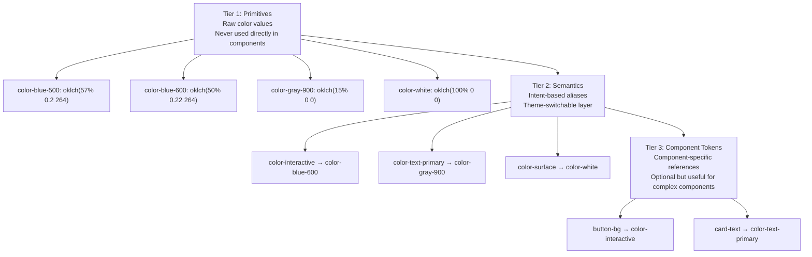

# Semantic Color Tokens

Semantic tokens are the connective tissue of a design system. They translate raw color values into meaningful abstractions — turning `oklch(57% 0.2 264)` into `--color-interactive`. This indirection is what enables theming, dark mode, and rebranding without touching component code.

## Why Semantics Matter

Without semantic tokens, dark mode requires touching every component:

```css
/* Without semantic tokens — dark mode is a nightmare */
.button { background: #2563eb; color: #ffffff; }
.card   { background: #ffffff; border: 1px solid #e2e8f0; }
.text   { color: #1e293b; }

/* Every rule must be overridden */
@media (prefers-color-scheme: dark) {
  .button { background: #3b82f6; }  /* different shade */
  .card   { background: #1e293b; border-color: #334155; }
  .text   { color: #e2e8f0; }
  /* ... 200 more overrides ... */
}
```

With semantic tokens:

```css
/* With semantic tokens — dark mode is 10 lines */
:root {
  --color-interactive: oklch(50% 0.22 264);
  --color-surface: oklch(100% 0 0);
  --color-text: oklch(15% 0 0);
  --color-border: oklch(88% 0.01 264);
}

[data-theme="dark"] {
  --color-interactive: oklch(65% 0.18 264);  /* lighter for dark bg */
  --color-surface: oklch(15% 0 0);
  --color-text: oklch(92% 0 0);
  --color-border: oklch(30% 0.01 264);
}

/* Components use semantics — unchanged between themes */
.button { background: var(--color-interactive); }
.card   { background: var(--color-surface); border-color: var(--color-border); }
.text   { color: var(--color-text); }
```

## The Three-Tier Architecture



## Semantic Token Taxonomy

### Surface Tokens

Surfaces are the backgrounds of UI regions — pages, cards, panels, inputs:

```css
:root {
  /* Base surfaces — ordered from lowest to highest elevation */
  --color-surface-base:      oklch(98% 0.002 264); /* page background */
  --color-surface-default:   oklch(100% 0 0);      /* card, panel default */
  --color-surface-raised:    oklch(100% 0 0);      /* elevated (with shadow) */
  --color-surface-overlay:   oklch(100% 0 0);      /* modal, popover */
  --color-surface-sunken:    oklch(95% 0.003 264); /* inset, input bg */

  /* Tinted surfaces — for status/feedback areas */
  --color-surface-brand:     oklch(95% 0.03 264);
  --color-surface-success:   oklch(95% 0.04 145);
  --color-surface-warning:   oklch(96% 0.04 85);
  --color-surface-danger:    oklch(95% 0.04 25);
  --color-surface-info:      oklch(95% 0.03 220);
  --color-surface-neutral:   oklch(95% 0 0);
}
```

### Text Tokens

Text hierarchy communicates importance:

```css
:root {
  /* Content text */
  --color-text-primary:     oklch(15% 0 0);      /* headings, primary content */
  --color-text-secondary:   oklch(35% 0.01 264); /* supporting text */
  --color-text-tertiary:    oklch(55% 0.01 264); /* placeholders, meta */
  --color-text-disabled:    oklch(70% 0.005 264);/* disabled form elements */

  /* Interactive text */
  --color-text-link:        oklch(50% 0.22 264); /* links */
  --color-text-link-hover:  oklch(43% 0.22 264);
  --color-text-link-visited: oklch(43% 0.15 300);

  /* Inverse text (on dark surfaces) */
  --color-text-inverse:     oklch(98% 0 0);      /* text on dark backgrounds */
  --color-text-inverse-secondary: oklch(80% 0.005 264);

  /* On-brand text */
  --color-text-on-brand:    oklch(98% 0 0);      /* text on brand-colored surfaces */

  /* Status text */
  --color-text-success:     oklch(35% 0.15 145);
  --color-text-warning:     oklch(35% 0.12 60);
  --color-text-danger:      oklch(40% 0.18 25);
  --color-text-info:        oklch(40% 0.15 220);
}
```

### Border Tokens

```css
:root {
  --color-border-default:   oklch(88% 0.01 264); /* standard borders */
  --color-border-strong:    oklch(75% 0.02 264); /* emphasis, dividers */
  --color-border-subtle:    oklch(93% 0.005 264);/* very light, structural */
  --color-border-focus:     oklch(50% 0.22 264); /* focus rings */
  --color-border-brand:     oklch(50% 0.22 264);
  --color-border-success:   oklch(45% 0.18 145);
  --color-border-warning:   oklch(55% 0.16 85);
  --color-border-danger:    oklch(50% 0.2 25);
}
```

### Interactive/Action Tokens

```css
:root {
  /* Primary action (brand color) */
  --color-action-primary:         oklch(50% 0.22 264);
  --color-action-primary-hover:   oklch(43% 0.22 264);
  --color-action-primary-active:  oklch(38% 0.2 264);
  --color-action-primary-text:    oklch(98% 0 0);
  --color-action-primary-border:  transparent;

  /* Secondary action (outlined/ghost) */
  --color-action-secondary:       transparent;
  --color-action-secondary-hover: oklch(96% 0.01 264);
  --color-action-secondary-text:  oklch(50% 0.22 264);
  --color-action-secondary-border: oklch(50% 0.22 264);

  /* Danger action */
  --color-action-danger:         oklch(50% 0.22 25);
  --color-action-danger-hover:   oklch(43% 0.22 25);
  --color-action-danger-text:    oklch(98% 0 0);

  /* Disabled state */
  --color-action-disabled:       oklch(90% 0 0);
  --color-action-disabled-text:  oklch(65% 0.005 264);
}
```

## Naming Conventions

Good semantic token names follow the pattern:

```
--color-{category}-{variant}-{state?}
```

| Segment | Examples |
|---------|---------|
| category | `text`, `surface`, `border`, `action`, `icon` |
| variant | `primary`, `secondary`, `danger`, `success`, `brand`, `on-brand` |
| state | `hover`, `active`, `disabled`, `focus` |

Avoid naming tokens by their color value (`--color-blue`) — this defeats the semantic purpose. If you refactor from blue to purple, `--color-blue` becomes misleading. `--color-interactive` remains accurate regardless of the underlying hue.

### Anti-patterns

```css
/* BAD: Named by color value */
--color-blue: #2563eb;
--dark-gray: #374151;
--light-bg: #f9fafb;

/* BAD: Too specific (not reusable) */
--navbar-background-color: #1e293b;
--hero-button-hover-blue: #1d4ed8;

/* GOOD: Intent-based */
--color-interactive: #2563eb;
--color-text-primary: #374151;
--color-surface-base: #f9fafb;
```

## Multi-Brand Theming

Semantic tokens enable multiple brands using the same component library:

```typescript
// themes/index.ts
interface BrandTheme {
  name: string;
  tokens: Record<string, string>;
}

export const brandA: BrandTheme = {
  name: 'Brand A',
  tokens: {
    '--color-brand':         'oklch(50% 0.22 264)', // blue
    '--color-brand-light':   'oklch(95% 0.04 264)',
    '--color-brand-dark':    'oklch(35% 0.22 264)',
    '--color-interactive':   'oklch(50% 0.22 264)',
    '--font-heading':        "'Inter Variable', sans-serif",
    '--border-radius-button': '0.5rem',
  },
};

export const brandB: BrandTheme = {
  name: 'Brand B',
  tokens: {
    '--color-brand':         'oklch(55% 0.22 145)', // green
    '--color-brand-light':   'oklch(95% 0.05 145)',
    '--color-brand-dark':    'oklch(38% 0.2 145)',
    '--color-interactive':   'oklch(55% 0.22 145)',
    '--font-heading':        "'Playfair Display Variable', serif",
    '--border-radius-button': '9999px', // pill buttons
  },
};

// Apply theme
export function applyTheme(theme: BrandTheme, root: HTMLElement = document.documentElement): void {
  Object.entries(theme.tokens).forEach(([key, value]) => {
    root.style.setProperty(key, value);
  });
  root.setAttribute('data-theme', theme.name.toLowerCase().replace(' ', '-'));
}
```

```css
/* Base semantic tokens (shared between brands) */
:root {
  /* These always reference brand tokens */
  --color-action-primary: var(--color-interactive);
  --color-text-link: var(--color-interactive);
  --color-border-focus: var(--color-interactive);
  --color-surface-brand: var(--color-brand-light);
}

/* Brand A */
[data-theme="brand-a"] {
  --color-interactive: oklch(50% 0.22 264);
  --color-brand: oklch(50% 0.22 264);
  --color-brand-light: oklch(95% 0.04 264);
}

/* Brand B */
[data-theme="brand-b"] {
  --color-interactive: oklch(55% 0.22 145);
  --color-brand: oklch(55% 0.22 145);
  --color-brand-light: oklch(95% 0.05 145);
}
```

## Style Dictionary Integration

Style Dictionary is the standard tool for transforming design tokens across platforms:

```json
// tokens/colors/primitives.json
{
  "color": {
    "blue": {
      "50":  { "$value": "oklch(96% 0.02 264)", "$type": "color" },
      "100": { "$value": "oklch(92% 0.05 264)", "$type": "color" },
      "200": { "$value": "oklch(85% 0.1 264)",  "$type": "color" },
      "300": { "$value": "oklch(75% 0.15 264)", "$type": "color" },
      "400": { "$value": "oklch(65% 0.18 264)", "$type": "color" },
      "500": { "$value": "oklch(57% 0.2 264)",  "$type": "color" },
      "600": { "$value": "oklch(50% 0.22 264)", "$type": "color" },
      "700": { "$value": "oklch(43% 0.22 264)", "$type": "color" },
      "800": { "$value": "oklch(35% 0.2 264)",  "$type": "color" },
      "900": { "$value": "oklch(28% 0.18 264)", "$type": "color" }
    }
  }
}
```

```json
// tokens/colors/semantic.json
{
  "color": {
    "interactive": {
      "$value": "{color.blue.600}",
      "$type": "color",
      "$description": "Primary interactive element color (buttons, links, focus)"
    },
    "text": {
      "primary": {
        "$value": "{color.gray.900}",
        "$type": "color"
      },
      "secondary": {
        "$value": "{color.gray.600}",
        "$type": "color"
      }
    }
  }
}
```

```javascript
// style-dictionary.config.js
import StyleDictionary from 'style-dictionary';

export default {
  source: ['tokens/**/*.json'],
  platforms: {
    css: {
      transformGroup: 'css',
      prefix: 'color',
      buildPath: 'src/styles/tokens/',
      files: [{
        destination: 'colors.css',
        format: 'css/variables',
        options: { outputReferences: true },
      }],
    },
    typescript: {
      transformGroup: 'js',
      buildPath: 'src/tokens/',
      files: [{
        destination: 'colors.ts',
        format: 'javascript/esm',
      }],
    },
    ios: {
      transformGroup: 'ios-swift',
      buildPath: 'ios/Tokens/',
      files: [{
        destination: 'ColorTokens.swift',
        format: 'ios-swift/class.swift',
      }],
    },
    android: {
      transformGroup: 'android',
      buildPath: 'android/res/values/',
      files: [{
        destination: 'colors.xml',
        format: 'android/colors',
      }],
    },
  },
};
```

## React Context for Token Theming

```tsx
// ThemeProvider.tsx
import React, { createContext, useContext, useEffect, useState } from 'react';

type Theme = 'light' | 'dark' | 'system';

interface ThemeContextValue {
  theme: Theme;
  resolvedTheme: 'light' | 'dark';
  setTheme: (theme: Theme) => void;
}

const ThemeContext = createContext<ThemeContextValue | null>(null);

export function ThemeProvider({ children }: { children: React.ReactNode }) {
  const [theme, setThemeState] = useState<Theme>('system');
  const [resolvedTheme, setResolvedTheme] = useState<'light' | 'dark'>('light');

  useEffect(() => {
    // Load from localStorage
    const stored = localStorage.getItem('theme') as Theme | null;
    if (stored) setThemeState(stored);
  }, []);

  useEffect(() => {
    const mediaQuery = window.matchMedia('(prefers-color-scheme: dark)');

    const resolve = () => {
      if (theme === 'system') {
        setResolvedTheme(mediaQuery.matches ? 'dark' : 'light');
      } else {
        setResolvedTheme(theme);
      }
    };

    resolve();
    mediaQuery.addEventListener('change', resolve);
    return () => mediaQuery.removeEventListener('change', resolve);
  }, [theme]);

  useEffect(() => {
    const root = document.documentElement;
    root.setAttribute('data-theme', resolvedTheme);
    root.style.colorScheme = resolvedTheme;
  }, [resolvedTheme]);

  const setTheme = (newTheme: Theme) => {
    setThemeState(newTheme);
    localStorage.setItem('theme', newTheme);
  };

  return (
    <ThemeContext.Provider value={​{ theme, resolvedTheme, setTheme }}>
      {children}
    </ThemeContext.Provider>
  );
}

export function useTheme() {
  const context = useContext(ThemeContext);
  if (!context) throw new Error('useTheme must be used within ThemeProvider');
  return context;
}
```

## Token Documentation Strategy

Well-documented tokens show intended usage:

```typescript
// tokens/documented-tokens.ts
export interface ColorToken {
  name: string;       // CSS custom property name
  value: string;      // Computed value
  description: string; // When to use this token
  examples: string[];  // Component examples
  doNot?: string[];   // Anti-patterns
}

export const colorTokenDocs: ColorToken[] = [
  {
    name: '--color-interactive',
    value: 'oklch(50% 0.22 264)',
    description: 'The primary brand color used for interactive elements. Use this for primary buttons, links, focus rings, checkboxes, radio buttons, and other interactive controls.',
    examples: [
      'Primary button background',
      'Text link color',
      'Focus ring outline',
      'Selected state indicator',
      'Toggle/switch active state',
    ],
    doNot: [
      'Do NOT use for decorative purposes (icons, illustrations)',
      'Do NOT use on text smaller than 16px without checking WCAG contrast',
      'Do NOT use for disabled states (use --color-action-disabled instead)',
    ],
  },
  {
    name: '--color-text-primary',
    value: 'oklch(15% 0 0)',
    description: 'The default text color for primary content — headings, body text, labels, and other essential readable content.',
    examples: [
      'Page headings',
      'Body text paragraphs',
      'Form labels',
      'Navigation items',
      'Data table content',
    ],
    doNot: [
      'Do NOT use on colored backgrounds without verifying contrast',
      'Do NOT use for decorative or supporting text (use --color-text-secondary)',
    ],
  },
];
```

::: info War Story
A component library team launched with a semantic token system, but components directly referenced primitive tokens because "it was faster at the time." When dark mode was requested 8 months later, auditing revealed 340 instances of primitive token usage in components. The migration required updating 340 separate values — the same work as having no token system at all. The lesson: enforce semantic token usage via linting from day one.
:::

## Token Linting with stylelint

```javascript
// .stylelintrc.js
export default {
  plugins: ['stylelint-design-token-utils'],
  rules: {
    'design-token-utils/no-raw-color-values': [true, {
      severity: 'error',
      message: 'Use semantic color tokens instead of raw color values.',
    }],
    'design-token-utils/no-primitive-tokens-in-components': [true, {
      // Patterns that indicate primitive tokens
      primitivePattern: /--color-(blue|red|green|gray|amber|purple)-\d+/,
      // Allow in token files themselves
      ignoreFiles: ['**/tokens/**'],
      severity: 'warning',
    }],
  },
};
```
