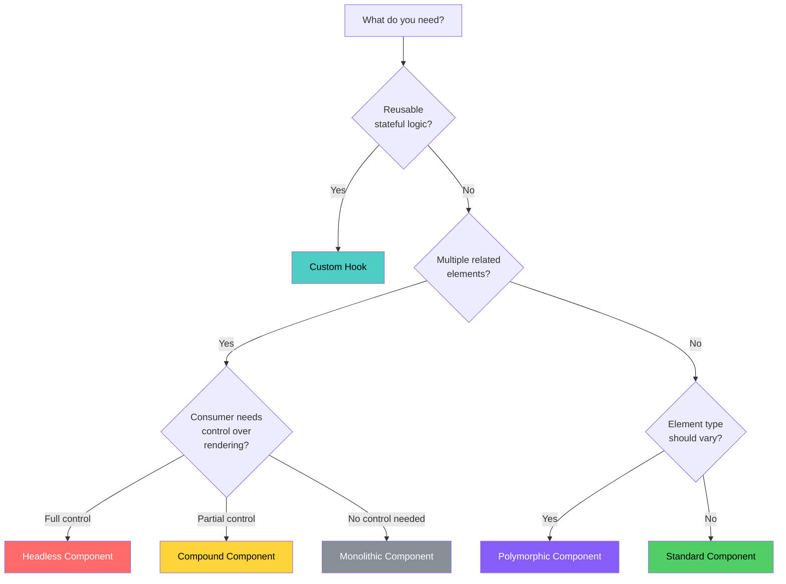

# Component Patterns

Component architecture is where design systems succeed or fail. A well-designed component API makes the right thing easy and the wrong thing hard. A poorly designed one leads to prop explosion, brittle composition, and endless breaking changes.

This section covers the engineering patterns behind the best component libraries in production — Radix UI, Headless UI, Chakra, Mantine, Shadcn, Adobe's React Aria, and others. Each pattern is presented with full TypeScript implementations, trade-off analysis, and guidance on when to apply (and when not to).

## The Component API Spectrum

Component APIs exist on a spectrum from rigid to flexible:

```
Rigid                                                    Flexible
  |                                                        |
  ├── Single prop-driven component                         |
  |   <Select options={[...]} />                           |
  |                                                        |
  ├── Compound components                                  |
  |   <Select>                                             |
  |     <Select.Trigger />                                 |
  |     <Select.Options>                                   |
  |       <Select.Option value="a">Alpha</Select.Option>   |
  |     </Select.Options>                                  |
  |   </Select>                                            |
  |                                                        |
  ├── Headless (render props / hooks)                      |
  |   const { getToggleProps, isOpen } = useSelect()       |
  |                                                        |
  ├── Fully unstyled primitives                            |
  |   <Primitive.div />                                    |
  |                                                        |
```

More rigid APIs are faster to use but harder to customize. More flexible APIs require more boilerplate but adapt to any design requirement. The best design systems offer multiple levels: a headless core for maximum flexibility, and pre-styled compounds for the 80% case.

## The Patterns

### Atomic Design

The organizational framework. How to decompose a UI into atoms (Button, Input), molecules (SearchField), organisms (Header), templates, and pages. Not a React concept — a mental model for component hierarchy.

**Read:** [Atomic Design](./atomic-design)

### Compound Components

React's answer to the `<select>` + `<option>` pattern. Components that work together through shared implicit state, giving consumers markup-level control over rendering while the parent manages coordination.

**Read:** [Compound Components](./compound-components)

### Render Props and Hooks

The evolution of logic sharing: from render props (React's original pattern for code reuse) to custom hooks (the modern standard). How to extract and compose stateful logic without coupling it to UI.

**Read:** [Render Props & Hooks](./render-props-hooks)

### Controlled and Uncontrolled Components

The state ownership question: does the component manage its own state (uncontrolled) or does the parent (controlled)? The `useControllableState` pattern that supports both modes with a single API.

**Read:** [Controlled & Uncontrolled](./controlled-uncontrolled)

### Polymorphic Components

The `as` prop pattern that lets a `Button` render as an `<a>`, a `<Link>`, or any custom component — while preserving full TypeScript type safety for the rendered element's props.

**Read:** [Polymorphic Components](./polymorphic-components)

### Slot Pattern

Radix UI's approach to composition: named slots that let consumers replace any internal element while the component maintains its behavior. A more structured alternative to render props.

**Read:** [Slot Pattern](./slot-pattern)

### Headless Components

The ultimate separation of concerns: components that manage behavior, state, and accessibility with zero UI opinions. The pattern behind Radix Primitives, Headless UI, React Aria, and Downshift.

**Read:** [Headless Components](./headless-components)

## Pattern Selection Guide



## Decision Matrix

| Pattern | Use When | Avoid When | Complexity | Flexibility |
|---------|----------|------------|------------|-------------|
| Atomic Design | Organizing any component library | Small projects with < 10 components | Low | N/A (organizational) |
| Compound Components | Multi-part UI (Select, Tabs, Accordion) | Single-element components | Medium | Medium |
| Custom Hooks | Sharing stateful logic across components | Logic is trivial or one-off | Low-Medium | High |
| Controlled/Uncontrolled | Form inputs, toggles, any stateful UI | Read-only display components | Medium | High |
| Polymorphic (`as` prop) | Navigation items, buttons that link | Components with fixed semantics | High (TypeScript) | Medium |
| Slot Pattern | Design systems with theming flexibility | Simple component libraries | Medium | High |
| Headless Components | Cross-design-system behavior sharing | When you control the design system | High | Maximum |

## Common Anti-Patterns

### Prop Explosion

```tsx
// Anti-pattern: every variant is a boolean prop
<Button
  primary
  large
  rounded
  withIcon
  iconPosition="left"
  iconSize="sm"
  loading
  loadingText="Saving..."
  disabled
  fullWidth
  outline
/>
```

This component has dozens of props, many of which conflict (what happens if both `primary` and `outline` are true?). Compound components, variant props, and composition solve this.

### Premature Abstraction

```tsx
// Anti-pattern: abstracting before you have 3 use cases
// Created after seeing ONE card with an avatar
<UserCard
  avatarSrc={user.avatar}
  avatarSize="lg"
  name={user.name}
  subtitle={user.role}
  actions={[{ label: 'Follow', onClick: handleFollow }]}
  badge="Pro"
  badgeColor="gold"
/>
```

Wait for three real use cases before abstracting. Start with composition:

```tsx
<Card>
  <Card.Header>
    <Avatar src={user.avatar} size="lg" />
    <Stack gap={1}>
      <Text weight="bold">{user.name}</Text>
      <Text color="muted">{user.role}</Text>
    </Stack>
    <Badge color="gold">Pro</Badge>
  </Card.Header>
  <Card.Actions>
    <Button onClick={handleFollow}>Follow</Button>
  </Card.Actions>
</Card>
```

### Wrapper Hell

```tsx
// Anti-pattern: wrapping third-party components without adding value
const MyButton = ({ children, ...props }) => (
  <ThirdPartyButton {...props}>{children}</ThirdPartyButton>
);
```

If you are not changing the API surface, adding behavior, or isolating a dependency boundary, the wrapper adds indirection without value.

## Subsections

| Page | Focus | Difficulty |
|------|-------|------------|
| [Atomic Design](./atomic-design) | Component hierarchy and organization | Beginner |
| [Compound Components](./compound-components) | Multi-part component composition | Intermediate |
| [Render Props & Hooks](./render-props-hooks) | Logic sharing and reuse | Intermediate |
| [Controlled & Uncontrolled](./controlled-uncontrolled) | State ownership patterns | Intermediate |
| [Polymorphic Components](./polymorphic-components) | The `as` prop with full type safety | Advanced |
| [Slot Pattern](./slot-pattern) | Named composition slots | Intermediate |
| [Headless Components](./headless-components) | Behavior without UI opinions | Advanced |

---

> *"The best component API is one where the developer falls into the pit of success — where the easiest thing to do is also the correct thing to do."*
