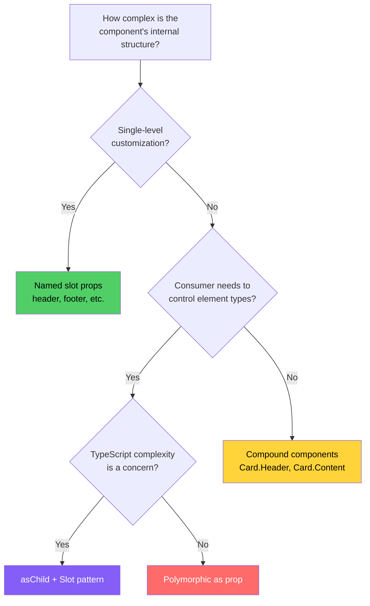

# Slot Pattern

The slot pattern lets consumers replace any internal element of a component while the component maintains its behavior, event handlers, and accessibility attributes. Instead of the component deciding which element to render (like the `as` prop), the consumer provides the element and the component merges its behavior onto it. This is the foundation of Radix UI's `asChild` pattern and a powerful alternative to both polymorphic components and compound components.

## The Core Idea

In frameworks like Vue and Web Components, slots are a first-class feature:

```html
<!-- Vue slot -->
<template>
  <div class="card">
    <slot name="header">Default Header</slot>
    <slot>Default Content</slot>
    <slot name="footer">Default Footer</slot>
  </div>
</template>
```

React does not have built-in slots, but you can achieve the same pattern through props that accept ReactNode, compound components, or the Slot primitive.

## Named Slots via Props

The simplest slot pattern: accept ReactNode props for each customizable section.

```tsx
import { type ReactNode, forwardRef } from 'react';
import { cn } from '@/lib/utils';

type CardProps = {
  /** Content for the card header area */
  header?: ReactNode;
  /** Main card content */
  children: ReactNode;
  /** Content for the card footer area */
  footer?: ReactNode;
  /** Optional media element displayed above the header */
  media?: ReactNode;
  className?: string;
};

const Card = forwardRef<HTMLDivElement, CardProps>(
  ({ header, children, footer, media, className }, ref) => {
    return (
      <div ref={ref} className={cn('rounded-lg border bg-card shadow-sm', className)}>
        {media && (
          <div className="overflow-hidden rounded-t-lg">{media}</div>
        )}
        {header && (
          <div className="border-b px-6 py-4">{header}</div>
        )}
        <div className="px-6 py-4">{children}</div>
        {footer && (
          <div className="border-t px-6 py-4">{footer}</div>
        )}
      </div>
    );
  }
);
Card.displayName = 'Card';

// ─── Usage ──────────────────────────────────────────────────────────

function ProductCard({ product }: { product: Product }) {
  return (
    <Card
      media={}
      header={
        <div className="flex items-center justify-between">
          <h3 className="font-semibold">{product.name}</h3>
          <Badge variant="success">${product.price}</Badge>
        </div>
      }
      footer={
        <div className="flex gap-2">
          <Button variant="primary" className="flex-1">Add to Cart</Button>
          <Button variant="outline" size="icon">
            <HeartIcon />
          </Button>
        </div>
      }
    >
      <p className="text-muted-foreground">{product.description}</p>
    </Card>
  );
}
```

**Advantages:**
- Simple to understand and implement
- Clear API — each slot is a named prop
- Easy to make slots optional with defaults
- Good TypeScript support — each slot's type is explicit

**Limitations:**
- Consumer cannot change the wrapper elements (the `<div className="border-b px-6 py-4">` around the header)
- Slots are predefined — cannot add arbitrary slots without changing the component API
- No behavior merging — the component cannot add event handlers to the slot content

## Radix UI's Slot Primitive

Radix UI solved the slot problem with a `Slot` component that merges its props onto its child element. This is the engine behind `asChild`.

### How Slot Works

```tsx
import { Children, cloneElement, isValidElement, forwardRef, type ReactNode, type HTMLAttributes } from 'react';

/**
 * Slot renders its child element instead of a wrapper element.
 * It merges its own props (event handlers, className, style, ref) onto the child.
 *
 * Think of it as: "I want to behave like X, but render as whatever the child is."
 */
const Slot = forwardRef<HTMLElement, HTMLAttributes<HTMLElement> & { children: ReactNode }>(
  ({ children, ...slotProps }, forwardedRef) => {
    const child = Children.only(children);

    if (!isValidElement(child)) {
      return null;
    }

    // Merge refs
    const mergedRef = composeRefs(forwardedRef, (child as any).ref);

    // Merge props
    const mergedProps = mergeProps(slotProps, child.props);

    return cloneElement(child, {
      ...mergedProps,
      ref: mergedRef,
    });
  }
);
Slot.displayName = 'Slot';

// ─── Prop merging utilities ─────────────────────────────────────────

function mergeProps(
  slotProps: Record<string, any>,
  childProps: Record<string, any>
): Record<string, any> {
  const merged: Record<string, any> = { ...childProps };

  for (const key in slotProps) {
    const slotValue = slotProps[key];
    const childValue = childProps[key];

    if (key === 'style') {
      // Merge style objects — child styles override slot styles
      merged[key] = { ...slotValue, ...childValue };
    } else if (key === 'className') {
      // Concatenate classNames
      merged[key] = [slotValue, childValue].filter(Boolean).join(' ');
    } else if (/^on[A-Z]/.test(key)) {
      // Compose event handlers — both get called
      if (slotValue && childValue) {
        merged[key] = (...args: unknown[]) => {
          childValue(...args);
          slotValue(...args);
        };
      } else {
        merged[key] = slotValue || childValue;
      }
    } else {
      // For all other props, slot value takes precedence
      // (this includes ARIA attributes, data attributes, etc.)
      if (slotValue !== undefined) {
        merged[key] = slotValue;
      }
    }
  }

  return merged;
}

// ─── Ref composition ────────────────────────────────────────────────

type PossibleRef<T> = React.Ref<T> | undefined;

function composeRefs<T>(...refs: PossibleRef<T>[]): React.RefCallback<T> {
  return (node) => {
    refs.forEach((ref) => {
      if (typeof ref === 'function') {
        ref(node);
      } else if (ref !== null && ref !== undefined) {
        (ref as React.MutableRefObject<T | null>).current = node;
      }
    });
  };
}
```

### The asChild Pattern

With the `Slot` primitive, components can offer an `asChild` prop that makes them render as their child element instead of their default element:

```tsx
type ButtonProps = {
  variant?: 'primary' | 'secondary' | 'outline' | 'ghost';
  size?: 'sm' | 'md' | 'lg';
  /** When true, the Button renders as its child element instead of <button> */
  asChild?: boolean;
  children: ReactNode;
  className?: string;
} & (
  | ({ asChild?: false } & React.ButtonHTMLAttributes<HTMLButtonElement>)
  | ({ asChild: true } & { children: ReactNode })
);

const Button = forwardRef<HTMLButtonElement, ButtonProps>(
  ({ variant = 'primary', size = 'md', asChild = false, className, children, ...props }, ref) => {
    const classes = cn(
      'inline-flex items-center justify-center rounded-md font-medium transition-colors',
      'focus-visible:outline-none focus-visible:ring-2 focus-visible:ring-ring',
      variant === 'primary' && 'bg-primary text-primary-foreground hover:bg-primary/90',
      variant === 'secondary' && 'bg-secondary text-secondary-foreground hover:bg-secondary/80',
      variant === 'outline' && 'border border-input bg-background hover:bg-accent',
      variant === 'ghost' && 'hover:bg-accent hover:text-accent-foreground',
      size === 'sm' && 'h-8 px-3 text-xs',
      size === 'md' && 'h-10 px-4 text-sm',
      size === 'lg' && 'h-12 px-6 text-base',
      className
    );

    // If asChild, render as Slot (merge onto child)
    // Otherwise, render as <button>
    const Component = asChild ? Slot : 'button';

    return (
      <Component ref={ref} className={classes} {...props}>
        {children}
      </Component>
    );
  }
);

// ─── Usage ──────────────────────────────────────────────────────────

// Default: renders as <button>
<Button variant="primary">Save</Button>
// Output: <button class="inline-flex ... bg-primary ...">Save</button>

// asChild: renders as whatever the child is, with Button's styles merged
<Button variant="primary" asChild>
  <a href="/about">About</a>
</Button>
// Output: <a href="/about" class="inline-flex ... bg-primary ...">About</a>

// asChild with React Router Link
<Button variant="outline" asChild>
  <Link to="/dashboard">Dashboard</Link>
</Button>
// Output: renders Link component with Button's styles

// asChild with Next.js Link
<Button variant="ghost" asChild>
  <NextLink href="/settings">Settings</NextLink>
</Button>
```

### Why asChild Instead of as

The `asChild` pattern has several advantages over the `as` prop:

| Feature | `as` prop | `asChild` |
|---------|-----------|-----------|
| TypeScript complexity | High (complex generics) | Low (no generics needed) |
| Ref type safety | Requires type assertion | Natural (child's ref type is known) |
| Custom component props | Must be threaded through generics | Naturally available on the child element |
| IDE autocompletion | Can lag due to large union types | Normal speed |
| Readability | `<Button as={Link} to="/x">` | `<Button asChild><Link to="/x">...</Link></Button>` |
| Multiple prop merging | Manual (spread) | Automatic (Slot merges) |

**Disadvantage of asChild:** slightly more verbose for simple cases. `<Button as="a" href="/x">` is shorter than `<Button asChild><a href="/x">...</a></Button>`.

## Building a Complete Slot System

### Alert Dialog with Slots

```tsx
import {
  createContext,
  useContext,
  useState,
  useCallback,
  useId,
  forwardRef,
  type ReactNode,
} from 'react';

// ─── Context ────────────────────────────────────────────────────────

type AlertDialogContextValue = {
  isOpen: boolean;
  onOpenChange: (open: boolean) => void;
  titleId: string;
  descriptionId: string;
};

const AlertDialogContext = createContext<AlertDialogContextValue | null>(null);

function useAlertDialogContext() {
  const ctx = useContext(AlertDialogContext);
  if (!ctx) throw new Error('AlertDialog components must be used within <AlertDialog>');
  return ctx;
}

// ─── Root ───────────────────────────────────────────────────────────

type AlertDialogProps = {
  open?: boolean;
  defaultOpen?: boolean;
  onOpenChange?: (open: boolean) => void;
  children: ReactNode;
};

function AlertDialog({ open, defaultOpen = false, onOpenChange, children }: AlertDialogProps) {
  const [internalOpen, setInternalOpen] = useState(defaultOpen);
  const isOpen = open !== undefined ? open : internalOpen;
  const baseId = useId();

  const handleOpenChange = useCallback(
    (nextOpen: boolean) => {
      if (open === undefined) setInternalOpen(nextOpen);
      onOpenChange?.(nextOpen);
    },
    [open, onOpenChange]
  );

  return (
    <AlertDialogContext.Provider
      value={​{
        isOpen,
        onOpenChange: handleOpenChange,
        titleId: `${baseId}-title`,
        descriptionId: `${baseId}-description`,
      }​}
    >
      {children}
    </AlertDialogContext.Provider>
  );
}

// ─── Trigger (with asChild support) ─────────────────────────────────

type AlertDialogTriggerProps = {
  asChild?: boolean;
  children: ReactNode;
  className?: string;
};

const AlertDialogTrigger = forwardRef<HTMLButtonElement, AlertDialogTriggerProps>(
  ({ asChild = false, children, className, ...props }, ref) => {
    const { onOpenChange } = useAlertDialogContext();
    const Component = asChild ? Slot : 'button';

    return (
      <Component
        ref={ref}
        onClick={() => onOpenChange(true)}
        className={className}
        {...props}
      >
        {children}
      </Component>
    );
  }
);
AlertDialogTrigger.displayName = 'AlertDialogTrigger';

// ─── Overlay ────────────────────────────────────────────────────────

const AlertDialogOverlay = forwardRef<HTMLDivElement, { className?: string }>(
  ({ className }, ref) => {
    const { isOpen, onOpenChange } = useAlertDialogContext();

    if (!isOpen) return null;

    return (
      <div
        ref={ref}
        className={cn(
          'fixed inset-0 z-50 bg-black/50 backdrop-blur-sm',
          'animate-in fade-in-0',
          className
        )}
        onClick={() => onOpenChange(false)}
        aria-hidden="true"
      />
    );
  }
);
AlertDialogOverlay.displayName = 'AlertDialogOverlay';

// ─── Content ────────────────────────────────────────────────────────

type AlertDialogContentProps = {
  children: ReactNode;
  className?: string;
  onEscapeKeyDown?: () => void;
};

const AlertDialogContent = forwardRef<HTMLDivElement, AlertDialogContentProps>(
  ({ children, className, onEscapeKeyDown }, ref) => {
    const { isOpen, onOpenChange, titleId, descriptionId } = useAlertDialogContext();

    useEffect(() => {
      if (!isOpen) return;

      const handleKeyDown = (e: KeyboardEvent) => {
        if (e.key === 'Escape') {
          onEscapeKeyDown?.();
          onOpenChange(false);
        }
      };

      document.addEventListener('keydown', handleKeyDown);
      return () => document.removeEventListener('keydown', handleKeyDown);
    }, [isOpen, onOpenChange, onEscapeKeyDown]);

    if (!isOpen) return null;

    return (
      <div
        ref={ref}
        role="alertdialog"
        aria-modal="true"
        aria-labelledby={titleId}
        aria-describedby={descriptionId}
        className={cn(
          'fixed left-1/2 top-1/2 z-50 w-full max-w-lg -translate-x-1/2 -translate-y-1/2',
          'rounded-lg border bg-background p-6 shadow-lg',
          'animate-in fade-in-0 zoom-in-95',
          className
        )}
      >
        {children}
      </div>
    );
  }
);
AlertDialogContent.displayName = 'AlertDialogContent';

// ─── Title ──────────────────────────────────────────────────────────

type AlertDialogTitleProps = {
  asChild?: boolean;
  children: ReactNode;
  className?: string;
};

const AlertDialogTitle = forwardRef<HTMLHeadingElement, AlertDialogTitleProps>(
  ({ asChild = false, children, className }, ref) => {
    const { titleId } = useAlertDialogContext();
    const Component = asChild ? Slot : 'h2';

    return (
      <Component ref={ref} id={titleId} className={cn('text-lg font-semibold', className)}>
        {children}
      </Component>
    );
  }
);
AlertDialogTitle.displayName = 'AlertDialogTitle';

// ─── Description ────────────────────────────────────────────────────

type AlertDialogDescriptionProps = {
  asChild?: boolean;
  children: ReactNode;
  className?: string;
};

const AlertDialogDescription = forwardRef<HTMLParagraphElement, AlertDialogDescriptionProps>(
  ({ asChild = false, children, className }, ref) => {
    const { descriptionId } = useAlertDialogContext();
    const Component = asChild ? Slot : 'p';

    return (
      <Component ref={ref} id={descriptionId} className={cn('text-sm text-muted-foreground mt-2', className)}>
        {children}
      </Component>
    );
  }
);
AlertDialogDescription.displayName = 'AlertDialogDescription';

// ─── Action & Cancel (with asChild) ────────────────────────────────

type AlertDialogActionProps = {
  asChild?: boolean;
  children: ReactNode;
  className?: string;
  onClick?: () => void;
};

const AlertDialogAction = forwardRef<HTMLButtonElement, AlertDialogActionProps>(
  ({ asChild = false, children, className, onClick, ...props }, ref) => {
    const { onOpenChange } = useAlertDialogContext();
    const Component = asChild ? Slot : 'button';

    return (
      <Component
        ref={ref}
        onClick={() => {
          onClick?.();
          onOpenChange(false);
        }​}
        className={cn(
          'inline-flex items-center justify-center rounded-md px-4 py-2 text-sm font-medium',
          'bg-destructive text-destructive-foreground hover:bg-destructive/90',
          className
        )}
        {...props}
      >
        {children}
      </Component>
    );
  }
);
AlertDialogAction.displayName = 'AlertDialogAction';

const AlertDialogCancel = forwardRef<HTMLButtonElement, AlertDialogActionProps>(
  ({ asChild = false, children, className, onClick, ...props }, ref) => {
    const { onOpenChange } = useAlertDialogContext();
    const Component = asChild ? Slot : 'button';

    return (
      <Component
        ref={ref}
        onClick={() => {
          onClick?.();
          onOpenChange(false);
        }​}
        className={cn(
          'inline-flex items-center justify-center rounded-md px-4 py-2 text-sm font-medium',
          'border border-input bg-background hover:bg-accent',
          className
        )}
        {...props}
      >
        {children}
      </Component>
    );
  }
);
AlertDialogCancel.displayName = 'AlertDialogCancel';

// ─── Attach sub-components ──────────────────────────────────────────

AlertDialog.Trigger = AlertDialogTrigger;
AlertDialog.Overlay = AlertDialogOverlay;
AlertDialog.Content = AlertDialogContent;
AlertDialog.Title = AlertDialogTitle;
AlertDialog.Description = AlertDialogDescription;
AlertDialog.Action = AlertDialogAction;
AlertDialog.Cancel = AlertDialogCancel;
```

**Usage:**

```tsx
function DeleteConfirmation({ onDelete }: { onDelete: () => void }) {
  return (
    <AlertDialog>
      {/* asChild: the trigger renders as whatever child you provide */}
      <AlertDialog.Trigger asChild>
        <Button variant="destructive" size="sm">
          Delete Account
        </Button>
      </AlertDialog.Trigger>

      <AlertDialog.Overlay />
      <AlertDialog.Content>
        <AlertDialog.Title>Are you absolutely sure?</AlertDialog.Title>
        <AlertDialog.Description>
          This action cannot be undone. This will permanently delete your account
          and remove your data from our servers.
        </AlertDialog.Description>

        <div className="mt-6 flex justify-end gap-3">
          <AlertDialog.Cancel>Cancel</AlertDialog.Cancel>
          <AlertDialog.Action onClick={onDelete}>
            Yes, delete my account
          </AlertDialog.Action>
        </div>
      </AlertDialog.Content>
    </AlertDialog>
  );
}
```

## Children Composition vs Explicit Slots

There are two philosophies for slot-based composition in React:

### Children Composition (Radix/Shadcn Style)

The parent provides structure through compound components, and children fill the slots:

```tsx
<Card>
  <Card.Header>
    <Card.Title>Settings</Card.Title>
    <Card.Description>Manage your preferences</Card.Description>
  </Card.Header>
  <Card.Content>
    <form>...</form>
  </Card.Content>
  <Card.Footer>
    <Button>Save</Button>
  </Card.Footer>
</Card>
```

**Advantages:**
- Highly flexible — consumer controls order, nesting, and content
- Easy to add new slots (just create a new sub-component)
- Familiar JSX pattern

**Disadvantages:**
- No enforcement of slot presence (consumer can forget `Card.Title`)
- Order depends on consumer — consumer could put Footer before Header
- More verbose for simple cases

### Explicit Slots (Props-Based)

The component accepts named props for each slot:

```tsx
<Card
  title="Settings"
  description="Manage your preferences"
  footer={<Button>Save</Button>}
>
  <form>...</form>
</Card>
```

**Advantages:**
- Component controls layout and ordering
- Can enforce required slots via TypeScript
- Less verbose for simple cases
- Easier to document (each slot is a prop in the type definition)

**Disadvantages:**
- Less flexible — consumer cannot change order or structure
- Adding new slots means adding new props (API growth)
- Complex slot content requires inline JSX in props (can be hard to read)

### Hybrid Approach

The most sophisticated design systems offer both:

```tsx
// Simple usage with explicit slots
<Card title="Settings" description="Manage your preferences">
  <form>...</form>
</Card>

// Complex usage with compound components
<Card>
  <Card.Header>
    <div className="flex items-center gap-4">
      <Avatar src={user.avatar} alt={user.name} />
      <div>
        <Card.Title>{user.name}</Card.Title>
        <Card.Description>{user.role}</Card.Description>
      </div>
    </div>
  </Card.Header>
  <Card.Content>...</Card.Content>
</Card>
```

## Compound Components vs Slots: Decision Guide



| Factor | Named Slot Props | Compound Components | asChild/Slot |
|--------|-----------------|-------------------|-------------|
| API simplicity | Simplest | Moderate | Moderate |
| Flexibility | Low | High | Highest |
| Behavior merging | None | Via Context | Automatic (Slot) |
| Element replacement | No | Partial | Full |
| TypeScript complexity | Low | Low-Medium | Low |
| Learning curve | Lowest | Medium | Medium |
| Use case | Cards, Layouts | Tabs, Select, Accordion | Buttons, Triggers, any wrapper |

## Slottable Content Pattern

A more advanced pattern: the `Slottable` component that lets consumers inject content at specific points within a component's internal structure:

```tsx
import { Children, isValidElement, type ReactNode } from 'react';

/**
 * Marker component for slottable content.
 * When a component uses Slot internally, Slottable marks
 * which child should be treated as the slot content vs. other children.
 */
function Slottable({ children }: { children: ReactNode }) {
  return <>{children}</>;
}

/**
 * Check if a child is a Slottable element.
 */
function isSlottable(child: ReactNode): child is React.ReactElement<{ children: ReactNode }> {
  return isValidElement(child) && child.type === Slottable;
}

/**
 * Separate slottable content from non-slottable content.
 */
function getSlottableContent(children: ReactNode): {
  slottable: ReactNode | null;
  other: ReactNode[];
} {
  const childArray = Children.toArray(children);
  const slottable = childArray.find(isSlottable);
  const other = childArray.filter((child) => !isSlottable(child));

  return {
    slottable: slottable ? (slottable as React.ReactElement<{ children: ReactNode }>).props.children : null,
    other,
  };
}

// ─── Usage in a Tooltip component ───────────────────────────────────

type TooltipTriggerProps = {
  asChild?: boolean;
  children: ReactNode;
};

const TooltipTrigger = forwardRef<HTMLButtonElement, TooltipTriggerProps>(
  ({ asChild = false, children, ...props }, ref) => {
    const Component = asChild ? Slot : 'button';

    return (
      <Component ref={ref} {...props}>
        {children}
      </Component>
    );
  }
);

// With Slottable, the tooltip trigger can inject aria attributes
// into slottable content while preserving non-slottable children:
function TooltipTriggerWithIcon({ children }: { children: ReactNode }) {
  const { slottable, other } = getSlottableContent(children);

  return (
    <button aria-describedby="tooltip">
      {slottable}
      {other}
      <InfoIcon aria-hidden="true" />
    </button>
  );
}

// Usage:
<TooltipTriggerWithIcon>
  <Slottable>Hover me</Slottable>
</TooltipTriggerWithIcon>
```

## Testing Slot-Based Components

```tsx
import { render, screen } from '@testing-library/react';
import userEvent from '@testing-library/user-event';

describe('Slot', () => {
  it('renders child element instead of wrapper', () => {
    render(
      <Slot className="slot-class" data-testid="slot">
        <a href="/test" className="child-class">Link</a>
      </Slot>
    );

    const element = screen.getByTestId('slot');
    expect(element.tagName).toBe('A');
    expect(element).toHaveAttribute('href', '/test');
    // Both classes are merged
    expect(element.className).toContain('slot-class');
    expect(element.className).toContain('child-class');
  });

  it('composes event handlers', async () => {
    const user = userEvent.setup();
    const slotClick = vi.fn();
    const childClick = vi.fn();

    render(
      <Slot onClick={slotClick}>
        <button onClick={childClick}>Click me</button>
      </Slot>
    );

    await user.click(screen.getByRole('button'));
    expect(slotClick).toHaveBeenCalledTimes(1);
    expect(childClick).toHaveBeenCalledTimes(1);
  });

  it('merges refs', () => {
    const slotRef = { current: null };
    const childRef = { current: null };

    render(
      <Slot ref={slotRef}>
        <div ref={childRef}>Content</div>
      </Slot>
    );

    expect(slotRef.current).toBeInstanceOf(HTMLDivElement);
    expect(childRef.current).toBeInstanceOf(HTMLDivElement);
    expect(slotRef.current).toBe(childRef.current);
  });
});

describe('Button with asChild', () => {
  it('renders as button by default', () => {
    render(<Button>Click</Button>);
    expect(screen.getByRole('button')).toBeInTheDocument();
  });

  it('renders as child element when asChild is true', () => {
    render(
      <Button asChild variant="primary">
        <a href="/about">About</a>
      </Button>
    );

    const link = screen.getByRole('link');
    expect(link).toHaveAttribute('href', '/about');
    expect(link.className).toContain('bg-primary');
  });
});
```

## Further Reading

- **Radix UI Slot source:** `@radix-ui/react-slot` on GitHub
- **Web Components slots:** MDN documentation on `<slot>` element
- **Vue slots:** Vue.js documentation on named and scoped slots
- **Next:** [Headless Components](./headless-components) — the ultimate slot pattern where all UI is slotted
- **Related:** [Polymorphic Components](./polymorphic-components) — the `as` prop alternative
