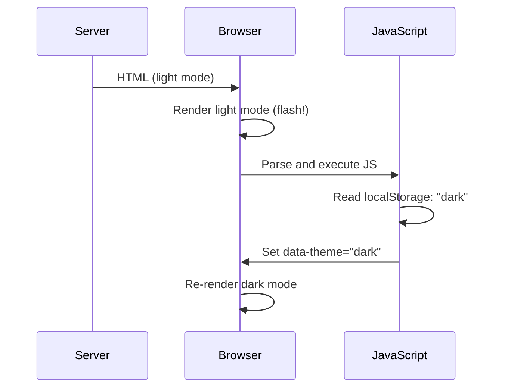

# Dark Mode Implementation Patterns

The CSS is the easy part. The hard problems in dark mode are: preventing flash of wrong theme on SSR, persisting user preference, syncing with system preference, and supporting multiple themes.

## CSS Architecture

### Pattern 1: Media Query Only

The simplest approach — no JavaScript required:

```css
:root {
  --bg: oklch(97% 0 0);
  --text: oklch(12% 0 0);
}

@media (prefers-color-scheme: dark) {
  :root {
    --bg: oklch(10% 0 0);
    --text: oklch(92% 0 0);
  }
}

/* Components use tokens — they don't change */
body { background: var(--bg); color: var(--text); }
```

**Limitation**: Users cannot override their system preference. No manual toggle.

### Pattern 2: Class Toggle

A data attribute or class on `<html>` allows user override:

```css
/* Light mode (default) */
:root {
  --bg: oklch(97% 0 0);
  --text: oklch(12% 0 0);
  color-scheme: light;
}

/* Dark mode via class */
[data-theme="dark"] {
  --bg: oklch(10% 0 0);
  --text: oklch(92% 0 0);
  color-scheme: dark;
}

/* Respect system if no override */
@media (prefers-color-scheme: dark) {
  :root:not([data-theme]) {
    --bg: oklch(10% 0 0);
    --text: oklch(92% 0 0);
    color-scheme: dark;
  }
}
```

The `color-scheme` property tells the browser to adjust native UI elements (scrollbars, form controls, select dropdowns) to match the theme.

### Pattern 3: Three-State System

`system | light | dark` — the most user-friendly approach:

```typescript
// types/theme.ts
export type ThemePreference = 'system' | 'light' | 'dark';
export type ResolvedTheme = 'light' | 'dark';
```

```css
/* base.css — light variables */
:root {
  --bg: oklch(97% 0 0);
  --text: oklch(12% 0 0);
  color-scheme: light;
}

/* Explicit dark override */
[data-theme="dark"] {
  --bg: oklch(10% 0 0);
  --text: oklch(92% 0 0);
  color-scheme: dark;
}

/* Explicit light (needed when system is dark but user chose light) */
[data-theme="light"] {
  --bg: oklch(97% 0 0);
  --text: oklch(12% 0 0);
  color-scheme: light;
}

/* System fallback when no explicit theme set */
@media (prefers-color-scheme: dark) {
  :root:not([data-theme]) {
    --bg: oklch(10% 0 0);
    --text: oklch(92% 0 0);
    color-scheme: dark;
  }
}
```

## The Flash Problem (SSR)

The most annoying dark mode bug: Flash of Wrong Theme (FOWT).

**Cause**: Server renders HTML with light mode defaults. JavaScript loads, reads `localStorage`, and switches to dark. Between parse and JS execution, the user sees a flash of light mode.



### Solution 1: Blocking Script in Head

```html
<!DOCTYPE html>
<html>
<head>
  <!-- Blocking script executes before first paint -->
  <script>
    // This runs synchronously, before CSS paints
    try {
      const theme = localStorage.getItem('theme');
      const systemDark = window.matchMedia('(prefers-color-scheme: dark)').matches;

      if (theme === 'dark' || (!theme && systemDark)) {
        document.documentElement.setAttribute('data-theme', 'dark');
      } else if (theme === 'light') {
        document.documentElement.setAttribute('data-theme', 'light');
      }
      // If theme === 'system' or null: let CSS media query handle it
    } catch (e) {
      // localStorage may be unavailable (private browsing, etc.)
    }
  </script>
  <link rel="stylesheet" href="/styles.css" />
</head>
```

This script is tiny (~200 bytes), runs synchronously, and sets the `data-theme` attribute before the browser paints anything.

### Solution 2: Next.js Specific

Next.js renders server-side. The blocking script approach works but must be placed carefully:

```tsx
// app/layout.tsx
export default function RootLayout({ children }: { children: React.ReactNode }) {
  return (
    <html lang="en">
      <head>
        {/* Inline blocking script — prevents FOWT */}
        <script
          dangerouslySetInnerHTML={​{
            __html: `
              try {
                var t = localStorage.getItem('theme');
                var d = window.matchMedia('(prefers-color-scheme: dark)').matches;
                if (t === 'dark' || (!t && d)) document.documentElement.setAttribute('data-theme', 'dark');
                else if (t === 'light') document.documentElement.setAttribute('data-theme', 'light');
              } catch(e) {}
            `,
          }}
        />
      </head>
      <body>{children}</body>
    </html>
  );
}
```

### Solution 3: next-themes Library

For Next.js, `next-themes` handles all of this:

```bash
npm install next-themes
```

```tsx
// app/layout.tsx
import { ThemeProvider } from 'next-themes';

export default function RootLayout({ children }: { children: React.ReactNode }) {
  return (
    <html lang="en" suppressHydrationWarning>
      {/* suppressHydrationWarning: prevents hydration mismatch warning
          (server renders no data-theme, client may set one) */}
      <body>
        <ThemeProvider
          attribute="data-theme"
          defaultTheme="system"
          enableSystem
          disableTransitionOnChange
        >
          {children}
        </ThemeProvider>
      </body>
    </html>
  );
}

// Usage in components
import { useTheme } from 'next-themes';

function ThemeToggle() {
  const { theme, setTheme } = useTheme();

  return (
    <select value={theme} onChange={e => setTheme(e.target.value)}>
      <option value="system">System</option>
      <option value="light">Light</option>
      <option value="dark">Dark</option>
    </select>
  );
}
```

## Complete React Theme System

```tsx
// context/ThemeContext.tsx
import React, { createContext, useContext, useEffect, useState, useCallback } from 'react';

type ThemePreference = 'system' | 'light' | 'dark';
type ResolvedTheme = 'light' | 'dark';

interface ThemeContextValue {
  /** User's preference (may be 'system') */
  preference: ThemePreference;
  /** The actually applied theme */
  resolved: ResolvedTheme;
  /** Set user preference */
  setPreference: (pref: ThemePreference) => void;
  /** Is the current effective theme dark? */
  isDark: boolean;
}

const ThemeContext = createContext<ThemeContextValue | null>(null);
const STORAGE_KEY = 'app-theme';

export function ThemeProvider({ children }: { children: React.ReactNode }) {
  const [preference, setPreferenceState] = useState<ThemePreference>('system');
  const [systemDark, setSystemDark] = useState(false);

  // Initialize from storage
  useEffect(() => {
    const stored = localStorage.getItem(STORAGE_KEY) as ThemePreference | null;
    if (stored && ['system', 'light', 'dark'].includes(stored)) {
      setPreferenceState(stored);
    }
    setSystemDark(window.matchMedia('(prefers-color-scheme: dark)').matches);
  }, []);

  // Listen for system preference changes
  useEffect(() => {
    const mq = window.matchMedia('(prefers-color-scheme: dark)');
    const handler = (e: MediaQueryListEvent) => setSystemDark(e.matches);

    mq.addEventListener('change', handler);
    return () => mq.removeEventListener('change', handler);
  }, []);

  const resolved: ResolvedTheme = preference === 'system'
    ? (systemDark ? 'dark' : 'light')
    : preference;

  // Apply theme to DOM
  useEffect(() => {
    const root = document.documentElement;

    if (preference === 'system') {
      root.removeAttribute('data-theme');
    } else {
      root.setAttribute('data-theme', preference);
    }

    root.style.colorScheme = resolved;
  }, [preference, resolved]);

  const setPreference = useCallback((pref: ThemePreference) => {
    setPreferenceState(pref);
    localStorage.setItem(STORAGE_KEY, pref);
  }, []);

  return (
    <ThemeContext.Provider value={​{
      preference,
      resolved,
      setPreference,
      isDark: resolved === 'dark',
    }}>
      {children}
    </ThemeContext.Provider>
  );
}

export function useTheme() {
  const ctx = useContext(ThemeContext);
  if (!ctx) throw new Error('useTheme must be used within ThemeProvider');
  return ctx;
}
```

## Preventing Flash on Transition

When users toggle the theme, a smooth transition is nicer than an instant switch:

```css
/* Add transition to all color-related properties */
*, *::before, *::after {
  transition:
    background-color 200ms ease,
    border-color 200ms ease,
    color 200ms ease,
    box-shadow 200ms ease;
}
```

But this causes a transition on page load (if user preference differs from default). The fix:

```typescript
// Disable transitions on load, re-enable after theme is set
function preventTransitionOnLoad(): void {
  const style = document.createElement('style');
  style.textContent = `* { transition: none !important; }`;
  document.head.appendChild(style);

  // Force reflow
  window.getComputedStyle(document.body).background;

  // Remove style on next frame
  requestAnimationFrame(() => {
    requestAnimationFrame(() => {
      document.head.removeChild(style);
    });
  });
}

// In the blocking script:
preventTransitionOnLoad();
applyStoredTheme();
```

## Color Scheme Meta Tag

Tell the browser which color schemes are supported:

```html
<meta name="color-scheme" content="light dark" />
```

This allows the browser to render the page's background in the correct color immediately, before CSS loads — reducing the white flash on dark mode page loads in browsers.

::: info War Story
A developer shipped dark mode with transitions on all properties. On low-end Android devices with slower CPUs, every page load showed a 400ms "fading in" animation as the theme transitioned from the SSR light default to the stored dark preference. Users thought the page was loading slowly. The fix (disable transitions during the initial theme application) reduced perceived load time by 400ms and eliminated user complaints about "slow loading."
:::
