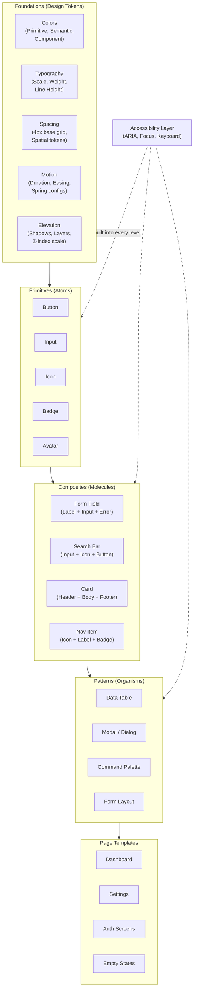

# UI & Design Systems

A design system is not a component library. It is a shared language between design and engineering — a set of constraints that make consistency the default and inconsistency require effort. This section covers the full stack of design system engineering, from the atomic building blocks to the organizational patterns that make systems succeed long-term.

## Why This Section Exists

Every team eventually builds a design system, whether they plan to or not. The question is whether it will be intentional or accidental. Accidental design systems — a mix of one-off components, copy-pasted styles, and undocumented conventions — create more problems than they solve.

This section gives you the architectural thinking to build an intentional system. You will learn not just how to build a `Button` component, but how to design a token architecture that supports theming, how to create component APIs that compose naturally, and how to structure your system so it evolves without breaking consumers.

## What You Will Learn

### Component Patterns
The engineering patterns behind great component libraries: compound components (like `Select` + `Select.Option`), polymorphic components (the `as` prop pattern), headless components (logic without markup), and controlled vs. uncontrolled APIs. Each pattern with TypeScript implementations and real trade-off analysis.

### Typography System
Mathematical type scales (Major Third, Perfect Fourth), responsive typography with `clamp()`, font loading strategies that eliminate layout shift, and a token structure that connects design intent to CSS output.

### Color Token Architecture
A three-tier token system — primitive (raw hex values), semantic (intent-based aliases), and component (scoped overrides). How to build a color system that supports dark mode, high-contrast mode, and brand theming without touching component code.

### Spacing & Layout
The 4px/8px base grid, spatial tokens, and layout primitives (`Stack`, `Cluster`, `Sidebar`, `Switcher`) that eliminate ad-hoc margin/padding. How to encode layout intent so your UI stays consistent across breakpoints.

### Accessibility
Not a checklist — a mindset. ARIA patterns for every common widget, keyboard navigation, focus management, screen reader testing workflows, and the legal and ethical case for accessibility-first development.

### Dark Mode & Theming
CSS custom properties as the theming primitive. How to structure tokens so theme switching is a single class toggle. Handling images, shadows, and elevation in dark mode without everything looking washed out.

### Animation & Motion
Meaningful motion that communicates state changes. Spring physics vs. easing curves, `prefers-reduced-motion` respect, GPU-accelerated properties, and the choreography of multi-element transitions.

## Design System Building Blocks

## Learning Path

| Order | Topic | Difficulty | Time |
|-------|-------|------------|------|
| 1 | Design token architecture | Beginner | 1.5 hr |
| 2 | Color system & theming | Intermediate | 2 hr |
| 3 | Typography & spacing | Beginner | 1.5 hr |
| 4 | Component API patterns | Intermediate | 2.5 hr |
| 5 | Accessibility deep-dive | Intermediate | 2 hr |
| 6 | Animation & motion design | Intermediate | 1.5 hr |
| 7 | Dark mode implementation | Intermediate | 1 hr |
| 8 | Design system governance | Advanced | 1.5 hr |

## Subsections

- **[Component Patterns](/ui-design-systems/components/)** — Compound, polymorphic, headless, and controlled component architectures
- **[Typography](/ui-design-systems/typography/)** — Type scales, responsive text, and font loading strategies
- **[Color Tokens](/ui-design-systems/color/)** — Multi-tier color architecture with dark mode and theming support
- **[Spacing & Layout](/ui-design-systems/spacing/)** — Grid systems, spatial tokens, and layout primitives
- **[Accessibility](/ui-design-systems/accessibility/)** — ARIA patterns, keyboard navigation, and screen reader support
- **[Dark Mode](/ui-design-systems/dark-mode/)** — Theme switching, token structure, and edge cases
- **[Animation](/ui-design-systems/animation/)** — Motion design, spring physics, and performance-safe animations
- **[Design System Governance](/ui-design-systems/governance/)** — Versioning, contribution models, and adoption strategies

---

> *"A design system is a product, not a project. It has users (developers and designers), it needs maintenance, and it must earn adoption — never mandate it."*
