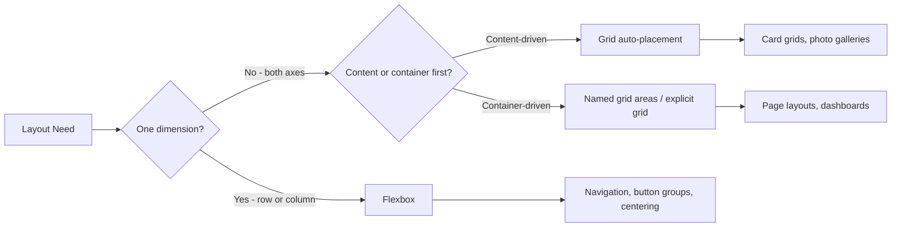

# Spacing & Layout Systems Overview

Spacing is the invisible architecture of an interface. Proper spacing groups related elements, separates unrelated ones, establishes visual hierarchy, and creates breathing room that makes content readable. Like typography, spacing that works is invisible — users never think "good spacing." They just find the interface easy to use.

## Why Spacing Systems Exist

Without a spacing system, every margin and padding decision becomes a micro-negotiation. A developer picks `margin-bottom: 20px` because "it looks about right." Another picks `16px` for a similar component. A third picks `24px`. The result: visually inconsistent spacing that no one can explain, defend, or maintain.

A spacing system enforces a **constraint**: all spacing values must come from a defined scale. If your scale is `[4, 8, 12, 16, 24, 32, 48, 64, 96]`, the debate between 18px and 20px never happens. Both aren't in the scale. The conversation becomes "should this be 16px or 24px?" — a structural question, not an aesthetic one.

## The 4px/8px Grid

Most modern design systems are built on a **4px base unit** (sometimes 8px). Every spacing value is a multiple of this unit:

$$
\text{space}(n) = 4n \text{ px}
$$

| Multiplier | 4px base | 8px base | Use Case |
|-----------|---------|---------|---------|
| 0.5 | 2px | — | Fine adjustments, icon padding |
| 1 | 4px | — | Tight spacing, compact UIs |
| 2 | 8px | 8px | Default small spacing |
| 3 | 12px | — | Medium-small |
| 4 | 16px | 16px | Default component spacing |
| 5 | 20px | — | Slightly generous |
| 6 | 24px | 24px | Card padding, section gaps |
| 8 | 32px | 32px | Large gaps |
| 10 | 40px | — | Section breaks |
| 12 | 48px | 48px | Large section spacing |
| 16 | 64px | 64px | Page-level spacing |
| 24 | 96px | — | Hero sections |

The advantage: all spacings on a 4px grid **align with each other**. Mix any combination of 8px + 16px + 32px gaps and everything lines up on an 8px grid.

## Layout Approaches

Modern CSS layout has three primary systems, each suited to different problems:



### Flexbox — One-Dimensional Layout

Flexbox excels at distributing items along a single axis — rows or columns:

```css
/* Canonical centering */
.center {
  display: flex;
  align-items: center;
  justify-content: center;
}

/* Navigation bar */
.navbar {
  display: flex;
  align-items: center;
  gap: var(--space-4);
  padding-inline: var(--space-6);
}

/* Push last item to end */
.card-footer {
  display: flex;
  align-items: center;
  gap: var(--space-2);
}
.card-footer .action {
  margin-inline-start: auto;
}
```

### Grid — Two-Dimensional Layout

CSS Grid handles complex two-dimensional layouts:

```css
/* 12-column page grid */
.page-grid {
  display: grid;
  grid-template-columns: repeat(12, 1fr);
  gap: var(--space-6);
  padding-inline: var(--space-8);
}

/* Named areas layout */
.page-layout {
  display: grid;
  grid-template-areas:
    "header header header"
    "sidebar main aside"
    "footer footer footer";
  grid-template-columns: 240px 1fr 200px;
  grid-template-rows: auto 1fr auto;
  min-height: 100vh;
}
```

## What's in This Section

| Page | Focus |
|------|-------|
| [Spacing Scale](./spacing-scale.md) | 4px/8px grid math, token generation, semantic spacing |
| [Layout Patterns](./layout-patterns.md) | Flexbox/Grid patterns, Holy Grail, intrinsic design |
| [Responsive Breakpoints](./responsive-breakpoints.md) | Mobile-first, content-driven, breakpoint strategy |
| [Container Queries](./container-queries.md) | @container, cqi/cqb units, component-level responsive |

## Quick Start Token Setup

```css
/* spacing/tokens.css */
:root {
  /* Base: 4px */
  --space-px: 1px;
  --space-0:  0;
  --space-0-5: 0.125rem;  /* 2px  */
  --space-1:   0.25rem;   /* 4px  */
  --space-1-5: 0.375rem;  /* 6px  */
  --space-2:   0.5rem;    /* 8px  */
  --space-2-5: 0.625rem;  /* 10px */
  --space-3:   0.75rem;   /* 12px */
  --space-3-5: 0.875rem;  /* 14px */
  --space-4:   1rem;      /* 16px */
  --space-5:   1.25rem;   /* 20px */
  --space-6:   1.5rem;    /* 24px */
  --space-7:   1.75rem;   /* 28px */
  --space-8:   2rem;      /* 32px */
  --space-9:   2.25rem;   /* 36px */
  --space-10:  2.5rem;    /* 40px */
  --space-11:  2.75rem;   /* 44px */
  --space-12:  3rem;      /* 48px */
  --space-14:  3.5rem;    /* 56px */
  --space-16:  4rem;      /* 64px */
  --space-20:  5rem;      /* 80px */
  --space-24:  6rem;      /* 96px */
  --space-28:  7rem;      /* 112px */
  --space-32:  8rem;      /* 128px */
  --space-36:  9rem;      /* 144px */
  --space-40:  10rem;     /* 160px */
  --space-48:  12rem;     /* 192px */
  --space-56:  14rem;     /* 224px */
  --space-64:  16rem;     /* 256px */
}
```
