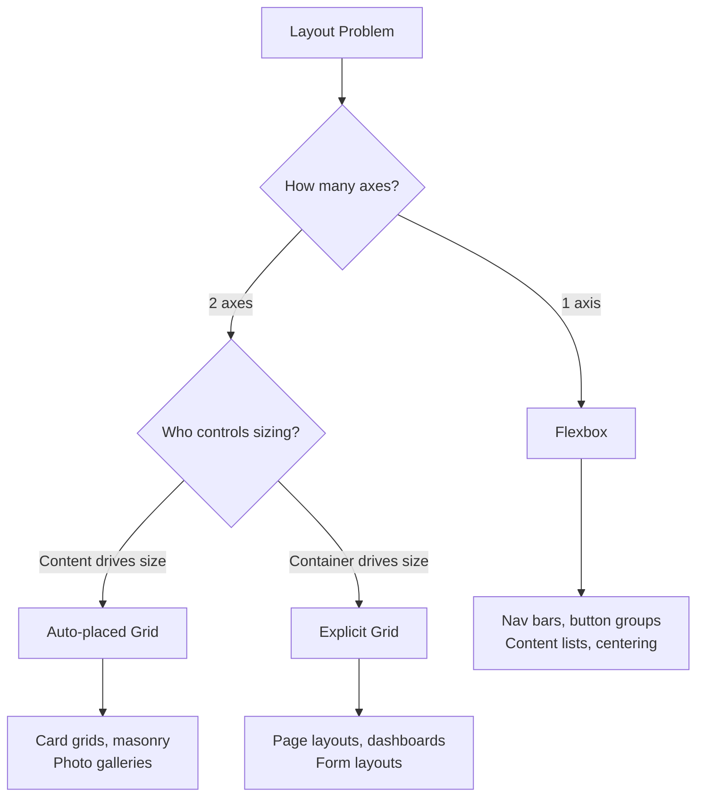

# Layout Patterns

CSS layout has matured dramatically. Flexbox and Grid eliminate the hacks that plagued float-based layouts. This page catalogs production-tested layout patterns — the compositions that appear in nearly every UI.

## Mental Model: Flex vs. Grid

Both Flexbox and Grid handle multi-element layouts, but they solve different problems:

**Flexbox** — content-first, single-axis:
- Items determine their own size
- Browser distributes remaining space
- One dimension at a time (row OR column)

**Grid** — container-first, two-axis:
- Container defines the track structure
- Items fill defined areas
- Rows AND columns simultaneously



## Flexbox Patterns

### Pattern 1: The Stack

A vertical list with uniform spacing:

```css
.stack {
  display: flex;
  flex-direction: column;
  gap: var(--space-4);
}

/* Variable stack with custom gap */
.stack[data-gap="sm"] { gap: var(--space-2); }
.stack[data-gap="md"] { gap: var(--space-4); }
.stack[data-gap="lg"] { gap: var(--space-6); }
.stack[data-gap="xl"] { gap: var(--space-8); }
```

```tsx
// Stack component — the single most useful layout primitive
interface StackProps {
  gap?: keyof typeof gapScale;
  align?: 'start' | 'center' | 'end' | 'stretch';
  as?: React.ElementType;
  children: React.ReactNode;
}

export function Stack({ gap = 'md', align = 'stretch', as: Tag = 'div', children }: StackProps) {
  return (
    <Tag
      style={​{
        display: 'flex',
        flexDirection: 'column',
        gap: `var(--space-${gapScale[gap]})`,
        alignItems: align,
      }}
    >
      {children}
    </Tag>
  );
}
```

### Pattern 2: The Cluster

A horizontal group of items that wraps to new lines when needed:

```css
.cluster {
  display: flex;
  flex-wrap: wrap;
  gap: var(--space-2);
  align-items: center;
}

/* Tag clouds, button groups, chip sets */
.tag-cloud {
  display: flex;
  flex-wrap: wrap;
  gap: var(--space-2);
}

/* Justify variations */
.cluster-spread { justify-content: space-between; }
.cluster-center { justify-content: center; }
.cluster-end    { justify-content: flex-end; }
```

### Pattern 3: The Switcher

Two columns that collapse to single column below a threshold:

```css
/* Items switch to stacked when container < threshold */
.switcher {
  display: flex;
  flex-wrap: wrap;
  gap: var(--space-4);
}

/* Each child: equal width, minimum 300px */
.switcher > * {
  flex-grow: 1;
  flex-basis: calc((30rem - 100%) * 999);
  /* When container > 30rem: positive basis → side by side */
  /* When container < 30rem: massive negative basis → each 100% */
}
```

This is pure CSS responsiveness without media queries — the layout switches based on the container width, not the viewport.

### Pattern 4: The Cover

A component that fills its container vertically, centering the main content:

```css
.cover {
  display: flex;
  flex-direction: column;
  min-height: 100vh; /* Or min-height: 100% */
  padding: var(--space-8);
}

/* The centered content */
.cover > :first-child  { margin-block-end: auto; } /* pushes center down */
.cover > .cover-center { margin-block: auto; }     /* vertically centered */
.cover > :last-child   { margin-block-start: auto; } /* pushes center up */

/* Hero section example */
.hero {
  display: flex;
  flex-direction: column;
  min-height: 80vh;
  justify-content: center;
  align-items: center;
  text-align: center;
  padding: var(--space-8);
}
```

### Pattern 5: The Sidebar

Main content + fixed-width sidebar that collapses gracefully:

```css
/* Intrinsic sidebar — collapses when combined width < 40rem */
.with-sidebar {
  display: flex;
  flex-wrap: wrap;
  gap: var(--space-6);
}

.sidebar {
  flex-grow: 1;
  flex-basis: 15rem; /* Sidebar minimum width */
  max-width: 20rem;
}

.main-content {
  flex-grow: 999; /* Grow much more than sidebar */
  flex-basis: 0;
  min-width: 50%; /* Prevent sidebar from being too wide */
}
```

When the container is wide enough, sidebar + main sit side by side. When narrow, they stack.

## CSS Grid Patterns

### Pattern 6: The 12-Column Grid

The industry-standard responsive grid:

```css
.grid-12 {
  display: grid;
  grid-template-columns: repeat(12, minmax(0, 1fr));
  gap: var(--space-6);
}

/* Column spans */
.col-1  { grid-column: span 1; }
.col-2  { grid-column: span 2; }
.col-3  { grid-column: span 3; }
.col-4  { grid-column: span 4; }
.col-6  { grid-column: span 6; }
.col-8  { grid-column: span 8; }
.col-9  { grid-column: span 9; }
.col-12 { grid-column: span 12; }

/* Responsive: full-width on mobile */
@media (max-width: 768px) {
  [class*="col-"] {
    grid-column: span 12;
  }
}
```

### Pattern 7: Auto-Fill Card Grid

Cards that automatically adjust column count based on available space:

```css
/* Responsive cards without media queries */
.card-grid {
  display: grid;
  grid-template-columns: repeat(auto-fill, minmax(min(100%, 280px), 1fr));
  gap: var(--space-6);
}

/* auto-fill: creates as many columns as fit
   minmax(280px, 1fr): each column is at least 280px, max 1fr
   min(100%, 280px): prevents a single column from being > 100% wide */
```

At 900px: 3 columns × ~280px
At 600px: 2 columns × ~280px
At 320px: 1 column × 320px

### Pattern 8: The Holy Grail Layout

The classic header/sidebar/main/aside/footer layout:

```css
.holy-grail {
  display: grid;
  grid-template-areas:
    "header  header  header"
    "sidebar main    aside"
    "footer  footer  footer";
  grid-template-columns: 240px 1fr 200px;
  grid-template-rows: auto 1fr auto;
  min-height: 100vh;
  gap: var(--space-4);
}

.holy-grail > header  { grid-area: header; }
.holy-grail > nav     { grid-area: sidebar; }
.holy-grail > main    { grid-area: main; }
.holy-grail > aside   { grid-area: aside; }
.holy-grail > footer  { grid-area: footer; }

/* Collapse to single column on mobile */
@media (max-width: 768px) {
  .holy-grail {
    grid-template-areas:
      "header"
      "main"
      "sidebar"
      "aside"
      "footer";
    grid-template-columns: 1fr;
    grid-template-rows: auto;
  }
}
```

### Pattern 9: The Masonry Layout

Variable-height cards in a grid (approximation — true CSS masonry is experimental):

```css
/* CSS masonry — experimental, limited support */
.masonry {
  display: grid;
  grid-template-columns: repeat(auto-fill, minmax(250px, 1fr));
  grid-template-rows: masonry; /* Experimental */
}

/* Current support: Chrome flag, Firefox flag */
/* Production: use JavaScript or CSS columns */

/* CSS Columns masonry — works everywhere */
.masonry-columns {
  columns: 3;
  column-gap: var(--space-6);
}

.masonry-columns > * {
  break-inside: avoid;
  margin-block-end: var(--space-6);
}
```

### Pattern 10: Dashboard Layout

Complex multi-panel dashboard with responsive collapse:

```css
.dashboard {
  display: grid;
  grid-template-columns: [sidebar-start] 260px [sidebar-end content-start] 1fr [content-end];
  grid-template-rows: [topbar-start] 56px [topbar-end content-start] 1fr [content-end];
  height: 100dvh;
  overflow: hidden;
}

.dashboard-sidebar {
  grid-column: sidebar;
  grid-row: 1 / -1; /* Span all rows */
  overflow-y: auto;
}

.dashboard-topbar {
  grid-column: content;
  grid-row: topbar;
}

.dashboard-content {
  grid-column: content;
  grid-row: content;
  overflow-y: auto;
}

/* Collapse sidebar on mobile */
@media (max-width: 1024px) {
  .dashboard {
    grid-template-columns: 1fr;
    grid-template-rows: 56px 1fr;
  }

  .dashboard-sidebar {
    position: fixed;
    inset: 0;
    transform: translateX(-100%);
    transition: transform 0.25s;
    z-index: 100;
  }

  .dashboard-sidebar.open {
    transform: translateX(0);
  }
}
```

## Intrinsic Design

Intrinsic design (coined by Jen Simmons) means designing layouts that respond to their content rather than arbitrary breakpoints:

```css
/* Intrinsic: column is exactly as wide as it needs to be */
.intrinsic-grid {
  display: grid;
  grid-template-columns: fit-content(30%) 1fr fit-content(20%);
}

/* Auto-fit vs auto-fill */
.auto-fit-grid {
  /* Stretches items to fill remaining space */
  grid-template-columns: repeat(auto-fit, minmax(200px, 1fr));
}

.auto-fill-grid {
  /* Keeps fixed-size empty tracks */
  grid-template-columns: repeat(auto-fill, minmax(200px, 1fr));
}

/* Subgrid — items inherit parent grid tracks */
.card-grid {
  display: grid;
  grid-template-columns: repeat(3, 1fr);
  grid-template-rows: masonry;
}

.card {
  display: grid;
  grid-row: span 3;
  grid-template-rows: subgrid; /* Inherit row tracks from parent */
}

.card-image    { grid-row: 1; }
.card-content  { grid-row: 2; }
.card-footer   { grid-row: 3; align-self: end; }
/* All card footers now align to the same baseline */
```

## The Every Layout Compositions

Andy Bell and Heydon Pickering's "Every Layout" defines reusable layout primitives:

```tsx
// Layout primitives as React components

// The Box: content-agnostic with padding/color
export function Box({
  padding = 'md',
  background,
  children,
}: {
  padding?: 'sm' | 'md' | 'lg';
  background?: string;
  children: React.ReactNode;
}) {
  return (
    <div
      style={​{
        padding: `var(--inset-${padding})`,
        background,
      }}
    >
      {children}
    </div>
  );
}

// The Center: horizontal centering with max-width
export function Center({
  max = '65ch',
  gutters,
  intrinsic = false,
  children,
}: {
  max?: string;
  gutters?: string;
  intrinsic?: boolean;
  children: React.ReactNode;
}) {
  return (
    <div
      style={​{
        boxSizing: 'content-box',
        maxWidth: max,
        marginInline: 'auto',
        paddingInline: gutters,
        ...(intrinsic ? { display: 'flex', flexDirection: 'column', alignItems: 'center' } : {}),
      }}
    >
      {children}
    </div>
  );
}

// The Cluster: wrapping inline items
export function Cluster({
  gap = 'sm',
  justify = 'flex-start',
  align = 'center',
  children,
}: {
  gap?: 'xs' | 'sm' | 'md' | 'lg';
  justify?: string;
  align?: string;
  children: React.ReactNode;
}) {
  return (
    <div
      style={​{
        display: 'flex',
        flexWrap: 'wrap',
        gap: `var(--space-${gapScale[gap]})`,
        justifyContent: justify,
        alignItems: align,
      }}
    >
      {children}
    </div>
  );
}

// The Grid: auto-responsive grid
export function Grid({
  min = '250px',
  gap = 'md',
  children,
}: {
  min?: string;
  gap?: 'sm' | 'md' | 'lg';
  children: React.ReactNode;
}) {
  return (
    <div
      style={​{
        display: 'grid',
        gridTemplateColumns: `repeat(auto-fill, minmax(min(${min}, 100%), 1fr))`,
        gap: `var(--space-${gapScale[gap]})`,
      }}
    >
      {children}
    </div>
  );
}

const gapScale = { xs: '2', sm: '4', md: '6', lg: '8', xl: '12' };
```

## Logical Properties

Use logical properties (CSS Logical Properties Level 1) for RTL/LTR compatibility:

```css
/* Physical → Logical equivalents */

/* Physical */
margin-left:   value;
margin-right:  value;
margin-top:    value;
margin-bottom: value;
padding-left:  value;
padding-right: value;

/* Logical (RTL/LTR-aware) */
margin-inline-start: value;  /* left in LTR, right in RTL */
margin-inline-end:   value;  /* right in LTR, left in RTL */
margin-block-start:  value;  /* top in horizontal writing */
margin-block-end:    value;  /* bottom in horizontal writing */
padding-inline:      value;  /* left and right (shorthand) */
padding-block:       value;  /* top and bottom (shorthand) */

/* Positioning */
inset-inline-start:  0;  /* left in LTR */
inset-block-start:   0;  /* top */

/* Complete production reset using logical properties */
.component {
  margin-block: var(--space-4);
  margin-inline: 0;
  padding-block: var(--space-6);
  padding-inline: var(--space-8);
}
```

::: info War Story
A fintech startup built their entire dashboard layout with absolute pixel margins and paddings. When they expanded to the Middle East and needed RTL support (Arabic, Hebrew), they discovered that "flip everything" required updating 2,000+ CSS declarations — every `margin-left` had to become `margin-right` and vice versa. After the migration to CSS logical properties, adding RTL support for a new language required adding a single `dir="rtl"` attribute to the HTML element. The migration to logical properties took 4 engineers 5 days.
:::
