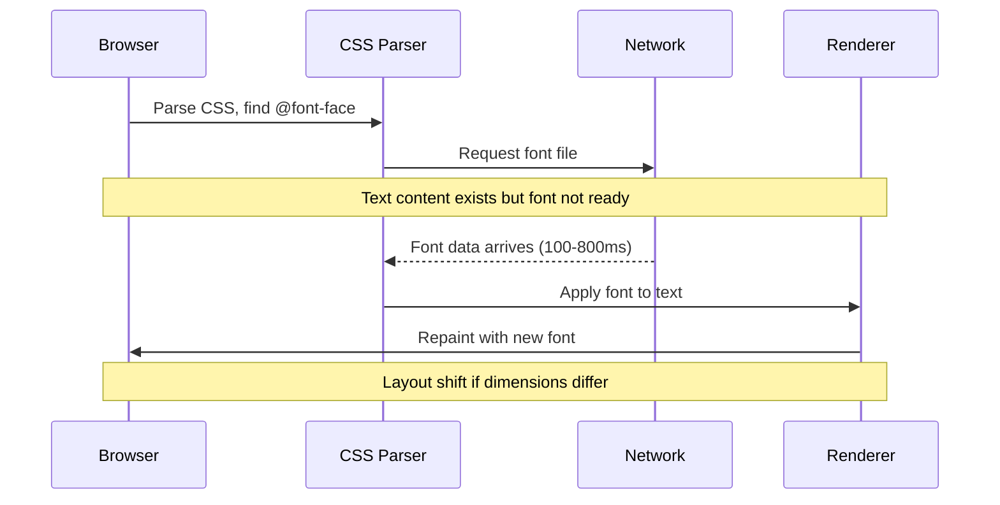
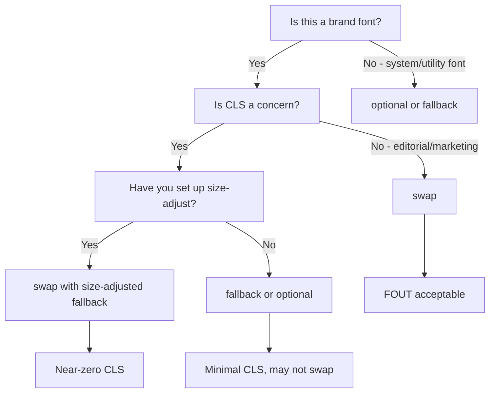

# Font Loading Strategies

Web fonts are one of the most impactful performance decisions in front-end engineering. A misconfigured font loading strategy causes invisible text, layout thrash, and poor Core Web Vitals scores. A well-configured strategy loads fonts in the background while rendering immediate, visually stable text.

## The Rendering Timeline Problem

When a browser encounters a web font reference in CSS:



During the network request, the browser must decide: show invisible text, show a fallback font, or block rendering?

## The Three Flash Problems

### FOIT — Flash of Invisible Text

The browser hides text completely while the font loads. Default behavior for many browsers (historically Chrome, Safari).

**Impact**: Users see blank space where text should be. If the font takes 2+ seconds to load (slow connection), content is completely unreadable during that window.

```css
/* This causes FOIT on slow connections */
@font-face {
  font-family: 'MyFont';
  src: url('/fonts/my-font.woff2') format('woff2');
  /* font-display defaults to 'auto' which is usually 'block' = FOIT */
}
```

### FOUT — Flash of Unstyled Text

Text renders in the fallback font immediately, then swaps to the web font when loaded.

**Impact**: Users see text twice — once in Arial/system-ui, once in the brand font. If the two fonts have different metrics (x-height, character width), the swap causes layout shift (CLS score impact).

### FOFT — Flash of Faux Text

A clever technique: load only the regular weight first (small file), then load the rest. The browser synthesizes bold and italic from the regular weight while the other weights load. When the real bold/italic files arrive, they replace the synthesized versions.

**Impact**: Minimal layout shift because font metrics stay consistent (same family throughout), and synthesized bold/italic are close enough to the real thing that most users don't notice the swap.

## font-display: The Control Lever

The `font-display` descriptor controls timing:

```css
@font-face {
  font-family: 'Inter';
  src: url('/fonts/inter-variable.woff2') format('woff2-variations');
  font-weight: 100 900;
  font-style: normal;
  font-display: swap; /* ← this one property changes everything */
}
```

| Value | Block Period | Swap Period | Effect |
|-------|-------------|-------------|--------|
| `auto` | Browser default (~3s) | Infinite | Typically same as `block` |
| `block` | ~3 seconds | Infinite | FOIT for up to 3s, then always swap |
| `swap` | Minimal (~0ms) | Infinite | FOUT immediately, always swaps when loaded |
| `fallback` | ~100ms | ~3s | Short FOIT, 3s swap window, then no swap |
| `optional` | ~100ms | 0 | Short FOIT, no swap if slow. Font cached for next load |

### Choosing font-display



**Decision guide:**
- **`swap`** — Brand fonts where brand identity matters more than CLS. Add size-adjusted fallbacks to reduce CLS.
- **`optional`** — Performance-critical paths. Fonts load in background, render on next visit. Zero layout shift guarantee.
- **`fallback`** — Balanced: short FOIT acceptable, 3-second window to swap, then stable.
- **`block`** — Only for icon fonts where fallback characters are meaningless/confusing.

## Preloading Font Files

`font-display` controls what happens *while* the font loads. Preloading controls *when* the load starts.

Without preload, the browser discovers fonts only after parsing CSS (which itself must load). The critical path is: HTML → CSS → font-face parse → font request.

With `<link rel="preload">`, the font starts downloading immediately when HTML is parsed:

```html
<head>
  <!-- Preload only the critical subset — regular weight -->
  <link
    rel="preload"
    href="/fonts/inter-var.woff2"
    as="font"
    type="font/woff2"
    crossorigin="anonymous"
  />

  <!-- CSS loads after, but font is already downloading -->
  <link rel="stylesheet" href="/styles/global.css" />
</head>
```

::: warning crossorigin is required
Even for same-origin fonts, `crossorigin="anonymous"` is required. Without it, the browser makes two requests: one from the preload (no CORS), one from the `@font-face` rule (with CORS). The font loads twice and the preload is wasted.
:::

### What to Preload

Only preload fonts used above the fold. Each preloaded font is a high-priority request — preloading 8 fonts defeats the purpose.

```typescript
// Next.js font preloading
// app/layout.tsx
export default function RootLayout({ children }: { children: React.ReactNode }) {
  return (
    <html lang="en">
      <head>
        {/* Only the variable font used for body text */}
        <link
          rel="preload"
          href="/fonts/inter-var-latin.woff2"
          as="font"
          type="font/woff2"
          crossOrigin="anonymous"
        />
      </head>
      <body>{children}</body>
    </html>
  );
}
```

## Size-Adjusted Fallback Fonts

The main cause of CLS from font swaps is metric differences between the web font and the fallback. If Inter's glyphs are 8% wider than Arial's, every line reflows when the font swaps.

CSS `size-adjust` scales the fallback font to match the web font's metrics:

```css
/* The web font */
@font-face {
  font-family: 'Inter';
  src: url('/fonts/inter-var.woff2') format('woff2-variations');
  font-weight: 100 900;
  font-display: swap;
}

/* Size-adjusted fallback that mimics Inter's metrics */
@font-face {
  font-family: 'Inter Fallback';
  src: local('Arial');
  size-adjust: 107%;          /* Inter is slightly wider than Arial */
  ascent-override: 90%;       /* Adjust ascent to match Inter */
  descent-override: 22%;      /* Adjust descent */
  line-gap-override: 0%;      /* Inter has no line gap */
}

body {
  font-family: 'Inter', 'Inter Fallback', system-ui, sans-serif;
}
```

### Calculating size-adjust

The `size-adjust` value is the ratio of fallback font's average character width to the web font's average character width. You can measure this:

```javascript
// measure-font-metrics.js
// Run in browser devtools to measure both fonts
function measureFontWidth(fontFamily, sampleText = 'Hello World') {
  const canvas = document.createElement('canvas');
  const ctx = canvas.getContext('2d');
  ctx.font = `16px ${fontFamily}`;
  return ctx.measureText(sampleText).width;
}

const interWidth = measureFontWidth('Inter');
const arialWidth = measureFontWidth('Arial');
const sizeAdjust = (interWidth / arialWidth * 100).toFixed(1) + '%';
console.log('size-adjust:', sizeAdjust);
```

### Automating fallback generation

```typescript
// scripts/generate-font-fallbacks.ts
// Uses fonttools or opentype.js to read font metrics

interface FontMetrics {
  ascender: number;
  descender: number;
  lineGap: number;
  unitsPerEm: number;
  xHeight: number;
  capHeight: number;
  averageWidth: number;
}

interface FallbackConfig {
  webFontFamily: string;
  webFontMetrics: FontMetrics;
  fallbackFamily: string;
  fallbackMetrics: FontMetrics;
}

function generateFallbackFontFace(config: FallbackConfig): string {
  const { webFontFamily, webFontMetrics, fallbackFamily, fallbackMetrics } = config;

  const sizeAdjust = (webFontMetrics.averageWidth / fallbackMetrics.averageWidth) * 100;
  const ascentOverride = (webFontMetrics.ascender / fallbackMetrics.ascender) * 100;
  const descentOverride = (Math.abs(webFontMetrics.descender) / Math.abs(fallbackMetrics.descender)) * 100;
  const lineGapOverride = (webFontMetrics.lineGap / fallbackMetrics.unitsPerEm) * 100;

  return `
@font-face {
  font-family: '${webFontFamily} Fallback';
  src: local('${fallbackFamily}');
  size-adjust: ${sizeAdjust.toFixed(2)}%;
  ascent-override: ${ascentOverride.toFixed(2)}%;
  descent-override: ${descentOverride.toFixed(2)}%;
  line-gap-override: ${lineGapOverride.toFixed(2)}%;
}`.trim();
}
```

## FOFT Implementation

Flash of Faux Text in practice:

```css
/* Stage 1: Load Roman (regular) weight only */
@font-face {
  font-family: 'Merriweather Roman';
  src: url('/fonts/merriweather-regular.woff2') format('woff2');
  font-weight: 400;
  font-style: normal;
  font-display: swap;
}

/* Stage 2: Load additional weights */
@font-face {
  font-family: 'Merriweather';
  src: url('/fonts/merriweather-bold.woff2') format('woff2');
  font-weight: 700;
  font-style: normal;
  font-display: swap;
}

@font-face {
  font-family: 'Merriweather';
  src: url('/fonts/merriweather-italic.woff2') format('woff2');
  font-weight: 400;
  font-style: italic;
  font-display: swap;
}

/* Use the Roman family first — browser synthesizes bold/italic */
body {
  font-family: 'Merriweather Roman', serif;
}

/* Override to real family once JS confirms it loaded */
.fonts-loaded body {
  font-family: 'Merriweather', serif;
}
```

```javascript
// Font loading detection
document.fonts.load('400 1em Merriweather Roman').then(() => {
  document.documentElement.classList.add('fonts-stage-1');

  return document.fonts.load('700 1em Merriweather');
}).then(() => {
  document.documentElement.classList.add('fonts-stage-2');
}).catch(console.error);
```

## CSS Font Loading API

Modern way to detect font load state without JavaScript polling:

```typescript
// hooks/useFontLoading.ts
import { useState, useEffect } from 'react';

interface FontLoadingState {
  status: 'loading' | 'loaded' | 'error';
  loadTime?: number;
}

export function useFontLoading(fontFamilies: string[]): FontLoadingState {
  const [state, setState] = useState<FontLoadingState>({ status: 'loading' });

  useEffect(() => {
    const startTime = performance.now();

    const loadPromises = fontFamilies.map(family =>
      document.fonts.load(`400 1em ${family}`)
    );

    Promise.all(loadPromises)
      .then(() => {
        setState({
          status: 'loaded',
          loadTime: performance.now() - startTime,
        });
      })
      .catch(() => {
        setState({ status: 'error' });
      });

    // Also listen for ready event
    document.fonts.ready.then(() => {
      setState(prev =>
        prev.status === 'loading'
          ? { status: 'loaded', loadTime: performance.now() - startTime }
          : prev
      );
    });
  }, [fontFamilies]);

  return state;
}

// Usage in component
function App() {
  const { status, loadTime } = useFontLoading(['Inter', 'Inter']);

  useEffect(() => {
    if (status === 'loaded') {
      document.documentElement.setAttribute('data-fonts', 'loaded');
    }
  }, [status]);

  return <div data-font-status={status}>...</div>;
}
```

## Font Subsetting

Full Unicode fonts are large. Inter Variable (all weights, all languages) is ~300KB. But if your site is English-only, you need perhaps 200 of the 3000 glyphs.

Subsetting removes unused glyphs:

```bash
# Using fonttools (Python)
pip install fonttools brotli

# Subset to Latin + common Unicode blocks
pyftsubset \
  input-font.ttf \
  --output-file=output-font.woff2 \
  --flavor=woff2 \
  --layout-features="kern,liga,calt,ss01,ss02" \
  --unicodes="U+0020-007E,U+00A0-00FF,U+0131,U+0152-0153,U+02C6,U+02DA,U+02DC,U+2000-206F,U+2074,U+20AC,U+2122,U+2191,U+2193,U+2212,U+2215,U+FEFF,U+FFFD"
```

**Size reduction examples (Inter):**

| Subset | Glyphs | WOFF2 Size | Savings |
|--------|--------|------------|---------|
| Full (all languages) | 3,142 | 318KB | — |
| Latin Extended | 486 | 42KB | 87% |
| Latin Basic | 226 | 28KB | 91% |
| ASCII only | 95 | 18KB | 94% |

## Next.js Font Optimization

Next.js has `next/font` which handles everything automatically:

```typescript
// app/layout.tsx
import { Inter } from 'next/font/google';

const inter = Inter({
  subsets: ['latin'],
  variable: '--font-inter',
  display: 'swap',
  preload: true,
  fallback: ['system-ui', 'arial'],
  adjustFontFallback: true, // Automatically calculates size-adjust
  weight: ['400', '500', '600', '700'],
});

export default function RootLayout({ children }: { children: React.ReactNode }) {
  return (
    <html lang="en" className={inter.variable}>
      <body className={inter.className}>{children}</body>
    </html>
  );
}
```

What `next/font` does behind the scenes:
1. Downloads font at build time (no GDPR issues, no external requests)
2. Self-hosts the font file in `/_next/static/media/`
3. Automatically subsets to requested subsets
4. Generates optimized `@font-face` with `size-adjust` for fallbacks
5. Injects preload links in `<head>`
6. Handles cache headers (immutable, 1 year)

## Measuring CLS from Fonts

```typescript
// monitoring/font-cls.ts
export function monitorFontCLS(): void {
  let totalCLS = 0;
  let fontSwapCLS = 0;

  const observer = new PerformanceObserver((list) => {
    for (const entry of list.getEntries()) {
      const shift = entry as PerformanceEntry & {
        value: number;
        hadRecentInput: boolean;
        sources?: Array<{ node: Element; previousRect: DOMRectReadOnly; currentRect: DOMRectReadOnly }>;
      };

      if (shift.hadRecentInput) continue;

      totalCLS += shift.value;

      // Check if shift involves text nodes (likely font swap)
      if (shift.sources) {
        for (const source of shift.sources) {
          if (source.node?.nodeType === Node.TEXT_NODE ||
              source.node?.tagName === 'P' ||
              source.node?.tagName === 'H1') {
            fontSwapCLS += shift.value;
            console.warn('Font-related layout shift:', shift.value, source.node);
          }
        }
      }
    }
  });

  observer.observe({ type: 'layout-shift', buffered: true });

  // Report after fonts are stable
  document.fonts.ready.then(() => {
    setTimeout(() => {
      console.log({
        totalCLS: totalCLS.toFixed(4),
        fontSwapCLS: fontSwapCLS.toFixed(4),
        status: totalCLS < 0.1 ? 'PASS' : 'FAIL',
      });
    }, 1000); // Wait for any late swaps
  });
}
```

## Performance Budgets for Fonts

| Metric | Target | Stretch Goal |
|--------|--------|--------------|
| Total font bytes (above fold) | <100KB | <50KB |
| Font CLS contribution | <0.05 | 0 |
| Time to first font swap | <200ms (fast 3G) | N/A |
| WOFF2 for body text font | <30KB | <20KB |
| Number of @font-face declarations | ≤4 | ≤2 |

::: info War Story
An e-commerce site had a 0.45 CLS score, failing Google's "Good" threshold of <0.1. The culprit: 6 font files loading with no preload, `font-display: auto`, and a fallback font with completely different metrics. Every page load showed Arial for 600-900ms, then reflow when the custom font loaded. The fix took 45 minutes: add 2 preload links, switch to `font-display: swap`, add `size-adjust` to the fallback. CLS dropped from 0.45 to 0.02.
:::

## Complete @font-face Setup

```css
/* === INTER VARIABLE FONT SETUP === */

/* Variable font — covers weight 100-900, no separate files */
@font-face {
  font-family: 'Inter';
  src:
    url('/fonts/inter-var-latin.woff2') format('woff2 supports variations'),
    url('/fonts/inter-var-latin.woff2') format('woff2-variations');
  font-weight: 100 900;
  font-style: normal;
  font-display: swap;
  /* Instruct browser to use font-synthesis for oblique angles */
  font-style: oblique 0deg 20deg;
}

/* Italic axis (if the font supports it) */
@font-face {
  font-family: 'Inter';
  src: url('/fonts/inter-var-latin.woff2') format('woff2-variations');
  font-weight: 100 900;
  font-style: italic;
  font-display: swap;
}

/* Size-adjusted fallback — eliminates FOUT layout shift */
@font-face {
  font-family: 'Inter Fallback';
  src: local('Arial'), local('Helvetica');
  size-adjust: 107.4%;
  ascent-override: 90%;
  descent-override: 22%;
  line-gap-override: 0%;
}

/* Apply in order: web font → adjusted fallback → system fallback */
:root {
  --font-sans:
    'Inter',
    'Inter Fallback',
    system-ui,
    -apple-system,
    BlinkMacSystemFont,
    'Segoe UI',
    sans-serif;
}

body {
  font-family: var(--font-sans);
}
```
