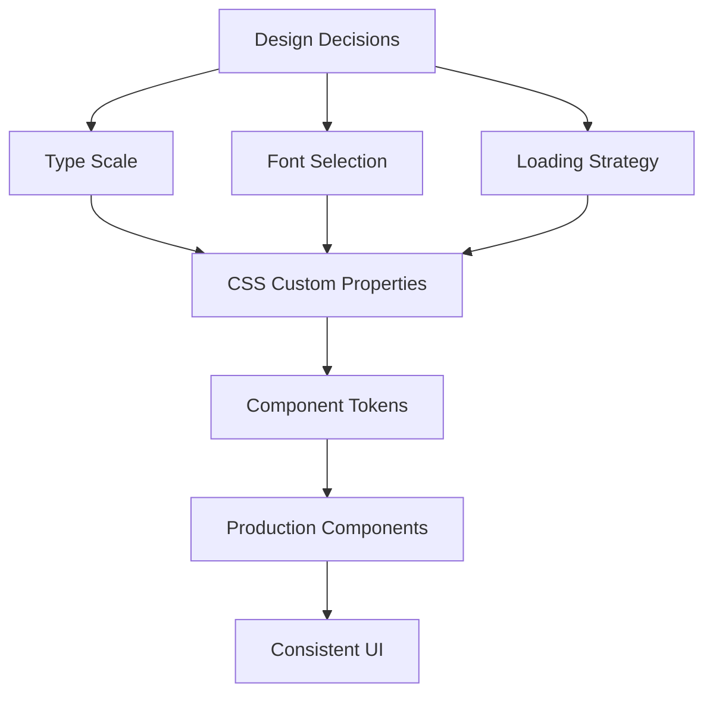
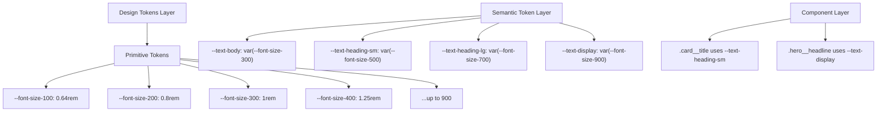

# Typography System Overview

Typography is the backbone of every interface. It conveys hierarchy, tone, brand personality, and — most critically — meaning. A poorly considered typography system creates cognitive friction; a well-engineered one becomes invisible, letting content breathe.

This section covers the complete engineering of a production-grade typography system: from the mathematical underpinnings of type scales, through the performance implications of font loading, to the bleeding-edge capabilities of variable fonts and fluid responsive scaling.

## Why Typography Systems Exist

Before CSS frameworks and design tokens, every developer made independent decisions: which font, which size, which line-height. The result was visual chaos — 14 different font sizes across a single product, inconsistent spacing between headings and body text, and zero coherence across teams.

The problem compounds at scale. A 10-engineer product team with no typography system will produce components with:
- Font sizes chosen arbitrarily (17px, 22px, 31px, 44px — no relationship)
- Line heights that ignore the font's internal metrics
- Inconsistent weight usage (mixing 400, 500, 600, 700, and 800 randomly)
- Different fonts loaded on different pages as engineers copy-paste from different sources

A typography **system** solves this by establishing:
1. A mathematical scale with predictable ratios
2. Semantic naming so components reference *intent* not *pixels*
3. A loading strategy that eliminates layout shift
4. Responsive rules that scale type meaningfully across viewport widths



## The Four Pillars of Typography Engineering

### 1. Type Scale — Mathematical Harmony

Rather than arbitrary sizes, a type scale uses a fixed ratio (the *modular scale*) to generate all sizes from a base. Common ratios:

| Ratio | Name | Use Case |
|-------|------|----------|
| 1.067 | Minor Second | Dense UIs, data tables |
| 1.125 | Major Second | Standard web apps |
| 1.200 | Minor Third | Marketing pages |
| 1.250 | Major Third | Editorial, blogs |
| 1.333 | Perfect Fourth | Display typography |
| 1.414 | Augmented Fourth | High contrast hierarchy |
| 1.500 | Perfect Fifth | Bold visual hierarchy |
| 1.618 | Golden Ratio | Classical proportions |

The formula is simple: `size(n) = base × ratio^n`

For a 1rem base with a 1.25 ratio (Major Third):

| Step | Formula | Result |
|------|---------|--------|
| -2 | 1 × 1.25^-2 | 0.64rem |
| -1 | 1 × 1.25^-1 | 0.8rem |
| 0 | 1 × 1.25^0 | 1rem |
| 1 | 1 × 1.25^1 | 1.25rem |
| 2 | 1 × 1.25^2 | 1.5625rem |
| 3 | 1 × 1.25^3 | 1.953rem |
| 4 | 1 × 1.25^4 | 2.44rem |
| 5 | 1 × 1.25^5 | 3.05rem |

See [Type Scale](./type-scale.md) for the full mathematical treatment.

### 2. Font Loading — Avoiding Flash

Web fonts are render-blocking by nature. Without a loading strategy, users see:
- **FOIT** (Flash of Invisible Text): browser hides text while font loads
- **FOUT** (Flash of Unstyled Text): system font shows, then swaps
- **CLS** (Cumulative Layout Shift): metrics penalty when font swaps cause reflow

The `font-display` descriptor, preloading, and fallback font sizing together reduce CLS to near zero. See [Font Loading](./font-loading.md).

### 3. Variable Fonts — One File, Infinite Variation

Traditional fonts require a separate file per weight: `regular.woff2`, `bold.woff2`, `italic.woff2`, etc. A variable font encodes all variations on a continuous axis in a single file — typically achieving 60-80% file size reduction while unlocking previously impossible mid-axis values (weight 350, width 87%).

See [Variable Fonts](./variable-fonts.md).

### 4. Responsive Typography — Fluid Scaling

Static font sizes break at extreme viewport widths. A `font-size: 48px` heading looks enormous on a 320px mobile screen and undersized on a 2560px 4K display. The `clamp()` function enables fluid scaling:

```css
font-size: clamp(1.5rem, 4vw, 3rem);
```

This scales linearly between a minimum and maximum, eliminating most breakpoint-specific overrides. See [Responsive Typography](./responsive-typography.md).

## System Architecture

A complete typography system layers these concerns:



## Core CSS Implementation

```css
/* typography/tokens.css */
:root {
  /* ---- Font Families ---- */
  --font-sans: 'Inter Variable', 'Inter', system-ui, -apple-system,
               BlinkMacSystemFont, 'Segoe UI', sans-serif;
  --font-serif: 'Source Serif 4 Variable', 'Georgia', 'Times New Roman', serif;
  --font-mono: 'JetBrains Mono Variable', 'Fira Code', 'Cascadia Code',
               'Consolas', 'Courier New', monospace;

  /* ---- Type Scale (Major Third, 1.25 ratio) ---- */
  --font-size-2xs: 0.64rem;     /* 10.24px @ 16px base */
  --font-size-xs:  0.8rem;      /* 12.8px */
  --font-size-sm:  0.875rem;    /* 14px — common body text */
  --font-size-md:  1rem;        /* 16px — base */
  --font-size-lg:  1.25rem;     /* 20px */
  --font-size-xl:  1.5625rem;   /* 25px */
  --font-size-2xl: 1.953rem;    /* 31.25px */
  --font-size-3xl: 2.441rem;    /* 39px */
  --font-size-4xl: 3.052rem;    /* 48.8px */
  --font-size-5xl: 3.815rem;    /* 61px */

  /* ---- Fluid Sizes (clamp) ---- */
  --font-size-fluid-sm: clamp(0.875rem, 1.5vw, 1rem);
  --font-size-fluid-md: clamp(1rem, 2vw, 1.25rem);
  --font-size-fluid-lg: clamp(1.25rem, 3vw, 1.953rem);
  --font-size-fluid-xl: clamp(1.953rem, 5vw, 3.052rem);
  --font-size-fluid-2xl: clamp(2.441rem, 7vw, 3.815rem);

  /* ---- Line Heights ---- */
  --line-height-none: 1;
  --line-height-tight: 1.15;
  --line-height-snug: 1.375;
  --line-height-normal: 1.5;
  --line-height-relaxed: 1.625;
  --line-height-loose: 2;

  /* ---- Letter Spacing ---- */
  --letter-spacing-tighter: -0.05em;
  --letter-spacing-tight: -0.025em;
  --letter-spacing-normal: 0em;
  --letter-spacing-wide: 0.025em;
  --letter-spacing-wider: 0.05em;
  --letter-spacing-widest: 0.1em;

  /* ---- Font Weights ---- */
  --font-weight-thin: 100;
  --font-weight-extralight: 200;
  --font-weight-light: 300;
  --font-weight-normal: 400;
  --font-weight-medium: 500;
  --font-weight-semibold: 600;
  --font-weight-bold: 700;
  --font-weight-extrabold: 800;
  --font-weight-black: 900;
}
```

## Semantic Typography Classes

Translating tokens into utility classes:

```typescript
// typography/styles.ts — generates semantic CSS classes
export const typographyStyles = `
  .text-display {
    font-size: var(--font-size-fluid-2xl);
    font-weight: var(--font-weight-bold);
    line-height: var(--line-height-tight);
    letter-spacing: var(--letter-spacing-tight);
    font-family: var(--font-sans);
  }

  .text-h1 {
    font-size: var(--font-size-fluid-xl);
    font-weight: var(--font-weight-bold);
    line-height: var(--line-height-tight);
    letter-spacing: var(--letter-spacing-tight);
  }

  .text-h2 {
    font-size: var(--font-size-fluid-lg);
    font-weight: var(--font-weight-semibold);
    line-height: var(--line-height-snug);
    letter-spacing: var(--letter-spacing-tight);
  }

  .text-h3 {
    font-size: var(--font-size-xl);
    font-weight: var(--font-weight-semibold);
    line-height: var(--line-height-snug);
  }

  .text-h4 {
    font-size: var(--font-size-lg);
    font-weight: var(--font-weight-medium);
    line-height: var(--line-height-normal);
  }

  .text-body-lg {
    font-size: var(--font-size-fluid-md);
    font-weight: var(--font-weight-normal);
    line-height: var(--line-height-relaxed);
  }

  .text-body {
    font-size: var(--font-size-fluid-sm);
    font-weight: var(--font-weight-normal);
    line-height: var(--line-height-normal);
  }

  .text-body-sm {
    font-size: var(--font-size-sm);
    font-weight: var(--font-weight-normal);
    line-height: var(--line-height-normal);
  }

  .text-caption {
    font-size: var(--font-size-xs);
    font-weight: var(--font-weight-normal);
    line-height: var(--line-height-normal);
    letter-spacing: var(--letter-spacing-wide);
  }

  .text-overline {
    font-size: var(--font-size-xs);
    font-weight: var(--font-weight-semibold);
    line-height: var(--line-height-normal);
    letter-spacing: var(--letter-spacing-wider);
    text-transform: uppercase;
  }

  .text-code {
    font-family: var(--font-mono);
    font-size: 0.875em; /* relative to parent */
    font-weight: var(--font-weight-normal);
    line-height: var(--line-height-relaxed);
  }
`;
```

## React Typography Components

```tsx
// components/Typography/index.tsx
import React from 'react';
import styles from './Typography.module.css';

type TextVariant =
  | 'display'
  | 'h1' | 'h2' | 'h3' | 'h4' | 'h5' | 'h6'
  | 'body-lg' | 'body' | 'body-sm'
  | 'caption' | 'overline' | 'code';

type TextElement = 'h1' | 'h2' | 'h3' | 'h4' | 'h5' | 'h6' | 'p' | 'span' | 'div' | 'code' | 'pre';

interface TextProps {
  variant?: TextVariant;
  as?: TextElement;
  weight?: 'thin' | 'extralight' | 'light' | 'normal' | 'medium' | 'semibold' | 'bold' | 'extrabold' | 'black';
  align?: 'left' | 'center' | 'right' | 'justify';
  color?: string; // CSS custom property or value
  truncate?: boolean;
  clamp?: number; // line clamp
  balance?: boolean; // text-wrap: balance
  className?: string;
  children: React.ReactNode;
}

const variantToElement: Record<TextVariant, TextElement> = {
  display: 'h1',
  h1: 'h1', h2: 'h2', h3: 'h3', h4: 'h4', h5: 'h5', h6: 'h6',
  'body-lg': 'p', body: 'p', 'body-sm': 'p',
  caption: 'span', overline: 'span', code: 'code',
};

export const Text: React.FC<TextProps> = ({
  variant = 'body',
  as,
  weight,
  align,
  color,
  truncate = false,
  clamp,
  balance = false,
  className,
  children,
}) => {
  const Tag = (as ?? variantToElement[variant]) as TextElement;

  const style: React.CSSProperties = {
    ...(color ? { color } : {}),
    ...(clamp ? {
      display: '-webkit-box',
      WebkitLineClamp: clamp,
      WebkitBoxOrient: 'vertical' as const,
      overflow: 'hidden',
    } : {}),
    ...(balance ? { textWrap: 'balance' as never } : {}),
  };

  const classNames = [
    styles[`text-${variant}`],
    weight ? styles[`weight-${weight}`] : '',
    align ? styles[`align-${align}`] : '',
    truncate ? styles.truncate : '',
    className,
  ].filter(Boolean).join(' ');

  return (
    <Tag className={classNames} style={style}>
      {children}
    </Tag>
  );
};

// Convenience wrappers
export const Display: React.FC<Omit<TextProps, 'variant'>> = (props) => (
  <Text variant="display" {...props} />
);
export const H1: React.FC<Omit<TextProps, 'variant'>> = (props) => (
  <Text variant="h1" {...props} />
);
export const Body: React.FC<Omit<TextProps, 'variant'>> = (props) => (
  <Text variant="body" {...props} />
);
export const Caption: React.FC<Omit<TextProps, 'variant'>> = (props) => (
  <Text variant="caption" {...props} />
);
```

## Font Selection Criteria

Choosing a font is not purely aesthetic. Engineering considerations:

| Criterion | Details |
|-----------|---------|
| **Variable font availability** | Single file vs. multiple weight files |
| **WOFF2 file size** | Aim for <50KB per weight for body fonts |
| **Subsetting support** | Can unused glyphs be removed? |
| **License** | OFL, commercial, SIL — check embedding rights |
| **Fallback similarity** | How close is it to system-ui? |
| **x-height ratio** | Higher x-height = better legibility at small sizes |
| **OpenType features** | Ligatures, tabular nums, contextual alternates |
| **GDPR considerations** | Self-hosting vs. Google Fonts |

### Top Picks by Category

**Sans-serif (UI):**
- Inter (free, variable, excellent for screens)
- Geist (Vercel, variable, modern)
- Plus Jakarta Sans (free, variable)

**Serif (editorial):**
- Source Serif 4 (variable, Google)
- Playfair Display (variable, editorial)
- Newsreader (variable, long-form)

**Monospace (code):**
- JetBrains Mono (ligatures, variable)
- Fira Code (ligatures)
- Cascadia Code (ligatures, Microsoft)

## Measuring Typography Quality

Key metrics to track after implementing a typography system:

```typescript
// Measure typography-related CLS
const observer = new PerformanceObserver((list) => {
  let clsScore = 0;
  for (const entry of list.getEntries()) {
    const layoutShift = entry as PerformanceEntry & {
      hadRecentInput: boolean;
      value: number;
    };
    if (!layoutShift.hadRecentInput) {
      clsScore += layoutShift.value;
    }
  }
  console.log('CLS from layout shifts (target < 0.1):', clsScore);
});

observer.observe({ type: 'layout-shift', buffered: true });

// Font loading timing
const fontFace = document.fonts;
fontFace.ready.then(() => {
  const navEntry = performance.getEntriesByType('navigation')[0] as PerformanceNavigationTiming;
  const fontLoadTime = performance.now() - navEntry.startTime;
  console.log(`Fonts ready at ${fontLoadTime.toFixed(0)}ms`);
});

// Check which fonts loaded
document.fonts.forEach((font) => {
  console.log(`${font.family} ${font.weight} ${font.style}: ${font.status}`);
});
```

::: tip Performance Target
Typography should contribute zero CLS (Cumulative Layout Shift). With correct `font-display: optional` or size-adjusted fallbacks, CLS from font swaps can be eliminated entirely.
:::

::: warning Common Mistake
Never set `font-display: block` in production. It causes FOIT — users see invisible text for up to 3 seconds. Use `swap` for brand fonts or `optional` for performance-critical paths.
:::

## What's in This Section

| Page | Focus |
|------|-------|
| [Type Scale](./type-scale.md) | Modular scale math, CSS clamp(), token generation |
| [Font Loading](./font-loading.md) | FOIT/FOUT/FOFT, font-display, preload, fallback sizing |
| [Variable Fonts](./variable-fonts.md) | Axes, animation, file optimization, browser support |
| [Responsive Typography](./responsive-typography.md) | Fluid type, viewport units, clamp() formulas |

## Reading Order

If you're setting up a new design system from scratch:

1. Start with **Type Scale** to establish your mathematical foundation
2. Choose fonts and implement **Font Loading** for performance
3. Adopt **Variable Fonts** if your chosen fonts support them
4. Apply **Responsive Typography** to make the scale fluid

If you're auditing an existing system, start with **Font Loading** — it has the highest impact on Core Web Vitals and is often the most neglected.

::: info War Story
A startup shipped their redesign with beautiful custom typography. Three days later, their CEO asked why the blog felt "jumpy." Investigation revealed FOUT on every page load — the custom font took 800ms to load on a standard 4G connection, during which the fallback Arial caused a 12px line-height difference that shifted the entire page layout. The fix was a 20-minute implementation of `font-display: swap` with a size-adjusted fallback — but it could have been avoided entirely with a loading strategy from day one.
:::
