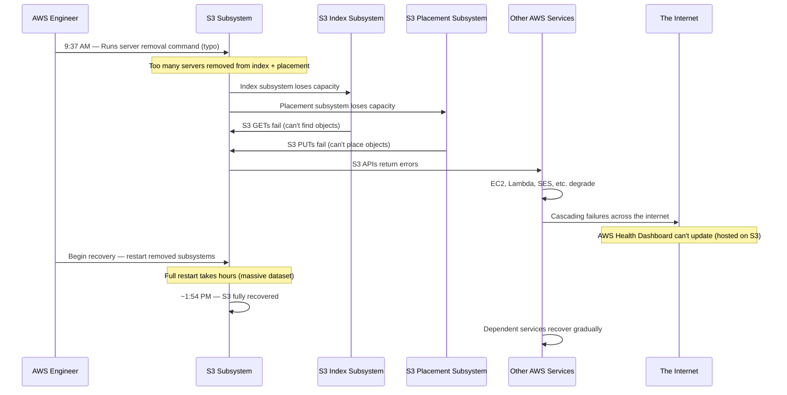
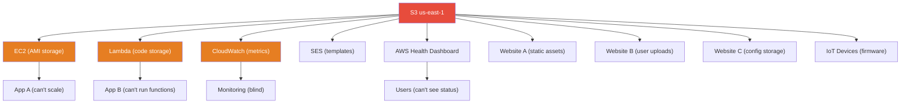

# AWS S3 Outage — The Typo That Broke the Internet (February 2017)

On February 28, 2017, at approximately 9:37 AM PST, an authorized Amazon engineer executing a routine maintenance command on the S3 subsystem in the US-EAST-1 region mistyped a parameter, removing far more servers from service than intended. The result was a four-hour cascade that took down not just S3, but a staggering number of services — including other AWS services — that depended on S3 in us-east-1. For several hours, a significant portion of the internet was broken.

The incident exposed a fundamental truth about cloud architecture: when a service becomes so ubiquitous that everything depends on it, that service becomes a single point of failure for the entire ecosystem — regardless of how many nines its SLA promises.

## The Alert

At 9:37 AM PST, S3 began returning elevated error rates in us-east-1. Within minutes, the error rates escalated to complete unavailability for many S3 operations. Because S3 is a foundational service that other AWS services depend on, the failure cascaded rapidly.

Ironically, the AWS Service Health Dashboard itself could not be updated because it was hosted on S3. For the first hour, the dashboard showed all green while the internet was on fire.

::: danger What Went Wrong First
An engineer running a routine playbook to remove a small number of S3 servers (for billing system debugging) entered an incorrect parameter. The command removed a much larger set of servers than intended, taking down a critical subsystem of S3.
:::

## Impact

- **Duration**: Approximately 4 hours (9:37 AM to ~1:54 PM PST)
- **Region**: AWS US-EAST-1 (Northern Virginia), the largest and most commonly used AWS region
- **Services affected directly**: S3 GET/PUT/LIST/DELETE operations
- **AWS services affected by cascade**: EC2 (new instance launches), EBS (new volume creation), Lambda, SES, SQS, SNS, CloudWatch, and many more
- **External services affected**: Quora, Trello, IFTTT, Autodesk, Coursera, thousands of websites using S3 for static assets, any service using S3 for configuration storage
- **The Slack outage**: Slack experienced degraded service because its file upload system depended on S3
- **IoT failures**: Smart home devices, industrial IoT systems, and connected devices that used S3-backed services experienced failures
- **Estimated financial impact**: S&P 500 companies lost an estimated $150 million during the outage (per Cyence risk analytics)

## Timeline



### Detailed Chronology

**9:37 AM PST** — An authorized S3 team member, working to debug a billing system issue, runs an established playbook to remove a small number of servers from one of the S3 subsystems. The command is typed with an incorrect parameter, and a much larger set of servers is removed than intended.

**9:37 – 9:40 AM** — Two critical S3 subsystems are impacted:
- **The index subsystem**: Manages the metadata and mapping of S3 objects to their physical storage location. With too many index servers gone, S3 cannot look up where objects are stored.
- **The placement subsystem**: Manages allocation of new storage for PUT operations. With too many placement servers gone, S3 cannot accept new objects.

**9:40 – 10:00 AM** — S3 error rates climb rapidly. GET requests fail because the index subsystem cannot locate objects. PUT requests fail because the placement subsystem cannot allocate storage. LIST and DELETE operations also fail.

**9:45 AM** — Other AWS services that depend on S3 begin failing. EC2 uses S3 to store AMIs (machine images), so new instance launches fail. Lambda uses S3 to store function code, so cold starts fail. CloudWatch uses S3 to store metrics, so monitoring degrades.

**10:00 AM** — The cascading impact reaches external services. Websites that serve static assets from S3, applications that store configuration in S3, and services that use S3 as a data store all experience failures.

**~10:00 AM** — AWS engineers begin the recovery process, which requires restarting the removed subsystems. However, these subsystems manage enormous amounts of metadata and must perform safety checks during startup. A full restart has not been performed at this scale in years, and it takes significantly longer than expected.

**~10:30 AM** — AWS updates their status page (which had to be moved off S3 to a static site hosted elsewhere) to acknowledge the issue.

**~1:54 PM PST** — S3 service fully restored. Dependent services gradually recover over the next hour.

## Root Cause

### The Typo

The root cause was a human error: an authorized engineer typed an incorrect parameter in a routine maintenance command. Instead of removing a small subset of servers, the command removed a large portion of the servers hosting two critical S3 subsystems.

AWS did not publicly disclose the exact command, but the scenario was straightforward:

```bash
# What the engineer intended (remove a few servers):
remove-servers --subsystem index --count 3 --region us-east-1

# What the engineer typed (removed far too many):
# The exact parameter error was not disclosed, but the
# effect was removing a large portion of index and
# placement servers
```

### No Rate Limiting on Server Removal

The tooling used to remove servers had no safeguard against removing too many at once. There was no prompt like "You are about to remove 1,847 servers. This exceeds the safe threshold of 50. Continue? [y/N]". There was no maximum batch size. The tool did exactly what it was told, at whatever scale it was told.

::: warning Watch Out for This
Any command that can remove servers, delete data, or modify production infrastructure should have guardrails:
- Maximum batch sizes
- Confirmation prompts for large operations
- Rate limiting on destructive operations
- Dry-run mode as default

The most dangerous commands are the ones that have worked correctly a hundred times before. Familiarity breeds complacency.
:::

### Cascading Dependency on S3

The deeper architectural problem was not the typo itself — it was that an enormous portion of the AWS ecosystem and the broader internet had an undeclared dependency on S3 in a single region.



### Slow Recovery Due to Scale

The removed subsystems could not be restored by simply restarting them. The index subsystem had to rebuild its state by reading enormous amounts of metadata. This process had safety checks to ensure data integrity, and at the scale of S3 us-east-1, these checks took hours. Amazon noted that they had not performed a full restart of these subsystems in years, and the system had grown so much in that time that the restart took far longer than their historical estimates.

::: tip What Saved Them
S3's data durability was never at risk. The outage was an availability issue, not a durability issue. The actual objects stored in S3 were safe on disk throughout the incident. The problem was that the index and placement systems — the "phone book" that maps object names to physical locations — were offline. Once these systems recovered, all data was accessible and intact.
:::

## The Fix

### Immediate Response
1. Began restarting the removed subsystems immediately
2. Discovered restart took far longer than expected at current scale
3. Moved the AWS Health Dashboard off S3 to an independent hosting solution
4. Provided updates through Twitter and direct customer communication

### Long-Term Changes

**1. Added guardrails to operational tools**

All tools that remove capacity from subsystems now have:
- Maximum removal rates — you cannot remove more than a certain percentage of capacity in a single operation
- Confirmation prompts for operations exceeding safety thresholds
- Automatic rollback if removal causes error rates to exceed acceptable levels

**2. Partitioned S3 subsystems**

The index and placement subsystems were redesigned to operate in smaller, independent partitions (called "cells"). A failure in one cell does not cascade to others. This is the [blast radius](/system-design/distributed-systems/circuit-breaker) reduction principle: limit how much a single failure can affect.

```
Before (2017):
  S3 us-east-1 → 1 giant index subsystem → Single failure domain

After:
  S3 us-east-1 → Cell A + Cell B + Cell C + ... → Independent failure domains
  Removing servers from Cell A does not affect Cells B, C, etc.
```

**3. Faster restart procedures**

AWS invested in making subsystem restarts faster, with the ability to bring capacity online incrementally rather than waiting for a full restart.

**4. AWS Dashboard independence**

The AWS Service Health Dashboard was moved to a hosting stack that does not depend on S3 or any single AWS service, ensuring it remains accessible during future outages.

## Lessons Learned

### 1. Blast radius must be limited for foundational services

::: danger Critical Insight
When a single service is a dependency of everything, its failure is the failure of everything. S3 was a de facto single point of failure for a huge portion of the internet. The architectural response — cellular decomposition — limits the blast radius so that a single operational error can only affect a fraction of the service.
:::

### 2. Destructive operations need guardrails

Every command that can remove servers, delete data, or modify infrastructure at scale needs:
- Input validation that rejects obviously dangerous parameters
- Rate limiting that prevents removing too much capacity at once
- Confirmation dialogs for operations exceeding safe thresholds
- Dry-run capabilities that show what would happen without doing it

### 3. Your monitoring cannot depend on what it monitors

The AWS Health Dashboard was hosted on S3. During the S3 outage, the dashboard could not be updated. This is the same lesson as [Cloudflare's 2019 outage](/war-room/cloudflare-regex-2019) — your monitoring, alerting, and status communication systems must be independent of the services they monitor.

### 4. Recovery time increases non-linearly with system size

Systems that have grown significantly since their last full restart may take far longer to restart than anyone expects. If your disaster recovery plan relies on restarting a service, test the restart procedure regularly at current scale, not at the scale from when the procedure was written.

### 5. Multi-region is not optional for critical services

Any service with a hard dependency on a single AWS region — no matter how reliable that region is — has a single point of failure. Multi-region architectures with automatic failover are the only way to survive a regional outage of a foundational service.

## What You Can Learn

1. **Map your blast radius.** Draw a dependency graph of your system. If any single service's failure would take down everything, you have a single point of failure. Consider cellular architecture, multi-region deployment, or graceful degradation strategies.

2. **Add guardrails to every destructive operation.** Any script, CLI tool, or admin panel that can remove servers, delete data, or modify production config should have safety limits. Start with a maximum batch size and a confirmation prompt.

3. **Test recovery at current scale.** If you have not done a full service restart in years, your system has likely grown far beyond what your recovery procedures were designed for. Run a recovery drill to measure actual recovery time.

4. **Host your status page independently.** Your incident communication channel should not depend on the same infrastructure as your product. Use a third-party status page service or host it on a completely independent stack.

5. **Design for graceful degradation.** When S3 went down, services that could not function without S3 went down entirely. Services that cached S3 data locally or could operate in a degraded mode survived. Build your systems so that a dependency failure results in degraded service, not total failure.

---

*Sources: [AWS Summary of the Amazon S3 Service Disruption in the Northern Virginia (US-EAST-1) Region](https://aws.amazon.com/message/41926/) (March 2, 2017); media reporting from The Verge, TechCrunch, and Ars Technica on February 28, 2017.*
