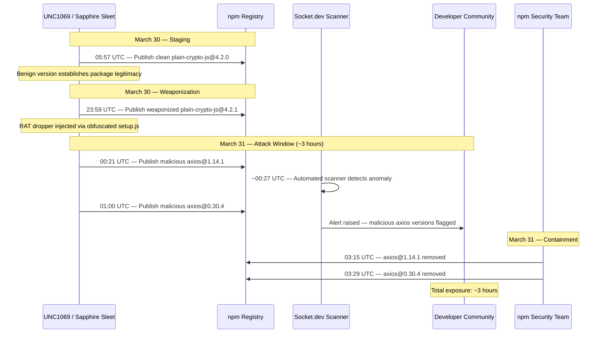
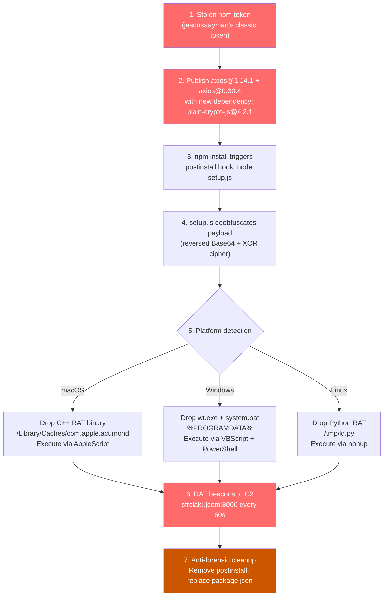

# Axios Supply Chain Attack (March 2026)

On March 31, 2026, the official `axios` npm package — the most popular HTTP client in the JavaScript ecosystem with over **100 million weekly downloads** — was compromised. An attacker stole a long-lived classic npm token belonging to maintainer `jasonsaayman`, used it to publish two backdoored versions, and injected a dependency containing a cross-platform Remote Access Trojan (RAT) codenamed **WAVESHAPER.V2**. The malicious versions were live on npm for approximately three hours before being pulled.

Three hours. One stolen token. A hundred million weekly downloads. And a RAT that could execute arbitrary code, inject into running processes, and self-destruct on command — all triggered by a `postinstall` hook that most developers never think twice about.

## The Alert

At approximately 00:27 UTC on March 31, 2026, **Socket.dev's** automated supply chain scanner flagged an anomaly in a newly published version of `axios`. The package had gained a new dependency — `plain-crypto-js@4.2.1` — that had not existed in any previous release. The dependency contained obfuscated code that deobfuscated to a platform-specific RAT dropper.

::: danger What Made This Terrifying
Axios is everywhere. It is the default HTTP client in countless tutorials, boilerplates, and production applications. It ships inside frameworks, CLIs, and backend services. A compromised `axios` means compromised build pipelines, compromised CI/CD runners, compromised developer machines, and compromised production servers — all from a single `npm install`.
:::

## Impact

- **Package size**: 100+ million weekly downloads
- **Compromised versions**: `axios@1.14.1` and `axios@0.30.4`
- **Malicious dependency**: `plain-crypto-js@4.2.1` (WAVESHAPER.V2 RAT dropper)
- **Window of exposure**: ~3 hours (00:21 – 03:29 UTC, March 31)
- **Attack vector**: `postinstall` hook executing `node setup.js`
- **RAT capabilities**: Process injection, script execution, directory execution, kill/self-destruct
- **C2 server**: `sfrclak[.]com:8000` (IP: `142.11.206.73`)
- **Attribution**: UNC1069 / Sapphire Sleet — North Korean state-linked, financially motivated threat actor
- **Campaign**: "TeamPCP" — same actor behind the Trivy, KICS, LiteLLM, and Telnyx compromises in March 2026

## Timeline



| Time (UTC) | Event |
|------------|-------|
| March 30, 05:57 | Clean `plain-crypto-js@4.2.0` published to npm (staging — establishes package legitimacy) |
| March 30, 23:59 | Weaponized `plain-crypto-js@4.2.1` published (RAT dropper payload injected) |
| March 31, 00:21 | Malicious `axios@1.14.1` published via stolen maintainer token |
| March 31, ~00:27 | Socket.dev automated scanner detects anomaly in new axios version |
| March 31, 01:00 | Malicious `axios@0.30.4` published (targeting legacy version range) |
| March 31, 03:15 | `axios@1.14.1` removed from npm |
| March 31, 03:29 | `axios@0.30.4` removed from npm — full containment |

## Root Cause

### The Stolen Token

The attack began with a **maintainer account takeover** — but not via phished credentials or session hijacking. The attacker obtained a **long-lived classic npm token** belonging to `jasonsaayman`, one of axios's core maintainers.

Classic npm tokens are bearer tokens. They do not expire. They are not scoped to specific packages or IP addresses. Anyone who possesses the token string can publish any package the token owner has write access to. There is no 2FA challenge at publish time when using a classic token — the 2FA requirement only applies to the web UI and CLI login flow, not to token-based API calls.

::: warning The critical vulnerability
npm classic tokens are **bearer tokens with no expiry**. A single leaked token — via a `.npmrc` checked into a repo, exposed in CI logs, or exfiltrated from a compromised machine — grants indefinite publish access. This is the npm equivalent of leaving the front door key under the mat, except the key never expires and the lock never changes.
:::

### Why Two Versions?

The attacker published two versions targeting different semver ranges:

| Version | Target |
|---------|--------|
| `axios@1.14.1` | Projects using `^1.x` — the vast majority of active projects |
| `axios@0.30.4` | Projects pinned to `^0.x` — legacy projects and older enterprise codebases |

This is a deliberate strategy to maximize the blast radius. Projects with loose version ranges (`^1.0.0` or `^0.21.0`) would automatically pull the malicious version on the next `npm install`.

### The Staging Trick

The attacker did not publish the malicious dependency and the backdoored axios at the same time. They staged the attack in two phases:

1. **March 30, 05:57 UTC** — Published `plain-crypto-js@4.2.0`, a clean package with no malicious code. This established the package on npm, ensuring it would not trigger "brand new package" heuristics in automated scanners.
2. **March 30, 23:59 UTC** — Published `plain-crypto-js@4.2.1`, the weaponized version with the RAT dropper. By this point, the package had been on npm for 18 hours — long enough to look established.

This is a known evasion technique: publish clean first, weaponize later.

### Attribution: TeamPCP / UNC1069 / Sapphire Sleet

The axios attack was not isolated. It was part of the **TeamPCP campaign**, a coordinated supply chain offensive attributed to **UNC1069 (Sapphire Sleet)**, a North Korean state-linked threat actor with financial motivations.

In March 2026 alone, TeamPCP compromised:
- **Trivy** (GitHub Action) — security scanner turned credential harvester
- **KICS** (Checkmarx) — infrastructure-as-code scanner
- **LiteLLM** — AI proxy library with 95M monthly PyPI downloads ([full case study](/war-room/litellm-supply-chain-2026))
- **Telnyx** — telecom API provider
- **Axios** — the world's most popular HTTP client

The campaign's hallmark is targeting high-download-count packages in both the npm and PyPI ecosystems, using stolen maintainer credentials and CI/CD token exfiltration.

## Attack Chain

The attack chain was sophisticated, multi-layered, and designed to evade detection while deploying a cross-platform RAT.



### Step 1: The postinstall Hook

When `npm install` runs, it executes lifecycle scripts defined in `package.json`. The malicious `plain-crypto-js@4.2.1` included a `postinstall` hook:

```json
{
  "name": "plain-crypto-js",
  "version": "4.2.1",
  "scripts": {
    "postinstall": "node setup.js"
  }
}
```

This is the front door. Every developer who ran `npm install` on a project that pulled the compromised axios version would automatically execute `setup.js` — no user interaction required.

### Step 2: Two-Layer Obfuscation

The `setup.js` file did not contain plaintext malicious code. It used **two layers of obfuscation** to evade static analysis:

**Layer 1 — Reversed Base64:**

```javascript
// The payload was stored as a Base64 string, but REVERSED
const encoded = "...long reversed base64 string...";
const reversed = encoded.split('').reverse().join('');
const decoded = Buffer.from(reversed, 'base64').toString('utf-8');
```

**Layer 2 — XOR Cipher:**

```javascript
// After Base64 decoding, the result was XOR-encrypted
const KEY = "OrDeR_7077";
const CONSTANT = 333;

function deobfuscate(data) {
    let result = '';
    for (let i = 0; i < data.length; i++) {
        const keyChar = KEY.charCodeAt(i % KEY.length);
        result += String.fromCharCode(
            data.charCodeAt(i) ^ ((keyChar + CONSTANT) & 0xFF)
        );
    }
    return result;
}

// The deobfuscated result is the RAT dropper script
eval(deobfuscate(decoded));
```

::: danger Why eval is a red flag
The `eval()` call executes arbitrary code constructed at runtime. Static analysis tools that scan for known malicious patterns cannot see what the code does until it runs. This is why `eval` in a `postinstall` script is one of the strongest signals of supply chain compromise — and why tools like Socket.dev specifically flag it.
:::

### Step 3: Platform-Specific RAT Deployment

After deobfuscation, the payload performed OS detection and deployed a platform-specific RAT binary:

#### macOS

```bash
# Drops a C++ compiled binary disguised as an Apple system process
# Location: /Library/Caches/com.apple.act.mond
# Execution: via AppleScript to avoid terminal visibility
osascript -e 'do shell script "/Library/Caches/com.apple.act.mond &"'
```

The filename `com.apple.act.mond` is designed to look like a legitimate Apple system daemon — a classic trojan naming convention.

#### Windows

```batch
:: Drops two files to %PROGRAMDATA% (a directory writable by any user)
:: wt.exe — the RAT binary
:: system.bat — VBScript launcher that invokes PowerShell
:: The VBScript avoids popping a visible console window

Set objShell = CreateObject("WScript.Shell")
objShell.Run "powershell -WindowStyle Hidden -ExecutionPolicy Bypass -File %PROGRAMDATA%\system.bat", 0
```

#### Linux

```bash
# Drops a Python-based RAT to /tmp
# Execution: via nohup to survive terminal close
nohup python3 /tmp/ld.py > /dev/null 2>&1 &
```

### Step 4: RAT Command and Control

Once deployed, the RAT established a persistent connection to the command-and-control server:

- **C2 address**: `sfrclak[.]com:8000` (resolved to `142.11.206.73`)
- **Beacon interval**: Every 60 seconds
- **Protocol**: HTTP-based command polling

The RAT supported the following commands:

| Command | Description |
|---------|-------------|
| `peinject` | Inject code into a running process (process hollowing) |
| `runscript` | Execute an arbitrary script on the compromised machine |
| `rundir` | Execute all scripts in a specified directory |
| `kill` | Self-destruct — remove all RAT artifacts and exit |

### Step 5: Anti-Forensic Cleanup

After deploying the RAT, the installer performed cleanup to cover its tracks:

1. **Removed the `postinstall` script** from `package.json` — so subsequent `npm install` runs would not re-trigger the hook
2. **Replaced `package.json`** with a clean version that matched the legitimate axios metadata
3. **Deleted `setup.js`** — the obfuscated dropper script
4. **Self-destructed the installer logic** — leaving no trace in `node_modules` that the package had ever executed malicious code

::: warning The implication
If you inspected `node_modules/plain-crypto-js/` after installation, it looked clean. The malicious code had already executed and erased itself. The only evidence was the RAT binary sitting in a system directory — far from where any developer would think to look.
:::

## Impact Assessment

### Who Was Affected

Any developer, CI/CD pipeline, or production server that ran `npm install` between 00:21 and 03:29 UTC on March 31 and resolved to `axios@1.14.1` or `axios@0.30.4` was potentially compromised. This includes:

- **Developer machines**: Local development environments running `npm install` on projects with loose axios version ranges
- **CI/CD pipelines**: Build systems that run `npm install` as part of their build process, especially those without lockfiles or with `npm update` steps
- **Production servers**: Any server that performed a fresh `npm install` during the window (common in containerized deployments without lockfile pinning)
- **Docker image builds**: Any Dockerfile that ran `npm install` during the exposure window

### Severity Factors

| Factor | Assessment |
|--------|------------|
| **Blast radius** | Extremely wide — 100M+ weekly downloads |
| **Exposure window** | Narrow — ~3 hours |
| **Payload severity** | Critical — full RAT with process injection capabilities |
| **Detection difficulty** | High — anti-forensic cleanup removed installation artifacts |
| **Persistence** | High — RAT survived reboot on macOS and Windows |
| **Attribution** | Nation-state (DPRK) — sophisticated, financially motivated |

### The Saving Grace

The exposure window was remarkably short. Socket.dev's automated scanner flagged the anomaly within **6 minutes** of the first malicious version being published. The npm security team acted within approximately 3 hours. For comparison, the [LiteLLM compromise](/war-room/litellm-supply-chain-2026) also had a roughly 3-hour window — a pattern suggesting that the security community's automated tooling is getting faster at catching these attacks, even as the attacks themselves grow more sophisticated.

## What Would You Do?

Test your supply chain security instincts against the decisions that shaped this incident.

::: details Scenario 1: You maintain an npm package with 50 million weekly downloads. You have been using a classic npm token stored in your CI/CD pipeline for two years. After reading about the axios compromise, you check your token and discover it is a long-lived classic token with no expiry and no IP restrictions. Do you (A) immediately revoke the token and generate a new granular access token with IP restrictions and expiry, (B) enable 2FA on your npm account and assume that is sufficient, or (C) wait until your next scheduled security review to address it?
**The correct answer is (A) — immediately revoke and replace the token.** A classic npm token is a bearer credential with no expiry, no IP scope, and no 2FA challenge at publish time. If it has been in a CI/CD system for two years, it has been exposed to every CI runner, every CI log, and every engineer with access to the pipeline configuration. Enabling 2FA (B) does not protect against token-based API calls — 2FA only applies to web/CLI login flows. Waiting (C) is gambling with every downstream consumer of your package. Replace it with a granular access token scoped to specific packages, restricted to known CI IPs, with a short expiry — or better yet, use npm's OIDC-based publishing if your CI supports it.
:::

::: details Scenario 2: Your automated dependency scanner flags a new dependency added to a popular package you use. The dependency, `plain-crypto-js@4.2.1`, was first published 18 hours ago with a clean version (4.2.0), then updated with a new version containing obfuscated code. Do you (A) assume it is fine because the package has been on npm for 18 hours without issues, (B) block the update and investigate the obfuscated code before allowing it, or (C) check if the dependency was added by the original maintainer by reviewing the package's commit history on GitHub?
**The correct answer is (B) — block and investigate.** The staging trick (publish clean, then weaponize) is specifically designed to defeat heuristic (A). A package being on npm for 18 hours means nothing about its safety — the attacker published the clean version first to establish legitimacy. Checking the GitHub commit history (C) is a good instinct but insufficient — the attacker published directly to npm using a stolen token, so there may be no corresponding commit in the repository. The strongest signal is obfuscated code in a `postinstall` hook of a package that did not previously exist as a dependency. Block it until you understand what it does.
:::

::: details Scenario 3: It is 01:30 UTC on March 31. You are an on-call security engineer at a large company. Your monitoring shows that 200 of your CI/CD build nodes ran `npm install` in the last hour, and all of them resolved `axios@1.14.1`. You confirm the version contains a RAT dropper. Do you (A) kill and rebuild all 200 CI nodes, rotate every secret accessible to those nodes, and assume all artifacts built in the last hour are compromised, (B) scan the CI nodes for the known RAT artifacts and only remediate the ones where the RAT is present, or (C) block the malicious axios version in your registry proxy and wait for the next build cycle to pick up a clean version?
**The correct answer is (A) — assume full compromise.** The RAT performed anti-forensic cleanup after installation, removing the postinstall script and setup.js. Scanning for artifacts (B) may miss the RAT if it was deployed to an unexpected location or if the cleanup was thorough. Blocking the version (C) prevents future compromise but does nothing about the 200 nodes already infected. Every secret those nodes had access to — npm tokens, cloud credentials, signing keys, deployment credentials — must be assumed exfiltrated. Kill the nodes, rebuild from clean images, and rotate every secret. The cost of over-rotating secrets is vastly lower than the cost of missing one compromised credential.
:::

## Key Lessons

::: tip Key Lessons
- **Classic npm tokens are a critical vulnerability.** They never expire, have no IP restrictions, and bypass 2FA at publish time. Use granular access tokens with expiry and IP scoping, or OIDC-based publishing.
- **Lockfiles with integrity hashes are your first line of defense.** If your `package-lock.json` pins `axios@1.14.0` with an integrity hash, `npm ci` will refuse to install 1.14.1. Projects without lockfiles or using `npm install` instead of `npm ci` were exposed.
- **`postinstall` scripts are an attack surface.** The `--ignore-scripts` flag or tools like `npm ci --ignore-scripts` prevent lifecycle scripts from running during install. This breaks some legitimate packages but eliminates the most common supply chain attack vector.
- **Publish clean, weaponize later is a known evasion technique.** The attacker published a benign version of `plain-crypto-js` 18 hours before weaponizing it. Scanners that only check packages at first publication miss this pattern.
- **Automated scanning detected this in 6 minutes.** Socket.dev's scanner flagged the anomaly almost immediately. Invest in automated supply chain monitoring — it is the difference between a 3-hour window and a 3-day window.
- **Nation-state actors target package registries.** The TeamPCP campaign compromised Trivy, KICS, LiteLLM, Telnyx, and axios in a single month. Supply chain attacks are not hypothetical — they are an active, coordinated offensive by state-level threat actors.
:::

## Quiz

::: details Quiz

**Q1: How did the attacker gain the ability to publish malicious versions of axios to npm?**
The attacker obtained a long-lived classic npm token belonging to maintainer `jasonsaayman`. Classic npm tokens are bearer tokens that never expire, have no IP restrictions, and do not require 2FA at publish time. Anyone who possesses the token string can publish any package the token owner has write access to.

**Q2: Why did the attacker publish two different versions (1.14.1 and 0.30.4) instead of just one?**
To maximize blast radius across different semver ranges. `axios@1.14.1` targeted the majority of active projects using `^1.x` version ranges. `axios@0.30.4` targeted legacy projects and older enterprise codebases pinned to `^0.x`. Projects with loose version ranges would automatically pull the malicious version on the next `npm install`.

**Q3: Describe the two layers of obfuscation used in the `setup.js` payload.**
Layer 1: The payload was Base64-encoded and then reversed (the string was stored backwards). Layer 2: After reversing and Base64-decoding, the result was XOR-encrypted using the key `OrDeR_7077` and a constant value of 333. Each character was XORed with `(keyChar + 333) & 0xFF`, cycling through the key. The final deobfuscated result was executed via `eval()`.

**Q4: What anti-forensic techniques did the malware use after deploying the RAT?**
The installer removed the `postinstall` script from `package.json`, replaced `package.json` with a clean version matching legitimate axios metadata, deleted the `setup.js` dropper script, and self-destructed the installer logic. After cleanup, inspecting `node_modules/` would show no trace of malicious code — the RAT binary was already deployed to a system directory outside the project.

**Q5: How does `npm ci` with a lockfile protect against this type of attack, and why is it insufficient on its own?**
`npm ci` installs packages exactly as specified in the lockfile, including integrity hashes (SHA-512). If the lockfile pins `axios@1.14.0` with a specific hash, `npm ci` will refuse to install `1.14.1` because it does not match the lockfile. However, this only protects projects that already have a lockfile pinning a clean version. Projects without lockfiles, projects that run `npm install` (which updates the lockfile), or projects that explicitly update to the latest version are not protected. Additionally, if a developer generated a fresh lockfile during the exposure window, the malicious version would be pinned.
:::

## IOC Table

| Indicator Type | Value | Notes |
|---------------|-------|-------|
| **npm Package** | `axios@1.14.1` | Malicious — removed from npm |
| **npm Package** | `axios@0.30.4` | Malicious — removed from npm |
| **npm Package** | `plain-crypto-js@4.2.1` | RAT dropper dependency |
| **C2 Domain** | `sfrclak[.]com:8000` | Command and control server |
| **C2 IP** | `142.11.206.73` | C2 server IP address |
| **macOS Artifact** | `/Library/Caches/com.apple.act.mond` | C++ RAT binary disguised as Apple daemon |
| **Windows Artifact** | `%PROGRAMDATA%\wt.exe` | Windows RAT binary |
| **Windows Artifact** | `%PROGRAMDATA%\system.bat` | PowerShell RAT launcher |
| **Linux Artifact** | `/tmp/ld.py` | Python RAT script |
| **XOR Key** | `OrDeR_7077` (constant: 333) | Deobfuscation parameters |
| **Threat Actor** | UNC1069 / Sapphire Sleet | North Korean state-linked |
| **Campaign** | TeamPCP | Also hit Trivy, KICS, LiteLLM, Telnyx |

## Remediation

### Check If You Are Affected

```bash
# Check your project for the malicious versions
npm ls axios

# Look for the specific compromised versions
npm ls axios | grep -E "1\.14\.1|0\.30\.4"

# Check if plain-crypto-js exists anywhere in your dependency tree
npm ls plain-crypto-js
```

### If Affected: Immediate Response

```bash
# 1. Downgrade to the last known clean version
npm install axios@1.14.0   # if you were on ^1.x
npm install axios@0.30.3   # if you were on ^0.x

# 2. Check for RAT artifacts
# macOS
ls -la /Library/Caches/com.apple.act.mond

# Windows (run in PowerShell)
# Test-Path "$env:PROGRAMDATA\wt.exe"
# Test-Path "$env:PROGRAMDATA\system.bat"

# Linux
ls -la /tmp/ld.py
```

::: danger If RAT artifacts are found — assume FULL compromise
If any of the above files exist, the RAT was successfully deployed. You must:
1. **Disconnect the machine from the network immediately**
2. **Rotate ALL credentials** accessible from that machine — npm tokens, cloud keys, SSH keys, database passwords, API keys, everything
3. **Block the C2** at your network perimeter: `sfrclak[.]com` and `142.11.206.73`
4. **Rebuild the machine from scratch** — do not attempt to "clean" a RAT-infected system
5. **Audit all artifacts** built on that machine during the exposure window — they may contain injected code
:::

### Preventive Measures

```bash
# Always use lockfiles with integrity hashes
npm ci                           # Uses package-lock.json exactly
npm ci --ignore-scripts          # Also prevents postinstall hooks

# Audit your dependency tree
npm audit

# Check for suspicious lifecycle scripts in your dependencies
npx can-i-ignore-scripts
```

Configure your projects to use `npm ci` in all automated environments and consider using a registry proxy (Artifactory, Verdaccio, Nexus) that scans packages before allowing internal use.

## Related Incidents

- [LiteLLM Supply Chain Attack (March 2026)](/war-room/litellm-supply-chain-2026) — Same TeamPCP campaign, same month, PyPI ecosystem
- [CrowdStrike July 2024](/war-room/crowdstrike-july-2024) — Different vector, same lesson: trusted software is the ultimate attack surface

## One-Liner Summary

A stolen npm token let North Korean attackers publish RAT-laced versions of the world's most popular HTTP client, and automated scanning caught it in six minutes — but three hours was all they needed.
