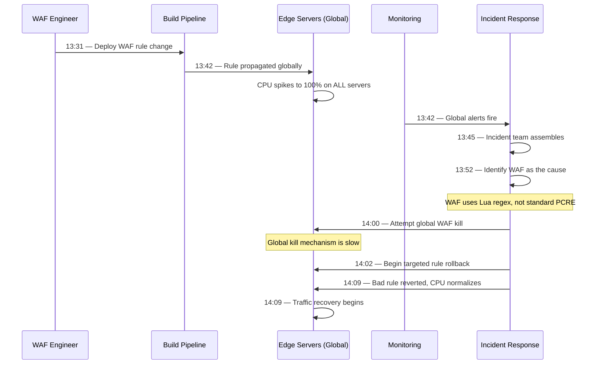
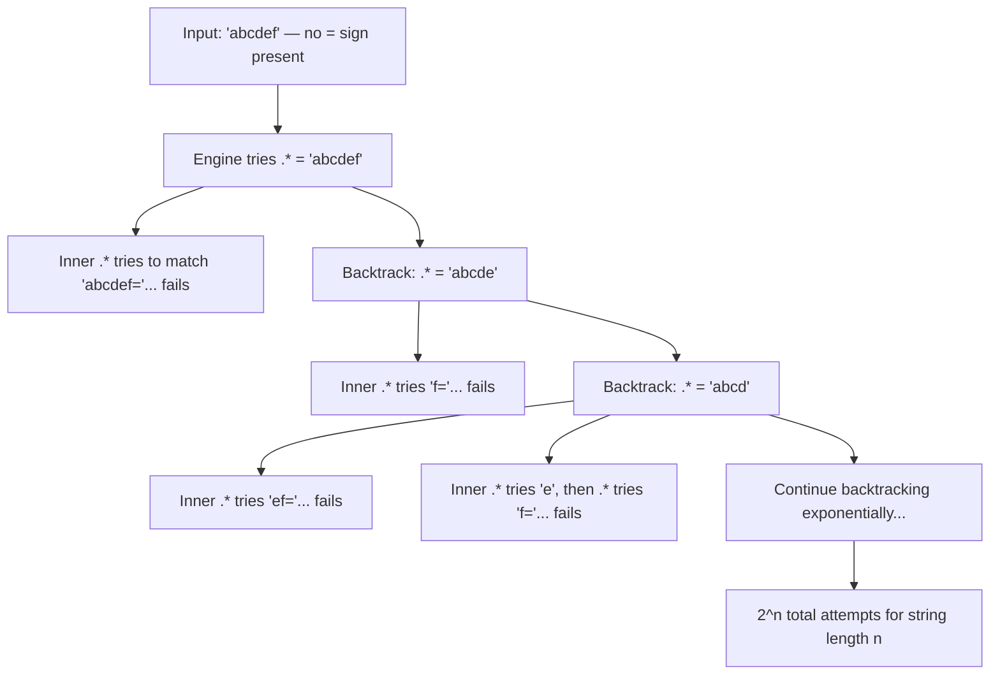

# Cloudflare's Global Outage — The Regex That Took Down the Internet (July 2019)

On July 2, 2019, at 13:42 UTC, Cloudflare — which at the time proxied roughly 10% of all HTTP requests on the internet — went completely dark. Every edge server, in every data center, across every continent, simultaneously spiked to 100% CPU utilization. The cause was a single regular expression rule deployed to their Web Application Firewall (WAF).

It took 27 minutes to identify and revert the change. During that time, millions of websites behind Cloudflare returned 502 errors to their visitors.

## The Alert

At 13:42 UTC, monitoring dashboards across Cloudflare lit up. CPU usage on every edge server worldwide spiked to 100%. HTTP traffic through Cloudflare's network dropped by 80%. Internal alerts fired for every service simultaneously.

The first sign something was wrong was not a single server failing — it was *every* server failing at the same time. This ruled out hardware failures, regional network issues, and most deployment-related problems. Something had changed globally, and it had happened instantly.

::: danger What Went Wrong First
A WAF rule update was deployed globally to all Cloudflare edge servers at once. The update contained a regular expression that exhibited catastrophic backtracking — a pathological performance pattern where certain inputs cause the regex engine to explore an exponentially growing number of possible matches.
:::

## Impact

- **Duration**: 27 minutes (13:42 to 14:09 UTC)
- **Traffic drop**: ~80% of all Cloudflare traffic was dropped
- **Users affected**: Millions of websites, including major services that relied on Cloudflare for CDN and DDoS protection
- **HTTP errors**: Visitors to Cloudflare-protected sites saw 502 Bad Gateway errors
- **Geographic scope**: Every Cloudflare data center in every country — truly global
- **Irony**: Cloudflare's own dashboard was behind Cloudflare, making internal diagnosis harder

## Timeline



### Detailed Chronology

**13:31 UTC** — A Cloudflare engineer deploys a change to the WAF managed rules. The change modifies a rule that detects XSS (cross-site scripting) attacks in HTTP responses. The change includes a new regular expression pattern.

**13:42 UTC** — The rule reaches all edge servers globally (Cloudflare's deployment pipeline distributes WAF rules to all 194+ data centers). Immediately, every server begins consuming 100% CPU as the regex engine catastrophically backtracks on common HTTP payloads.

**13:42 UTC** — Monitoring fires alerts for CPU, error rates, and traffic drops across all regions simultaneously.

**13:45 UTC** — Incident response team assembles. The immediate hypothesis is a DDoS attack, but the global, simultaneous nature rules this out quickly.

**13:52 UTC** — Engineers identify that CPU time is being consumed by the Lua WAF module. They correlate the timing with the WAF rule deployment at 13:31. The 11-minute gap between deployment and impact was the propagation time to all edge servers.

**14:00 UTC** — The team attempts to use their global WAF kill switch, but the mechanism to disable WAF processing globally is itself slow because the edge servers are CPU-bound and barely responsive.

**14:02 UTC** — Engineers begin a targeted rollback of the specific problematic rule rather than waiting for the global kill switch.

**14:09 UTC** — The bad rule is successfully reverted. CPU usage drops from 100% to normal levels within seconds. Traffic begins recovering immediately.

**14:52 UTC** — Traffic fully recovered to pre-incident levels.

## Root Cause

### The Regex

The problematic regular expression was:

```
(?:(?:\"|'|\]|\}|\\|\d|(?:nan|infinity|true|false|null|undefined|symbol|math)|\`|\-|\+)+[)]*;?((?:\s|-|~|!|{​{}\}|\|\||\+)*.*(?:.*=.*)))
```

The core issue is in this portion: `.*(?:.*=.*)`. This pattern asks the regex engine to:

1. Match any characters (`.*`)
2. Then try to match any characters followed by `=` followed by any characters (`.*=.*`)

When the `=` sign is not present in the input, the regex engine backtracks through every possible way to split the input between the two `.*` groups. For a string of length *n*, this creates O(2^n) possible matches to try.

### Catastrophic Backtracking Explained

Regular expression engines (specifically, NFA-based engines, which most languages use) work by trying all possible paths through a pattern. When multiple quantifiers (`*`, `+`) are nested or adjacent and can match the same characters, the number of possible paths explodes exponentially.



::: warning Watch Out for This
Catastrophic backtracking is not a theoretical concern. Any regex with the pattern `.*.*`, `(a+)+`, `(a|a)*`, or similar nested quantifiers is potentially vulnerable. The regex `(a+)+$` running against the input `aaaaaaaaaaaaaaaaaaaaaaaaaaa!` will take seconds to minutes to complete — a single string, a simple pattern, catastrophic behavior.
:::

### Why It Hit Every Server Simultaneously

Cloudflare's WAF rules are deployed globally as configuration, not as code going through a staged rollout. When a rule change is published, it propagates to all edge servers within minutes. There was no canary deployment for WAF rules, no staged percentage rollout, and no automatic CPU monitoring gate that would halt propagation.

### Why the Regex Was Not Caught

The WAF rule change went through a review process, but the review focused on correctness (does it catch XSS patterns?) rather than performance. No automated testing measured regex execution time against representative inputs, and there was no tool to detect catastrophic backtracking potential in new regex patterns.

## The Fix

### Immediate Response
1. Identified the WAF module as the CPU consumer (10 minutes)
2. Correlated with the recent WAF rule deployment
3. Reverted the specific rule (27 minutes total)

### Long-Term Changes

**1. Removed backtracking regex engine for WAF rules**

Cloudflare migrated their WAF regex evaluation from a backtracking NFA engine to **re2**, Google's regex library that guarantees linear-time evaluation by using a DFA (deterministic finite automaton) approach. re2 does not support backreferences and some advanced features, but it is impossible for a regex to cause catastrophic backtracking.

```
NFA Engine (backtracking):
  Pattern: .*.*
  Input length n → O(2^n) time in worst case

DFA Engine (re2):
  Pattern: .*.*
  Input length n → O(n) time guaranteed
```

**2. Added regex performance testing to the deployment pipeline**

Every WAF rule change now runs through automated performance testing that executes the regex against thousands of representative inputs and measures execution time. Any regex that exceeds a CPU time threshold is rejected.

**3. Implemented staged rollouts for WAF rules**

WAF rules now deploy to a small percentage of servers first, with automatic monitoring for CPU and error rate anomalies. If metrics deviate, the rollout is halted automatically.

**4. Added a global WAF kill switch that works under load**

The previous kill switch was too slow because it relied on the same overloaded edge servers. Cloudflare built a faster mechanism that can disable WAF processing even when servers are CPU-bound.

**5. Created a regex linter**

A static analysis tool was created to detect potentially catastrophic regex patterns before they enter the pipeline, flagging patterns like nested quantifiers, overlapping alternatives, and other known backtracking triggers.

## Lessons Learned

### 1. Regex is a denial-of-service vector

::: danger Critical Insight
Regular expressions are Turing-complete in practice (with backreferences) and can exhibit exponential time complexity. Any system that evaluates user-supplied or engineer-supplied regex against arbitrary input is at risk of ReDoS (Regular Expression Denial of Service). This applies to WAF rules, input validation, log parsing, and anywhere regex is used in the hot path.
:::

### 2. Global instant deployment is a feature and a risk

The ability to push a change to 194+ data centers in minutes is powerful for responding to emerging threats. But without staged rollouts, it means a bad change can take down the entire network in minutes. The deployment speed that makes Cloudflare effective against DDoS attacks is the same speed that made this incident global.

### 3. Test performance, not just correctness

Code review and functional testing verified that the regex matched XSS patterns correctly. No one tested how long it took to match (or fail to match) representative inputs. Performance testing of regex patterns — especially in the hot path — should be automated and mandatory.

### 4. Your monitoring dashboard should not depend on the thing being monitored

Cloudflare's dashboard was served through Cloudflare, so engineers had difficulty accessing their own monitoring tools during the outage. Critical internal tooling should have an [out-of-band access](/war-room/facebook-october-2021) path that does not depend on the production network.

## What You Can Learn

1. **Audit every regex in your hot path.** Search your codebase for patterns with nested quantifiers: `.*.*`, `(a+)+`, `(a|b)*`. Test them against adversarial inputs. Consider using a tool like [safe-regex](https://github.com/substack/safe-regex) or migrating to re2.

2. **Never deploy configuration changes globally at once.** Even "just config" changes can have devastating effects. WAF rules, feature flags, rate limit configs — all should go through staged rollouts with automatic rollback on anomaly detection.

3. **Use linear-time regex engines for security-critical paths.** If you run regex against untrusted or variable input, use Google's re2, Rust's regex crate, or another engine that guarantees O(n) execution. The loss of backreference support is a small price for guaranteed performance.

4. **Build kill switches that work when things are broken.** A circuit breaker that cannot trip because the system is too overloaded to process the trip command is not a [circuit breaker](/system-design/distributed-systems/circuit-breaker). Your emergency shutdown mechanisms must be independent of the systems they protect.

5. **Ensure out-of-band access to monitoring.** If your monitoring, alerting, or deployment tools run through the same infrastructure you are debugging, you will be blind during the incidents that matter most.

---

*Sources: [Cloudflare Blog — Details of the Cloudflare outage on July 2, 2019](https://blog.cloudflare.com/details-of-the-cloudflare-outage-on-july-2-2019/) (July 12, 2019); [Cloudflare Blog — Cloudflare outage caused by bad software deploy](https://blog.cloudflare.com/cloudflare-outage/) (July 2, 2019).*
