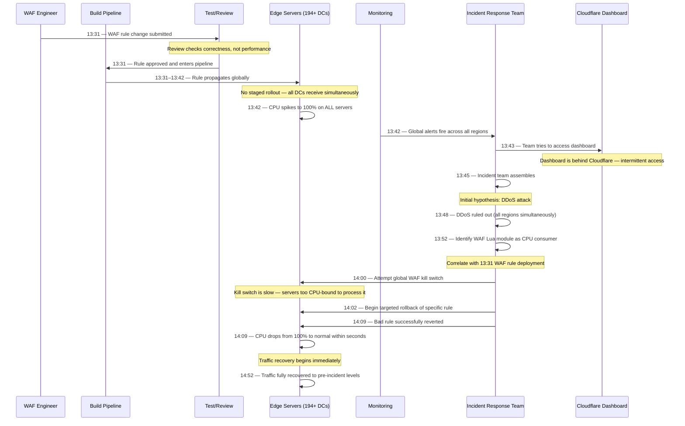
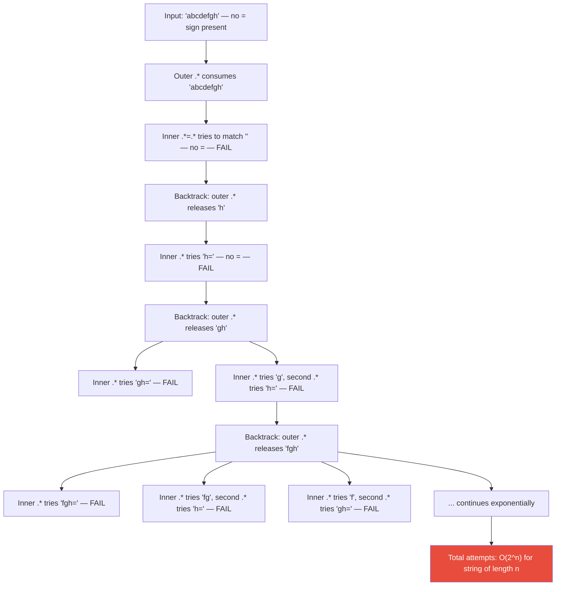
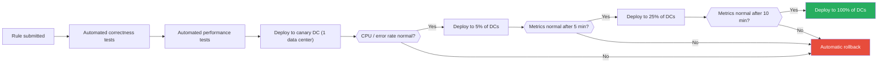

# Cloudflare's Global Outage — The Regex That Took Down the Internet (July 2019)

A single regular expression deployed to Cloudflare's Web Application Firewall caused every edge server in 180+ cities across 90+ countries to simultaneously spike to 100% CPU, dropping 80% of all HTTP traffic through their network for 27 minutes and taking millions of websites offline.

## The Alert

At 13:42 UTC on July 2, 2019, monitoring dashboards across Cloudflare's engineering organization exploded. CPU usage on every edge server worldwide spiked to 100% — not one data center, not one region, but every server in every data center on every continent simultaneously. HTTP traffic through Cloudflare's network dropped by 80%. Internal alerts fired for every service at the same time.

The first sign something was wrong was not a single server failing — it was *every* server failing at the same time. This immediately ruled out hardware failures (those are localized), regional network issues (those are regional), DDoS attacks (those target specific endpoints), and most deployment-related problems (those roll out gradually). Something had changed globally, and it had happened virtually instantly.

Making matters worse, Cloudflare's own dashboard — the primary tool engineers would use to diagnose the problem — was itself served through Cloudflare's CDN. With 80% of traffic being dropped, engineers had difficulty accessing their own monitoring tools.

::: danger What Went Wrong First
A WAF (Web Application Firewall) rule update was deployed globally to all Cloudflare edge servers at once. The update contained a regular expression designed to detect XSS (cross-site scripting) attacks. That regex exhibited **catastrophic backtracking** — a pathological performance pattern where certain inputs cause the regex engine to explore an exponentially growing number of possible matches, consuming 100% CPU indefinitely.
:::

## Impact

| Metric | Detail |
|---|---|
| **Duration** | 27 minutes (13:42 to 14:09 UTC) |
| **Traffic drop** | ~80% of all Cloudflare HTTP traffic was dropped |
| **Data centers affected** | Every Cloudflare data center in 194+ cities across 90+ countries |
| **Websites affected** | Millions of websites that relied on Cloudflare for CDN, WAF, and DDoS protection |
| **HTTP errors** | Visitors to Cloudflare-protected sites saw 502 Bad Gateway errors |
| **Services affected** | HTTP proxying, WAF, DDoS mitigation, Workers, CDN caching — all Cloudflare products |
| **Geographic scope** | Truly global — every continent, every country where Cloudflare had presence |
| **Recovery time** | Full traffic recovery took until 14:52 UTC (~70 minutes after initial impact) |
| **Irony factor** | Cloudflare's own dashboard was behind Cloudflare, making internal diagnosis harder |

::: warning The Amplification Effect
Cloudflare proxied roughly 10% of all HTTP requests on the internet at the time. When Cloudflare went down, it was not just Cloudflare that was unreachable — it was every website behind Cloudflare. For the millions of site operators who used Cloudflare as their CDN and WAF, the outage was indistinguishable from their own website being completely down. Their origin servers were fine, but no traffic could reach them.
:::

## Timeline



### Detailed Chronology

| Time (UTC) | Event |
|---|---|
| **13:31** | A Cloudflare WAF engineer deploys a change to the WAF managed rules. The change modifies a rule designed to detect XSS (cross-site scripting) patterns in HTTP response bodies. The change includes a new regular expression |
| **13:31–13:42** | The WAF rule propagates through Cloudflare's deployment pipeline to all 194+ data centers worldwide. WAF rules are deployed as configuration, not code — they do not go through staged rollout. All edge servers receive the new rule within minutes |
| **13:42** | The rule reaches all edge servers. Immediately, every server begins consuming 100% CPU as the Lua-based WAF regex engine catastrophically backtracks on common HTTP response payloads. The regex matches against every HTTP response passing through Cloudflare, and even normal web page content triggers the exponential backtracking |
| **13:42** | Monitoring fires alerts for CPU, HTTP error rates, and traffic drops across ALL regions simultaneously. The global, instantaneous nature of the alert storm is itself a diagnostic signal |
| **13:43–13:45** | Engineers attempt to access Cloudflare's internal dashboard. Because the dashboard is served through Cloudflare's own CDN, it loads intermittently. Some engineers access it; others cannot |
| **13:45** | Incident response team assembles via internal communication channels. The initial hypothesis is a massive DDoS attack |
| **13:48** | DDoS hypothesis ruled out. A DDoS attack would target specific IPs, domains, or regions — it would not cause simultaneous 100% CPU across every server on every continent. The team pivots to investigating internal causes |
| **13:52** | Engineers identify that the CPU time is being consumed entirely by the Lua WAF module — specifically, the regex evaluation component. They correlate the timing with the WAF rule deployment at 13:31. The 11-minute gap between deployment and full impact was the propagation time across all 194+ data centers |
| **14:00** | The team attempts to use the global WAF kill switch — a mechanism designed to disable WAF processing across all edge servers. But the kill switch relies on the same edge servers that are CPU-bound. The servers are so overloaded that they cannot process the kill switch command quickly enough |
| **14:02** | Engineers pivot to a targeted approach: instead of killing all WAF processing, they identify and rollback the specific problematic rule. This smaller change can propagate even to overloaded servers |
| **14:09** | The bad rule is successfully reverted across all edge servers. CPU usage drops from 100% to normal levels within seconds. Traffic begins recovering immediately as servers resume processing HTTP requests |
| **14:52** | Traffic fully recovers to pre-incident levels. The 43-minute gap between fix deployment (14:09) and full recovery (14:52) is due to connection timeouts, retry backoff, and client-side caching of error responses |

## Root Cause

### The Regex

The problematic regular expression deployed in the WAF rule was:

```
(?:(?:\"|'|\]|\}|\\|\d|(?:nan|infinity|true|false|null|undefined|symbol|math)|\`|\-|\+)+[)]*;?((?:\s|-|~|!|\{​{}\}|\|\||\+)*.*(?:.*=.*)))
```

The core issue lies in this portion of the pattern: `.*(?:.*=.*)`. This seemingly simple construct asks the regex engine to:

1. Match any number of any characters (`.*`)
2. Then, within a non-capturing group, match any number of any characters, followed by a literal `=`, followed by any number of any characters (`.*=.*`)

When the input string does not contain an `=` sign — which is the case for most normal HTTP response content — the regex engine enters catastrophic backtracking.

### Catastrophic Backtracking Explained

Regular expression engines in most programming languages (including Lua, JavaScript, Python, Java, PHP, and Ruby) use an **NFA (Nondeterministic Finite Automaton)** approach with backtracking. When the engine encounters a quantifier like `.*`, it tries matching as many characters as possible (greedy), then backtracks one character at a time if the rest of the pattern fails.

With nested or adjacent `.*` quantifiers that can match the same characters, the engine must try every possible way to divide the input between the quantifiers. For a string of length *n*, this creates **O(2^n)** possible match attempts.



To understand the severity, here is how execution time scales with input length for a backtracking regex engine:

| Input Length | Match Attempts | Approximate Time |
|---|---|---|
| 10 characters | ~1,024 | Microseconds |
| 20 characters | ~1,048,576 | Milliseconds |
| 30 characters | ~1,073,741,824 | Seconds |
| 40 characters | ~1,099,511,627,776 | Minutes to hours |
| 50 characters | ~1,125,899,906,842,624 | Days |

An HTTP response body is typically thousands to tens of thousands of characters. The regex engine would never complete — it would consume 100% CPU trying to evaluate all possible paths until the process was killed or the server crashed.

::: warning Watch Out for This
Catastrophic backtracking is not a theoretical concern. Any regex with the pattern `.*.*`, `(a+)+`, `(a|a)*`, or similar nested/adjacent quantifiers is potentially vulnerable. The regex `(a+)+$` running against the input `aaaaaaaaaaaaaaaaaaaaaaaaaaa!` will take seconds to minutes to complete in most regex engines — a single string, a simple pattern, catastrophic behavior. This class of vulnerability is known as **ReDoS (Regular Expression Denial of Service)**.
:::

### Why It Hit Every Server Simultaneously

Cloudflare's WAF rules were deployed as **configuration**, not as application code. Configuration changes had a different deployment pipeline than code changes:

| Aspect | Code Deployments | WAF Rule Deployments (at the time) |
|---|---|---|
| **Rollout strategy** | Canary → staged percentage → global | Global to all DCs at once |
| **Monitoring gates** | CPU, error rate, latency checks between stages | None — fire and forget |
| **Rollback mechanism** | Automated rollback on anomaly | Manual rollback via same pipeline |
| **Testing** | Unit tests, integration tests, load tests | Correctness review only |

WAF rules needed to deploy quickly by design — when a new threat is discovered, Cloudflare needs to push a protective rule to all 194+ data centers within minutes. This speed is a competitive advantage for incident response. But the same speed meant that a bad rule would also reach all 194+ data centers within minutes, with no opportunity to detect and halt the rollout.

### Why the Regex Was Not Caught in Review

The WAF rule change went through a review process, but the review was focused entirely on **correctness**: "Does this regex correctly match XSS attack patterns?" The review did not evaluate **performance**: "How long does this regex take to evaluate against inputs that do NOT match?"

No automated testing measured regex execution time against representative inputs. There was no static analysis tool to detect catastrophic backtracking potential. No one ran the regex against a 10KB HTML page without an `=` sign to see what would happen.

```
What was tested:
  ✓ Does the regex match known XSS attack strings?
  ✓ Does the regex avoid false positives on normal content?

What was NOT tested:
  ✗ How long does the regex take on a 10KB input without a match?
  ✗ Does the regex exhibit backtracking on any input class?
  ✗ What is the worst-case CPU time for this regex?
  ✗ What happens if this regex runs on every HTTP response body globally?
```

::: tip The Performance Blind Spot
This is a common pattern in engineering review processes: reviews optimize for correctness and miss performance entirely. Code review checklists typically ask "does this produce the right output?" but rarely ask "how long does this take in the worst case?" For hot-path code — code that executes on every request — worst-case performance IS a correctness property. A function that takes 30 minutes to return is not "slow" — it is broken.
:::

### The Propagation Delay Created a False Sense of Safety

One subtle detail made this incident harder to catch: there was an 11-minute gap between when the rule was deployed (13:31) and when the impact was felt (13:42). This propagation delay meant that the engineer who deployed the change did not see an immediate problem. If the impact had been instant, the deploying engineer might have immediately correlated their action with the failure and reverted. The 11-minute gap broke the temporal association between cause and effect, making diagnosis slower.

### The Kill Switch Problem

When the incident response team tried to disable WAF processing globally using their kill switch, they discovered a critical design flaw: the kill switch relied on the same edge servers that were CPU-bound. The servers were spending 100% of their CPU on regex evaluation and had no capacity to process the incoming kill switch command.

This created a deadlock: the thing that was broken (WAF processing) needed the thing it was breaking (CPU availability) to receive the command to stop. The team had to find a workaround — deploying a targeted rule revert instead of a global WAF kill — which added minutes to the recovery time.

::: danger The Kill Switch Paradox
A kill switch that cannot be triggered because the system is too broken to receive the kill command is not a kill switch. This is the same category of failure as [Facebook's badge system depending on Facebook's network](/war-room/facebook-october-2021). Emergency shutdown mechanisms must be architecturally independent of the systems they protect.
:::

## The Fix

### Immediate Response

1. **Identified the WAF module as the CPU consumer** (13:42–13:52, 10 minutes)
2. **Correlated with the 13:31 WAF rule deployment** (13:52)
3. **Attempted global WAF kill switch — too slow** (14:00)
4. **Targeted rollback of the specific problematic rule** (14:02–14:09)
5. **CPU normalized within seconds of revert** (14:09)
6. **Full traffic recovery** (14:52, 43 minutes after fix due to connection drain and retry backoff)

### Long-Term Changes

**1. Migrated WAF regex engine to a non-backtracking implementation**

This was the most significant change. Cloudflare migrated their WAF regex evaluation from a backtracking NFA engine (Lua's built-in `re` library) to **re2** and eventually to a **Rust-based regex engine** that guarantees linear-time evaluation using a DFA (deterministic finite automaton) approach.

```
NFA Engine (backtracking — what they had):
  Pattern: .*(?:.*=.*)
  Input length n without match → O(2^n) time in worst case
  Result: CPU locks up, server becomes unresponsive

DFA Engine (re2 / Rust regex — what they moved to):
  Pattern: .*(?:.*=.*)
  Input length n without match → O(n) time GUARANTEED
  Result: Fast evaluation, bounded CPU usage
```

re2 and Rust's regex crate do not support backreferences and some advanced regex features. But they guarantee that no input, regardless of length or content, can cause the engine to take more than linear time. For a security-critical path like a WAF that evaluates regex against every HTTP response body, this guarantee is more important than any regex feature.

**2. Added regex performance testing to the deployment pipeline**

Every WAF rule change now runs through automated performance testing:
- The regex is executed against thousands of representative inputs (real web page content, HTML, JSON, plaintext)
- Execution time is measured for each input
- Any regex that exceeds a CPU time threshold per evaluation is rejected
- A static analysis tool flags patterns known to cause backtracking (nested quantifiers, overlapping alternatives)

**3. Implemented staged rollouts for WAF rules**

WAF rules now deploy through a staged pipeline that mirrors code deployments:



**4. Built a global WAF kill switch that works under load**

The previous kill switch was too slow because it relied on the same overloaded edge servers to process the kill command. Cloudflare built a new mechanism that:
- Uses an independent control plane that is not affected by edge server CPU load
- Can disable WAF processing within seconds, even when servers are at 100% CPU
- Has been tested under simulated CPU exhaustion scenarios

**5. Created a regex linter for static analysis**

A purpose-built static analysis tool was created to detect potentially catastrophic regex patterns before they enter the pipeline. The linter flags:
- Nested quantifiers (`.*.*`, `(a+)+`, `(a*)*`)
- Overlapping alternatives (`(a|a)*`, `(ab|a)*b`)
- Adjacent unbounded quantifiers matching the same character classes
- Any pattern that fails a configurable backtracking depth test

**6. Added CPU usage limits per request**

Edge servers now enforce CPU time limits per individual request. If any single request (including WAF evaluation) exceeds a CPU time budget, the request is terminated. This prevents any single regex evaluation from consuming a server's entire CPU capacity, even if a bad pattern somehow makes it to production.

## Lessons Learned

### 1. Regex is a denial-of-service vector

::: danger Critical Insight
Regular expressions with backtracking engines are Turing-complete in practice (with backreferences) and can exhibit exponential time complexity. Any system that evaluates engineer-supplied or user-supplied regex against arbitrary input is at risk of ReDoS (Regular Expression Denial of Service). This applies to WAF rules, input validation, log parsing, search features, and anywhere regex is used in the hot path. If you use regex in a performance-critical path, use a linear-time engine like re2, Rust's regex crate, or Go's regexp package.
:::

### 2. Global instant deployment is a feature and a risk

The ability to push a change to 194+ data centers in minutes is powerful for responding to emerging threats — when a new zero-day is discovered, Cloudflare can protect its customers within minutes. But without staged rollouts, it means a bad change can take down the entire network in those same minutes. The deployment speed that makes Cloudflare effective against security threats is the same speed that made this incident global.

The solution is not to slow down deployment — it is to add automated safety gates that can detect problems during a staged rollout and halt propagation before the change reaches all servers.

### 3. Test performance, not just correctness

Code review and functional testing verified that the regex matched XSS patterns correctly. No one tested how long it took to match (or fail to match) representative inputs. Performance is a correctness property for hot-path code — a regex that takes 30 minutes to evaluate is not merely slow, it is functionally broken.

For any hot-path component, testing must include:
- **Correctness**: Does it produce the right output?
- **Performance**: Does it produce the output within acceptable time?
- **Worst-case performance**: What is the maximum time it could take, and is that acceptable?

### 4. "Just configuration" changes can be as dangerous as code changes

Many engineering organizations treat configuration changes as lower-risk than code changes and give them a faster, less rigorous deployment path. Cloudflare's WAF rules were "just configuration" — they were not compiled code, they did not go through the full code deployment pipeline, and they deployed globally without staging.

But a configuration change that includes a regex evaluated on every HTTP response is functionally equivalent to deploying new code to the hottest path in the system. Configuration that affects behavior in the critical path should be deployed with the same rigor as code.

### 5. Your monitoring dashboard should not depend on the thing being monitored

Cloudflare's dashboard was served through Cloudflare's CDN. During the outage, engineers had difficulty accessing their own monitoring tools. Critical internal tooling should have an [out-of-band access](/war-room/facebook-october-2021) path that does not depend on the production network.

This is a recurring pattern across major incidents: Facebook's badge system depending on Facebook's network, Cloudflare's dashboard depending on Cloudflare's CDN. The lesson is always the same — your observability and recovery tools must be architecturally independent of the system they observe and recover.

### 6. Kill switches must work when everything else is broken

The global WAF kill switch failed precisely when it was needed most — because it depended on the servers that were already broken. An emergency shutdown mechanism must be designed to work in the worst conditions, not average conditions. It should be:
- Independent of the system it protects
- Pre-allocated in terms of resources (not competing for CPU with the thing it needs to stop)
- Regularly tested under simulated failure conditions

### 7. The propagation model determines the blast radius

Cloudflare's WAF rules deployed to all servers simultaneously because that was the optimal model for security response — when a new threat is discovered, you want protection everywhere immediately. But this "all at once" model meant that any bad rule was also deployed everywhere immediately.

The lesson is to separate the **urgency** of deployment from the **blast radius** of deployment. Even urgent changes can go through a rapid canary phase (deploy to 1% of servers, check metrics for 60 seconds, then expand). A 60-second canary would have caught this incident before it went global — the canary servers would have spiked to 100% CPU, triggering an automatic halt.

### 8. Complexity in the hot path is a liability

The WAF regex was complex because it was trying to match a complex attack pattern. But complexity in a hot-path component is a liability — every additional character in a regex, every additional branch in a conditional, is a potential failure point that executes millions of times per second. Hot-path components should be as simple as possible, and when complexity is necessary, it should be accompanied by proportional testing and safety mechanisms.

## What You Can Learn

1. **Audit every regex in your hot path.** Search your codebase for patterns with nested quantifiers: `.*.*`, `(a+)+`, `(a|b)*`. Test them against adversarial inputs — strings designed to maximize backtracking. Consider using a tool like [safe-regex](https://github.com/substack/safe-regex), or better yet, migrate to a linear-time regex engine like re2 or Rust's regex crate.

2. **Never deploy configuration changes globally at once.** Even "just config" changes can have devastating effects. WAF rules, feature flags, rate limit configs, routing rules — all should go through staged rollouts with automatic rollback on anomaly detection. If a change is important enough to deploy, it is important enough to deploy safely.

3. **Use linear-time regex engines for security-critical and performance-critical paths.** If you run regex against untrusted or variable-length input in a hot path, use Google's re2, Rust's regex crate, Go's regexp package, or another engine that guarantees O(n) execution. The loss of backreference support is a small price for guaranteed performance.

4. **Build kill switches that work when things are broken.** A circuit breaker that cannot trip because the system is too overloaded to process the trip command is not a [circuit breaker](/system-design/distributed-systems/circuit-breaker). Your emergency shutdown mechanisms must be independent of the systems they protect — separate control plane, pre-allocated resources, tested under failure conditions.

5. **Ensure out-of-band access to monitoring.** If your monitoring, alerting, or deployment tools run through the same infrastructure you are debugging, you will be blind during the incidents that matter most. Host critical internal tools on a separate provider, or at minimum on a separate network path.

6. **Add CPU budgets per request.** Even if a bad regex or expensive computation makes it to production, a per-request CPU budget prevents a single request from monopolizing a server's resources. The request fails, but the server stays healthy. This is defense in depth — it does not prevent the bug, but it limits the blast radius.

7. **Treat regex as code, not as data.** A regex that runs on every HTTP request is hot-path code. Review it like code. Test it like code. Deploy it like code. The fact that it is expressed as a string rather than compiled instructions does not change its impact on system behavior.

8. **Implement per-request resource budgets.** Even if a bad regex or expensive computation reaches production, a per-request CPU time budget prevents a single request from monopolizing server resources. The request fails, but the server stays healthy. This is defense in depth — it does not prevent the bug, but it limits the blast radius to individual requests rather than entire servers.

9. **Maintain a regex inventory for hot-path components.** Know every regex that runs in your hot path. Document what each one does, what inputs it evaluates, and when it was last reviewed for performance. Treat this inventory like a dependency manifest — it is a list of things that can break your system, and it deserves regular audit.

10. **Separate your observability stack from your serving stack.** Cloudflare's dashboard being behind Cloudflare is a pattern that appears in multiple major outages (see [Facebook's October 2021 outage](/war-room/facebook-october-2021)). Your ability to observe and debug your system must not depend on the system being healthy. Host monitoring dashboards, alerting infrastructure, and deployment tooling on independent infrastructure.

## Comparing Regex Engine Types

Understanding the difference between backtracking and non-backtracking regex engines is essential for preventing this class of incident:

| Feature | NFA (Backtracking) | DFA (Non-Backtracking) |
|---|---|---|
| **Examples** | PCRE, JavaScript, Python `re`, Ruby, Lua | Google re2, Rust `regex`, Go `regexp` |
| **Worst-case time** | O(2^n) — exponential | O(n) — linear, guaranteed |
| **Backreferences** | Supported | Not supported |
| **Lookaheads/lookbehinds** | Supported | Limited or not supported |
| **Catastrophic backtracking** | Possible | Impossible by design |
| **Use case** | General-purpose text processing | Security-critical, hot-path evaluation |
| **ReDoS vulnerability** | Yes | No |

::: tip Which Engine Should You Use?
For most application code (validation, text processing, log parsing), NFA engines are fine — as long as you audit your patterns for backtracking risk. For hot-path code that evaluates regex against untrusted or variable-length input — WAF rules, API input validation, real-time log analysis — use a DFA engine. The feature loss (no backreferences) is almost never relevant for these use cases, and the performance guarantee is worth far more than any lost feature.
:::

## The Broader Pattern: Configuration as Code

Cloudflare's incident is part of a broader pattern where "configuration changes" cause outages that rival or exceed code deployment failures. Other notable examples include:

- **Facebook (October 2021)**: A BGP configuration change [took Facebook offline for 6 hours](/war-room/facebook-october-2021)
- **Google Cloud (June 2019)**: A network configuration change caused a 4-hour outage across multiple Google Cloud regions
- **AWS (November 2020)**: A Kinesis configuration change triggered a cascading failure across multiple AWS services

The common thread is that configuration changes are treated as lower-risk than code changes and given a less rigorous deployment pipeline. But configuration that affects system behavior in the critical path IS code — it just happens to be expressed as data rather than compiled instructions. The deployment rigor should match the blast radius, not the file format.

::: danger The Configuration Trap
If you find yourself saying "it's just a config change, it doesn't need the full deployment pipeline," stop and ask: "What is the blast radius if this config is wrong?" If the answer is "global outage," the change needs the full pipeline — regardless of whether it is expressed as code, YAML, JSON, or a regex pattern.
:::

## Incident Response Efficiency

Cloudflare's 27-minute resolution time is impressively fast for a global incident. The breakdown reveals how time was spent and where seconds mattered:

| Phase | Duration | Activity |
|---|---|---|
| **Detection** | 0 minutes | Automated monitoring caught it instantly at 13:42 |
| **Assembly** | 3 minutes | Incident response team assembled by 13:45 |
| **Hypothesis elimination** | 3 minutes | DDoS ruled out by 13:48 |
| **Root cause identification** | 4 minutes | WAF module identified as CPU consumer by 13:52 |
| **Correlation with change** | 0 minutes | Deployment at 13:31 immediately correlated |
| **First fix attempt** | 8 minutes | Global WAF kill switch attempted at 14:00 (failed) |
| **Second fix attempt** | 2 minutes | Targeted rule rollback started at 14:02 |
| **Resolution** | 7 minutes | Bad rule reverted, CPU normalized by 14:09 |

The 8-minute detour through the failed kill switch was the most expensive delay. Without that detour, the total incident duration would have been approximately 19 minutes. This underscores why emergency mechanisms must be tested under failure conditions — discovering that your kill switch does not work during the incident adds critical minutes to your response time.

## Further Reading

- [Cloudflare Blog — Details of the Cloudflare outage on July 2, 2019](https://blog.cloudflare.com/details-of-the-cloudflare-outage-on-july-2-2019/) — The detailed technical postmortem (July 12, 2019)
- [Cloudflare Blog — Cloudflare outage caused by bad software deploy](https://blog.cloudflare.com/cloudflare-outage/) — The initial incident report (July 2, 2019)
- [Google re2](https://github.com/google/re2) — Google's linear-time regex library
- [Rust regex crate](https://docs.rs/regex/latest/regex/) — Rust's guaranteed-linear-time regex implementation
- [OWASP ReDoS](https://owasp.org/www-community/attacks/Regular_expression_Denial_of_Service_-_ReDoS) — OWASP's documentation on regex denial-of-service
- [safe-regex](https://github.com/substack/safe-regex) — Node.js tool for detecting potentially catastrophic regex patterns
- [Circuit Breaker Pattern](/system-design/distributed-systems/circuit-breaker) — Emergency shutdown mechanisms
- [Facebook's October 2021 Outage](/war-room/facebook-october-2021) — Another case of internal tools depending on production infrastructure
- [Knight Capital's $440M Bug](/war-room/knight-capital-2012) — Another case where missing safety mechanisms turned a small error into a catastrophe
- [Chaos Engineering](/devops/incident-response/chaos-engineering) — Testing failure modes including CPU exhaustion
