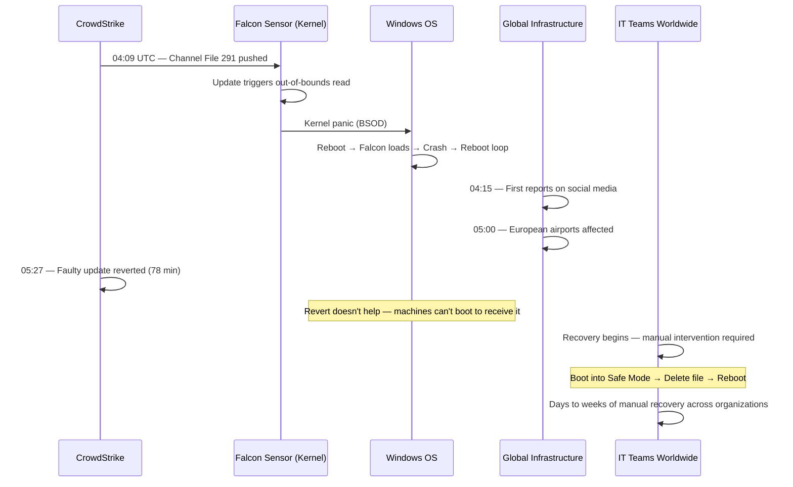

# CrowdStrike's Global BSOD (July 2024)

On July 19, 2024, at approximately 04:09 UTC, CrowdStrike pushed a content configuration update to its Falcon sensor — an endpoint security agent installed on millions of Windows machines worldwide. Within minutes, approximately **8.5 million Windows devices** entered a boot loop, displaying the Blue Screen of Death (BSOD). The machines could not start. They could not be fixed remotely. Every single one required manual, physical intervention to recover.

Airlines grounded flights. Hospitals reverted to paper records. Banks could not process transactions. Emergency services were disrupted. Television broadcasts went dark. It was, by some measures, the largest IT outage in history — and it was caused by a single content update file that was 40 KB in size.

## The Alert

At 04:09 UTC on July 19, 2024, CrowdStrike released a sensor content update — specifically, a Channel File update numbered C-00000291. Within minutes, Windows machines running the CrowdStrike Falcon sensor began crashing with a BSOD and entering an unrecoverable boot loop.

The first reports appeared on social media and IT forums almost immediately, but the scale of the problem was not clear for nearly an hour. As time zones rotated into business hours — particularly in Europe and then North America — the true scope became apparent.

::: danger What Went Wrong First
A content configuration update (Channel File 291) deployed to CrowdStrike's Falcon sensor contained a logic error that triggered an out-of-bounds memory read in the sensor's kernel-mode driver (csagent.sys). Because the driver runs in the Windows kernel, an unhandled memory access error caused an immediate kernel panic (BSOD). Because the driver loads early in the boot process, the crash occurred on every restart, creating an unrecoverable boot loop.
:::

## Impact

- **Duration**: The initial crash wave occurred within 78 minutes (04:09–05:27 UTC). Recovery took days to weeks for many organizations
- **Machines affected**: Approximately 8.5 million Windows devices worldwide (estimated ~1% of all Windows machines)
- **Airlines**: Delta Air Lines cancelled over 5,000 flights over 5 days, with estimated losses of $500 million. United Airlines, American Airlines, and carriers worldwide experienced massive disruptions
- **Healthcare**: Hospitals in multiple countries reverted to paper-based systems. Some surgeries were postponed. 911 and emergency dispatch systems were affected in multiple US states
- **Financial services**: Banks, trading firms, and payment processors experienced disruptions
- **Government**: Federal agencies, courts, and public services were disrupted
- **Retail**: Point-of-sale systems in retail stores, restaurants, and service businesses went down
- **Television**: Broadcasters including Sky News went off air
- **Estimated global financial impact**: Over $10 billion in direct costs (Microsoft estimate)
- **CrowdStrike financial impact**: Stock dropped ~32% in the week following, losing approximately $25 billion in market capitalization

## Timeline



### Detailed Chronology

**04:09 UTC** — CrowdStrike's content delivery system pushes Channel File 291 update (file: `C-00000291*.sys`) to all Windows systems running the Falcon sensor. The update is a "rapid response content" update — a type of configuration update designed to be deployed quickly in response to emerging threats, outside the normal sensor software update cadence.

**04:09–04:15 UTC** — Machines that receive and process the update begin crashing immediately. The Falcon sensor's kernel driver loads very early in the Windows boot process (before most user-mode services start), so the crash happens during boot. When Windows restarts, the driver loads again, crashes again, creating an infinite boot loop.

**04:15–05:00 UTC** — First reports appear on Reddit, Twitter/X, and IT community forums. Reports come from Australia and Asia, where it is already business hours. The scale is not yet understood.

**05:00–05:27 UTC** — European airports and airlines begin reporting major IT failures. The pattern becomes clear: this is global and specific to Windows machines running CrowdStrike.

**05:27 UTC** — CrowdStrike reverts the faulty Channel File update. New machines that have not yet received the update are safe. However, machines that are already in a boot loop cannot receive the revert — they cannot boot far enough to connect to CrowdStrike's update servers.

**06:00–12:00 UTC** — The full scope becomes apparent as North America comes online. Airports, hospitals, banks, government agencies, and businesses across the US report failures. CrowdStrike publishes a remediation guide requiring manual intervention.

**July 19–August 2024** — Organizations worldwide undertake the painstaking process of recovering affected machines. For organizations with thousands of machines — many in remote locations, retail stores, or behind locked server room doors — recovery takes days to weeks.

## Root Cause

### The Kernel Driver Architecture

CrowdStrike's Falcon sensor operates as a **kernel-mode driver** on Windows. Kernel-mode drivers run at the highest privilege level in the operating system (Ring 0) with direct access to hardware and memory. This is necessary for security software — to detect and prevent malware, the sensor needs to see everything happening on the system, including kernel-level operations.

The tradeoff: kernel-mode code has no safety net. In user-mode, a crash terminates the process. In kernel-mode, a crash crashes the entire operating system.

```
Windows Privilege Levels:

Ring 3 (User Mode):
  - Applications, browsers, editors
  - Crash → process terminates, OS continues
  - Sandboxed from hardware

Ring 0 (Kernel Mode):
  - OS kernel, device drivers, CrowdStrike Falcon
  - Crash → Blue Screen of Death
  - Direct hardware/memory access
  - No second chances
```

### The Channel File System

CrowdStrike uses a rapid content delivery system to push threat detection updates to sensors without requiring a full software update. These "Channel Files" are configuration files that describe detection patterns and behavioral indicators. They are pushed frequently — sometimes multiple times per day — to respond to emerging threats quickly.

Channel File 291 was designed to detect a new attack technique involving named pipes on Windows. The file contained template instances — data structures that configure how the sensor detects specific behaviors.

### The Bug

Channel File 291 contained 21 template instances, but the sensor code expected a maximum of 20 input fields. The 21st field triggered an **out-of-bounds memory read** in the sensor's Content Interpreter:

```
Template instance structure (simplified):

Expected by code: [field1, field2, ..., field20]  — 20 fields
Delivered in update: [field1, field2, ..., field20, field21]  — 21 fields

When the interpreter processed field 21:
  - It read memory beyond the allocated buffer
  - The read returned invalid data
  - This caused a logic error in the driver
  - The driver dereferenced an invalid pointer
  - Kernel panic → BSOD
```

::: danger Why This Was Catastrophic
The combination of three factors made this particularly devastating:
1. **Kernel mode**: The crash was in Ring 0, so it killed the entire OS
2. **Early boot loading**: The driver loads during boot, so the crash happens before any recovery mechanism can intervene
3. **Global simultaneous deployment**: The update was pushed to all machines at once, with no staged rollout or canary deployment
:::

### The Testing Gap

CrowdStrike's testing process for rapid response content had a critical gap. According to their subsequent Root Cause Analysis:

- Template Type instances were tested using a **Content Validator** that validated the template structure
- The Content Validator contained a bug that allowed Channel File 291 to pass validation despite the field count mismatch
- There was no test that actually executed the content through the Content Interpreter on a live system
- There was no staged deployment — the validated content was pushed to all customers simultaneously

## The Fix

### Immediate Fix (for unaffected machines)

CrowdStrike reverted the Channel File 291 update at 05:27 UTC (78 minutes after deployment). Machines that had not yet received or processed the update were protected.

### Recovery for Affected Machines

Every affected machine required manual intervention:

**Standard recovery procedure:**
1. Boot the machine into Windows Safe Mode (or the Windows Recovery Environment)
2. Navigate to `C:\Windows\System32\drivers\CrowdStrike`
3. Delete the file matching `C-00000291*.sys`
4. Reboot normally

**The challenge at scale:**
- Safe Mode requires physical access or pre-configured remote boot options
- BitLocker-encrypted machines (common in enterprises) require the BitLocker recovery key to access Safe Mode — keys that were often stored in systems that were themselves down
- Remote/branch office machines required someone to physically travel to each location
- Cloud instances (EC2, Azure VMs) had to be recovered by detaching the boot volume, mounting it on a healthy instance, deleting the file, and reattaching

::: warning Watch Out for This
The BitLocker recovery key problem created a chicken-and-egg situation for many organizations. Their BitLocker recovery keys were stored in Active Directory or Azure AD — which were running on Windows servers that were themselves stuck in boot loops. Without the recovery key, they could not boot into Safe Mode. Without Safe Mode, they could not fix the machine. Without the machine, they could not access the recovery keys.
:::

Microsoft released a recovery tool that automated the process via bootable USB drives, and ultimately deployed a signed recovery tool through the Windows Recovery Environment.

### CrowdStrike's Long-Term Response

CrowdStrike published a detailed Root Cause Analysis and committed to:

1. **Staged deployment for all content updates**: Canary deployments to a small subset of machines, with automated monitoring, before broader rollout
2. **Improved Content Validator testing**: Fixing the validator bug and adding additional test coverage including field boundary validation
3. **Runtime bounds checking**: Adding additional input validation in the Content Interpreter to prevent out-of-bounds reads even if invalid content reaches the sensor
4. **Customer deployment controls**: Allowing customers to choose their own deployment cadence and staging strategy for content updates
5. **Third-party code review**: Engaging independent security vendors to review the sensor code and deployment process

## Lessons Learned

### 1. Kernel-level software demands extraordinary testing rigor

::: danger Critical Insight
Code that runs in the kernel has no safety net. A bug in a user-mode application crashes that application. A bug in a kernel driver crashes the entire operating system. Software that operates at Ring 0 must be tested with proportionally greater rigor — including actual execution testing, not just structural validation.
:::

### 2. Staged rollouts are non-negotiable for any software that can brick machines

CrowdStrike pushed the update to all customers simultaneously. A [canary deployment](/devops/deployment-strategies/canary) to 1% of machines would have revealed the crash on a small population, allowing the update to be halted before reaching millions of devices. For software with the power to render machines unbootable, staged deployment is not a best practice — it is a requirement.

### 3. The blast radius of security software is uniquely large

Security software runs on every endpoint in an organization. It runs with the highest privileges. It updates frequently and rapidly. This combination means that a single bad update to a single security product can simultaneously brick every computer in an organization. The [blast radius](/war-room/amazon-s3-2017) is not a service or a region — it is every device.

### 4. Recovery at scale requires automation

Manual recovery of 8.5 million machines is not a weekend project. Organizations with tens of thousands of affected machines spent weeks recovering. Any software with the ability to render machines unbootable should have an automated recovery mechanism that does not require the machine to boot normally — for example, a watchdog in the boot process that detects repeated crashes and disables the offending driver.

### 5. Dependency on a single vendor is a concentration risk

The CrowdStrike incident revealed that many of the world's largest organizations — airlines, hospitals, banks, governments — had a single-vendor dependency on one endpoint security product. Diversifying security vendors is operationally expensive, but concentration risk at this scale has global consequences.

## What You Can Learn

1. **Always use staged rollouts.** Whether you are deploying a web application, a mobile app, or a kernel driver, never push to 100% simultaneously. Deploy to 1%, monitor, expand to 10%, monitor, expand further. This is the single most impactful practice for preventing widespread incidents. See [Canary Deployments](/devops/deployment-strategies/canary) and [Rolling Updates](/devops/deployment-strategies/rolling-updates).

2. **Test execution, not just validation.** Structural validation ("does this file have the right format?") is insufficient. You must test that the software actually executes correctly with the new content/configuration. This means integration tests against real (or realistic) systems, not just schema validators.

3. **Build automatic rollback for critical paths.** If your software can detect that an update caused a crash (e.g., by monitoring boot success), build automatic rollback that removes or disables the problematic update. Windows has a mechanism for this with "Last Known Good Configuration" — similar logic should be built into any software that runs early in the boot process.

4. **Plan for recovery that does not require the broken system.** If your update mechanism can brick the machine, your recovery mechanism cannot require the machine to be functional. This means bootable USB recovery tools, out-of-band management (IPMI/iDRAC), or network boot recovery environments, pre-deployed and tested before you need them.

5. **Monitor your deployment pipeline, not just your product.** The bug was not in the Falcon sensor's logic — it was in the Content Validator (the testing pipeline). Your testing tools are software too, and they can have bugs. Validate the validators.

## What Would You Do?

Test your incident response instincts against the decisions CrowdStrike and affected organizations actually faced.

::: details Scenario 1: You are a CrowdStrike engineer at 04:30 UTC on July 19. Reports are flooding in that Windows machines are boot-looping after a Channel File update pushed at 04:09. You can revert the update on the server side, but machines in a boot loop cannot reach CrowdStrike's update servers to receive the revert. Do you (A) revert the update immediately to protect machines that have not yet received it, (B) focus all effort on building a remote recovery tool first, or (C) wait until you fully understand the bug before taking action?
**What CrowdStrike did:** They chose **(A) — they reverted the faulty Channel File update at 05:27 UTC**, 78 minutes after deployment. This protected any machine that had not yet received or processed the update. However, machines already in a boot loop were beyond the reach of a server-side revert. The lesson: when a deployment is actively causing damage, revert first, investigate second. Every minute of delay means more machines are affected. The revert does not fix already-broken machines, but it stops the bleeding.
:::

::: details Scenario 2: You are an IT administrator at a large enterprise. It is 06:00 UTC and 15,000 of your Windows machines are in a boot loop. You know the fix is to boot into Safe Mode, navigate to a directory, and delete a file. But your BitLocker recovery keys are stored in Active Directory — which is running on Windows servers that are also in a boot loop. How do you recover?
**What many organizations faced:** This was the "chicken-and-egg" problem. BitLocker-encrypted machines needed a recovery key to access Safe Mode, but the recovery keys were stored on systems that were themselves bricked. Organizations that had backed up recovery keys to cloud services (Azure AD), printed them, or stored them in an independent system could recover faster. Organizations whose only copy of the keys was in on-premises Active Directory had to find creative workarounds — including Microsoft's eventual release of a bootable USB recovery tool. The lesson: your recovery mechanisms must be independent of the systems that can fail.
:::

::: details Scenario 3: Post-incident, you are redesigning CrowdStrike's content update deployment pipeline. The current system pushes rapid response content to all machines simultaneously — this speed is valued because it protects against zero-day threats within minutes. How do you balance speed of protection against the risk of a bad update bricking millions of machines?
**What CrowdStrike committed to:** They implemented staged deployment for all content updates — canary to a small subset of machines, with automated monitoring for crashes and performance anomalies, before broader rollout. They also added runtime bounds checking in the Content Interpreter and gave customers control over their own deployment cadence. The key insight: a 15-minute canary phase would have revealed the crash on a small population and halted deployment before it reached millions of devices. The cost (15 minutes of delayed protection) is negligible compared to the cost of bricking 8.5 million machines.
:::

::: tip Key Lessons
- **Staged rollouts are non-negotiable for kernel-level software.** Any software that can render a machine unbootable must never deploy to 100% simultaneously. A canary to 1% of machines would have caught this.
- **Test execution, not just validation.** The Content Validator passed the faulty file because it only checked structure, not runtime behavior. Integration testing against real systems catches what schema validators miss.
- **Recovery mechanisms cannot depend on the broken system.** If your update can brick a machine, your recovery must not require the machine to boot normally.
- **The blast radius of security software is uniquely large.** It runs on every endpoint, with highest privileges, and updates frequently. A single bad update hits every device simultaneously.
- **Validate the validators.** The bug was not in the sensor logic — it was in the Content Validator testing pipeline. Your testing tools are software too, and they can have bugs.
:::

::: details Quiz

**Q1: What specifically caused the Blue Screen of Death in the CrowdStrike incident?**
Channel File 291 contained 21 template instances, but the sensor code expected a maximum of 20 input fields. The 21st field triggered an out-of-bounds memory read in the kernel-mode driver (csagent.sys), which caused an invalid pointer dereference and a kernel panic.

**Q2: Why could affected machines not be fixed remotely?**
The CrowdStrike Falcon driver loads very early in the Windows boot process (before most user-mode services). The crash happened during boot, before the machine could connect to the network. When Windows restarted, the driver loaded again and crashed again, creating an infinite boot loop. The machine could never reach CrowdStrike's servers to receive the reverted update.

**Q3: Why was the update pushed to all machines simultaneously instead of using a staged rollout?**
CrowdStrike treated Channel File updates as "rapid response content" designed for quick deployment against emerging threats. They had a faster, less rigorous deployment path than full sensor software updates. The Content Validator was supposed to catch bad content, but it contained a bug that missed the field count mismatch.

**Q4: What was the estimated global financial impact of the CrowdStrike incident?**
Over $10 billion in direct costs (Microsoft estimate). CrowdStrike's stock dropped approximately 32% in the following week, losing about $25 billion in market capitalization. Delta Air Lines alone estimated $500 million in losses from over 5,000 cancelled flights.

**Q5: What is the "BitLocker chicken-and-egg problem" that many organizations encountered?**
BitLocker-encrypted machines require a recovery key to boot into Safe Mode. Many organizations stored these recovery keys in Active Directory or Azure AD, which were running on Windows servers that were themselves stuck in boot loops. Without the recovery key, they could not access Safe Mode. Without Safe Mode, they could not fix the machine. Without the machine, they could not access the recovery keys.
:::

## One-Liner Summary

A 40 KB configuration file with one extra field crashed 8.5 million Windows machines worldwide because kernel-mode code has no safety net and the update skipped staged rollout.

---

*Sources: [CrowdStrike — Preliminary Post Incident Review (PIR)](https://www.crowdstrike.com/blog/falcon-content-update-preliminary-post-incident-report/) (July 24, 2024); [CrowdStrike — External Technical Root Cause Analysis](https://www.crowdstrike.com/falcon-content-update-remediation-and-guidance-hub/) (August 6, 2024); [Microsoft — Helping our customers through the CrowdStrike outage](https://blogs.microsoft.com/blog/2024/07/20/helping-our-customers-through-the-crowdstrike-outage/) (July 20, 2024); Congressional testimony by CrowdStrike CEO George Kurtz (September 24, 2024).*
