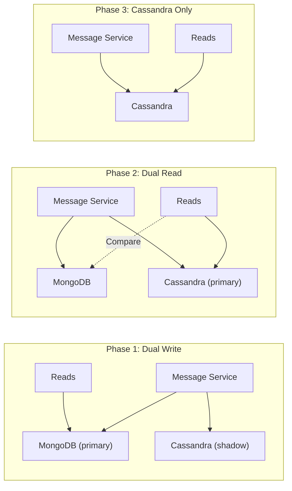
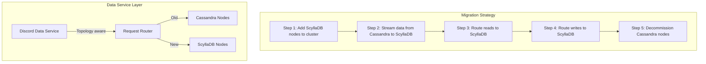

# Discord's Trillion Message Migration

Discord is one of the largest real-time communication platforms in the world, with over 150 million monthly active users sending billions of messages per day. Storing and serving these messages at scale has been one of Discord's defining engineering challenges, requiring two major database migrations over the platform's lifetime.

The journey went: **MongoDB** (2015–2017) to **Cassandra** (2017–2022) to **ScyllaDB** (2022–present). Each migration was driven by hitting fundamental limitations of the current database at Discord's scale, and each migration was performed with zero planned downtime — because Discord's users expect their messages to be available at all times.

## Chapter 1: MongoDB (2015–2017)

### The Early Architecture

When Discord launched in 2015, they chose MongoDB as their message store. MongoDB was a popular choice for startups — schemaless, easy to get started with, and performant at small scale. Discord stored messages in MongoDB collections, sharded by channel ID.

### What Went Wrong

As Discord grew, MongoDB's limitations became apparent:

- **Memory-mapped storage engine**: MongoDB's original MMAPv1 storage engine mapped the entire dataset into memory. As data grew beyond available RAM, performance degraded dramatically
- **Document-level locking**: Under high write concurrency, contention on popular channels caused latency spikes
- **Compaction issues**: The WiredTiger storage engine (introduced in MongoDB 3.0) improved things, but compaction could still cause periodic latency spikes that violated Discord's strict latency requirements

By 2017, Discord was storing billions of messages, and MongoDB was struggling. Read latencies were unpredictable, and the operational burden of managing MongoDB at scale was consuming significant engineering time.

::: warning The Tipping Point
The core problem was not that MongoDB was a bad database — it was that MongoDB was not designed for Discord's access pattern: extremely high write throughput (millions of messages per day), combined with read patterns that ranged from "fetch the last 50 messages" (fast) to "search through years of message history" (slow), all with strict latency requirements.
:::

### The Decision

Discord evaluated several options and chose **Apache Cassandra** for its:
- Linear scalability (add nodes to add capacity)
- Tunable consistency (write availability over consistency)
- Proven track record at similar scale (Netflix, Apple, Instagram)
- Time-series friendly data model (messages are naturally time-ordered)

## Chapter 2: Cassandra (2017–2022)

### The Migration to Cassandra

Discord designed their Cassandra schema specifically for message storage:

```sql
CREATE TABLE messages (
    channel_id bigint,
    bucket int,
    message_id bigint,
    author_id bigint,
    content text,
    -- additional fields
    PRIMARY KEY ((channel_id, bucket), message_id)
) WITH CLUSTERING ORDER BY (message_id DESC);
```

The key design decisions:

- **Partition key**: `(channel_id, bucket)` — messages for a channel are split into time-based buckets to prevent unbounded partition growth
- **Clustering key**: `message_id` (which is a Snowflake ID containing a timestamp) — messages within a bucket are ordered by time
- **Bucket strategy**: Each bucket represents a fixed time window, ensuring partitions stay at a manageable size

### The Migration Process

Discord migrated from MongoDB to Cassandra with zero planned downtime using a dual-write approach:



1. **Dual write**: Write every message to both MongoDB and Cassandra, but read from MongoDB
2. **Historical migration**: Background job copies all historical messages from MongoDB to Cassandra
3. **Dual read with verification**: Read from Cassandra, with a shadow read from MongoDB to verify correctness
4. **Cutover**: Once confident in Cassandra's data integrity, switch reads fully to Cassandra
5. **Decommission**: Turn off MongoDB

### The Hot Partition Problem

Cassandra worked well for most of Discord — but problems emerged with very large, very active channels. The hot partition problem manifested in two ways:

**Large servers with busy channels**: Discord servers (communities) like gaming guilds or open-source projects could have channels with millions of messages. Even with bucketing, certain partitions became "hot" — receiving a disproportionate share of reads and writes, causing latency spikes on the Cassandra nodes hosting those partitions.

**Garbage collection pauses**: Cassandra runs on the JVM, and large partitions meant large amounts of heap memory, which triggered garbage collection pauses. These GC pauses caused p99 latency spikes that were visible to users as momentary freezes or delays in message delivery.

```
Normal channel:
  Partition size: ~10 MB
  Reads per second: 5-10
  Latency: 2-5 ms ✓

Hot channel (large server):
  Partition size: ~200 MB
  Reads per second: 500+
  Latency: 2 ms (p50) ... 800 ms (p99) ✗
  GC pauses: 200-500 ms, every few minutes
```

::: danger The p99 Latency Problem
Discord's users are extraordinarily sensitive to latency. A 200ms pause in a voice channel or a half-second delay in message delivery is immediately noticeable and frustrating. Cassandra's JVM garbage collection pauses were causing exactly this kind of intermittent latency spike, and the problem got worse as data grew.
:::

### Compaction Challenges

Cassandra's compaction process — merging SSTables to reclaim space and improve read performance — also caused periodic latency spikes. Compaction is I/O intensive, and when it runs on a node that is also serving hot partitions, the combined load causes tail latency to spike.

## Chapter 3: ScyllaDB (2022–Present)

### Why ScyllaDB

After evaluating their options, Discord chose **ScyllaDB**, a C++ rewrite of Cassandra that is API-compatible but fundamentally different under the hood:

| Feature | Cassandra | ScyllaDB |
|---------|-----------|----------|
| Language | Java (JVM) | C++ |
| Threading | Thread pool | Shard-per-core (Seastar) |
| GC Pauses | Yes (JVM GC) | None (no GC) |
| Compaction | Can spike latency | Controlled compaction scheduler |
| API Compatibility | N/A | Wire-compatible with Cassandra |

The key advantage: **no garbage collection pauses**. ScyllaDB's C++ implementation with the Seastar framework gives each CPU core its own shard of data, with no shared memory and no GC. This eliminates the p99 latency spikes that were Discord's primary pain point.

### The Migration Architecture

Migrating from Cassandra to ScyllaDB was simpler than the MongoDB migration because ScyllaDB is wire-compatible with Cassandra — the same CQL queries, the same data model, the same drivers.



Discord built a data service middleware that handled the migration transparently. The service was aware of which channels had been migrated and could route requests to the appropriate backend.

### Results After Migration

The results were dramatic:

- **p99 read latency**: Dropped from 40–125 ms on Cassandra to 15 ms on ScyllaDB
- **p99 write latency**: Dropped from 5–70 ms to 5 ms
- **Node count**: Reduced from 177 Cassandra nodes to 72 ScyllaDB nodes (59% fewer)
- **GC pauses**: Eliminated entirely
- **Storage efficiency**: Improved due to ScyllaDB's more efficient compaction

::: tip What Saved Them
The decision to use a wire-compatible replacement (ScyllaDB) rather than migrating to a completely different database dramatically reduced migration risk. The same schema, same queries, and same drivers meant the application layer required minimal changes. The migration was primarily an infrastructure operation rather than an application rewrite.
:::

## Key Architectural Decisions

### Snowflake IDs

Discord uses Twitter's Snowflake ID scheme (adapted) for message IDs. Each ID encodes a timestamp, making messages naturally time-ordered without a separate timestamp column. This was critical for efficient range queries ("give me messages after this ID").

```
Snowflake ID structure:
| 42 bits: timestamp (ms since Discord epoch) | 10 bits: worker | 12 bits: sequence |

Benefit: message_id ORDER BY = chronological ORDER BY
         No secondary index needed for time-based queries
```

### Bucket Strategy

Discord buckets messages within each channel to keep partition sizes bounded. Without bucketing, a channel with years of message history would be a single massive partition — which was exactly the hot partition problem they experienced.

```
Channel 123456:
  Bucket 1: Messages from day 1-10
  Bucket 2: Messages from day 11-20
  Bucket 3: Messages from day 21-30
  ...

Query "last 50 messages" → Read from most recent bucket only
Query "messages from 2 years ago" → Read from the specific historical bucket
```

### Consistent Hashing for Request Routing

Discord uses [consistent hashing](/system-design/distributed-systems/consistent-hashing) to route message requests to specific nodes, ensuring that requests for the same channel consistently hit the same node's cache.

## Lessons Learned

### 1. Database choice evolves with scale

Discord went through three databases in seven years, not because any one choice was wrong at the time, but because their requirements evolved. MongoDB worked at startup scale. Cassandra worked at millions of users. ScyllaDB works at hundreds of millions. The right database is the one that fits your current and near-future scale.

### 2. JVM garbage collection is a real problem at scale

::: warning Watch Out for This
For latency-sensitive systems at scale, JVM garbage collection pauses are not a theoretical concern. Cassandra, Elasticsearch, Kafka — any JVM-based data system will eventually hit GC-related latency spikes as data and traffic grow. Solutions include tuning GC parameters, reducing heap pressure, or moving to non-JVM alternatives.
:::

### 3. Wire-compatible replacements reduce migration risk

Choosing ScyllaDB (Cassandra-compatible) over a completely different database meant the migration was an infrastructure swap rather than an application rewrite. When planning a migration, prioritize compatibility to minimize the surface area of change.

### 4. Zero-downtime migration requires a dual-path architecture

Both migrations used a dual-write/dual-read approach that allowed gradual cutover with verification at each step. This pattern — write to both, verify, switch reads, switch writes, decommission old — is the gold standard for [database migrations](/devops/deployment-strategies/database-migrations) at scale.

### 5. Partition design is the most important Cassandra decision

Discord's hot partition problem was a consequence of partition key design. In Cassandra and ScyllaDB, the partition key determines data distribution, and an unbalanced distribution means hot nodes, high tail latency, and operational pain. Invest heavily in partition key design before you write your first row.

## What You Can Learn

1. **Choose your database for your current scale, not your dream scale.** Start with what you know and what works. Migrate when you hit real limitations, not theoretical ones.

2. **Design your partition keys for even distribution.** If you use a wide-column store (Cassandra, ScyllaDB, DynamoDB), spend significant time modeling your access patterns and partition key strategy. Use the [database selection guide](/system-design/databases/database-selection-guide) to evaluate options.

3. **Build migration capability into your data layer.** A thin data service between your application and your database makes migrations tractable. The service can route requests, dual-write, compare results, and manage cutover — all transparent to the application.

4. **Monitor p99, not just p50.** Discord's Cassandra cluster looked healthy at p50 latency. The problems were all at p99 — the tail latency that affected a small but noticeable percentage of requests. Monitor and alert on tail latency percentiles.

5. **Consider non-JVM alternatives for latency-critical systems.** If your system has strict tail latency requirements and you are running a JVM-based data store, evaluate alternatives that do not have garbage collection (ScyllaDB, Redis, ClickHouse, etc.).

---

*Sources: [Discord Blog — How Discord Stores Billions of Messages](https://discord.com/blog/how-discord-stores-billions-of-messages) (January 2017); [Discord Blog — How Discord Stores Trillions of Messages](https://discord.com/blog/how-discord-stores-trillions-of-messages) (March 2023); Discord engineering talks at QCon and other conferences.*
