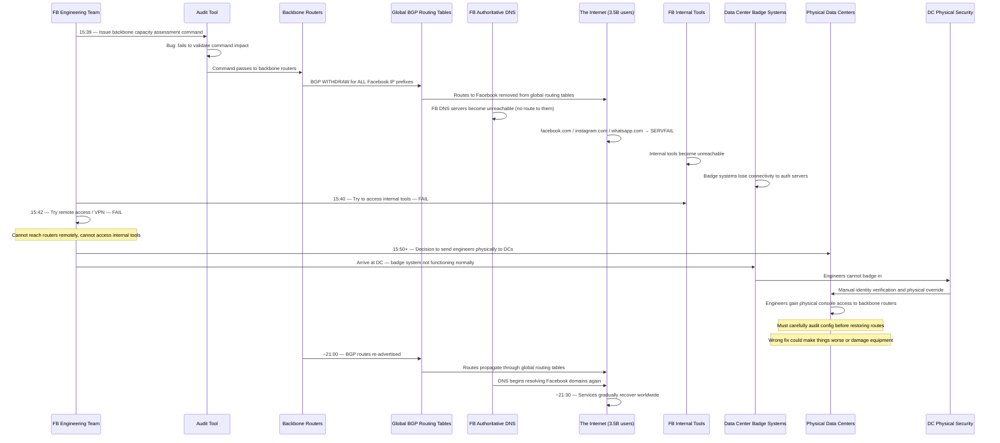
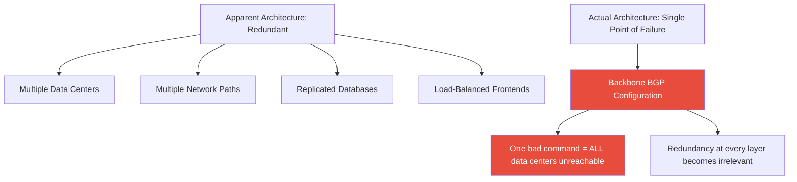

# Facebook's 6-Hour Global Outage (October 2021)

A single maintenance command on Facebook's backbone routers accidentally withdrew every BGP route the company advertised to the internet, making Facebook, Instagram, WhatsApp, and Messenger completely unreachable for 3.5 billion users for six hours — and the engineers who needed to fix it could not get into the data centers because the badge access system ran on Facebook's own now-unreachable network.

## The Alert

At 15:39 UTC on October 4, 2021, Facebook's DNS authoritative name servers stopped responding. Within minutes, DNS resolvers worldwide began returning SERVFAIL for facebook.com, instagram.com, whatsapp.com, and messenger.com. Unlike most outages where services are slow or partially available, this outage was absolute: there was no path on the internet to reach any Facebook service. The company had, for all practical purposes, disappeared from the internet.

External monitoring services like Downdetector showed a near-vertical spike in reports for Facebook, Instagram, and WhatsApp simultaneously. Within the networking community, engineers quickly identified the underlying cause by examining the global BGP routing tables: Facebook's BGP routes had been completely withdrawn. Their IP address ranges — the prefixes that told every router on the internet "send traffic for Facebook here" — had been pulled. No routes meant no reachability. No reachability meant no DNS. No DNS meant no Facebook.

The situation inside Facebook was even more alarming. Engineers quickly realized that their internal tools — Workplace (their internal communication platform), remote access VPNs, internal wikis, deployment systems, monitoring dashboards — all depended on the same network infrastructure that had just disappeared. They could not access the tools needed to diagnose or fix the problem.

::: danger What Went Wrong First
A configuration change issued by Facebook's engineering team to their backbone routers — intended to assess backbone network capacity — unintentionally withdrew ALL BGP route announcements for Facebook's IP prefixes. A bug in the audit tool that was supposed to validate the command failed to catch that the command would cause a total withdrawal. Every router on the internet simultaneously removed its routes to Facebook's networks, making all Facebook services unreachable.
:::

## Impact

| Metric | Detail |
|---|---|
| **Duration** | Approximately 6 hours (15:39 to ~21:30 UTC) |
| **Services affected** | Facebook, Instagram, WhatsApp, Messenger, Oculus/Meta Quest, Workplace, all internal Facebook/Meta tools |
| **Users affected** | ~3.5 billion users worldwide across all platforms |
| **Revenue loss** | Estimated $100+ million in lost advertising revenue |
| **Stock impact** | Facebook's stock dropped ~5% during and after the outage, representing ~$50 billion in market cap loss (partially recovered in following days) |
| **Mark Zuckerberg personal loss** | Estimated $6 billion drop in net worth during the outage |
| **Global communications impact** | WhatsApp serves as primary communication infrastructure in India, Brazil, Indonesia, and much of Africa and Southeast Asia — hundreds of millions of people lost their primary messaging platform |
| **Business impact** | Businesses that relied on WhatsApp Business, Facebook Marketplace, Instagram Shopping, and Facebook Ads were unable to operate |
| **Collateral DNS damage** | DNS resolvers worldwide (including Cloudflare 1.1.1.1, Google 8.8.8.8) experienced a 30x surge in query volume as billions of devices repeatedly tried to resolve Facebook domains |
| **Physical access problem** | Engineers could not enter data centers because badge access systems depended on Facebook's internal network |

::: warning Cascading Impact Beyond Facebook
The outage extended far beyond Facebook's own services. Because WhatsApp is the dominant messaging platform in dozens of countries — in India alone, WhatsApp has 500+ million users — the outage disrupted daily communication, business operations, and even government services that relied on WhatsApp. Telegram reported gaining 70 million new users during the outage. Signal saw a massive surge in downloads. The incident demonstrated how dependent global communications had become on a single company's infrastructure.
:::

## Timeline



### Detailed Chronology

| Time (UTC) | Event |
|---|---|
| **15:39** | A Facebook engineer executes a command on the backbone routers as part of a routine capacity assessment. The command is intended to evaluate traffic flow across the backbone network. The audit tool designed to validate such commands contains a bug — it does not detect that the command will cause a total BGP route withdrawal |
| **15:39:00–15:39:30** | The command executes on the backbone routers. All BGP route announcements for Facebook's IP prefixes are withdrawn. BGP WITHDRAW messages propagate to Facebook's peering partners (ISPs, IXPs, CDNs) |
| **15:39:30–15:40:00** | BGP withdrawals propagate across the global internet. Every ISP, cloud provider, and router that had a route to Facebook's IP addresses removes it. Within 60 seconds, there is no path on the internet to reach any Facebook IP address |
| **15:40:00–15:41:00** | DNS resolvers worldwide attempt to reach Facebook's authoritative DNS servers (which are hosted inside Facebook's network). The DNS queries have no route to follow. Resolvers begin returning SERVFAIL. Cached DNS records expire and cannot be refreshed |
| **15:41:00–15:45:00** | All Facebook services become completely unreachable. Users see connection errors, timeout messages, and DNS resolution failures across Facebook, Instagram, WhatsApp, and Messenger |
| **15:40–15:45** | Facebook engineers realize the scope of the problem. They attempt to use standard recovery procedures — remote SSH access to routers, VPN connections to the internal network, internal communication tools (Workplace). All fail. Every internal system depends on the same network that is down |
| **15:45–15:50** | The team grasps the severity: they have no remote access to the equipment that needs to be fixed. The only option is physical access to the data center facilities housing the backbone routers |
| **15:50–16:30** | Facebook dispatches engineers to data center facilities. Some facilities are nearby; others require travel. Upon arrival, engineers encounter an unexpected obstacle: the electronic badge access systems — which authenticate employee badges against internal servers — are not functioning normally because those servers are inside the unreachable network |
| **16:30–17:00** | Physical security staff at the data centers coordinate manual identity verification. Engineers are identified through alternative means and granted physical access to the facilities. This process is slow — it involves manual checks that the automated badge system normally handles in seconds |
| **17:00–20:00** | Engineers gain physical console access to backbone routers. However, they cannot simply "turn BGP back on." The routers handle configuration for one of the largest networks on the internet. An incorrect fix — a typo, a misconfigured prefix, a routing loop — could make things worse, potentially causing physical damage to equipment from traffic storms or creating routing instability that affects other networks. Engineers carefully audit the configuration, prepare the fix, and verify it step by step |
| **~20:00–21:00** | After thorough verification, engineers restore the BGP route announcements. Facebook's IP prefixes begin appearing in global routing tables again. ISPs and other networks receive the BGP ANNOUNCE messages and begin adding routes back to Facebook |
| **~21:00–21:30** | Services gradually come back online. DNS resolvers worldwide begin receiving valid responses from Facebook's authoritative name servers again. However, recovery is not instant — DNS caches need to refresh (some resolvers had cached the SERVFAIL responses and need their TTLs to expire), TCP connections need to be re-established, and application-level caches need to repopulate |
| **~21:30** | Full service restoration. Facebook, Instagram, WhatsApp, and Messenger are accessible worldwide |

## Root Cause

The root cause involved three failures working together: a dangerous maintenance command, a buggy validation tool, and infrastructure dependencies that prevented recovery.

### 1. The BGP Configuration Change

Facebook operates a massive backbone network that connects its data centers worldwide. The backbone routers use **BGP (Border Gateway Protocol)** to announce Facebook's IP address prefixes to the internet, telling every other router on the internet: "Traffic for these IP addresses should be sent to us."

```
Normal BGP operation:

Facebook backbone routers:
  → BGP ANNOUNCE: "I can reach 157.240.0.0/16"      (facebook.com)
  → BGP ANNOUNCE: "I can reach 31.13.24.0/21"       (Instagram)
  → BGP ANNOUNCE: "I can reach 157.240.0.0/24"      (WhatsApp)
  → BGP ANNOUNCE: "I can reach 185.89.218.0/23"     (additional prefixes)
  ... (hundreds of prefix announcements)

ISPs worldwide receive these announcements:
  → "Route traffic for 157.240.x.x to Facebook"
  → "Route traffic for 31.13.x.x to Facebook"
  → Users can reach facebook.com, instagram.com, whatsapp.com
```

A routine maintenance command was executed to assess the capacity of the backbone — essentially, to understand how traffic was flowing across the backbone links and whether any links were near capacity. The command was supposed to be a **read-only assessment**. But due to a bug in the audit tool (described below), the command issued a configuration change that withdrew all BGP route announcements instead.

```
What the command was supposed to do:
  → Read traffic statistics from backbone links
  → Report utilization percentages
  → No configuration changes

What the command actually did:
  → Issued a BGP configuration change
  → Withdrew ALL route announcements for ALL Facebook IP prefixes
  → Every Facebook IP address became unreachable from the internet
```

### 2. The Audit Tool Bug

Facebook had an audit tool designed to validate commands before they were applied to backbone routers. This tool was supposed to catch dangerous commands — including commands that would result in widespread BGP withdrawal — and block them.

The tool had a bug. It did not correctly evaluate the impact of the specific command being run. It approved a command that resulted in a total withdrawal of all BGP routes. The safety net that was supposed to prevent exactly this scenario failed silently.

```mermaid
graph TD
    A["Engineer issues capacity assessment command"] --> B["Audit tool evaluates command"]
    B --> C{{"Does command cause dangerous BGP changes?"}}
    C -->|Tool should answer YES| D["Block command, alert engineer"]
    C -->|Tool answers NO (BUG)| E["Command approved and executed"]
    E --> F["All BGP routes withdrawn"]
    F --> G["Facebook disappears from the internet"]

    style C fill:#e67e22,color:#fff
    style E fill:#e74c3c,color:#fff
    style G fill:#e74c3c,color:#fff
    style D fill:#27ae60,color:#fff
```

::: danger The Safety Net That Wasn't
The audit tool was Facebook's primary safeguard against dangerous backbone changes. When that safeguard failed, there was no secondary check — no human approval requirement, no simulation step, no "are you sure you want to withdraw 100% of BGP routes?" prompt. A single tool bug eliminated the entire safety layer.
:::

### 3. BGP Withdrawal Propagation

When a BGP route is withdrawn, the withdrawal propagates across the entire internet within seconds to minutes. Every router that had a route to Facebook's IP addresses received a BGP WITHDRAW message and removed those routes from its routing table. This is by design — BGP is a protocol for sharing routing information, and withdrawals are just as important as announcements. They tell routers: "Stop sending traffic to this destination; the destination is no longer reachable through this path."

The speed of BGP propagation worked against Facebook. Within approximately 60 seconds, every ISP, every cloud provider, every internet exchange point, and every enterprise router on the planet had removed its routes to Facebook. The withdrawal was complete and global.

### 4. DNS Failure Was a Consequence, Not the Cause

Many initial reports described this as a "DNS outage." While DNS resolution did fail for all Facebook domains, this was a **consequence** of the BGP withdrawal, not the root cause.

Facebook's authoritative DNS servers are hosted inside Facebook's network. When the BGP routes to that network were withdrawn, the DNS servers became unreachable — not because DNS was broken or misconfigured, but because there was no network path for DNS queries to travel.

```
The failure chain:

BGP routes withdrawn
  → No network path to Facebook's IP addresses
    → DNS resolvers cannot reach Facebook's authoritative DNS servers
      → DNS queries for facebook.com return SERVFAIL
        → Users see "can't reach this page" / "DNS resolution failed"
          → Users assume "DNS is broken" (but DNS was working fine —
             it correctly reported that Facebook was unreachable)
```

Additionally, the DNS failure created a cascading amplification effect. Billions of devices worldwide had Facebook, Instagram, and WhatsApp apps installed. When these apps could not reach their servers, they retried — repeatedly. Each retry generated DNS queries that flooded DNS resolver services worldwide.

Cloudflare reported that their 1.1.1.1 DNS resolver experienced a **30x increase** in query volume for Facebook-related domains. This surge put pressure on DNS infrastructure globally, potentially degrading DNS resolution speed for entirely unrelated domains.

### 5. The Physical Access Problem — Keys Locked in the Car

The most dramatic aspect of the incident was the recovery paradox. Facebook's engineers knew what was wrong — they needed to access the backbone routers and restore the BGP configuration. But they could not reach the routers.

| Access Method | Status | Why |
|---|---|---|
| **SSH / remote console** | Failed | Required network connectivity to Facebook's internal network — which was down |
| **VPN** | Failed | VPN terminators were inside Facebook's network — unreachable |
| **Internal communication (Workplace)** | Failed | Workplace runs on Facebook infrastructure — down |
| **Out-of-band management (iLO/IPMI)** | Failed or limited | Management network had dependencies on the production network |
| **Physical badge access to data centers** | Degraded | Badge systems authenticated against internal servers — unreachable |
| **Physical console access** | Eventually worked | Required manual identity verification and physical security override |

::: warning The Recovery Paradox
Facebook's internal infrastructure — including badge access systems, remote management interfaces, VPN concentrators, and internal communication tools — all depended on the same network that was down. Fixing the problem required access to tools that were unavailable because of the problem. This is the "keys locked in the car" scenario at infrastructure scale.

Every system that you need during an outage must be independent of the systems that can cause the outage. If your recovery tools depend on the thing that is broken, you do not have recovery tools.
:::

The physical badge system dependency was particularly noteworthy. Modern data center badge systems typically authenticate badge swipes against a central directory (like Active Directory or LDAP) to verify that the person is authorized. In Facebook's case, those directory servers were inside the network that was unreachable. Engineers who arrived at the data center physically could not badge in — even though they were standing right in front of the door to the equipment they needed to fix.

Data center security teams had to fall back to manual identity verification — checking IDs, calling managers on personal cell phones, following emergency override procedures that were rarely exercised. This process added significant time to the recovery.

## The Fix

### Immediate Response

1. **Diagnosed the BGP withdrawal** (15:39–15:45) — Engineers identified that all BGP routes were withdrawn by examining public BGP looking glass tools (since internal tools were unreachable)
2. **Attempted remote access** (15:45–15:50) — All remote access methods failed
3. **Dispatched engineers physically** (15:50+) — Teams sent to data center facilities
4. **Gained physical access** (16:30–17:00) — Manual identity verification bypassed badge systems
5. **Audited and prepared fix** (17:00–20:00) — Engineers carefully reviewed router configuration, prepared the correction, and verified it would not create additional problems
6. **Restored BGP routes** (~21:00) — Routes re-advertised to the internet
7. **Service recovery** (~21:00–21:30) — DNS resolution restored, services came back online gradually as caches refreshed

### Why the Fix Took So Long

A common question is: "If they knew the BGP routes were withdrawn, why did it take 6 hours to put them back?" The answer involves multiple factors:

| Factor | Time Cost |
|---|---|
| **Remote access impossible** | +30 minutes discovering this, dispatching engineers |
| **Travel to data centers** | +30–60 minutes depending on engineer location |
| **Physical badge access problems** | +30–60 minutes for manual security override |
| **Configuration audit before fix** | +2–3 hours of careful verification |
| **BGP propagation and DNS cache refresh** | +30 minutes after routes restored |

The configuration audit was the largest time sink, but it was critical. Facebook's backbone routers carry configuration for one of the largest networks on the internet. An incorrect configuration change — a typo in a prefix, a missing route filter, an accidental route leak — could:
- Create routing loops that cause traffic storms
- Leak Facebook's internal routes to the public internet
- Cause BGP oscillation that destabilizes neighboring networks
- Overload router CPUs with convergence calculations

Engineers had to be absolutely certain their fix was correct before applying it. In an incident caused by a bad configuration change, the last thing you want is a second bad configuration change.

### Long-Term Changes

**1. Out-of-band management network**

Facebook invested in a fully independent out-of-band management network — a separate network path that is completely independent of the production backbone. This network uses different physical links, different routers, and different authentication infrastructure. It allows engineers to access critical network equipment even when the main backbone is completely down.

```
BEFORE:
  Production backbone ──── Remote access to routers
                      ──── Badge system authentication
                      ──── Internal communication
                      ──── Monitoring dashboards
  (Single failure takes everything down)

AFTER:
  Production backbone ──── Normal operations
  OOB management net  ──── Emergency router access (independent links)
  Independent auth    ──── Badge system fallback (independent of production)
  External comms      ──── Incident communication (third-party service)
  Independent monitoring── Core health metrics (separate infrastructure)
```

**2. BGP safety checks with hard limits**

Configuration changes to backbone routers now go through multiple layers of automated validation:

| Check | What It Prevents |
|---|---|
| **Prefix withdrawal limit** | Refuses to withdraw more than X% of prefixes in a single change |
| **Impact simulation** | Simulates the effect of every change before applying it |
| **Reachability verification** | Confirms that after the change, Facebook's critical prefixes remain advertised |
| **Human confirmation for high-impact changes** | Any change that affects global reachability requires explicit human approval with the impact displayed |
| **Dry-run mode** | All assessment commands run in dry-run mode by default; destructive mode requires explicit opt-in |

**3. Rebuilt audit tool with defense in depth**

The audit tool that contained the critical bug was completely rewritten with multiple safeguards:
- Commands are classified by risk level (read-only, low-impact modification, high-impact modification, critical/destructive)
- High-impact and critical commands require additional authentication and display an explicit impact preview
- The tool cross-checks its analysis against an independent validation system (defense in depth — if the primary analysis has a bug, the secondary check may still catch it)

**4. Physical access independence**

Data center physical access systems were re-architected to function independently of Facebook's production network:
- Badge systems can authenticate locally using cached credentials
- Fallback authentication mechanisms work without any network connectivity
- Emergency access procedures are documented, distributed to all DC security staff, and drilled regularly

**5. Incident communication independence**

Facebook established emergency communication channels for engineering teams that do not depend on Facebook's own infrastructure:
- Pre-established group channels on third-party messaging platforms
- Phone trees with personal cell phone numbers
- Physical war room procedures for critical data center sites

**6. BGP monitoring from external vantage points**

Facebook now monitors its own BGP route advertisements from external vantage points — checking that its prefixes are visible in public BGP looking glass servers. If BGP visibility drops below a threshold, automated alerts fire through channels that do not depend on Facebook's network.

## Lessons Learned

### 1. Out-of-band access is not optional — it is existential

::: tip Core Lesson
Out-of-band (OOB) management access means having a completely independent path to your critical infrastructure that does not depend on the production network. This can be:
- A separate physical management network with independent routers and links
- Cellular-based remote access cards (iLO, iDRAC, IPMI) with dedicated SIMs
- A VPN through a completely different provider and network path
- Physical console access with authentication that works offline

If your only way to fix the network is through the network, you have a single point of failure in your recovery process. Facebook's 6-hour outage would have been a 1-hour outage if engineers had immediate out-of-band access to backbone routers.
:::

### 2. BGP is powerful and dangerous — treat it with extreme care

BGP is the protocol that holds the internet together. A single misconfiguration can make an entire organization — even one serving 3.5 billion users — unreachable worldwide in under 60 seconds. BGP changes should be treated with the same gravity as database schema migrations in production: staged, validated, simulated, and reversible.

The asymmetry is striking: it took one command to withdraw all routes (60 seconds to propagate globally), and 6 hours to restore them. The "undo" was vastly harder than the "do" because the undo required physical access to equipment that was isolated by the failure.

### 3. Audit tools are a single point of failure if they are the only safety check

Facebook had an audit tool designed to prevent exactly this scenario. It failed because it had a bug. The lesson is not that audit tools are useless — they are essential. The lesson is that a single safety check is a single point of failure.

Defense in depth requires multiple independent safety checks:
- The audit tool validates the command
- A simulation previews the impact
- A human reviews the simulation output
- A hard limit prevents withdrawal of more than N% of routes
- Monitoring detects the withdrawal and alerts within seconds

If any one check fails, the others catch the problem.

### 4. Your infrastructure dependencies include physical access

It is easy to forget that physical access to servers, network equipment, and data centers is itself a system with dependencies. Electronic badge systems, biometric scanners, and security databases all depend on infrastructure. If that infrastructure fails, physical access may be blocked — precisely when physical access is most needed.

### 5. DNS is only as reliable as its network path

Highly available [DNS](/system-design/networking/dns-deep-dive) infrastructure does not help if there is no network route to reach it. DNS availability depends on both the DNS servers being operational AND the network paths to those servers being intact. Facebook's DNS was technically working perfectly — it was the network path to the DNS servers that had been destroyed.

This is why many large organizations host their authoritative DNS on third-party providers (like Cloudflare, AWS Route 53, or Google Cloud DNS) rather than on their own infrastructure. If Facebook's DNS had been hosted externally, the DNS servers would have remained reachable — they would have returned errors (since the actual services were unreachable), but the DNS layer itself would not have added to the confusion.

### 6. Global impact demands global responsibility

With 3.5 billion users and WhatsApp serving as critical communication infrastructure in dozens of countries, the outage had impacts that extended well beyond technology into daily life, commerce, and even public safety. Companies whose products serve as essential communication infrastructure have a heightened responsibility for resilience — and a heightened obligation to ensure that single-command failures cannot take everything offline.

### 7. The speed of failure vastly exceeds the speed of recovery

The failure propagated globally in 60 seconds. Recovery took 6 hours — a 360:1 ratio. This asymmetry is fundamental to networking incidents: breaking something (withdrawing a route, dropping a table, deleting a DNS record) is nearly instantaneous, while fixing it requires understanding, access, verification, and propagation.

Systems should be designed with this asymmetry in mind. If a failure can happen in seconds, recovery should be possible in minutes, not hours. This requires pre-positioned recovery mechanisms: out-of-band access, cached configurations, automated restoration procedures.

### 8. Read-only operations must actually be read-only

The maintenance command was intended to be a read-only capacity assessment. But the audit tool's bug allowed it to issue a write (a BGP configuration change). This is a violation of the principle of least privilege applied to operations tooling. Assessment commands should be structurally incapable of modifying configuration — not just "expected not to" but "architecturally unable to." This can be enforced through separate tool interfaces for read and write operations, separate authentication levels, or separate command pathways that are physically isolated.

### 9. Single points of failure hide in unexpected places

Facebook's infrastructure was built with redundancy at many layers — multiple data centers, multiple network paths, replicated databases. But the backbone BGP configuration was a single point of failure that, when it failed, made all the redundancy irrelevant. The redundant data centers were fine. The replicated databases were healthy. But none of it mattered because there was no network path for users to reach any of it. Single points of failure are not always in the obvious places (servers, databases). They can be in configuration layers, routing protocols, or operational tooling.



## What You Can Learn

1. **Build out-of-band access for critical systems.** Ensure you can access your most critical infrastructure (routers, database servers, deployment systems) through a path that is completely independent of your production network. Test this path regularly — at least quarterly. An OOB path that has never been tested is not trustworthy.

2. **Simulate total network failure.** As part of [chaos engineering](/devops/incident-response/chaos-engineering), test what happens when your network layer completely fails. Can your team still access the servers? Can they communicate with each other? Can they deploy a fix? Do the badge systems work? If any answer is "no," fix it before the real incident.

3. **Add multiple independent safety checks to infrastructure changes.** Any tool that modifies network routing, DNS records, or firewall rules should include validation that rejects changes resulting in total unreachability. Do not rely on a single check — use defense in depth with independent validation layers, simulations, and hard limits.

4. **Ensure physical access independence.** If your building access system depends on your network, add a fallback. Local credential caching, physical keys, manual overrides, or security staff who can verify identity without the electronic system. Test these fallbacks regularly.

5. **Have a communication plan that does not depend on your product.** If your company's internal communication runs on your own infrastructure (like Workplace for Facebook, Slack for Salesforce, Teams for Microsoft), have a pre-established backup plan. Pre-configure communication channels on third-party platforms. Maintain an up-to-date phone tree with personal numbers.

6. **Host authoritative DNS on infrastructure independent of your application network.** If your DNS servers are inside the same network as your application, a network-level failure takes DNS down too — amplifying the outage with DNS resolution failures. Consider hosting DNS on a third-party provider or on a network path that is independent of your main backbone.

7. **Monitor your own reachability from the outside.** Do not rely solely on internal monitoring to confirm you are reachable. Use external monitoring services, public BGP looking glass tools, and third-party synthetic monitoring to verify that your services are reachable from the internet. If internal monitoring says everything is fine but external monitoring says you are unreachable, external monitoring is right.

8. **Enforce structural separation between read and write operations.** Assessment and audit commands should be architecturally incapable of modifying production configuration. Do not rely on software validation alone — use separate tool binaries, separate authentication tokens, or separate command channels for read-only vs. read-write operations.

9. **Map your real single points of failure, not just the obvious ones.** Conduct a dependency analysis that goes beyond servers and databases. Include routing configuration, DNS, certificate authorities, cloud provider control planes, physical access systems, and operational tooling. Any component whose failure makes all other redundancy irrelevant is a single point of failure, regardless of how much redundancy exists at other layers.

10. **Pre-position recovery assets.** Facebook's recovery was delayed because engineers had to travel to data centers, negotiate physical access, and then carefully audit configuration under stress. Pre-positioned recovery assets — cached configurations on local storage at each DC, pre-authenticated recovery consoles, printed emergency runbooks — would have reduced recovery time significantly. The best time to position these assets is before you need them.

## What Would You Do?

Test your incident response instincts against the decisions Facebook's engineers actually faced.

::: details Scenario 1: It is 15:45 UTC on October 4, 2021. All Facebook services are down. You know the BGP routes were withdrawn. You try SSH — it fails. You try VPN — it fails. Your internal communication tool (Workplace) is down. How do you coordinate your team and get access to the backbone routers?
**What Facebook did:** With all remote access methods failed, they dispatched engineers physically to data center facilities. But the electronic badge access systems also depended on the internal network, so engineers could not badge in. Physical security staff had to perform manual identity verification — checking IDs, calling managers on personal cell phones — before granting access. This added over an hour to the recovery. The lesson: every system you need during an outage must be independent of the systems that can cause the outage. Pre-establish communication on third-party platforms and ensure physical access works without network connectivity.
:::

::: details Scenario 2: Your engineers finally have physical console access to the backbone routers. You know the fix is to re-advertise the BGP routes. Do you (A) immediately restore all BGP announcements to get services back as fast as possible, (B) carefully audit the configuration and verify the fix step by step before applying it, or (C) restore routes for one service at a time?
**What Facebook did:** They chose **(B) — careful audit and verification**, which took approximately 3 hours. This was the right call. Facebook's backbone routers carry configuration for one of the largest networks on the internet. An incorrect fix — a typo in a prefix, a missing route filter, a routing loop — could cause traffic storms, leak internal routes to the public internet, or destabilize neighboring networks. In an incident caused by a bad configuration change, the last thing you want is a second bad configuration change. The 3-hour audit cost additional downtime but ensured the recovery was clean.
:::

::: details Scenario 3: Post-incident, you must redesign your infrastructure to prevent a single BGP command from making the entire company unreachable. What is your highest-priority architectural change?
**What Facebook did:** Their highest priority was building a fully independent **out-of-band (OOB) management network** — a separate network path with different physical links, different routers, and different authentication infrastructure. This ensures engineers can access critical network equipment even when the main backbone is completely down. They also added BGP safety checks with hard limits (refusing to withdraw more than X% of prefixes in a single change), rebuilt the audit tool with defense in depth, and ensured physical access systems work independently of the production network.
:::

::: tip Key Lessons
- **Out-of-band access is existential, not optional.** If your only way to fix the network is through the network, you have a single point of failure in your recovery process.
- **BGP changes should be treated like database migrations.** Staged, validated, simulated, and reversible. A single misconfiguration can make an entire company unreachable in 60 seconds.
- **Audit tools are a single point of failure if they are the only safety check.** Defense in depth requires multiple independent safety layers — if one fails, the others catch the problem.
- **The speed of failure vastly exceeds the speed of recovery.** The failure took 60 seconds to propagate globally. Recovery took 6 hours — a 360:1 ratio.
- **Read-only operations must be structurally incapable of writing.** Assessment commands should be architecturally unable to modify configuration, not just "expected not to."
:::

::: details Quiz

**Q1: What was the root cause of the Facebook outage on October 4, 2021?**
A configuration change intended to assess backbone network capacity unintentionally withdrew ALL BGP route announcements for Facebook's IP prefixes. A bug in the audit tool that was supposed to validate the command failed to catch that it would cause a total withdrawal.

**Q2: Why did DNS resolution for facebook.com fail during the outage?**
Facebook's authoritative DNS servers are hosted inside Facebook's network. When the BGP routes to that network were withdrawn, the DNS servers became unreachable — not because DNS was broken, but because there was no network path for DNS queries to reach them. DNS correctly reported that Facebook was unreachable.

**Q3: Why could Facebook engineers not remotely fix the problem?**
Every remote access method (SSH, VPN, out-of-band management) depended on the same internal network that was down. The BGP withdrawal made the entire Facebook network unreachable, including all management interfaces.

**Q4: What happened when engineers arrived at the data centers to fix the problem physically?**
The electronic badge access systems authenticated against internal servers that were inside the unreachable network. Engineers could not badge in. Physical security staff had to perform manual identity verification, which added significant time to the recovery.

**Q5: What impact did the BGP withdrawal have on DNS infrastructure globally, beyond Facebook?**
DNS resolvers worldwide (including Cloudflare 1.1.1.1 and Google 8.8.8.8) experienced a 30x surge in query volume as billions of devices with Facebook, Instagram, and WhatsApp apps repeatedly retried DNS resolution. This surge put pressure on global DNS infrastructure, potentially degrading resolution speed for unrelated domains.
:::

## One-Liner Summary

One maintenance command withdrew every BGP route to Facebook for 3.5 billion users, and the engineers who needed to fix it could not get into the building because the badge system ran on Facebook's own now-unreachable network.

## Further Reading

- [Facebook Engineering — More details about the October 4 outage](https://engineering.fb.com/2021/10/05/networking-traffic/outage-details/) (October 5, 2021) — Facebook's detailed postmortem
- [Facebook Engineering — Understanding the October 4 outage](https://engineering.fb.com/2021/10/04/networking-traffic/outage/) (October 4, 2021) — Initial incident explanation
- [Cloudflare Blog — Understanding How Facebook Disappeared from the Internet](https://blog.cloudflare.com/october-2021-facebook-outage/) (October 4, 2021) — Cloudflare's external analysis of the BGP withdrawal
- [DNS Deep Dive](/system-design/networking/dns-deep-dive) — Understanding DNS and its dependency on network reachability
- [Chaos Engineering](/devops/incident-response/chaos-engineering) — Testing total failure scenarios
- [Cloudflare Regex Outage](/war-room/cloudflare-regex-2019) — Another case of internal tools depending on production infrastructure
- [Circuit Breaker Pattern](/system-design/distributed-systems/circuit-breaker) — Automated safety mechanisms for critical systems
- [Consistency Models](/system-design/distributed-systems/consistency-models) — Understanding availability vs. consistency tradeoffs
