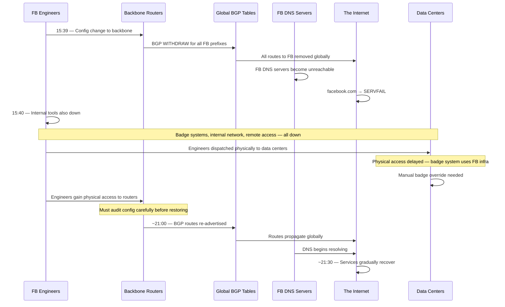

# Facebook's 6-Hour Global Outage (October 2021)

On October 4, 2021, at approximately 15:39 UTC, Facebook, Instagram, WhatsApp, Messenger, and Oculus became completely unreachable worldwide. Not degraded. Not slow. Completely gone — as if the company's entire infrastructure had ceased to exist on the internet. The outage lasted approximately 6 hours, making it one of the longest and most complete outages in the history of major internet services.

The cause was a configuration change to Facebook's backbone network routers that accidentally withdrew all BGP route announcements, effectively removing Facebook from the internet's routing tables. To make matters worse, the failure also disabled Facebook's internal tooling — including the physical badge access system at their data centers — making recovery extraordinarily difficult.

## The Alert

At 15:39 UTC, Facebook's DNS servers stopped responding. Within minutes, DNS resolvers worldwide began returning SERVFAIL for facebook.com, instagram.com, and whatsapp.com. Unlike most outages where services are slow or partially available, this outage was absolute: there was no path on the internet to reach any Facebook service.

External monitoring services like Downdetector showed a near-vertical spike in reports for Facebook, Instagram, and WhatsApp simultaneously. Within the networking community, engineers quickly identified that Facebook's BGP routes had been completely withdrawn — their IP address ranges were no longer being advertised to the global internet.

::: danger What Went Wrong First
A configuration change issued by Facebook's engineering team to their backbone routers unintentionally withdrew all BGP route announcements for Facebook's IP prefixes. Every router on the internet simultaneously removed the routes to Facebook's networks, making all Facebook services unreachable.
:::

## Impact

- **Duration**: Approximately 6 hours (15:39 to ~21:30 UTC)
- **Services affected**: Facebook, Instagram, WhatsApp, Messenger, Oculus, Workplace, all internal Facebook tools
- **Users affected**: An estimated 3.5 billion users worldwide across all platforms
- **Revenue impact**: Facebook estimated approximately $100 million in lost advertising revenue
- **Stock impact**: Facebook's stock dropped ~5% during the outage, a ~$50 billion market cap loss (much of which recovered)
- **Global communications impact**: In countries where WhatsApp is the primary communication platform (India, Brazil, much of Africa and Southeast Asia), the outage disrupted essential daily communication for hundreds of millions of people
- **Collateral damage**: DNS resolver services like Cloudflare's 1.1.1.1 experienced a 30x surge in traffic as billions of devices repeatedly tried to resolve Facebook domains

## Timeline



### Detailed Chronology

**15:39 UTC** — A configuration change is applied to Facebook's backbone routers. The change was intended to assess the capacity of Facebook's backbone network. Due to a bug in the audit tool, the command instead withdraws all BGP route announcements for Facebook's IP prefixes.

**15:39–15:40 UTC** — BGP withdrawal messages propagate across the global internet within seconds. Every ISP, every cloud provider, every router on the internet removes its routes to Facebook's IP addresses. Facebook's DNS authoritative name servers, which are inside Facebook's network, become unreachable.

**15:40–15:45 UTC** — DNS resolvers worldwide begin returning SERVFAIL for all Facebook-owned domains. Devices that have cached DNS records can still reach IP addresses, but since the routes are withdrawn, the packets have nowhere to go. All Facebook services are completely unreachable.

**15:45–16:00 UTC** — Facebook engineers realize that their internal tools — which run on the same infrastructure — are also down. They cannot access the remote management interfaces for the backbone routers. They cannot VPN into the network. They cannot use their internal communication tools (Workplace). Even their physical badge access system, which authenticates against internal servers, is not functioning normally.

**16:00–17:00 UTC** — Facebook dispatches engineers to data center facilities. Physical access is complicated because the electronic badge systems rely on the internal network that is down. Manual overrides and physical security coordination are required.

**17:00–20:00 UTC** — Engineers gain physical access to backbone routers. However, they must proceed carefully. The routers are handling configuration for a massive network, and an incorrect fix could make things worse. Engineers audit the configuration, verify their fix, and prepare to restore BGP announcements.

**~21:00 UTC** — BGP route announcements are restored. Facebook's IP prefixes begin appearing in global routing tables again. DNS resolvers can once again reach Facebook's authoritative name servers.

**~21:30 UTC** — Services gradually come back online. DNS propagation and cache refreshing mean recovery is not instant — different users in different locations regain access over a period of minutes to an hour.

## Root Cause

### The BGP Configuration Change

Facebook operates a massive backbone network that connects its data centers worldwide. The backbone routers use BGP (Border Gateway Protocol) to announce Facebook's IP address prefixes to the internet, telling the rest of the world "traffic for these IP addresses should be sent to us."

A routine maintenance command was executed to assess the capacity of the backbone. The command was supposed to evaluate traffic flow, but a bug in the audit tool caused it to issue a command that withdrew all BGP route announcements instead.

### BGP Withdrawal Propagation

When a BGP route is withdrawn, the withdrawal propagates across the entire internet within minutes. Every router that had a route to Facebook's IP addresses received a withdrawal message and removed those routes. This is by design — BGP is a protocol for sharing routing information, and withdrawals are just as important as announcements (they tell routers to stop sending traffic to a destination).

```
Normal state:
  FB Router → BGP ANNOUNCE: "I can reach 157.240.0.0/16"
  ISPs worldwide → "Route traffic for 157.240.x.x to Facebook"

After the incident:
  FB Router → BGP WITHDRAW: "I can no longer reach 157.240.0.0/16"
  ISPs worldwide → "Remove all routes to 157.240.x.x"
  Result: No path exists on the internet to reach Facebook
```

### DNS Failure Was a Consequence, Not the Cause

Many initial reports described this as a "DNS outage." While DNS resolution did fail for Facebook domains, this was a consequence of the BGP withdrawal, not the cause. Facebook's authoritative DNS servers are hosted inside Facebook's network. When the BGP routes to that network were withdrawn, the DNS servers became unreachable — not because DNS was broken, but because there was no network path to reach them.

### The Physical Access Problem

The most dramatic aspect of the incident was that Facebook's recovery was delayed because engineers could not easily access the equipment needed to fix the problem.

::: warning Watch Out for This
Facebook's internal infrastructure — including badge access systems, remote management interfaces, and internal communication tools — all depended on the same network that was down. This created a recovery paradox: fixing the problem required access to tools that were unavailable because of the problem.

This is the "keys locked in the car" scenario at infrastructure scale. Your recovery procedures must not depend on the systems that are broken.
:::

## The Fix

### Immediate Response
1. Engineers dispatched physically to data center locations
2. Manual/physical access obtained through security coordination (bypassing electronic badge system)
3. Direct physical console access to backbone routers
4. Configuration audited and corrected
5. BGP routes restored carefully, with verification at each step

### Long-Term Changes

**1. Out-of-band management network**

Facebook invested in an out-of-band management network — a separate network path that is completely independent of the production backbone and can be used to access critical network equipment even when the main network is down.

**2. BGP safety checks**

Configuration changes to backbone routers now go through additional automated validation that would reject changes resulting in total BGP withdrawal. This includes:
- Simulating the effect of a configuration change before applying it
- Refusing to withdraw more than a certain percentage of prefixes in a single change
- Requiring human confirmation for changes that affect global reachability

**3. Improved audit tooling**

The audit tool that contained the bug was rewritten with safeguards against issuing destructive commands when performing read-only assessments.

**4. Physical access independence**

Data center physical access systems were evaluated to ensure they can function independently of the production network, with fallback authentication mechanisms that do not rely on Facebook's infrastructure.

**5. Incident communication independence**

Facebook established communication channels for engineers that do not depend on Facebook's own infrastructure — ensuring that during an outage, teams can still coordinate effectively.

## Lessons Learned

### 1. Out-of-band access is not optional

::: tip What Saves You
Out-of-band (OOB) management access means having a completely independent path to your critical infrastructure that does not depend on the production network. This can be:
- A separate physical management network
- Cellular-based remote access cards (iLO, iDRAC, IPMI)
- A VPN through a different provider
- Physical console access with independent authentication

If your only way to fix the network is through the network, you have a single point of failure in your recovery process.
:::

### 2. BGP is powerful and dangerous

BGP is the protocol that holds the internet together, and a single misconfiguration can make an entire organization unreachable worldwide in seconds. BGP changes should be treated with the same gravity as database schema migrations in production — staged, validated, and reversible.

### 3. Your infrastructure dependencies include physical access

It is easy to forget that physical access to servers, network equipment, and data centers is itself a system with dependencies. Electronic badge systems, biometric scanners, and security databases all depend on infrastructure. If that infrastructure fails, physical access may be blocked.

### 4. DNS is only as reliable as its network path

Highly available [DNS](/system-design/networking/dns-deep-dive) infrastructure does not help if there is no network route to reach it. DNS availability depends on both the DNS servers being operational AND the network paths to those servers being intact.

### 5. Global impact demands global communication

With 3.5 billion users and WhatsApp serving as critical communication infrastructure in many countries, the outage had impacts beyond technology. Companies whose products serve as essential communication infrastructure have a heightened responsibility for resilience.

## What You Can Learn

1. **Build out-of-band access for critical systems.** Ensure you can access your most critical infrastructure (routers, database servers, deployment systems) through a path that is completely independent of your production network. Test this path regularly.

2. **Simulate total network failure.** As part of [chaos engineering](/devops/incident-response/chaos-engineering), test what happens when your network layer completely fails. Can your team still access the servers? Can they communicate? Can they deploy a fix?

3. **Add safety checks to infrastructure changes.** Any tool that modifies network routing, DNS records, or firewall rules should include validation that rejects changes that would result in total unreachability. Implement dry-run modes and staged rollouts for infrastructure changes.

4. **Ensure physical access independence.** If your building access system depends on your network, add a fallback. Physical keys, manual overrides, or security staff who can verify identity without the electronic system.

5. **Have a communication plan that does not depend on your product.** If your company's internal communication runs on your own infrastructure (like Workplace for Facebook), have a backup plan. Pre-establish communication channels on third-party platforms for incident response.

---

*Sources: [Facebook Engineering — More details about the October 4 outage](https://engineering.fb.com/2021/10/05/networking-traffic/outage-details/) (October 5, 2021); [Facebook Engineering — Understanding the October 4 outage](https://engineering.fb.com/2021/10/04/networking-traffic/outage/) (October 4, 2021); [Cloudflare Blog — Understanding How Facebook Disappeared from the Internet](https://blog.cloudflare.com/october-2021-facebook-outage/) (October 4, 2021).*
