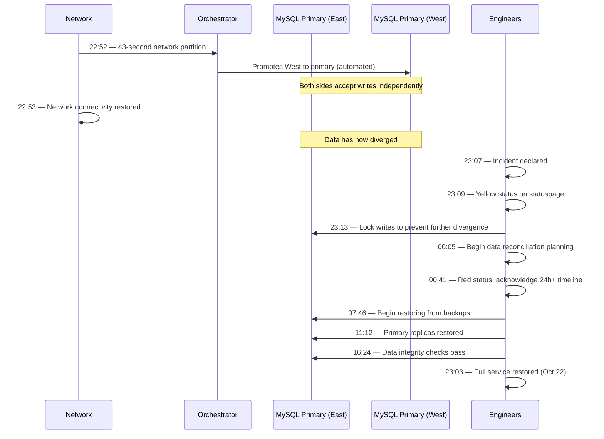

# GitHub's 24-Hour Outage (October 2018)

On October 21, 2018, at 22:52 UTC, a routine network maintenance operation caused a 43-second connectivity loss between a US East Coast network hub and a primary US East Coast data center. That 43-second blip triggered an automated database failover that would keep GitHub in a degraded state for over 24 hours.

This incident is one of the most instructive production failures in modern software engineering. It demonstrates how automated failover — a feature designed to increase availability — can make things dramatically worse when dealing with stateful systems.

## The Alert

At 22:52 UTC on October 21, 2018, GitHub's internal monitoring detected a burst of errors. Within seconds, engineers were alerted to widespread service degradation. The initial symptoms were confusing: some data appeared to be available, other data was not, and some data appeared to be out of date.

::: danger What Went Wrong First
A routine maintenance event caused a brief loss of connectivity between the network hub and the primary data center hosting GitHub's MySQL cluster primaries. The partition lasted just 43 seconds — but that was enough to trigger automated failover.
:::

## Impact

- **Duration**: 24 hours and 11 minutes of degraded service
- **Services affected**: GitHub.com, GitHub API, GitHub Pages, webhooks, GitHub Actions (then in beta)
- **Data consistency**: Some data written during the incident was out of order or appeared to revert. Pull requests, comments, and issues created during the incident showed inconsistencies
- **Users affected**: Tens of millions of developers worldwide
- **Revenue impact**: Enterprise customers experienced disruption; webhooks and CI/CD pipelines stalled across the industry
- **Downstream impact**: Thousands of companies' CI/CD pipelines, dependency downloads, and deployment processes were blocked

## Timeline



### Detailed Chronology

**22:52 UTC** — A 43-second network partition occurs between the network hub and the primary data center. GitHub's Orchestrator (their MySQL high-availability tool) detects the primary MySQL nodes as unreachable and begins automated failover.

**22:52–22:53 UTC** — Orchestrator promotes replicas in a different data center to become the new primaries. The original primaries, which are still running and accepting writes on their side of the partition, do not know they have been replaced. For 43 seconds, both sides accept writes independently. When the network heals, the data has diverged.

**23:07 UTC** — Engineers recognize this is not a simple failover recovery. The new primaries in the West Coast data center have writes that the East Coast does not have, and vice versa. Simply failing back would lose data.

**23:13 UTC** — Engineers make the critical decision to stop all writes to prevent further divergence. This means GitHub is now effectively read-only for many operations.

**00:05 UTC (Oct 22)** — The team determines that reconciling the diverged data will require restoring from backups and replaying changes. They estimate this will take many hours.

**00:41 UTC** — GitHub updates their status page to red and publicly acknowledges the situation will take significantly longer than initially expected.

**07:46 UTC** — After extensive planning, engineers begin restoring MySQL clusters from backup, a process that involves terabytes of data.

**11:12–16:24 UTC** — Clusters are restored. Engineers run data integrity checks comparing the restored data against both the East and West data center writes to ensure nothing is lost.

**23:03 UTC (Oct 22)** — Full service restored, 24 hours and 11 minutes after the initial trigger.

## Root Cause

The root cause was the interaction between three factors:

### 1. Automated Failover Without Human Verification

GitHub used **Orchestrator**, their open-source MySQL high-availability tool, to manage failover automatically. When the 43-second partition occurred, Orchestrator followed its programming: it detected the primaries as unreachable and promoted new ones.

The problem is that Orchestrator could not distinguish between "the primary is permanently dead" and "there is a brief network blip." For stateless services, automatic failover during a brief partition is harmless. For a MySQL primary that accepts writes, it creates a split-brain scenario.

```
Before partition:
  Client → Primary (East) → Replicas

During partition (43 seconds):
  Client → Primary (East) → [still accepting writes]
  Orchestrator → "Primary unreachable!" → Promote Replica (West) to Primary
  Client → New Primary (West) → [also accepting writes]

After partition heals:
  Two primaries, two diverged datasets, no clean merge path
```

### 2. Cross-Continent Replication Topology

GitHub's MySQL topology spanned multiple data centers across the US. The replication lag between coasts meant that the replica promoted to primary in the West did not have all the writes from the East. This created data that existed only in the East and new data being created only in the West.

### 3. No Automated Reconciliation for Diverged Data

MySQL does not have built-in tooling to automatically merge diverged write streams. Unlike [CRDTs](/system-design/distributed-systems/crdt-fundamentals), which are designed for concurrent writes, traditional relational databases assume a single writer. When two primaries diverge, the only options are:

- **Pick one and lose the other's writes** (unacceptable)
- **Restore from backup and replay both write streams** (what GitHub did, but it took 24 hours)
- **Manually reconcile every conflict** (impractical at GitHub's scale)

::: tip What Saved Them
GitHub's backup infrastructure worked correctly. They had recent backups and were able to restore from them. The 24-hour timeline was long, but they ultimately recovered without permanent data loss. Their transparent communication throughout the incident — including a detailed public postmortem — set a standard for incident transparency.
:::

## The Fix

### Immediate Response
1. Stopped writes to prevent further divergence
2. Restored MySQL clusters from backup
3. Replayed write-ahead logs from both data centers
4. Ran extensive data integrity validation before re-enabling writes

### Long-Term Changes

**1. Added human-in-the-loop for cross-datacenter failover**

The most significant change: automated failover within a single data center was kept, but failover across data centers now requires human approval. The reasoning is straightforward — cross-datacenter failover for a stateful system is a high-stakes, irreversible decision that should not be made by software alone in response to a brief anomaly.

**2. Improved Orchestrator's partition detection**

Orchestrator was enhanced to better distinguish between a dead primary and a network partition. This included longer detection windows and confirmation from multiple vantage points before triggering failover.

**3. Invested in MySQL cluster topologies that limit divergence risk**

GitHub adjusted their replication topology to minimize the window where divergence could occur, including tighter replication lag monitoring and alerts.

**4. Improved status communication processes**

GitHub improved their incident communication cadence and created better templates for keeping users informed during extended outages.

## Lessons Learned

### 1. Automated failover is dangerous for stateful systems

::: warning Watch Out for This
Automated failover works well for stateless services — if a web server goes down, route traffic to another one. But for databases holding mutable state, automated failover can create split-brain scenarios that are harder to fix than the original problem. A 43-second outage became a 24-hour incident because the "fix" (automated failover) made things worse.
:::

### 2. Network partitions are not hypothetical

The [CAP theorem](/system-design/distributed-systems/consistency-models) tells us that network partitions will happen and we must choose between consistency and availability. GitHub's system chose availability (accepting writes on both sides) and paid the consistency price. In retrospect, a 43-second read-only period would have been vastly preferable to 24 hours of degraded service.

### 3. Test your failover, not just your backups

Many teams test backups but never test failover, especially not the messy scenarios like "what happens if the failover triggers during a brief partition and then the partition heals?" This is the kind of scenario that [chaos engineering](/devops/incident-response/chaos-engineering) is designed to explore.

### 4. Replication lag is a ticking time bomb

The divergence between East and West data centers was possible because replication was asynchronous with meaningful lag. If the West replica had been perfectly in sync when promoted, the divergence would have been minimal. Understanding and monitoring [replication lag](/system-design/databases/replication) is critical for any system that may need to fail over.

## What You Can Learn

1. **Audit your automated failover.** If you use automated database failover, ask: "What happens if a brief network partition triggers failover, and then the network heals?" If the answer involves data divergence, add human-in-the-loop verification for cross-datacenter failover.

2. **Define your split-brain strategy before you need it.** Decide now — before an incident — how your system will handle two primaries with diverged data. Document it. Practice it.

3. **Measure replication lag continuously.** Set alerts for replication lag thresholds. If lag exceeds your RPO (Recovery Point Objective), you need to know immediately.

4. **Prefer brief unavailability over data inconsistency** for systems where data correctness matters. A 43-second error page is a non-event. A 24-hour data inconsistency incident is a crisis.

5. **Communicate transparently during incidents.** GitHub's public postmortem, published at [https://github.blog/2018-10-30-oct21-post-incident-analysis/](https://github.blog/2018-10-30-oct21-post-incident-analysis/), became a reference document for the industry. Honest communication builds trust even during failures.

---

*Sources: [GitHub's October 21 Post-Incident Analysis](https://github.blog/2018-10-30-oct21-post-incident-analysis/) (October 30, 2018); GitHub Status page updates during the incident.*
