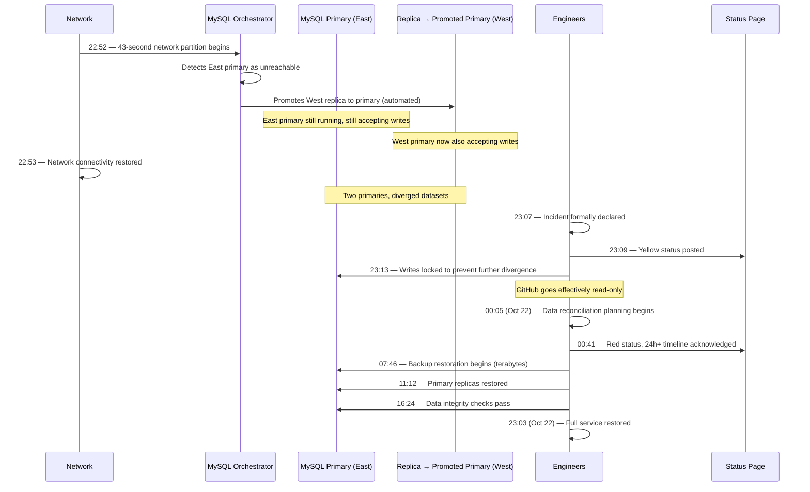
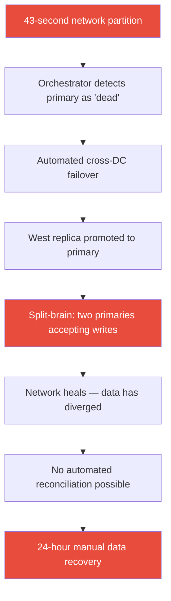

# GitHub's 24-Hour Outage (October 2018)

A 43-second network hiccup between two data centers triggered an automated database failover that split GitHub's MySQL clusters into two divergent primaries, turning what should have been an imperceptible blip into a 24-hour data consistency nightmare that affected over 300 million repositories.

## The Alert

At 22:52 UTC on October 21, 2018, GitHub's internal monitoring detected a burst of database connection errors and elevated API error rates. Within seconds, PagerDuty alerts fired to the on-call engineering team. The initial symptoms were deeply confusing: some data appeared available, other data was missing, and certain records seemed to have reverted to earlier states. Pull requests that had been merged showed as open. Comments posted minutes earlier had vanished. Issue labels changed back to old values.

The first engineer on-call opened the monitoring dashboard and saw a pattern that did not match any familiar failure mode. It was not a clean "service down" event — the application servers were healthy, the load balancers were routing traffic, and most read queries were succeeding. It was something worse — the data itself was inconsistent.

GitHub's API error rate spiked from a baseline of less than 0.01% to over 10% within seconds. But the errors were not uniform. Some users could create issues; others could not. Some pull requests merged correctly; others silently reverted. The inconsistency itself was the signal that something had gone wrong at the data layer, not at the application layer.

For engineers familiar with distributed systems, the symptoms immediately suggested a split-brain scenario — two copies of the database disagreeing about the current state of the world. But confirming this hypothesis and understanding its scope would take another 15 minutes of frantic investigation.

::: danger What Went Wrong First
A routine maintenance event caused a brief loss of connectivity between the network hub and the primary data center hosting GitHub's MySQL cluster primaries. The partition lasted just 43 seconds — but that was enough to trigger MySQL Orchestrator's automated failover, which promoted a replica in a different data center to primary status while the original primary was still running and accepting writes on the other side of the partition.
:::

## Impact

| Metric | Detail |
|---|---|
| **Duration** | 24 hours and 11 minutes of degraded service |
| **Repositories affected** | 300+ million repositories |
| **Services affected** | GitHub.com, GitHub API, GitHub Pages, webhooks, GitHub Actions (beta), GitHub Packages |
| **Data consistency** | Pull requests, comments, issues, and CI statuses created during the incident showed inconsistencies or appeared to revert |
| **Users affected** | Tens of millions of developers worldwide |
| **Revenue impact** | Enterprise customers experienced disruption; SLA credits issued |
| **Downstream impact** | Thousands of companies' CI/CD pipelines stalled; npm/yarn installs from GitHub-hosted repos failed; deployment processes blocked globally |
| **Webhook delays** | Millions of webhook deliveries queued and delayed by hours |

The downstream impact was particularly severe. GitHub is deeply embedded in the software supply chain. When GitHub's webhooks stopped firing, CI/CD systems across the industry — Jenkins, CircleCI, Travis CI, GitHub Actions — all stopped triggering builds. Deployments froze. Teams that relied on GitHub for package hosting could not install dependencies. For 24 hours, a measurable portion of the world's software development slowed or stopped entirely.

::: warning Compounding Effect
Because GitHub serves as the central dependency for so many automated systems, the blast radius extended far beyond users who directly visited github.com. Any automated system that depended on GitHub webhooks, the GitHub API, or GitHub-hosted packages was affected.
:::

## Timeline



### Detailed Chronology

| Time (UTC) | Event |
|---|---|
| **Oct 21, 22:52:00** | Network maintenance triggers 43-second connectivity loss between network hub and primary US East data center |
| **22:52:05** | MySQL Orchestrator detects primary nodes as unreachable, begins failover evaluation |
| **22:52:12** | Orchestrator promotes West Coast replicas to primary status via automated failover |
| **22:52:12–22:53:00** | Split-brain: East primaries accept writes from applications on their side of the partition; West primaries accept writes from applications routed to them |
| **22:53:00** | Network partition heals. Two independent write streams now exist |
| **22:53–23:07** | Monitoring shows elevated error rates. On-call engineers investigate conflicting signals — some queries succeed, some fail, some return stale data |
| **23:07** | Incident commander formally declares the incident after engineers identify the split-brain condition |
| **23:09** | Yellow status posted to GitHub Status page |
| **23:13** | **Critical decision**: Engineers lock writes on all affected MySQL clusters. GitHub becomes effectively read-only for many operations. This prevents further data divergence |
| **23:13–00:05** | Engineers map the scope of divergence. Both data centers have writes the other does not. Simply "failing back" to the East primary would lose the West's writes. Promoting the West permanently would lose the East's writes |
| **00:05 (Oct 22)** | Team determines reconciliation requires restoring from backup and replaying both write-ahead log streams. Estimated timeline: many hours |
| **00:41** | Status page updated to red. Public acknowledgment that resolution will take significantly longer than initially expected |
| **00:41–07:46** | Engineers plan the restoration. They must restore MySQL clusters from the most recent backup, then apply the binlog events from both the East and West write streams, resolving conflicts where both sides modified the same rows |
| **07:46** | Backup restoration begins. This involves restoring terabytes of MySQL data across multiple clusters |
| **11:12** | Primary cluster restoration complete. Engineers begin running data integrity checks |
| **11:12–16:24** | Engineers compare restored data against both East and West write streams. Row-by-row conflict resolution for divergent records. Automated scripts handle the bulk; edge cases require manual review |
| **16:24** | Data integrity checks pass. Engineers confident no data has been permanently lost |
| **16:24–23:03** | Gradual re-enabling of write operations. Webhooks that were queued begin draining. CI/CD integrations resume |
| **23:03 (Oct 22)** | Full service restored — 24 hours and 11 minutes after the initial network partition |

## Root Cause

The root cause was the interaction between three factors that, individually, were reasonable engineering decisions but together created a catastrophic failure mode.



### 1. Automated Failover Without Human Verification for Cross-DC Promotion

GitHub used **Orchestrator**, their open-source MySQL high-availability tool, to manage failover automatically. When the 43-second partition occurred, Orchestrator followed its programming exactly as designed: it detected the primaries as unreachable and promoted replacements.

The problem was that Orchestrator could not distinguish between "the primary is permanently dead" and "there is a brief network blip." For stateless services, automatic failover during a brief partition is harmless — route traffic to another web server, no harm done. For a MySQL primary that accepts writes, automatic cross-datacenter failover creates a split-brain scenario.

```
Before partition:
  All clients → Primary (East) → Replicas (East + West)
  Replication: East Primary ──async──▶ West Replica

During partition (43 seconds):
  Clients on East side → Primary (East)  [still accepting writes]
  Orchestrator (West side) → "Primary unreachable!"
  Orchestrator → Promote West Replica to Primary
  Clients on West side → New Primary (West) [now also accepting writes]

After partition heals (22:53):
  Two primaries exist
  East has writes W1, W2, W3 that West does not have
  West has writes W4, W5, W6 that East does not have
  Some writes may conflict (same row modified differently)
  No clean merge path exists
```

::: tip Why This Matters
The distinction between intra-datacenter and cross-datacenter failover is critical. Within a single data center, network partitions are rare and usually indicate genuine hardware failure. Across data centers, brief connectivity blips are relatively common. Automated failover that is safe within a DC can be dangerous across DCs.
:::

### 2. Asynchronous Cross-Continent Replication Topology

GitHub's MySQL topology spanned multiple data centers across the United States. Replication from East to West was **asynchronous**, meaning the West replica could be seconds or even minutes behind the East primary at any given moment.

When Orchestrator promoted the West replica to primary, that replica was missing the most recent writes from the East. Any writes that had been committed on the East primary but not yet replicated to the West were now "orphaned" — they existed only on the East side.

| Factor | Detail |
|---|---|
| **Replication mode** | Asynchronous (async) |
| **Typical replication lag** | Milliseconds to seconds under normal load |
| **Lag at time of partition** | Unknown, but any lag > 0 means potential data loss |
| **Cross-DC network latency** | ~70ms round-trip (US East to US West) |

Had the replication been **synchronous** (every write confirmed by the replica before the primary acknowledges it), the promoted replica would have had all writes, and the divergence would have been minimal. But synchronous cross-continent replication imposes significant latency penalties — every write would take at least 70ms longer — which is unacceptable for a service with GitHub's write volume.

::: warning The Replication Dilemma
Asynchronous replication is fast but risks data divergence during failover. Synchronous replication is safe but slow. Semi-synchronous replication is a compromise — the primary waits for at least one replica to acknowledge, but does not require all replicas. GitHub later moved toward tighter replication monitoring to understand their actual lag exposure.
:::

### 3. No Automated Reconciliation for Diverged MySQL Data

MySQL does not have built-in tooling to automatically merge diverged write streams. Unlike [CRDTs](/system-design/distributed-systems/crdt-fundamentals), which are designed for concurrent writes and can resolve conflicts automatically, traditional relational databases assume a single writer at all times. When two primaries diverge, the options are limited and painful:

| Recovery Strategy | Tradeoff |
|---|---|
| **Pick one primary, discard the other's writes** | Unacceptable — users lose data |
| **Restore from backup, replay both binlog streams** | Safe but takes hours to days at scale (what GitHub chose) |
| **Manual row-by-row conflict resolution** | Impractical at GitHub's data volume |
| **Last-write-wins merge** | Risks silent data corruption where conflicting writes overwrite each other |

GitHub chose the only option that guaranteed no data loss: restore from the most recent backup, then carefully replay the binary log (binlog) events from both the East and West write streams, resolving conflicts where the same rows were modified by both sides.

The process involved:
1. Identifying the most recent clean backup prior to the partition
2. Restoring terabytes of MySQL data from that backup
3. Extracting binlog events from the East primary covering the partition window
4. Extracting binlog events from the West primary covering the same window
5. Applying both event streams to the restored data, detecting conflicts
6. Resolving conflicting row modifications (automated where possible, manual for edge cases)
7. Validating data integrity across all tables

This process took approximately 18 hours of active work.


### The Decision That Defined the Response: Consistency Over Availability

At 23:13 UTC, GitHub engineers made the most consequential decision of the incident: **they chose data consistency over availability**. They locked writes across affected clusters, making GitHub effectively read-only for many operations.

This was a deliberate application of the [CAP theorem](/system-design/distributed-systems/consistency-models). Rather than serving potentially stale or inconsistent data, they accepted degraded availability to protect data integrity.

::: tip What Saved Them
GitHub's backup infrastructure worked correctly. They had recent backups and the binlog streams from both sides were intact. The 24-hour timeline was long, but they ultimately recovered without permanent data loss. Their decision to prioritize consistency — keeping the site degraded rather than serving stale or conflicting data — was the right call for a platform where data correctness (code, pull requests, issues) is paramount.
:::

## The Fix

### Immediate Response

1. **Stopped writes** (23:13 UTC) — Locked all affected MySQL clusters to prevent further data divergence
2. **Assessed divergence scope** (23:13–00:05 UTC) — Mapped which clusters had diverged and the volume of conflicting writes
3. **Restored from backup** (07:46–11:12 UTC) — Restored MySQL clusters from the most recent pre-partition backup
4. **Replayed binlog streams** (11:12–16:24 UTC) — Applied write-ahead logs from both East and West, resolving conflicts
5. **Validated data integrity** (16:24 UTC) — Ran comprehensive integrity checks comparing restored data against both write streams
6. **Drained webhook queues** (16:24–23:03 UTC) — Millions of queued webhooks were delivered to downstream systems

### Long-Term Changes

**1. Human-in-the-loop for cross-datacenter failover**

The most significant change: automated failover within a single data center remained enabled, but failover across data centers now requires explicit human approval. The reasoning was straightforward — cross-datacenter failover for a stateful system is a high-stakes, potentially irreversible decision that should not be made by software alone in response to a brief anomaly.

```
BEFORE (October 2018):
  Orchestrator detects primary unreachable (any DC)
    → Automatic promotion of best replica (any DC)
    → No human verification required

AFTER:
  Orchestrator detects primary unreachable
    If same DC replica available:
      → Automatic promotion (low risk)
    If only cross-DC replica available:
      → Alert on-call engineer
      → Require human approval before promotion
      → Present replication lag data to the human
      → Log the decision for post-incident review
```

**2. Enhanced partition detection in Orchestrator**

Orchestrator was enhanced with multiple improvements:
- **Longer detection windows**: The timeout before triggering failover was increased to reduce false positives from brief network blips
- **Multi-vantage-point confirmation**: Failover requires confirmation from multiple independent monitoring points that the primary is truly unreachable, not just unreachable from one location
- **Replication lag awareness**: Orchestrator now factors replication lag into failover decisions — if the best available replica is significantly behind, the system alerts rather than auto-promotes

**3. Tighter replication lag monitoring and alerting**

GitHub invested in real-time replication lag monitoring with alerts at multiple thresholds:

| Threshold | Action |
|---|---|
| **> 1 second lag** | Warning alert to database team |
| **> 5 seconds lag** | Page on-call engineer |
| **> 30 seconds lag** | Automatic traffic rerouting to reduce write pressure |
| **> 60 seconds lag** | Incident declared, write throttling enabled |

**4. Improved MySQL cluster topologies**

GitHub adjusted their replication topology to minimize the window where divergence could occur, including moving toward topologies where cross-DC replicas are closer to real-time and split-brain is structurally harder to create.

**5. Improved incident communication processes**

GitHub improved their incident communication cadence with structured templates and committed to regular status updates during extended outages. Their detailed [public postmortem](https://github.blog/2018-10-30-oct21-post-incident-analysis/) became an industry reference for incident transparency.

**6. Runbook for split-brain recovery**

GitHub created a detailed, tested runbook for the specific scenario of split-brain MySQL recovery. The runbook includes:
- Decision tree for when to lock writes vs. attempt automatic reconciliation
- Scripts for extracting and comparing binlog events from diverged primaries
- Automated conflict detection tooling that categorizes conflicts by severity
- Escalation procedures for conflicts that require human judgment
- Estimated time-to-resolution calculations based on data volume

::: tip Operational Readiness
The existence of a tested runbook would not have prevented the October 2018 incident, but it would have significantly reduced the recovery time. Instead of spending hours determining the recovery approach during the crisis, engineers would have followed a pre-validated procedure. The best time to design your disaster recovery process is before the disaster.
:::

**7. Webhook queue resilience**

The incident revealed that GitHub's webhook delivery system did not gracefully handle extended periods of queuing. Millions of webhook events accumulated during the 24-hour incident, and draining that queue after recovery caused secondary load spikes. GitHub invested in a more resilient webhook queue with backpressure controls, dead-letter queues for failed deliveries, and better retry logic with exponential backoff.

**8. Chaos engineering program for database failover**

GitHub established a regular chaos engineering program specifically targeting database failover scenarios:
- Monthly simulated network partitions within a single data center (low risk, tests intra-DC failover)
- Quarterly simulated cross-DC partition events in a staging environment (medium risk, tests the exact scenario that caused this incident)
- Annual full-scale failover drills with the on-call team responding as they would in a real incident

These drills ensure that the long-term changes actually work as intended and that on-call engineers have practiced the recovery procedures before they need them in a crisis.

## Lessons Learned

### 1. Automated failover is dangerous for stateful systems crossing trust boundaries

::: warning Core Lesson
Automated failover works well for stateless services — if a web server goes down, route traffic to another one. But for databases holding mutable state, automated failover across network boundaries (data centers, availability zones, regions) can create split-brain scenarios that are harder to fix than the original problem. A 43-second outage became a 24-hour incident because the automated "fix" made things dramatically worse.
:::

The key distinction is the **trust boundary**. Within a single data center or availability zone, a network partition usually means the primary is genuinely dead. Across data centers, it might just mean a flaky link. Automated failover should respect this boundary.

### 2. Network partitions are not hypothetical

The [CAP theorem](/system-design/distributed-systems/consistency-models) tells us that network partitions will happen and we must choose between consistency and availability. GitHub's system effectively chose availability during the partition (both sides kept accepting writes) and paid the consistency price afterward. In retrospect, a 43-second read-only period would have been vastly preferable to 24 hours of degraded service.

### 3. Test your failover, not just your backups

Many teams test backups regularly ("can we restore from this backup?") but never test the messy scenarios around failover:
- What happens if failover triggers during a brief partition and the partition heals?
- What happens if the promoted replica is 30 seconds behind?
- What happens if two primaries accept writes simultaneously for N seconds?

This is precisely the kind of scenario that [chaos engineering](/devops/incident-response/chaos-engineering) is designed to explore. GitHub now runs regular failover drills that simulate partition scenarios.

### 4. Replication lag is a ticking time bomb

The divergence between East and West data centers was possible because replication was asynchronous with meaningful lag. If the West replica had been perfectly in sync when promoted, the divergence window would have been measured in milliseconds rather than seconds. Understanding and continuously monitoring [replication lag](/system-design/databases/replication) is critical for any system that may need to fail over.

### 5. Transparent communication builds trust even during failures

GitHub's public postmortem, published nine days after the incident, was remarkably detailed and honest. It described what went wrong, why their systems behaved the way they did, and what they were changing. This transparency set an industry standard and actually strengthened user trust in GitHub's engineering culture.

### 6. The blast radius of a platform outage scales with its centrality

GitHub's position as the hub of the software supply chain meant the outage's blast radius was not just "GitHub users" — it was "every system that depends on GitHub." This included CI/CD pipelines, package managers, deployment automation, and dependency resolution across thousands of companies. The more central a platform is to an ecosystem, the more investment it requires in resilience. GitHub's 2018 incident was a wake-up call about the fragility of centralized infrastructure dependencies.

### 7. Write-locking is a valid emergency strategy for data-critical systems

The decision to lock writes at 23:13 UTC was uncomfortable — it meant degrading GitHub for all users. But it was the correct decision because it stopped the divergence from growing. Every minute of continued split-brain writes made the reconciliation harder and longer. The lesson is that for systems where data integrity is paramount, accepting temporary unavailability to prevent data corruption is not just acceptable — it is the only responsible choice.

## What You Can Learn

1. **Audit your automated failover.** If you use automated database failover, ask: "What happens if a brief network partition triggers failover, and then the network heals 30 seconds later?" If the answer involves data divergence or split-brain, add human-in-the-loop verification for cross-datacenter failover.

2. **Define your split-brain strategy before you need it.** Decide now — before an incident — how your system will handle two primaries with diverged data. Document the runbook. Practice the reconciliation procedure. Do not design the process during the crisis.

3. **Measure replication lag continuously.** Set alerts for replication lag thresholds. If lag exceeds your RPO (Recovery Point Objective), you need to know immediately. Track lag as a first-class SLI (Service Level Indicator).

4. **Prefer brief unavailability over data inconsistency** for systems where data correctness matters. A 43-second error page is a non-event. A 24-hour data inconsistency incident is a crisis. For platforms like GitHub where the data IS the product (code, PRs, issues), consistency must win.

5. **Communicate transparently during incidents.** GitHub's public postmortem became a reference document for the entire industry. Honest, detailed communication builds trust even during failures. Users forgive downtime far more readily when they understand what happened and what is being done to prevent recurrence.

6. **Separate failover policies by blast radius.** Intra-DC failover can be fast and automated. Cross-DC failover should be slower and require human judgment. Cross-region failover should require explicit approval from a senior engineer. The higher the blast radius, the more human oversight is warranted.

7. **Build split-brain detection into your monitoring.** Your monitoring should be able to detect the split-brain condition itself — not just the symptoms. If your database has two nodes both claiming to be primary, that should be an immediate, high-severity alert. Do not rely on symptom-based detection (elevated error rates, stale data) to infer a split-brain — detect the condition directly.

8. **Invest in your backup restore speed, not just backup frequency.** GitHub had good backups. But restoring terabytes of MySQL data took hours. If restoration had taken 30 minutes instead of several hours, the total incident duration would have been dramatically shorter. Backup restore time is part of your RTO (Recovery Time Objective) and deserves investment and regular benchmarking.

9. **Understand your supply chain position.** If your service is a dependency for other critical systems (CI/CD, package management, deployment), your reliability requirements are higher than if you were a standalone application. Map your downstream dependencies and factor them into your availability targets and incident response priorities.

## Comparing GitHub's Response to Industry Peers

GitHub's handling of this incident — particularly the decision to prioritize consistency and the transparent postmortem — is worth comparing to how other companies have handled similar situations:

| Company | Incident | Duration | Approach | Data Loss |
|---|---|---|---|---|
| **GitHub (2018)** | Split-brain MySQL | 24 hours | Consistency over availability, full reconciliation | Zero permanent data loss |
| **GitLab (2017)** | Database deletion | 18 hours | Restored from backup, 6 hours of data lost | ~6 hours of production data |
| **Amazon DynamoDB (2015)** | Metadata partition | 5 hours | Availability over consistency, eventual reconciliation | Brief inconsistencies |
| **Google (2019)** | Cloud Storage metadata corruption | 4.5 hours | Read-only mode while reconciling | Minimal |

GitHub's 24-hour timeline was the longest, but they achieved zero permanent data loss — the best outcome in terms of data integrity. The tradeoff between speed of recovery and completeness of recovery is a fundamental tension in incident response.

::: tip Consistency vs. Speed
GitHub could have restored service faster by accepting some data loss (discarding the smaller write stream). They chose the slower path because they valued every user's data equally. This was the right call for a platform where a single lost commit or pull request could represent days of a developer's work. The lesson for your own systems: decide BEFORE an incident whether you will prioritize speed of recovery or completeness of recovery, and document that decision so the on-call team does not have to make it under stress.
:::

### Key Takeaway from This Incident

The October 2018 GitHub outage remains one of the most studied incidents in modern infrastructure engineering. It demonstrated that automated systems designed to improve reliability can, under specific conditions, make things dramatically worse. The 43-second network partition was a non-event. The automated failover response turned it into a 24-hour crisis. The most important engineering decision in the aftermath was not a technical change — it was the organizational decision to require human judgment for high-stakes automated actions. Technology should assist human decision-making, not replace it for irreversible, high-consequence choices.

## Further Reading

- [GitHub's October 21 Post-Incident Analysis](https://github.blog/2018-10-30-oct21-post-incident-analysis/) — The original public postmortem (October 30, 2018)
- [GitHub Status page updates](https://www.githubstatus.com/) — Live status during the incident
- [MySQL Orchestrator](https://github.com/openark/orchestrator) — The HA tool that triggered the failover
- [Consistency Models](/system-design/distributed-systems/consistency-models) — CAP theorem and the tradeoff GitHub faced
- [CRDT Fundamentals](/system-design/distributed-systems/crdt-fundamentals) — An alternative data model that handles concurrent writes
- [Chaos Engineering](/devops/incident-response/chaos-engineering) — Testing failure scenarios before they happen in production
- [Database Replication](/system-design/databases/replication) — Async vs. sync replication tradeoffs
- [Circuit Breaker Pattern](/system-design/distributed-systems/circuit-breaker) — Automated failure detection and response
- [Cloudflare's Regex Outage](/war-room/cloudflare-regex-2019) — Global deployment without staged rollout
- [Knight Capital's $440M Bug](/war-room/knight-capital-2012) — Another case where automated systems caused more damage than the original failure
- [Facebook's October 2021 Outage](/war-room/facebook-october-2021) — Infrastructure dependencies that prevented recovery

## What Would You Do?

Test your incident response instincts against the decisions GitHub's engineers actually faced.

::: details Scenario 1: The 43-second partition has just healed. You see two MySQL primaries with diverged data. Do you (A) immediately fail back to the original East primary, (B) pick the West primary since it was more recently promoted, or (C) lock writes on both and go read-only?
**What GitHub did:** They chose **(C) — lock writes on both and go read-only.** At 23:13 UTC, they made GitHub effectively read-only. Failing back to either primary would have discarded the other side's writes, causing permanent data loss. By locking writes, they stopped the divergence from growing and bought time to plan a proper reconciliation. Every minute of continued split-brain writes would have made recovery harder.
:::

::: details Scenario 2: You have confirmed split-brain. You can restore service faster by discarding the smaller write stream (a few minutes of data), or you can spend 18+ hours reconciling both streams to lose zero data. Your status page is red. Millions of developers are blocked. Which do you choose?
**What GitHub did:** They chose **zero data loss**, accepting the 24-hour timeline. Their reasoning: GitHub is a platform where the data IS the product. A single lost commit or pull request could represent days of a developer's work. The slower path guaranteed no data was permanently lost. They decided that data integrity trumps speed of recovery for their platform.
:::

::: details Scenario 3: It is now 6 months after the incident. You are redesigning Orchestrator's failover policy. Do you (A) disable automated failover entirely, (B) keep automated failover but add a longer detection window, or (C) keep automated failover within a data center but require human approval for cross-DC failover?
**What GitHub did:** They chose **(C) — human-in-the-loop for cross-DC failover only.** Intra-DC failover remained automated because within a single data center, a network partition usually means genuine hardware failure. Cross-DC failover now requires explicit human approval with replication lag data presented to the decision-maker. This balanced speed (fast intra-DC recovery) with safety (no automated cross-DC split-brain).
:::

## Prevention Checklist

- [ ] Automated database failover distinguishes between intra-DC and cross-DC scenarios
- [ ] Cross-datacenter failover requires human approval before promotion
- [ ] Replication lag is continuously monitored with alerts at multiple thresholds (1s, 5s, 30s, 60s)
- [ ] A tested runbook exists for split-brain MySQL/PostgreSQL recovery
- [ ] Failover drills are conducted at least quarterly in a staging environment
- [ ] Backup restore speed is benchmarked regularly at current data volume
- [ ] Monitoring can directly detect split-brain conditions (two nodes claiming primary), not just symptoms

## Quick Quiz

::: details Question 1: Why was the 43-second network partition enough to cause a 24-hour outage?
Because MySQL Orchestrator automatically promoted a West Coast replica to primary during the partition, creating two primaries accepting writes simultaneously. When the network healed 43 seconds later, both sides had writes the other did not have, and MySQL has no built-in way to merge diverged write streams. The automated "fix" (failover) was worse than the original problem.
:::

::: details Question 2: Why didn't GitHub just "fail back" to the original East primary once the network healed?
Failing back to the East primary would have discarded all writes that happened on the West primary during and after the partition. Similarly, keeping the West primary would have discarded East writes. Neither side had a complete picture. The only option that preserved all data was restoring from backup and replaying both binlog streams.
:::

::: details Question 3: What is the key difference between intra-DC and cross-DC automated failover that GitHub's fix addressed?
Within a single data center, network partitions are rare and usually indicate genuine hardware failure, making automated failover safe. Across data centers, brief connectivity blips are relatively common and do not mean the primary is dead. Automated cross-DC failover can mistake a transient blip for a permanent failure, creating split-brain. GitHub's fix kept intra-DC failover automated but required human approval for cross-DC failover.
:::

## One-Liner Lesson

Automated failover for stateful systems across data centers turns 43-second blips into 24-hour crises — always require human judgment for irreversible, high-stakes decisions.
