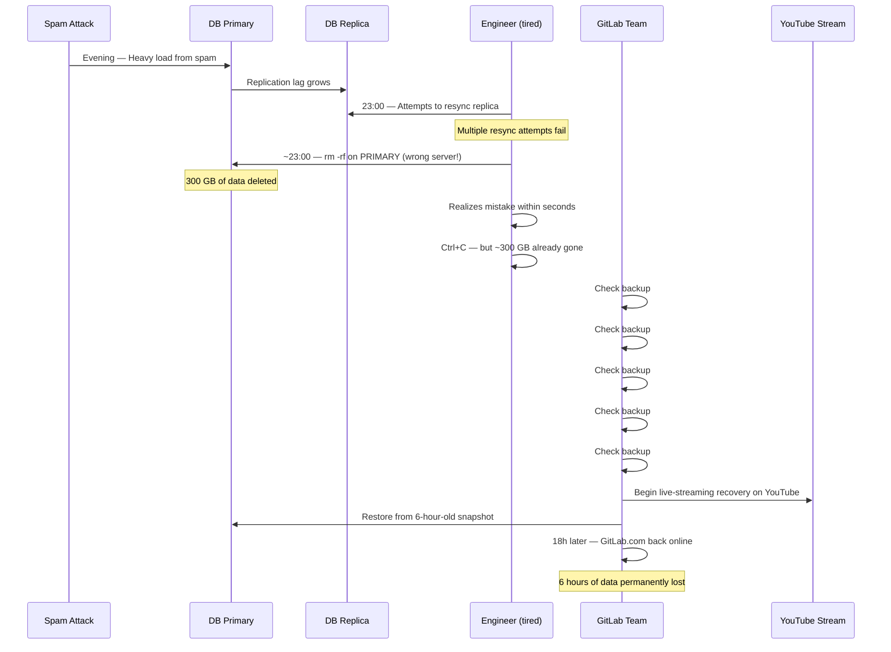

# GitLab's Database Deletion (January 2017)

On January 31, 2017, at approximately 23:00 UTC, a GitLab engineer working late to resolve a database replication issue accidentally ran `rm -rf` on the production database directory — on the wrong server. The command deleted approximately 300 GB of live production data from GitLab.com's primary PostgreSQL database.

What followed was a harrowing 18-hour recovery effort during which GitLab discovered that their five independent backup and replication strategies had all failed or were non-functional. They ultimately recovered using a database snapshot that had been taken 6 hours before the deletion — meaning 6 hours of user data (issues, merge requests, comments, CI pipelines) were permanently lost.

In a move that was unprecedented at the time, GitLab live-streamed the entire recovery process on YouTube, tweeting updates in real time. The radical transparency earned them significant respect in the engineering community, even as it laid bare the failures that had led to the crisis.

## The Alert

The incident began not with the accidental deletion, but hours earlier with a separate problem: a spam attack causing heavy load on the database, which triggered replication lag between the primary and secondary PostgreSQL instances.

An engineer was working late (after 23:00 UTC) to resolve the replication lag. After multiple failed attempts to resync the replica, the engineer decided to delete the PostgreSQL data directory on the replica and let it resync from scratch. In a moment of fatigue and confusion about which terminal was connected to which server, the engineer ran `rm -rf /var/opt/gitlab/postgresql/data` — on the production primary instead of the replica.

::: danger What Went Wrong First
A tired engineer, working late to fix a database replication issue, ran a destructive command on the wrong server. The command `rm -rf` on the PostgreSQL data directory deleted approximately 300 GB of live production data from the primary database.
:::

## Impact

- **Duration**: 18 hours of recovery work; GitLab.com was unavailable for approximately 18 hours
- **Data lost permanently**: Approximately 6 hours of production data (roughly 5,000 projects, 5,000 comments, and 700 merge requests created during that window)
- **Users affected**: All GitLab.com users — approximately 1 million at the time
- **CI/CD impact**: All CI/CD pipelines, automated deployments, and webhook integrations were halted
- **Trust impact**: Significant concern among users about data safety, especially for paying customers

## Timeline



### Detailed Chronology

**January 31, ~21:00 UTC** — GitLab.com experiences a spam attack. The volume of spam-related database operations causes replication lag between the primary PostgreSQL database and its replica.

**~22:00 UTC** — An engineer begins working to resolve the replication lag. Attempts to get the replica to catch up fail due to the ongoing load and accumulated lag.

**~23:00 UTC** — The engineer decides to wipe the replica's data directory and let it resync completely from the primary. The engineer has multiple terminal windows open — one connected to the primary database server, one connected to the replica.

**~23:00 UTC** — The engineer runs `rm -rf /var/opt/gitlab/postgresql/data` in what they believe is the replica terminal. It is actually connected to the primary. The engineer realizes the mistake within seconds and hits Ctrl+C, but `rm -rf` works fast — approximately 300 GB of data is already gone.

**~23:00–23:15 UTC** — The engineer alerts the team. An emergency assessment begins.

**23:15 UTC – February 1, ~01:00 UTC** — The team systematically checks each of their backup strategies:

1. **LVM snapshots**: Configured but turned out to be not working — LVM snapshots were never properly set up for the database volume
2. **Regular pg_dump backups**: The pg_dump cron job had been failing silently for some time — no recent successful backup existed
3. **Azure disk snapshots**: The feature was enabled but had not been verified; snapshots existed but their reliability was uncertain
4. **S3 backups**: Partial backups existed but were not complete enough for a full restore
5. **pg_basebackup**: A staging environment had been synced from production approximately 6 hours earlier — this was the most recent usable snapshot

**February 1, ~01:00 UTC** — The team makes the decision to restore from the pg_basebackup snapshot, accepting the loss of 6 hours of data. They begin the live stream on YouTube.

**February 1, ~01:00–17:00 UTC** — The team works through the restoration, dealing with various complications. The live stream attracts thousands of viewers. GitLab tweets status updates regularly.

**February 1, ~17:00 UTC** — GitLab.com comes back online with data restored to 6 hours before the incident. Approximately 6 hours of production data are permanently lost.

## Root Cause

The root cause was a chain of failures, not a single event:

### 1. Fatigue and Terminal Confusion

An engineer working late at night, under pressure to resolve an ongoing production issue, confused which terminal session was connected to which server. This is a textbook human factors failure — fatigue reduces attention, and similar-looking terminal windows connected to different servers are an accident waiting to happen.

::: warning Watch Out for This
The number one rule for production database operations: **know which server you are on**. Use distinct terminal prompts, color-coded shells, or environment banners. Some teams use red prompts for production and green for staging. Others require all destructive commands to go through a bastion host that logs and confirms every operation.

```bash
# Production prompt (RED — unmistakable)
export PS1='\[\e[1;31m\][PRODUCTION db-primary] \u@\h:\w\$\[\e[0m\] '

# Staging prompt (GREEN — safe)
export PS1='\[\e[1;32m\][STAGING db-replica] \u@\h:\w\$\[\e[0m\] '
```
:::

### 2. Five Backup Strategies, Zero Working Backups

The most shocking aspect of this incident was not the accidental deletion — it was the systematic failure of every backup strategy:

| Backup Strategy | Status | Why It Failed |
|----------------|--------|---------------|
| LVM Snapshots | Not configured | Never properly set up for the database volume |
| pg_dump | Failing silently | Cron job had been failing; no monitoring on backup success |
| Azure Disk Snapshots | Uncertain | Enabled but never verified with a test restore |
| S3 Backups | Incomplete | Partial backups, not sufficient for full recovery |
| pg_basebackup | 6 hours old | Working, but only because of staging sync schedule |

::: danger Critical Insight
Having a backup strategy is meaningless if you do not verify it works. Having five backup strategies that all fail is worse than having one that you test regularly. **The only backup that counts is the one you have successfully restored from.**
:::

### 3. No Monitoring on Backup Health

The pg_dump cron job had been failing silently for an extended period. There was no monitoring, alerting, or dashboard that showed "last successful backup: X hours ago." When you need a backup, it is the worst possible time to discover it does not exist.

### 4. No Safeguards Against Destructive Commands

There was no tooling to prevent an `rm -rf` on the production database directory. No confirmation prompt, no per-production-server lockdown, no restricted shell that limits destructive commands.

## The Fix

### Immediate Response
1. Restored from the 6-hour-old pg_basebackup snapshot
2. Live-streamed the entire recovery process
3. Communicated transparently about data loss through blog, Twitter, and status page

### Long-Term Changes

**1. Comprehensive backup verification**

GitLab implemented automated, regular backup testing. A backup is not considered valid until it has been successfully restored and verified. This runs on a schedule, and failures generate immediate alerts.

**2. Backup monitoring and alerting**

Every backup job now has monitoring that alerts if:
- A backup fails to run
- A backup fails to complete
- The most recent successful backup is older than the defined threshold
- Backup size deviates significantly from expected

**3. Production environment safeguards**

Production database servers received additional protections:
- Color-coded terminal prompts
- Confirmation requirements for destructive commands
- Restricted shell access with audit logging
- Separation of duties — the person diagnosing a problem should not be the same person running destructive commands at 11 PM

**4. Documented runbooks for common recovery scenarios**

GitLab created detailed runbooks for database replication issues, specifically to prevent ad-hoc, fatigued decision-making during nighttime incidents. The runbooks include explicit warnings about verifying which server a command targets.

**5. Open-sourced their incident learnings**

True to form, GitLab published an extremely detailed [public postmortem](https://about.gitlab.com/blog/2017/02/10/postmortem-of-database-outage-of-january-31/) and updated their handbook with the lessons learned.

## Lessons Learned

### 1. Test your backups by restoring from them

::: tip What Saves You
A backup you have never restored from is a hope, not a backup. Schedule regular restore tests. Automate them. Alert on failures. Your DR (Disaster Recovery) drill should include timing the full restore process and verifying data integrity afterward.

A simple backup verification pipeline:
1. Take backup (automated, scheduled)
2. Restore backup to isolated environment (automated)
3. Run integrity checks (row counts, checksums)
4. Compare against production (sample verification)
5. Alert if any step fails
:::

### 2. Monitor backup health, not just backup execution

It is not enough to schedule a backup cron job. You must monitor that the job succeeds, that the output is valid, that the backup is stored durably, and that the backup is restorable. Silent failures in backup jobs are one of the most common and most dangerous failure modes.

### 3. Fatigue is a root cause

This incident happened late at night, with a tired engineer under pressure. [On-call practices](/devops/alerting/on-call-best-practices) should account for human factors: limit shift lengths, avoid complex manual operations during fatigue, require peer review for destructive commands on production systems.

### 4. Radical transparency builds trust

GitLab's decision to live-stream the recovery and publish a brutally honest postmortem actually increased trust in the company. Users knew exactly what happened, what was lost, and what GitLab was doing to prevent it from happening again. The lesson for any company: transparency during failure builds more trust than silence.

### 5. Defense in depth means independent layers

GitLab had five backup strategies, but they were not truly independent. Some depended on the same infrastructure, some had the same configuration gaps, and none were monitored. [Defense in depth](/security/) means each layer must be independently verified and independently monitored.

## What You Can Learn

1. **Schedule automated restore tests.** Set up a weekly or daily automated process that restores your latest backup to an isolated environment and runs validation queries. Alert if it fails.

2. **Monitor your backup pipeline.** Create a dashboard showing: last successful backup time, backup size trend, restore test results. Alert if the last successful backup is older than your RPO.

3. **Color-code your terminals.** It costs nothing and could save your database. Production environments should have visually distinct prompts that make it impossible to confuse them with staging or replicas.

4. **Require peer review for destructive operations.** No one should run `rm -rf`, `DROP DATABASE`, or equivalent commands on production alone. Implement a two-person rule for destructive operations, especially outside business hours.

5. **Write a postmortem and share it.** When something goes wrong, write down exactly what happened, without blame. Share it with your team. Consider sharing it publicly. The engineering community learns more from honest failure stories than from success stories.

## What Would You Do?

Test your incident response instincts against the decisions GitLab's engineers actually faced.

::: details Scenario 1: It is 23:00 UTC on January 31. You are a tired engineer trying to fix a database replication issue. After multiple failed attempts to resync the replica, you decide to wipe the replica's data directory and resync from scratch. You have two terminal windows open — one connected to the primary, one to the replica. You run the rm -rf command. Seconds later, you realize you ran it on the primary. What do you do in the next 60 seconds?
**What the GitLab engineer did:** They hit Ctrl+C immediately, but rm -rf works fast — approximately 300 GB of data was already gone. They then alerted the team immediately. The lesson is not about those 60 seconds — it is about the 60 seconds before the command. Color-coded terminal prompts (red for production, green for staging), confirmation requirements for destructive commands, and a two-person rule for operations on production databases would have prevented the mistake entirely.
:::

::: details Scenario 2: The production database is deleted. Your team checks all five backup strategies and discovers: LVM snapshots were never configured, pg_dump has been failing silently, Azure disk snapshots exist but are unverified, S3 backups are incomplete, and pg_basebackup has a 6-hour-old snapshot from a staging sync. Do you (A) attempt to recover from the unverified Azure snapshots, (B) use the 6-hour-old pg_basebackup snapshot and accept the data loss, or (C) spend more time trying to recover more recent data from the partial S3 backups?
**What GitLab did:** They chose **(B) — restore from the 6-hour-old pg_basebackup snapshot**, accepting the permanent loss of 6 hours of production data (approximately 5,000 projects, 5,000 comments, and 700 merge requests). The pg_basebackup was the most recent known-good snapshot. Attempting to use unverified Azure snapshots or incomplete S3 backups would have added uncertainty and time. The lesson: when you are in crisis, go with the option you have the most confidence in, even if it is not ideal. A verified backup from 6 hours ago is better than an unverified backup from 1 hour ago.
:::

::: details Scenario 3: You are recovering from a catastrophic database deletion. The recovery will take 18 hours. Do you (A) work silently, communicate only when recovery is complete, (B) post periodic updates on your status page and blog, or (C) live-stream the entire recovery process on YouTube?
**What GitLab did:** They chose **(C) — they live-streamed the entire recovery process on YouTube** and tweeted status updates in real time. This was unprecedented at the time and was considered risky. But the radical transparency actually increased trust in GitLab. Users could see exactly what happened, what data was lost, and what GitLab was doing to prevent recurrence. The lesson: transparency during failure builds more trust than silence. The engineering community learns more from honest failure stories than from success stories.
:::

::: tip Key Lessons
- **The only backup that counts is the one you have successfully restored from.** GitLab had five backup strategies. All five had failed or were non-functional. A backup you have never restored from is a hope, not a backup.
- **Monitor backup health, not just backup execution.** The pg_dump cron job had been failing silently. There was no monitoring that showed "last successful backup: X hours ago."
- **Fatigue is a root cause.** The incident happened late at night with a tired engineer under pressure. Limit shift lengths, avoid complex manual operations during fatigue, require peer review for destructive commands.
- **Color-code your terminals.** It costs nothing and could save your database. Production environments should have visually distinct prompts that make it impossible to confuse them with staging.
- **Radical transparency builds trust.** Live-streaming the recovery and publishing a brutally honest postmortem earned GitLab respect in the engineering community.
:::

::: details Quiz

**Q1: What was the immediate cause of the GitLab database deletion?**
A tired engineer working late to fix a database replication issue ran `rm -rf /var/opt/gitlab/postgresql/data` on the production primary server instead of the replica. The engineer had multiple terminal windows open and confused which one was connected to which server.

**Q2: How many backup strategies did GitLab have, and how many were functional when they were needed?**
GitLab had five backup strategies: LVM snapshots, pg_dump, Azure disk snapshots, S3 backups, and pg_basebackup. Only one was partially functional — pg_basebackup had a 6-hour-old snapshot from a staging sync. The other four had all failed or were non-functional.

**Q3: How much data was permanently lost in the GitLab incident?**
Approximately 6 hours of production data was permanently lost, including roughly 5,000 projects, 5,000 comments, and 700 merge requests created during that 6-hour window.

**Q4: Why had the pg_dump backup cron job failed without anyone noticing?**
The pg_dump cron job had been failing silently for an extended period. There was no monitoring, alerting, or dashboard that showed the last successful backup time. When you need a backup is the worst possible time to discover it does not exist.

**Q5: What unprecedented action did GitLab take during the recovery that earned them respect in the engineering community?**
GitLab live-streamed the entire 18-hour recovery process on YouTube, tweeting updates in real time. They later published an extremely detailed public postmortem. The radical transparency — showing both the human error and the systemic failures — built trust rather than eroding it.
:::

## One-Liner Summary

A tired engineer ran rm -rf on the wrong server, deleted the production database, then discovered that all five backup strategies had silently failed — leaving only a 6-hour-old snapshot to restore from.

---

*Sources: [GitLab — Postmortem of database outage of January 31](https://about.gitlab.com/blog/2017/02/10/postmortem-of-database-outage-of-january-31/) (February 10, 2017); [GitLab — GitLab.com database incident](https://about.gitlab.com/blog/2017/02/01/gitlab-dot-com-database-incident/) (February 1, 2017); live-streamed recovery on YouTube (January 31 – February 1, 2017).*
