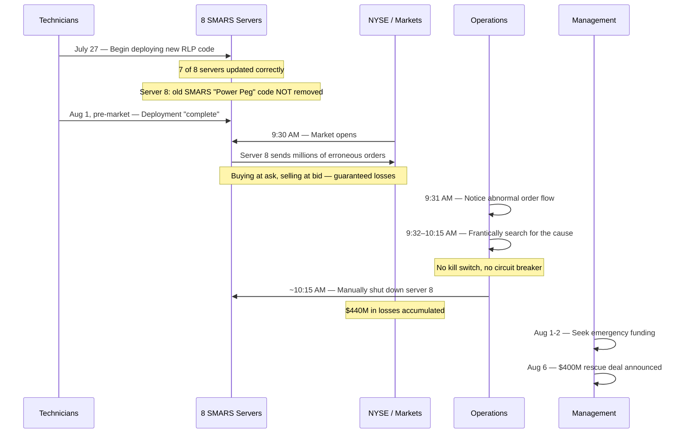

# Knight Capital's $440 Million Bug (August 2012)

On August 1, 2012, Knight Capital Group — one of the largest market makers in the US equity market, handling roughly 11% of all US equity trading volume — deployed new software to its production trading servers. Within 45 minutes of the market opening, the firm had accumulated a $440 million loss. By the end of the week, Knight Capital had to be rescued in an emergency $400 million cash infusion that diluted existing shareholders by over 70%. The company never recovered as an independent entity and was acquired by Getco LLC in December 2012.

This incident is the canonical example of how software deployment failures, feature flag mismanagement, and missing [circuit breakers](/system-design/distributed-systems/circuit-breaker) can destroy a company in less than an hour.

## The Alert

At 9:30 AM ET on August 1, 2012, the New York Stock Exchange opened for trading. Knight Capital's SMARS (Smart Market Access Routing System) began generating orders immediately. Within seconds, the system was sending massive, erroneous orders to the market — buying high and selling low across 154 stocks at enormous volume.

Knight Capital's operations staff noticed abnormal order flow almost immediately, but the system had no automated kill switch. It took 45 minutes to manually identify which servers were generating the bad orders and shut them down.

::: danger What Went Wrong First
During a software deployment the previous day and morning, technicians manually deployed new SMARS code to eight production servers. They deployed to seven of eight servers correctly. On the eighth server, old code that had been dormant for years was inadvertently reactivated by the deployment because a feature flag was repurposed.
:::

## Impact

- **Duration**: 45 minutes (9:30 AM to ~10:15 AM ET)
- **Financial loss**: $440 million in realized trading losses
- **Share price**: Knight Capital's stock dropped 75% over two days
- **Company impact**: Required $400 million emergency cash infusion; acquired by Getco LLC five months later
- **Market impact**: Erroneous trades in 154 NYSE-listed stocks; some stocks moved 10%+ on Knight's erroneous orders
- **Regulatory impact**: SEC fined Knight Capital $12 million in October 2013 for violations of the Market Access Rule

## Timeline



### Detailed Chronology

**July 27, 2012** — Knight Capital begins deploying code for a new feature called RLP (Retail Liquidity Provider), which will go live on August 1 when the NYSE launches its new Retail Liquidity Program. The deployment involves updating the SMARS routing system on eight production servers.

**July 27 – August 1** — Technicians manually copy the new code to the eight servers. There is no automated deployment system. There is no verification step to confirm all servers are running identical code. Seven servers are updated correctly. The eighth server is not — it retains an old module that reuses a feature flag that the new RLP code also uses.

**The critical detail**: Years earlier, Knight Capital had a feature called "Power Peg" in SMARS. Power Peg was old dead code that had been deactivated by a feature flag. When the RLP code was designed, developers repurposed that same feature flag for the new functionality. On the seven correctly updated servers, the flag activated the new RLP code. On the eighth server, where the old code still existed, the flag reactivated Power Peg.

**August 1, 9:30 AM ET** — The NYSE opens. The RLP feature goes live. The feature flag is set to "on."

**August 1, 9:30:00+ AM** — Seven servers behave correctly, executing the new RLP logic. The eighth server activates Power Peg, which was designed to aggressively take positions to fulfill orders. But Power Peg was never meant to run in production at scale — it had been dead code for years. It begins sending millions of buy and sell orders to the market.

**9:31 AM** — Knight Capital's operations staff sees anomalous order flow. The volume and pattern do not match expected behavior.

**9:31 – 10:15 AM** — Staff attempt to identify the source. The system has no centralized kill switch. There is no automated mechanism to halt all trading if anomalies are detected. Engineers must manually check each server, identify which one is misbehaving, and shut it down.

**~10:15 AM** — The problematic server is identified and disabled. In 45 minutes, Knight Capital has executed over 4 million trades in 154 stocks, accumulating a net position of approximately $3.5 billion in equities and a loss of $440 million.

## Root Cause

The root cause was a convergence of multiple failures, each of which alone might have been survivable:

### 1. Manual Deployment Process

There was no automated deployment system. Code was manually copied to production servers by technicians. There was no automated verification that all servers were running the same version. In a world where [CI/CD pipelines](/infrastructure/ci-cd/) and [deployment strategies](/devops/deployment-strategies/) are standard, Knight Capital's manual process was a ticking time bomb.

### 2. Repurposed Feature Flag

A feature flag that had been used to control the old Power Peg functionality was repurposed to control the new RLP functionality. On servers where the old code had been properly removed, this was fine. On the server where it had not been removed, activating the flag awakened dormant code.

```
Feature flag: "RLP_ENABLED"

Server 1-7 (correctly updated):
  RLP_ENABLED = true → Activates new RLP code ✓

Server 8 (not updated):
  RLP_ENABLED = true → Activates old Power Peg code ✗
  (Power Peg code still present, mapped to same flag)
```

::: warning Watch Out for This
Repurposing feature flags is extremely dangerous. A feature flag should be a one-way mapping: one flag, one feature, one lifecycle. When flags are recycled, the assumption that "old code is dead" becomes the assumption that "old code cannot be reactivated." If the old code is not completely removed, flipping the recycled flag brings it back to life.
:::

### 3. Dead Code Not Removed

Power Peg had been decommissioned but its code was never removed from the codebase. It sat in the SMARS system for years, dormant but executable. This violated a fundamental principle: dead code should be deleted, not just disabled. Code that exists can be executed. Code that does not exist cannot.

### 4. No Circuit Breaker or Kill Switch

The SMARS system had no automated mechanism to detect and halt anomalous trading behavior. There was:
- No position limit check ("we have accumulated $1B in positions in 10 minutes — something is wrong")
- No order rate limit ("we are sending 1000x normal order volume — something is wrong")
- No automated kill switch ("halt all orders immediately")
- No [circuit breaker](/system-design/distributed-systems/circuit-breaker) pattern

Operations staff had to manually identify the problematic server among eight, during a period of extreme confusion, while millions of dollars were being lost per minute.

### 5. No Pre-Market Verification

There was no smoke test, canary deployment, or staged rollout. The system went from zero to full production at 9:30 AM when the market opened. A pre-market test run — even a brief one — might have revealed the anomalous order generation from server 8.

## The Fix

There was no fix in the traditional sense. Knight Capital survived the immediate crisis only through an emergency capital infusion.

### Regulatory Response

The SEC's investigation resulted in a $12 million fine and detailed the following control failures in their October 2013 order:

1. Knight did not have adequate risk controls or supervisory procedures
2. Knight did not have adequate written procedures for reviewing its technology
3. Knight did not adequately test the deployment of new code
4. Knight's procedures did not account for the risk of deploying to only some servers

### Industry Impact

The Knight Capital incident directly contributed to:

- **SEC Rule 15c3-5** enforcement strengthening — the Market Access Rule that requires broker-dealers to have risk management controls
- Industry-wide adoption of pre-trade risk checks
- Increased investment in automated kill switches for trading systems
- Greater attention to deployment automation in financial technology

## Lessons Learned

### 1. Automate deployments — manual processes do not scale

::: danger Critical Insight
Manual deployment to eight servers failed to deploy correctly to all eight. In an automated system, either all servers get the update or none do. The concept of "we updated 7 of 8 and didn't notice" is impossible with proper [deployment automation](/devops/deployment-strategies/). Atomic deployments, blue-green deployments, and canary releases all prevent this class of error.
:::

### 2. Dead code is live code waiting to happen

If code exists in your repository and can be reached at runtime, it is not dead. It is dormant. Delete it. If you need it later, it is in version control. The most dangerous code in your system is not the code you know about — it is the code you forgot about.

### 3. Feature flags need lifecycle management

Feature flags should have:
- **Unique identifiers** that are never reused
- **Expiration dates** after which they are removed
- **Ownership** so someone is responsible for cleaning them up
- **Documentation** of what code they control

### 4. Every production system needs a kill switch

A system that can lose $10 million per minute needs a button — physical or logical — that stops all activity immediately. This is the [circuit breaker pattern](/system-design/distributed-systems/circuit-breaker) at its most fundamental: detect anomaly, trip breaker, stop the bleeding.

```
Simple anomaly detection for a trading system:

if (orders_per_second > 10 * normal_rate) → HALT
if (net_position > max_allowed_position) → HALT
if (loss_since_open > max_daily_loss) → HALT
if (single_stock_position > max_single_position) → HALT
```

### 5. Testing must include negative scenarios at scale

Knight Capital tested that the new RLP code worked correctly. They did not test what would happen if a server had the old code with the reused flag. Testing the happy path is necessary but insufficient. Testing failure modes — inconsistent deployments, flag collisions, stale code — catches the scenarios that actually destroy companies.

## What You Can Learn

1. **Automate all deployments.** If a human is copying files to production servers, it is a matter of time before they miss one. Use [CI/CD pipelines](/infrastructure/ci-cd/) with verification steps that confirm every node is running the expected version.

2. **Implement circuit breakers on critical paths.** Any system that can take irreversible actions — sending money, placing orders, deleting data — needs automated safeguards that detect anomalies and halt operations. Build the [circuit breaker](/system-design/distributed-systems/circuit-breaker) before you need it.

3. **Delete dead code aggressively.** If a feature is decommissioned, remove its code. If you are uncomfortable removing it, that discomfort tells you the code is not well-understood, which is an even stronger reason to remove it carefully.

4. **Never reuse feature flags.** Treat feature flags like database primary keys — they are unique, permanent identifiers. When a flag's lifecycle ends, remove the flag and all associated code. Never repurpose the identifier.

5. **Run pre-production verification.** Before going live, run the full system in a test mode that validates behavior without real consequences. For trading systems, this means sending orders to a simulator. For web services, this means [canary deployments](/devops/deployment-strategies/canary) with synthetic traffic.

---

*Sources: [SEC Administrative Proceeding — In the Matter of Knight Capital Americas LLC](https://www.sec.gov/litigation/admin/2013/34-70694.pdf) (October 16, 2013); [SEC Market Structure Analysis — What Happened at Knight Capital](https://www.henricodolfing.com/2019/06/project-failure-case-study-knight-capital.html); Knight Capital Group SEC filings, August 2012.*
