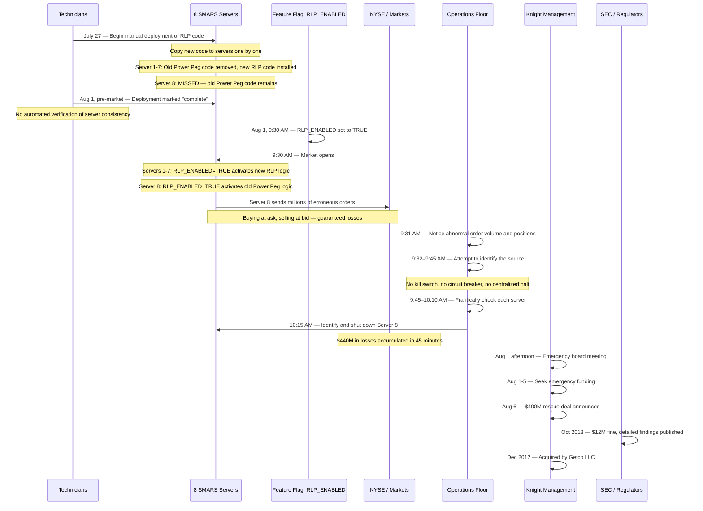
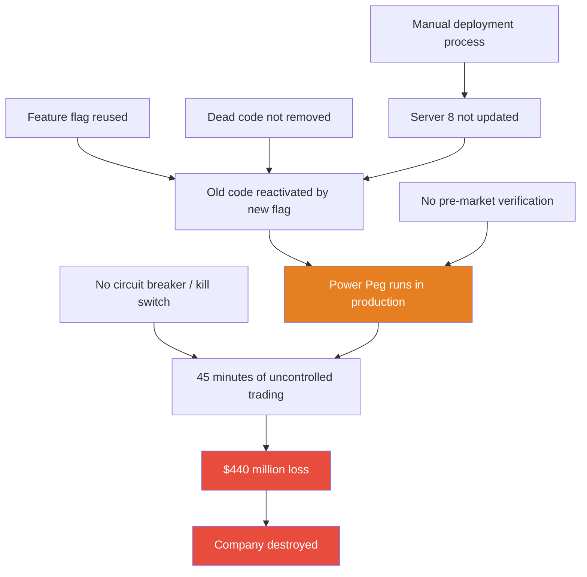
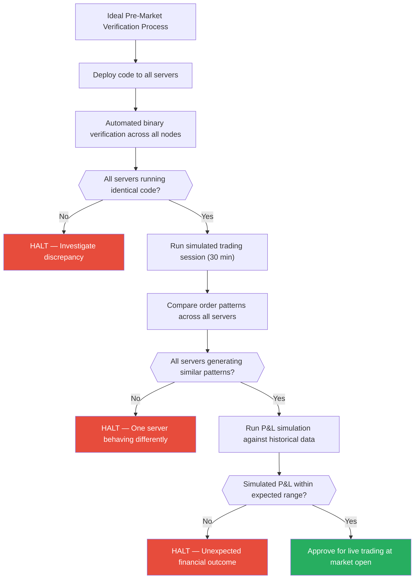

# Knight Capital's $440 Million Bug (August 2012)

On the morning of August 1, 2012, a botched manual deployment to one of eight production trading servers reactivated dead code that had been dormant for years, causing Knight Capital Group to hemorrhage $440 million in 45 minutes of uncontrolled trading — destroying a company that handled 11% of all US equity volume and employed over 1,400 people.

## The Alert

At 9:30 AM ET on August 1, 2012, the New York Stock Exchange opened for trading. Knight Capital's SMARS (Smart Market Access Routing System) began generating orders immediately. Within the first seconds of market open, one of the eight SMARS servers started sending massive, erroneous orders — buying at the ask price and selling at the bid price across 154 NYSE-listed stocks. This guaranteed a loss on every single trade.

Knight Capital's operations staff noticed abnormal order flow almost immediately. The volume was wrong. The patterns were wrong. The positions being accumulated were astronomical. But there was no automated kill switch. No circuit breaker. No button that said "stop everything." Operations staff had to manually identify which of eight servers was generating the bad orders, figure out why, and shut it down — all while the system was losing approximately $10 million per minute.

::: danger What Went Wrong First
During a software deployment over the preceding days, technicians manually deployed new SMARS code to eight production servers. They successfully deployed to seven of eight servers. On the eighth server, old code containing a defunct feature called "Power Peg" was inadvertently reactivated because the new deployment repurposed a feature flag that the old code was mapped to. When the flag was flipped to "on" at market open, seven servers ran the correct new code while the eighth server executed aggressive, loss-generating trading logic from years earlier.
:::

## Impact

| Metric | Detail |
|---|---|
| **Duration** | 45 minutes (9:30 AM to ~10:15 AM ET) |
| **Financial loss** | $440 million in realized trading losses |
| **Trades executed** | Over 4 million trades in 154 NYSE-listed stocks |
| **Net position accumulated** | ~$3.5 billion in unwanted equity positions |
| **Share price** | Knight Capital's stock dropped 75% over two trading days (from ~$10.33 to ~$2.58) |
| **Market cap loss** | ~$700 million in shareholder value destroyed |
| **Emergency rescue** | Required $400 million cash infusion from a consortium of investors |
| **Dilution** | Existing shareholders diluted by over 70% |
| **Company fate** | Acquired by Getco LLC in December 2012 for $3.75/share |
| **Regulatory fine** | $12 million SEC fine (October 2013) for Market Access Rule violations |
| **Market impact** | Erroneous trades in 154 stocks; some stocks moved 10%+ on Knight's erroneous orders |
| **Jobs** | 1,400+ employees absorbed into the Getco acquisition |

::: warning Scale of Destruction
Knight Capital went from being one of the most important market makers in the United States — handling roughly $21 billion in daily trading volume — to requiring emergency rescue funding in less than one business day. The $440 million loss exceeded the company's entire market capitalization. This is the fastest destruction of a major financial firm by a software bug in history.
:::

## Timeline



### Detailed Chronology

**July 27, 2012** — Knight Capital begins deploying code for a new feature called RLP (Retail Liquidity Provider). The NYSE is launching its Retail Liquidity Program on August 1, and Knight's SMARS system needs updated routing logic to participate. The deployment involves updating the SMARS routing system on eight production servers.

**July 27 – August 1** — Technicians manually copy the new code to the eight servers. There is no automated deployment system. There is no CI/CD pipeline. There is no deployment orchestration tool. A human being copies files from one location to another on each server, one at a time.

There is no verification step to confirm all servers are running identical code. No automated check compares binaries across the eight servers. No smoke test validates behavior. Seven servers are updated correctly. The eighth server is not — it retains an old module that reuses a feature flag that the new RLP code also uses.

**The critical detail that killed the company**: Years earlier, Knight Capital had developed a feature called "Power Peg" in SMARS. Power Peg was an aggressive order routing algorithm designed to move stock positions quickly. It had been decommissioned — turned off via a feature flag — but its code was never removed from the SMARS codebase. It sat in the system for years, dormant but fully executable.

When the RLP code was designed, developers repurposed the same feature flag that had previously controlled Power Peg. The flag's identifier was reused for the new functionality. On the seven correctly updated servers, flipping this flag activated the new RLP code (the old Power Peg code had been removed during the update). On the eighth server, where the old code still existed and the new code was not installed, flipping the flag reactivated Power Peg.

```
The Feature Flag Collision:

Feature flag: "RLP_ENABLED" (repurposed from Power Peg's control flag)

Server 1-7 (correctly updated):
  Old Power Peg code: REMOVED during deployment
  New RLP code: INSTALLED
  RLP_ENABLED = true → Activates new RLP routing logic ✓

Server 8 (deployment missed):
  Old Power Peg code: STILL PRESENT (never removed)
  New RLP code: NOT INSTALLED (deployment skipped this server)
  RLP_ENABLED = true → Reactivates dormant Power Peg ✗
  Power Peg begins aggressively buying and selling at market prices
```

**August 1, 9:30:00 AM ET** — The NYSE opens. The Retail Liquidity Program goes live. The RLP_ENABLED feature flag is set to TRUE across all SMARS servers.

**9:30:01+ AM** — Seven servers behave correctly, executing the new RLP logic. Server 8 activates Power Peg. Power Peg was designed to aggressively take positions — it would buy at the ask price and sell at the bid price to rapidly accumulate or unwind positions. But Power Peg was never meant to run at scale in production. It was old, unmonitored, and had no position limits, no rate controls, and no loss thresholds.

Server 8 begins sending millions of orders to the market. Each order pair guarantees a loss: buy at the higher ask price, sell at the lower bid price. The spread loss on each trade is small, but the volume is astronomical.

**9:31 AM** — Knight Capital's operations staff on the trading floor see anomalous order flow. The volume is orders of magnitude higher than expected. Positions in individual stocks are building up at impossible rates.

**9:31 – 10:15 AM** — The operations team enters 44 minutes of chaos. The critical problem is that they have no automated way to stop the bleeding:

| What they needed | What they had |
|---|---|
| A kill switch to halt all SMARS trading | Nothing — no centralized halt mechanism existed |
| Automated anomaly detection | Nothing — no position limit checks, no volume rate limits |
| A dashboard showing per-server order flow | Nothing — order flow was aggregated, not per-server |
| Automated alerting on loss thresholds | Nothing — no automated P&L monitoring during trading |

Engineers had to manually connect to each of the eight servers, inspect the running processes, compare behavior, and identify which server was the source. During this time, the erroneous orders continued at a rate that was losing approximately $10 million per minute.

**~10:15 AM** — Server 8 is identified and disabled. In 45 minutes, Knight Capital has executed over 4 million trades in 154 stocks, accumulating a net position of approximately $3.5 billion in equities and a realized loss of $440 million.

**August 1, afternoon** — Knight Capital's board holds an emergency meeting. The firm's capital reserves are insufficient to cover the $440 million loss. Without emergency funding, the firm will be insolvent.

**August 1–5** — Knight Capital's management contacts potential investors for an emergency capital injection.

**August 6** — A consortium of investors agrees to inject $400 million in exchange for convertible preferred shares that would dilute existing shareholders by over 70%. Knight Capital survives, but as a shell of its former self.

**October 16, 2013** — The SEC publishes its administrative proceeding against Knight Capital Americas LLC, documenting the control failures in detail and imposing a $12 million fine for violations of the Market Access Rule (Rule 15c3-5).

**December 2012** — Getco LLC acquires Knight Capital for $3.75 per share, ending Knight Capital's existence as an independent company.

## Root Cause

The root cause was a convergence of five systemic failures. Any single one of them, addressed properly, would have prevented the $440 million loss.



### 1. Manual Deployment Process

There was no automated deployment system. No CI/CD pipeline. No deployment orchestration. Code was manually copied to production servers by technicians. There was no automated verification that all eight servers were running identical code versions.

The SEC's investigation found that Knight Capital "did not have adequate written procedures for the deployment of new code" and that the deployment process relied entirely on human diligence — a human remembering to copy files to all eight servers, in the correct order, without missing any.

::: danger Critical Insight
Manual deployment to eight servers failed to deploy correctly to all eight. In an automated system with proper [deployment pipelines](/infrastructure/ci-cd/), either all servers get the update or none do. The concept of "we updated 7 of 8 and didn't notice" is structurally impossible with atomic deployments, [blue-green deployments](/devops/deployment-strategies/), or canary releases. Knight Capital's manual process was not just outdated — it was an existential risk that the company failed to recognize.
:::

### 2. Repurposed Feature Flag

A feature flag that had been used to control the old Power Peg functionality was repurposed to control the new RLP functionality. The developers who designed the RLP integration reused the flag identifier rather than creating a new one.

On servers where the old Power Peg code had been properly removed during the deployment, this repurposing was invisible — the flag activated the new code as intended. But on any server where the old code still existed, the repurposed flag became a loaded gun.

::: warning Watch Out for This
Repurposing feature flags is extremely dangerous. A feature flag should be a one-way mapping: one flag, one feature, one lifecycle. When flags are recycled, the assumption "old code controlled by this flag is gone" becomes an implicit, untested dependency. If the old code is not completely removed from every server, every container, every deployment artifact, flipping the recycled flag can resurrect it.
:::

### 3. Dead Code Not Removed

Power Peg had been decommissioned years earlier. Its functionality was turned off by setting its feature flag to FALSE. But the code itself — the classes, the methods, the order-generation logic — was never deleted from the SMARS codebase. It sat in the system for years, dormant but fully compiled and executable.

This violated a fundamental principle of software engineering: **dead code should be deleted, not just disabled**. Code that exists in a compiled binary can be executed. Code that has been deleted from the source repository cannot.

```
The Dead Code Lifecycle:

Phase 1: Power Peg is active
  Feature flag ON → Code executes → Orders generated

Phase 2: Power Peg is "decommissioned"
  Feature flag OFF → Code exists but doesn't execute
  ⚠ Code is still compiled into every SMARS binary
  ⚠ Code is still deployed to every SMARS server
  ⚠ Code can be reactivated by setting the flag back to ON

Phase 3: Feature flag is repurposed (THE BUG)
  Flag identifier reused for new RLP feature
  ON now means "activate RLP" on updated servers
  ON still means "activate Power Peg" on un-updated servers
```

### 4. No Circuit Breaker or Kill Switch

The SMARS system had no automated mechanism to detect and halt anomalous trading behavior. The SEC's investigation highlighted these missing controls:

| Control That Should Have Existed | What It Would Have Done |
|---|---|
| **Position limit check** | "We have accumulated $1B in positions in 10 minutes — HALT" |
| **Order rate limit** | "We are sending 1,000x normal order volume — HALT" |
| **P&L loss limit** | "We have lost $10M in 5 minutes — HALT" |
| **Single-stock concentration limit** | "We hold 5% of a stock's float from today's trading — HALT" |
| **Automated kill switch** | "One button halts all SMARS order generation immediately" |
| **Per-server anomaly detection** | "Server 8 is generating 100x the orders of servers 1-7 — ALERT" |

Any single one of these controls would have limited the damage. A $10 million loss limit would have stopped the bleeding within seconds, reducing the $440 million catastrophe to a manageable incident. The [circuit breaker pattern](/system-design/distributed-systems/circuit-breaker) exists precisely for scenarios like this — detect anomaly, trip breaker, stop the bleeding.

```
What a basic circuit breaker would have done:

function processOrder(order) {
  if (orders_per_second > 10 * NORMAL_RATE)       → HALT_ALL_TRADING()
  if (net_position > MAX_ALLOWED_POSITION)         → HALT_ALL_TRADING()
  if (realized_loss > MAX_DAILY_LOSS)              → HALT_ALL_TRADING()
  if (single_stock_position > MAX_SINGLE_STOCK)    → HALT_ALL_TRADING()

  // Only reaches here if all checks pass
  sendToExchange(order)
}
```

### 5. No Pre-Market Verification

There was no smoke test, canary deployment, or staged rollout. The RLP feature had never been tested in a production-like environment with the actual market data feed. The system went from zero to full production at 9:30 AM when the market opened.

A pre-market test run — even 5 minutes of simulated trading — would have revealed that Server 8 was generating radically different order patterns from servers 1-7. The anomaly would have been obvious: one server sending thousands of aggressive orders while the other seven sent normal RLP orders.



Any single step in this process would have caught the problem before the market opened. Knight Capital had none of them.

## The Fix

There was no "fix" in the traditional sense. The erroneous trades were already executed and settled. Knight Capital survived the immediate crisis only through an emergency $400 million capital injection that came at an enormous cost to existing shareholders.

### Regulatory Response

The SEC's investigation (Administrative Proceeding File No. 3-15570, October 16, 2013) resulted in a $12 million fine and documented the following specific control failures:

1. Knight did not have adequate safeguards to limit the risks posed by its access to the markets, including the risks from the deployment of new code
2. Knight did not have adequate written procedures for reviewing its technology changes to SMARS
3. Knight did not adequately test the deployment of the new RLP code to all SMARS servers
4. Knight did not have a system of risk management controls and supervisory procedures reasonably designed to manage the risk of its market access
5. Knight's procedures did not require confirmation that all eight servers were running identical code before going live

::: danger SEC's Key Finding
The SEC specifically noted that Knight Capital "did not have controls reasonably designed to prevent the entry of erroneous orders, such as automated checks that would have detected and prevented the entry of orders that exceeded pre-set capital, credit, or activity thresholds." The absence of even basic automated safeguards was not merely a technical shortcoming — it was a regulatory violation of Rule 15c3-5 (the Market Access Rule).
:::

### Industry Impact

The Knight Capital incident sent shockwaves through the financial industry and directly contributed to:

| Change | Detail |
|---|---|
| **SEC Rule 15c3-5 enforcement** | The Market Access Rule was enforced far more aggressively after Knight Capital, with regulators demanding broker-dealers demonstrate functioning pre-trade risk controls |
| **Pre-trade risk checks** | Industry-wide adoption of automated position limits, loss limits, and order rate controls became standard practice |
| **Kill switches** | Every major trading firm invested in automated kill switches that could halt all trading within seconds |
| **Deployment automation** | Financial technology firms accelerated adoption of CI/CD pipelines, blue-green deployments, and automated verification |
| **Dead code policies** | Many firms implemented policies requiring removal of decommissioned code, not just disabling it via flags |
| **Circuit breaker standards** | Exchanges implemented their own circuit breakers (market-wide and single-stock) to prevent errant algorithms from destabilizing markets |

## Lessons Learned

### 1. Automate deployments — manual processes do not scale and do not verify

::: danger Lesson
Manual deployment to eight servers failed to deploy correctly to all eight. An automated deployment system with verification ensures atomic, consistent rollouts. The concept of "we updated 7 of 8 and didn't notice" is structurally impossible with proper [deployment automation](/devops/deployment-strategies/). Every production deployment must include automated verification that all target servers are running identical, expected code versions.
:::

### 2. Dead code is live code waiting to happen

If code exists in your repository and can be reached at runtime, it is not dead. It is dormant. Delete it. If you need it later, it is in version control. The most dangerous code in your system is not the code you know about — it is the code you forgot about.

Knight Capital's Power Peg code sat dormant for years. No one remembered it was there. No one thought about what would happen if its flag was reactivated. The code was invisible until the moment it destroyed the company.

### 3. Feature flags need lifecycle management

Feature flags should have:
- **Unique identifiers** that are never reused across the life of the system
- **Expiration dates** after which they must be removed from the codebase
- **Ownership** — a named person or team responsible for the flag's lifecycle
- **Documentation** of exactly which code paths the flag controls
- **Cleanup enforcement** — when a flag is retired, all code guarded by that flag must be removed or made permanent

### 4. Every production system needs a kill switch

A system that can lose $10 million per minute needs a mechanism — automated or manual — that stops all activity immediately. This is the [circuit breaker pattern](/system-design/distributed-systems/circuit-breaker) at its most fundamental: detect anomaly, trip breaker, stop the bleeding.

The kill switch must be:
- **Independent** of the system it protects (if the trading system is broken, the kill switch cannot rely on it)
- **Fast** — sub-second activation
- **Tested regularly** — an untested kill switch is not a kill switch
- **Accessible** — the person who needs it must be able to reach it under stress

### 5. Testing must include negative scenarios at scale

Knight Capital tested that the new RLP code worked correctly. They did not test what would happen if a server had the old code with the reused flag. They did not test what would happen if servers were running different code versions. Testing the happy path is necessary but insufficient.

The scenarios that destroy companies are never on the happy path. They are the failure modes: inconsistent deployments, flag collisions, stale code, race conditions, partial rollouts. Testing must explicitly target these scenarios.

### 6. Financial loss can exceed recovery time

Unlike most software incidents where the damage is measured in downtime or degraded performance, Knight Capital's damage was irreversible. Every second the system ran, it executed real trades that moved real money. There was no rollback, no undo, no "restore from backup." The $440 million was gone the moment the trades settled.

This is a property of systems that take **irreversible actions**: sending money, deleting data, placing orders, launching physical processes. These systems require a fundamentally higher level of safeguarding than systems where the worst case is downtime.

### 7. Aggregated monitoring hides per-instance anomalies

Knight Capital's operations team saw aggregate order flow across all eight SMARS servers. When one server was generating 100x the orders of the other seven, the aggregate view showed "higher than expected volume" — a signal, but not the screaming alarm it should have been. If they had per-server dashboards, the anomaly on Server 8 would have been immediately and unmistakably obvious.

This is a lesson that applies broadly: aggregate metrics hide outliers. If you have N instances of a service, always provide per-instance breakdowns for critical metrics. A single misbehaving node drowning in a pool of healthy nodes is one of the hardest failure modes to detect with aggregate-only monitoring.

### 8. The cost of delayed response scales linearly (or worse) with time

Knight Capital lost approximately $10 million per minute during the 45-minute incident. Every minute spent searching for the cause was $10 million. The relationship between detection time, response time, and total damage was brutally linear:

| Response Time | Estimated Loss |
|---|---|
| 1 minute (automated kill switch) | ~$10 million |
| 5 minutes (fast human detection) | ~$50 million |
| 15 minutes (moderate response) | ~$150 million |
| 45 minutes (actual response) | $440 million |

For systems where damage scales with time, the single highest-leverage investment is reducing time-to-detection and time-to-mitigation. An automated circuit breaker that tripped at $10 million in losses would have saved $430 million — a return on investment that is almost impossible to overstate.

## What You Can Learn

1. **Automate all deployments.** If a human is copying files to production servers, it is a matter of time before they miss one. Use [CI/CD pipelines](/infrastructure/ci-cd/) with verification steps that confirm every node is running the expected version before traffic is routed to it.

2. **Implement circuit breakers on irreversible-action paths.** Any system that can take irreversible actions — sending money, placing orders, deleting data, modifying hardware — needs automated safeguards that detect anomalies and halt operations. Build the [circuit breaker](/system-design/distributed-systems/circuit-breaker) before you need it.

3. **Delete dead code aggressively.** If a feature is decommissioned, remove its code completely. If you are uncomfortable removing it, that discomfort tells you the code is not well-understood — which is an even stronger reason to remove it carefully and soon.

4. **Never reuse feature flags.** Treat feature flags like database primary keys — they are unique, permanent identifiers. When a flag's lifecycle ends, remove the flag and ALL associated code from EVERY deployment target. Never repurpose the identifier.

5. **Run pre-production verification that tests for inconsistency.** Before going live, validate that all servers are running identical code. For trading systems, run simulated order generation and compare outputs across servers — divergent behavior is an immediate red flag. For web services, [canary deployments](/devops/deployment-strategies/) with synthetic traffic serve the same purpose.

6. **Build anomaly detection that considers per-instance behavior.** Knight Capital's aggregated monitoring could not easily distinguish one misbehaving server from seven healthy ones. Per-instance metrics — order rate per server, P&L per server, error rate per server — make anomalies immediately visible.

7. **Know your irreversibility window.** For any critical system, understand the window between "action taken" and "action becomes irreversible." For Knight Capital, that window was zero — every trade was final. For most systems, there is some grace period. Design your circuit breakers to trip well within that window.

8. **Conduct "pre-mortem" exercises for deployment processes.** Before a high-stakes deployment (like Knight Capital's RLP launch timed to NYSE's program go-live), gather the engineering team and ask: "Imagine this deployment has failed catastrophically. What went wrong?" This "pre-mortem" technique surfaces risks that optimistic planning misses. Someone would likely have asked: "What if we don't deploy to all eight servers correctly?"

9. **Treat financial systems as safety-critical systems.** Aviation software, medical device software, and nuclear power software all have rigorous verification requirements because failures can cause irreversible harm. Financial trading systems can also cause irreversible harm — measured in hundreds of millions of dollars. They deserve the same level of deployment rigor, testing discipline, and safety engineering that physical safety-critical systems receive.

## The Human Element

It is tempting to blame the technician who missed Server 8 during the deployment. But the SEC's findings make clear that the failure was systemic, not individual. The technician was following a process — a manual, unverified process — that the company had designed and relied on. The process itself was the vulnerability. No individual human can reliably perform the same manual task across eight servers without error, under time pressure, with no verification step. That is not a human failure; that is a process failure.

Knight Capital's management created the conditions for this incident by:
- Not investing in deployment automation
- Not requiring code cleanup when features were decommissioned
- Not implementing trading safeguards that the SEC's Market Access Rule required
- Not conducting pre-market verification of new features

The technician who missed Server 8 was working within a system that was already broken. The incident was inevitable — the only question was when.

::: warning Blame the System, Not the Person
In every major incident, there is a temptation to blame the individual who "caused" the failure. But individuals operate within systems. If the system allows a single human mistake to cause $440 million in losses, the system is broken. The correct response is to fix the system — add automation, add safeguards, add verification — not to blame the person who was set up to fail by a broken process.
:::

## Further Reading

- [SEC Administrative Proceeding — In the Matter of Knight Capital Americas LLC](https://www.sec.gov/litigation/admin/2013/34-70694.pdf) (October 16, 2013) — The official SEC findings
- [What Happened at Knight Capital — Henrico Dolfing](https://www.henricodolfing.com/2019/06/project-failure-case-study-knight-capital.html) — Detailed case study analysis
- [CI/CD Pipelines](/infrastructure/ci-cd/) — How automated deployment prevents Knight Capital-class errors
- [Circuit Breaker Pattern](/system-design/distributed-systems/circuit-breaker) — The pattern that was missing from SMARS
- [Deployment Strategies](/devops/deployment-strategies/) — Blue-green, canary, and rolling deployments
- [Chaos Engineering](/devops/incident-response/chaos-engineering) — Testing failure modes before they happen in production
- [GitHub's October 2018 Outage](/war-room/github-october-2018) — Automated failover causing more damage than the original problem
- [Cloudflare's Regex Outage](/war-room/cloudflare-regex-2019) — Global deployment without staged rollout
