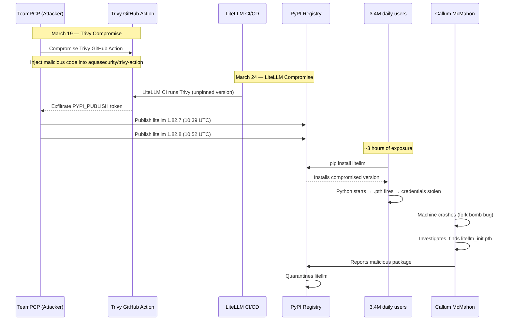
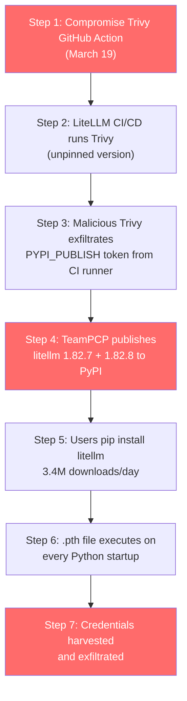

# LiteLLM Supply Chain Attack (March 2026)

A single `pip install` turned into a cybersecurity nightmare. On March 24, 2026, compromised versions of LiteLLM — a Python AI proxy library with **95 million monthly downloads** — were published to PyPI. Once installed, a malicious `.pth` file executed every time Python started, silently harvesting SSH keys, API keys, cloud credentials, Kubernetes configs, and shell history. The data was encrypted and exfiltrated to attacker-controlled servers.

The irony? The malware was discovered because it had a **bug that created a fork bomb**, crashing a researcher's machine.

## The Alert

Security researcher **Callum McMahon** at FutureSearch was testing a Cursor MCP plugin that pulled in `litellm` as a transitive dependency. Shortly after Python started, his machine became unresponsive — RAM exhaustion, CPU pinned.

He traced it to a newly installed file: `litellm_init.pth` — a **34,628-byte** file sitting in `site-packages/`.

::: danger The terrifying part
The `.pth` mechanism fires on **every Python interpreter startup**. No `import litellm` required. Just having the package installed was enough. Every Python script, every Jupyter notebook, every Django server, every pytest run — all compromised from the moment of installation.
:::

## Impact

- **Library size**: 3.4 million downloads per day, 95 million per month
- **Compromised versions**: `1.82.7` and `1.82.8`
- **Window of exposure**: ~3 hours before PyPI quarantined the package
- **Affected systems**: Any machine that ran `pip install litellm` during the window
- **Data stolen**: SSH keys, `.env` files, AWS/GCP/Azure credentials, Kubernetes configs, database passwords, git credentials, shell history, crypto wallet files

## Timeline



| Time (UTC) | Event |
|------------|-------|
| March 19 | TeamPCP compromises Trivy GitHub Action |
| March 24, 10:39 | `litellm 1.82.7` published with embedded payload in `proxy_server.py` |
| March 24, 10:52 | `litellm 1.82.8` published with `.pth` file — fires on every Python startup |
| March 24, ~11:00 | Callum McMahon's machine crashes from fork bomb |
| March 24, ~12:00 | McMahon traces crash to `litellm_init.pth`, begins analysis |
| March 24, ~13:00 | PyPI quarantines `litellm`, all versions temporarily unavailable |
| March 24, ~14:00 | McMahon publishes disclosure on FutureSearch blog |
| March 24, ~15:00 | Story hits r/LocalLLaMA, r/Python, Hacker News front page |

## Root Cause

### The Attack Chain: From Trivy to LiteLLM

This was **not a direct attack** on LiteLLM. It was a **multi-stage supply chain attack** by a threat actor tracked as **TeamPCP**.



::: warning The critical mistake
LiteLLM's CI/CD pipeline ran Trivy **without pinning the version**. When Trivy's GitHub Action was compromised on March 19, LiteLLM's CI automatically pulled the malicious version. The compromised Trivy action exfiltrated the `PYPI_PUBLISH` token from the GitHub Actions runner environment.
:::

### Two Different Payloads

The attacker published two versions with different delivery mechanisms:

| Version | Delivery Method | Trigger |
|---------|----------------|---------|
| **1.82.7** | Base64-encoded payload in `litellm/proxy/proxy_server.py` | Fires when anything imports `litellm.proxy` |
| **1.82.8** | `litellm_init.pth` file (34,628 bytes) in `site-packages/` | Fires on **every Python interpreter startup** — no import needed |

### How `.pth` Files Work

Python's `.pth` mechanism was designed for adding paths to `sys.path`. But any line starting with `import` in a `.pth` file is **executed as code** on interpreter startup:

```python
# Normal .pth file — adds a path
/some/additional/path

# Malicious .pth file — executes arbitrary code
import subprocess; subprocess.Popen(['python', '-c', 'exec(PAYLOAD)'])
```

::: danger Why .pth is so dangerous
- Executes before **any** user code
- No import of the package required
- Runs on **every** Python process: scripts, notebooks, servers, tests
- Not visible in normal `import` tracing
- Most developers don't even know `.pth` files exist
:::

### The Fork Bomb Bug

The `.pth` payload spawned a **new Python subprocess** to do the actual credential harvesting. But that new subprocess **also triggered `.pth` execution**, which spawned another subprocess, which triggered `.pth` again — creating an unintended **fork bomb**.

```
Python starts → .pth fires → spawns Python subprocess
    └→ Python starts → .pth fires → spawns Python subprocess
        └→ Python starts → .pth fires → spawns Python subprocess
            └→ ... (exponential, machine crashes)
```

This bug is what crashed McMahon's machine and led to the discovery. Without it, the malware would have silently stolen credentials without anyone noticing.

::: tip The irony
The attacker's code had a bug. If the fork bomb hadn't crashed McMahon's machine, the credential stealer would have operated silently. **A bug in the malware saved the community.**
:::

### What Was Stolen

The credential harvester targeted:

```python
# Files the malware searched for and exfiltrated
TARGETS = [
    "~/.ssh/id_rsa", "~/.ssh/id_ed25519",     # SSH private keys
    "~/.ssh/config",                             # SSH config
    "~/.env", ".env", ".env.local",             # Environment variables
    "~/.aws/credentials", "~/.aws/config",       # AWS credentials
    "~/.config/gcloud/credentials.db",           # GCP credentials
    "~/.azure/",                                 # Azure credentials
    "~/.kube/config",                            # Kubernetes config
    "~/.gitconfig", "~/.git-credentials",        # Git credentials
    "~/.bash_history", "~/.zsh_history",         # Shell history
    "~/.docker/config.json",                     # Docker Hub credentials
    "~/.npmrc",                                  # npm tokens
    "~/.pypirc",                                 # PyPI tokens
]
```

In Kubernetes environments, the malware additionally attempted:
- **Service account token theft** from `/var/run/secrets/kubernetes.io/serviceaccount/`
- **Lateral movement** using stolen K8s credentials
- **Persistence** via CronJobs or modified deployments

## The Fix

### Immediate Response

```bash
# 1. Check if you're affected
pip show litellm | grep Version
# If 1.82.7 or 1.82.8 — YOU ARE COMPROMISED

# 2. Check for the malicious .pth file
find $(python -c "import site; print(site.getsitepackages()[0])") \
  -name "litellm_init.pth" 2>/dev/null

# 3. Remove compromised version
pip uninstall litellm -y
pip cache purge

# 4. Check ALL virtual environments
find / -name "litellm_init.pth" 2>/dev/null

# 5. Install clean version
pip install litellm==1.82.6  # Last known clean version
```

### Credential Rotation (MANDATORY if affected)

```bash
# SSH keys
ssh-keygen -t ed25519 -C "rotated-after-litellm-incident"
# Update all servers, GitHub, GitLab, etc.

# AWS
aws iam create-access-key --user-name YOUR_USER
aws iam delete-access-key --access-key-id OLD_KEY_ID

# GCP
gcloud auth revoke
gcloud auth login

# Kubernetes
kubectl config delete-context COMPROMISED_CONTEXT
# Re-authenticate with your cluster

# Docker Hub
docker logout
docker login  # Generate new access token first

# npm
npm token revoke TOKEN_ID
npm token create

# PyPI
# Revoke all API tokens at pypi.org/manage/account/
```

::: danger DO NOT skip credential rotation
Even if the compromised versions were only installed for minutes, the malware could have exfiltrated credentials. **Assume everything is compromised and rotate ALL secrets.**
:::

## Lessons Learned

### 1. Pin Your CI/CD Dependencies

LiteLLM's CI pulled Trivy without a pinned version. This allowed the compromised Trivy to run in their pipeline.

```yaml
# BAD — pulls whatever version is latest (including compromised)
- uses: aquasecurity/trivy-action@latest

# GOOD — pin to a specific commit SHA
- uses: aquasecurity/trivy-action@a7a829a0713867b681da939dc5999bbab3cee884
```

### 2. Protect CI/CD Secrets

The `PYPI_PUBLISH` token was accessible to the Trivy action. It shouldn't have been.

```yaml
# BAD — all steps in a job share the same secrets
jobs:
  build:
    steps:
      - uses: untrusted-action@v1  # Can read PYPI_TOKEN
        env:
          PYPI_TOKEN: $&#123;&#123; secrets.PYPI_TOKEN &#125;&#125;

# GOOD — separate jobs, secrets only where needed
jobs:
  scan:
    steps:
      - uses: aquasecurity/trivy-action@SHA  # No access to PYPI_TOKEN
  publish:
    needs: scan
    steps:
      - uses: pypa/gh-action-pypi-publish@SHA
        with:
          password: $&#123;&#123; secrets.PYPI_TOKEN &#125;&#125;
```

### 3. Use Trusted Publishing for PyPI

PyPI supports **OIDC-based trusted publishing** — no long-lived tokens needed:

```yaml
# BEST — no stored secrets, GitHub ↔ PyPI trust
jobs:
  publish:
    permissions:
      id-token: write  # OIDC token
    steps:
      - uses: pypa/gh-action-pypi-publish@release/v1
        # No password needed — uses OIDC
```

### 4. Audit `.pth` Files

```bash
# Check for suspicious .pth files in your environments
python -c "
import site, os
for d in site.getsitepackages():
    for f in os.listdir(d):
        if f.endswith('.pth'):
            path = os.path.join(d, f)
            with open(path) as fh:
                content = fh.read()
            if 'import' in content and 'subprocess' in content.lower():
                print(f'SUSPICIOUS: {path}')
            elif len(content) > 1000:
                print(f'LARGE .pth FILE: {path} ({len(content)} bytes)')
"
```

### 5. Monitor for Supply Chain Attacks

- Use **lockfiles** (`pip freeze > requirements.txt` with hashes)
- Use **pip-audit** to check for known vulnerabilities
- Pin **exact versions** in production
- Use `--require-hashes` for pip installs
- Monitor PyPI release notifications for critical dependencies

## What You Can Learn

### For Package Maintainers

1. **Never use long-lived PyPI tokens** — use OIDC trusted publishing
2. **Pin all CI/CD action versions** to commit SHAs, not tags
3. **Isolate secrets** — scanning tools should never access publishing credentials
4. **Enable 2FA** on PyPI accounts
5. **Use Sigstore** to sign your packages

### For Package Consumers

1. **Pin exact versions** in production (`litellm==1.82.6`, not `litellm>=1.0`)
2. **Use lockfiles with hashes** (`pip install --require-hashes`)
3. **Audit new package versions** before upgrading
4. **Run pip-audit** regularly
5. **Use virtual environments** — limits blast radius
6. **Monitor `.pth` files** in site-packages

### For Platform Engineers

1. **Ephemeral CI/CD environments** — don't persist secrets across runs
2. **Separate build and publish** into different jobs with different permissions
3. **Network egress controls** — block unexpected outbound connections from build environments
4. **Package proxy** — use Artifactory/Nexus to cache and scan packages before allowing internal use

### The Bigger Picture

As **Andrej Karpathy** noted: *"Supply chain attacks may be the scariest threat in modern software."*

This attack succeeded because of a chain of trust:
1. Developers trust PyPI packages
2. CI/CD trusts GitHub Actions
3. GitHub Actions trusts third-party actions
4. Third-party actions trust their own dependencies

One compromise anywhere in this chain cascades to everything downstream. The LiteLLM incident is a textbook example of why **zero trust must extend to your software supply chain**.

## Related Incidents

- [XZ Utils Backdoor (2024)](/war-room/) — 2-year social engineering campaign to backdoor Linux SSH
- [SolarWinds (2020)](/security/exploits/solarwinds) — Nation-state build pipeline compromise
- [Supply Chain Security](/security/supply-chain/) — SLSA, SBOMs, Sigstore

## Further Reading

- [FutureSearch: LiteLLM PyPI Supply Chain Attack](https://futuresearch.ai/blog/litellm-pypi-supply-chain-attack/) — Callum McMahon's original disclosure
- [Wiz: TeamPCP Supply Chain Attack](https://www.wiz.io/blog/threes-a-crowd-teampcp-trojanizes-litellm-in-continuation-of-campaign) — Full TeamPCP campaign analysis
- [GitGuardian: Trivy's March Supply Chain Attack](https://blog.gitguardian.com/trivys-march-supply-chain-attack-shows-where-secret-exposure-hurts-most/) — How secrets exposure enabled the chain
- [Sonatype: Compromised litellm Analysis](https://www.sonatype.com/blog/compromised-litellm-pypi-package-delivers-multi-stage-credential-stealer) — Technical payload analysis
- [Snyk: Poisoned Security Scanner](https://snyk.io/articles/poisoned-security-scanner-backdooring-litellm/) — Trivy → LiteLLM chain
- [BleepingComputer: LiteLLM Backdoored](https://www.bleepingcomputer.com/news/security/popular-litellm-pypi-package-compromised-in-teampcp-supply-chain-attack/) — News coverage
- [LiteLLM Official Security Update](https://docs.litellm.ai/blog/security-update-march-2026) — Official response
- [GitHub Issue #24512](https://github.com/BerriAI/litellm/issues/24512) — Original issue report
