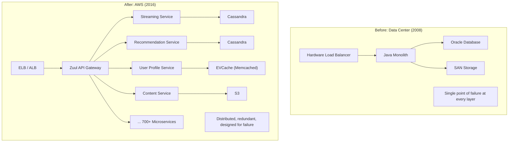
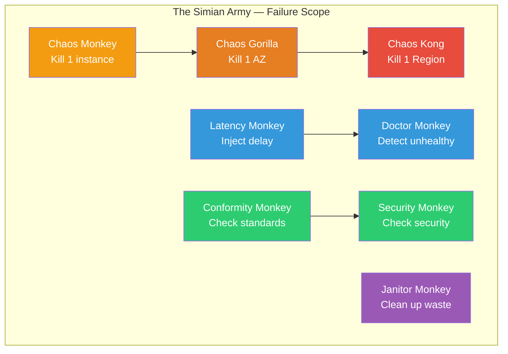
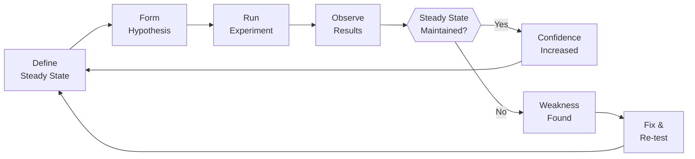

# Netflix's Chaos Engineering Origin Story

In August 2008, Netflix experienced a major database corruption that took down DVD shipping operations for three days. At the time, Netflix ran its own data centers, and the incident exposed fundamental fragilities in their infrastructure. This single event set in motion a chain of decisions that would reshape Netflix's engineering culture and give birth to an entirely new discipline: **chaos engineering**.

The journey from a three-day outage to the creation of the Simian Army — the suite of tools that deliberately breaks Netflix's production systems to prove they can survive — is one of the most influential engineering stories in the industry.

## The 2008 Database Corruption

### What Happened

In August 2008, Netflix's Oracle database — which powered the DVD-by-mail business, the core revenue stream — suffered a corruption event. The corruption affected Netflix's ability to ship DVDs to customers.

- **Duration**: 3 days of significant service disruption
- **Business impact**: DVD shipments were delayed for millions of subscribers
- **Revenue impact**: Three days of impaired service for a subscription business that was generating $1.3 billion in annual revenue at the time

::: danger What Went Wrong
Netflix was running a traditional data center architecture with vertical scaling (bigger servers), single-vendor database dependency (Oracle), and infrastructure that had grown organically without being designed for failure resilience. A single database failure cascaded to affect the entire DVD shipping pipeline.
:::

### The Wake-Up Call

The 2008 outage was not Netflix's only infrastructure problem, but it was the one that crystallized a strategic decision. Netflix's engineering leadership — led by Adrian Cockcroft (Cloud Architect) and others — concluded that:

1. **Vertical scaling had reached its limit.** Buying bigger servers could not keep up with Netflix's growth.
2. **Single-vendor dependencies were dangerous.** Depending on one Oracle database cluster was a single point of failure.
3. **Their own data centers were a liability.** Managing physical infrastructure was consuming engineering resources that could be spent on the product.
4. **The architecture needed to be designed for failure**, not designed to prevent failure (which is impossible at scale).

## The Migration to AWS (2008–2016)

### The Decision

In late 2008, Netflix made the decision to migrate from their own data centers to Amazon Web Services. This was a radical choice at the time — AWS was still relatively young, and the idea of a company Netflix's size running its core business on someone else's infrastructure was considered risky.

The migration took nearly **eight years** to complete (2008–2016), moving from a monolithic Java application in a data center to hundreds of microservices on AWS.

### Architecture Transformation



Key principles of the new architecture:

1. **Everything is a service.** The monolith was decomposed into hundreds of independent microservices.
2. **Stateless services.** Application servers hold no state — all state is in distributed databases and caches.
3. **Multi-region active-active.** Netflix runs in multiple AWS regions simultaneously, able to shift traffic if one region has problems.
4. **Design for failure.** Every component assumes that its dependencies will fail, and handles those failures gracefully.

### The Birth of Chaos Monkey (2010)

As Netflix migrated to AWS, they made a philosophical leap that defined their engineering culture. The reasoning went:

> In the cloud, servers fail. Networks partition. Entire availability zones go down. We cannot prevent these failures. Instead of hoping they do not happen, we will ensure our system survives when they do.

To verify that their systems were truly resilient, Netflix created **Chaos Monkey** — a tool that randomly terminates production EC2 instances during business hours.

::: tip The Philosophy
The core insight behind Chaos Monkey is counterintuitive: **your systems become more reliable when you break them regularly.** If engineers know that any server could be killed at any time, they design their services to handle server failure gracefully. If you only test failure during rare, unexpected outages, you discover your systems are fragile at the worst possible moment.
:::

```
Chaos Monkey's logic (simplified):

while market_hours():
    services = get_all_production_services()
    target = random.choice(services)
    instance = random.choice(target.instances)

    log(f"Terminating {instance} from {target}")
    terminate(instance)

    # If the service is properly designed:
    #   - Load balancer routes around dead instance
    #   - Auto-scaling replaces it within minutes
    #   - Users notice nothing

    # If the service is NOT properly designed:
    #   - Engineers get paged
    #   - They fix the resilience gap
    #   - Next time Chaos Monkey visits, service survives
```

## The Simian Army

Chaos Monkey was just the beginning. Netflix expanded their failure injection program into the **Simian Army** — a suite of tools that test different failure modes:

### Chaos Monkey
Randomly terminates individual EC2 instances. Tests: Can services handle the loss of any single server?

### Latency Monkey
Injects artificial delays into RESTful calls between services. Tests: Can services handle slow dependencies without cascading failures? Do [circuit breakers](/system-design/distributed-systems/circuit-breaker) trip correctly?

### Conformity Monkey
Checks that running instances conform to best practices (health checks, auto-scaling groups, etc.). Tests: Are all services deployed according to Netflix's standards?

### Doctor Monkey
Monitors health checks and detects unhealthy instances (beyond simple crashes — things like high CPU, memory pressure, or failed health check endpoints). Tests: Can unhealthy instances be identified and removed automatically?

### Janitor Monkey
Identifies and cleans up unused resources (unused instances, unattached volumes, expired security groups). Tests: Is the infrastructure being kept clean?

### Security Monkey
Monitors security-related configurations and detects vulnerabilities or misconfigurations (expired SSL certs, overly permissive security groups). Tests: Is the infrastructure secure?

### Chaos Gorilla
Simulates the failure of an entire AWS Availability Zone. Tests: Can Netflix survive the loss of an entire AZ? (Much more destructive than Chaos Monkey.)

### Chaos Kong
Simulates the failure of an entire AWS Region. Tests: Can Netflix fail over to another region and continue serving customers? (The most extreme test in the Simian Army.)



## Chaos Engineering as a Discipline

Netflix's experiences led to the formalization of chaos engineering as a discipline. In 2014, Netflix hired Casey Rosenthal to lead a dedicated Chaos Engineering team, and in 2017, they published [*Chaos Engineering: System Resiliency in Practice*](https://www.oreilly.com/library/view/chaos-engineering/9781491988459/), which defined the principles.

### The Chaos Engineering Process

1. **Define steady state**: What does "normal" look like? (e.g., successful request rate, p50 latency, stream starts per second)
2. **Hypothesize**: "If we kill one instance of the recommendation service, the error rate will not increase because the load balancer will route around it."
3. **Introduce a real-world event**: Kill the instance, inject latency, simulate an AZ failure, etc.
4. **Observe**: Did the system maintain steady state? If not, what broke?
5. **Learn and improve**: Fix the weakness and re-test.



### The Cultural Shift

The most important aspect of Netflix's chaos engineering program was not the tools — it was the cultural shift. Engineers at Netflix internalized several principles:

1. **Failures are expected, not exceptional.** The question is not "will this fail?" but "when this fails, what happens?"
2. **Resilience must be tested, not assumed.** A service that has never been tested under failure is assumed to be fragile.
3. **Production is the only truthful test environment.** Staging environments do not have the same traffic patterns, data sizes, or infrastructure topology. Only production testing reveals true resilience gaps.
4. **Break things during business hours.** If you only discover failures during 3 AM outages, you are learning in the worst possible conditions. Break things intentionally when the team is alert and ready.

::: warning Watch Out for This
Chaos engineering is not "randomly breaking things in production." It is a disciplined practice with hypotheses, controlled scope, and abort conditions. Always:
- Start small (one instance, not a whole region)
- Have a clear hypothesis about expected behavior
- Have a rollback plan
- Monitor the impact in real time
- Progressively increase scope as confidence grows
:::

## Results

Netflix's investment in chaos engineering and resilience produced measurable results:

- **Regional failover capability**: Netflix can shift all traffic from one AWS region to another in minutes
- **Availability**: Netflix maintained its service during multiple AWS outages that affected other major companies
- **The 2012 AWS Christmas Eve outage**: While many AWS customers experienced significant downtime during the us-east-1 ELB outage on December 24, 2012, Netflix was largely unaffected because their architecture was designed to handle exactly this type of failure
- **Industry influence**: Chaos engineering became a recognized discipline, with tools like Gremlin, LitmusChaos, and AWS Fault Injection Simulator following Netflix's lead

## Lessons Learned

### 1. Design for failure, not against it

::: tip Key Principle
You cannot prevent all failures. At cloud scale, hardware fails, networks partition, and services crash — it is a matter of statistics. The only viable strategy is to assume failure will happen and design your system to survive it. This means redundancy, circuit breakers, graceful degradation, and regular failure testing.
:::

### 2. Chaos engineering builds confidence through evidence

Traditional testing tells you "this works when everything is normal." Chaos engineering tells you "this works when things go wrong." Both are necessary. Without chaos engineering, your confidence in your system's resilience is based on hope, not evidence.

### 3. Cultural change is harder than technical change

Building Chaos Monkey took weeks. Changing Netflix's engineering culture to embrace deliberate failure injection took years. The hardest part was not writing the tools — it was convincing engineers (and management) that intentionally breaking production systems was a good idea.

### 4. Start with the smallest possible scope

Netflix started with Chaos Monkey (kill one instance), not Chaos Kong (kill a region). Each step built confidence and tooling for the next. If you try to simulate regional failure before your services can handle a single instance death, you will cause an outage, not learn from one.

### 5. Multi-region active-active is the ultimate resilience pattern

The highest expression of Netflix's resilience philosophy is running active-active across multiple AWS regions. If an entire region fails, traffic automatically shifts to the remaining regions. This requires stateless services, replicated data stores, and DNS-based traffic management.

## What You Can Learn

1. **Start with game days.** You do not need Netflix's scale to benefit from chaos engineering. Start with a "game day" — a planned exercise where the team simulates a failure (kill a server, disable a database, inject latency) and observes the result. See [Chaos Engineering](/devops/incident-response/chaos-engineering) for a practical guide.

2. **Verify your circuit breakers actually work.** If you have [circuit breakers](/system-design/distributed-systems/circuit-breaker), test them by injecting real failures. A circuit breaker that has never tripped in production is an untested circuit breaker.

3. **Build observability before chaos.** You cannot run chaos experiments if you cannot observe the results. Invest in [monitoring](/devops/monitoring/), [logging](/devops/logging/), and distributed tracing before starting chaos experiments.

4. **Make failure the engineer's responsibility, not ops' problem.** At Netflix, the engineers who build services are responsible for those services' resilience. Chaos Monkey pages the service owner, not a separate operations team. This creates a direct feedback loop between resilience gaps and the people who can fix them.

5. **Embrace progressive failure injection.** Start with killing single instances. Graduate to injecting latency. Then simulate AZ failure. Then region failure. Each step should only happen after the previous step consistently succeeds.

## What Would You Do?

Test your resilience engineering instincts against the decisions Netflix's engineers actually faced.

::: details Scenario 1: It is 2008. Your Oracle database just corrupted and DVD shipments are halted for 3 days. Your data center infrastructure has grown organically and is full of single points of failure. Do you (A) invest in making your existing data center infrastructure more resilient with redundant databases and failover, (B) migrate to a cloud provider (AWS is still young and unproven at scale), or (C) build a second data center for disaster recovery?
**What Netflix did:** They chose **(B) — migrate to AWS**, which was considered radical at the time. The reasoning was fundamental: managing physical infrastructure was consuming engineering resources that could be better spent on the product, vertical scaling had reached its limit, and single-vendor database dependency was a liability. The migration took 8 years (2008-2016), but it transformed Netflix from a fragile monolith to a distributed system running 700+ microservices across multiple AWS regions. The lesson: sometimes the right response to a crisis is not to fix the current architecture but to replace it entirely.
:::

::: details Scenario 2: You have migrated to AWS and built a microservices architecture. You believe your services are resilient, but you have no evidence. Your team proposes a tool that randomly terminates production EC2 instances during business hours to test resilience. Management is nervous — intentionally breaking production sounds insane. Do you (A) test only in staging, (B) deploy the tool in production but only during maintenance windows, or (C) run it in production during business hours?
**What Netflix did:** They chose **(C) — Chaos Monkey runs in production during business hours.** The reasoning is counterintuitive but sound: if you only discover failures during rare, unexpected outages at 3 AM, you learn in the worst possible conditions. Testing during business hours means the team is alert, ready, and can fix resilience gaps immediately. Staging environments do not have the same traffic, data, or infrastructure topology as production, so they do not reveal real resilience gaps. The cultural shift — embracing that failure is expected, not exceptional — was harder than building the tools.
:::

::: details Scenario 3: Chaos Monkey (kill one instance) works well. Your team proposes Chaos Kong — a tool that simulates the failure of an entire AWS region. This could theoretically cause a real outage for millions of users if your systems are not truly resilient. Do you (A) refuse the risk — the downside is too high, (B) run it but only after months of preparation and with a manual kill switch, or (C) schedule it as a routine exercise?
**What Netflix did:** They built up to Chaos Kong incrementally. First Chaos Monkey (one instance), then Chaos Gorilla (one availability zone), then Chaos Kong (one region). Each step built confidence and tooling for the next. Chaos Kong exercises are run with careful preparation, monitoring, and the ability to abort. The result: Netflix can shift all traffic from one AWS region to another in minutes, and survived multiple AWS outages that took down other major companies. The lesson: start with the smallest possible scope and progressively increase as confidence grows.
:::

::: tip Key Lessons
- **Design for failure, not against it.** You cannot prevent all failures at scale. The only viable strategy is to assume failure will happen and design your system to survive it.
- **Your systems become more reliable when you break them regularly.** If engineers know any server could die at any time, they design services to handle it gracefully.
- **Production is the only truthful test environment.** Staging does not have the same traffic, data, or infrastructure. Only production testing reveals true resilience gaps.
- **Cultural change is harder than technical change.** Building Chaos Monkey took weeks. Changing engineering culture to embrace deliberate failure injection took years.
- **Start small and progressively increase scope.** Kill one instance before you kill an availability zone. Kill an availability zone before you kill a region.
:::

::: details Quiz

**Q1: What event in 2008 triggered Netflix's decision to migrate to AWS and eventually create chaos engineering?**
A major Oracle database corruption that took down DVD shipping operations for 3 days. The incident exposed fundamental fragilities in Netflix's data center infrastructure — vertical scaling limits, single-vendor database dependency, and organic growth without failure resilience design.

**Q2: What is the core philosophy behind Chaos Monkey?**
Systems become more reliable when you break them regularly. If engineers know any server could be killed at any time, they design services to handle server failure gracefully. The question is not "will this fail?" but "when this fails, what happens?"

**Q3: What is the difference between Chaos Monkey, Chaos Gorilla, and Chaos Kong?**
Chaos Monkey terminates individual EC2 instances. Chaos Gorilla simulates the failure of an entire AWS Availability Zone. Chaos Kong simulates the failure of an entire AWS Region. Each represents a progressively larger blast radius for failure testing.

**Q4: Why does Netflix run chaos experiments during business hours instead of maintenance windows?**
If you only discover failures during 3 AM outages, you learn in the worst possible conditions with a tired, stressed team. Running experiments during business hours means the team is alert, ready, and can fix resilience gaps immediately. It also forces engineers to internalize that failure is expected, not exceptional.

**Q5: How did Netflix's chaos engineering investment prove its value during the 2012 AWS Christmas Eve outage?**
While many AWS customers experienced significant downtime during the us-east-1 ELB outage on December 24, 2012, Netflix was largely unaffected. Their architecture had been designed and tested to handle exactly this type of failure through their chaos engineering practices.
:::

## One-Liner Summary

A 3-day database outage in 2008 convinced Netflix to move to AWS and start deliberately breaking production systems — creating a discipline (chaos engineering) that proved its value when they survived AWS outages that took down everyone else.

---

*Sources: [Netflix Tech Blog — The Netflix Simian Army](https://netflixtechblog.com/the-netflix-simian-army-16e57fbab116) (July 2011); [Netflix Tech Blog — Chaos Monkey Released Into The Wild](https://netflixtechblog.com/netflix-chaos-monkey-upgraded-1d679429c) (2012); [Chaos Engineering: System Resiliency in Practice](https://www.oreilly.com/library/view/chaos-engineering/9781491988459/) (O'Reilly, 2017); [Adrian Cockcroft — Migrating to Cloud Native](https://www.youtube.com/watch?v=aHz-sHqN5k8) (2015); [Netflix Tech Blog — Lessons Netflix Learned from the AWS Outage](https://netflixtechblog.com/lessons-netflix-learned-from-the-aws-outage-deefe5fd0c04) (April 2011).*
