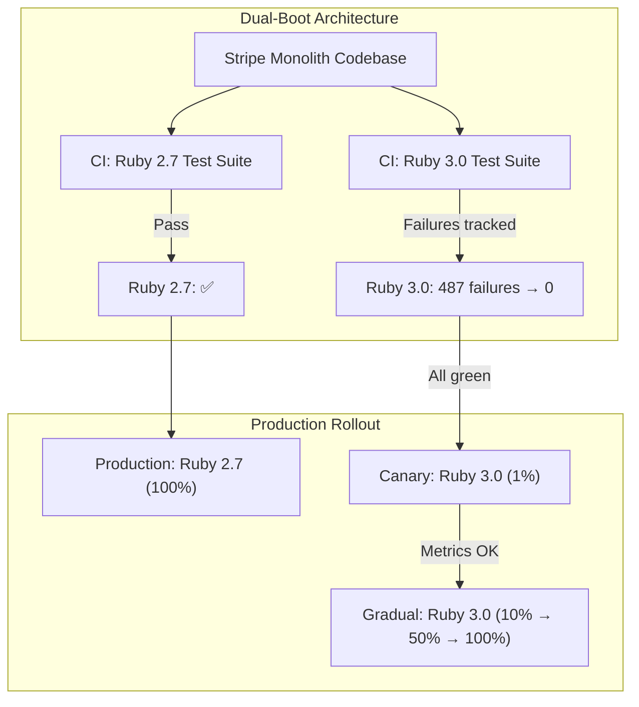

# Stripe's 3-Year Ruby Migration

Unlike the other entries in this War Room section, Stripe's Ruby migration is not a sudden incident — it is a years-long engineering campaign that illustrates how to perform a massive, risky technical migration in a system that processes billions of dollars in payments and cannot afford downtime.

Stripe's codebase is one of the largest Ruby monoliths in the world — millions of lines of Ruby code processing payments for millions of businesses. Starting around 2017 and continuing through multiple Ruby version upgrades, Stripe developed sophisticated tooling and processes for gradually migrating their codebase, culminating in a multi-year effort to adopt Sorbet (their static type checker for Ruby) and upgrade across major Ruby versions.

This is a story about how to change the engine of an airplane while it is flying.

## The Challenge

### The Scale of the Problem

Stripe's main codebase is a Ruby monolith that, by the time of the migration effort, contained millions of lines of Ruby code. This monolith handles:

- Payment processing for millions of businesses
- Regulatory compliance across dozens of countries
- Fraud detection and risk assessment
- Billing, invoicing, and subscription management
- API serving for the Stripe API, one of the most widely used APIs in the world

The monolith is worked on by thousands of engineers daily. Hundreds of deploys happen per day. Any change that breaks the codebase affects Stripe's ability to process payments — a critical financial infrastructure system.

### Why They Could Not Just Upgrade

A typical Ruby version upgrade (e.g., Ruby 2.7 to Ruby 3.0) involves:

- **Breaking changes in language semantics** (keyword argument handling changed significantly in Ruby 2.7→3.0)
- **Gem compatibility issues** (dozens or hundreds of dependencies may need updating)
- **Performance characteristics changes** (the new version may be faster or slower for specific workloads)
- **Behavioral differences** that are not caught by tests (edge cases in numeric conversion, string encoding, etc.)

For a codebase of Stripe's size, upgrading Ruby is not a weekend project. It touches every file, every dependency, and every runtime behavior.

::: danger The Core Risk
Stripe processes billions of dollars in payments. A subtle behavioral change in the Ruby runtime — say, a difference in how floating-point arithmetic rounds, or how keyword arguments are parsed — could cause incorrect payment amounts, failed transactions, or compliance violations. The cost of getting this wrong is measured in actual money and regulatory consequences.
:::

## The Strategy

### 1. Dual-Boot Architecture

Stripe developed a dual-boot system that allowed their monolith to run simultaneously on two different Ruby versions. This meant that:

- The same codebase could be tested against both the current and target Ruby versions
- Engineers could identify incompatibilities incrementally rather than in one big bang
- The migration could proceed gradually, with individual components verified one at a time



The dual-boot approach meant that CI ran every commit against both Ruby versions. Failures in the new version were tracked and prioritized, but they did not block development on the current version. This was critical — the migration could not slow down Stripe's feature development.

### 2. Sorbet — Static Type Checking for Ruby

One of Stripe's most significant investments was **Sorbet**, a static type checker for Ruby that they developed and open-sourced. Sorbet was motivated partly by the migration challenge: without static types, the only way to know if a Ruby version upgrade broke something was to run the code and hope tests covered all paths.

Sorbet gave Stripe the ability to:

- **Detect type mismatches at build time** rather than runtime
- **Identify dead code** that could be safely removed before migration
- **Verify API contracts** between components
- **Catch behavioral differences** between Ruby versions at the type level

```ruby
# Without Sorbet — runtime surprises
def charge_customer(amount, currency)
  # Does 'amount' need to be an Integer? Float? String?
  # What happens if currency is nil?
  # Only runtime will tell.
end

# With Sorbet — compile-time guarantees
sig { params(amount: Integer, currency: String).returns(Charge) }
def charge_customer(amount, currency)
  # Type mismatches caught before code runs
  # Ruby version behavioral differences surfaced during type checking
end
```

### 3. Gradual Adoption and Strictness Levels

Sorbet was not adopted all at once. Stripe used a graduated strictness system:

| Level | Meaning | Coverage |
|-------|---------|----------|
| `# typed: false` | No type checking | Initial default for all files |
| `# typed: true` | Types checked where annotated | Adopted incrementally |
| `# typed: strict` | All methods must have type signatures | Goal for critical paths |
| `# typed: strong` | No untyped code allowed | Applied to payment-critical code |

Teams gradually increased strictness in their files. Automated tooling tracked the percentage of the codebase at each level and identified files that could be promoted to a higher level.

### 4. Automated Codemods

For repetitive, mechanical changes — like updating keyword argument syntax from Ruby 2 to Ruby 3 conventions — Stripe built automated codemods that could transform code patterns across millions of lines:

```ruby
# Ruby 2 style (deprecated in 2.7, removed in 3.0):
def process(options = {})
  amount = options[:amount]
end

# Ruby 3 style (keyword arguments):
def process(amount:)
  # Direct keyword argument
end
```

Automated codemods handled the mechanical transformation. Human review focused on semantic correctness — cases where the automated transformation might change behavior.

### 5. Incremental Production Rollout

Once the test suite passed on the new Ruby version, Stripe did not switch production all at once. They used a staged rollout:

1. **Shadow mode**: Run a fraction of production traffic through the new version and compare responses (without serving the new version's responses to users)
2. **Canary**: Serve 1% of production traffic from the new version
3. **Gradual rollout**: Increase to 5%, 10%, 25%, 50%, 100%, with automatic rollback on error rate spikes
4. **Bake time**: Hold at 100% for a defined period while monitoring for latency regressions, error rates, and financial accuracy

::: tip What Saved Them
The staged production rollout caught several issues that did not surface in testing. Certain edge cases in production traffic — unusual character encodings, extreme numeric values, rare API parameter combinations — only manifested under real-world conditions. The canary deployment with automatic rollback meant these issues caused brief, contained impact rather than company-wide incidents.
:::

## Key Technical Challenges

### The Keyword Argument Problem

The most disruptive change between Ruby 2.7 and Ruby 3.0 was the handling of keyword arguments. In Ruby 2, a hash passed as the last argument could be implicitly converted to keyword arguments. Ruby 3 made this an error.

```ruby
# This code works in Ruby 2, fails in Ruby 3:
def create_payment(amount:, currency:)
  # ...
end

options = { amount: 1000, currency: 'usd' }
create_payment(options)  # Ruby 2: works (hash auto-splatted)
                         # Ruby 3: ArgumentError!

# The fix:
create_payment(**options)  # Explicit splat — works in both versions
```

Across millions of lines of code, finding and fixing every instance of implicit hash-to-keyword conversion was a massive effort. Sorbet's type system helped identify many cases, but not all — particularly in metaprogrammed code.

### Metaprogramming Challenges

Ruby's extensive metaprogramming capabilities (method_missing, define_method, eval) made static analysis incomplete. Code that dynamically generates methods, delegates calls, or uses eval cannot be fully analyzed by Sorbet or automated codemods.

For these cases, Stripe relied on:
- Runtime instrumentation that logged method signatures during production execution
- Comprehensive test coverage
- Manual review of metaprogramming-heavy modules

### Performance Regression Detection

Different Ruby versions have different performance characteristics. Some code runs faster, some runs slower. For a payment processing system, even a small latency regression on a critical path is unacceptable.

Stripe built continuous benchmarking infrastructure that ran performance benchmarks against both Ruby versions and flagged regressions. This was integrated into the CI pipeline so that a code change that introduced a performance regression on the new Ruby version was caught before merge.

## Lessons Learned

### 1. Large migrations must be incremental

::: tip Key Insight
A big-bang migration of millions of lines of code is not feasible for a system that must remain operational. The dual-boot approach — running both versions simultaneously and migrating incrementally — allowed the migration to proceed over months without blocking feature development.
:::

### 2. Invest in tooling before migrating

Stripe invested heavily in Sorbet, automated codemods, and dual-boot infrastructure before starting the actual migration. This upfront investment paid massive dividends during the migration itself.

### 3. Static types make migrations tractable

Without Sorbet, the only way to verify the migration was through testing. With Sorbet, many incompatibilities were caught statically. The combination of static type checking and runtime testing provided far higher confidence than either alone.

### 4. Automated codemods handle the mechanical, humans handle the semantic

Mechanical changes (syntax updates, argument style changes) should be automated. Human review should focus on semantic correctness — cases where the automated transformation might change behavior. This division of labor makes large-scale changes manageable.

### 5. Production validation catches what tests miss

Even with millions of tests and static type checking, some issues only surface under real production conditions. Staged rollouts with automatic rollback are essential for any migration that touches the entire codebase.

## What You Can Learn

1. **Plan multi-year for major language/framework upgrades.** If your codebase is large, budget 6-24 months for a major language version upgrade. Do not treat it as a sprint — treat it as a sustained engineering program with dedicated resources.

2. **Build dual-boot capability early.** If you anticipate a major migration, invest in the ability to run your system on both the old and new versions simultaneously. This gives you a safe migration path and prevents the big-bang switch.

3. **Invest in static analysis.** Whether it is TypeScript for JavaScript, mypy for Python, or Sorbet for Ruby, static type checking dramatically reduces the risk surface of large-scale changes. Adopt it incrementally, starting with your most critical paths.

4. **Automate repetitive transformations.** For a migration affecting thousands of files, manual changes are not scalable. Build codemods using tools like [jscodeshift](https://github.com/facebook/jscodeshift), [Bowler](https://pybowler.io/), or custom AST transformers.

5. **Stage your production rollout.** Never switch 100% of production traffic to a new runtime in one step. Use [canary deployments](/devops/deployment-strategies/canary) with automatic rollback. Monitor error rates, latency percentiles, and business metrics (like payment success rates) at each stage.

6. **Track migration progress visually.** Create dashboards showing how much of the codebase has been migrated, how many test failures remain on the new version, and what percentage of production traffic is running on the new version. Visibility drives momentum.

---

*Sources: [Sorbet — A Fast, Powerful Type Checker for Ruby](https://sorbet.org/) (open-sourced 2019); [Stripe Engineering Blog — Migrating millions of lines of code to TypeScript](https://stripe.com/blog/migrating-to-typescript) (for analogous migration methodology); Stripe engineering talks at RubyConf and Strange Loop on Sorbet adoption and Ruby migration strategies; [Shopify Engineering — Upgrading Shopify to Ruby 3](https://shopify.engineering/upgrading-shopify-to-ruby-3) (for comparison methodology).*
